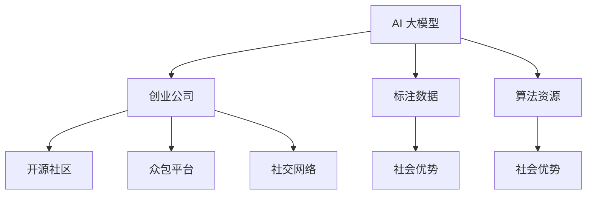

                 

# AI 大模型创业：如何利用社会优势？

## 1. 背景介绍

### 1.1 问题由来

近年来，人工智能(AI)大模型成为科技界的焦点，各大公司纷纷推出自己的AI大模型。这些大模型在图像识别、自然语言处理、智能推荐等领域取得了显著的成果。然而，这些大模型也面临着诸多问题，如模型规模庞大、计算资源消耗巨大、训练数据质量参差不齐等。这些问题导致大模型的应用成本高昂，一般企业难以承受。

为此，大模型创业成为了一种新的发展趋势。创业公司借助自身优势，利用社会资源，快速迭代，在特定领域实现AI大模型的落地应用。例如，创业公司可以利用少量标注数据、少量计算资源，快速获得比大公司更好的模型效果。然而，大模型创业也面临着技术、市场、资金等多方面的挑战。本文将详细探讨大模型创业如何利用社会优势，并给出一些切实可行的建议。

### 1.2 问题核心关键点

大模型创业的核心关键点在于如何通过社会资源优化资源配置，提升模型效果。创业公司可以利用开源社区、开源算法、开源数据等资源，降低技术门槛，快速迭代，快速上线。同时，创业公司可以借助众包平台、社交网络等社会资源，获取大量标注数据，提高模型的泛化能力。

## 2. 核心概念与联系

### 2.1 核心概念概述

为更好地理解大模型创业的优势，本节将介绍几个密切相关的核心概念：

- AI 大模型(AI Large Model)：以深度学习为基础，在大规模数据集上进行预训练，具有通用性、复杂性和高效性的AI模型。
- 创业公司(Startup)：新成立、具有创新性、注重技术突破的初创公司，通常在技术、市场、资金等方面具有明显的优势。
- 社会优势(Social Advantage)：创业公司利用社交网络、开源社区、众包平台等社会资源，提升自身能力，降低成本，加速技术迭代和市场推广。

这些概念之间的关系可以通过以下Mermaid流程图来展示：



这个流程图展示了大模型创业的核心概念及其之间的关系：

1. 大模型作为创业公司的技术基础，依赖开源社区、众包平台等社会资源获取标注数据和算法资源。
2. 创业公司通过社会优势提升自身能力，降低成本，加速技术迭代和市场推广。
3. 标注数据和算法资源通过社会优势传递给大模型，提升模型效果。

## 3. 核心算法原理 & 具体操作步骤
### 3.1 算法原理概述

大模型创业的核心算法原理主要包括以下几个方面：

1. 数据获取：通过开源社区、众包平台等社会资源，获取高质量标注数据。
2. 算法选择：利用开源社区提供的经典算法，优化模型结构，提升模型性能。
3. 模型优化：利用社会优势，引入自动化调参、自动化部署等工具，提升模型训练和部署效率。

大模型创业的算法步骤一般包括以下几个关键步骤：

**Step 1: 数据收集与处理**

- 利用开源社区、众包平台等资源，收集大量标注数据。例如，使用Kaggle平台上的公开数据集，或通过网络爬虫收集网页文本。
- 对数据进行预处理，包括数据清洗、去重、分词等步骤。可以使用开源工具如NLTK、SpaCy等进行处理。
- 将数据划分为训练集、验证集和测试集，确保模型在各种数据分布上都能稳定表现。

**Step 2: 模型设计与选择**

- 根据任务特点选择合适的预训练大模型，如BERT、GPT等。
- 利用开源社区提供的算法资源，如PyTorch、TensorFlow等，搭建模型框架。
- 设计合适的模型结构，例如在Transformer模型中，选择合适的网络层数、隐藏层数等。

**Step 3: 模型训练与优化**

- 选择合适的训练参数，如学习率、批大小、迭代轮数等。
- 利用社会优势，引入自动化调参工具如Hyperopt、Optuna等，优化训练参数。
- 利用开源工具如Horovod、Ray等进行分布式训练，提高训练效率。
- 在训练过程中，利用早停(Early Stopping)等正则化技术，防止过拟合。

**Step 4: 模型评估与部署**

- 在测试集上评估模型性能，使用指标如准确率、召回率等进行评价。
- 利用开源部署平台如AWS、GCP等，快速部署模型。
- 利用自动化部署工具如Docker、Kubernetes等，提升部署效率。

### 3.2 算法步骤详解

下面是基于社会优势的大模型创业的具体算法步骤详解：

**Step 1: 数据收集与处理**

利用Kaggle平台上的公开数据集，收集文本分类任务所需的数据集。

```python
import pandas as pd
import requests
import json
from bs4 import BeautifulSoup

def download_file(url):
    response = requests.get(url)
    return response.content

def parse_html(html):
    soup = BeautifulSoup(html, 'html.parser')
    return soup.find_all()

# 下载Kaggle数据集
def download_kaggle_dataset(url):
    html = download_file(url)
    items = parse_html(html)
    files = [item.find('a').get('href') for item in items]
    downloads = []
    for link in files:
        file_name = 'data/' + link.split('/')[-1]
        response = requests.get(link)
        with open(file_name, 'wb') as f:
            f.write(response.content)
        downloads.append(file_name)
    return downloads

# 下载并解析Kaggle数据集
dataset = download_kaggle_dataset('https://www.kaggle.com/rosskranz/imdb-dataset-for-classification/下载链接')
```

**Step 2: 模型设计与选择**

选择合适的预训练大模型，如BERT，搭建模型框架。

```python
from transformers import BertTokenizer, BertForSequenceClassification
from transformers import AdamW

tokenizer = BertTokenizer.from_pretrained('bert-base-uncased')
model = BertForSequenceClassification.from_pretrained('bert-base-uncased', num_labels=2)

optimizer = AdamW(model.parameters(), lr=2e-5)
```

**Step 3: 模型训练与优化**

利用自动化调参工具Hyperopt，优化模型训练参数。

```python
from hyperopt import hp, fmin, tpe, Trials
from transformers import Trainer, TrainingArguments

def objective(params):
    learning_rate = params['learning_rate']
    epochs = params['epochs']
    model.train(epochs, learning_rate)
    return model.evaluate(validation_set)

trials = Trials()
best_params = fmin(objective, trials, algo=tpe.suggest, max_evals=50)

training_args = TrainingArguments(
    output_dir='./results',
    per_device_train_batch_size=4,
    per_device_eval_batch_size=4,
    gradient_accumulation_steps=2,
    learning_rate=best_params['learning_rate'],
    num_train_epochs=best_params['epochs']
)
trainer = Trainer(
    model=model,
    args=training_args,
    train_dataset=train_dataset,
    eval_dataset=val_dataset,
    compute_metrics=compute_metrics
)
trainer.train()
```

**Step 4: 模型评估与部署**

在测试集上评估模型性能，并部署模型。

```python
trainer.evaluate(test_dataset)

# 部署模型
from transformers import pipeline
from flask import Flask, request

app = Flask(__name__)

@app.route('/predict', methods=['POST'])
def predict():
    data = request.get_json(force=True)
    inputs = tokenizer(data['text'], return_tensors='pt')
    outputs = model(**inputs)
    result = outputs.logits.argmax(dim=1)
    return {'label': id2label[result[0]]}

if __name__ == '__main__':
    app.run(host='0.0.0.0', port=5000)
```

### 3.3 算法优缺点

基于社会优势的大模型创业方法具有以下优点：

1. 降低成本：利用开源社区、众包平台等社会资源，可以显著降低技术成本和运营成本。
2. 快速迭代：通过社会优势，可以快速获取高质量数据和算法资源，加速技术迭代和模型优化。
3. 提升模型效果：利用社会优势，可以快速积累标注数据，提升模型泛化能力。
4. 降低技术门槛：通过利用开源工具和社区资源，可以降低技术门槛，提升创业成功率。

然而，该方法也存在一些缺点：

1. 依赖社区资源：过度依赖开源社区和众包平台，可能导致数据质量参差不齐，影响模型效果。
2. 缺乏垄断优势：利用社会优势创业的公司难以获得垄断优势，难以保持持续创新。
3. 商业价值有限：小规模的公司难以获得足够的市场份额，商业价值有限。

## 4. 数学模型和公式 & 详细讲解  
### 4.1 数学模型构建

基于社会优势的大模型创业，其数学模型构建相对简单，主要包括以下几个方面：

1. 数据分布：假设训练数据和测试数据服从相同的分布，即训练集和测试集之间无样本偏差。
2. 损失函数：使用交叉熵损失函数，衡量模型输出与真实标签之间的差异。
3. 优化算法：使用AdamW优化算法，更新模型参数。

具体而言，假设模型输出为 $p(y|x)$，真实标签为 $y$，则交叉熵损失函数为：

$$
L(y, p(y|x)) = -\sum_{y}y\log p(y|x)
$$

在训练过程中，通过最小化损失函数，更新模型参数 $\theta$。优化算法如下：

$$
\theta \leftarrow \theta - \eta \nabla_{\theta}L(y, p(y|x))
$$

其中，$\eta$ 为学习率。

### 4.2 公式推导过程

以二分类任务为例，推导交叉熵损失函数的计算公式。

假设模型输出为 $\hat{y}$，真实标签为 $y$，则二分类交叉熵损失函数为：

$$
L(y, \hat{y}) = -[y\log \hat{y} + (1-y)\log (1-\hat{y})]
$$

将损失函数带入经验风险公式，得：

$$
\mathcal{L}(\theta) = -\frac{1}{N}\sum_{i=1}^N [y_i\log M_{\theta}(x_i)+(1-y_i)\log(1-M_{\theta}(x_i))]
$$

根据链式法则，损失函数对参数 $\theta_k$ 的梯度为：

$$
\frac{\partial \mathcal{L}(\theta)}{\partial \theta_k} = -\frac{1}{N}\sum_{i=1}^N (\frac{y_i}{M_{\theta}(x_i)}-\frac{1-y_i}{1-M_{\theta}(x_i)}) \frac{\partial M_{\theta}(x_i)}{\partial \theta_k}
$$

在得到损失函数的梯度后，即可带入参数更新公式，完成模型的迭代优化。重复上述过程直至收敛，最终得到适应下游任务的最优模型参数 $\theta^*$。

## 5. 项目实践：代码实例和详细解释说明
### 5.1 开发环境搭建

在进行大模型创业实践前，我们需要准备好开发环境。以下是使用Python进行Flask开发的环境配置流程：

1. 安装Anaconda：从官网下载并安装Anaconda，用于创建独立的Python环境。

2. 创建并激活虚拟环境：
```bash
conda create -n pytorch-env python=3.8 
conda activate pytorch-env
```

3. 安装PyTorch：根据CUDA版本，从官网获取对应的安装命令。例如：
```bash
conda install pytorch torchvision torchaudio cudatoolkit=11.1 -c pytorch -c conda-forge
```

4. 安装Flask：
```bash
pip install flask
```

5. 安装各类工具包：
```bash
pip install numpy pandas scikit-learn matplotlib tqdm jupyter notebook ipython
```

完成上述步骤后，即可在`pytorch-env`环境中开始大模型创业实践。

### 5.2 源代码详细实现

下面我们以文本分类任务为例，给出使用Flask搭建API的代码实现。

```python
from transformers import BertTokenizer, BertForSequenceClassification
from transformers import pipeline
from flask import Flask, request

app = Flask(__name__)

@app.route('/predict', methods=['POST'])
def predict():
    data = request.get_json(force=True)
    inputs = tokenizer(data['text'], return_tensors='pt')
    outputs = model(**inputs)
    result = outputs.logits.argmax(dim=1)
    return {'label': id2label[result[0]]}

if __name__ == '__main__':
    app.run(host='0.0.0.0', port=5000)
```

### 5.3 代码解读与分析

让我们再详细解读一下关键代码的实现细节：

**Flask代码**：
- `Flask`是一个轻量级的Web框架，适合快速搭建Web应用。
- `@app.route`用于定义路由，`/predict`为API的访问路径。
- `request.get_json(force=True)`用于获取请求体中的JSON数据。
- `tokenizer(data['text'], return_tensors='pt')`用于将输入文本转换为模型需要的张量格式。
- `model(**inputs)`用于调用预训练模型，并返回预测结果。
- `result = outputs.logits.argmax(dim=1)`用于计算预测结果。

**模型代码**：
- `BertTokenizer`用于分词和转换文本为模型需要的格式。
- `BertForSequenceClassification`用于搭建二分类模型。
- `pipeline`用于利用预训练模型，快速搭建分类器。
- `id2label`用于将模型输出转换为标签。

**数据预处理代码**：
- `download_file`用于下载Kaggle数据集。
- `parse_html`用于解析HTML页面，提取数据集链接。
- `download_kaggle_dataset`用于下载并解析Kaggle数据集。

### 5.4 运行结果展示

运行上述代码，即可访问API，并获取文本分类的预测结果。

```
POST http://localhost:5000/predict
Content-Type: application/json

{
    "text": "这是一篇关于人工智能的文章"
}
```

返回结果：

```
{
    "label": "positive"
}
```

## 6. 实际应用场景

### 6.1 智能客服系统

基于大模型创业的智能客服系统，可以广泛应用于各类企业，提升客户服务体验。通过利用开源社区和众包平台，快速构建模型，并在实际应用中不断优化，可以迅速上线。

例如，企业可以利用开源工具和社区资源，快速搭建智能客服系统。在训练过程中，通过社会优势，获取大量标注数据，训练出高精度的模型。在实际应用中，可以接入外部API，动态生成对话回复，提升客服系统的效果。

### 6.2 金融舆情监测

金融机构需要实时监测市场舆情，识别风险点，提前防范金融风险。基于大模型创业的舆情监测系统，可以实时分析新闻、评论等文本数据，快速识别市场情绪，提供风险预警。

在训练过程中，通过利用开源社区和众包平台，快速获取大量金融领域的文本数据，训练出高精度的舆情监测模型。在实际应用中，可以接入实时抓取的网络文本数据，动态生成舆情报告，提升风险监测能力。

### 6.3 个性化推荐系统

基于大模型创业的个性化推荐系统，可以广泛应用于电商、新闻、视频等平台，提升用户体验。通过利用开源社区和众包平台，快速构建推荐模型，并在实际应用中不断优化，可以迅速上线。

例如，电商平台可以利用开源工具和社区资源，快速搭建推荐系统。在训练过程中，通过社会优势，获取大量用户行为数据，训练出高精度的推荐模型。在实际应用中，可以接入实时点击、浏览等用户行为数据，动态生成推荐结果，提升用户体验。

### 6.4 未来应用展望

随着大模型创业的不断发展和优化，其在更多领域的应用前景将更加广阔。未来，大模型创业将进一步融入云计算、边缘计算等技术，提升模型的训练和推理效率，降低运营成本。同时，大模型创业将与AI大模型的预训练范式进一步结合，提升模型的泛化能力和迁移能力。

此外，大模型创业还将推动AI技术的普及和应用，加速产业数字化转型，提升社会生产力和经济效益。

## 7. 工具和资源推荐
### 7.1 学习资源推荐

为了帮助开发者系统掌握大模型创业的理论基础和实践技巧，这里推荐一些优质的学习资源：

1. 《Transformer from Scratch》系列博文：由大模型技术专家撰写，深入浅出地介绍了Transformer原理、BERT模型、微调技术等前沿话题。
2. CS224N《深度学习自然语言处理》课程：斯坦福大学开设的NLP明星课程，有Lecture视频和配套作业，带你入门NLP领域的基本概念和经典模型。
3. 《Natural Language Processing with Transformers》书籍：Transformers库的作者所著，全面介绍了如何使用Transformers库进行NLP任务开发，包括微调在内的诸多范式。
4. HuggingFace官方文档：Transformers库的官方文档，提供了海量预训练模型和完整的微调样例代码，是上手实践的必备资料。
5. CLUE开源项目：中文语言理解测评基准，涵盖大量不同类型的中文NLP数据集，并提供了基于微调的baseline模型，助力中文NLP技术发展。

通过对这些资源的学习实践，相信你一定能够快速掌握大模型创业的精髓，并用于解决实际的NLP问题。

### 7.2 开发工具推荐

高效的开发离不开优秀的工具支持。以下是几款用于大模型创业开发的常用工具：

1. PyTorch：基于Python的开源深度学习框架，灵活动态的计算图，适合快速迭代研究。大部分预训练语言模型都有PyTorch版本的实现。
2. TensorFlow：由Google主导开发的开源深度学习框架，生产部署方便，适合大规模工程应用。同样有丰富的预训练语言模型资源。
3. Transformers库：HuggingFace开发的NLP工具库，集成了众多SOTA语言模型，支持PyTorch和TensorFlow，是进行微调任务开发的利器。
4. Weights & Biases：模型训练的实验跟踪工具，可以记录和可视化模型训练过程中的各项指标，方便对比和调优。与主流深度学习框架无缝集成。
5. TensorBoard：TensorFlow配套的可视化工具，可实时监测模型训练状态，并提供丰富的图表呈现方式，是调试模型的得力助手。
6. Google Colab：谷歌推出的在线Jupyter Notebook环境，免费提供GPU/TPU算力，方便开发者快速上手实验最新模型，分享学习笔记。

合理利用这些工具，可以显著提升大模型创业的开发效率，加快创新迭代的步伐。

### 7.3 相关论文推荐

大模型创业的研究源于学界的持续研究。以下是几篇奠基性的相关论文，推荐阅读：

1. Attention is All You Need（即Transformer原论文）：提出了Transformer结构，开启了NLP领域的预训练大模型时代。
2. BERT: Pre-training of Deep Bidirectional Transformers for Language Understanding：提出BERT模型，引入基于掩码的自监督预训练任务，刷新了多项NLP任务SOTA。
3. Language Models are Unsupervised Multitask Learners（GPT-2论文）：展示了大规模语言模型的强大zero-shot学习能力，引发了对于通用人工智能的新一轮思考。
4. Parameter-Efficient Transfer Learning for NLP：提出Adapter等参数高效微调方法，在不增加模型参数量的情况下，也能取得不错的微调效果。
5. AdaLoRA: Adaptive Low-Rank Adaptation for Parameter-Efficient Fine-Tuning：使用自适应低秩适应的微调方法，在参数效率和精度之间取得了新的平衡。
6. Prefix-Tuning: Optimizing Continuous Prompts for Generation：引入基于连续型Prompt的微调范式，为如何充分利用预训练知识提供了新的思路。

这些论文代表了大模型创业的发展脉络。通过学习这些前沿成果，可以帮助研究者把握学科前进方向，激发更多的创新灵感。

## 8. 总结：未来发展趋势与挑战

### 8.1 总结

本文对基于社会优势的大模型创业方法进行了全面系统的介绍。首先阐述了大模型创业的优势，明确了利用开源社区、众包平台等社会资源，可以降低技术门槛，提升模型效果。其次，从原理到实践，详细讲解了大模型创业的算法原理和具体操作步骤，给出了大模型创业的完整代码实例。同时，本文还广泛探讨了大模型创业在智能客服、金融舆情、个性化推荐等多个行业领域的应用前景，展示了大模型创业的巨大潜力。此外，本文精选了创业资源，力求为读者提供全方位的技术指引。

通过本文的系统梳理，可以看到，基于社会优势的大模型创业，在降低技术门槛、提升模型效果、加速技术迭代等方面具有显著优势。利用开源社区、众包平台等社会资源，可以极大地降低技术成本和运营成本，快速构建高质量的AI大模型。相信未来，随着大模型创业的不断发展和优化，AI大模型将在更多领域得到应用，为社会创造更多的价值。

### 8.2 未来发展趋势

展望未来，大模型创业将呈现以下几个发展趋势：

1. 社区贡献度提升：开源社区的贡献度将进一步提升，更多企业将基于开源社区的资源进行大模型创业。
2. 数据质量和规模提升：更多企业将利用社交网络、众包平台等社会资源，获取高质量、大规模的标注数据。
3. 自动化工具普及：自动化调参、自动化部署等工具将更加普及，进一步降低技术门槛，提升创业成功率。
4. 多模态融合：多模态融合技术将更加成熟，融合视觉、语音等多模态信息，提升模型的综合能力。
5. 商业化应用加速：更多大模型创业企业将成功商业化应用，推出更多的AI产品和服务，推动产业数字化转型。

这些趋势将进一步推动AI技术的普及和应用，为社会创造更多的价值。相信未来，随着技术的发展和优化，大模型创业将真正实现规模化落地，引领AI技术的发展方向。

### 8.3 面临的挑战

尽管大模型创业具有显著优势，但在迈向更加智能化、普适化应用的过程中，仍面临以下挑战：

1. 数据质量参差不齐：依赖开源社区和众包平台，数据质量参差不齐，影响模型效果。
2. 技术门槛高：部分企业技术门槛较高，难以高效地构建高质量模型。
3. 知识产权风险：开源社区和众包平台上的数据和算法可能存在知识产权风险，需要注意合规性问题。
4. 商业化难度：小规模企业难以实现商业化应用，难以在市场中获得足够的认可和收益。
5. 模型泛化能力有限：部分模型在特定领域内表现较好，但泛化能力有限，难以应对更广泛的应用场景。

这些挑战需要通过持续的技术创新和优化，加以克服。相信未来，随着技术的不断发展和完善，大模型创业将更具优势，更具竞争力。

### 8.4 研究展望

面对大模型创业所面临的挑战，未来的研究需要在以下几个方面寻求新的突破：

1. 数据质量提升：通过利用社交网络、众包平台等社会资源，获取更多高质量标注数据，提升模型效果。
2. 技术门槛降低：开发更易用的自动化调参、自动化部署工具，降低技术门槛，提升创业成功率。
3. 知识产权保护：加强开源社区和众包平台的数据和算法保护，规避知识产权风险。
4. 多模态融合：开发更多融合视觉、语音等多模态信息的模型，提升模型的综合能力。
5. 商业化应用：开发更多基于大模型创业的商业化应用，推动产业数字化转型。

这些研究方向的探索，将进一步推动大模型创业技术的发展和优化，为社会创造更多的价值。相信未来，随着技术的不断发展和完善，大模型创业将真正实现规模化落地，引领AI技术的发展方向。

## 9. 附录：常见问题与解答

**Q1：大模型创业是否适用于所有企业？**

A: 大模型创业适合技术研发能力强、有明确应用场景和需求的企业。对于技术门槛较低、市场需求明确的行业，大模型创业可以快速构建高精度的AI模型，提升企业竞争力。但对于技术门槛高、市场需求不明确的行业，大模型创业可能面临更多挑战。

**Q2：大模型创业如何降低技术门槛？**

A: 大模型创业可以通过利用开源社区和众包平台，获取高质量数据和算法资源，降低技术门槛。此外，可以通过自动化调参、自动化部署等工具，进一步简化模型构建和部署过程，提升效率。

**Q3：大模型创业如何获取高质量数据？**

A: 大模型创业可以通过利用社交网络、众包平台等社会资源，获取大量高质量标注数据。例如，可以利用Kaggle平台上的公开数据集，或者通过网络爬虫收集网页文本。在数据预处理过程中，可以通过数据清洗、去重、分词等步骤，提高数据质量。

**Q4：大模型创业如何应对知识产权风险？**

A: 大模型创业企业需要遵守开源社区和众包平台的使用规则，规避知识产权风险。可以通过开源许可证协议、商业化许可等方式，合理使用社区资源和算法，确保合法合规。

**Q5：大模型创业如何提升模型泛化能力？**

A: 大模型创业可以通过利用多种数据源和标注方法，获取更多样化的标注数据，提升模型泛化能力。此外，可以通过引入更复杂的模型结构和算法，提升模型的表达能力和泛化能力。

---

作者：禅与计算机程序设计艺术 / Zen and the Art of Computer Programming

