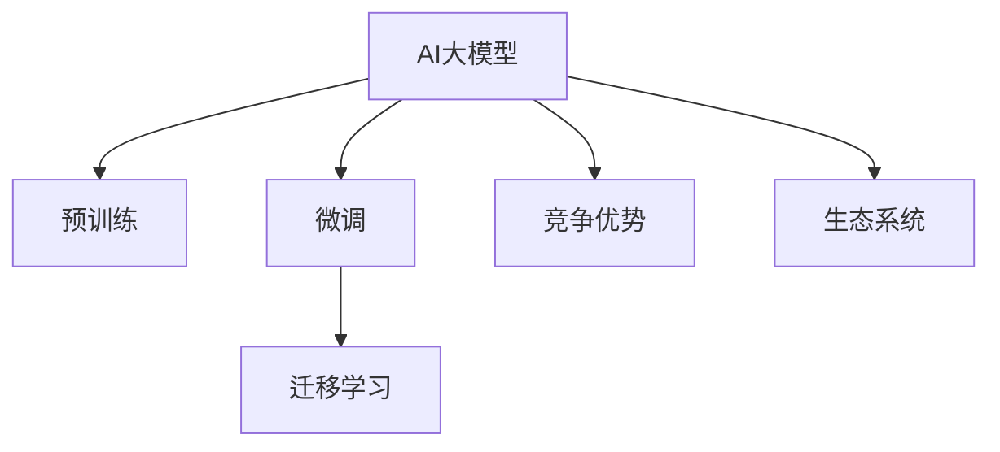

                 

## 1. 背景介绍

在人工智能（AI）快速发展的大背景下，AI大模型正成为各大科技巨头和创业公司的核心竞争工具。从预训练的深度学习模型，到基于大模型的应用，如自然语言处理（NLP）、计算机视觉（CV）、语音识别等，其底层技术和算法都在不断演进和优化。然而，构建和运营一个成功的AI大模型创业公司，并非易事。本文将从核心概念、核心算法原理、操作步骤、数学模型等方面，系统介绍AI大模型的创业策略，帮助读者理解如何利用竞争优势。

## 2. 核心概念与联系

### 2.1 核心概念概述

为了更好地理解AI大模型的创业策略，本节将介绍几个关键概念及其相互联系：

- **AI大模型**：如GPT-3、BERT、T5等，通过自监督学习在海量无标签数据上预训练得到的模型，具备强大的语言理解与生成能力。

- **预训练**：指在大规模无标签数据上，使用自监督任务（如掩码语言模型）训练通用模型的过程。预训练使得模型学习到通用的语言表示。

- **微调**：在预训练模型的基础上，使用下游任务的少量标注数据进行有监督训练，优化模型在特定任务上的性能。

- **迁移学习**：通过在大模型上微调，使得模型具备领域特定的知识，以应对新的问题。

- **竞争优势**：指企业通过技术优势、产品差异化、市场策略、运营效率等方面的改进，在竞争中占据有利地位。

- **生态系统**：指企业构建的技术、产品、服务等相互依赖的系统和环境，以支持大模型创业公司的持续发展和市场竞争。

这些概念之间相互联系，共同构成了AI大模型的创业框架。

### 2.2 核心概念原理和架构的 Mermaid 流程图

这个流程图展示了AI大模型从预训练到微调，再到利用竞争优势和生态系统构建的全过程：

1. **预训练**：在大规模数据上训练模型，学习语言表示。
2. **微调**：在特定任务上使用少量标注数据微调，优化模型。
3. **迁移学习**：将预训练模型应用于新任务，学习领域特定知识。
4. **竞争优势**：利用模型和技术优势，构建产品差异化，提升运营效率。
5. **生态系统**：构建技术、产品、服务相互依赖的系统，增强竞争力。

## 3. 核心算法原理 & 具体操作步骤

### 3.1 算法原理概述

AI大模型的创业策略主要基于两个核心算法：预训练和微调。预训练通过在海量无标签数据上学习通用语言表示，而微调则通过有监督数据训练模型，使其适用于特定任务。这两个算法相辅相成，共同构成了AI大模型的核心技术。

### 3.2 算法步骤详解

AI大模型的创业步骤主要包括：

1. **数据收集与预处理**：收集无标签数据，使用预训练任务（如掩码语言模型）进行预训练。

2. **模型微调**：将预训练模型在特定任务上微调，使用少量标注数据进行有监督学习。

3. **产品开发与优化**：基于微调后的模型，开发产品原型，并根据用户反馈进行持续优化。

4. **市场推广与运营**：利用营销策略和运营效率，推广产品，提升市场份额。

5. **生态系统构建**：建立技术、产品、服务相互依赖的系统，增强竞争力和用户粘性。

### 3.3 算法优缺点

AI大模型的创业策略有以下优点：

- **高效性**：预训练模型在无标签数据上学习通用语言表示，提升微调效率。
- **灵活性**：微调模型可以适应各种任务，快速迭代产品。
- **可扩展性**：基于通用语言模型，可以轻松扩展到其他领域和任务。

缺点包括：

- **数据需求**：预训练和微调需要大量数据，初期成本较高。
- **计算资源**：预训练和微调模型参数量大，对计算资源要求高。
- **时间成本**：模型训练和迭代需要大量时间，短期内难以见效。

### 3.4 算法应用领域

AI大模型的创业策略适用于多种场景，包括但不限于：

- **自然语言处理**：如文本分类、情感分析、机器翻译等。
- **计算机视觉**：如图像分类、目标检测、图像生成等。
- **语音识别**：如自动语音识别、文本转语音等。
- **推荐系统**：如商品推荐、内容推荐等。
- **智能客服**：如聊天机器人、智能问答等。

## 4. 数学模型和公式 & 详细讲解 & 举例说明

### 4.1 数学模型构建

AI大模型的数学模型主要基于神经网络架构，如Transformer。以自然语言处理任务为例，常用的模型包括BERT、GPT-3、T5等。

### 4.2 公式推导过程

以BERT为例，其数学模型推导如下：

1. **输入表示**：将输入文本序列转换为向量表示，使用Transformer编码器进行编码。
2. **目标表示**：将目标序列（如标签序列）转换为向量表示。
3. **损失函数**：使用交叉熵损失函数计算模型输出与目标之间的差异。

### 4.3 案例分析与讲解

以BERT为例，其预训练任务为掩码语言模型，微调任务为情感分析。预训练任务通过在掩码位置填充预测向量，优化模型表示；微调任务则通过在情感分类目标上进行训练，优化模型在特定任务上的表现。

## 5. 项目实践：代码实例和详细解释说明

### 5.1 开发环境搭建

开发环境搭建主要包括安装Python、TensorFlow、PyTorch、BERT等。

1. **安装Python**：使用Anaconda创建虚拟环境。
2. **安装TensorFlow和PyTorch**：使用pip或conda安装，选择合适版本。
3. **安装BERT**：使用HuggingFace库，下载预训练模型。

### 5.2 源代码详细实现

以情感分析为例，使用BERT进行微调：

1. **数据预处理**：将数据分为训练集和测试集，进行token化、分词等预处理。
2. **模型微调**：使用微调后的BERT模型进行情感分析，输出结果。

### 5.3 代码解读与分析

代码实现主要分为三个步骤：数据预处理、模型微调、结果评估。

1. **数据预处理**：使用Pandas和NumPy进行数据处理。
2. **模型微调**：使用HuggingFace库进行微调，设置超参数，定义模型结构。
3. **结果评估**：使用sklearn库进行分类器评估，输出性能指标。

### 5.4 运行结果展示

运行结果主要包含模型性能指标、训练日志、预测结果等。

## 6. 实际应用场景

### 6.1 金融市场分析

AI大模型在金融市场分析中具有广泛应用，如股票预测、风险评估等。通过微调模型，学习市场数据中的潜在规律，预测股票价格变化，评估投资风险。

### 6.2 医疗诊断

AI大模型在医疗诊断中也有重要应用，如医学影像分析、基因分析等。通过微调模型，学习医疗数据中的特征，辅助医生诊断，提升医疗效率。

### 6.3 智能制造

AI大模型在智能制造中也有广泛应用，如质量检测、设备维护等。通过微调模型，学习设备数据中的异常模式，提高生产效率。

### 6.4 未来应用展望

未来AI大模型的应用将更加广泛，涵盖更多领域和任务。随着技术进步和数据积累，AI大模型将在更多领域发挥重要作用。

## 7. 工具和资源推荐

### 7.1 学习资源推荐

1. **TensorFlow官方文档**：详细介绍了TensorFlow的安装、使用、优化等。
2. **PyTorch官方文档**：介绍了PyTorch的安装、使用、优化等。
3. **HuggingFace官方文档**：介绍了BERT、GPT-3等预训练模型的微调、应用等。

### 7.2 开发工具推荐

1. **Anaconda**：用于创建虚拟环境，方便不同项目之间的依赖隔离。
2. **Jupyter Notebook**：用于交互式编程和数据可视化。
3. **TensorBoard**：用于模型训练和调优的可视化工具。

### 7.3 相关论文推荐

1. **《深度学习》**：由Goodfellow等编写，详细介绍了深度学习的基本原理和算法。
2. **《自然语言处理》**：由Michael Collins编写，介绍了自然语言处理的基本概念和算法。
3. **《计算机视觉》**：由Hinton等编写，介绍了计算机视觉的基本概念和算法。

## 8. 总结：未来发展趋势与挑战

### 8.1 研究成果总结

AI大模型的创业策略在数据驱动和算法优化方面取得了重要进展，预训练和微调技术在各领域得到了广泛应用。然而，模型的训练和优化仍面临诸多挑战。

### 8.2 未来发展趋势

未来AI大模型的发展趋势包括：

1. **更大规模的模型**：随着计算资源和数据的积累，未来AI大模型的参数量将进一步增大，能够处理更复杂的任务。
2. **更高效的训练方法**：如混合精度训练、分布式训练等，能够提升模型的训练效率。
3. **更广泛的生态系统**：构建更完整的技术、产品、服务生态系统，增强竞争力和用户粘性。
4. **更强大的竞争优势**：通过算法和产品的不断优化，提升市场竞争力和用户满意度。

### 8.3 面临的挑战

AI大模型在创业过程中面临以下挑战：

1. **数据获取**：获取高质量的数据需要大量时间和资源。
2. **计算资源**：大规模模型的训练和优化需要高性能计算资源。
3. **模型优化**：模型的训练和优化需要深入的算法和工程实践。
4. **市场竞争**：在激烈的市场竞争中保持竞争力需要持续的技术创新。

### 8.4 研究展望

未来AI大模型的研究展望包括：

1. **多模态学习**：将图像、语音、文本等不同模态的数据进行融合，提升模型的泛化能力。
2. **自动优化**：使用自动机器学习（AutoML）等技术，优化模型的训练过程。
3. **联邦学习**：通过分布式训练，提升模型的训练效率和安全性。
4. **边缘计算**：在边缘设备上进行模型训练和推理，提升模型的响应速度和隐私保护。

## 9. 附录：常见问题与解答

**Q1：如何选择合适的预训练模型？**

A: 选择合适的预训练模型需要考虑以下几个因素：

- **领域相关性**：选择与任务领域相关的预训练模型，如金融领域的BERT、医学领域的RoBERTa等。
- **模型大小**：根据任务复杂度和计算资源选择合适大小的模型，如BERT small、GPT-2中等。
- **性能表现**：查看预训练模型在相关任务上的表现，选择表现优秀的模型。

**Q2：微调过程中如何避免过拟合？**

A: 避免过拟合的方法包括：

- **数据增强**：通过数据增强技术，扩充训练数据集。
- **正则化**：使用L2正则、Dropout等技术，防止模型过拟合。
- **早停策略**：使用早停策略，及时停止模型训练，避免过拟合。
- **模型压缩**：使用模型压缩技术，如剪枝、量化等，减小模型大小。

**Q3：如何快速构建AI大模型创业公司？**

A: 快速构建AI大模型创业公司需要考虑以下几个因素：

- **技术团队**：组建一支具有技术背景和创业经验的技术团队。
- **数据资源**：获取和整合高质量的数据资源。
- **资金支持**：获取足够的资金支持，用于模型训练和产品开发。
- **市场定位**：明确公司的市场定位和目标客户群。

**Q4：如何提升AI大模型的市场竞争力？**

A: 提升AI大模型的市场竞争力需要考虑以下几个因素：

- **产品创新**：不断优化和创新产品，提升用户体验。
- **市场策略**：制定有效的市场策略，如品牌建设、推广活动等。
- **客户服务**：提供优质的客户服务，提升用户满意度和忠诚度。
- **生态系统**：构建完整的生态系统，增强竞争力和用户粘性。

## 文章末尾署名

作者：禅与计算机程序设计艺术 / Zen and the Art of Computer Programming

