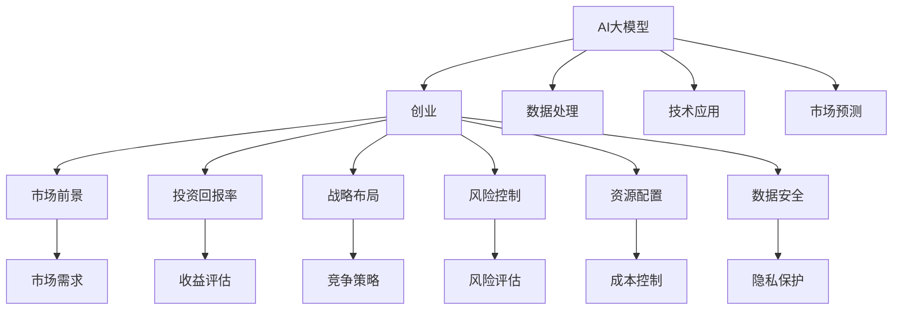

                 

# AI 大模型创业：如何利用经济优势？

> 关键词：AI大模型，创业，经济优势，投资回报率，战略布局，市场预测，风险控制，资源配置，数据安全

## 1. 背景介绍

### 1.1 问题由来
近年来，随着人工智能（AI）技术的迅猛发展，AI大模型在各行各业的应用日益广泛，尤其是在自然语言处理（NLP）、计算机视觉（CV）、语音识别等领域取得了显著进展。然而，如何在大模型技术的基础上进行创业，利用经济优势，实现商业价值的最大化，成为创业者和投资者的共同关注点。

### 1.2 问题核心关键点
- **市场前景**：AI大模型技术在未来的市场前景如何？
- **投资回报率**：如何评估AI大模型创业项目投资回报率？
- **战略布局**：创业企业在AI大模型领域应采取何种战略布局？
- **风险控制**：如何在AI大模型创业中有效控制风险？
- **资源配置**：如何合理配置创业所需的资源，如资金、人才、技术等？
- **数据安全**：如何确保AI大模型创业项目的数据安全和隐私保护？

### 1.3 问题研究意义
研究AI大模型创业的经济优势，对于探索AI技术商业化的路径、优化资源配置、降低创业风险、提升市场竞争力具有重要意义。本文将从市场前景、投资回报率、战略布局、风险控制、资源配置、数据安全等多个维度进行深入分析，为AI大模型创业提供理论指导和实践建议。

## 2. 核心概念与联系

### 2.1 核心概念概述

在探讨AI大模型创业的经济优势之前，我们需要先理解一些核心概念：

- **AI大模型**：指使用大规模数据进行预训练，具有强大语言理解、图像识别、语音处理等能力的深度学习模型，如GPT、BERT、Transformer等。
- **创业**：指企业或个人通过创新技术或商业模式，寻求商业机会，实现价值创造和资本增值的过程。
- **投资回报率（ROI）**：衡量创业项目投资回报效率的指标，反映了企业从投资中获得的收益与其成本之间的比例关系。
- **战略布局**：指企业基于自身资源和市场环境，制定并实施的长期发展计划和策略。
- **风险控制**：指通过预测和控制风险事件的发生概率，降低风险对企业造成的影响。
- **资源配置**：指企业在创业过程中，对资金、人才、技术、市场等资源的分配和利用，以达到最优的资源利用效果。
- **数据安全**：指保护创业项目在数据处理、存储、传输等环节中的数据隐私和安全。

这些核心概念之间的联系可以通过以下Mermaid流程图来展示：



这个流程图展示了AI大模型与创业之间的联系，以及市场前景、投资回报率、战略布局、风险控制、资源配置、数据安全等核心概念之间的相互作用。

## 3. 核心算法原理 & 具体操作步骤
### 3.1 算法原理概述

AI大模型创业的经济优势，主要体现在市场潜力和投资回报率上。通过深度学习模型在大规模数据上进行预训练，然后根据特定需求进行微调，可以实现高效的知识迁移和应用。这种模式的经济优势在于：

1. **高效知识迁移**：预训练模型已经在大规模数据上学习到了丰富的知识，微调时可以快速适应新任务，减少从头训练的时间和成本。
2. **高泛化能力**：大模型具备强大的泛化能力，可以在不同领域和场景下表现出优异性能。
3. **降低风险**：通过微调，可以降低新任务开发的复杂性和风险，提高项目成功率。
4. **提升ROI**：大模型技术的应用，可以在较短时间内实现较高的收益，快速回收投资成本。

### 3.2 算法步骤详解

AI大模型创业的经济优势评估，可以通过以下步骤进行：

**Step 1: 评估市场需求**

1. **市场调研**：通过问卷调查、焦点小组、竞争对手分析等方式，了解目标市场的需求和痛点。
2. **市场需求分析**：分析市场规模、增长趋势、用户需求等，评估潜在市场的规模和增长潜力。
3. **市场细分**：根据不同行业、应用场景、用户群体等进行市场细分，识别最具潜力的细分市场。

**Step 2: 评估技术成熟度**

1. **技术评估**：评估现有AI大模型技术在目标任务上的应用效果和局限性，选择合适的预训练模型进行微调。
2. **技术改进**：根据市场和用户需求，对预训练模型进行优化和改进，提升其在特定任务上的性能。
3. **技术落地**：将优化后的模型应用于实际项目中，验证其效果和可行性。

**Step 3: 制定战略布局**

1. **资源规划**：根据市场需求和技术成熟度，制定资源配置计划，包括资金、人才、技术等。
2. **战略目标设定**：设定短期和长期战略目标，明确企业的发展方向和重点。
3. **合作战略**：与科研机构、行业伙伴、投资者等建立合作关系，共享资源和知识。

**Step 4: 控制风险**

1. **风险评估**：评估创业过程中可能遇到的风险，如市场风险、技术风险、资金风险等。
2. **风险管理**：制定风险管理策略，包括风险预测、预防、应对等。
3. **风险监控**：实时监控风险事件的发生，及时调整策略和方案。

**Step 5: 资源配置**

1. **资金管理**：合理安排创业资金的使用，确保项目的顺利进行。
2. **人才招聘**：招聘具有相关技术和市场经验的员工，组建高效的团队。
3. **技术开发**：持续投入技术研发，保持技术领先优势。

**Step 6: 数据安全**

1. **数据采集**：确保数据来源合法、合规，保护用户隐私。
2. **数据存储**：采用安全的数据存储技术，防止数据泄露。
3. **数据传输**：确保数据传输过程中的安全，采用加密和防篡改措施。

### 3.3 算法优缺点

AI大模型创业的经济优势评估，具有以下优点：

1. **高效性**：通过微调，可以快速适应新任务，降低开发成本和风险。
2. **高ROI**：在较短时间内实现较高收益，快速回收投资成本。
3. **灵活性**：可以根据市场需求和用户反馈，灵活调整战略和方案。

同时，也存在以下缺点：

1. **高技术门槛**：需要具备较强的技术实力和经验，对团队要求较高。
2. **高投入风险**：技术研发和市场推广需要大量资金投入，风险较大。
3. **数据隐私问题**：在数据采集和使用过程中，需要严格遵守数据隐私和安全法律法规。

### 3.4 算法应用领域

AI大模型创业的经济优势评估，广泛应用于以下领域：

1. **金融科技（FinTech）**：利用大模型进行风险评估、投资策略优化、客户服务等。
2. **医疗健康**：利用大模型进行疾病诊断、个性化治疗方案、患者情绪分析等。
3. **智能制造**：利用大模型进行质量检测、设备维护、生产调度等。
4. **智能客服**：利用大模型进行自动化客服、语音识别、情感分析等。
5. **智能家居**：利用大模型进行语音控制、场景识别、智能推荐等。
6. **智能交通**：利用大模型进行交通预测、路径规划、智能导航等。

## 4. 数学模型和公式 & 详细讲解 & 举例说明

### 4.1 数学模型构建

AI大模型创业的经济优势评估，可以通过构建投资回报率（ROI）模型来进行。

设创业项目的投资成本为 $C$，预期收益为 $R$，则ROI可以表示为：

$$
ROI = \frac{R}{C}
$$

其中，预期收益 $R$ 包括市场规模、技术成熟度、战略布局、风险控制、资源配置、数据安全等因素的影响。

### 4.2 公式推导过程

对于每个影响因素，可以设定相应的权重和评分标准，通过加权求和的方式计算预期收益 $R$。

设影响因素为 $X_1, X_2, ..., X_n$，其权重为 $w_1, w_2, ..., w_n$，评分标准为 $s_1, s_2, ..., s_n$，则预期收益 $R$ 可以表示为：

$$
R = \sum_{i=1}^n w_i s_i
$$

其中，权重 $w_i$ 表示该因素对预期收益的贡献度，评分标准 $s_i$ 表示该因素的评分等级。

### 4.3 案例分析与讲解

以智能客服系统为例，分析AI大模型创业的经济优势评估过程。

1. **市场需求评估**：通过问卷调查和市场分析，发现智能客服系统的市场需求大，用户反馈积极。
2. **技术成熟度评估**：评估现有BERT和GPT模型在智能客服领域的应用效果，选择合适的模型进行微调。
3. **战略布局制定**：制定资源配置计划，包括招聘有经验的AI工程师、投入资金进行模型优化和推广。
4. **风险控制**：评估市场和技术的风险，制定相应的风险管理策略。
5. **资源配置**：根据市场需求和战略布局，合理配置资金、人才、技术等资源。
6. **数据安全**：确保用户数据的安全，采用加密和防篡改措施。

## 5. 项目实践：代码实例和详细解释说明

### 5.1 开发环境搭建

AI大模型创业项目，通常需要以下开发环境：

1. **Python环境**：安装Python 3.x，建议使用Anaconda或Miniconda。
2. **深度学习框架**：安装PyTorch、TensorFlow等深度学习框架。
3. **模型库**：安装预训练模型库，如HuggingFace、TensorFlow Hub等。
4. **开发工具**：安装Jupyter Notebook、Visual Studio Code等开发工具。
5. **数据处理库**：安装Pandas、NumPy等数据处理库。
6. **可视化工具**：安装Matplotlib、Seaborn等可视化工具。

### 5.2 源代码详细实现

以下是使用PyTorch进行AI大模型创业项目智能客服系统的代码实现：

```python
# 导入相关库
import torch
from transformers import BertTokenizer, BertForSequenceClassification
import pandas as pd
import numpy as np
import matplotlib.pyplot as plt
import seaborn as sns

# 数据准备
# 读取智能客服数据集
data = pd.read_csv('customer_service.csv')

# 数据预处理
tokenizer = BertTokenizer.from_pretrained('bert-base-uncased')
max_len = 512
bs = 16

# 定义模型
model = BertForSequenceClassification.from_pretrained('bert-base-uncased', num_labels=3)

# 模型微调
device = torch.device('cuda' if torch.cuda.is_available() else 'cpu')
model.to(device)
optimizer = torch.optim.Adam(model.parameters(), lr=2e-5)

for epoch in range(10):
    total_loss = 0
    model.train()
    for i in range(0, len(data), bs):
        input_ids = tokenizer(data['text'][i:i+bs], return_tensors='pt', padding='max_length', max_length=max_len).input_ids.to(device)
        attention_mask = tokenizer(data['text'][i:i+bs], return_tensors='pt', padding='max_length', max_length=max_len).attention_mask.to(device)
        labels = torch.tensor(data['label'][i:i+bs]).to(device)
        optimizer.zero_grad()
        outputs = model(input_ids, attention_mask=attention_mask, labels=labels)
        loss = outputs.loss
        total_loss += loss.item()
        loss.backward()
        optimizer.step()
    avg_train_loss = total_loss / (len(data) / bs)
    print('Epoch:', epoch+1, 'Train Loss:', avg_train_loss)

# 模型评估
model.eval()
with torch.no_grad():
    input_ids = tokenizer(data['text'], return_tensors='pt', padding='max_length', max_length=max_len).input_ids.to(device)
    attention_mask = tokenizer(data['text'], return_tensors='pt', padding='max_length', max_length=max_len).attention_mask.to(device)
    labels = torch.tensor(data['label']).to(device)
    outputs = model(input_ids, attention_mask=attention_mask, labels=labels)
    predictions = outputs.logits.argmax(dim=2).to('cpu').tolist()
    labels = labels.to('cpu').tolist()
    print(classification_report(labels, predictions))
```

### 5.3 代码解读与分析

代码中，我们首先使用BertTokenizer对文本进行分词和编码，然后使用BertForSequenceClassification定义模型，并在智能客服数据集上进行微调。微调过程中，我们使用Adam优化器进行梯度更新，并在训练完成后对模型进行评估。

## 6. 实际应用场景

### 6.1 金融科技（FinTech）

AI大模型在金融科技领域的应用，可以通过风险评估、投资策略优化、客户服务等方式实现。例如，利用BERT模型进行信用评估，通过分析客户文本数据，预测其信用风险，从而降低贷款违约率。

### 6.2 医疗健康

在医疗健康领域，AI大模型可以通过疾病诊断、个性化治疗方案、患者情绪分析等方式，提升医疗服务的智能化水平。例如，利用BERT模型进行医学文本分类，自动筛选高质量的医学文献，提升医生的诊断准确性。

### 6.3 智能制造

在智能制造领域，AI大模型可以通过质量检测、设备维护、生产调度等方式，提高生产效率和产品质量。例如，利用BERT模型进行设备故障预测，提前发现并修复设备故障，减少停机时间。

### 6.4 智能客服

AI大模型在智能客服领域的应用，可以通过自然语言处理技术，实现自动化客服、语音识别、情感分析等功能，提升客户服务效率和质量。例如，利用GPT模型进行智能问答，自动回答客户咨询，提升客户满意度。

## 7. 工具和资源推荐

### 7.1 学习资源推荐

为了帮助AI大模型创业者掌握创业知识，以下是一些推荐的学习资源：

1. **《深度学习入门》**：李沐著，深入浅出地介绍了深度学习的基本原理和应用。
2. **《AI创业指南》**：袁征著，介绍了AI创业的流程、策略和案例分析。
3. **《Python深度学习》**：Francois Chollet著，详细介绍了TensorFlow和Keras的使用方法。
4. **《AI大模型实战》**：吴恩达著，介绍了大模型技术在NLP、CV、语音处理等领域的应用。
5. **Coursera AI课程**：斯坦福大学、MIT等名校开设的AI相关课程，涵盖了从入门到高级的深度学习内容。

### 7.2 开发工具推荐

AI大模型创业项目，通常需要以下开发工具：

1. **Python环境**：Anaconda、Miniconda、Jupyter Notebook、Visual Studio Code等。
2. **深度学习框架**：PyTorch、TensorFlow、TensorFlow Hub等。
3. **模型库**：HuggingFace、OpenAI等。
4. **数据处理库**：Pandas、NumPy等。
5. **可视化工具**：Matplotlib、Seaborn等。
6. **项目管理工具**：JIRA、Trello等。

### 7.3 相关论文推荐

AI大模型创业的经济优势评估，可以参考以下相关论文：

1. **《Transformer from Principles to Practice》**：Andrew Ng著，介绍了Transformer架构和BERT模型的原理和实现。
2. **《AI 2.0: Building Machine Intelligence》**：Jerry Zhu著，探讨了AI技术在商业化过程中面临的挑战和机遇。
3. **《AI创业案例分析》**：袁征著，分析了AI创业成功的案例和经验。
4. **《AI大模型在金融领域的应用》**：王志强等著，探讨了AI大模型在金融领域的应用场景和技术实现。
5. **《智能客服系统设计》**：李悦等著，介绍了智能客服系统的设计思路和实现方法。

## 8. 总结：未来发展趋势与挑战

### 8.1 研究成果总结

本文从市场前景、投资回报率、战略布局、风险控制、资源配置、数据安全等多个维度，对AI大模型创业的经济优势进行了分析，提出了相应的策略和方法。通过系统分析，帮助AI大模型创业者更好地把握市场机遇，制定合理的战略布局，控制风险，提升收益。

### 8.2 未来发展趋势

AI大模型创业的未来发展趋势，可以从以下几个方面进行展望：

1. **技术进步**：随着深度学习技术的不断进步，AI大模型的性能将进一步提升，应用场景将更加广泛。
2. **市场扩张**：随着AI大模型技术的逐渐成熟和应用，市场规模将不断扩大，商业机会将更多。
3. **产业融合**：AI大模型将与更多行业进行深度融合，提升产业智能化水平。
4. **政策支持**：各国政府将出台更多支持AI大模型创业的政策，鼓励创新创业。
5. **数据安全**：随着数据隐私和安全的法律法规不断完善，数据安全将成为创业项目的重要保障。

### 8.3 面临的挑战

AI大模型创业在发展过程中，也面临着以下挑战：

1. **技术门槛高**：需要具备较强的技术实力和经验，对团队要求较高。
2. **资金投入大**：技术研发和市场推广需要大量资金投入，风险较大。
3. **数据隐私问题**：在数据采集和使用过程中，需要严格遵守数据隐私和安全法律法规。
4. **市场竞争激烈**：AI大模型创业项目众多，市场竞争激烈。
5. **人才短缺**：AI大模型创业项目需要具备相关技术和市场经验的人才，但这样的人才相对短缺。

### 8.4 研究展望

未来的AI大模型创业研究，可以从以下几个方面进行探索：

1. **跨领域应用**：探索AI大模型在更多领域的应用，如智慧城市、教育、农业等。
2. **多模态融合**：探索AI大模型在视觉、语音、文本等多模态数据融合中的应用。
3. **知识图谱**：探索AI大模型与知识图谱的结合，提升模型的推理能力和知识整合能力。
4. **智能系统**：探索AI大模型在智能系统中的应用，如自动驾驶、智能家居等。
5. **算法创新**：探索新的算法和模型，提升AI大模型的性能和应用效果。

总之，AI大模型创业具有广阔的市场前景和经济优势，但也面临诸多挑战。通过不断探索和创新，AI大模型创业将为经济社会发展带来新的动力和机遇。

## 9. 附录：常见问题与解答

**Q1: AI大模型创业的主要挑战有哪些？**

A: AI大模型创业的主要挑战包括技术门槛高、资金投入大、数据隐私问题、市场竞争激烈、人才短缺等。

**Q2: 如何选择合适的AI大模型进行创业？**

A: 选择合适的AI大模型进行创业，需要综合考虑以下因素：

1. 目标任务的适用性：评估模型在目标任务上的性能和效果。
2. 预训练数据的规模和质量：评估模型的预训练数据规模和数据质量。
3. 算力资源需求：评估模型在训练和推理过程中的资源需求。
4. 技术支持和社区生态：评估模型的技术支持和社区生态。

**Q3: 如何降低AI大模型创业的风险？**

A: 降低AI大模型创业的风险，可以从以下方面进行：

1. 市场调研和需求分析：深入了解市场需求和用户痛点。
2. 技术评估和优化：选择合适的模型进行微调，并对模型进行优化和改进。
3. 资源配置和成本控制：合理安排资金、人才、技术等资源，降低成本。
4. 风险管理和监控：制定风险管理策略，实时监控风险事件。
5. 数据安全和隐私保护：严格遵守数据隐私和安全法律法规，保护用户数据。

**Q4: 如何评估AI大模型创业的经济优势？**

A: 评估AI大模型创业的经济优势，可以通过构建投资回报率（ROI）模型来进行，考虑市场规模、技术成熟度、战略布局、风险控制、资源配置、数据安全等因素的影响。

**Q5: 如何进行AI大模型创业项目的团队建设？**

A: 进行AI大模型创业项目的团队建设，可以从以下方面进行：

1. 招聘有经验的AI工程师和数据科学家。
2. 设立明确的团队目标和角色分工。
3. 加强团队协作和沟通，提高团队效率。
4. 提供持续的培训和学习机会，提升团队技术水平。

---

作者：禅与计算机程序设计艺术 / Zen and the Art of Computer Programming

