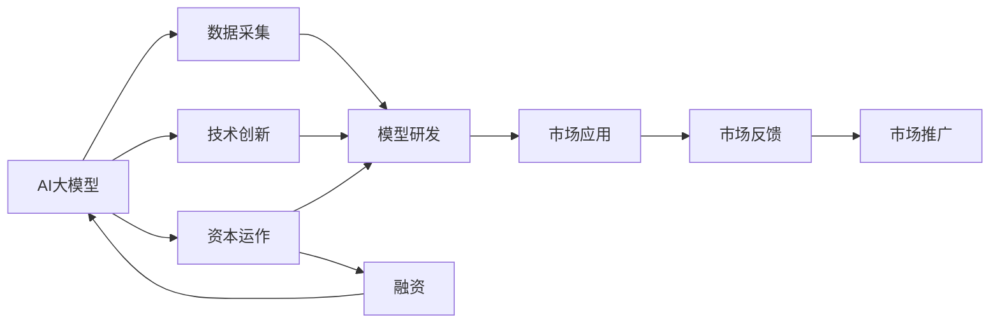
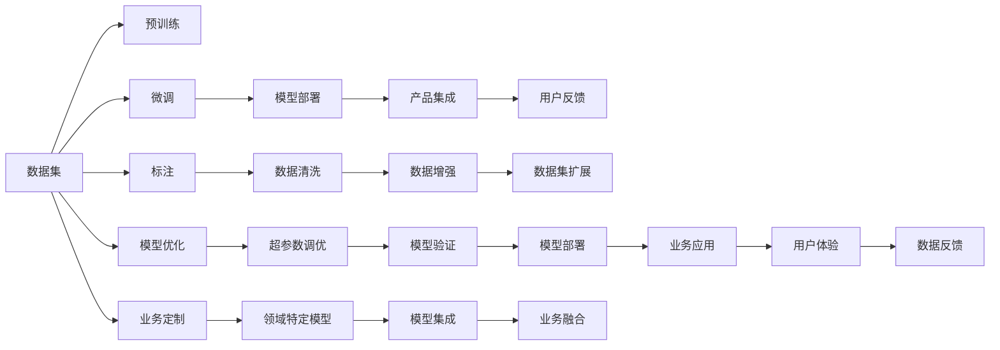

                 

## 1. 背景介绍

人工智能（AI）大模型在近年来的迅猛发展，已经在自然语言处理（NLP）、计算机视觉、语音识别等众多领域取得了突破性的进展。从OpenAI的GPT系列，到Google的BERT和TensorFlow，再到Facebook的DALL-E和Deepface，这些大模型不仅展示了强大的智能潜力，也吸引了大量资本的关注和投入。在AI大模型创业的浪潮中，如何有效利用资本优势，实现持续创新和商业成功，成为了每个创业者和投资者的共同关注点。

## 2. 核心概念与联系

### 2.1 核心概念概述

AI大模型创业的成功离不开多方面的核心概念：

- **AI大模型**：指通过大规模数据集和先进算法训练出来的通用型AI模型，具备强大的通用智能和领域特定能力。

- **创业生态**：围绕AI大模型创业所构建的产业链，包括模型研发、数据采集、产品开发、市场推广等多个环节。

- **资本运作**：通过投资、并购、融资等金融手段，为AI大模型创业提供资金支持和资源配置。

- **技术创新**：通过持续的技术研发和产品迭代，提升AI大模型的性能和应用价值。

- **市场应用**：将AI大模型应用到实际业务场景中，解决具体问题和提升用户价值。

这些核心概念相互作用，共同构成了AI大模型创业的完整图景。如下图所示，大模型创业生态的每个环节都受到资本运作的支撑，而技术创新和市场应用则是创业的直接驱动力。



### 2.2 核心概念原理和架构的 Mermaid 流程图



## 3. 核心算法原理 & 具体操作步骤

### 3.1 算法原理概述

AI大模型创业的核心算法原理主要围绕以下几个方面：

- **数据预处理和预训练**：通过大规模无标签数据集对模型进行预训练，学习通用的语言、视觉等特征表示。

- **任务适配和微调**：根据具体应用场景，设计合适的任务适配层和损失函数，对预训练模型进行微调，提升模型在特定任务上的性能。

- **模型优化和部署**：通过超参数调优、正则化、梯度累积等技术，提升模型训练效率和性能，并在实际应用场景中进行部署和优化。

- **持续学习和迭代**：根据用户反馈和业务需求，不断调整和优化模型，保持模型性能和应用价值的持续提升。

### 3.2 算法步骤详解

#### 3.2.1 数据预处理和预训练

- **数据采集**：收集领域相关的文本、图片、视频等数据，确保数据的多样性和高质量。

- **数据清洗**：去除噪声数据，处理缺失值和异常值，保证数据的一致性和可靠性。

- **数据增强**：通过数据扩增、迁移学习等方法，增加数据的多样性，提升模型的泛化能力。

- **预训练模型**：使用预训练模型（如BERT、GPT）在大规模数据集上进行预训练，学习通用的特征表示。

#### 3.2.2 任务适配和微调

- **任务适配层设计**：根据任务类型设计合适的输出层和损失函数，如分类任务使用交叉熵损失，生成任务使用负对数似然损失。

- **微调参数更新**：使用小学习率进行微调，避免破坏预训练权重，确保模型性能的稳定提升。

- **正则化和对抗训练**：应用L2正则、Dropout、Early Stopping等技术，防止模型过拟合，提高鲁棒性。

#### 3.2.3 模型优化和部署

- **模型压缩和裁剪**：去除不必要的网络层和参数，减小模型大小，提高推理速度。

- **量化和加速**：将浮点模型转换为定点模型，使用模型并行、量化加速等技术，提升计算效率和资源利用率。

- **模型部署和优化**：将模型部署到实际应用中，根据业务需求进行优化，确保模型的实时性和稳定性。

#### 3.2.4 持续学习和迭代

- **用户反馈收集**：通过问卷调查、用户评论等方式收集用户反馈，了解模型应用效果。

- **模型调整和优化**：根据用户反馈和业务需求，调整模型参数和训练策略，进行迭代优化。

- **模型评估和验证**：定期在验证集上评估模型性能，确保模型在新数据上的表现。

### 3.3 算法优缺点

#### 3.3.1 算法优点

- **快速迭代**：通过大规模数据预训练和微调，模型可以快速适应新的应用场景，提高创新速度。

- **泛化能力强**：预训练模型在大规模数据上学习通用的特征表示，具有较强的泛化能力，能够应对复杂多变的业务需求。

- **资源配置优化**：通过资本运作，合理配置资源，降低创业成本，提高效率。

- **持续改进**：通过持续学习和迭代，保持模型性能和应用价值的持续提升，满足不断变化的市场需求。

#### 3.3.2 算法缺点

- **数据依赖性强**：模型性能高度依赖于数据质量和数据量，数据采集和预处理成本较高。

- **模型复杂度高**：大模型结构复杂，训练和推理资源消耗大，需要高性能计算资源。

- **鲁棒性不足**：模型在面对域外数据和异常情况时，泛化性能可能下降，鲁棒性有待提高。

- **可解释性差**：大模型的决策过程复杂，难以进行有效的解释和调试，存在一定的黑盒问题。

### 3.4 算法应用领域

AI大模型在多个领域具有广泛的应用前景，包括但不限于：

- **自然语言处理**：文本分类、情感分析、机器翻译、问答系统、智能客服等。

- **计算机视觉**：图像分类、目标检测、图像生成、视频分析等。

- **语音识别**：语音合成、语音识别、对话系统等。

- **智能推荐**：个性化推荐、广告推荐、内容推荐等。

- **智能制造**：智能质检、智能监控、智能控制等。

- **智慧城市**：交通管理、环境监测、公共安全等。

## 4. 数学模型和公式 & 详细讲解 & 举例说明

### 4.1 数学模型构建

假设大模型为$M_\theta$，其中$\theta$表示模型参数。以文本分类任务为例，构建的数学模型如下：

$$
y = M_\theta(x)
$$

其中$x$为输入文本，$y$为分类标签。

### 4.2 公式推导过程

对于二分类任务，使用交叉熵损失函数，推导过程如下：

$$
\mathcal{L}(\theta) = -\frac{1}{N}\sum_{i=1}^N[y_i\log M_\theta(x_i)+(1-y_i)\log(1-M_\theta(x_i))]
$$

其中$N$为样本总数，$y_i$为真实标签，$M_\theta(x_i)$为模型预测结果。

### 4.3 案例分析与讲解

以Google的BERT模型为例，其预训练过程主要包括：

1. 将文本转换为token id，使用Embedding层进行嵌入。

2. 通过Transformer结构进行多层自注意力机制（Self-Attention）计算，学习上下文依赖关系。

3. 添加池化层（如MaxPool、AveragePool），提取文本的特征表示。

4. 通过全连接层（FC）进行分类或回归任务。

通过预训练学习到的特征表示，可以高效地适配不同领域的下游任务，提升模型性能。

## 5. 项目实践：代码实例和详细解释说明

### 5.1 开发环境搭建

- **安装Python**：使用Anaconda或Miniconda进行安装，建议使用最新版本。

- **安装PyTorch**：在虚拟环境中使用pip或conda安装。

- **安装TensorFlow**：在虚拟环境中使用pip或conda安装。

- **安装Transformers**：在虚拟环境中使用pip或conda安装。

- **安装其他依赖库**：根据项目需求安装其他必要的依赖库。

### 5.2 源代码详细实现

以下是一个简单的Python代码示例，用于加载BERT模型进行文本分类任务：

```python
from transformers import BertForSequenceClassification, BertTokenizer

# 初始化模型和分词器
model = BertForSequenceClassification.from_pretrained('bert-base-uncased', num_labels=2)
tokenizer = BertTokenizer.from_pretrained('bert-base-uncased')

# 定义输入文本和标签
text = 'This is a sample text for testing.'
label = 1

# 将文本转换为token ids和attention mask
inputs = tokenizer(text, return_tensors='pt')
attention_mask = inputs['attention_mask']

# 进行前向传播计算
outputs = model(**inputs, attention_mask=attention_mask)
logits = outputs.logits

# 计算损失和预测结果
loss = F.cross_entropy(logits.view(-1), label)
predicted_label = logits.argmax().item()
```

### 5.3 代码解读与分析

上述代码展示了从模型加载、输入预处理、前向传播到损失计算和结果预测的完整流程。其中，`BertForSequenceClassification`是BERT模型的分类模块，`BertTokenizer`用于将文本转换为token ids和attention mask。在代码中，我们首先初始化模型和分词器，然后定义输入文本和标签，接着将文本转换为token ids和attention mask，进行前向传播计算，并计算损失和预测结果。

### 5.4 运行结果展示

运行上述代码，可以得到模型对输入文本的分类预测结果，并计算损失值，评估模型的性能。

## 6. 实际应用场景

### 6.1 金融风控

AI大模型在金融风控领域具有广泛的应用前景，通过预训练和微调，可以实现风险评估、欺诈检测、信用评分等功能。例如，可以利用预训练模型提取用户行为和交易数据中的关键特征，并通过微调学习风险分类模型，预测用户是否存在高风险行为。

### 6.2 医疗诊断

AI大模型在医疗诊断领域也显示出巨大的潜力。通过预训练和微调，可以构建疾病诊断、医学影像分析等应用。例如，可以利用预训练模型提取医学影像中的特征，并通过微调学习诊断分类模型，辅助医生进行病情诊断。

### 6.3 智能制造

AI大模型在智能制造领域也有着广阔的应用前景。通过预训练和微调，可以实现智能质检、智能监控、智能控制等功能。例如，可以利用预训练模型提取生产数据中的关键特征，并通过微调学习质量分类模型，实时监测产品质量。

### 6.4 未来应用展望

未来，随着AI大模型的不断发展，将在更多领域得到应用，为传统行业带来变革性影响。例如，在智慧医疗领域，基于AI大模型的医疗问答、病历分析、药物研发等应用将提升医疗服务的智能化水平，辅助医生诊疗，加速新药开发进程。在智能教育领域，微调技术可应用于作业批改、学情分析、知识推荐等方面，因材施教，促进教育公平，提高教学质量。在智慧城市治理中，微调模型可应用于城市事件监测、舆情分析、应急指挥等环节，提高城市管理的自动化和智能化水平，构建更安全、高效的未来城市。

## 7. 工具和资源推荐

### 7.1 学习资源推荐

- **《Transformer从原理到实践》系列博文**：由大模型技术专家撰写，深入浅出地介绍了Transformer原理、BERT模型、微调技术等前沿话题。

- **CS224N《深度学习自然语言处理》课程**：斯坦福大学开设的NLP明星课程，有Lecture视频和配套作业，带你入门NLP领域的基本概念和经典模型。

- **《Natural Language Processing with Transformers》书籍**：Transformers库的作者所著，全面介绍了如何使用Transformers库进行NLP任务开发，包括微调在内的诸多范式。

- **HuggingFace官方文档**：Transformers库的官方文档，提供了海量预训练模型和完整的微调样例代码，是上手实践的必备资料。

- **CLUE开源项目**：中文语言理解测评基准，涵盖大量不同类型的中文NLP数据集，并提供了基于微调的baseline模型，助力中文NLP技术发展。

### 7.2 开发工具推荐

- **PyTorch**：基于Python的开源深度学习框架，灵活动态的计算图，适合快速迭代研究。大部分预训练语言模型都有PyTorch版本的实现。

- **TensorFlow**：由Google主导开发的开源深度学习框架，生产部署方便，适合大规模工程应用。同样有丰富的预训练语言模型资源。

- **Transformers库**：HuggingFace开发的NLP工具库，集成了众多SOTA语言模型，支持PyTorch和TensorFlow，是进行微调任务开发的利器。

- **Weights & Biases**：模型训练的实验跟踪工具，可以记录和可视化模型训练过程中的各项指标，方便对比和调优。与主流深度学习框架无缝集成。

- **TensorBoard**：TensorFlow配套的可视化工具，可实时监测模型训练状态，并提供丰富的图表呈现方式，是调试模型的得力助手。

### 7.3 相关论文推荐

- **Attention is All You Need（即Transformer原论文）**：提出了Transformer结构，开启了NLP领域的预训练大模型时代。

- **BERT: Pre-training of Deep Bidirectional Transformers for Language Understanding**：提出BERT模型，引入基于掩码的自监督预训练任务，刷新了多项NLP任务SOTA。

- **Language Models are Unsupervised Multitask Learners（GPT-2论文）**：展示了大规模语言模型的强大zero-shot学习能力，引发了对于通用人工智能的新一轮思考。

- **Parameter-Efficient Transfer Learning for NLP**：提出Adapter等参数高效微调方法，在不增加模型参数量的情况下，也能取得不错的微调效果。

- **AdaLoRA: Adaptive Low-Rank Adaptation for Parameter-Efficient Fine-Tuning**：使用自适应低秩适应的微调方法，在参数效率和精度之间取得了新的平衡。

- **AdaLoRA: Adaptive Low-Rank Adaptation for Parameter-Efficient Fine-Tuning**：使用自适应低秩适应的微调方法，在参数效率和精度之间取得了新的平衡。

这些论文代表了大语言模型微调技术的发展脉络。通过学习这些前沿成果，可以帮助研究者把握学科前进方向，激发更多的创新灵感。

## 8. 总结：未来发展趋势与挑战

### 8.1 总结

本文对基于AI大模型的创业生态进行了全面系统的介绍。首先阐述了AI大模型创业的成功离不开多方面的核心概念，包括AI大模型、创业生态、资本运作、技术创新和市场应用。其次，从原理到实践，详细讲解了AI大模型的预训练、微调和优化过程，提供了微调任务开发的完整代码实例。同时，本文还广泛探讨了AI大模型在多个行业领域的应用前景，展示了微调范式的巨大潜力。最后，本文精选了AI大模型微调技术的各类学习资源，力求为读者提供全方位的技术指引。

通过本文的系统梳理，可以看到，AI大模型创业的生态系统正在蓬勃发展，预示着AI技术的商业化前景广阔。然而，AI大模型创业也面临着诸多挑战，需要在数据、模型、算法、资源等多个维度不断优化，才能在激烈的市场竞争中脱颖而出。

### 8.2 未来发展趋势

展望未来，AI大模型创业将呈现以下几个发展趋势：

1. **模型规模持续增大**：随着算力成本的下降和数据规模的扩张，预训练语言模型的参数量还将持续增长。超大规模语言模型蕴含的丰富语言知识，有望支撑更加复杂多变的下游任务微调。

2. **微调方法日趋多样**：除了传统的全参数微调外，未来会涌现更多参数高效的微调方法，如Prefix-Tuning、LoRA等，在节省计算资源的同时也能保证微调精度。

3. **持续学习成为常态**：随着数据分布的不断变化，微调模型也需要持续学习新知识以保持性能。如何在不遗忘原有知识的同时，高效吸收新样本信息，将成为重要的研究课题。

4. **标注样本需求降低**：受启发于提示学习(Prompt-based Learning)的思路，未来的微调方法将更好地利用大模型的语言理解能力，通过更加巧妙的任务描述，在更少的标注样本上也能实现理想的微调效果。

5. **多模态微调崛起**：当前的微调主要聚焦于纯文本数据，未来会进一步拓展到图像、视频、语音等多模态数据微调。多模态信息的融合，将显著提升语言模型对现实世界的理解和建模能力。

6. **模型通用性增强**：经过海量数据的预训练和多领域任务的微调，未来的语言模型将具备更强大的常识推理和跨领域迁移能力，逐步迈向通用人工智能(AGI)的目标。

以上趋势凸显了AI大模型微调技术的广阔前景。这些方向的探索发展，必将进一步提升NLP系统的性能和应用范围，为人类认知智能的进化带来深远影响。

### 8.3 面临的挑战

尽管AI大模型微调技术已经取得了瞩目成就，但在迈向更加智能化、普适化应用的过程中，它仍面临着诸多挑战：

1. **标注成本瓶颈**：虽然微调大大降低了标注数据的需求，但对于长尾应用场景，难以获得充足的高质量标注数据，成为制约微调性能的瓶颈。如何进一步降低微调对标注样本的依赖，将是一大难题。

2. **模型鲁棒性不足**：当前微调模型面对域外数据时，泛化性能往往大打折扣。对于测试样本的微小扰动，微调模型的预测也容易发生波动。如何提高微调模型的鲁棒性，避免灾难性遗忘，还需要更多理论和实践的积累。

3. **推理效率有待提高**：大规模语言模型虽然精度高，但在实际部署时往往面临推理速度慢、内存占用大等效率问题。如何在保证性能的同时，简化模型结构，提升推理速度，优化资源占用，将是重要的优化方向。

4. **可解释性亟需加强**：当前微调模型更像是"黑盒"系统，难以解释其内部工作机制和决策逻辑。对于医疗、金融等高风险应用，算法的可解释性和可审计性尤为重要。如何赋予微调模型更强的可解释性，将是亟待攻克的难题。

5. **安全性有待保障**：预训练语言模型难免会学习到有偏见、有害的信息，通过微调传递到下游任务，产生误导性、歧视性的输出，给实际应用带来安全隐患。如何从数据和算法层面消除模型偏见，避免恶意用途，确保输出的安全性，也将是重要的研究课题。

6. **知识整合能力不足**：现有的微调模型往往局限于任务内数据，难以灵活吸收和运用更广泛的先验知识。如何让微调过程更好地与外部知识库、规则库等专家知识结合，形成更加全面、准确的信息整合能力，还有很大的想象空间。

正视AI大模型微调面临的这些挑战，积极应对并寻求突破，将是大模型微调走向成熟的必由之路。相信随着学界和产业界的共同努力，这些挑战终将一一被克服，AI大模型微调必将在构建人机协同的智能时代中扮演越来越重要的角色。

### 8.4 研究展望

面对AI大模型微调所面临的种种挑战，未来的研究需要在以下几个方面寻求新的突破：

1. **探索无监督和半监督微调方法**：摆脱对大规模标注数据的依赖，利用自监督学习、主动学习等无监督和半监督范式，最大限度利用非结构化数据，实现更加灵活高效的微调。

2. **研究参数高效和计算高效的微调范式**：开发更加参数高效的微调方法，在固定大部分预训练参数的同时，只更新极少量的任务相关参数。同时优化微调模型的计算图，减少前向传播和反向传播的资源消耗，实现更加轻量级、实时性的部署。

3. **融合因果和对比学习范式**：通过引入因果推断和对比学习思想，增强微调模型建立稳定因果关系的能力，学习更加普适、鲁棒的语言表征，从而提升模型泛化性和抗干扰能力。

4. **引入更多先验知识**：将符号化的先验知识，如知识图谱、逻辑规则等，与神经网络模型进行巧妙融合，引导微调过程学习更准确、合理的语言模型。同时加强不同模态数据的整合，实现视觉、语音等多模态信息与文本信息的协同建模。

5. **结合因果分析和博弈论工具**：将因果分析方法引入微调模型，识别出模型决策的关键特征，增强输出解释的因果性和逻辑性。借助博弈论工具刻画人机交互过程，主动探索并规避模型的脆弱点，提高系统稳定性。

6. **纳入伦理道德约束**：在模型训练目标中引入伦理导向的评估指标，过滤和惩罚有偏见、有害的输出倾向。同时加强人工干预和审核，建立模型行为的监管机制，确保输出符合人类价值观和伦理道德。

这些研究方向的探索，必将引领AI大模型微调技术迈向更高的台阶，为构建安全、可靠、可解释、可控的智能系统铺平道路。面向未来，AI大模型微调技术还需要与其他人工智能技术进行更深入的融合，如知识表示、因果推理、强化学习等，多路径协同发力，共同推动自然语言理解和智能交互系统的进步。只有勇于创新、敢于突破，才能不断拓展语言模型的边界，让智能技术更好地造福人类社会。

## 9. 附录：常见问题与解答

**Q1: AI大模型创业的可行性如何？**

A: AI大模型创业具有较高的技术壁垒和资金需求，但同时也具备巨大的商业价值和发展潜力。关键在于选择合适的市场切入点和商业模式，通过持续创新和优化，逐步构建起竞争优势。

**Q2: 如何选择合适的资本运作策略？**

A: 选择合适的资本运作策略需要考虑多个因素，包括市场情况、业务需求、自身技术实力等。常见的资本运作策略包括天使投资、风险投资、IPO等，需要根据具体情况进行选择和调整。

**Q3: 如何保障AI大模型的安全性？**

A: 保障AI大模型的安全性需要从数据、模型、算法等多个维度进行综合考虑。例如，使用数据脱敏技术保护用户隐私，设计合理的模型约束机制防止输出偏见，引入伦理导向的评估指标确保模型行为符合人类价值观。

**Q4: 如何提升AI大模型的可解释性？**

A: 提升AI大模型的可解释性需要引入更多领域知识和先验信息，通过因果分析和博弈论等方法增强模型的透明性和可理解性。同时，加强人工干预和审核，确保模型输出符合用户需求和伦理标准。

**Q5: AI大模型创业需要哪些关键资源？**

A: AI大模型创业需要具备多方面的关键资源，包括资金、人才、技术、数据等。资金可以提供必要的研发和市场推广支持，人才可以确保技术的持续创新，数据可以提供模型训练的基础，技术则决定着模型性能和应用效果。

---

作者：禅与计算机程序设计艺术 / Zen and the Art of Computer Programming

