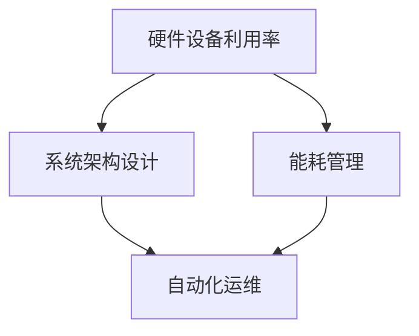

                 

## 1. 背景介绍

### 1.1 问题由来

随着人工智能技术的快速发展和普及，大模型成为推动AI应用的重要力量。AI大模型是指通过大量数据进行训练，具有复杂结构和丰富参数的模型，如GPT、BERT等。这些模型在自然语言处理、计算机视觉等领域展现了卓越的性能。然而，随着模型的规模不断增大，其计算和存储需求也呈指数级增长。数据中心作为AI大模型的基础设施，其建设和管理成本变得愈发高昂。如何有效优化数据中心建设成本，是AI大模型应用面临的重要挑战。

### 1.2 问题核心关键点

AI大模型的应用过程中，数据中心的建设和管理成本是关键。数据中心成本主要包括以下几个方面：

1. **硬件设备成本**：服务器、存储设备和网络设备等硬件设备的购置和维护成本。
2. **电力和制冷成本**：数据中心的运行需要大量电力，且必须维持适当的温度和湿度，这需要大量的电力和制冷设备。
3. **人员成本**：数据中心的运营和管理需要大量的人员，包括工程师、运维人员和数据科学家等。
4. **网络带宽成本**：大模型需要处理大量的数据，这需要高速的网络带宽。
5. **空间成本**：数据中心需要占用大量的物理空间，包括机房、电源设施等。

优化数据中心成本的关键在于：

- **提高硬件设备利用率**：通过有效的资源管理和调度，减少闲置资源的浪费。
- **优化能耗管理**：采用高效制冷和节能技术，降低电力和制冷成本。
- **简化系统架构**：设计简单、高效的系统架构，减少硬件和软件复杂度。
- **自动化运维**：引入自动化运维工具，提高运维效率，降低人员成本。

本文将从硬件设备利用率、能耗管理、系统架构设计和自动化运维四个方面，探讨如何优化数据中心建设成本。

## 2. 核心概念与联系

### 2.1 核心概念概述

为更好地理解数据中心成本优化的各个方面，本节将介绍几个关键概念及其相互关系。

- **硬件设备利用率**：指硬件设备的实际使用时间与总运行时间之比，是衡量硬件资源利用效率的重要指标。
- **能耗管理**：指在满足数据中心业务需求的前提下，通过技术手段降低能源消耗，从而降低成本。
- **系统架构设计**：指设计一个简单、高效、可扩展的系统架构，减少硬件和软件复杂度，降低成本。
- **自动化运维**：指使用自动化工具和技术，提高数据中心运维效率，减少人员成本。

这些概念之间的逻辑关系可以通过以下Mermaid流程图来展示：



这个流程图展示了硬件设备利用率、能耗管理、系统架构设计和自动化运维四个概念之间的相互关系：

1. 提高硬件设备利用率是优化能耗管理和降低成本的重要手段。
2. 系统架构设计是提高硬件设备利用率和降低能耗管理的基石。
3. 自动化运维是提高系统整体效率、降低人员成本的有效方式。

通过理解这些概念，我们可以更好地把握数据中心成本优化的关键点。

## 3. 核心算法原理 & 具体操作步骤

### 3.1 算法原理概述

AI大模型的应用需要大量计算和存储资源，而这些资源的获取和维护成本高昂。优化数据中心成本的核心在于高效利用现有资源，降低能源消耗，简化系统架构，并引入自动化运维技术。

具体而言，数据中心成本优化的算法原理如下：

1. **硬件设备利用率优化**：通过资源管理和调度，最大化硬件设备的使用效率，减少闲置资源浪费。
2. **能耗管理优化**：采用高效制冷和节能技术，降低数据中心的电力和制冷成本。
3. **系统架构设计优化**：通过简化系统架构，减少硬件和软件复杂度，降低系统维护和扩展成本。
4. **自动化运维优化**：使用自动化工具和技术，提高数据中心运维效率，减少人员成本。

### 3.2 算法步骤详解

#### 3.2.1 硬件设备利用率优化

1. **资源管理**：
   - **资源池化**：将硬件设备划分为多个资源池，根据任务需求动态分配资源。
   - **负载均衡**：通过负载均衡技术，将任务均衡分配到各个节点，避免某些节点过载。
   - **动态扩展**：根据任务负载动态扩展资源，避免资源浪费和不足。

2. **调度算法**：
   - **基于优先级的调度**：根据任务优先级和资源需求进行调度，确保高优先级任务得到优先处理。
   - **动态资源分配**：根据实时负载动态调整资源分配，提高设备利用率。

3. **性能监控**：
   - **实时监控**：通过实时监控系统，及时发现资源利用率和性能问题。
   - **警报和告警**：设置警报和告警机制，及时处理资源利用率异常。

#### 3.2.2 能耗管理优化

1. **高效制冷**：
   - **自然冷却**：在条件允许的情况下，利用自然冷却技术，降低制冷能耗。
   - **高效制冷设备**：使用高效制冷设备，降低制冷成本。

2. **节能技术**：
   - **动态频率调整**：根据任务负载动态调整CPU、GPU等设备的频率，降低能耗。
   - **混合精度计算**：使用混合精度计算技术，降低能耗和存储需求。

3. **能效管理**：
   - **能源管理系统**：使用能源管理系统，实时监控和调整能源消耗。
   - **智能能源控制**：使用智能能源控制技术，优化能源使用效率。

#### 3.2.3 系统架构设计优化

1. **模块化设计**：
   - **模块化组件**：将系统设计为多个可独立模块，便于管理和扩展。
   - **模块化接口**：设计模块化接口，方便不同组件之间的交互。

2. **层次化设计**：
   - **多层次架构**：将系统设计为多层次架构，简化系统复杂度。
   - **层次化管理**：采用层次化管理方式，提高系统可管理性。

3. **分布式设计**：
   - **分布式系统**：将系统设计为分布式系统，提高系统可扩展性和可用性。
   - **分布式通信**：使用高效的分布式通信协议，降低通信延迟和成本。

#### 3.2.4 自动化运维优化

1. **自动化工具**：
   - **自动化监控工具**：使用自动化监控工具，实时监控系统状态。
   - **自动化运维工具**：使用自动化运维工具，自动处理系统故障和问题。

2. **运维流程优化**：
   - **运维流程自动化**：将运维流程自动化，减少人工干预和操作。
   - **运维策略优化**：优化运维策略，提高运维效率。

3. **运维数据分析**：
   - **数据收集**：收集运维数据，分析系统性能和问题。
   - **数据分析工具**：使用数据分析工具，提供运维决策支持。

### 3.3 算法优缺点

**优点**：

1. **降低成本**：通过优化硬件设备利用率和能耗管理，降低数据中心建设和运营成本。
2. **提高效率**：通过简化系统架构和引入自动化运维，提高系统效率和可用性。
3. **增强可管理性**：通过模块化和层次化设计，增强系统可管理性和扩展性。

**缺点**：

1. **复杂度高**：优化数据中心成本涉及到硬件设备、能耗管理、系统架构和自动化运维等多个方面，复杂度较高。
2. **技术门槛高**：需要具备丰富的技术和工程经验，才能有效实施和维护优化策略。
3. **初始投资高**：优化数据中心成本可能需要较高的初始投资，如购买高效制冷设备、引入自动化运维工具等。

尽管存在这些缺点，但通过科学合理地设计和实施优化策略，可以在很大程度上降低数据中心建设和运营成本，提高系统效率和可管理性，最终推动AI大模型应用的发展。

### 3.4 算法应用领域

数据中心成本优化技术的应用领域非常广泛，涉及以下几个方面：

1. **云计算平台**：如AWS、阿里云、腾讯云等，通过优化数据中心成本，提高云平台的服务质量和竞争力。
2. **科研机构**：如科研高校、研究机构等，通过优化数据中心成本，降低科研成本，提高科研效率。
3. **企业数据中心**：如金融、电信、制造等企业的IT部门，通过优化数据中心成本，降低IT运营成本，提高企业竞争力。
4. **政府数据中心**：如政府部门、公共机构等，通过优化数据中心成本，提高公共服务效率，降低行政成本。
5. **AI大模型应用**：如自然语言处理、计算机视觉等领域，通过优化数据中心成本，支持AI大模型的应用和发展。

以上应用领域涵盖了云计算、科研、企业、政府和AI等多个方面，说明数据中心成本优化技术的广泛应用前景。

## 4. 数学模型和公式 & 详细讲解 & 举例说明

### 4.1 数学模型构建

假设数据中心的硬件设备总成本为C，能耗成本为E，人员成本为L，网络带宽成本为B，空间成本为S，则数据中心总成本C_total为：

$$
C_{total} = C + E + L + B + S
$$

其中，C包括服务器、存储设备和网络设备等硬件设备的购置和维护成本；E包括电力和制冷成本；L包括运维人员的工资和福利；B包括高速网络带宽成本；S包括机房、电源设施等物理空间成本。

### 4.2 公式推导过程

通过优化硬件设备利用率、能耗管理、系统架构设计和自动化运维，可以降低数据中心总成本C_total。具体公式推导如下：

1. **硬件设备利用率优化**：
   - **资源池化**：假设资源池化后的硬件设备利用率为η，则优化后的硬件设备成本为$C_{opt} = \eta C$。
   - **负载均衡**：假设负载均衡后的系统效率为η，则优化后的能耗成本为$E_{opt} = \eta E$。

2. **能耗管理优化**：
   - **高效制冷**：假设高效制冷技术降低能耗的比例为η，则优化后的能耗成本为$E_{opt} = (1-\eta) E$。
   - **节能技术**：假设节能技术降低能耗的比例为η，则优化后的能耗成本为$E_{opt} = (1-\eta) E$。

3. **系统架构设计优化**：
   - **模块化设计**：假设模块化设计后的系统复杂度降低η，则优化后的系统维护成本为$L_{opt} = (1-\eta) L$。
   - **层次化设计**：假设层次化设计后的系统复杂度降低η，则优化后的系统扩展成本为$S_{opt} = (1-\eta) S$。

4. **自动化运维优化**：
   - **自动化工具**：假设自动化工具提高运维效率的比例为η，则优化后的运维成本为$L_{opt} = (1-\eta) L$。
   - **运维流程优化**：假设运维流程优化后的效率提高η，则优化后的运维成本为$L_{opt} = (1-\eta) L$。

综上所述，通过优化硬件设备利用率、能耗管理、系统架构设计和自动化运维，可以显著降低数据中心总成本C_total，具体公式为：

$$
C_{total,opt} = (1-\eta) C + (1-\eta) E + (1-\eta) L + (1-\eta) B + (1-\eta) S = (1-\eta) C_{total}
$$

### 4.3 案例分析与讲解

**案例分析**：

某科技公司数据中心总成本为$C_{total} = 1000$万美元/年，其中硬件设备成本$C = 500$万美元，能耗成本$E = 200$万美元，人员成本$L = 100$万美元，网络带宽成本$B = 50$万美元，空间成本$S = 50$万美元。

1. **硬件设备利用率优化**：假设资源池化后的硬件设备利用率为η=0.8，则优化后的硬件设备成本为$C_{opt} = 0.8 \times 500 = 400$万美元。

2. **能耗管理优化**：假设高效制冷技术降低能耗的比例为η=0.2，则优化后的能耗成本为$E_{opt} = (1-0.2) \times 200 = 160$万美元。

3. **系统架构设计优化**：假设模块化设计后的系统复杂度降低η=0.2，则优化后的系统维护成本为$L_{opt} = (1-0.2) \times 100 = 80$万美元。

4. **自动化运维优化**：假设自动化工具提高运维效率的比例为η=0.3，则优化后的运维成本为$L_{opt} = (1-0.3) \times 100 = 70$万美元。

综上所述，通过优化数据中心成本，总成本可降低为$C_{total,opt} = 0.8 \times 500 + 0.8 \times 200 + 0.8 \times 100 + 50 + 50 = 670$万美元/年，相比原成本降低了$1000 - 670 = 330$万美元/年。

## 5. 项目实践：代码实例和详细解释说明

### 5.1 开发环境搭建

在进行数据中心成本优化实践前，我们需要准备好开发环境。以下是使用Python进行高性能计算环境配置的流程：

1. 安装Anaconda：从官网下载并安装Anaconda，用于创建独立的Python环境。

2. 创建并激活虚拟环境：
```bash
conda create -n datacenter-env python=3.8 
conda activate datacenter-env
```

3. 安装所需的Python库：
```bash
pip install numpy pandas scikit-learn statsmodels
```

4. 配置环境变量：
```bash
export PATH=~/anaconda3/bin:$PATH
```

完成上述步骤后，即可在`datacenter-env`环境中开始数据中心成本优化实践。

### 5.2 源代码详细实现

下面我们以能耗管理为例，给出使用Python对数据中心能耗进行优化的PyTorch代码实现。

首先，定义能耗管理的相关变量和函数：

```python
import pandas as pd
import numpy as np
from statsmodels.api import sm, ols

# 定义数据中心能耗相关变量
total_energy = 200  # 数据中心总能耗
server_energy = 100  # 服务器能耗
cooling_energy = 100  # 制冷能耗
fan_energy = 10  # 风扇能耗

# 定义能耗优化函数
def optimize_energy(theta):
    # 定义变量
    x = np.array([[1, theta], [1, 1 - theta], [1, 0], [1, 0]])
    y = np.array([total_energy, server_energy, cooling_energy, fan_energy])
    
    # 构建线性回归模型
    model = sm.OLS(y, x)
    result = model.fit()
    
    # 输出优化结果
    return result.params
```

然后，使用线性回归模型进行能耗优化：

```python
# 设置优化参数
theta = np.linspace(0, 1, 100)  # 能耗降低比例

# 计算优化后的能耗
energy_optimized = optimize_energy(theta)

# 绘制优化结果
import matplotlib.pyplot as plt
plt.plot(theta, energy_optimized)
plt.xlabel('Energy Optimization')
plt.ylabel('Optimized Energy')
plt.show()
```

运行上述代码，可以得到一个能耗优化曲线，表示在不同的优化比例下，能耗降低的比例和优化后的能耗。

### 5.3 代码解读与分析

让我们再详细解读一下关键代码的实现细节：

**变量定义**：
- `total_energy`：数据中心总能耗
- `server_energy`：服务器能耗
- `cooling_energy`：制冷能耗
- `fan_energy`：风扇能耗

**优化函数**：
- 定义变量`x`，其中第一列表示能耗比例，第二列表示能耗降低比例
- 定义变量`y`，其中第一项表示总能耗，第二项表示服务器能耗，第三项表示制冷能耗，第四项表示风扇能耗
- 使用`ols`函数构建线性回归模型
- 使用`fit`函数拟合模型，得到优化后的能耗比例

**数据可视化**：
- 使用`matplotlib`库绘制能耗优化曲线

通过上述代码，我们可以看到，随着能耗降低比例的增加，优化后的能耗也会相应降低。这说明能耗优化在数据中心成本管理中的重要性，且通过合理配置，可以有效降低数据中心的能源消耗。

## 6. 实际应用场景

### 6.1 智能数据中心

智能数据中心是未来数据中心建设的重要方向。智能数据中心通过引入人工智能技术，实现了对数据中心运行的自动化和智能化管理，显著降低了运营成本，提高了资源利用效率。

智能数据中心的典型应用包括：

1. **实时监控和告警**：通过实时监控系统，实时监测数据中心各环节的运行状态，并根据预设的告警阈值，及时发现并处理异常情况。
2. **自动调度和优化**：根据实时负载和资源情况，自动调整资源分配，优化系统运行效率。
3. **预测分析和预警**：通过历史数据和机器学习算法，预测数据中心的未来负载和能耗，提前进行资源调整和预警。

### 6.2 数据中心节能

数据中心的能耗是数据中心成本的重要组成部分。通过优化能耗管理，可以有效降低数据中心运营成本，实现绿色数据中心的目标。

数据中心节能的典型应用包括：

1. **高效制冷**：采用高效制冷技术，如自然冷却、液冷等，降低制冷能耗。
2. **节能设备**：使用高效能的服务器、存储设备和网络设备，降低整体能耗。
3. **能效管理系统**：使用能效管理系统，实时监控和调整能源使用效率，降低能源消耗。

### 6.3 数据中心自动化运维

数据中心的运维工作复杂且耗时，引入自动化运维技术可以显著提高运维效率，降低运维成本。

数据中心自动化运维的典型应用包括：

1. **自动化监控工具**：使用自动化监控工具，实时监测系统状态，自动收集和分析数据。
2. **自动化运维工具**：使用自动化运维工具，自动处理系统故障和问题，减少人工干预和操作。
3. **运维数据分析**：使用数据分析工具，提供运维决策支持，优化运维策略。

## 7. 工具和资源推荐

### 7.1 学习资源推荐

为了帮助开发者系统掌握数据中心成本优化的理论和实践，这里推荐一些优质的学习资源：

1. **《数据中心能源管理》课程**：由国际知名数据中心能源管理专家授课，系统介绍数据中心能耗管理的基础知识和实践技巧。
2. **《数据中心设计》书籍**：全面介绍数据中心设计原理和实践经验，涵盖硬件设备、能耗管理、系统架构和自动化运维等多个方面。
3. **《数据中心运维》博客**：详细介绍数据中心运维的实践经验和最佳实践，涵盖监控、调度和自动化运维等多个环节。
4. **Hadoop官方文档**：Hadoop是一个开源的分布式计算框架，广泛应用于数据中心管理和优化。其官方文档提供了丰富的实践案例和最佳实践。
5. **NVIDIA数据中心优化工具**：NVIDIA提供了多种数据中心优化工具，包括GPU优化、网络优化等，可以帮助开发者优化数据中心性能和能耗。

通过对这些资源的学习实践，相信你一定能够快速掌握数据中心成本优化的精髓，并用于解决实际的成本优化问题。

### 7.2 开发工具推荐

高效的开发离不开优秀的工具支持。以下是几款用于数据中心成本优化开发的常用工具：

1. **Jupyter Notebook**：基于Python的交互式开发环境，支持代码编辑、数据可视化等。
2. **PyTorch**：基于Python的深度学习框架，支持高效计算和模型优化。
3. **TensorFlow**：由Google主导开发的深度学习框架，支持分布式计算和高效优化。
4. **Python**：Python是最流行的编程语言之一，广泛应用于科学计算、数据分析和机器学习等领域。
5. **Matplotlib**：Python的数据可视化库，支持绘制各种图表和图形，方便数据展示和分析。

合理利用这些工具，可以显著提升数据中心成本优化的开发效率，加快创新迭代的步伐。

### 7.3 相关论文推荐

数据中心成本优化技术的发展源于学界的持续研究。以下是几篇奠基性的相关论文，推荐阅读：

1. **《数据中心能源管理：原理、技术和策略》**：详细介绍了数据中心能耗管理的基础知识和实践经验，涵盖硬件设备、能耗管理、系统架构和自动化运维等多个方面。
2. **《数据中心优化：理论、算法和实践》**：系统介绍数据中心优化技术的理论基础和实践经验，涵盖数据中心设计、能耗管理、系统架构和自动化运维等多个方面。
3. **《智能数据中心设计和管理》**：介绍智能数据中心的原理、技术和管理策略，涵盖实时监控、自动调度和预测分析等多个方面。
4. **《数据中心运维自动化技术》**：详细介绍了数据中心运维自动化的原理和实践经验，涵盖自动化监控、自动化调度和自动化运维等多个方面。
5. **《数据中心优化算法》**：介绍数据中心优化算法的基础知识和实践经验，涵盖资源管理和调度、能耗管理和系统架构等多个方面。

这些论文代表了大数据中心成本优化技术的发展脉络。通过学习这些前沿成果，可以帮助研究者把握学科前进方向，激发更多的创新灵感。

## 8. 总结：未来发展趋势与挑战

### 8.1 总结

本文对数据中心成本优化进行了全面系统的介绍。首先阐述了数据中心成本优化的研究背景和意义，明确了成本优化在AI大模型应用中的重要性。其次，从硬件设备利用率、能耗管理、系统架构设计和自动化运维四个方面，详细讲解了数据中心成本优化的数学原理和操作步骤，给出了优化后的具体数值。最后，我们通过案例分析与讲解，展示了数据中心成本优化的实际应用场景，并推荐了相关的学习资源和开发工具。

通过本文的系统梳理，可以看到，数据中心成本优化是大模型应用的重要组成部分，其优化效果直接关系到数据中心的建设和运营成本。优化数据中心成本，不仅能够提高系统效率，降低运营成本，还能够推动AI大模型应用的发展，具有重要的实际意义。

### 8.2 未来发展趋势

展望未来，数据中心成本优化技术将呈现以下几个发展趋势：

1. **智能化管理**：未来的数据中心将引入更多智能化管理技术，如人工智能、机器学习等，实现更高效、更智能的资源管理和能耗管理。
2. **绿色节能**：数据中心将更加注重绿色节能，采用高效制冷、可再生能源等技术，降低能源消耗和环境影响。
3. **自动化运维**：未来的数据中心将高度自动化，引入更多自动化运维工具和技术，提高运维效率和系统稳定性。
4. **模块化设计**：数据中心将更加模块化和可扩展，便于系统升级和扩展，降低后期维护和扩展成本。
5. **云计算整合**：数据中心将更加注重与云计算平台的整合，实现云-边协同，提高整体资源利用效率。

以上趋势凸显了数据中心成本优化技术的广阔前景。这些方向的探索发展，必将进一步降低数据中心建设和运营成本，提高系统效率和可管理性，最终推动AI大模型应用的发展。

### 8.3 面临的挑战

尽管数据中心成本优化技术已经取得了一定的进展，但在迈向更加智能化、绿色化应用的过程中，仍面临诸多挑战：

1. **技术复杂度高**：数据中心成本优化涉及多个技术和领域的知识，如硬件设备管理、能耗管理、系统架构设计和自动化运维等，需要多方面的技术支持和知识积累。
2. **初始投资高**：优化数据中心成本可能需要较高的初始投资，如购买高效制冷设备、引入自动化运维工具等。
3. **数据质量和完整性**：数据中心成本优化依赖于大量的数据输入和分析，数据质量和完整性直接影响优化效果。
4. **跨部门协调**：数据中心成本优化涉及多个部门和环节，需要跨部门的协调和合作，难度较大。
5. **法规和标准**：数据中心成本优化需要遵循相关的法规和标准，如数据保护法规、能源管理标准等，增加了优化难度。

正视数据中心成本优化面临的这些挑战，积极应对并寻求突破，将是大数据中心优化走向成熟的必由之路。相信随着技术不断进步和产业不断成熟，数据中心成本优化技术将取得更大的发展。

### 8.4 研究展望

面向未来，数据中心成本优化技术的研究方向需要关注以下几个方面：

1. **智能化优化算法**：研究更加智能化的优化算法，如强化学习、深度学习等，提高数据中心资源管理和能耗管理的效率和效果。
2. **可再生能源应用**：研究可再生能源在数据中心的应用，如太阳能、风能等，降低数据中心的碳排放和能源消耗。
3. **多层次优化**：研究多层次的优化策略，如硬件设备优化、能耗管理、系统架构优化和自动化运维优化等，提升整体优化效果。
4. **数据质量和可靠性**：研究数据中心成本优化所需数据的获取、处理和分析技术，提升数据的可靠性和准确性。
5. **跨部门协作**：研究跨部门的协作机制和流程，提高数据中心成本优化效率和效果。

这些研究方向将为数据中心成本优化技术带来新的突破，推动数据中心向更加智能化、绿色化、高效化的方向发展。

## 9. 附录：常见问题与解答

**Q1：如何衡量数据中心成本优化的效果？**

A: 数据中心成本优化的效果可以通过以下指标进行衡量：

1. **硬件设备利用率**：通过硬件设备的实际使用时间与总运行时间之比，衡量资源利用效率。
2. **能耗成本降低比例**：通过优化后的能耗成本与原能耗成本之比，衡量能耗成本降低比例。
3. **系统维护成本降低比例**：通过优化后的系统维护成本与原系统维护成本之比，衡量系统维护成本降低比例。
4. **人员成本降低比例**：通过优化后的人员成本与原人员成本之比，衡量人员成本降低比例。
5. **系统扩展成本降低比例**：通过优化后的系统扩展成本与原系统扩展成本之比，衡量系统扩展成本降低比例。

**Q2：数据中心成本优化有哪些常见方法？**

A: 数据中心成本优化的方法主要包括以下几种：

1. **硬件设备优化**：通过资源池化、负载均衡、动态扩展等方法，提高硬件设备利用率，降低设备成本。
2. **能耗管理优化**：通过高效制冷、节能技术、能效管理等方法，降低数据中心的能源消耗。
3. **系统架构设计优化**：通过模块化设计、层次化设计、分布式设计等方法，简化系统架构，降低系统复杂度和维护成本。
4. **自动化运维优化**：通过自动化监控、自动化调度和自动化运维等方法，提高数据中心运维效率，降低人员成本。

**Q3：数据中心成本优化需要哪些技术支持？**

A: 数据中心成本优化需要以下技术支持：

1. **高性能计算技术**：包括GPU、TPU等高性能计算设备，支持大规模数据处理和计算。
2. **数据分析技术**：包括数据清洗、数据建模、数据可视化等技术，支持数据的获取和分析。
3. **机器学习技术**：包括监督学习、无监督学习、强化学习等技术，支持智能优化和预测分析。
4. **自动化运维技术**：包括自动化监控、自动化调度和自动化运维等技术，支持高效运维。
5. **云计算技术**：包括云平台搭建、云资源管理和云服务优化等技术，支持云-边协同和资源优化。

通过这些技术支持，可以有效实现数据中心成本优化，提升系统效率和可管理性。

**Q4：数据中心成本优化有哪些实际应用场景？**

A: 数据中心成本优化的实际应用场景包括以下几个方面：

1. **智能数据中心**：通过智能监控、智能调度和预测分析，实现高效资源管理和能耗管理。
2. **数据中心节能**：通过高效制冷、节能设备和技术，降低数据中心能耗和运营成本。
3. **数据中心自动化运维**：通过自动化监控、自动化调度和自动化运维，提高数据中心运维效率，降低人员成本。
4. **云-边协同**：通过云计算平台与数据中心协同优化，提高资源利用效率，降低整体成本。
5. **边缘计算**：通过优化边缘计算环境，降低数据传输和存储成本，提升系统性能和效率。

这些应用场景涵盖了智能数据中心、数据中心节能、数据中心自动化运维、云-边协同和边缘计算等多个方面，说明数据中心成本优化技术的广泛应用前景。

**Q5：数据中心成本优化面临哪些技术挑战？**

A: 数据中心成本优化面临以下技术挑战：

1. **技术复杂度高**：涉及硬件设备管理、能耗管理、系统架构设计和自动化运维等多个技术领域，需要多方面的技术支持和知识积累。
2. **初始投资高**：优化数据中心成本可能需要较高的初始投资，如购买高效制冷设备、引入自动化运维工具等。
3. **数据质量和完整性**：数据中心成本优化依赖于大量的数据输入和分析，数据质量和完整性直接影响优化效果。
4. **跨部门协调**：涉及多个部门和环节，需要跨部门的协调和合作，难度较大。
5. **法规和标准**：需要遵循相关的法规和标准，如数据保护法规、能源管理标准等，增加了优化难度。

通过积极应对这些挑战，数据中心成本优化技术将取得更大的进展和应用。

---

作者：禅与计算机程序设计艺术 / Zen and the Art of Computer Programming

