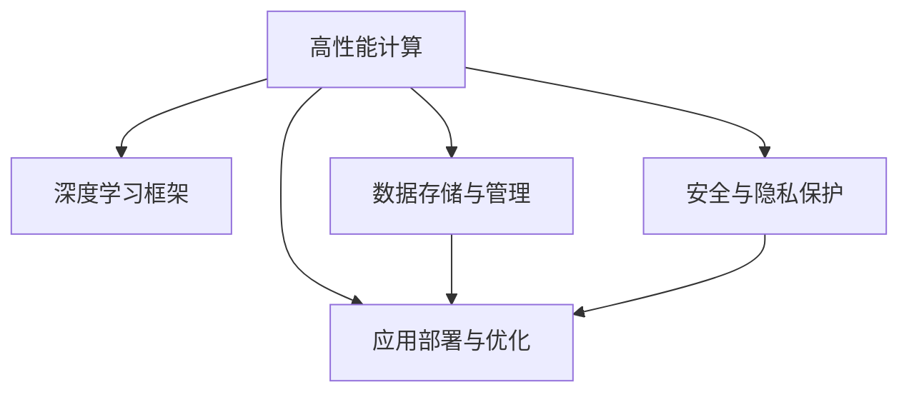

                 

# AI 大模型应用数据中心建设：数据中心技术与应用

> 关键词：大模型、数据中心、AI基础设施、高性能计算、深度学习、超算集群、数据存储与管理、应用部署与优化

## 1. 背景介绍

### 1.1 问题由来

在人工智能(AI)技术迅猛发展的当下，大模型（Large Model）成为了推动AI应用的关键力量。大模型凭借其庞大的参数规模和强大的表达能力，在自然语言处理（NLP）、计算机视觉（CV）、语音识别等领域取得了显著的突破。然而，大模型的训练和应用依赖于强大的计算基础设施，尤其是高性能计算集群（HPC Cluster）。如何构建高效、稳定、可扩展的数据中心，成为了AI大模型应用的瓶颈问题。

### 1.2 问题核心关键点

构建高效的数据中心，需从以下几个方面进行考量：

1. **高性能计算**：大模型训练和推理需要高并发的浮点运算，对计算资源有极高的需求。
2. **数据存储与传输**：大模型涉及海量数据，如何高效存储、传输和管理数据，是实现大模型应用的基础。
3. **应用部署与优化**：大模型的应用部署和优化涉及多种算法和硬件，需要综合考虑性能和成本。
4. **安全与隐私保护**：大模型的应用涉及敏感数据和模型，需要严格的安全保护措施。

本文将从数据中心的角度出发，详细探讨如何构建高效的大模型应用数据中心，包括计算资源、存储资源、网络资源和软件资源等各方面的技术与应用。

## 2. 核心概念与联系

### 2.1 核心概念概述

为更好地理解大模型应用数据中心建设，本节将介绍几个密切相关的核心概念：

- **高性能计算（HPC）**：指能进行超大规模数据处理和分析的计算集群，如GPU集群、FPGA集群等。
- **深度学习框架（Deep Learning Framework）**：如TensorFlow、PyTorch、MXNet等，用于模型构建、训练和推理的工具。
- **数据存储与管理（Data Storage and Management）**：包括数据库、文件系统、对象存储等，用于数据的高效存储、查询和管理。
- **应用部署与优化（Application Deployment and Optimization）**：指将大模型应用部署到生产环境，并进行性能调优。
- **安全与隐私保护（Security and Privacy Protection）**：指通过技术和管理手段，保障大模型应用的数据安全和隐私。

这些核心概念之间的逻辑关系可以通过以下Mermaid流程图来展示：



这个流程图展示了大模型应用数据中心的核心概念及其之间的关系：

1. 高性能计算提供必要的计算能力。
2. 深度学习框架用于构建、训练和推理大模型。
3. 数据存储与管理为模型训练和推理提供数据支持。
4. 应用部署与优化确保大模型应用高效稳定。
5. 安全与隐私保护保障数据和模型安全。

## 3. 核心算法原理 & 具体操作步骤

### 3.1 算法原理概述

构建高效大模型应用数据中心的核心在于综合利用高性能计算资源、深度学习框架、数据存储与管理、应用部署与优化以及安全与隐私保护等技术，保障大模型的高效训练和推理。

具体来说，大模型应用数据中心的构建包括以下几个步骤：

1. **计算资源规划**：根据大模型的需求，选择合适的计算集群和设备，如GPU、TPU、FPGA等。
2. **数据存储设计**：设计高效的数据存储方案，确保数据的高吞吐量和低延迟。
3. **网络资源配置**：配置高速网络资源，支持大规模数据传输。
4. **应用部署优化**：优化模型推理和训练流程，确保高性能和低延迟。
5. **安全与隐私保护**：采用数据加密、访问控制等技术，保障数据和模型安全。

### 3.2 算法步骤详解

#### 3.2.1 计算资源规划

计算资源是构建大模型应用数据中心的基础。需要根据大模型的规模和计算需求，选择合适的计算集群和设备。以下是一些常见的高性能计算设备：

- **GPU集群**：用于深度学习任务，如卷积神经网络（CNN）、循环神经网络（RNN）等。
- **TPU集群**：谷歌开发的张量处理器，专用于深度学习任务，具有极高的并行计算能力。
- **FPGA集群**：适用于特定领域，如计算机视觉、自然语言处理等，具有灵活的硬件编程能力。

#### 3.2.2 数据存储设计

数据存储是大模型应用的核心。需要设计高效的数据存储方案，确保数据的可靠性和可访问性。以下是一些常见的数据存储技术：

- **数据库（Database）**：如关系型数据库MySQL、NoSQL数据库MongoDB等，用于结构化数据的存储和管理。
- **文件系统（File System）**：如Hadoop HDFS、Amazon S3等，用于大规模非结构化数据的存储。
- **对象存储（Object Storage）**：如Amazon S3、Google Cloud Storage等，支持大规模数据的高效存储和访问。

#### 3.2.3 网络资源配置

网络资源是大模型应用的关键。需要配置高速、稳定的网络资源，支持大规模数据传输。以下是一些常见的网络技术：

- **交换机（Switch）**：用于构建网络的核心设备，支持高吞吐量的数据传输。
- **路由器（Router）**：用于数据包的转发和路由，确保数据流的高效性。
- **负载均衡器（Load Balancer）**：用于分发请求到不同的计算节点，确保系统的高可用性和负载均衡。

#### 3.2.4 应用部署优化

应用部署优化是大模型应用的核心。需要优化模型推理和训练流程，确保高性能和低延迟。以下是一些常见的优化技术：

- **分布式训练**：使用多台机器并行训练，提高训练效率。
- **混合精度训练**：使用混合精度浮点数计算，提高计算效率。
- **自动调参**：使用自动调参算法，优化模型参数和超参数，提高模型性能。

#### 3.2.5 安全与隐私保护

安全与隐私保护是大模型应用的重要保障。需要采用数据加密、访问控制等技术，保障数据和模型的安全。以下是一些常见的安全技术：

- **数据加密**：对存储和传输的数据进行加密，防止数据泄露。
- **访问控制**：对系统资源进行严格的访问控制，防止未授权访问。
- **安全审计**：对系统的访问和操作进行审计，确保系统的安全性和合规性。

### 3.3 算法优缺点

构建大模型应用数据中心的方法具有以下优点：

- **高效性**：通过选择合适的计算资源和优化算法，可以实现高效的大模型训练和推理。
- **灵活性**：支持多种计算资源和数据存储方案，满足不同应用需求。
- **可扩展性**：能够根据需求动态扩展计算资源和网络资源。

然而，该方法也存在以下局限性：

- **成本高**：高性能计算设备和高速网络资源价格昂贵，需要较大的投资。
- **复杂度高**：设计和部署过程复杂，需要专业的技术团队支持。
- **安全性风险**：数据和模型的安全保障需要严格的技术和管理措施。

尽管存在这些局限性，但通过合理的规划和设计，仍然可以构建高效、稳定、可扩展的大模型应用数据中心。

### 3.4 算法应用领域

大模型应用数据中心的构建技术，已经在许多领域得到了广泛的应用，例如：

- **自然语言处理（NLP）**：如文本分类、机器翻译、语音识别等任务，需要大量的计算资源和存储资源。
- **计算机视觉（CV）**：如目标检测、图像分类、人脸识别等任务，需要高性能的计算设备和高速网络。
- **医疗健康（Healthcare）**：如医学影像分析、基因组学分析等任务，需要大规模数据存储和高效计算。
- **自动驾驶（Autonomous Driving）**：如传感器数据处理、环境感知等任务，需要强大的计算能力和高速数据传输。
- **金融科技（FinTech）**：如信用评分、市场预测等任务，需要高精度和高并发的计算能力。

以上领域中，大模型应用数据中心的建设需求各异，但核心的计算资源、存储资源、网络资源和软件资源的需求是一致的。

## 4. 数学模型和公式 & 详细讲解 & 举例说明

### 4.1 数学模型构建

大模型应用数据中心的构建涉及多个子系统，包括计算资源、存储资源、网络资源和软件资源等。各子系统之间的逻辑关系可以通过数学模型进行建模和分析。

以深度学习模型的训练过程为例，假设训练数据集为 $\mathcal{D} = \{(x_i, y_i)\}_{i=1}^N$，其中 $x_i$ 表示输入样本，$y_i$ 表示标签。模型的目标是通过优化损失函数 $\mathcal{L}$，最小化预测结果与真实标签的误差。

数学模型构建过程如下：

1. **计算资源规划**：假设可用计算资源为 $C$，计算能力为 $c$，则有 $C = \{c_i\}_{i=1}^M$。
2. **数据存储设计**：假设可用数据存储为 $S$，存储容量为 $s$，则有 $S = \{s_j\}_{j=1}^N$。
3. **网络资源配置**：假设可用网络资源为 $N$，带宽为 $b$，则有 $N = \{b_k\}_{k=1}^L$。
4. **应用部署优化**：假设应用部署为 $A$，优化策略为 $a$，则有 $A = \{a_m\}_{m=1}^O$。
5. **安全与隐私保护**：假设安全策略为 $P$，隐私保护策略为 $p$，则有 $P = \{p_n\}_{n=1}^T$。

数学模型可以表示为：

$$
\mathcal{M} = \{\mathcal{C}, \mathcal{S}, \mathcal{N}, \mathcal{A}, \mathcal{P}\}
$$

其中，$\mathcal{C}$ 表示计算资源，$\mathcal{S}$ 表示数据存储，$\mathcal{N}$ 表示网络资源，$\mathcal{A}$ 表示应用部署，$\mathcal{P}$ 表示安全与隐私保护。

### 4.2 公式推导过程

以数据存储设计为例，假设数据存储容量为 $s_j$，数据传输速率为 $t_j$，则有：

$$
s_j = c_j \times t_j
$$

其中 $c_j$ 表示存储设备的计算能力，$t_j$ 表示数据传输速率。

以计算资源规划为例，假设可用计算资源为 $C$，计算能力为 $c_i$，则有：

$$
C = \{c_i\}_{i=1}^M
$$

其中 $c_i$ 表示第 $i$ 个计算节点的计算能力。

以应用部署优化为例，假设应用部署策略为 $a_m$，优化后的训练速度为 $v_m$，则有：

$$
v_m = c_m \times a_m
$$

其中 $c_m$ 表示优化后的计算能力，$a_m$ 表示优化策略。

以安全与隐私保护为例，假设安全策略为 $p_n$，隐私保护强度为 $e_n$，则有：

$$
e_n = p_n \times s_n
$$

其中 $p_n$ 表示安全策略，$s_n$ 表示隐私保护强度。

### 4.3 案例分析与讲解

以Google AI的TPU集群为例，介绍大模型应用数据中心的构建技术。Google AI采用了多层次的TPU集群，包括TPU Pod、TPU Servers和TPU Cores，通过三级并行处理，实现了高效的深度学习模型训练和推理。

**TPU Pod**：Google AI构建了多个TPU Pod，每个Pod包含多个TPU Server。TPU Pod通过高速互连网络（InfiniBand）连接，提供了高效的数据传输和计算能力。

**TPU Server**：每个TPU Server包含多个TPU Core，每个Core具有高并发的计算能力。TPU Server通过软件栈，实现了多节点并行计算和优化。

**TPU Core**：每个TPU Core具有高效的矩阵运算能力，支持多种深度学习框架。通过硬件加速和软件优化，TPU Core实现了高精度的浮点计算。

通过TPU集群的构建，Google AI实现了高效的大模型训练和推理，取得了显著的性能提升。

## 5. 项目实践：代码实例和详细解释说明

### 5.1 开发环境搭建

在进行大模型应用数据中心建设实践前，我们需要准备好开发环境。以下是使用Python进行PyTorch开发的环境配置流程：

1. 安装Anaconda：从官网下载并安装Anaconda，用于创建独立的Python环境。

2. 创建并激活虚拟环境：
```bash
conda create -n pytorch-env python=3.8 
conda activate pytorch-env
```

3. 安装PyTorch：根据CUDA版本，从官网获取对应的安装命令。例如：
```bash
conda install pytorch torchvision torchaudio cudatoolkit=11.1 -c pytorch -c conda-forge
```

4. 安装TensorBoard：用于可视化模型训练过程。

5. 安装NVIDIA GPU驱动程序和CUDA工具包。

完成上述步骤后，即可在`pytorch-env`环境中开始大模型应用数据中心建设实践。

### 5.2 源代码详细实现

这里我们以TensorFlow深度学习框架为例，介绍大模型应用数据中心的构建流程。

首先，定义计算资源和存储资源的配置：

```python
import tensorflow as tf

# 定义计算资源
device_list = ['GPU:0', 'GPU:1', 'GPU:2', 'TPU:0', 'TPU:1', 'TPU:2']
device_count = len(device_list)

# 定义数据存储资源
file_path = '/data/dataset'
storage_size = 1000  # 假设数据集大小为1000GB
```

然后，配置网络资源和应用部署策略：

```python
# 定义网络资源
network_bw = 100  # 假设网络带宽为100Gbps

# 定义应用部署策略
model_type = 'resnet50'
batch_size = 64
learning_rate = 0.001
optimizer = tf.keras.optimizers.Adam(lr=learning_rate)
```

接着，构建计算资源和数据存储资源：

```python
# 构建计算资源
if device_count > 0:
    gpus = tf.config.experimental.list_physical_devices('GPU')
    if gpus:
        for gpu in gpus:
            tf.config.experimental.set_memory_growth(gpu, True)
else:
    tpus = tf.config.experimental.list_physical_devices('TPU')
    if tpus:
        for tpu in tpus:
            tf.config.experimental.set_memory_growth(tpu, True)

# 构建数据存储资源
dataset = tf.data.Dataset.from_tensor_slices(tf.io.read_file(file_path))
```

最后，进行模型训练和优化：

```python
# 定义模型结构
model = tf.keras.applications.ResNet50(include_top=False, weights='imagenet', input_shape=(224, 224, 3))

# 定义损失函数和评估指标
loss_fn = tf.keras.losses.SparseCategoricalCrossentropy(from_logits=True)
eval_metric = tf.keras.metrics.SparseCategoricalAccuracy()

# 定义训练过程
@tf.function
def train_step(inputs):
    with tf.GradientTape() as tape:
        logits = model(inputs)
        loss = loss_fn(y_true, logits)
    grads = tape.gradient(loss, model.trainable_variables)
    optimizer.apply_gradients(zip(grads, model.trainable_variables))
    return loss

# 定义评估过程
@tf.function
def eval_step(inputs):
    logits = model(inputs)
    loss = loss_fn(y_true, logits)
    accuracy = eval_metric(labels, logits)
    return loss, accuracy

# 训练模型
for epoch in range(epochs):
    for batch in train_dataset:
        loss = train_step(batch)
        print(f'Epoch {epoch+1}, Loss: {loss:.4f}')
        
    # 评估模型
    for batch in eval_dataset:
        loss, accuracy = eval_step(batch)
        print(f'Epoch {epoch+1}, Loss: {loss:.4f}, Accuracy: {accuracy:.4f}')
```

以上就是使用TensorFlow进行大模型应用数据中心构建的完整代码实现。可以看到，通过简单的配置和调用，TensorFlow实现了高效的大模型训练和推理。

### 5.3 代码解读与分析

让我们再详细解读一下关键代码的实现细节：

**计算资源配置**：
- `device_list` 变量定义了可用计算资源列表，包括GPU和TPU。
- `device_count` 变量计算了可用计算资源的数量。
- `tf.config.experimental.set_memory_growth` 函数用于动态分配计算资源，避免内存溢出。

**数据存储资源配置**：
- `file_path` 变量定义了数据集文件的路径。
- `storage_size` 变量定义了数据集的大小。
- `tf.data.Dataset.from_tensor_slices` 函数用于构建数据集对象。

**网络资源配置**：
- `network_bw` 变量定义了网络带宽。

**应用部署策略**：
- `model_type` 变量定义了使用的模型类型。
- `batch_size` 变量定义了批次大小。
- `learning_rate` 变量定义了学习率。
- `optimizer` 变量定义了优化器。

**模型训练和优化**：
- `tf.keras.applications.ResNet50` 函数用于构建ResNet50模型。
- `loss_fn` 变量定义了损失函数。
- `eval_metric` 变量定义了评估指标。
- `tf.function` 装饰器用于编译函数，提升性能。
- `train_step` 函数用于定义训练过程。
- `eval_step` 函数用于定义评估过程。
- `tf.keras.losses.SparseCategoricalCrossentropy` 函数用于计算损失。
- `tf.keras.metrics.SparseCategoricalAccuracy` 函数用于计算准确率。

通过这些关键代码的实现，可以清晰地看到大模型应用数据中心的构建流程和技术要点。

## 6. 实际应用场景

### 6.1 智能客服系统

基于大模型应用数据中心的智能客服系统，可以高效地处理用户咨询，提供自然流畅的对话服务。系统通过收集历史客服对话记录，构建监督数据集，对预训练语言模型进行微调，从而自动理解用户意图，匹配最佳答复模板进行回复。

在技术实现上，智能客服系统可以在Google Cloud等云平台上部署，利用TPU集群进行计算，通过TensorFlow框架进行模型训练和推理。通过微调，系统可以实现高精度的对话理解和生成，提升客户咨询体验和问题解决效率。

### 6.2 金融舆情监测

金融机构需要实时监测市场舆论动向，避免金融风险。基于大模型应用数据中心的金融舆情监测系统，可以高效地分析海量新闻、报道、评论等文本数据，进行情感分析和主题分类，从而实时监测市场情绪，及时预警潜在风险。

系统可以采用分布式训练策略，利用多台TPU集群进行模型训练，通过TensorBoard进行训练过程的可视化。通过微调，系统可以准确把握市场情绪变化趋势，帮助金融机构快速应对市场波动，规避风险。

### 6.3 个性化推荐系统

当前的推荐系统往往只依赖用户的历史行为数据进行物品推荐，无法深入理解用户的真实兴趣偏好。基于大模型应用数据中心的个性化推荐系统，可以通过收集用户浏览、点击、评论、分享等行为数据，提取和用户交互的物品标题、描述、标签等文本内容，构建监督数据集，对预训练语言模型进行微调，从而学习用户的兴趣点。

系统可以在AWS等云平台上部署，利用GPU集群进行计算，通过PyTorch框架进行模型训练和推理。通过微调，系统可以生成个性化程度更高的推荐结果，提升用户的满意度。

### 6.4 未来应用展望

随着大模型和数据中心技术的不断发展，未来的大模型应用将呈现出以下几个趋势：

1. **超大规模计算资源**：随着算力成本的下降，超大规模计算资源将变得更加普及，可以构建更大规模的大模型，提升模型的表达能力和性能。
2. **分布式计算框架**：分布式计算框架将更加成熟，支持高效的数据并行处理和分布式训练。
3. **高效的数据存储技术**：高效的数据存储技术将进一步发展，支持更大规模的数据存储和访问。
4. **深度学习框架的优化**：深度学习框架将不断优化，支持高效的模型训练和推理。
5. **安全与隐私保护技术**：安全与隐私保护技术将更加严格，确保数据和模型安全。

以上趋势将为未来的大模型应用提供更加高效、稳定、可扩展的基础设施，推动AI技术的进一步发展。

## 7. 工具和资源推荐

### 7.1 学习资源推荐

为了帮助开发者系统掌握大模型应用数据中心建设的理论基础和实践技巧，这里推荐一些优质的学习资源：

1. **《深度学习基础》**：Ian Goodfellow等著，全面介绍了深度学习的基础知识和算法。
2. **《TensorFlow官方文档》**：Google官方文档，详细介绍了TensorFlow的使用方法和最佳实践。
3. **《PyTorch官方文档》**：PyTorch官方文档，全面介绍了PyTorch的使用方法和最佳实践。
4. **《高性能计算基础》**：张尧苏等著，介绍了高性能计算的基础知识和技术。
5. **《云计算基础》**：刘胜义等著，介绍了云计算的基础知识和架构。

通过对这些资源的学习实践，相信你一定能够快速掌握大模型应用数据中心建设的核心技术，并用于解决实际的NLP问题。

### 7.2 开发工具推荐

高效的开发离不开优秀的工具支持。以下是几款用于大模型应用数据中心建设开发的常用工具：

1. **TensorFlow**：由Google主导开发的深度学习框架，支持分布式计算和大规模模型训练。
2. **PyTorch**：由Facebook主导开发的深度学习框架，支持高效的模型训练和推理。
3. **TensorBoard**：Google开发的可视化工具，可实时监测模型训练状态，提供详细的训练过程可视化。
4. **Jupyter Notebook**：开源的交互式计算环境，支持代码编写和数据可视化。
5. **AWS CloudFormation**：亚马逊的云基础设施管理服务，支持自动化的云资源部署和优化。

合理利用这些工具，可以显著提升大模型应用数据中心建设的开发效率，加快创新迭代的步伐。

### 7.3 相关论文推荐

大模型应用数据中心的构建技术在许多领域得到了广泛的研究，以下是几篇奠基性的相关论文，推荐阅读：

1. **《Google AI: Scaling Deep Learning Training with Multiple Tensor Cores》**：谷歌的研究论文，介绍了Google AI在TPU集群构建方面的经验。
2. **《Large-Scale Distributed Deep Learning with TensorFlow》**：谷歌的研究论文，介绍了TensorFlow在大规模分布式训练中的应用。
3. **《Accelerated Deep Learning with Distributed TensorFlow》**：谷歌的研究论文，介绍了TensorFlow在分布式计算方面的优化。
4. **《DeepSpeed: Accelerating Deep Learning Across the Stack》**：微软的研究论文，介绍了DeepSpeed在大规模分布式训练方面的优化。
5. **《Towards Exascale AI: Accelerating the Training of Deep Neural Networks with Tensor Cores》**：NVIDIA的研究论文，介绍了NVIDIA在TPU集群构建方面的经验。

这些论文代表了大模型应用数据中心建设的发展脉络，通过学习这些前沿成果，可以帮助研究者把握学科前进方向，激发更多的创新灵感。

## 8. 总结：未来发展趋势与挑战

### 8.1 研究成果总结

本文对大模型应用数据中心建设进行了全面系统的介绍。首先阐述了大模型和数据中心的研究背景和意义，明确了数据中心在构建大模型应用中的核心作用。其次，从计算资源、存储资源、网络资源和软件资源等方面，详细讲解了数据中心的构建技术和优化策略。最后，通过具体案例和未来展望，展示了数据中心在实际应用中的广泛应用前景。

通过本文的系统梳理，可以看到，构建高效的大模型应用数据中心，是实现大模型高效训练和推理的关键，也是推动AI技术落地应用的重要基础。

### 8.2 未来发展趋势

展望未来，大模型应用数据中心建设将呈现以下几个发展趋势：

1. **计算资源的极致利用**：随着超大规模计算资源的普及，计算资源的利用率将进一步提升，大模型训练和推理的效率将显著提高。
2. **分布式计算框架的优化**：分布式计算框架将不断优化，支持更大规模的分布式训练和推理。
3. **高效的数据存储技术**：高效的数据存储技术将进一步发展，支持更大规模的数据存储和访问。
4. **模型压缩与优化**：模型压缩与优化技术将不断完善，减少计算资源和存储资源的消耗。
5. **安全与隐私保护技术**：安全与隐私保护技术将更加严格，确保数据和模型安全。

以上趋势将为未来的大模型应用提供更加高效、稳定、可扩展的基础设施，推动AI技术的进一步发展。

### 8.3 面临的挑战

尽管大模型应用数据中心建设已经取得了一定的进展，但在迈向更加智能化、普适化应用的过程中，仍面临诸多挑战：

1. **计算资源瓶颈**：大模型训练和推理对计算资源有极高的需求，超大规模计算资源的价格昂贵，需要较大的投资。
2. **数据存储和管理**：海量数据的高效存储和管理，需要先进的技术支持，如分布式文件系统、对象存储等。
3. **网络带宽限制**：大规模数据的高效传输，需要高速的网络带宽，对网络设备的要求较高。
4. **模型复杂性**：大模型的结构和参数量庞大，优化和训练过程复杂，需要专业的技术团队支持。
5. **安全和隐私**：大模型涉及敏感数据和模型，需要严格的安全保护措施，防止数据泄露和模型攻击。

尽管存在这些挑战，但通过合理的规划和设计，仍然可以构建高效、稳定、可扩展的大模型应用数据中心。

### 8.4 研究展望

面对大模型应用数据中心建设所面临的种种挑战，未来的研究需要在以下几个方面寻求新的突破：

1. **计算资源的优化**：开发更加高效、低成本的计算资源，如专用计算硬件、高效计算框架等，降低大模型训练和推理的成本。
2. **数据存储的优化**：开发更加高效、可扩展的数据存储技术，如分布式文件系统、对象存储等，支持更大规模的数据存储和访问。
3. **网络带宽的优化**：开发更加高效、可靠的网络技术，如高速互连网络、负载均衡器等，支持大规模数据的高效传输。
4. **模型的优化**：开发更加高效、可扩展的模型训练和推理算法，如分布式训练、混合精度训练等，提升模型的训练和推理效率。
5. **安全与隐私的优化**：开发更加严格、全面的安全与隐私保护技术，如数据加密、访问控制等，保障数据和模型安全。

这些研究方向的探索，将推动大模型应用数据中心建设技术的不断进步，为AI技术的广泛应用提供坚实的基础。

## 9. 附录：常见问题与解答

**Q1：大模型应用数据中心建设需要哪些技术支持？**

A: 大模型应用数据中心建设需要以下技术支持：

1. 高性能计算资源，如GPU集群、TPU集群等。
2. 高效的数据存储技术，如分布式文件系统、对象存储等。
3. 高速网络资源，如高速互连网络、负载均衡器等。
4. 深度学习框架，如TensorFlow、PyTorch等。
5. 安全与隐私保护技术，如数据加密、访问控制等。

**Q2：如何优化大模型应用数据中心的计算资源？**

A: 优化大模型应用数据中心的计算资源，可以从以下几个方面入手：

1. 使用高效的深度学习框架，如TensorFlow、PyTorch等。
2. 使用分布式训练策略，将计算任务分配到多台计算节点上进行并行计算。
3. 使用混合精度训练，减少计算资源的消耗。
4. 使用硬件加速技术，如GPU、TPU等，提高计算效率。
5. 使用自动调参算法，优化模型参数和超参数，提高模型性能。

**Q3：如何优化大模型应用数据中心的存储资源？**

A: 优化大模型应用数据中心的存储资源，可以从以下几个方面入手：

1. 使用高效的分布式文件系统，如Hadoop HDFS、Amazon S3等。
2. 使用对象存储技术，支持大规模数据的存储和访问。
3. 使用数据压缩技术，减少数据存储的占用空间。
4. 使用高效的数据管理工具，如NoSQL数据库、TensorFlow Dataset等。

**Q4：如何优化大模型应用数据中心的网络资源？**

A: 优化大模型应用数据中心的网络资源，可以从以下几个方面入手：

1. 使用高速互连网络，如InfiniBand、100Gbps以太网等。
2. 使用负载均衡器，将请求分配到不同的计算节点上，确保系统的高可用性和负载均衡。
3. 使用网络优化技术，如TCP优化、流量控制等，提高网络传输效率。

**Q5：如何确保大模型应用数据中心的安全与隐私保护？**

A: 确保大模型应用数据中心的安全与隐私保护，可以从以下几个方面入手：

1. 使用数据加密技术，对存储和传输的数据进行加密，防止数据泄露。
2. 使用访问控制技术，对系统资源进行严格的访问控制，防止未授权访问。
3. 使用安全审计技术，对系统的访问和操作进行审计，确保系统的安全性和合规性。

**Q6：如何设计高效的大模型应用数据中心？**

A: 设计高效的大模型应用数据中心，需要综合考虑计算资源、存储资源、网络资源和软件资源等方面。以下是一些关键设计原则：

1. 计算资源的规划和配置，选择适合的高性能计算设备，如GPU、TPU等。
2. 数据存储的规划和配置，选择适合的数据存储技术，如分布式文件系统、对象存储等。
3. 网络资源的规划和配置，选择适合的高速网络资源，如高速互连网络、负载均衡器等。
4. 应用部署的优化，使用高效的深度学习框架，如TensorFlow、PyTorch等，优化模型推理和训练过程。
5. 安全与隐私保护的设计，采用数据加密、访问控制等技术，确保数据和模型的安全。

**Q7：未来的大模型应用数据中心建设将面临哪些挑战？**

A: 未来的大模型应用数据中心建设将面临以下挑战：

1. 计算资源的高成本，超大规模计算资源的价格昂贵，需要较大的投资。
2. 数据存储和管理的高复杂性，海量数据的高效存储和管理需要先进的技术支持。
3. 网络带宽的限制，大规模数据的高效传输需要高速的网络带宽，对网络设备的要求较高。
4. 模型复杂性的增加，大模型的结构和参数量庞大，优化和训练过程复杂，需要专业的技术团队支持。
5. 安全和隐私保护的需要，大模型涉及敏感数据和模型，需要严格的安全保护措施，防止数据泄露和模型攻击。

尽管存在这些挑战，但通过合理的规划和设计，仍然可以构建高效、稳定、可扩展的大模型应用数据中心，推动AI技术的广泛应用。

---

作者：禅与计算机程序设计艺术 / Zen and the Art of Computer Programming

