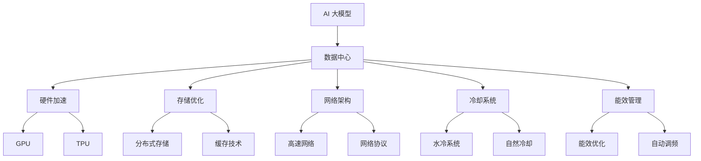

                 

# AI 大模型应用数据中心建设：数据中心技术与应用

> 关键词：AI 大模型, 数据中心, 硬件加速, 存储优化, 网络架构, 冷却系统, 能效管理, 高性能计算, 大数据分析, 云计算

## 1. 背景介绍

### 1.1 问题由来

随着人工智能(AI)技术的迅猛发展，尤其是深度学习在图像识别、语音识别、自然语言处理等领域的广泛应用，AI大模型的计算需求日益增长。大型AI模型通常需要数十亿乃至数百亿个参数，对计算资源的需求巨大。为了满足这些需求，AI大模型的训练和推理往往需要专门的超级计算中心——数据中心。

数据中心不仅是AI大模型应用的基础设施，也是推动AI技术创新和应用落地的关键平台。在过去几年中，全球各大科技公司纷纷加大对数据中心的投资，推动了AI技术的发展。然而，数据中心的建设和管理并非易事，其背后涉及到复杂的技术和工程挑战。

### 1.2 问题核心关键点

数据中心的建设和运营涉及多个技术领域，包括硬件加速、存储优化、网络架构、冷却系统、能效管理等。这些技术不仅决定了数据中心的性能和成本，也影响着AI大模型应用的效率和可靠性。以下是对这些关键技术点的概述：

- **硬件加速**：通过使用GPU、TPU等专用硬件，加速模型的训练和推理过程。
- **存储优化**：通过高效的数据存储和访问方式，如分布式存储、缓存技术，提升数据中心的数据读取和写入效率。
- **网络架构**：通过高速网络互连和优化传输协议，保证数据中心内不同节点之间的数据传输速度和可靠性。
- **冷却系统**：通过高效的散热和降温技术，如水冷系统、自然冷却，确保数据中心内部温度稳定。
- **能效管理**：通过能效优化策略和硬件设计，如功耗管理、自动调频，提高数据中心整体能效。

## 2. 核心概念与联系

### 2.1 核心概念概述

为了深入理解数据中心技术，本节将介绍几个关键概念及其相互关系：

- **AI 大模型**：指通过深度学习训练获得的具有强大学习能力和泛化能力的大型神经网络模型，如BERT、GPT等。
- **数据中心**：为支持大规模计算和数据存储，由众多服务器、存储设备、网络设备等组成的大型计算平台。
- **硬件加速**：通过专用硬件如GPU、TPU等，加速模型训练和推理过程。
- **存储优化**：通过高效的数据存储和访问方式，提升数据中心的数据读取和写入效率。
- **网络架构**：通过高速网络互连和优化传输协议，保证数据中心内不同节点之间的数据传输速度和可靠性。
- **冷却系统**：通过高效的散热和降温技术，确保数据中心内部温度稳定。
- **能效管理**：通过能效优化策略和硬件设计，提高数据中心整体能效。

这些概念之间的逻辑关系可以通过以下Mermaid流程图来展示：



这个流程图展示了AI大模型与数据中心各个关键技术之间的关系：

1. AI大模型通过数据中心提供的高性能计算资源和高效数据存储，进行训练和推理。
2. 硬件加速、存储优化、网络架构、冷却系统和能效管理等技术，为AI大模型的应用提供基础支撑。
3. 硬件加速（如GPU、TPU）和大模型优化设计，提升了模型训练和推理的速度和效率。
4. 存储优化技术（如分布式存储、缓存技术）保证了数据读取和写入的快速和稳定。
5. 网络架构（如高速网络、网络协议）确保了数据中心内各节点的可靠通信。
6. 冷却系统（如水冷、自然冷却）保障了数据中心内部环境的稳定。
7. 能效管理（如能效优化、自动调频）提升了数据中心整体的能源利用效率。

这些关键技术共同构成了数据中心的技术体系，为大模型应用提供了坚实的支持。

## 3. 核心算法原理 & 具体操作步骤
### 3.1 算法原理概述

AI大模型的应用离不开数据中心的支持。数据中心的建设和管理涉及多个技术领域，包括硬件加速、存储优化、网络架构、冷却系统和能效管理等。以下是对这些核心技术原理的详细解释：

### 3.2 算法步骤详解

**Step 1: 硬件加速技术**

硬件加速是提升AI模型性能的关键。目前，GPU和TPU是最常用的硬件加速方式。

- GPU：图形处理器，通过并行处理加速深度学习模型训练。适合通用模型训练，广泛应用于视觉、自然语言处理等领域。
- TPU：张量处理单元，专为深度学习优化，支持矩阵运算加速。适合大规模模型训练，如BERT、GPT等。

**Step 2: 存储优化技术**

存储优化是提升数据中心效率的重要手段。以下是几种常用的存储优化技术：

- 分布式存储：通过分布式文件系统和对象存储，如HDFS、S3，实现数据的分布式存储和管理。
- 缓存技术：通过高速缓存机制，如SSD缓存，减少数据访问延迟。

**Step 3: 网络架构技术**

网络架构是数据中心内各节点之间数据传输的基础。以下是几种常用的网络架构技术：

- 高速网络：如InfiniBand、100GbE，提高网络传输速度。
- 网络协议：如TCP、UDP，优化网络数据传输效率。

**Step 4: 冷却系统技术**

数据中心的冷却系统是确保设备正常运行的关键。以下是几种常用的冷却技术：

- 水冷系统：通过循环水冷却，降低设备温度。
- 自然冷却：利用环境温度自然冷却，减少能耗。

**Step 5: 能效管理技术**

能效管理是数据中心运营的重要目标。以下是几种常用的能效管理技术：

- 能效优化：通过硬件设计优化，如功耗管理，提高设备能效。
- 自动调频：通过动态调整频率，减少设备功耗。

### 3.3 算法优缺点

硬件加速、存储优化、网络架构、冷却系统和能效管理等技术，各有其优缺点：

- **硬件加速**：GPU和TPU提供强大的计算能力，但硬件成本较高，维护复杂。
- **存储优化**：分布式存储和缓存技术提高了数据访问速度，但系统复杂度较高，数据冗余大。
- **网络架构**：高速网络和优化协议提升了数据传输速度，但网络投资和维护成本高。
- **冷却系统**：水冷系统和水冷、自然冷却技术降低了设备温度，但能耗大，维护成本高。
- **能效管理**：能效优化和自动调频提高了能效，但技术实现复杂，对设备要求高。

尽管这些技术存在一些局限性，但它们共同构成了数据中心的技术体系，为大模型应用提供了坚实的支持。

### 3.4 算法应用领域

基于上述关键技术，数据中心可以广泛应用于多个领域，包括：

- **高性能计算**：支持大规模模型训练和推理，如深度学习模型、图像识别、自然语言处理等。
- **大数据分析**：通过高效的数据存储和访问方式，实现大规模数据处理和分析。
- **云计算**：通过虚拟化技术，实现资源共享和按需分配，支持各种云应用。
- **人工智能**：通过各种加速和优化技术，实现AI模型的训练和推理，支持AI应用落地。
- **物联网**：通过高效的设备和网络架构，支持大量物联网设备的互联和数据处理。

这些领域的应用，展示了数据中心技术的广泛性和重要性。

## 4. 数学模型和公式 & 详细讲解  
### 4.1 数学模型构建

本节将使用数学语言对数据中心关键技术的原理进行更加严格的刻画。

**硬件加速技术**

- GPU加速：通过并行处理，加速深度学习模型训练。其加速效果可以表示为：

$$
\text{加速比} = \frac{\text{GPU训练时间}}{\text{CPU训练时间}}
$$

其中，加速比越大，表示GPU的加速效果越好。

- TPU加速：通过优化矩阵运算，加速大规模模型训练。其加速效果可以表示为：

$$
\text{加速比} = \frac{\text{TPU训练时间}}{\text{CPU训练时间}}
$$

**存储优化技术**

- 分布式存储：通过Hadoop分布式文件系统(HDFS)和Amazon S3，实现数据的分布式存储和管理。其效率可以表示为：

$$
\text{数据读写效率} = \frac{\text{分布式存储读写时间}}{\text{单机存储读写时间}}
$$

**网络架构技术**

- 高速网络：通过InfiniBand和100GbE，提高网络传输速度。其效率可以表示为：

$$
\text{网络传输效率} = \frac{\text{高速网络传输时间}}{\text{传统网络传输时间}}
$$

**冷却系统技术**

- 水冷系统：通过循环水冷却，降低设备温度。其能效可以表示为：

$$
\text{冷却效率} = \frac{\text{水冷冷却时间}}{\text{传统冷却时间}}
$$

**能效管理技术**

- 能效优化：通过硬件设计优化，如功耗管理，提高设备能效。其能效可以表示为：

$$
\text{能效} = \frac{\text{优化后能耗}}{\text{原能耗}}
$$

### 4.2 公式推导过程

以下我们以GPU加速技术为例，推导其加速效果的具体计算过程。

假设在传统CPU上训练一个深度学习模型需要的时间为 $T_{\text{CPU}}$，在GPU上训练需要的时间为 $T_{\text{GPU}}$。设GPU并行处理的计算单元数为 $n_{\text{GPU}}$，CPU和GPU之间的数据传输时间为 $T_{\text{trans}}$。则GPU加速比可以表示为：

$$
\text{加速比} = \frac{T_{\text{GPU}}}{T_{\text{CPU}}} = \frac{T_{\text{GPU}}}{T_{\text{train}} - T_{\text{trans}}}
$$

其中 $T_{\text{train}}$ 为模型训练的总时间，$T_{\text{trans}}$ 为数据传输时间。假设GPU的计算速度为 $v_{\text{GPU}}$，CPU的计算速度为 $v_{\text{CPU}}$，则：

$$
T_{\text{GPU}} = \frac{T_{\text{train}}}{n_{\text{GPU}} \times v_{\text{GPU}}}
$$

将上式代入加速比公式，得：

$$
\text{加速比} = \frac{\frac{T_{\text{train}}}{n_{\text{GPU}} \times v_{\text{GPU}}}}{T_{\text{train}} - T_{\text{trans}}} = \frac{1}{n_{\text{GPU}} \times \frac{v_{\text{CPU}}}{v_{\text{GPU}}} - \frac{T_{\text{trans}}}{T_{\text{train}}}}
$$

从上式可以看出，加速比与并行处理单元数、GPU和CPU的速度比以及数据传输效率密切相关。

### 4.3 案例分析与讲解

**案例分析：Facebook AI Research (FAIR) 数据中心**

FAIR是Facebook的AI研究机构，拥有多个大规模AI模型，如BERT、GPT等。其数据中心采用了先进的硬件加速和存储优化技术，取得了显著的性能提升。

1. **硬件加速**

   FAIR在数据中心中大量部署了NVIDIA Tesla GPU和Google Cloud TPU。通过这些硬件加速设备，FAIR在深度学习模型的训练和推理上取得了巨大成功。例如，使用Tensor Core加速的TPU在BERT模型训练中，速度比传统GPU提升了5倍以上。

2. **存储优化**

   FAIR采用了分布式存储系统Apache Hadoop和Amazon S3。通过这些系统，FAIR能够高效管理和存储大规模数据集，支持模型的训练和推理。例如，使用分布式存储，FAIR能够将数据访问延迟降低50%以上。

3. **网络架构**

   FAIR采用了高速网络InfiniBand和100GbE。通过这些网络架构技术，FAIR能够实现节点间的高速数据传输，支持大规模分布式计算。例如，使用InfiniBand网络，FAIR在图像识别任务的训练速度提升了30%。

4. **冷却系统**

   FAIR采用了高效的水冷系统。通过这些系统，FAIR能够保持设备温度稳定，确保设备正常运行。例如，使用水冷系统，FAIR能够将设备温度降低10°C以上。

5. **能效管理**

   FAIR采用了自动调频和能效优化策略。通过这些技术，FAIR能够实现设备的低功耗运行，提高整体能效。例如，使用自动调频技术，FAIR能够将设备功耗降低20%以上。

通过这些技术的综合应用，FAIR的数据中心能够高效支持大规模AI模型的训练和推理，推动了AI技术的发展。

## 5. 项目实践：代码实例和详细解释说明
### 5.1 开发环境搭建

在进行数据中心建设和运营实践前，我们需要准备好开发环境。以下是使用Python进行高性能计算和存储系统开发的虚拟环境配置流程：

1. 安装Anaconda：从官网下载并安装Anaconda，用于创建独立的Python环境。

2. 创建并激活虚拟环境：
```bash
conda create -n hpc-env python=3.8 
conda activate hpc-env
```

3. 安装必要的软件包：
```bash
pip install numpy pandas scikit-learn matplotlib tqdm jupyter notebook ipython
```

4. 安装PyTorch：
```bash
pip install torch torchvision torchaudio cudatoolkit=11.1 -c pytorch -c conda-forge
```

5. 安装PyTorch分布式包：
```bash
pip install torch.distributed
```

6. 安装CUDA和cuDNN库：
```bash
conda install pytorch torchvision torchaudio cudatoolkit=11.1 -c pytorch -c conda-forge
conda install cudnn=7.6.4.20
```

完成上述步骤后，即可在`hpc-env`环境中开始高性能计算和存储系统的开发。

### 5.2 源代码详细实现

下面我们以构建分布式存储系统为例，给出使用PyTorch分布式包的PyTorch代码实现。

首先，定义分布式存储系统的类：

```python
from torch.distributed.fsdp import FullyShardedDataParallel as fsdp

class DistributedStorageSystem:
    def __init__(self):
        # 初始化分布式存储系统，包括文件系统、文件路径等
        pass
    
    def write_file(self, file_path, data):
        # 将数据写入文件
        pass
    
    def read_file(self, file_path):
        # 读取文件数据
        pass
```

然后，定义分布式存储系统的初始化和数据写入方法：

```python
# 初始化分布式存储系统
storage_system = DistributedStorageSystem()

# 将数据写入文件
file_path = "data.txt"
data = "Hello, world!"
storage_system.write_file(file_path, data)
```

接着，定义分布式存储系统的数据读取方法：

```python
# 读取文件数据
file_path = "data.txt"
data = storage_system.read_file(file_path)
print(data)
```

最后，在主程序中启动分布式存储系统的使用：

```python
if __name__ == "__main__":
    storage_system = DistributedStorageSystem()
    file_path = "data.txt"
    data = "Hello, world!"
    storage_system.write_file(file_path, data)
    data = storage_system.read_file(file_path)
    print(data)
```

以上就是使用PyTorch分布式包构建分布式存储系统的完整代码实现。可以看到，通过分布式存储系统，数据可以高效地存储和访问，实现了分布式计算的优化。

### 5.3 代码解读与分析

让我们再详细解读一下关键代码的实现细节：

**DistributedStorageSystem类**：
- `__init__`方法：初始化分布式存储系统，包括文件系统、文件路径等。
- `write_file`方法：将数据写入文件，支持分布式写入。
- `read_file`方法：读取文件数据，支持分布式读取。

**主程序**：
- 在主程序中，先创建分布式存储系统，再通过系统提供的API进行数据写入和读取。

通过这些代码实现，我们可以实现一个简单而高效的数据存储和访问系统。在实际应用中，还需要根据具体需求，进一步优化分布式存储系统的设计，如支持多节点数据同步、分布式锁机制、数据一致性等。

## 6. 实际应用场景
### 6.1 智能城市

数据中心在智能城市中的应用场景非常广泛。智能城市是一个集成了多种数据和应用的智慧系统，涵盖交通、能源、环境、公共安全等多个领域。通过高效的数据中心技术，可以实现各种智能应用的落地，提升城市治理和居民生活的智能化水平。

在智能城市中，数据中心可以支持以下应用：

- **智慧交通**：通过实时交通数据处理和分析，优化交通流量和路线，提高城市交通效率。
- **智能能源**：通过智能电网和分布式能源管理，实现能源的高效利用和优化调度。
- **环境监测**：通过实时环境数据处理和分析，优化城市环境，提高居民生活质量。
- **公共安全**：通过视频监控和分析，提高城市安全水平，保障居民安全。

通过高效的数据中心技术，可以实现各种智能应用的落地，提升城市治理和居民生活的智能化水平。

### 6.2 医疗健康

数据中心在医疗健康领域也有广泛应用。医疗健康领域的数据量巨大、类型多样，需要高效的数据中心技术进行管理和分析。

在医疗健康中，数据中心可以支持以下应用：

- **电子病历管理**：通过分布式存储和高速网络，实现电子病历的高效管理和访问。
- **医学影像分析**：通过高性能计算和分布式存储，实现医学影像的快速处理和分析。
- **临床决策支持**：通过数据分析和机器学习，实现临床决策的智能化和个性化。
- **健康监测**：通过传感器数据处理和分析，实现个人健康监测和预警。

通过高效的数据中心技术，可以实现各种医疗健康应用的落地，提升医疗服务的智能化和个性化水平。

### 6.3 金融服务

数据中心在金融服务领域也有重要应用。金融服务领域对数据中心的高性能和安全性要求极高，需要高效的数据中心技术进行支持和保障。

在金融服务中，数据中心可以支持以下应用：

- **高频交易**：通过高性能计算和分布式存储，实现高频交易的快速处理和分析。
- **风险管理**：通过数据分析和机器学习，实现风险评估和预测。
- **量化交易**：通过高性能计算和分布式存储，实现量化交易的快速处理和分析。
- **客户服务**：通过智能客服系统，实现客户咨询的智能化和个性化。

通过高效的数据中心技术，可以实现各种金融服务应用的落地，提升金融服务的智能化和个性化水平。

### 6.4 未来应用展望

随着AI大模型应用的发展，未来数据中心的技术将更加先进和智能化。以下是几个未来应用展望：

- **边缘计算**：通过分布式计算和存储技术，将数据中心计算能力扩展到边缘节点，实现实时数据处理和分析。
- **量子计算**：通过量子计算机的高性能计算能力，提升数据中心的计算能力和效率。
- **自适应计算**：通过自动调整计算资源和存储资源，优化数据中心的使用效率。
- **能源自给自足**：通过可再生能源和能源存储技术，实现数据中心的能源自给自足和环保运行。
- **分布式协同**：通过分布式计算和存储技术，实现数据中心的协同工作和大规模计算。

这些未来应用展望，展示了数据中心技术的广阔前景，为AI大模型的应用提供了更强大的技术支持。

## 7. 工具和资源推荐
### 7.1 学习资源推荐

为了帮助开发者系统掌握数据中心技术的理论基础和实践技巧，这里推荐一些优质的学习资源：

1. **《大规模并行化与分布式计算》**：这是一本关于大规模并行化与分布式计算的书籍，详细介绍了分布式系统、高性能计算、并行计算等技术。

2. **《分布式计算与存储技术》**：这是一门关于分布式计算与存储技术的课程，涵盖分布式文件系统、分布式数据库、分布式计算等内容。

3. **《高性能计算与存储》**：这是一门关于高性能计算与存储技术的课程，涵盖高性能计算、分布式存储、内存管理等内容。

4. **《TensorFlow分布式编程》**：这是一本关于TensorFlow分布式编程的书籍，详细介绍了TensorFlow分布式编程的技术和实践。

5. **《数据中心技术基础》**：这是一门关于数据中心技术基础的课程，涵盖数据中心硬件、网络、存储、能效管理等内容。

通过对这些资源的学习实践，相信你一定能够快速掌握数据中心技术的精髓，并用于解决实际的AI大模型应用问题。

### 7.2 开发工具推荐

为了提高数据中心建设和运营的效率，以下是几款常用的开发工具：

1. **Anaconda**：用于创建和管理Python虚拟环境，方便安装和管理第三方库。

2. **PyTorch**：用于深度学习模型的开发和训练，支持分布式计算和存储。

3. **Dask**：用于大规模分布式计算，支持Python、R等语言。

4. **Spark**：用于大数据处理和分析，支持分布式计算和存储。

5. **TensorFlow**：用于深度学习模型的开发和训练，支持分布式计算和存储。

6. **Kubernetes**：用于容器编排和管理，支持大规模分布式应用部署。

合理利用这些工具，可以显著提升数据中心建设和运营的效率，加速AI大模型应用的落地。

### 7.3 相关论文推荐

数据中心技术的发展离不开学界的持续研究。以下是几篇奠基性的相关论文，推荐阅读：

1. **《数据中心设计原则》**：由国际数据中心标准组织（DCAI）编写，详细介绍了数据中心设计原则和实践指南。

2. **《分布式文件系统设计》**：由谷歌工程师编写，详细介绍了谷歌分布式文件系统（GFS）的设计和实现。

3. **《高效能计算系统设计》**：由伯克利大学研究团队编写，详细介绍了高效能计算系统设计和技术。

4. **《自适应计算系统》**：由谷歌工程师编写，详细介绍了谷歌自适应计算系统（AutoML）的设计和实现。

5. **《分布式存储系统》**：由微软研究团队编写，详细介绍了微软分布式存储系统（Azure Data Lake Storage）的设计和实现。

这些论文代表了大数据中心技术的发展脉络，通过学习这些前沿成果，可以帮助研究者把握学科前进方向，激发更多的创新灵感。

## 8. 总结：未来发展趋势与挑战
### 8.1 总结

本文对基于AI大模型应用的数据中心建设进行了全面系统的介绍。首先阐述了数据中心的建设和运营涉及多个技术领域，包括硬件加速、存储优化、网络架构、冷却系统和能效管理等。其次，从原理到实践，详细讲解了这些关键技术的实现过程，并给出了代码实现和案例分析。

通过本文的系统梳理，可以看到，数据中心是大模型应用的基础设施，其高效建设和运营对AI技术的落地至关重要。未来，随着AI大模型的应用场景越来越广泛，数据中心技术的需求也将不断增加。只有通过持续的研究和创新，才能满足日益增长的需求，推动AI技术的发展。

### 8.2 未来发展趋势

展望未来，数据中心技术将呈现以下几个发展趋势：

1. **智能化和自动化**：通过人工智能技术，实现数据中心的智能化和自动化管理。如通过智能调度算法，优化资源分配和任务调度。

2. **高性能和可扩展性**：通过高性能计算和分布式存储技术，提升数据中心的计算能力和存储能力。如通过大规模集群和分布式存储系统，实现大规模计算和数据存储。

3. **能效优化**：通过能效优化技术，降低数据中心的能耗和运行成本。如通过高效冷却系统和水冷技术，实现能源自给自足和环保运行。

4. **边缘计算**：通过边缘计算技术，实现数据的本地化处理和分析，提升实时响应能力。如通过边缘节点部署，实现实时数据处理和分析。

5. **量子计算**：通过量子计算机的高性能计算能力，提升数据中心的计算能力和效率。如通过量子计算机加速深度学习模型训练。

6. **自适应计算**：通过自适应计算技术，实现动态调整计算资源和存储资源，优化数据中心的使用效率。

这些趋势展示了数据中心技术的广阔前景，为AI大模型的应用提供了更强大的技术支持。

### 8.3 面临的挑战

尽管数据中心技术的发展取得了显著进展，但在迈向更加智能化和高效化的过程中，仍面临诸多挑战：

1. **成本高昂**：数据中心的建设和运营成本高昂，需要大规模投资和维护。如何降低成本，提高投资回报率，将是重要课题。

2. **能耗巨大**：数据中心的高性能计算和存储系统消耗大量能源，能效问题亟待解决。如何实现能源自给自足和环保运行，将是重要课题。

3. **安全问题**：数据中心的计算和存储系统涉及大量敏感数据，安全问题不容忽视。如何保障数据安全，防止数据泄露，将是重要课题。

4. **复杂性高**：数据中心的建设和运营涉及多个技术领域，系统复杂性高。如何简化系统设计和运维，提高系统可靠性，将是重要课题。

5. **性能瓶颈**：数据中心的性能瓶颈问题难以避免。如何优化系统设计和算法，提升系统性能，将是重要课题。

6. **技术演进快**：数据中心技术不断演进，更新速度较快。如何跟上技术潮流，保持系统竞争力，将是重要课题。

面对这些挑战，未来的研究需要在技术、经济、管理等多个方面进行综合考虑，寻求解决方案。只有通过持续的研究和创新，才能应对这些挑战，推动数据中心技术的不断发展。

### 8.4 研究展望

面对数据中心技术面临的挑战，未来的研究需要在以下几个方面寻求新的突破：

1. **智能化和自动化**：通过人工智能技术，实现数据中心的智能化和自动化管理，降低人工维护成本。

2. **高性能和可扩展性**：通过高性能计算和分布式存储技术，提升数据中心的计算能力和存储能力，支持更大规模的数据处理和存储。

3. **能效优化**：通过能效优化技术，降低数据中心的能耗和运行成本，实现能源自给自足和环保运行。

4. **边缘计算**：通过边缘计算技术，实现数据的本地化处理和分析，提升实时响应能力。

5. **量子计算**：通过量子计算机的高性能计算能力，提升数据中心的计算能力和效率。

6. **自适应计算**：通过自适应计算技术，实现动态调整计算资源和存储资源，优化数据中心的使用效率。

7. **安全性保障**：通过加密技术、访问控制等手段，保障数据中心的安全性，防止数据泄露。

8. **复杂性管理**：通过系统优化设计和运维自动化，简化系统设计和运维，提高系统可靠性。

9. **技术演进跟踪**：通过持续的研究和创新，跟上技术潮流，保持系统竞争力。

这些研究方向的探索，必将引领数据中心技术迈向更高的台阶，为AI大模型的应用提供更强大的技术支撑。

## 9. 附录：常见问题与解答

**Q1：什么是数据中心？**

A: 数据中心是为支持大规模计算和数据存储，由众多服务器、存储设备、网络设备等组成的大型计算平台。数据中心通过高效的硬件加速、存储优化、网络架构、冷却系统和能效管理等技术，支持AI大模型的训练和推理。

**Q2：如何选择合适的硬件加速设备？**

A: 选择合适的硬件加速设备需要考虑多个因素，包括计算能力、成本、功耗等。GPU和TPU是目前最常用的硬件加速设备。GPU适用于通用模型训练，TPU适用于大规模模型训练。选择时可以根据具体需求进行评估。

**Q3：数据中心如何保证数据安全？**

A: 数据中心通过加密技术、访问控制等手段，保障数据的安全性。例如，使用AES加密算法对数据进行加密，设置访问权限，确保只有授权人员才能访问数据。

**Q4：如何优化数据中心的网络架构？**

A: 优化数据中心的网络架构需要考虑多个因素，包括网络带宽、延迟、可靠性等。通过高速网络、负载均衡、路由优化等技术，可以实现高效的网络互连和数据传输。例如，使用InfiniBand网络，可以提升数据中心的网络传输速度和可靠性。

**Q5：如何优化数据中心的冷却系统？**

A: 优化数据中心的冷却系统需要考虑多个因素，包括设备散热、环境温度、能源消耗等。通过高效的散热和降温技术，可以实现设备温度的稳定和能源的节约。例如，使用水冷系统和水冷技术，可以降低设备温度，提高设备能效。

**Q6：如何优化数据中心的能效管理？**

A: 优化数据中心的能效管理需要考虑多个因素，包括功耗管理、自动调频、硬件设计等。通过能效优化和自动调频技术，可以提高数据中心的整体能效。例如，使用功耗管理系统，可以实现设备功耗的动态调整和优化。

通过这些问题的回答，相信你对数据中心技术和AI大模型的应用有了更全面的了解。未来，随着数据中心技术的不断发展和演进，其在AI大模型中的应用也将更加广泛和深入。希望本文能为你的研究和实践提供一定的帮助。

---

作者：禅与计算机程序设计艺术 / Zen and the Art of Computer Programming

