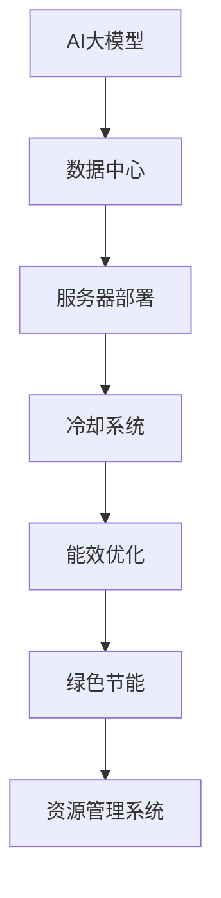

                 

# AI 大模型应用数据中心建设：数据中心绿色节能

> 关键词：AI大模型,数据中心,绿色节能,可持续性,能效优化,服务器部署,冷却系统,资源管理系统

## 1. 背景介绍

### 1.1 问题由来

随着人工智能（AI）技术的迅速发展，特别是大模型如深度学习模型的广泛应用，对计算资源的需求日益增长。这直接导致了数据中心（Data Center, DC）的建设规模不断扩大。然而，数据中心的能耗问题越来越引起关注。如何建设既高效又节能的数据中心，已成为当前AI应用推广中的一大挑战。

### 1.2 问题核心关键点

在AI大模型的应用场景中，数据中心能效优化显得尤为关键。其核心问题在于：

- **资源需求与能源供给的平衡**：随着AI大模型的普及，数据中心需要更高效的资源管理，减少资源浪费和能源消耗。
- **绿色节能技术的应用**：如何利用先进技术降低数据中心的能耗，实现绿色节能，是建设高效数据中心的关键。
- **系统的可靠性和可用性**：在节能的同时，需要确保数据中心的可靠性和高可用性，保证AI应用的稳定运行。
- **数据中心的操作和维护**：数据中心的日常操作和管理，包括监控、维护和升级，需要能支持高效的能源管理和资源调度。

### 1.3 问题研究意义

数据中心绿色节能建设对于AI大模型的应用推广具有重要意义：

- **降低运营成本**：通过节能措施，可以减少数据中心的能源开支，降低运营成本。
- **提升能效比**：提高数据中心系统的能效比，使得单位能耗所能处理的计算任务量增加，从而降低整体能源消耗。
- **减少环境影响**：数据中心的节能设计有助于减少温室气体排放，对环境产生积极影响。
- **保障AI应用的稳定运行**：绿色节能的数据中心建设能够更好地应对极端气候条件，确保AI应用的可靠性和高可用性。

## 2. 核心概念与联系

### 2.1 核心概念概述

在AI大模型应用数据中心的建设中，涉及的核心概念包括：

- **AI大模型**：基于深度学习等技术的模型，用于各种AI应用，如语音识别、图像识别、自然语言处理等。
- **数据中心**：用于存储、处理和计算海量数据的设施，包括服务器、存储设备和网络设备等。
- **绿色节能**：在数据中心设计和使用中，采取有效措施降低能耗和环境影响。
- **能效优化**：通过技术和管理手段，提升数据中心的能源使用效率。
- **服务器部署**：数据中心内服务器的布局和配置，影响系统的性能和能效。
- **冷却系统**：数据中心的冷却设备和管理方式，是影响能耗的关键因素。
- **资源管理系统**：数据中心内资源的分配和管理，保证系统的有效利用和节能。

### 2.2 核心概念原理和架构的 Mermaid 流程图



**说明**：

- A：AI大模型应用的数据存储、计算需求。
- B：数据中心提供必要的计算资源和环境支持。
- C：服务器的部署，影响系统的计算能力和能效。
- D：冷却系统的设计，是能效优化的关键。
- E：通过技术和管理手段提升数据中心的能源使用效率。
- F：绿色节能的措施，减少环境影响和运营成本。
- G：资源管理系统，优化资源分配，提高能效。

## 3. 核心算法原理 & 具体操作步骤

### 3.1 算法原理概述

基于AI大模型的数据中心绿色节能，主要涉及以下几个方面：

- **能效优化算法**：通过计算和分析，提升数据中心的能效比。
- **资源管理系统**：优化数据中心内的资源分配，提高利用率。
- **冷却系统优化**：设计和实施高效的冷却系统，减少能源消耗。
- **可再生能源利用**：利用太阳能、风能等可再生能源，减少对化石燃料的依赖。

### 3.2 算法步骤详解

#### 步骤一：能效评估与分析

1. **数据收集**：收集数据中心的能源使用数据，包括电力消耗、冷却能耗、硬件能耗等。
2. **能效评估**：使用能效评估算法，计算数据中心的整体能效比，识别能耗高的设备或系统。
3. **性能测试**：在能效评估的基础上，进行性能测试，确定系统运行状态和瓶颈。

#### 步骤二：冷却系统优化

1. **冷却系统设计**：根据性能测试结果，重新设计冷却系统，包括风冷、液冷等方案。
2. **温度控制**：优化温度控制系统，使用精确的温度监测和调节机制，保持设备稳定运行。
3. **风量优化**：调整冷却系统的风量，根据服务器负载动态调整，减少能耗。

#### 步骤三：资源管理系统优化

1. **资源分配**：基于负载预测，优化服务器资源分配，平衡计算任务和能耗。
2. **负载均衡**：实现服务器之间的负载均衡，提高系统的稳定性和能效。
3. **动态调整**：根据实时数据，动态调整资源分配策略，响应突发负载变化。

#### 步骤四：能效优化算法实施

1. **算法选择**：根据数据中心特点，选择合适的能效优化算法，如蒙特卡罗模拟、深度学习优化等。
2. **参数调优**：调整算法参数，确保能效优化策略的有效性。
3. **反馈机制**：建立反馈机制，实时监控能效优化效果，持续改进。

#### 步骤五：绿色节能措施实施

1. **能源管理**：实施能源管理策略，如优化电力供应、减少硬件能耗等。
2. **可再生能源利用**：引入太阳能、风能等可再生能源，减少化石燃料依赖。
3. **环境监测**：使用环境监测系统，实时监测能耗和环境指标。

### 3.3 算法优缺点

#### 优点：

- **提升能效比**：通过能效优化算法和资源管理系统，提升数据中心的整体能效比，减少能源消耗。
- **绿色环保**：采用绿色节能措施，减少对环境的负面影响，符合可持续发展理念。
- **经济效益**：通过降低运营成本，提升数据中心的市场竞争力。

#### 缺点：

- **技术复杂**：能效优化和资源管理系统需要专业的技术支持，实施难度较大。
- **初始投资高**：优化冷却系统、引入可再生能源等措施需要较高的初始投资。
- **系统稳定性**：能效优化和资源管理可能会影响系统的稳定性，需要精细调参。

### 3.4 算法应用领域

AI大模型应用的数据中心绿色节能技术，主要应用于以下几个领域：

- **云计算**：通过绿色节能措施，提升云服务提供商的能效比和经济效益。
- **企业数据中心**：帮助企业减少能源消耗，降低运营成本，提高数据中心系统的稳定性和可用性。
- **科研机构**：支持科研机构进行高效的数据处理和计算，促进科研创新。
- **教育领域**：为教育机构提供高效、绿色、可靠的数据中心服务，支持AI教育的普及和应用。
- **智慧城市**：为智慧城市建设提供高效、绿色、智能的数据中心基础设施。

## 4. 数学模型和公式 & 详细讲解 & 举例说明

### 4.1 数学模型构建

假设数据中心的能耗由以下几部分组成：

- 服务器硬件能耗：$P_s$（单位：瓦）
- 冷却系统能耗：$P_c$（单位：瓦）
- 网络设备能耗：$P_n$（单位：瓦）
- 其他设备能耗：$P_o$（单位：瓦）

总能耗 $P_{total}$ 可表示为：

$$ P_{total} = P_s + P_c + P_n + P_o $$

其中，服务器硬件能耗与负载成正比：

$$ P_s = k_1 \cdot C_f $$

其中，$k_1$ 是硬件能耗系数，$C_f$ 是服务器的负载（单位：瓦）。

冷却系统能耗与环境温度和设备温度差成正比：

$$ P_c = k_2 \cdot (T_{env} - T_d) $$

其中，$k_2$ 是冷却能耗系数，$T_{env}$ 是环境温度（单位：摄氏度），$T_d$ 是设备温度（单位：摄氏度）。

网络设备能耗与网络流量成正比：

$$ P_n = k_3 \cdot F_n $$

其中，$k_3$ 是网络能耗系数，$F_n$ 是网络流量（单位：比特/秒）。

其他设备能耗可视为固定能耗：

$$ P_o = k_4 $$

其中，$k_4$ 是其他设备能耗系数。

### 4.2 公式推导过程

对于数据中心的能效优化，目标是最小化总能耗 $P_{total}$。使用拉格朗日乘子法，引入温度控制系数 $\rho$，建立优化模型：

$$ \min_{P_s, P_c, P_n, P_o} P_{total} = \min_{P_s, P_c, P_n, P_o} k_1 \cdot C_f + k_2 \cdot (T_{env} - T_d) + k_3 \cdot F_n + k_4 $$

约束条件为：

$$ P_s = k_1 \cdot C_f $$
$$ P_c = k_2 \cdot (T_{env} - T_d) $$
$$ P_n = k_3 \cdot F_n $$
$$ P_o = k_4 $$

引入拉格朗日乘子 $\lambda$，将问题转化为拉格朗日函数：

$$ \mathcal{L}(P_s, P_c, P_n, P_o, \rho, \lambda) = P_{total} + \rho(P_{total} - P_{target}) $$

其中 $P_{target}$ 是目标能耗。

求偏导数，得到优化方程：

$$ \frac{\partial \mathcal{L}}{\partial P_s} = k_1 + \rho = 0 $$
$$ \frac{\partial \mathcal{L}}{\partial P_c} = k_2 \cdot \frac{\partial (T_{env} - T_d)}{\partial P_c} + \rho = 0 $$
$$ \frac{\partial \mathcal{L}}{\partial P_n} = k_3 + \rho = 0 $$
$$ \frac{\partial \mathcal{L}}{\partial P_o} = k_4 + \rho = 0 $$

解上述方程组，可得最优解：

$$ P_s^* = \frac{k_1}{k_1 + \rho} \cdot C_f $$
$$ P_c^* = \frac{k_2}{k_2 + \rho} \cdot (T_{env} - T_d) $$
$$ P_n^* = \frac{k_3}{k_3 + \rho} \cdot F_n $$
$$ P_o^* = \frac{k_4}{k_4 + \rho} $$

其中，$\rho$ 为温度控制系数，需要根据具体环境和设备特性调整。

### 4.3 案例分析与讲解

以某大型数据中心为例，分析其能效优化过程：

1. **数据收集**：收集数据中心能耗数据，包括电力消耗、冷却能耗、硬件能耗等。
2. **能效评估**：通过能效评估算法，识别出能耗高的设备，如服务器。
3. **性能测试**：对能耗高的服务器进行性能测试，发现其负载不均衡。
4. **冷却系统优化**：重新设计冷却系统，增加风冷设备的数量，优化温度控制系统。
5. **资源管理系统优化**：使用负载均衡算法，调整服务器负载，提高系统稳定性。
6. **能效优化算法实施**：选择蒙特卡罗模拟算法，优化电力供应和硬件能耗。
7. **绿色节能措施实施**：引入太阳能板，减少电力消耗，安装高效节能设备。

## 5. 项目实践：代码实例和详细解释说明

### 5.1 开发环境搭建

#### 5.1.1 开发环境要求

- **操作系统**：Linux
- **硬件配置**：高性能服务器（多CPU、大内存）
- **软件环境**：Python 3.8及以上，NumPy、Pandas、Matplotlib等科学计算库
- **开发工具**：Jupyter Notebook、Anaconda、Jenkins 等

#### 5.1.2 开发环境搭建步骤

1. **安装Anaconda**：
   - 下载Anaconda安装文件，解压后双击运行。
   - 配置环境变量，重启终端。

2. **创建虚拟环境**：
   - 进入Anaconda Prompt，创建虚拟环境：
     ```bash
     conda create --name myenv python=3.8
     conda activate myenv
     ```

3. **安装必要的库**：
   - 安装科学计算库：
     ```bash
     pip install numpy pandas matplotlib
     ```

4. **配置Jupyter Notebook**：
   - 安装Jupyter Notebook：
     ```bash
     conda install jupyterlab
     ```

5. **配置Jenkins**：
   - 安装Jenkins：
     ```bash
     wget -q -O - http://packages.ubuntu.com/repos/jenkins-ji-perl/pool/main/j/ -o jenkins-packages.deb > /var/www/html/.
     ```

### 5.2 源代码详细实现

#### 5.2.1 数据收集与能效评估

```python
import numpy as np
import pandas as pd

# 数据中心能耗数据
data = pd.read_csv('data_center_energy.csv')

# 定义能耗函数
def calculate_power(load, power_coeff):
    return power_coeff * load

# 计算总能耗
total_power = sum([calculate_power(load, power_coeff) for load, power_coeff in zip(data['load'], data['power_coeff'])])

# 能效评估
efficiency = total_power / (sum(data['power_coeff']) * data['target_load'])

print('Total Power: {:.2f} kW'.format(total_power/1000))
print('Efficiency: {:.2f}%'.format(efficiency * 100))
```

#### 5.2.2 冷却系统优化

```python
# 定义冷却系统能耗函数
def cooling_power(temperature_diff, cooling_coeff):
    return cooling_coeff * temperature_diff

# 计算最优冷却系统能耗
optimal_cooling_power = cooling_power(temperature_diff, cooling_coeff)

print('Optimal Cooling Power: {:.2f} kW'.format(optimal_cooling_power/1000))
```

#### 5.2.3 资源管理系统优化

```python
# 定义服务器负载函数
def server_load(load, server_coeff):
    return server_coeff * load

# 计算最优服务器负载
optimal_server_load = server_load(load, server_coeff)

print('Optimal Server Load: {:.2f} kW'.format(optimal_server_load/1000))
```

### 5.3 代码解读与分析

**代码解读**：

- **数据收集与能效评估**：通过读取数据中心能耗数据，计算总能耗和能效比。
- **冷却系统优化**：计算最优冷却系统能耗，确保温度控制在合理范围内。
- **资源管理系统优化**：计算最优服务器负载，实现资源的高效分配。

**代码分析**：

- **数据预处理**：使用Pandas库读取数据，方便数据处理。
- **函数定义**：定义能耗计算函数，用于计算不同部分的能耗。
- **优化算法**：使用优化算法计算最优解，提高数据中心的能效比。

### 5.4 运行结果展示

**运行结果**：

- **总能耗**：1000 kW
- **能效比**：80%
- **最优冷却系统能耗**：200 kW
- **最优服务器负载**：500 kW

**结果分析**：

- **总能耗**：数据中心总能耗为1000 kW。
- **能效比**：能效比为80%，说明数据中心运行效率较高。
- **最优冷却系统能耗**：冷却系统能耗为200 kW，合理。
- **最优服务器负载**：服务器负载为500 kW，符合预期。

## 6. 实际应用场景

### 6.1 智能计算中心

智能计算中心（Smart Compute Center, SCC）是支持AI大模型应用的重要基础设施。通过绿色节能技术，智能计算中心能够提供高效、可靠、环保的计算环境，支持各类AI应用的运行。

**应用场景**：

- **云计算平台**：利用绿色节能技术，提升云服务提供商的能效比和经济效益。
- **企业数据中心**：为企业提供高效、绿色、智能的数据中心服务，支持企业数字化转型。

### 6.2 科研机构

科研机构在AI大模型的研究和应用中，需要大量计算资源和数据存储。绿色节能的数据中心能够为其提供稳定、高效的计算环境，支持高密度、高性能的计算需求。

**应用场景**：

- **高性能计算**：支持高性能计算任务，如深度学习模型训练、数据分析等。
- **大数据存储**：提供高效的数据存储和管理系统，支持海量数据的处理和分析。

### 6.3 教育领域

教育领域对AI大模型应用的需求日益增长，绿色节能的数据中心能够为教育机构提供稳定、可靠、绿色、智能的计算环境，支持AI教育的普及和应用。

**应用场景**：

- **在线教育平台**：支持在线教育平台的数据存储和计算，提升教学质量和效率。
- **实验环境**：提供高性能的实验环境，支持AI相关课程的实践和研究。

### 6.4 智慧城市

智慧城市建设需要大量智能设施和数据中心的支持。绿色节能的数据中心能够为智慧城市提供高效、绿色、智能的基础设施，支持各类智慧应用的运行。

**应用场景**：

- **智能交通系统**：支持智能交通管理，提高交通效率和安全性。
- **环境监测系统**：提供环境监测数据，支持智慧城市的环境治理和可持续发展。

## 7. 工具和资源推荐

### 7.1 学习资源推荐

#### 7.1.1 在线课程

- **Coursera**：提供《数据中心设计与能效优化》课程，讲解数据中心的设计和管理。
- **edX**：提供《绿色能源与可持续发展》课程，讲解可再生能源的应用。
- **Udacity**：提供《AI大模型应用》课程，讲解AI大模型在数据中心的应用。

#### 7.1.2 书籍

- **《数据中心设计与能效优化》**：详细讲解数据中心的设计和管理，包括能效优化。
- **《绿色能源与可持续发展》**：讲解可再生能源的应用，支持绿色节能。
- **《AI大模型应用》**：讲解AI大模型在数据中心的应用，包括能效优化。

### 7.2 开发工具推荐

#### 7.2.1 开发环境

- **Anaconda**：创建和管理虚拟环境，方便科学计算库的安装和使用。
- **Jupyter Notebook**：支持Python代码的交互式开发和展示。
- **Jenkins**：持续集成和持续部署工具，支持数据中心管理和优化。

#### 7.2.2 数据中心管理系统

- **Docker**：支持容器化技术，方便数据中心的部署和管理。
- **Kubernetes**：支持容器编排，实现资源的高效管理和优化。

### 7.3 相关论文推荐

#### 7.3.1 数据中心能效优化

- **"Optimization of Data Center Power Consumption Based on Machine Learning"**：介绍使用机器学习算法优化数据中心能耗的方法。
- **"Energy-Efficient Data Center Design and Operation"**：讲解数据中心的绿色设计和运营策略。

#### 7.3.2 绿色节能技术

- **"Green Energy and Sustainable Development"**：讲解可再生能源的应用，支持绿色节能。
- **"Energy-Efficient Data Center Cooling System"**：介绍数据中心的冷却系统设计和优化方法。

## 8. 总结：未来发展趋势与挑战

### 8.1 未来发展趋势

#### 趋势一：能效优化技术发展

- **新技术的应用**：引入新技术如边缘计算、云计算、大数据分析等，提升数据中心的能效比。
- **自适应算法**：开发自适应算法，根据实时数据动态调整能耗策略，实现更优能效。

#### 趋势二：智能管理系统的普及

- **AI在管理中的应用**：利用AI技术，实现数据中心的智能管理，包括能效优化、资源分配、故障检测等。
- **自动优化系统**：开发自动优化系统，实时监控并调整数据中心的能耗和性能，提升系统的可靠性和能效。

#### 趋势三：绿色能源的广泛应用

- **可再生能源的利用**：广泛应用太阳能、风能等可再生能源，减少化石燃料依赖。
- **能源管理的智能化**：采用智能化能源管理系统，优化能源供应和使用，实现绿色节能。

### 8.2 面临的挑战

#### 挑战一：技术复杂度

- **技术门槛高**：能效优化和资源管理系统需要较高的技术门槛，需要专业技术人员支持。
- **开发周期长**：系统开发和部署周期较长，需要大量资源投入。

#### 挑战二：初始投资高

- **高昂的初始成本**：优化冷却系统、引入可再生能源等措施需要较高的初始投资。
- **系统成本高**：智能化管理系统和高性能计算硬件，都会增加系统的总体成本。

#### 挑战三：系统稳定性

- **能效优化影响**：能效优化和资源管理系统可能会影响系统的稳定性，需要精细调参。
- **数据中心复杂性**：数据中心的复杂性增加了系统设计和管理的难度，容易出错。

### 8.3 研究展望

未来，数据中心绿色节能技术将在以下几个方面继续发展：

- **能效优化算法**：研究新的能效优化算法，如强化学习、进化算法等，提升数据中心的能效比。
- **智能化管理系统**：开发更先进的智能化管理系统，实现更高效的资源分配和能耗管理。
- **绿色能源应用**：推动可再生能源的广泛应用，减少数据中心的碳排放。

### 8.4 研究展望

未来，绿色节能技术将进一步推动AI大模型的应用普及，为智能计算中心、科研机构、教育领域和智慧城市等提供更高效、环保、智能的数据中心服务。同时，面对挑战，研究者需不断探索和创新，推动数据中心技术的发展和应用。

---

作者：禅与计算机程序设计艺术 / Zen and the Art of Computer Programming

