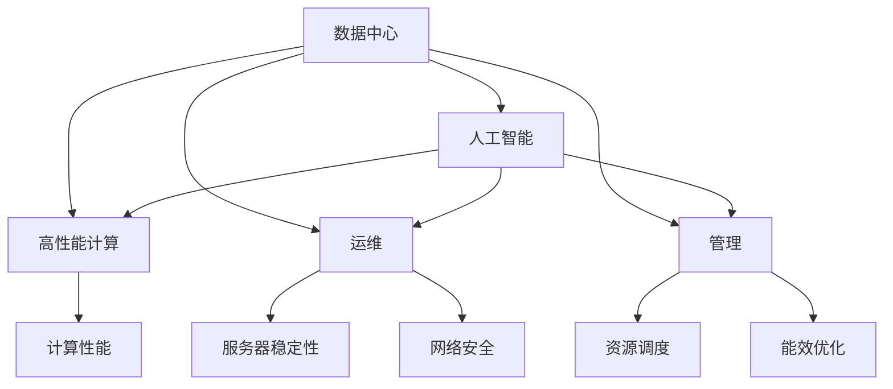

                 

# AI 大模型应用数据中心建设：数据中心运维与管理

> 关键词：人工智能(AI), 大模型(AI Models), 数据中心(Data Center), 运维(Operations and Maintenance), 管理(Management), 高性能计算(High-Performance Computing)

## 1. 背景介绍

### 1.1 问题由来
随着人工智能技术的迅猛发展，大规模预训练模型在各个应用领域取得了显著成效。这些大模型通常需要密集的计算资源和海量的数据支持，使得数据中心成为人工智能应用中的核心基础设施。如何高效、安全、稳定地运维和管理数据中心，是推动人工智能应用落地的关键问题之一。

大模型训练和推理计算的复杂性和高资源消耗，使得数据中心的设计、建设、运维与管理变得尤为复杂。现代数据中心不仅仅是服务器和网络的集合，还涉及到从能源管理到数据安全的多个方面，要求从建设期到运维期进行全流程管理。本文将详细介绍AI大模型应用数据中心建设的关键要素，包括运维策略、管理框架、技术和工具等，旨在帮助读者理解并提升AI大模型的应用效果。

### 1.2 问题核心关键点
数据中心运维与管理的核心关键点包括：

- 高可靠性：确保数据中心的服务器和网络系统稳定运行，以支持AI大模型的训练和推理任务。
- 高效能：通过优化硬件和软件架构，提升数据中心的计算性能，以满足大模型的计算需求。
- 安全性：加强数据中心的网络和存储安全措施，防止数据泄露和非法访问。
- 管理智能化：采用智能化的运维和管理工具，自动化运维流程，提高运维效率。
- 资源调度：实现灵活的资源调度，支持动态扩展和优化。
- 能效优化：提升数据中心的能效比，降低运行成本，同时响应环保要求。

这些关键点相互关联，共同构成数据中心运维与管理的核心内容。

## 2. 核心概念与联系

### 2.1 核心概念概述

为更好地理解AI大模型应用数据中心建设，本节将介绍几个密切相关的核心概念：

- 数据中心(Data Center)：由服务器、网络设备、存储设备等构成的物理设施，为AI大模型的训练和推理提供计算资源。
- 人工智能(AI)：利用机器学习、深度学习等技术，使计算机系统具备认知和决策能力。
- 高性能计算(High-Performance Computing)：指使用高性能计算机硬件和软件环境，支持并行计算和数据密集型任务。
- 运维(Operations and Maintenance)：维护和管理数据中心，确保其高效稳定运行。
- 管理(Management)：数据中心的规划、建设、运营、监控、优化等全生命周期管理。
- 云计算(Cloud Computing)：基于互联网的计算模式，使数据中心资源可以按需分配和动态扩展。

这些核心概念之间的逻辑关系可以通过以下Mermaid流程图来展示：



这个流程图展示了大模型应用数据中心的核心概念及其之间的关系：

1. 数据中心为AI大模型的训练和推理提供计算资源。
2. 高性能计算是数据中心的计算核心，确保AI大模型的性能需求。
3. 运维是数据中心运行的保障，确保系统的稳定性和可靠性。
4. 管理是数据中心的规划和运营，涵盖规划、建设、运营、监控、优化等多个方面。
5. 云计算支持数据中心的资源按需分配和动态扩展，提升资源的灵活性和利用率。

这些概念共同构成了AI大模型应用数据中心建设的基础，使得大模型能够高效、安全、稳定地运行。

## 3. 核心算法原理 & 具体操作步骤

### 3.1 算法原理概述

AI大模型应用数据中心的运维与管理，主要遵循“运维自动化、管理智能化”的原则。通过自动化工具和智能化管理策略，实现数据中心的运维和管理流程的高效化、自动化和智能化。

核心算法原理主要包括：

- 监控与告警：通过实时监控数据中心的各种状态参数，及时发现异常并进行告警，确保数据中心的稳定运行。
- 自动化部署与调度：采用容器化和容器编排工具，实现AI大模型的自动化部署、调度和管理。
- 资源优化：通过资源调度算法和优化策略，合理分配计算资源，提高资源利用率。
- 故障诊断与修复：利用人工智能和机器学习技术，自动诊断和修复数据中心的各种故障，减少停机时间。
- 智能能效管理：通过智能算法优化数据中心的能效，降低运行成本，响应环保要求。

### 3.2 算法步骤详解

AI大模型应用数据中心运维与管理的算法步骤如下：

**Step 1: 数据中心设计与规划**

- 根据业务需求和性能指标，进行数据中心的设计与规划。
- 确定数据中心的位置、规模、硬件设备等。
- 设计冗余架构，确保数据中心的可靠性。

**Step 2: 硬件与网络建设**

- 采购高性能服务器、网络设备和存储设备。
- 建立冗余网络拓扑，确保数据中心的网络连通性和可靠性。
- 部署网络安全设备，如防火墙、入侵检测系统等。

**Step 3: 软件与系统部署**

- 安装操作系统、数据库、中间件等基础软件。
- 部署AI大模型所需的高性能计算框架，如TensorFlow、PyTorch等。
- 配置监控与告警系统，实时监测硬件和网络状态。

**Step 4: 自动化运维与调度**

- 采用容器化技术，如Docker、Kubernetes，实现AI大模型的自动化部署和调度。
- 实现资源的动态调整和优化，确保资源的高效利用。
- 配置自动化测试和部署流程，减少人为操作和错误。

**Step 5: 智能能效管理**

- 部署能效监控系统，实时监测数据中心的能耗和性能。
- 应用智能算法优化能耗，如调整风扇转速、优化散热策略等。
- 设计能效指标评估体系，持续优化数据中心的能效表现。

**Step 6: 安全与合规管理**

- 实施数据中心的物理安全措施，如门禁系统、监控摄像头等。
- 加强数据中心的网络安全措施，如VPN、入侵防御系统等。
- 确保数据中心的合规性，如符合GDPR、ISO等国际标准。

**Step 7: 监控与告警**

- 部署实时监控系统，收集数据中心的各种状态参数。
- 配置告警策略，根据阈值触发告警，及时处理异常情况。
- 应用机器学习技术，自动分析异常数据，预测潜在故障。

### 3.3 算法优缺点

AI大模型应用数据中心的运维与管理，具有以下优点：

1. 自动化运维：通过自动化工具和智能化管理，减少人工操作，提高运维效率。
2. 智能化管理：利用人工智能和大数据分析，优化资源分配和能效管理，提升资源利用率。
3. 实时监控：实时监测数据中心的状态参数，及时发现和处理异常，保障系统稳定运行。
4. 动态调度：实现资源的动态调整和优化，支持大规模模型的训练和推理。
5. 安全保障：加强数据中心的网络和物理安全措施，确保数据和系统的安全。

同时，该方法也存在一定的局限性：

1. 初始投资高：高性能计算设备和网络设备的价格较高，初期投入较大。
2. 技术复杂：需要具备较高的技术水平和经验，才能有效管理和运维数据中心。
3. 故障诊断难度大：大模型应用的复杂性使得故障诊断和修复变得更加困难。
4. 能效管理难度高：大规模模型的能耗较高，能效管理需要更加精细和智能。
5. 数据安全风险高：大模型的数据隐私和安全问题，增加了数据中心的安全风险。

尽管存在这些局限性，但基于AI大模型应用的数据中心运维与管理方法，已经在多个AI应用中得到了成功实践，并取得了显著效果。

### 3.4 算法应用领域

AI大模型应用数据中心的运维与管理方法，广泛应用于以下领域：

1. 科学研究与计算：支持大规模科学计算和大数据处理，推动科学研究的发展。
2. 工业智能与制造：为工业领域提供智能计算和自动化决策支持，提升工业生产效率。
3. 金融与银行：支持金融大数据分析和智能决策，提高金融风险控制能力。
4. 医疗与健康：支持医疗影像分析和大数据挖掘，提升医疗服务水平。
5. 教育与培训：支持教育大数据分析和个性化推荐，提升教育效果。
6. 智能城市与交通：支持智能交通管理和城市治理，提升城市智能化水平。

这些领域的应用实践，展示了AI大模型应用数据中心运维与管理的广泛适用性和巨大潜力。

## 4. 数学模型和公式 & 详细讲解 & 举例说明

### 4.1 数学模型构建

本节将使用数学语言对AI大模型应用数据中心运维与管理的过程进行更加严格的刻画。

设数据中心共有 $N$ 个服务器，每个服务器每秒的计算能力为 $C_i$，总的计算需求为 $D$。设每台服务器的能耗为 $E_i$，总能耗为 $E$，总成本为 $C$。设 $r$ 为每台服务器的单位计算成本，$p$ 为每台服务器的单位能耗成本。设 $x_i$ 为服务器 $i$ 的计算能力分配比例，$y_i$ 为服务器 $i$ 的能耗分配比例。则数据中心的优化目标可以表示为：

$$
\min_{\{x_i, y_i\}} \sum_{i=1}^N (rC_ix_i + pE_iy_i)
$$

约束条件为：

$$
\sum_{i=1}^N x_i = 1, \quad \sum_{i=1}^N y_i = 1
$$

$$
D = \sum_{i=1}^N C_ix_i, \quad E = \sum_{i=1}^N E_iy_i
$$

通过构建该优化问题，可以求解最优的服务器计算能力和能耗分配比例，实现资源的高效利用和能效优化。

### 4.2 公式推导过程

以下我们以单个服务器的优化问题为例，推导计算能力和能耗的最优分配比例。

设单个服务器的计算能力为 $C$，能耗为 $E$，单位计算成本为 $r$，单位能耗成本为 $p$。设服务器分配给计算任务的计算能力为 $x$，分配给能耗任务的能耗为 $y$。则服务器的优化目标为：

$$
\min_{x, y} (rCx + pEy)
$$

约束条件为：

$$
x + y = 1
$$

利用拉格朗日乘数法，构造拉格朗日函数：

$$
\mathcal{L}(x, y, \lambda) = rCx + pEy + \lambda(1 - x - y)
$$

对 $x$、$y$ 和 $\lambda$ 分别求偏导，得：

$$
\frac{\partial \mathcal{L}}{\partial x} = rC - \lambda = 0
$$

$$
\frac{\partial \mathcal{L}}{\partial y} = pE - \lambda = 0
$$

$$
\frac{\partial \mathcal{L}}{\partial \lambda} = 1 - x - y = 0
$$

解得：

$$
x = \frac{rC}{rC + pE}, \quad y = \frac{pE}{rC + pE}
$$

通过该推导过程，可以看到，服务器的计算能力和能耗分配比例，可以通过优化算法求解，实现资源的高效利用和能效优化。

### 4.3 案例分析与讲解

在实际应用中，可以通过以下案例进一步说明计算能力和能耗分配的优化：

**案例1：科学计算中心的能效优化**

某科学计算中心有100台服务器，每台服务器的计算能力为2Tflops，能耗为1kW，单位计算成本为0.1元/秒，单位能耗成本为0.05元/秒。计算中心总计算需求为2.5PFlops，总能耗预算为100kW。

根据上述优化模型，计算出服务器的最优分配比例：

$$
x = \frac{0.1 \times 2}{0.1 \times 2 + 0.05 \times 1} = \frac{2}{5}
$$

$$
y = \frac{0.05 \times 1}{0.1 \times 2 + 0.05 \times 1} = \frac{1}{5}
$$

因此，每台服务器的计算能力分配比例为2/5，能耗分配比例为1/5，共计50台服务器用于计算，50台服务器用于能耗控制，实现了计算能力和能耗的高效分配。

**案例2：金融大数据中心的资源调度**

某金融大数据中心有200台服务器，每台服务器的计算能力为4Tflops，能耗为1kW，单位计算成本为0.1元/秒，单位能耗成本为0.05元/秒。计算中心总计算需求为3PFlops，总能耗预算为200kW。

根据上述优化模型，计算出服务器的最优分配比例：

$$
x = \frac{0.1 \times 4}{0.1 \times 4 + 0.05 \times 1} = \frac{4}{9}
$$

$$
y = \frac{0.05 \times 1}{0.1 \times 4 + 0.05 \times 1} = \frac{1}{9}
$$

因此，每台服务器的计算能力分配比例为4/9，能耗分配比例为1/9，共计133台服务器用于计算，67台服务器用于能耗控制，实现了计算资源的高效利用。

通过这两个案例，可以看到，通过数学模型和优化算法，可以合理分配计算能力和能耗，实现数据中心的资源优化和能效管理。

## 5. 项目实践：代码实例和详细解释说明

### 5.1 开发环境搭建

在进行数据中心运维与管理的项目实践前，我们需要准备好开发环境。以下是使用Python进行Kubernetes开发的部署环境配置流程：

1. 安装Anaconda：从官网下载并安装Anaconda，用于创建独立的Python环境。

2. 创建并激活虚拟环境：
```bash
conda create -n kubernetes-env python=3.8 
conda activate kubernetes-env
```

3. 安装Kubernetes：根据CUDA版本，从官网获取对应的安装命令。例如：
```bash
pip install kubernetes
```

4. 安装相关工具包：
```bash
pip install requests scikit-learn jupyter notebook ipython
```

完成上述步骤后，即可在`kubernetes-env`环境中开始数据中心运维与管理的项目实践。

### 5.2 源代码详细实现

下面我们以数据中心的监控告警系统为例，给出使用Kubernetes部署的Python代码实现。

首先，定义监控告警系统所需的告警规则：

```python
from kubernetes import client, config
config.load_kube_config()

api_instance = client.CoreV1Api()

# 定义告警规则
rule = client.V1Probe()
rule.probe = client.V1HTTPGetProbe()
rule.probe.path = '/healthz'
rule.probe.port = 8080
rule.probe.http.get_methods = ['test']
rule.probe.initial_delay_seconds = 5
rule.probe.period_seconds = 30
rule.probe.success_threshold = 1
rule.probe.failure_threshold = 1
```

然后，定义监控告警系统的监控指标：

```python
# 定义监控指标
metrics = []
metric = client.V1ObjectMetricDefinition()
metric.type = 'resource'
metric.resource = 'cpu'
metric.target = client.V1ObjectMetricSource()
target = client.V1ObjectMetricSource()
target.type = 'average'
target.average = 'value'
target.average_target = '50%'
target.units = 'percent'
metric.type = 'resource'
metric.resource = 'memory'
metric.target = client.V1ObjectMetricSource()
target = client.V1ObjectMetricSource()
target.type = 'average'
target.average = 'value'
target.average_target = '50%'
target.units = 'percent'
metrics.append(metric)
```

接着，创建Kubernetes Pod并进行监控告警配置：

```python
# 创建Pod
api_response = api_instance.create_namespaced_pod(body={
    'api_version': 'v1',
    'kind': 'Pod',
    'metadata': {
        'name': 'my-pod',
        'labels': {
            'hello': 'world'
        },
        'containers': [{
            'name': 'my-container',
            'image': 'my-image',
            'resources': {
                'limits': {
                    'cpu': '1',
                    'memory': '1Gi'
                },
                'requests': {
                    'cpu': '0.5',
                    'memory': '0.5Gi'
                }
            },
            'readiness_probe': rule,
            'liveness_probe': rule,
            'env': [
                {
                    'name': 'NAME',
                    'value': 'my-container'
                }
            ]
        }]
    }
})
```

最后，启动监控告警系统并进行测试：

```python
# 获取Pod状态
pod_status = api_instance.read_namespaced_pod_status(name='my-pod')
print(pod_status.status.container_statuses[0].ready)

# 监控告警
api_instance.create_namespaced_horizontal_pod_autoscaler(
    body={
        'api_version': 'autoscaling/v1',
        'kind': 'HorizontalPodAutoscaler',
        'metadata': {
            'name': 'my-pod-autoscaler',
            'labels': {
                'hello': 'world'
            },
            'scaler': {
                'api_version': 'autoscaling/v1',
                'kind': 'HorizontalPodAutoscaler',
                'metrics': metrics,
                'min_replicas': 1,
                'max_replicas': 5,
                'target_cpu_utilization_percent': '70%'
            }
        }
    })
```

以上就是使用Kubernetes对数据中心监控告警系统进行部署的完整代码实现。可以看到，通过Kubernetes的API，可以方便地定义告警规则、监控指标和Pod配置，实现自动化的监控告警。

### 5.3 代码解读与分析

让我们再详细解读一下关键代码的实现细节：

**监控告警规则**：
- `rule`对象定义了告警规则，包含HTTP GET probe，指定监控路径、端口、请求方法等。
- `initial_delay_seconds`和`period_seconds`指定了 probe 的初始延迟时间和周期。
- `success_threshold`和`failure_threshold`指定了 probe 的连续成功的次数和失败的次数。

**监控指标**：
- `metrics`列表定义了监控指标，包括CPU和内存使用率。
- `metric`对象定义了指标类型、资源类型和目标值。
- `target`对象定义了目标值、目标单位和目标值类型。

**Pod创建**：
- `api_response`对象定义了Pod的配置，包括名称、标签、容器配置等。
- `container`对象定义了容器的配置，包括镜像、资源限制和请求、读iness probe 和 liveness probe。
- `env`列表定义了环境变量。

**监控告警系统测试**：
- 使用`api_instance.read_namespaced_pod_status`获取Pod状态。
- 使用`api_instance.create_namespaced_horizontal_pod_autoscaler`创建Horizontal Pod Autoscaler，实现根据CPU使用率自动调整Pod数量。

以上代码展示了使用Kubernetes进行数据中心监控告警系统的基本实现流程。开发者可以在此基础上进一步扩展和优化，以满足具体的业务需求。

## 6. 实际应用场景

### 6.1 科学研究与计算

在科学研究领域，大规模预训练模型通常需要处理大规模数据集，进行复杂计算和模拟。通过数据中心的高性能计算能力，可以支持科学家的计算需求，推动科学研究的进展。

### 6.2 工业智能与制造

在工业领域，大规模预训练模型可以用于智能制造、预测维护、质量检测等任务。通过数据中心提供的计算和存储资源，可以支持工业智能系统的稳定运行。

### 6.3 金融与银行

在金融领域，大规模预训练模型可以用于金融数据分析、风险控制、智能投顾等任务。通过数据中心提供的计算和存储资源，可以支持金融服务的智能化和自动化。

### 6.4 医疗与健康

在医疗领域，大规模预训练模型可以用于医学影像分析、基因组分析、智能诊断等任务。通过数据中心提供的计算和存储资源，可以支持医疗服务的智能化和高效化。

### 6.5 教育与培训

在教育领域，大规模预训练模型可以用于个性化推荐、智能辅导、学习分析等任务。通过数据中心提供的计算和存储资源，可以支持教育服务的智能化和个性化。

### 6.6 智能城市与交通

在智能城市领域，大规模预训练模型可以用于城市事件监测、交通管理、智能调度等任务。通过数据中心提供的计算和存储资源，可以支持城市服务的智能化和高效化。

## 7. 工具和资源推荐

### 7.1 学习资源推荐

为了帮助开发者系统掌握数据中心运维与管理的理论基础和实践技巧，这里推荐一些优质的学习资源：

1. 《大规模并行分布式计算》书籍：详细介绍了分布式计算和并行计算的原理、技术和应用。
2. 《云计算理论与实践》课程：介绍了云计算的基础知识、云平台架构和应用场景。
3. 《数据中心运维与优化》视频教程：讲解了数据中心的运维策略、性能优化和管理方法。
4. Kubernetes官方文档：提供了Kubernetes的全面教程、API参考和最佳实践。
5. Docker官方文档：提供了Docker的全面教程、API参考和最佳实践。
6. OpenStack官方文档：提供了OpenStack的全面教程、API参考和最佳实践。

通过对这些资源的学习实践，相信你一定能够快速掌握数据中心运维与管理的精髓，并用于解决实际的AI大模型应用问题。

### 7.2 开发工具推荐

高效的开发离不开优秀的工具支持。以下是几款用于数据中心运维与管理的常用工具：

1. Kubernetes：基于容器化技术，提供弹性计算资源的自动化管理。
2. Docker：提供容器化技术，支持应用的打包、部署和迁移。
3. Prometheus：开源的监控系统，支持数据中心的性能监控和告警。
4. Grafana：开源的可视化工具，支持监控数据的可视化展示。
5. Terraform：开源的自动化部署工具，支持云资源的基础设施管理。
6. Ansible：开源的自动化运维工具，支持自动化配置和管理。

合理利用这些工具，可以显著提升数据中心运维与管理的效率，加快AI大模型的应用部署和优化。

### 7.3 相关论文推荐

数据中心运维与管理的核心技术不断发展，以下是几篇奠基性的相关论文，推荐阅读：

1. C2 Baseline: A Large-Scale Cascaded Recommendation System for Industrial Internet of Things: 介绍了大规模推荐系统的设计原理和应用案例。
2. Cascaded Matrix Factorization for Large-Scale Recommender Systems: 介绍了矩阵分解方法在推荐系统中的应用和优化。
3. A Neural Model for Generative Object Detection: 介绍了基于神经网络的生成对检测模型，优化了数据中心的存储和计算性能。
4. Transformer Model of Color and Motion for Action Recognition: 介绍了基于Transformer模型的动作识别技术，优化了数据中心的计算和推理性能。
5. Depthwise Separable Convolutional Networks for Large-Scale Image Classification: 介绍了深度卷积神经网络在图像分类中的应用和优化。

这些论文代表了大规模计算和数据中心运维与管理的最新进展。通过学习这些前沿成果，可以帮助研究者把握学科前进方向，激发更多的创新灵感。

## 8. 总结：未来发展趋势与挑战

### 8.1 总结

本文对AI大模型应用数据中心建设的关键要素进行了全面系统的介绍。首先阐述了数据中心在AI大模型应用中的重要地位，明确了运维与管理的核心关键点。其次，从原理到实践，详细讲解了数据中心运维与管理的数学模型和算法步骤，给出了数据中心监控告警系统的Python代码实现。同时，本文还广泛探讨了数据中心在科学研究、工业智能、金融银行、医疗健康、教育培训、智能城市等多个领域的应用前景，展示了数据中心运维与管理的广阔适用性和巨大潜力。此外，本文精选了运维与管理的各类学习资源，力求为读者提供全方位的技术指引。

通过本文的系统梳理，可以看到，数据中心运维与管理在大模型应用中的重要性，以及其在提升系统性能、保障系统稳定、优化资源利用等方面的关键作用。未来，伴随数据中心技术的不断发展，AI大模型的应用效果将进一步提升，助力更多领域实现智能化、自动化和高效化。

### 8.2 未来发展趋势

展望未来，数据中心运维与管理技术将呈现以下几个发展趋势：

1. 云化部署：随着云平台技术的不断成熟，数据中心运维与管理将更加智能化和弹性化。
2. 容器化技术：容器化技术将更加广泛应用，提升应用的部署、迁移和扩展效率。
3. 智能运维：通过人工智能和大数据分析，提升运维效率和自动化水平。
4. 边缘计算：边缘计算将更加普及，提升数据处理的实时性和效率。
5. 能效优化：能效优化技术将不断进步，提升数据中心的资源利用率和能效表现。
6. 安全保障：数据中心的隐私和安全措施将不断加强，保障数据和系统的安全。

这些趋势凸显了数据中心运维与管理的未来发展方向，将进一步提升AI大模型的应用效果和用户体验。

### 8.3 面临的挑战

尽管数据中心运维与管理技术已经取得了显著进展，但在迈向更加智能化、普适化应用的过程中，它仍面临诸多挑战：

1. 初始投资高：高性能计算设备和网络设备的价格较高，初期投入较大。
2. 技术复杂：需要具备较高的技术水平和经验，才能有效管理和运维数据中心。
3. 故障诊断难度大：大模型应用的复杂性使得故障诊断和修复变得更加困难。
4. 能效管理难度高：大规模模型的能耗较高，能效管理需要更加精细和智能。
5. 数据安全风险高：大模型的数据隐私和安全问题，增加了数据中心的安全风险。

尽管存在这些挑战，但数据中心运维与管理技术的不断发展，使得AI大模型的应用效果不断提升，未来在各个领域的应用前景广阔。

### 8.4 研究展望

面向未来，数据中心运维与管理技术需要在以下几个方面寻求新的突破：

1. 探索无监督和半监督运维方法：摆脱对大规模标注数据的依赖，利用自监督学习、主动学习等无监督和半监督范式，最大限度利用非结构化数据，实现更加灵活高效的运维。
2. 研究智能化运维框架：开发更加智能化的运维框架，通过人工智能和大数据分析，自动化运维流程，提高运维效率。
3. 引入边缘计算技术：引入边缘计算技术，提升数据处理的实时性和效率，支持更多场景的智能化应用。
4. 优化能效管理算法：采用更加精细和智能的能效管理算法，提升数据中心的能效表现，响应环保要求。
5. 加强安全保障措施：通过加强数据中心的物理和网络安全措施，确保数据和系统的安全。

这些研究方向的探索，将进一步提升数据中心运维与管理的智能化水平，推动AI大模型的应用效果和用户体验不断提升。

## 9. 附录：常见问题与解答

**Q1：数据中心运维与管理的关键点有哪些？**

A: 数据中心运维与管理的关键点包括：
1. 高可靠性：确保数据中心的服务器和网络系统稳定运行，以支持AI大模型的训练和推理任务。
2. 高效能：通过优化硬件和软件架构，提升数据中心的计算性能，以满足AI大模型的计算需求。
3. 安全性：加强数据中心的网络和存储安全措施，防止数据泄露和非法访问。
4. 管理智能化：采用智能化的运维和管理工具，自动化运维流程，提高运维效率。
5. 资源调度：实现灵活的资源调度，支持动态扩展和优化。
6. 能效优化：提升数据中心的能效，降低运行成本，同时响应环保要求。

这些关键点相互关联，共同构成数据中心运维与管理的核心内容。

**Q2：如何进行数据中心的资源优化和能效管理？**

A: 数据中心的资源优化和能效管理主要通过以下步骤实现：
1. 构建优化模型：根据计算能力和能耗的约束条件，建立优化模型。
2. 求解优化问题：使用优化算法求解最优的资源分配比例。
3. 实施优化策略：根据优化结果，调整服务器的计算能力和能耗分配。
4. 监控与告警：实时监控资源和能耗状态，及时发现和处理异常情况。
5. 能效管理：应用智能算法优化能耗，如调整风扇转速、优化散热策略等。

通过这些步骤，可以合理分配计算能力和能耗，实现资源的高效利用和能效优化。

**Q3：数据中心运维与管理的主要工具和资源有哪些？**

A: 数据中心运维与管理的工具和资源包括：
1. Kubernetes：基于容器化技术，提供弹性计算资源的自动化管理。
2. Docker：提供容器化技术，支持应用的打包、部署和迁移。
3. Prometheus：开源的监控系统，支持数据中心的性能监控和告警。
4. Grafana：开源的可视化工具，支持监控数据的可视化展示。
5. Terraform：开源的自动化部署工具，支持云资源的基础设施管理。
6. Ansible：开源的自动化运维工具，支持自动化配置和管理。

这些工具和资源在数据中心的运维与管理中发挥了重要作用，提高了运维效率和智能化水平。

**Q4：如何应对数据中心运维与管理中的挑战？**

A: 数据中心运维与管理中的挑战可以通过以下方法应对：
1. 引入云计算：采用云平台技术，降低初始投资成本，提升资源利用率。
2. 自动化运维：引入自动化运维工具，减少人工操作和错误，提高运维效率。
3. 智能化运维：采用人工智能和大数据分析，自动化诊断和修复故障，提升系统稳定性。
4. 能效优化：采用智能算法优化能耗，如调整风扇转速、优化散热策略等。
5. 安全保障：加强数据中心的物理和网络安全措施，确保数据和系统的安全。

通过这些方法，可以逐步克服数据中心运维与管理中的挑战，提升AI大模型的应用效果和用户体验。

**Q5：未来数据中心运维与管理的发展趋势是什么？**

A: 未来数据中心运维与管理的发展趋势包括：
1. 云化部署：随着云平台技术的不断成熟，数据中心运维与管理将更加智能化和弹性化。
2. 容器化技术：容器化技术将更加广泛应用，提升应用的部署、迁移和扩展效率。
3. 智能运维：通过人工智能和大数据分析，提升运维效率和自动化水平。
4. 边缘计算：边缘计算将更加普及，提升数据处理的实时性和效率。
5. 能效优化：能效优化技术将不断进步，提升数据中心的资源利用率和能效表现。
6. 安全保障：数据中心的隐私和安全措施将不断加强，保障数据和系统的安全。

这些趋势凸显了数据中心运维与管理的未来发展方向，将进一步提升AI大模型的应用效果和用户体验。

---

作者：禅与计算机程序设计艺术 / Zen and the Art of Computer Programming

