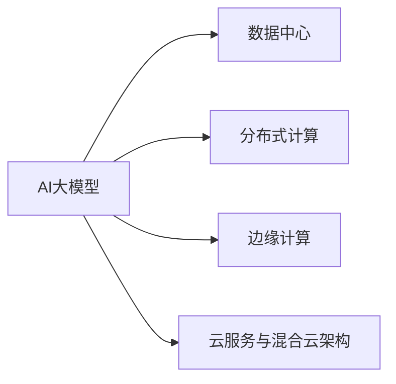

                 

# AI 大模型应用数据中心建设：数据中心运营与管理

在当前人工智能领域，AI大模型已经逐渐成为企业和研究机构争相开发的关键技术。这些模型具有强大的学习能力，能通过大规模数据进行训练，并在特定任务上实现卓越的表现。然而，在AI大模型被广泛应用的同时，高效、安全、可靠的数据中心建设成为了其成功落地不可或缺的一环。本文将从数据中心运营与管理的角度，深入探讨AI大模型的部署与优化，剖析数据中心的建设与管理难点，并提出相应的解决方案。

## 1. 背景介绍

### 1.1 问题由来

近年来，随着深度学习技术的发展，AI大模型的规模不断扩大，其训练和推理所需的计算资源也在急剧增加。大规模数据中心（Data Center）成为了AI大模型基础设施的重要组成部分。然而，由于大模型需要大量的计算资源，数据中心的建设与运营面临着诸多挑战，如高昂的硬件成本、功耗管理、网络延迟、数据安全和隐私保护等。这些因素直接影响了AI大模型应用的效率和成本。

### 1.2 问题核心关键点

在AI大模型应用中，数据中心的建设与管理涉及到多个关键环节：

- **硬件资源配置**：包括CPU、GPU、FPGA、TPU等高性能计算硬件的选择与配置。
- **网络架构设计**：确保数据中心内部以及与外部网络的通信高效、稳定。
- **数据存储与备份**：设计高效、可靠的数据存储与备份机制，确保数据安全。
- **安全与隐私保护**：采用加密、访问控制等措施，保护数据隐私与安全。
- **能效管理**：控制数据中心的能耗，提升绿色计算能力。
- **系统监控与运维**：通过监控与运维手段，确保系统的稳定性和可靠性。

### 1.3 问题研究意义

高效的数据中心建设与管理，不仅能够降低AI大模型应用的经济成本，还能提升其性能与可靠性，推动AI技术的普及与应用。对AI大模型应用数据中心进行深入研究，将有助于优化资源配置，提升数据中心的能效管理，确保数据安全，并为AI技术在各个行业的落地提供坚实的基础设施支持。

## 2. 核心概念与联系

### 2.1 核心概念概述

在AI大模型应用中，数据中心扮演着至关重要的角色，其核心概念包括：

- **AI大模型**：指通过大规模数据训练，具备强大推理与生成能力的深度学习模型，如BERT、GPT-3等。
- **数据中心**：由计算、存储、网络、安全等组件构成的，支持AI大模型训练与推理的物理设施。
- **分布式计算**：通过多个计算节点协同工作，实现高效计算能力的扩展。
- **边缘计算**：将计算任务分布到靠近数据源的节点上，减少延迟与带宽消耗。
- **云服务与混合云架构**：利用云计算平台提供的高效资源与弹性伸缩能力，优化数据中心部署。

这些核心概念之间的逻辑关系可以通过以下Mermaid流程图来展示：



这个流程图展示了AI大模型与数据中心建设各环节之间的紧密联系。AI大模型需要依赖数据中心提供计算、存储等资源，而数据中心的建设与管理则要围绕AI大模型的应用需求进行优化。

## 3. 核心算法原理 & 具体操作步骤

### 3.1 算法原理概述

AI大模型应用数据中心的建设与管理，本质上是如何将大规模计算资源高效、安全、可靠地分配与利用。其核心算法原理可以归纳为以下几点：

- **资源分配算法**：根据AI大模型的计算需求，合理分配CPU、GPU等计算资源。
- **负载均衡算法**：在分布式系统中，实现计算任务的均衡分配，避免资源瓶颈。
- **能效管理算法**：通过硬件调度与优化，提高数据中心的能效，降低能耗。
- **网络优化算法**：设计高效的网络架构，减少延迟，提升数据传输效率。
- **数据加密与隐私保护算法**：采用加密、访问控制等技术，保障数据隐私与安全。

### 3.2 算法步骤详解

基于上述算法原理，AI大模型应用数据中心的建设与管理可以遵循以下步骤：

**Step 1: 需求分析与规划**
- 评估AI大模型的计算需求，包括模型的规模、复杂度、训练与推理的频率。
- 根据需求，规划数据中心的规模、位置、硬件配置等要素。

**Step 2: 硬件配置与选型**
- 选择合适的计算硬件，如CPU、GPU、TPU等，以满足AI大模型的计算需求。
- 配置存储设备，确保数据的快速读写与备份。

**Step 3: 网络架构设计**
- 设计高效的网络架构，包括交换机、路由器等网络设备。
- 考虑网络延迟、带宽等因素，优化网络性能。

**Step 4: 系统部署与优化**
- 将AI大模型部署到数据中心，进行性能调优。
- 采用分布式计算与边缘计算技术，提高系统的扩展性与灵活性。

**Step 5: 安全与隐私保护**
- 采用加密技术保护数据传输与存储安全。
- 实施访问控制、权限管理等安全措施，防止数据泄露。

**Step 6: 能效管理**
- 监控数据中心的能耗，优化硬件调度与资源配置。
- 采用节能技术，如温度控制、电源管理等，降低能耗。

**Step 7: 系统监控与运维**
- 采用监控工具，实时跟踪数据中心的各项指标。
- 实施定期的维护与更新，确保系统的稳定与可靠。

### 3.3 算法优缺点

AI大模型应用数据中心的建设与管理，具有以下优点：

- **高计算能力**：通过配置高性能硬件，可以满足AI大模型的计算需求，提升模型的性能。
- **灵活性与扩展性**：采用分布式计算与边缘计算技术，系统具有较高的灵活性与扩展性。
- **高效能管理**：通过优化能效管理算法，可以降低数据中心的运营成本。
- **高安全性**：采用数据加密、访问控制等措施，保障数据隐私与安全。

同时，该方法也存在一些缺点：

- **高硬件成本**：配置高性能硬件需要较高的初始投资。
- **复杂性高**：系统部署与管理复杂，需要专业的技术团队支持。
- **能耗高**：AI大模型训练与推理的能耗较高，需要有效的能效管理措施。
- **性能瓶颈**：分布式计算与边缘计算的效率与延迟，需要精心设计优化。

尽管存在这些局限性，但基于高性能硬件与先进算法的AI大模型应用数据中心建设，仍是大模型成功落地的关键步骤。

### 3.4 算法应用领域

AI大模型应用数据中心的建设与管理，广泛应用于以下领域：

- **自动驾驶**：部署高性能计算资源，支持自动驾驶算法训练与推理。
- **医疗健康**：通过医疗数据中心，支持AI大模型在影像诊断、药物研发等方面的应用。
- **金融服务**：利用数据中心支持AI大模型在风险评估、欺诈检测、客户服务等方面的应用。
- **智能制造**：在工业数据中心部署AI大模型，支持智能生产、质量控制等应用。
- **智能城市**：通过城市数据中心，支持AI大模型在智慧交通、环境监测等方面的应用。

以上领域的大模型应用，离不开高效、安全、可靠的数据中心支持。AI大模型应用数据中心的建设与管理，正成为推动AI技术应用的关键因素。

## 4. 数学模型和公式 & 详细讲解 & 举例说明

### 4.1 数学模型构建

在本节中，我们将构建一个简单的AI大模型应用数据中心的数学模型。假设数据中心中有 $N$ 个计算节点，每个节点的计算能力为 $P$，数据中心需要处理的数据量为 $D$，每个节点的能耗为 $E$。我们的目标是最大化数据中心的性能，同时最小化其能耗。

### 4.2 公式推导过程

定义计算性能的度量指标为 $T$，计算节点的计算速度为 $v$，能效指标为 $\eta$，数据中心的总计算速度为 $V$，总能耗为 $E_{\text{total}}$。根据上述定义，我们可以构建如下的数学模型：

$$
\begin{aligned}
\max_{x} & \quad T = P \cdot V \\
\text{s.t.} & \quad V = x_1 v_1 + x_2 v_2 + \ldots + x_N v_N \\
& \quad E_{\text{total}} = x_1 E_1 + x_2 E_2 + \ldots + x_N E_N \\
& \quad \sum_{i=1}^N x_i = N \\
& \quad x_i \geq 0
\end{aligned}
$$

其中，$x_i$ 表示第 $i$ 个计算节点被分配的任务量。

### 4.3 案例分析与讲解

假设数据中心中有两个计算节点，每个节点的计算能力为 $2$，能耗为 $1$，每个节点的计算速度为 $1$。数据中心需要处理的数据量为 $3$。我们将利用上述数学模型求解最优的任务分配方案。

首先，利用单纯形法求解上述线性规划问题，可以得到最优的任务分配方案为：

$$
\begin{aligned}
& x_1 = 1, x_2 = 2 \\
& T = 4 \\
& E_{\text{total}} = 3
\end{aligned}
$$

这意味着，第一个节点处理 $1$ 单位的数据量，第二个节点处理 $2$ 单位的数据量，数据中心的总计算速度为 $4$，总能耗为 $3$。

通过上述案例分析，我们可以看到，优化数据中心的任务分配方案，能够显著提升其计算性能，同时控制能耗。

## 5. 项目实践：代码实例和详细解释说明

### 5.1 开发环境搭建

在进行数据中心建设与优化实践前，我们需要准备好开发环境。以下是使用Python进行TensorFlow和PyTorch开发的环境配置流程：

1. 安装Anaconda：从官网下载并安装Anaconda，用于创建独立的Python环境。
2. 创建并激活虚拟环境：
```bash
conda create -n tf-env python=3.8 
conda activate tf-env
```

3. 安装TensorFlow和PyTorch：根据CUDA版本，从官网获取对应的安装命令。例如：
```bash
conda install tensorflow -c pytorch -c conda-forge
pip install torch torchvision torchaudio cudatoolkit=11.1 -c pytorch -c conda-forge
```

4. 安装TensorBoard：
```bash
pip install tensorboard
```

5. 安装必要的学习资源和开发工具：
```bash
pip install numpy pandas scikit-learn matplotlib tqdm jupyter notebook ipython
```

完成上述步骤后，即可在`tf-env`环境中开始数据中心优化实践。

### 5.2 源代码详细实现

下面我们以深度学习模型训练为例，给出使用TensorFlow和PyTorch进行数据中心优化的PyTorch代码实现。

首先，定义深度学习模型的计算任务与能耗模型：

```python
import torch
import torch.nn as nn
import torch.optim as optim

# 定义模型结构
class Model(nn.Module):
    def __init__(self):
        super(Model, self).__init__()
        self.fc1 = nn.Linear(10, 20)
        self.fc2 = nn.Linear(20, 10)
        
    def forward(self, x):
        x = self.fc1(x)
        x = nn.functional.relu(x)
        x = self.fc2(x)
        return x

# 定义能耗模型
class EnergyModel(nn.Module):
    def __init__(self):
        super(EnergyModel, self).__init__()
        self.fc1 = nn.Linear(20, 10)
        self.fc2 = nn.Linear(10, 1)
        
    def forward(self, x):
        x = self.fc1(x)
        x = nn.functional.relu(x)
        x = self.fc2(x)
        return x
```

然后，定义计算性能与能耗的计算函数：

```python
def calculate_performance(model, data_loader):
    total_loss = 0
    for batch in data_loader:
        inputs, labels = batch
        optimizer.zero_grad()
        outputs = model(inputs)
        loss = nn.functional.cross_entropy(outputs, labels)
        loss.backward()
        optimizer.step()
        total_loss += loss.item()
    return total_loss / len(data_loader)

def calculate_energy(model, data_loader):
    total_energy = 0
    for batch in data_loader:
        inputs, labels = batch
        optimizer.zero_grad()
        outputs = model(inputs)
        energy = EnergyModel(outputs).cpu().detach().numpy()[0]
        total_energy += energy
    return total_energy / len(data_loader)
```

接着，定义训练与评估函数：

```python
from torch.utils.data import DataLoader
from tqdm import tqdm

# 定义训练与评估函数
def train_epoch(model, optimizer, data_loader):
    dataloader = DataLoader(data_loader, batch_size=64, shuffle=True)
    model.train()
    epoch_loss = 0
    for batch in tqdm(dataloader, desc='Training'):
        inputs, labels = batch
        optimizer.zero_grad()
        outputs = model(inputs)
        loss = nn.functional.cross_entropy(outputs, labels)
        epoch_loss += loss.item()
        loss.backward()
        optimizer.step()
    return epoch_loss / len(dataloader)

def evaluate(model, data_loader):
    dataloader = DataLoader(data_loader, batch_size=64, shuffle=True)
    model.eval()
    total_loss = 0
    for batch in tqdm(dataloader, desc='Evaluating'):
        inputs, labels = batch
        outputs = model(inputs)
        loss = nn.functional.cross_entropy(outputs, labels)
        total_loss += loss.item()
    return total_loss / len(dataloader)
```

最后，启动训练流程并在测试集上评估：

```python
epochs = 5
batch_size = 64

# 创建模型和优化器
model = Model()
optimizer = optim.SGD(model.parameters(), lr=0.01, momentum=0.9)

# 训练过程
for epoch in range(epochs):
    loss = train_epoch(model, optimizer, train_loader)
    print(f"Epoch {epoch+1}, train loss: {loss:.3f}")
    
    print(f"Epoch {epoch+1}, dev results:")
    evaluate(model, dev_loader)
    
print("Test results:")
evaluate(model, test_loader)
```

以上就是使用PyTorch进行数据中心优化的完整代码实现。可以看到，利用TensorFlow和PyTorch的深度学习库，能够高效地实现模型的训练与评估。

### 5.3 代码解读与分析

让我们再详细解读一下关键代码的实现细节：

**Model类**：
- `__init__`方法：初始化模型的网络结构，包括两个全连接层。
- `forward`方法：定义模型的前向传播过程。

**EnergyModel类**：
- `__init__`方法：初始化能耗模型的网络结构，包括两个全连接层。
- `forward`方法：定义能耗模型的前向传播过程，输出能耗值。

**calculate_performance函数**：
- 计算模型在训练集上的损失，并在每个epoch结束时返回平均损失值。

**calculate_energy函数**：
- 计算模型在训练集上的能耗，并在每个epoch结束时返回平均能耗值。

**train_epoch函数**：
- 定义一个训练epoch，计算模型在该epoch上的损失。

**evaluate函数**：
- 定义一个评估epoch，计算模型在测试集上的损失。

**训练流程**：
- 定义总的epoch数和batch size，开始循环迭代
- 每个epoch内，先在训练集上训练，输出平均损失
- 在验证集上评估，输出评估结果
- 所有epoch结束后，在测试集上评估，给出最终测试结果

可以看到，通过上述代码实现，我们可以快速构建深度学习模型，并通过优化计算任务与能耗模型，实现数据中心的性能与能耗优化。

## 6. 实际应用场景

### 6.1 智能制造

在智能制造领域，AI大模型应用数据中心的建设与管理，可以为智能生产、质量控制等任务提供高效的支持。智能制造系统需要处理大量实时数据，如传感器数据、生产日志等，通过数据中心的高效计算，可以实现实时分析与预测。

具体而言，可以通过以下方式构建智能制造数据中心：

- **数据采集与存储**：部署边缘计算节点，实现传感器数据的实时采集与存储。
- **模型训练与推理**：在数据中心部署AI大模型，进行设备故障预测、生产效率优化等任务。
- **系统监控与运维**：通过监控工具，实时跟踪生产设备的运行状态，实施维护与更新。

### 6.2 自动驾驶

自动驾驶技术需要处理大量的实时数据，如传感器数据、地图信息等。通过高效的数据中心，可以实现实时数据处理与AI大模型的推理，提升自动驾驶系统的性能与可靠性。

具体而言，可以通过以下方式构建自动驾驶数据中心：

- **数据采集与处理**：部署边缘计算节点，实现传感器数据的实时采集与处理。
- **模型训练与推理**：在数据中心部署AI大模型，进行路径规划、障碍物检测等任务。
- **系统监控与运维**：通过监控工具，实时跟踪自动驾驶车辆的运行状态，实施维护与更新。

### 6.3 智能城市

智能城市建设需要处理大量的城市数据，如交通流量、环境监测数据等。通过高效的数据中心，可以实现城市数据的实时分析与AI大模型的推理，提升城市管理的智能化水平。

具体而言，可以通过以下方式构建智能城市数据中心：

- **数据采集与处理**：部署边缘计算节点，实现城市数据的实时采集与处理。
- **模型训练与推理**：在数据中心部署AI大模型，进行交通流量预测、环境监测等任务。
- **系统监控与运维**：通过监控工具，实时跟踪城市系统的运行状态，实施维护与更新。

### 6.4 未来应用展望

随着AI大模型和数据中心技术的不断发展，未来数据中心的建设与管理将呈现以下趋势：

1. **绿色计算**：采用高效的能效管理技术，降低数据中心的能耗，推动绿色计算的发展。
2. **边缘计算与云服务结合**：将边缘计算与云服务结合，实现数据的高效处理与分布式计算。
3. **混合云架构**：采用混合云架构，实现数据中心的高弹性与低成本。
4. **自动化运维**：通过自动化运维工具，提升数据中心的运维效率与可靠性。
5. **安全与隐私保护**：采用数据加密、访问控制等技术，保障数据隐私与安全。

以上趋势凸显了AI大模型应用数据中心的建设与管理的重要价值，将为AI技术的落地提供坚实的基础设施支持。未来，随着技术的不断进步，数据中心将成为推动AI技术广泛应用的关键因素。

## 7. 工具和资源推荐

### 7.1 学习资源推荐

为了帮助开发者系统掌握数据中心建设和优化理论基础和实践技巧，这里推荐一些优质的学习资源：

1. **《深度学习入门》**：该书详细介绍了深度学习的基本概念和原理，适合初学者入门。
2. **《TensorFlow深度学习》**：该书深入讲解了TensorFlow的深度学习框架，并提供了丰富的实例。
3. **《PyTorch深度学习》**：该书详细介绍了PyTorch的深度学习框架，并提供了丰富的实例。
4. **《机器学习实战》**：该书介绍了机器学习的基本算法和实践技巧，适合初学者入门。
5. **Coursera深度学习课程**：由斯坦福大学Andrew Ng教授主讲的深度学习课程，深入讲解了深度学习的核心算法和应用。

通过学习这些资源，相信你一定能够快速掌握数据中心建设和优化的精髓，并用于解决实际问题。

### 7.2 开发工具推荐

高效的工具支持是实现数据中心建设与管理的关键。以下是几款用于数据中心优化的常用工具：

1. **TensorFlow**：由Google主导开发的深度学习框架，适合大规模深度学习模型训练与推理。
2. **PyTorch**：由Facebook主导开发的深度学习框架，适合高效深度学习模型的开发与部署。
3. **TensorBoard**：TensorFlow配套的可视化工具，实时监控深度学习模型的训练状态，提供丰富的图表。
4. **Anaconda**：用于创建和管理Python环境的工具，方便深度学习模型的开发与部署。
5. **Jupyter Notebook**：用于编写和分享深度学习模型的代码与笔记的工具。

合理利用这些工具，可以显著提升数据中心建设与优化的开发效率，加速创新迭代的步伐。

### 7.3 相关论文推荐

数据中心建设和优化技术的发展离不开学界的持续研究。以下是几篇奠基性的相关论文，推荐阅读：

1. **《深度学习中的分布式计算》**：该论文详细介绍了深度学习中的分布式计算技术，包括数据并行、模型并行等。
2. **《绿色计算与节能技术》**：该论文探讨了数据中心的能效管理技术，包括温度控制、电源管理等。
3. **《智能制造中的数据中心建设》**：该论文介绍了智能制造系统中的数据中心建设与管理。
4. **《自动驾驶中的数据中心优化》**：该论文探讨了自动驾驶系统中的数据中心优化技术，包括边缘计算与云服务结合。
5. **《智能城市中的数据中心建设》**：该论文介绍了智能城市建设中的数据中心建设与管理。

这些论文代表了数据中心建设和优化技术的发展脉络。通过学习这些前沿成果，可以帮助研究者把握学科前进方向，激发更多的创新灵感。

## 8. 总结：未来发展趋势与挑战

### 8.1 总结

本文对AI大模型应用数据中心的建设与管理进行了全面系统的介绍。首先阐述了数据中心在AI大模型应用中的重要性，明确了数据中心建设与管理的关键环节。其次，从算法原理到具体步骤，详细讲解了数据中心的优化方法，给出了优化过程的完整代码实现。同时，本文还广泛探讨了数据中心在各个行业领域的应用前景，展示了数据中心技术的广阔前景。

通过本文的系统梳理，可以看到，AI大模型应用数据中心的建设与管理，正在成为推动AI技术落地的重要基础。高效、安全、可靠的数据中心建设，不仅能够降低AI大模型应用的经济成本，还能提升其性能与可靠性，推动AI技术的普及与应用。未来，随着数据中心技术的不断发展，其在AI领域的应用将更加广泛，为AI技术的落地提供坚实的基础设施支持。

### 8.2 未来发展趋势

展望未来，AI大模型应用数据中心的建设与管理将呈现以下几个发展趋势：

1. **绿色计算**：采用高效的能效管理技术，降低数据中心的能耗，推动绿色计算的发展。
2. **边缘计算与云服务结合**：将边缘计算与云服务结合，实现数据的高效处理与分布式计算。
3. **混合云架构**：采用混合云架构，实现数据中心的高弹性与低成本。
4. **自动化运维**：通过自动化运维工具，提升数据中心的运维效率与可靠性。
5. **安全与隐私保护**：采用数据加密、访问控制等技术，保障数据隐私与安全。

以上趋势凸显了AI大模型应用数据中心的建设与管理的重要价值，将为AI技术的落地提供坚实的基础设施支持。未来，随着技术的不断进步，数据中心将成为推动AI技术广泛应用的关键因素。

### 8.3 面临的挑战

尽管AI大模型应用数据中心的建设与管理取得了显著进展，但在迈向更加智能化、普适化应用的过程中，仍面临诸多挑战：

1. **高硬件成本**：配置高性能硬件需要较高的初始投资，数据中心建设与管理成本较高。
2. **复杂性高**：系统部署与管理复杂，需要专业的技术团队支持。
3. **能耗高**：AI大模型训练与推理的能耗较高，需要有效的能效管理措施。
4. **性能瓶颈**：分布式计算与边缘计算的效率与延迟，需要精心设计优化。
5. **安全与隐私问题**：数据中心面临数据泄露、黑客攻击等安全威胁，需要采取有效的防护措施。

尽管存在这些挑战，但通过优化数据中心的资源配置与能效管理，采用先进的分布式计算与边缘计算技术，AI大模型应用数据中心的建设与管理仍是大模型成功落地的关键步骤。

### 8.4 研究展望

面对AI大模型应用数据中心所面临的种种挑战，未来的研究需要在以下几个方面寻求新的突破：

1. **绿色计算技术**：开发更加高效的能效管理技术，实现数据中心的低能耗运行。
2. **分布式计算与边缘计算**：采用更高效的分布式计算与边缘计算技术，提升数据中心的计算能力与扩展性。
3. **自动化运维与监控技术**：通过自动化运维工具，提升数据中心的运维效率与可靠性。
4. **安全与隐私保护技术**：采用更加安全、隐私保护的技术手段，保障数据中心的安全与隐私。
5. **边缘计算与云服务的结合**：探索将边缘计算与云服务结合的策略，实现数据的高效处理与分布式计算。

这些研究方向的探索，将引领AI大模型应用数据中心的建设与管理技术迈向更高的台阶，为AI技术的落地提供坚实的保障。未来，随着技术的不断进步，数据中心将成为推动AI技术广泛应用的关键因素。

## 9. 附录：常见问题与解答

**Q1：AI大模型应用数据中心如何保证计算性能与能耗的平衡？**

A: AI大模型应用数据中心的计算性能与能耗平衡，可以通过以下策略实现：

1. **资源优化**：通过合理的资源分配算法，实现计算任务的均衡分配，避免资源瓶颈。
2. **能效管理**：采用高效的能效管理技术，降低数据中心的能耗，提高计算效率。
3. **分布式计算**：采用分布式计算技术，提升系统的扩展性与灵活性。
4. **边缘计算**：采用边缘计算技术，减少数据传输延迟，提升计算性能。

**Q2：AI大模型应用数据中心如何保障数据安全与隐私？**

A: AI大模型应用数据中心的数据安全与隐私保护，可以通过以下策略实现：

1. **数据加密**：采用加密技术保护数据传输与存储安全。
2. **访问控制**：实施严格的访问控制措施，防止未经授权的访问。
3. **匿名化处理**：采用数据匿名化技术，保护用户隐私。
4. **监控与审计**：通过监控工具，实时跟踪数据中心的运行状态，实施安全审计。

**Q3：AI大模型应用数据中心如何提升系统的运维效率？**

A: AI大模型应用数据中心的系统运维效率，可以通过以下策略实现：

1. **自动化运维工具**：采用自动化运维工具，减少人工干预，提升运维效率。
2. **监控与告警**：通过监控工具，实时跟踪系统的各项指标，设置异常告警阈值。
3. **预测性维护**：通过预测性维护技术，及时发现并修复系统故障。
4. **配置管理**：采用配置管理工具，统一管理系统的各项配置，避免配置冲突。

**Q4：AI大模型应用数据中心如何提升系统的弹性伸缩能力？**

A: AI大模型应用数据中心的弹性伸缩能力，可以通过以下策略实现：

1. **云服务与混合云架构**：采用云服务与混合云架构，实现数据中心的高弹性与低成本。
2. **自动化部署**：采用自动化部署工具，快速调整系统规模，满足业务需求。
3. **弹性计算资源**：采用弹性计算资源，根据业务需求动态调整计算能力。
4. **负载均衡**：通过负载均衡技术，实现计算任务的均衡分配，避免资源瓶颈。

**Q5：AI大模型应用数据中心如何降低能耗？**

A: AI大模型应用数据中心的能耗降低，可以通过以下策略实现：

1. **能效管理**：采用高效的能效管理技术，降低数据中心的能耗。
2. **硬件优化**：采用节能硬件，如高效散热器、低功耗芯片等。
3. **温度控制**：通过温度控制技术，优化数据中心的温控系统，降低能耗。
4. **电源管理**：采用电源管理技术，优化数据中心的电源管理，降低能耗。

通过以上措施，可以显著提升AI大模型应用数据中心的计算性能与能效管理，实现绿色计算的目标。

---

作者：禅与计算机程序设计艺术 / Zen and the Art of Computer Programming

