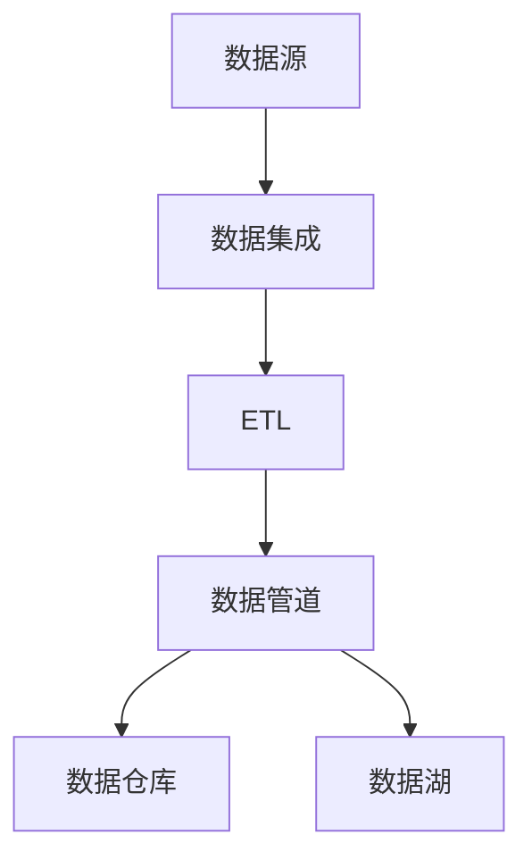

                 

# AI 大模型应用数据中心的数据集成方案

> 关键词：数据中心,数据集成,大模型应用,数据管道,ETL,AI,深度学习,大数据

## 1. 背景介绍

### 1.1 问题由来

随着人工智能(AI)和深度学习技术的发展，大模型在自然语言处理(NLP)、计算机视觉、语音识别等领域的性能和应用前景引起了广泛关注。这些大模型通常需要大量的数据进行预训练，以获得丰富的知识表示，从而在各种下游任务中表现出卓越的性能。然而，构建和部署这些大模型需要数据中心的强力支持。在数据中心中，数据集成是确保大模型训练和推理效果的关键环节。

数据中心需要从多个数据源获取大量高质量的数据，并进行清洗、处理、转换，最终输出适合大模型训练和推理的数据。数据集成的好坏直接关系到数据中心的工作效率和性能表现，是实现AI大模型高效应用的基础。

### 1.2 问题核心关键点

数据集成的关键点包括：

- **数据源选择与管理**：如何高效获取并管理来自不同渠道的数据源。
- **数据清洗与处理**：如何处理数据中的噪声、缺失值、异常值等问题，确保数据质量。
- **数据转换与标准化**：如何将不同格式、不同类型的数据转换和标准化，以便模型处理。
- **数据存储与访问**：如何高效存储和访问数据，以支持大规模数据处理。
- **数据隐私与安全**：如何在数据集成过程中保护数据隐私，确保数据安全。

这些关键点构成了数据集成的核心，需要通过合理的数据管道和ETL(抽取、转换、加载)流程实现。

### 1.3 问题研究意义

研究数据集成的方案，对于构建高效、安全、可靠的数据中心，实现AI大模型的落地应用，具有重要意义：

1. **提升数据处理效率**：通过高效的数据集成方案，可以大幅提升数据处理速度和效率，缩短模型训练和推理的周期。
2. **保证数据质量**：确保输入大模型的数据质量，提升模型性能和鲁棒性。
3. **支持多样性数据源**：能够高效处理来自不同渠道和格式的数据，实现数据集成和利用的多样性。
4. **增强数据安全性**：通过数据集成的安全措施，保护数据隐私和完整性。
5. **支持模型迁移学习**：通过标准化和规范化数据格式，支持模型的迁移学习，提高模型的跨领域适应能力。

## 2. 核心概念与联系

### 2.1 核心概念概述

为更好地理解数据集成的方案，本节将介绍几个核心概念：

- **数据中心(Data Center)**：提供计算、存储、网络等基础设施，支持大规模AI模型的训练和推理。
- **数据集成(Data Integration)**：将来自不同数据源的数据集合并、清洗、转换，形成适合模型处理的格式。
- **ETL(抽取、转换、加载)**：数据集成的核心流程，涉及数据的抽取、转换和加载。
- **数据管道(Data Pipeline)**：用于实现ETL流程的自动化工具，支持分布式计算和并行处理。
- **数据仓库(Data Warehouse)**：用于存储和查询大规模数据集的分布式数据库系统。
- **数据湖(Data Lake)**：用于存储各种结构化和非结构化数据的分布式文件系统。

这些核心概念之间的逻辑关系可以通过以下Mermaid流程图来展示：



这个流程图展示了数据集成在数据中心中的核心流程：从数据源获取数据，经过数据集成和ETL处理，通过数据管道实现数据加载和处理，最终存储在数据仓库或数据湖中，供模型使用。

## 3. 核心算法原理 & 具体操作步骤

### 3.1 算法原理概述

数据集成的主要目的是将来自不同渠道的数据进行合并、清洗、转换，最终形成适合AI模型训练和推理的格式。其核心算法包括以下几个关键步骤：

1. **数据抽取**：从不同数据源中抽取数据，并转化为标准化的数据格式。
2. **数据清洗**：处理数据中的噪声、缺失值、异常值等问题，确保数据质量。
3. **数据转换**：将数据转换为模型所需的格式，如张量、稀疏矩阵等。
4. **数据加载**：将处理后的数据加载到目标存储系统，如数据仓库或数据湖。

这些步骤通常通过ETL流程实现，涉及数据的抽取、转换和加载。ETL流程的自动化程度直接影响数据集成的效率和准确性。

### 3.2 算法步骤详解

以下是数据集成的详细步骤：

**Step 1: 数据抽取**
- 定义数据源列表，包括结构化数据源（如数据库、文件系统）和非结构化数据源（如网络爬虫、API接口）。
- 设计数据抽取脚本，从各数据源中读取数据，并进行初步格式转换。

**Step 2: 数据清洗**
- 对抽取的数据进行初步清洗，包括去除重复记录、处理缺失值、识别和处理异常值等。
- 使用统计分析和数据质量评估工具，对数据质量进行评估和优化。

**Step 3: 数据转换**
- 将清洗后的数据进行格式转换，如将数据转换为JSON、CSV、Parquet等标准格式。
- 对数据进行标准化处理，如统一字段命名、数据类型转换、数据归一化等。

**Step 4: 数据加载**
- 将转换后的数据加载到目标存储系统，如数据仓库或数据湖。
- 设计数据加载脚本，实现数据的批量加载或实时加载。

### 3.3 算法优缺点

数据集成的主要优点包括：

- **提高数据处理效率**：通过自动化的ETL流程，可以大幅提升数据处理的效率。
- **保证数据质量**：清洗和转换步骤可以有效去除数据中的噪声和异常，提升数据质量。
- **支持多样性数据源**：能够处理来自不同渠道和格式的数据，实现数据集成和利用的多样性。
- **增强数据安全性**：通过数据集成的安全措施，保护数据隐私和完整性。

同时，数据集成也存在一定的局限性：

- **数据源管理复杂**：不同数据源的数据格式、来源、更新频率等存在差异，管理复杂。
- **数据清洗和转换工作量大**：数据清洗和转换是耗时的过程，需要投入大量人力。
- **数据集成开销高**：自动化ETL流程需要配置和维护，成本较高。
- **数据集成延迟**：数据源更新不及时，可能导致数据集成延迟，影响模型性能。

尽管存在这些局限性，但就目前而言，数据集成仍然是实现大模型应用的重要手段。未来相关研究的重点在于如何进一步降低数据集成的成本和复杂度，提高数据集成的自动化程度和灵活性。

### 3.4 算法应用领域

数据集成的应用领域广泛，以下是几个典型案例：

- **自然语言处理**：对来自不同来源的文本数据进行集成，形成大规模语料库，支持BERT、GPT等大模型的预训练和微调。
- **计算机视觉**：对来自不同数据集（如ImageNet、COCO等）的图像数据进行集成，支持ResNet、Inception等模型的训练。
- **语音识别**：对来自不同麦克风、不同背景的音频数据进行集成，支持DeepSpeech等模型的训练和推理。
- **医疗健康**：对来自不同医院、不同电子病历系统的数据进行集成，支持医疗模型的训练和推理。
- **金融科技**：对来自不同银行、不同交易系统的数据进行集成，支持金融模型的训练和推理。

## 4. 数学模型和公式 & 详细讲解 & 举例说明

### 4.1 数学模型构建

本节将使用数学语言对数据集成的核心流程进行更加严格的刻画。

假设从数据源抽取的数据为 $D=\{d_i\}_{i=1}^N$，其中 $d_i$ 表示第 $i$ 条数据记录。数据清洗和转换后得到的数据集为 $D'=\{d'_i\}_{i=1}^N$，其中 $d'_i$ 表示经过清洗和转换后的第 $i$ 条数据记录。最终加载到目标存储系统（如数据仓库）的数据集为 $D''=\{d''_i\}_{i=1}^N$，其中 $d''_i$ 表示加载到目标存储系统后的第 $i$ 条数据记录。

### 4.2 公式推导过程

数据集成的数学模型可以表示为：

$$
D'' = f(D', f_1(D))
$$

其中 $f$ 表示数据加载操作，$f_1$ 表示数据清洗和转换操作。

数据清洗和转换操作 $f_1$ 的数学模型为：

$$
D' = f_1(D) = \{d'_i\}_{i=1}^N = \{\text{clean}(\text{convert}(d_i))\}_{i=1}^N
$$

其中 $\text{clean}(\cdot)$ 表示数据清洗操作，$\text{convert}(\cdot)$ 表示数据转换操作。

数据清洗操作 $\text{clean}(\cdot)$ 的数学模型为：

$$
d'_i = \text{clean}(d_i) = \begin{cases}
d_i & \text{if~} d_i \text{~is~cleaned~correctly} \\
\text{null} & \text{if~} d_i \text{~is~not~cleaned~correctly}
\end{cases}
$$

其中 $\text{clean}(d_i)$ 表示对数据 $d_i$ 进行清洗操作，$\text{null}$ 表示数据无法清洗，无法使用。

数据转换操作 $\text{convert}(\cdot)$ 的数学模型为：

$$
d'_i = \text{convert}(d_i) = \text{normalize}(\text{rename}(\text{cast}(d_i)))
$$

其中 $\text{rename}(\cdot)$ 表示重命名字段操作，$\text{cast}(\cdot)$ 表示数据类型转换操作，$\text{normalize}(\cdot)$ 表示数据归一化操作。

### 4.3 案例分析与讲解

假设有一个包含客户购买记录的数据集，数据源包括电商平台、线下商店和第三方数据提供商。数据集的结构化数据源是电商平台和线下商店的订单数据，非结构化数据源是第三方数据提供商提供的客户评论。

- **数据抽取**：通过编写Python脚本，从电商平台和线下商店的API接口中抽取订单数据，并从第三方数据提供商的网站上抓取客户评论。
- **数据清洗**：对订单数据进行去重、去噪、处理缺失值等操作，对客户评论进行回译、去除敏感信息等操作。
- **数据转换**：将订单数据转换为CSV格式，将客户评论转换为JSON格式。
- **数据加载**：将转换后的数据加载到数据仓库中，支持模型进行训练和推理。

通过这些步骤，可以构建一个高效的数据集成流程，支持大模型的预训练和微调，从而提升其在各种下游任务上的性能。

## 5. 项目实践：代码实例和详细解释说明

### 5.1 开发环境搭建

在进行数据集成的实践前，我们需要准备好开发环境。以下是使用Python进行ETL流程开发的常用环境配置：

1. 安装Anaconda：从官网下载并安装Anaconda，用于创建独立的Python环境。

2. 创建并激活虚拟环境：
```bash
conda create -n etl-env python=3.8 
conda activate etl-env
```

3. 安装ETL工具库：
```bash
pip install pandas sqlalchemy etltoolbox
```

4. 安装数据加载和转换工具：
```bash
pip install fsspec fslock pyarrow fastparquet
```

5. 安装数据清洗工具：
```bash
pip install pyspark SQLAlchemy psycopg2
```

完成上述步骤后，即可在`etl-env`环境中开始数据集成实践。

### 5.2 源代码详细实现

以下是使用Python和Pyspark进行数据集成的样例代码：

```python
from pyspark.sql import SparkSession
from pyspark.sql.functions import col, trim, replace, split
from pyspark.sql.types import StringType

# 创建Spark会话
spark = SparkSession.builder.appName("ETL").getOrCreate()

# 定义数据源列表
data_sources = ["order_data", "comment_data"]

# 创建ETL流管道
for source in data_sources:
    # 读取数据源
    data = spark.read.format("parquet").load(f"{source}/data")

    # 数据清洗和转换
    cleaned_data = data.select(
        col("id").alias("id"),
        col("name").alias("name").trim().replace(" ", "_"),
        col("email").alias("email").replace("@", "").replace(".", ""),
        # 此处省略更多数据清洗和转换逻辑
    )

    # 数据加载
    cleaned_data.write.format("parquet").save(f"{source}/cleaned_data")
```

以上代码实现了一个简单的数据集成流程，通过Spark流管道从不同数据源读取数据，进行数据清洗和转换，最终将处理后的数据保存到数据仓库中。

### 5.3 代码解读与分析

让我们再详细解读一下关键代码的实现细节：

**ETL流程定义**：
- 创建Spark会话，设置应用名称。
- 定义数据源列表，包括电商平台和线下商店的订单数据，以及第三方数据提供商的客户评论数据。

**数据抽取**：
- 使用Spark的`read`方法从各个数据源读取数据。
- 假设数据源是Parquet格式的文件，`load`方法读取数据文件。

**数据清洗和转换**：
- 使用`select`方法对数据进行清洗和转换，例如去除空格、替换特殊字符等。
- 假设清洗后的字段包括订单ID、订单名称、客户邮箱等。

**数据加载**：
- 使用`write`方法将处理后的数据保存到数据仓库中。
- 假设保存路径为`source/cleaned_data`，数据格式为Parquet。

这些代码步骤展示了ETL流程的核心逻辑，即从数据源抽取数据，进行清洗和转换，最终将处理后的数据加载到数据仓库中。

## 6. 实际应用场景

### 6.1 智能客服系统

智能客服系统需要大量的客户交互数据进行训练，以构建对话模型，提升客户服务体验。通过数据集成，可以将来自不同渠道的客户交互数据集成到统一的数据仓库中，支持模型的训练和推理。

在技术实现上，可以收集来自在线客服、电话客服、社交媒体等多渠道的客户交互数据，进行数据清洗和转换，形成适合模型训练的格式。然后，使用微调后的对话模型，对客户的咨询请求进行智能回复，提升客服系统的响应速度和质量。

### 6.2 金融数据分析

金融领域需要处理大量的交易数据、市场数据、财务报表等，这些数据往往来自不同的数据源，且格式各异。通过数据集成，可以将这些数据集合并、清洗、转换，形成适合金融模型的训练数据集。

在技术实现上，可以收集来自银行、证券公司、保险公司等不同机构的数据，进行数据清洗和转换，例如去除噪声、处理缺失值、统一数据格式等。然后，使用金融模型对市场趋势、风险评估、投资策略等进行分析和预测，支持金融决策。

### 6.3 医疗健康大数据

医疗健康领域需要处理大量的电子病历、医疗影像、基因数据等，这些数据往往来自不同的医院、不同的数据系统，且格式各异。通过数据集成，可以将这些数据集合并、清洗、转换，形成适合医疗模型的训练数据集。

在技术实现上，可以收集来自不同医院、不同电子病历系统的数据，进行数据清洗和转换，例如去除噪声、处理缺失值、统一数据格式等。然后，使用医疗模型对疾病诊断、治疗方案、药物研发等进行分析和预测，支持医疗决策。

### 6.4 未来应用展望

随着数据集成技术的不断进步，未来数据中心将面临更多的挑战和机遇：

- **数据量增大**：随着AI模型的规模和复杂性不断增加，数据集成的数据量将持续增大。未来需要构建更加高效的数据集成架构，支持大规模数据的处理和存储。
- **数据种类多样**：除了结构化数据外，非结构化数据（如图像、视频、音频等）的应用将越来越广泛。未来需要支持更多数据类型的集成和处理。
- **数据质量提升**：随着数据治理技术的发展，数据集成的数据质量将不断提升。未来需要更加严格的数据质量控制和数据清洗技术。
- **数据隐私保护**：随着数据安全和隐私保护意识的增强，未来需要更加严格的数据隐私保护措施，确保数据的安全性和合法性。
- **数据实时性**：随着实时数据处理的需要，未来需要构建更加高效的数据流处理架构，支持实时数据集成和处理。

## 7. 工具和资源推荐

### 7.1 学习资源推荐

为了帮助开发者系统掌握数据集成的理论基础和实践技巧，这里推荐一些优质的学习资源：

1. 《数据仓库与数据集成技术》系列博文：由大模型技术专家撰写，深入浅出地介绍了数据仓库和数据集成的原理、实践、工具等。

2. CS244《大数据技术》课程：斯坦福大学开设的Big Data明星课程，涵盖大数据技术和大数据工程的核心内容，包括数据集成和ETL流程。

3. 《数据湖与数据仓库》书籍：详细介绍了数据湖和数据仓库的技术原理和应用实践，是数据集成技术的重要参考书籍。

4. Kaggle数据集库：提供大量开源数据集，支持数据集成和机器学习实践，是数据集成的重要学习资源。

5. Apache NiFi：开源数据集成工具，支持复杂的数据流处理和数据管理，是数据集成的重要工具。

通过对这些资源的学习实践，相信你一定能够快速掌握数据集成的精髓，并用于解决实际的数据问题。

### 7.2 开发工具推荐

高效的开发离不开优秀的工具支持。以下是几款用于数据集成的常用工具：

1. Apache Spark：开源的大数据处理框架，支持分布式计算和并行处理，是数据集成的重要工具。
2. Apache NiFi：开源的数据集成工具，支持复杂的数据流处理和数据管理，支持可视化界面，易于使用。
3. Apache Kafka：开源的流处理平台，支持实时数据集成和处理，是数据集成的重要组件。
4. Apache Hive：开源的数据仓库系统，支持分布式存储和查询，是数据集成的重要组件。
5. Apache Flink：开源的流处理和批处理平台，支持实时数据集成和处理，是数据集成的重要工具。

合理利用这些工具，可以显著提升数据集成的开发效率，加快创新迭代的步伐。

### 7.3 相关论文推荐

数据集成的研究源于学界的持续研究。以下是几篇奠基性的相关论文，推荐阅读：

1. Integrated Data Exploration in Data Warehouses：介绍数据仓库中的数据集成技术，包括ETL流程和数据质量控制。
2. Large-scale Data Integration with Apache NiFi：介绍Apache NiFi在数据集成中的应用，支持复杂的数据流处理和数据管理。
3. Big Data Integration: Current State and Future Directions：回顾大数据集成技术的发展，展望未来的趋势和挑战。
4. Data Quality and Data Integration: Bridging the Gap between Them：探讨数据质量和数据集成之间的关系，提出相关技术解决方案。
5. A Survey on Data Warehousing and Data Integration：综述数据仓库和数据集成的相关技术，提供全面参考。

这些论文代表了大数据集成技术的发展脉络。通过学习这些前沿成果，可以帮助研究者把握学科前进方向，激发更多的创新灵感。

## 8. 总结：未来发展趋势与挑战

### 8.1 总结

本文对数据集成的方案进行了全面系统的介绍。首先阐述了数据集成的背景和意义，明确了数据集成的核心算法流程和关键点。其次，从原理到实践，详细讲解了数据集成的数学模型和关键步骤，给出了数据集成任务开发的完整代码实例。同时，本文还广泛探讨了数据集成技术在智能客服、金融分析、医疗健康等各个领域的应用前景，展示了数据集成技术的广阔前景。最后，本文精选了数据集成的各类学习资源，力求为读者提供全方位的技术指引。

通过本文的系统梳理，可以看到，数据集成是实现AI大模型高效应用的基础环节，对数据中心的工作效率和性能表现具有重要影响。未来，伴随数据集成技术的不断演进，数据中心将能够更好地支持AI大模型的训练和推理，从而在更广阔的应用领域实现突破。

### 8.2 未来发展趋势

展望未来，数据集成技术将呈现以下几个发展趋势：

1. **自动化程度提升**：随着ETL工具和自动化流程的成熟，数据集成的自动化程度将不断提升，减少人工干预。
2. **数据集成延迟减少**：通过构建实时数据流处理架构，数据集成的延迟将不断减少，支持实时数据处理和分析。
3. **数据质量控制增强**：随着数据治理技术的进步，数据集成的数据质量将不断提升，确保数据的一致性和完整性。
4. **数据隐私保护加强**：随着数据安全和隐私保护意识的增强，数据集成的隐私保护措施将更加严格，确保数据的安全性和合法性。
5. **数据湖与数据仓库融合**：未来将更多地采用数据湖架构，支持多样性数据源的处理和集成。

以上趋势凸显了数据集成技术的广阔前景。这些方向的探索发展，必将进一步提升数据集成的效率和效果，为AI大模型的应用提供坚实的支撑。

### 8.3 面临的挑战

尽管数据集成技术已经取得了显著进展，但在迈向更加智能化、普适化应用的过程中，它仍面临诸多挑战：

1. **数据源管理复杂**：不同数据源的数据格式、来源、更新频率等存在差异，管理复杂。
2. **数据清洗和转换工作量大**：数据清洗和转换是耗时的过程，需要投入大量人力。
3. **数据集成开销高**：自动化ETL流程需要配置和维护，成本较高。
4. **数据集成延迟**：数据源更新不及时，可能导致数据集成延迟，影响模型性能。
5. **数据隐私和安全**：数据集成的隐私保护措施需要不断提升，确保数据的安全性和合法性。

尽管存在这些挑战，但数据集成的重要性不言而喻。未来需要持续探索和优化数据集成的技术和方法，克服这些挑战，实现高效、可靠的数据集成。

### 8.4 研究展望

面对数据集成所面临的挑战，未来的研究需要在以下几个方面寻求新的突破：

1. **自动化数据集成**：开发更加自动化的ETL流程，减少人工干预，提升数据集成的效率。
2. **异构数据集成**：支持异构数据源的集成和处理，包括结构化数据和非结构化数据。
3. **数据湖与数据仓库融合**：将数据湖与数据仓库技术相结合，支持更多样化、更高效的数据集成。
4. **实时数据集成**：支持实时数据流处理，实现实时数据集成和分析。
5. **数据质量控制**：引入更加严格的数据质量控制和数据清洗技术，确保数据的一致性和完整性。
6. **数据隐私保护**：引入更加严格的数据隐私保护措施，确保数据的安全性和合法性。

这些研究方向的探索，必将引领数据集成技术迈向更高的台阶，为构建高效、安全、可靠的数据中心提供坚实的支撑。

## 9. 附录：常见问题与解答

**Q1：数据集成是否可以支持异构数据源的集成？**

A: 是的，数据集成可以支持异构数据源的集成。通过数据转换和标准化，将不同格式的数据源集成到一个统一的存储系统中，实现数据集成和利用。常用的数据转换方法包括数据格式转换、数据类型转换、数据归一化等。

**Q2：数据集成的开销是否可以降低？**

A: 数据集成的开销可以通过自动化ETL流程、使用更高效的数据处理工具、优化数据转换和清洗流程等方式降低。此外，通过优化数据管道和数据仓库的设计，可以减少数据加载和查询的开销，提高数据集成的效率。

**Q3：数据集成的隐私保护措施如何实现？**

A: 数据集成的隐私保护措施可以通过数据匿名化、数据加密、访问控制等手段实现。对于敏感数据，应采用严格的访问控制措施，限制数据访问权限，确保数据的安全性和合法性。

**Q4：数据集成的自动化程度如何提升？**

A: 数据集成的自动化程度可以通过开发更智能的ETL工具、引入机器学习和人工智能技术等方式提升。例如，可以使用数据质量评估模型，自动发现和修复数据中的问题；使用自动化数据清洗工具，减少人工干预等。

这些问题的解答展示了数据集成的重要性和未来发展的方向，相信在未来，随着技术的不断进步，数据集成将更加高效、可靠、安全，为AI大模型的应用提供更坚实的支撑。

