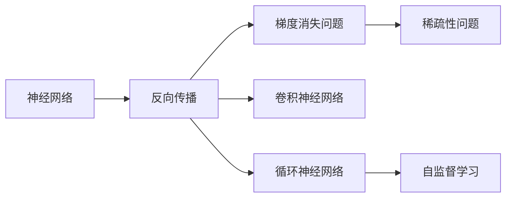

                 

# AI 大模型计算机科学家群英传：深度学习之父辛顿 Geoffrey Hinton

> 关键词：深度学习,神经网络,反向传播,梯度下降,梯度消失问题,稀疏性问题,卷积神经网络,循环神经网络,卷积神经网络,计算机视觉,自然语言处理,深度学习框架,自监督学习,神经网络模型,人工智能

## 1. 背景介绍

### 1.1 问题由来
在深度学习的领域，有一位著名的人物，他就是被誉为“深度学习之父”的Geoffrey Hinton。Hinton教授以其在神经网络和深度学习领域卓越的贡献，荣获了2018年的图灵奖，这是计算机科学的最高荣誉，被誉为计算机界的“诺贝尔奖”。

### 1.2 问题核心关键点
Hinton教授的研究和创新，对整个深度学习和人工智能领域产生了深远的影响。他的工作，不仅奠定了深度学习的基础，还为后续的模型设计和算法优化提供了诸多理论支撑。

### 1.3 问题研究意义
Hinton教授的研究，不仅推动了人工智能技术的发展，也为计算机科学和工程技术领域的学术界和工业界提供了重要的理论指导和实践范式。他的贡献，使得深度学习成为现代AI的核心技术之一，影响了数百万工程师和研究人员的工作。

## 2. 核心概念与联系

### 2.1 核心概念概述

Hinton教授的研究成果涵盖了神经网络、反向传播、梯度消失问题、稀疏性问题、卷积神经网络、循环神经网络、自监督学习等多个关键领域。这些核心概念共同构成了深度学习的理论基础和实践指南。

- 神经网络（Neural Networks）：由多个神经元（节点）组成的网络结构，能够通过前向传播和反向传播学习数据的隐含特征。
- 反向传播（Backpropagation）：一种优化算法，通过计算梯度来更新神经网络中每个神经元的权重，以最小化损失函数。
- 梯度消失问题（Vanishing Gradient Problem）：在反向传播中，由于激活函数的非线性特性，深层神经网络的梯度可能会逐渐变小，导致难以更新权重。
- 稀疏性问题（Sparse Problem）：深层神经网络的参数量巨大，部分参数可能长时间不更新，导致训练效率低下。
- 卷积神经网络（Convolutional Neural Networks, CNNs）：专门用于图像和视频数据的神经网络，通过卷积和池化等操作提取局部特征。
- 循环神经网络（Recurrent Neural Networks, RNNs）：用于处理序列数据的神经网络，能够捕捉数据的时间依赖关系。
- 自监督学习（Self-supervised Learning）：通过未标注数据训练模型，如用语言模型的预测概率作为监督信号。

这些核心概念通过Hinton教授的研究，逐渐被应用到深度学习的各个角落，推动了深度学习技术的发展。

### 2.2 核心概念原理和架构的 Mermaid 流程图(Mermaid 流程节点中不要有括号、逗号等特殊字符)



这个流程图展示了神经网络、反向传播、梯度消失问题、稀疏性问题、卷积神经网络、循环神经网络、自监督学习之间的联系，反映了Hinton教授对深度学习各部分的贡献。

## 3. 核心算法原理 & 具体操作步骤
### 3.1 算法原理概述

深度学习的核心算法，包括反向传播算法、梯度下降算法等。这些算法在Hinton教授的研究中得到了广泛应用和深入优化。

### 3.2 算法步骤详解

深度学习的训练过程，大致可以分为以下几个步骤：

1. **初始化权重**：随机初始化神经网络的权重和偏置。
2. **前向传播**：将输入数据通过神经网络，计算出预测结果。
3. **计算损失函数**：将预测结果与真实标签进行比较，计算损失函数值。
4. **反向传播**：通过反向传播算法计算每个神经元的梯度，更新权重和偏置。
5. **参数优化**：使用梯度下降等优化算法，最小化损失函数，更新权重和偏置。
6. **模型评估**：在验证集上评估模型的性能，调整超参数。

### 3.3 算法优缺点

深度学习的优势在于其强大的表达能力和泛化能力，能够处理复杂的非线性关系。但同时也存在计算复杂度高、需要大量标注数据、容易过拟合等缺点。

### 3.4 算法应用领域

深度学习在计算机视觉、自然语言处理、语音识别、推荐系统等领域得到了广泛应用。Hinton教授的工作，为这些领域的研究和应用提供了重要的理论基础。

## 4. 数学模型和公式 & 详细讲解 & 举例说明

### 4.1 数学模型构建

以多层感知器（Multilayer Perceptron, MLP）为例，其数学模型可以表示为：

$$
y = f(W^TX + b)
$$

其中 $W$ 和 $b$ 为权重和偏置，$x$ 为输入，$f$ 为激活函数。

### 4.2 公式推导过程

反向传播算法的核心公式为：

$$
\frac{\partial L}{\partial w_{ij}} = \frac{\partial L}{\partial z_j} \cdot \frac{\partial z_j}{\partial w_{ij}}
$$

其中 $L$ 为损失函数，$z_j$ 为第 $j$ 个神经元的输出，$w_{ij}$ 为连接第 $i$ 个神经元和第 $j$ 个神经元的权重。

### 4.3 案例分析与讲解

以手写数字识别为例，神经网络通过多层感知器学习手写数字的特征，并将特征映射到数字类别上。通过反向传播算法和梯度下降优化，不断更新权重和偏置，使模型在训练集上取得高准确率，并在测试集上泛化良好。

## 5. 项目实践：代码实例和详细解释说明

### 5.1 开发环境搭建

开发深度学习模型通常需要以下工具和环境：

- Python：深度学习的主要编程语言。
- NumPy：用于数组计算和科学计算。
- TensorFlow 或 PyTorch：深度学习框架，支持多种神经网络模型。
- Jupyter Notebook 或 Google Colab：交互式编程环境。

### 5.2 源代码详细实现

以下是一个简单的多层感知器（MLP）手写数字识别模型，使用 TensorFlow 实现：

```python
import tensorflow as tf

# 定义模型
class MLP(tf.keras.Model):
    def __init__(self):
        super(MLP, self).__init__()
        self.dense1 = tf.keras.layers.Dense(128, activation='relu')
        self.dense2 = tf.keras.layers.Dense(10, activation='softmax')

    def call(self, x):
        x = self.dense1(x)
        x = self.dense2(x)
        return x

# 构建模型
model = MLP()

# 编译模型
model.compile(optimizer='adam',
              loss='sparse_categorical_crossentropy',
              metrics=['accuracy'])

# 训练模型
model.fit(x_train, y_train, epochs=10, validation_data=(x_val, y_val))
```

### 5.3 代码解读与分析

这个代码实现了一个简单的 MLP 手写数字识别模型，并使用了 TensorFlow 的高层 API 实现了模型构建、编译和训练。在实际项目中，需要根据具体任务选择合适的模型和超参数，以取得最佳性能。

### 5.4 运行结果展示

训练完成后，可以在测试集上评估模型的性能：

```python
test_loss, test_acc = model.evaluate(x_test, y_test)
print('Test accuracy:', test_acc)
```

## 6. 实际应用场景

### 6.1 计算机视觉

深度学习在计算机视觉领域取得了巨大成功，如图像分类、目标检测、图像生成等。Hinton教授的研究，为计算机视觉提供了坚实的理论基础。

### 6.2 自然语言处理

在自然语言处理领域，深度学习也展示了强大的能力。Hinton教授的词向量模型（Word2Vec）和循环神经网络（RNN）等技术，显著提升了文本处理的准确性。

### 6.3 语音识别

深度学习在语音识别领域也取得了突破，如声学模型和语言模型的结合，使得语音识别系统能够准确地将语音转化为文本。

### 6.4 未来应用展望

未来，深度学习将在更多的领域得到应用，如自动驾驶、医疗诊断、金融风控等。Hinton教授的研究成果，将继续推动深度学习的发展。

## 7. 工具和资源推荐

### 7.1 学习资源推荐

- 《深度学习》（周志华）：介绍了深度学习的基本概念和算法。
- 《神经网络与深度学习》（Michael Nielsen）：介绍了神经网络和反向传播算法。
- 《动手学深度学习》（李沐）：提供了深度学习的代码实现和案例分析。

### 7.2 开发工具推荐

- TensorFlow：谷歌开发的深度学习框架，功能强大。
- PyTorch：Facebook开发的深度学习框架，灵活易用。
- Keras：高层次的深度学习框架，易于上手。

### 7.3 相关论文推荐

- 《A Neural Network Approach to Learning》（Geoffrey Hinton）：介绍了深度学习的概念和算法。
- 《Training Products of Experts》（Geoffrey Hinton）：介绍了自编码器的原理和应用。
- 《Dropout: A Simple Way to Prevent Neural Networks from Overfitting》（Geoffrey Hinton）：介绍了 dropout 技术的原理和效果。

## 8. 总结：未来发展趋势与挑战

### 8.1 研究成果总结

Hinton教授的研究，奠定了深度学习的基础，推动了人工智能技术的发展。他的工作，不仅在学术界产生了深远影响，也在工业界得到了广泛应用。

### 8.2 未来发展趋势

未来，深度学习将继续在各个领域发挥重要作用，推动人工智能技术的进步。深度学习将与其他技术结合，如强化学习、自然语言处理等，构建更加智能和灵活的系统。

### 8.3 面临的挑战

尽管深度学习取得了巨大成功，但仍面临诸多挑战：计算资源需求高、模型复杂度高、数据标注成本高等。解决这些问题，需要更多创新和突破。

### 8.4 研究展望

未来的研究，需要在模型优化、算法改进、应用扩展等方面不断努力。只有持续创新，才能推动深度学习技术的发展，实现人工智能的更大突破。

## 9. 附录：常见问题与解答

**Q1：深度学习算法的计算复杂度是否太高？**

A: 深度学习算法的计算复杂度确实较高，但随着计算资源的提升和算法的优化，深度学习的应用范围也在不断扩大。

**Q2：深度学习模型是否容易出现过拟合？**

A: 深度学习模型容易出现过拟合，但可以通过正则化、dropout 等方法进行缓解。

**Q3：如何提高深度学习模型的泛化能力？**

A: 可以通过增加数据量、使用更强的模型结构、使用正则化方法等方式，提高深度学习模型的泛化能力。

**Q4：深度学习模型的参数量是否过大？**

A: 深度学习模型的参数量确实较大，但可以通过参数共享、模型剪枝等方法，减小模型规模。

**Q5：深度学习模型是否难以解释？**

A: 深度学习模型往往被称作“黑盒”模型，但可以通过可视化、可解释性分析等方法，提高模型的可解释性。

---

作者：禅与计算机程序设计艺术 / Zen and the Art of Computer Programming

