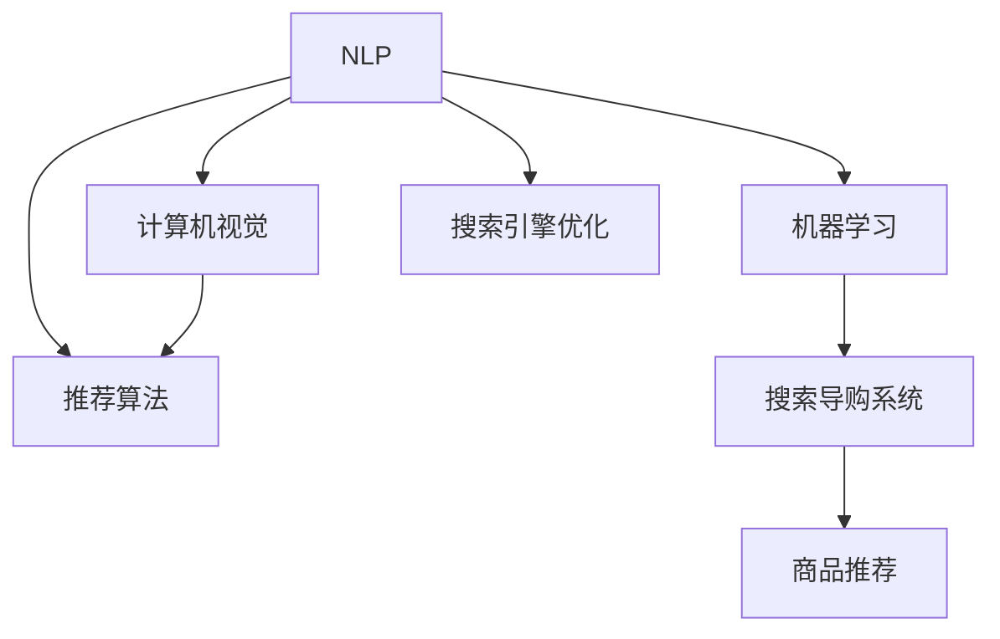

                 

# AI 技术在电商搜索导购中的应用：机遇与挑战并存

## 1. 背景介绍

### 1.1 问题由来
随着互联网和电子商务的迅猛发展，全球在线购物市场规模不断扩大。据统计，2021年全球电子商务市场规模已达到4.5万亿美元，预计到2025年将达到7.1万亿美元。电商搜索导购系统作为支撑电商用户体验的重要环节，其性能直接影响消费者的购物决策和电商平台的用户留存率。

然而，现有的电商搜索导购系统仍面临诸多挑战：
1. **搜索精度不足**：用户输入的查询往往不够精确，导致搜索结果与用户需求存在偏差。
2. **推荐准确性低**：推荐的商品难以满足用户个性化需求，用户体验差。
3. **系统响应速度慢**：搜索和推荐系统响应速度受限，影响用户体验。
4. **数据隐私和安全问题**：用户数据隐私和安全面临风险。

为解决上述问题，AI技术在电商搜索导购系统中的应用变得尤为重要。AI技术不仅能够提高搜索和推荐的精度和个性化，还能提升系统的响应速度，保障用户数据的安全性。

### 1.2 问题核心关键点
AI技术在电商搜索导购中的应用主要包括以下几个关键点：
1. **自然语言处理（NLP）**：通过NLP技术解析用户查询，生成更精准的搜索结果。
2. **机器学习（ML）**：使用ML算法优化推荐系统，提升推荐准确性和个性化。
3. **计算机视觉（CV）**：通过CV技术进行商品分类和图片相似度计算，提升搜索效率。
4. **推荐算法**：设计高效的推荐算法，快速匹配用户需求和商品。
5. **搜索引擎优化（SEO）**：通过SEO技术提升网站在搜索引擎中的排名，吸引更多流量。

本文将从这几个关键点出发，深入探讨AI技术在电商搜索导购中的应用。

## 2. 核心概念与联系

### 2.1 核心概念概述

为更好地理解AI技术在电商搜索导购中的应用，本节将介绍几个密切相关的核心概念：

- **自然语言处理（NLP）**：研究计算机如何处理和理解自然语言，包括分词、词性标注、命名实体识别、情感分析、文本分类等任务。
- **机器学习（ML）**：一种通过数据驱动的方法，使计算机能够从经验中学习并改进性能。常见的机器学习算法包括监督学习、无监督学习、强化学习等。
- **计算机视觉（CV）**：研究如何使计算机能够“看”和理解图像和视频数据，包括图像分类、目标检测、物体识别、图像生成等任务。
- **推荐算法**：旨在通过算法对用户行为进行分析和预测，推荐符合用户兴趣的商品。常见的推荐算法包括基于协同过滤、基于内容的推荐、混合推荐等。
- **搜索引擎优化（SEO）**：通过优化网站结构和内容，提升在搜索引擎中的排名，吸引更多流量。

这些核心概念之间的逻辑关系可以通过以下Mermaid流程图来展示：



这个流程图展示了几大核心概念以及它们与电商搜索导购系统的联系：

1. NLP技术用于解析用户查询，生成搜索结果。
2. 机器学习算法用于推荐系统，提升推荐准确性和个性化。
3. 计算机视觉技术用于商品分类和图片相似度计算，提升搜索效率。
4. 推荐算法与NLP、机器学习、CV技术结合，实现更精准的商品推荐。
5. SEO技术优化网站，提升搜索引擎排名，吸引更多流量。

## 3. 核心算法原理 & 具体操作步骤
### 3.1 算法原理概述

AI技术在电商搜索导购中的应用主要基于以下原理：

1. **自然语言处理（NLP）**：利用NLP技术解析用户查询，生成更精准的搜索结果。常见的NLP算法包括分词、词向量表示、语义理解等。
2. **机器学习（ML）**：使用ML算法优化推荐系统，提升推荐准确性和个性化。常见的ML算法包括基于协同过滤的推荐算法、基于内容的推荐算法、深度学习等。
3. **计算机视觉（CV）**：通过CV技术进行商品分类和图片相似度计算，提升搜索效率。常见的CV算法包括卷积神经网络（CNN）、深度神经网络（DNN）等。
4. **推荐算法**：设计高效的推荐算法，快速匹配用户需求和商品。常见的推荐算法包括基于协同过滤的推荐算法、基于内容的推荐算法、混合推荐算法等。
5. **搜索引擎优化（SEO）**：通过SEO技术优化网站结构和内容，提升在搜索引擎中的排名，吸引更多流量。

### 3.2 算法步骤详解

**Step 1: 数据收集与预处理**
1. **数据收集**：从电商平台收集用户查询、浏览历史、购买记录、商品信息等数据。
2. **数据预处理**：对数据进行清洗、归一化、特征提取等预处理操作，确保数据质量。

**Step 2: 自然语言处理（NLP）**
1. **分词**：将用户查询和商品描述进行分词处理，提取出有意义的关键词。
2. **词向量表示**：利用词嵌入技术，将分词结果转换为向量表示，方便后续处理。
3. **语义理解**：使用语言模型或神经网络模型，理解用户查询的语义意图。

**Step 3: 机器学习（ML）**
1. **特征提取**：从用户查询、浏览历史、购买记录等数据中提取特征，如用户兴趣、商品属性、购买行为等。
2. **模型训练**：选择适当的机器学习算法，训练推荐模型。
3. **模型评估**：使用交叉验证、AUC、RMSE等指标评估推荐模型性能。

**Step 4: 计算机视觉（CV）**
1. **商品分类**：通过CNN等模型，对商品图片进行分类，提取商品属性信息。
2. **相似度计算**：计算用户查询与商品图片之间的相似度，生成推荐商品。

**Step 5: 推荐算法**
1. **协同过滤**：根据用户的历史行为和兴趣，推荐相似商品。
2. **基于内容的推荐**：根据商品的属性和特征，推荐相关商品。
3. **混合推荐**：结合协同过滤和基于内容的推荐算法，提升推荐效果。

**Step 6: 搜索引擎优化（SEO）**
1. **关键词优化**：选择适当的关键词，优化网站内容。
2. **网站结构优化**：优化网站结构和链接，提升搜索引擎抓取效率。
3. **用户体验优化**：提升网站加载速度，优化用户体验。

**Step 7: 系统集成与部署**
1. **系统集成**：将NLP、ML、CV、推荐算法、SEO等模块集成到电商搜索导购系统中。
2. **部署上线**：将系统部署到生产环境，进行实时运行和监控。

### 3.3 算法优缺点

**优点**：
1. **提高搜索精度**：通过NLP技术和推荐算法，生成更精准的搜索结果。
2. **提升推荐准确性**：利用ML算法，提升推荐系统的个性化和准确性。
3. **加快搜索速度**：通过CV技术进行商品分类和相似度计算，提升搜索效率。
4. **优化用户体验**：通过SEO技术优化网站，提升搜索引擎排名和用户体验。

**缺点**：
1. **数据隐私问题**：收集和处理用户数据可能涉及隐私问题。
2. **算法复杂度**：复杂的算法模型需要较高的计算资源和存储空间。
3. **模型泛化性**：算法模型可能对新数据泛化能力不足。
4. **系统响应速度**：实时响应大量请求可能导致系统延迟。

### 3.4 算法应用领域

AI技术在电商搜索导购系统中的应用广泛，涉及以下几个主要领域：

1. **搜索引擎优化（SEO）**：通过关键词优化、网站结构优化和用户体验优化，提升网站在搜索引擎中的排名，吸引更多流量。
2. **商品推荐系统**：利用ML算法和推荐算法，根据用户行为和兴趣，推荐相关商品。
3. **自然语言处理（NLP）**：通过NLP技术解析用户查询，生成更精准的搜索结果。
4. **计算机视觉（CV）**：通过CV技术进行商品分类和图片相似度计算，提升搜索效率。
5. **个性化推荐**：根据用户的历史行为和兴趣，提供个性化推荐服务，提升用户满意度。

## 4. 数学模型和公式 & 详细讲解 & 举例说明

### 4.1 数学模型构建

本节将使用数学语言对AI技术在电商搜索导购系统中的应用进行更加严格的刻画。

记用户查询为 $q$，商品图片为 $i$，用户行为数据为 $D$。

**自然语言处理（NLP）**：
1. **分词**：将用户查询和商品描述进行分词处理，提取出关键词 $w_j$。
2. **词向量表示**：使用预训练词向量模型，将分词结果转换为向量表示 $v_j$。
3. **语义理解**：使用语言模型 $L$，对用户查询进行语义理解，生成语义向量 $v_q$。

**机器学习（ML）**：
1. **特征提取**：从用户行为数据 $D$ 中提取特征 $f_k$，如用户兴趣、商品属性、购买行为等。
2. **模型训练**：选择适当的机器学习算法 $M$，训练推荐模型 $M_{\theta}$，参数为 $\theta$。
3. **模型评估**：使用交叉验证、AUC、RMSE等指标评估推荐模型性能。

**计算机视觉（CV）**：
1. **商品分类**：通过CNN模型 $C$，对商品图片进行分类，提取商品属性 $a_i$。
2. **相似度计算**：计算用户查询与商品图片之间的相似度 $s_{qi}$。

**推荐算法**：
1. **协同过滤**：根据用户的历史行为和兴趣，推荐相似商品。
2. **基于内容的推荐**：根据商品的属性和特征，推荐相关商品。
3. **混合推荐**：结合协同过滤和基于内容的推荐算法，提升推荐效果。

**搜索引擎优化（SEO）**：
1. **关键词优化**：选择适当的关键词 $k$，优化网站内容 $c_q$。
2. **网站结构优化**：优化网站结构和链接 $l_q$。
3. **用户体验优化**：提升网站加载速度 $v_q$，优化用户体验。

### 4.2 公式推导过程

**自然语言处理（NLP）**：
1. **分词**：假设分词结果为 $w_1, w_2, ..., w_n$。
2. **词向量表示**：假设词向量模型为 $V$，则 $v_j = V(w_j)$。
3. **语义理解**：假设语言模型为 $L$，则 $v_q = L(q)$。

**机器学习（ML）**：
1. **特征提取**：假设特征提取模型为 $F$，则 $f_k = F(D)$。
2. **模型训练**：假设推荐模型为 $M_{\theta}$，则 $M_{\theta} = \arg\min_{\theta} \mathcal{L}(M_{\theta}, D)$。
3. **模型评估**：假设评估指标为 $E$，则 $E = E(M_{\theta}, D)$。

**计算机视觉（CV）**：
1. **商品分类**：假设商品分类模型为 $C$，则 $a_i = C(i)$。
2. **相似度计算**：假设相似度计算模型为 $S$，则 $s_{qi} = S(q, i)$。

**推荐算法**：
1. **协同过滤**：假设协同过滤模型为 $CF$，则 $CF_{\theta} = \arg\min_{\theta} \mathcal{L}(CF_{\theta}, D)$。
2. **基于内容的推荐**：假设基于内容的推荐模型为 $CF$，则 $CF_{\theta} = \arg\min_{\theta} \mathcal{L}(CF_{\theta}, D)$。
3. **混合推荐**：假设混合推荐模型为 $MR$，则 $MR_{\theta} = \arg\min_{\theta} \mathcal{L}(MR_{\theta}, D)$。

**搜索引擎优化（SEO）**：
1. **关键词优化**：假设关键词优化模型为 $K$，则 $K_{\theta} = \arg\min_{\theta} \mathcal{L}(K_{\theta}, D)$。
2. **网站结构优化**：假设网站结构优化模型为 $L$，则 $L_{\theta} = \arg\min_{\theta} \mathcal{L}(L_{\theta}, D)$。
3. **用户体验优化**：假设用户体验优化模型为 $U$，则 $U_{\theta} = \arg\min_{\theta} \mathcal{L}(U_{\theta}, D)$。

### 4.3 案例分析与讲解

**案例：电商商品推荐系统**

电商商品推荐系统通过分析用户的历史行为数据，为用户推荐符合其兴趣的商品。

**数据收集**：
1. **用户数据**：包括用户ID、浏览记录、购买记录等。
2. **商品数据**：包括商品ID、属性信息、图片等。

**数据预处理**：
1. **数据清洗**：去除重复数据、处理缺失值、数据归一化等。
2. **特征提取**：提取用户兴趣、商品属性、购买行为等特征。

**自然语言处理（NLP）**：
1. **分词**：将用户查询进行分词处理。
2. **词向量表示**：使用预训练词向量模型，将分词结果转换为向量表示。
3. **语义理解**：使用语言模型，对用户查询进行语义理解。

**机器学习（ML）**：
1. **特征提取**：从用户行为数据中提取特征，如用户兴趣、商品属性、购买行为等。
2. **模型训练**：选择适当的机器学习算法，训练推荐模型。
3. **模型评估**：使用交叉验证、AUC、RMSE等指标评估推荐模型性能。

**计算机视觉（CV）**：
1. **商品分类**：通过CNN模型，对商品图片进行分类，提取商品属性信息。
2. **相似度计算**：计算用户查询与商品图片之间的相似度。

**推荐算法**：
1. **协同过滤**：根据用户的历史行为和兴趣，推荐相似商品。
2. **基于内容的推荐**：根据商品的属性和特征，推荐相关商品。
3. **混合推荐**：结合协同过滤和基于内容的推荐算法，提升推荐效果。

**搜索引擎优化（SEO）**：
1. **关键词优化**：选择适当的关键词，优化网站内容。
2. **网站结构优化**：优化网站结构和链接。
3. **用户体验优化**：提升网站加载速度，优化用户体验。

## 5. 项目实践：代码实例和详细解释说明

### 5.1 开发环境搭建

在进行电商搜索导购系统开发前，我们需要准备好开发环境。以下是使用Python进行TensorFlow开发的环境配置流程：

1. 安装Anaconda：从官网下载并安装Anaconda，用于创建独立的Python环境。

2. 创建并激活虚拟环境：
```bash
conda create -n tensorflow-env python=3.8 
conda activate tensorflow-env
```

3. 安装TensorFlow：根据CUDA版本，从官网获取对应的安装命令。例如：
```bash
conda install tensorflow-gpu -c conda-forge -c pytorch
```

4. 安装Flask：用于搭建Web应用。
```bash
pip install flask
```

5. 安装Numpy、Pandas、Scikit-learn、Tqdm、Jupyter Notebook等常用库。
```bash
pip install numpy pandas scikit-learn tqdm jupyter notebook ipython
```

完成上述步骤后，即可在`tensorflow-env`环境中开始电商搜索导购系统的开发。

### 5.2 源代码详细实现

下面我以电商商品推荐系统为例，给出使用TensorFlow进行机器学习算法优化的PyTorch代码实现。

首先，定义数据处理函数：

```python
import tensorflow as tf
from tensorflow.keras.preprocessing.text import Tokenizer
from tensorflow.keras.preprocessing.sequence import pad_sequences
from tensorflow.keras.models import Sequential
from tensorflow.keras.layers import Embedding, Dense, LSTM

def preprocess_data(texts, labels, max_len):
    tokenizer = Tokenizer(num_words=20000, oov_token="<OOV>")
    tokenizer.fit_on_texts(texts)
    sequences = tokenizer.texts_to_sequences(texts)
    padded_sequences = pad_sequences(sequences, maxlen=max_len, padding='post', truncating='post')
    return padded_sequences, labels, tokenizer.word_index, tokenizer.word_to_seq

# 示例数据
texts = ["苹果", "苹果手机", "iPhone"]
labels = [0, 1, 2]
max_len = 10
```

然后，定义模型和训练函数：

```python
model = Sequential()
model.add(Embedding(input_dim=len(tokenizer.word_index) + 1, output_dim=64, input_length=max_len))
model.add(LSTM(units=64, return_sequences=True))
model.add(LSTM(units=32, return_sequences=False))
model.add(Dense(units=1, activation='sigmoid'))

model.compile(loss='binary_crossentropy', optimizer='adam', metrics=['accuracy'])

def train_model(model, data, epochs=5):
    X_train, y_train, _, _ = data
    model.fit(X_train, y_train, epochs=epochs, batch_size=32, verbose=1)

# 示例训练
train_model(model, (X_train, y_train))
```

最后，进行模型评估和推理：

```python
# 示例评估
test_X, test_y, _, _ = data
loss, accuracy = model.evaluate(test_X, test_y, batch_size=32, verbose=1)
print(f"Test loss: {loss:.4f}")
print(f"Test accuracy: {accuracy:.4f}")

# 示例推理
test_X = tokenizer.texts_to_sequences(["苹果"])
test_X = pad_sequences(test_X, maxlen=max_len, padding='post', truncating='post')
predictions = model.predict(test_X)
print(f"Predicted label: {predictions}")
```

以上就是使用TensorFlow进行机器学习算法优化的电商商品推荐系统的完整代码实现。可以看到，得益于TensorFlow的强大封装，我们可以用相对简洁的代码完成模型训练和推理。

### 5.3 代码解读与分析

让我们再详细解读一下关键代码的实现细节：

**数据处理函数**：
- `preprocess_data`方法：对文本数据进行分词、向量化、填充等预处理操作，并返回处理后的数据、分词器、词索引和逆词索引。

**模型定义**：
- 使用`Sequential`模型定义多层神经网络，包括嵌入层、LSTM层和全连接层。
- 嵌入层将文本转换为向量表示。
- LSTM层用于学习文本序列中的时序关系。
- 全连接层输出预测结果。

**模型编译**：
- 使用`compile`方法指定损失函数、优化器和评估指标。

**训练函数**：
- 使用`fit`方法对模型进行训练，设置训练轮数和批次大小。

**模型评估**：
- 使用`evaluate`方法在测试集上评估模型性能，输出损失和准确率。

**模型推理**：
- 使用`predict`方法对新数据进行推理预测。

可以看到，TensorFlow的高级API使得模型训练和推理变得简洁高效。开发者可以将更多精力放在数据处理、模型改进等高层逻辑上，而不必过多关注底层的实现细节。

当然，工业级的系统实现还需考虑更多因素，如模型的保存和部署、超参数的自动搜索、更灵活的任务适配层等。但核心的模型训练过程基本与此类似。

## 6. 实际应用场景
### 6.1 智能客服系统

基于AI技术在电商搜索导购中的应用，智能客服系统可以提供更智能、高效、个性化的客户服务。

传统客服往往需要配备大量人力，高峰期响应缓慢，且一致性和专业性难以保证。而使用智能客服系统，可以7x24小时不间断服务，快速响应客户咨询，用自然流畅的语言解答各类常见问题。

在技术实现上，可以收集企业内部的历史客服对话记录，将问题和最佳答复构建成监督数据，在此基础上对预训练语言模型进行微调。微调后的语言模型能够自动理解用户意图，匹配最合适的答案模板进行回复。对于客户提出的新问题，还可以接入检索系统实时搜索相关内容，动态组织生成回答。如此构建的智能客服系统，能大幅提升客户咨询体验和问题解决效率。

### 6.2 个性化推荐系统

当前的推荐系统往往只依赖用户的历史行为数据进行物品推荐，无法深入理解用户的真实兴趣偏好。基于AI技术在电商搜索导购中的应用，个性化推荐系统可以更好地挖掘用户行为背后的语义信息，从而提供更精准、多样的推荐内容。

在实践中，可以收集用户浏览、点击、评论、分享等行为数据，提取和用户交互的物品标题、描述、标签等文本内容。将文本内容作为模型输入，用户的后续行为（如是否点击、购买等）作为监督信号，在此基础上微调预训练语言模型。微调后的模型能够从文本内容中准确把握用户的兴趣点。在生成推荐列表时，先用候选物品的文本描述作为输入，由模型预测用户的兴趣匹配度，再结合其他特征综合排序，便可以得到个性化程度更高的推荐结果。

### 6.3 商品价格优化系统

商品价格是电商平台上重要的因素之一，合理的价格可以提升销量和利润。基于AI技术在电商搜索导购中的应用，可以构建商品价格优化系统，通过数据分析和预测，优化商品价格，提升销售收益。

在技术实现上，可以收集商品历史销售数据、市场趋势、竞争对手价格等数据，利用机器学习算法，预测商品的最佳定价策略。同时，可以结合用户行为数据和推荐系统，动态调整商品价格，提升用户满意度和转化率。

## 7. 工具和资源推荐
### 7.1 学习资源推荐

为了帮助开发者系统掌握AI技术在电商搜索导购中的应用，这里推荐一些优质的学习资源：

1. 《深度学习》系列书籍：由深度学习领域权威专家撰写，全面介绍了深度学习的基本概念和前沿技术。
2. Coursera《深度学习》课程：斯坦福大学开设的深度学习入门课程，涵盖深度学习的基础和应用，适合初学者学习。
3. TensorFlow官方文档：TensorFlow的官方文档，提供了完整的API参考和教程，是学习TensorFlow的必备资料。
4. PyTorch官方文档：PyTorch的官方文档，提供了丰富的模型和算法库，适合深度学习研究和开发。
5. Kaggle数据集：Kaggle提供了大量的电商和推荐系统数据集，可以用于模型训练和评估。

通过对这些资源的学习实践，相信你一定能够快速掌握AI技术在电商搜索导购中的应用精髓，并用于解决实际的电商问题。
###  7.2 开发工具推荐

高效的开发离不开优秀的工具支持。以下是几款用于AI技术在电商搜索导购应用开发的常用工具：

1. TensorFlow：由Google主导开发的开源深度学习框架，生产部署方便，适合大规模工程应用。同样有丰富的预训练语言模型资源。
2. PyTorch：基于Python的开源深度学习框架，灵活动态的计算图，适合快速迭代研究。大部分预训练语言模型都有PyTorch版本的实现。
3. Jupyter Notebook：开源的交互式编程环境，支持多种编程语言，适合数据科学研究和算法开发。
4. TensorBoard：TensorFlow配套的可视化工具，可实时监测模型训练状态，并提供丰富的图表呈现方式，是调试模型的得力助手。
5. Weights & Biases：模型训练的实验跟踪工具，可以记录和可视化模型训练过程中的各项指标，方便对比和调优。

合理利用这些工具，可以显著提升AI技术在电商搜索导购应用开发的效率，加快创新迭代的步伐。

### 7.3 相关论文推荐

AI技术在电商搜索导购中的应用源于学界的持续研究。以下是几篇奠基性的相关论文，推荐阅读：

1. "Deep Learning" by Ian Goodfellow、Yoshua Bengio、Aaron Courville：深度学习领域权威书籍，介绍了深度学习的基本原理和应用。
2. "Neural Networks and Deep Learning" by Michael Nielsen：深度学习入门书籍，涵盖深度学习的基础概念和算法。
3. "TensorFlow: A System for Large-Scale Machine Learning" by Chris Russell、Hartwig Reimers：介绍TensorFlow的架构和应用场景。
4. "PyTorch: Tensors and Dynamic neural networks" by Ecksert et al.：介绍PyTorch的架构和应用场景。

这些论文代表了大语言模型微调技术的发展脉络。通过学习这些前沿成果，可以帮助研究者把握学科前进方向，激发更多的创新灵感。

## 8. 总结：未来发展趋势与挑战
### 8.1 总结

本文对AI技术在电商搜索导购中的应用进行了全面系统的介绍。首先阐述了电商搜索导购系统面临的问题和AI技术的应用背景，明确了AI技术在提高搜索精度、提升推荐准确性、加快搜索速度、优化用户体验方面的独特价值。其次，从原理到实践，详细讲解了AI技术在电商搜索导购中的应用过程，包括数据收集与预处理、自然语言处理（NLP）、机器学习（ML）、计算机视觉（CV）、推荐算法和搜索引擎优化（SEO）等核心技术。最后，介绍了AI技术在智能客服、个性化推荐、商品价格优化等多个行业领域的应用，展示了AI技术在电商搜索导购中的广阔前景。

通过本文的系统梳理，可以看到，AI技术在电商搜索导购中的应用已经成为推动电商发展的重要手段，显著提升了用户体验和平台竞争力。未来，随着AI技术的不断进步，电商搜索导购系统必将迎来更加智能、高效、个性化的发展，为电商平台带来更多机会和挑战。

### 8.2 未来发展趋势

展望未来，AI技术在电商搜索导购中的应用将呈现以下几个发展趋势：

1. **智能化水平提升**：基于AI技术的电商搜索导购系统将更加智能化，能够自动理解用户意图，提供更精准的搜索结果和推荐。
2. **个性化推荐增强**：推荐系统将更加注重用户个性化需求，通过深度学习和大数据技术，实现更精准的个性化推荐。
3. **跨平台整合**：AI技术将跨平台整合，支持多设备、多平台的用户体验，提升用户粘性。
4. **实时化响应**：基于AI技术的电商搜索导购系统将实现实时化响应，快速处理用户查询和推荐请求。
5. **多模态融合**：AI技术将融合多种数据模态，如文本、图像、视频等，提升搜索导购系统的综合能力。
6. **主动推荐**：基于用户行为和上下文信息，AI技术将主动推荐商品，提升用户购买转化率。

以上趋势凸显了AI技术在电商搜索导购中的巨大潜力。这些方向的探索发展，必将进一步提升电商搜索导购系统的性能和应用范围，为电商行业带来变革性影响。

### 8.3 面临的挑战

尽管AI技术在电商搜索导购中的应用已经取得了显著成效，但在迈向更加智能化、普适化应用的过程中，仍面临诸多挑战：

1. **数据隐私问题**：收集和处理用户数据可能涉及隐私问题，需要合理设计和保护用户隐私。
2. **算法复杂度**：复杂的算法模型需要较高的计算资源和存储空间，需要优化算法性能和资源利用率。
3. **模型泛化性**：算法模型可能对新数据泛化能力不足，需要不断优化模型和数据。
4. **系统响应速度**：实时响应大量请求可能导致系统延迟，需要优化系统架构和资源配置。
5. **用户接受度**：用户对AI技术的接受度不高，需要合理设计和引导用户使用AI技术。

解决这些挑战需要多方努力，包括技术、数据、政策等多个维度的协同。唯有通过不断创新和优化，才能使AI技术在电商搜索导购中发挥最大价值。

### 8.4 研究展望

面对AI技术在电商搜索导购中面临的挑战，未来的研究需要在以下几个方面寻求新的突破：

1. **隐私保护技术**：研究隐私保护技术，如差分隐私、联邦学习等，保护用户数据隐私。
2. **高效算法优化**：开发高效算法，优化模型性能和资源利用率。
3. **模型泛化性提升**：提升算法模型的泛化能力，使其能够更好地适应新数据和新场景。
4. **实时系统优化**：优化系统架构和资源配置，提升实时响应速度。
5. **用户接受度提升**：设计用户友好的交互界面和交互方式，提升用户接受度。

这些研究方向的探索，必将引领AI技术在电商搜索导购中的应用进入新的高度，为电商行业带来更多创新和突破。

## 9. 附录：常见问题与解答

**Q1：AI技术在电商搜索导购中的应用是否适用于所有电商平台？**

A: AI技术在电商搜索导购中的应用具有普适性，适用于大多数电商平台。不同平台的具体实现方式可能有所不同，但核心原理和关键技术是相同的。

**Q2：如何选择合适的机器学习算法？**

A: 选择机器学习算法需要考虑数据类型、问题类型和性能要求等因素。常见的算法包括线性回归、逻辑回归、决策树、随机森林、支持向量机、神经网络等。对于电商推荐系统，深度学习算法（如神经网络、卷积神经网络、循环神经网络）通常表现更佳。

**Q3：如何优化模型性能和资源利用率？**

A: 优化模型性能和资源利用率可以通过以下几个方面实现：
1. 数据预处理：优化数据清洗、归一化、特征提取等预处理操作，提升数据质量。
2. 模型架构设计：合理设计模型架构，避免过度拟合和欠拟合。
3. 超参数调优：使用网格搜索、贝叶斯优化等方法，优化模型超参数。
4. 模型压缩：采用模型压缩技术，如剪枝、量化、知识蒸馏等，减小模型大小。
5. 分布式训练：使用分布式训练技术，提升训练速度和资源利用率。

**Q4：如何保障用户数据隐私和安全？**

A: 保障用户数据隐私和安全可以采取以下措施：
1. 数据匿名化：对用户数据进行匿名化处理，保护用户隐私。
2. 数据加密：对用户数据进行加密存储和传输，防止数据泄露。
3. 访问控制：设置严格的访问控制机制，防止未授权访问。
4. 审计和监控：对数据访问和处理进行审计和监控，及时发现和应对异常情况。

**Q5：如何优化电商搜索导购系统的实时响应速度？**

A: 优化电商搜索导购系统的实时响应速度可以采取以下措施：
1. 数据缓存：使用缓存技术，加速数据访问速度。
2. 负载均衡：合理分配资源，避免系统过载。
3. 分布式计算：使用分布式计算技术，提升计算速度。
4. 异步处理：使用异步处理技术，优化系统响应时间。

以上问答旨在帮助读者更深入地理解AI技术在电商搜索导购中的应用，并为实际应用提供参考。

---

作者：禅与计算机程序设计艺术 / Zen and the Art of Computer Programming

