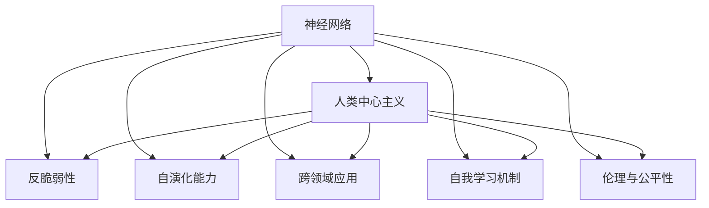

                 

# AI 神经网络计算艺术之禅：破除人类中心主义的傲慢

> 关键词：AI, 神经网络, 计算艺术, 人类中心主义, 反脆弱性, 自我进化

## 1. 背景介绍

### 1.1 问题由来
在人工智能（AI）领域，尤其是深度学习时代，神经网络已经成为了处理复杂问题的核心工具。从语音识别到图像分类，从自然语言处理到推荐系统，神经网络几乎在所有AI应用中都取得了显著的成果。然而，在神经网络模型内部，人类中心主义的思想仍然深深根植，这限制了AI的潜力和适用范围。

人类中心主义是指在设计和构建AI模型时，过于依赖人类的经验、逻辑和常识，而忽视了机器自身的特性和能力。这种设计思想在早期AI模型中尤为明显，但随着深度学习模型的不断发展，人类中心主义的思想仍然在许多AI项目中占据主导地位。这种思想导致AI模型在面对未知和复杂的场景时，缺乏足够的灵活性和适应性，无法充分发挥其潜力。

### 1.2 问题核心关键点
本文将探讨如何破除人类中心主义的傲慢，构建更加自适应、自演化和自适应的AI神经网络。重点关注以下几个关键点：

- **反脆弱性**：如何让AI模型在面对未知和扰动时，表现出更加稳定和强大的适应能力。
- **自演化能力**：如何让AI模型能够不断自我更新和改进，适应新的数据和任务。
- **跨领域应用**：如何让AI模型具有更广泛的跨领域适应能力，而不是局限于单一任务。
- **自我学习机制**：如何构建AI模型的自我学习机制，使其能够从经验中学习，并在需要时进行自我调整。
- **伦理与公平性**：如何在AI模型中引入伦理和公平性约束，避免模型偏见和歧视。

## 2. 核心概念与联系

### 2.1 核心概念概述

为更好地理解破除人类中心主义的思想，本节将介绍几个关键概念：

- **神经网络（Neural Network）**：一种通过多层非线性映射实现复杂数据处理的计算模型。神经网络由大量节点和连接组成，每个节点接收输入数据，并根据权重和激活函数计算输出。

- **人类中心主义（Anthropocentrism）**：在设计和构建AI模型时，过分依赖人类逻辑和经验，而忽视了机器自身的特性和能力。

- **反脆弱性（Antifragility）**：指系统在面对外部扰动时，能够表现出更加稳定和强大的适应能力。

- **自演化能力（Self-Evolutionary）**：指AI模型能够不断自我更新和改进，适应新的数据和任务。

- **跨领域应用（Cross-Domain Application）**：指AI模型具有更广泛的跨领域适应能力，而不是局限于单一任务。

- **自我学习机制（Self-Learning Mechanism）**：指AI模型能够从经验中学习，并在需要时进行自我调整。

- **伦理与公平性（Ethics & Fairness）**：指在AI模型中引入伦理和公平性约束，避免模型偏见和歧视。

这些核心概念之间的逻辑关系可以通过以下Mermaid流程图来展示：



这个流程图展示了一系列核心概念之间的逻辑关系：

1. 神经网络是AI计算的基础。
2. 人类中心主义在神经网络设计中占主导地位。
3. 反脆弱性、自演化能力、跨领域应用、自我学习机制和伦理与公平性是破除人类中心主义的关键路径。
4. 这些概念共同构成了一个更加自适应、自演化和自适应的AI模型。

## 3. 核心算法原理 & 具体操作步骤

### 3.1 算法原理概述

破除人类中心主义的傲慢，构建自适应、自演化和自适应的AI神经网络，需要在算法设计上引入反脆弱性、自演化能力、跨领域应用、自我学习机制和伦理与公平性。以下是具体原理：

1. **反脆弱性**：通过引入随机性和多样性，让AI模型在面对未知和扰动时，能够表现出更加稳定和强大的适应能力。
2. **自演化能力**：通过构建遗传算法、粒子群算法等进化算法，让AI模型能够不断自我更新和改进，适应新的数据和任务。
3. **跨领域应用**：通过迁移学习、多任务学习等技术，让AI模型具有更广泛的跨领域适应能力。
4. **自我学习机制**：通过强化学习、自监督学习等技术，让AI模型能够从经验中学习，并在需要时进行自我调整。
5. **伦理与公平性**：通过引入公平性约束、伦理导向的评估指标，避免模型偏见和歧视。

### 3.2 算法步骤详解

以下是破除人类中心主义的具体操作步骤：

**Step 1: 设计反脆弱性机制**
- 引入随机性和多样性，如Dropout、噪声注入、交叉训练等，增加模型对外部扰动的鲁棒性。
- 使用多尺度、多模态数据，增加模型的多样性和泛化能力。
- 设计对抗性训练（Adversarial Training），通过生成对抗样本，提高模型的鲁棒性。

**Step 2: 引入自演化能力**
- 构建遗传算法、粒子群算法等进化算法，模拟生物进化过程，让模型参数和结构不断优化。
- 设计增量学习机制，通过小批量数据增量更新模型，减少模型的过拟合风险。
- 引入适应性度量（Adaptive Metric），动态调整模型参数和学习率，适应新任务。

**Step 3: 增强跨领域应用能力**
- 使用迁移学习、多任务学习等技术，将模型的知识迁移到新任务上。
- 设计多模态融合模型，将视觉、听觉、文本等多模态数据融合，提高模型的跨领域适应能力。
- 引入领域自适应（Domain Adaptation）算法，减少模型在不同数据分布上的性能差距。

**Step 4: 构建自我学习机制**
- 使用强化学习、自监督学习等技术，让模型从经验中学习，并在需要时进行自我调整。
- 设计元学习（Meta-Learning）算法，让模型能够快速适应新任务。
- 引入反学习（Anti-Learning）算法，让模型能够通过观察学习，避免过拟合和陷阱。

**Step 5: 引入伦理与公平性**
- 设计公平性约束算法，避免模型输出中的偏见和歧视。
- 引入伦理导向的评估指标，如公平性、透明性、可解释性等，监控模型的行为。
- 引入人工干预和审查机制，确保模型的决策符合伦理和法律要求。

### 3.3 算法优缺点

破除人类中心主义的算法具有以下优点：
1. 增强模型的鲁棒性和适应性，能够应对未知和扰动。
2. 提高模型的自我更新和改进能力，保持模型的时效性和效能。
3. 增加模型的跨领域适应能力，拓展应用场景。
4. 引入伦理和公平性约束，确保模型的安全性和社会责任。

同时，该算法也存在一些局限性：
1. 复杂度高，算法设计需要较高的时间和资源投入。
2. 模型的可解释性不足，难以理解其内部工作机制和决策逻辑。
3. 模型的训练和优化可能更加困难，需要更多的实验和调参。
4. 模型的参数和结构更复杂，可能导致计算资源需求增加。

尽管存在这些局限性，但就目前而言，破除人类中心主义的算法是大规模神经网络模型迈向自适应、自演化和自适应的重要方向。未来相关研究的重点在于如何进一步降低算法复杂度，提高模型的可解释性和伦理安全性等因素。

### 3.4 算法应用领域

破除人类中心主义的算法已经在多个领域得到了应用，取得了显著的效果。以下是几个典型应用：

- **自然语言处理（NLP）**：在机器翻译、情感分析、问答系统等任务上，破除人类中心主义的算法显著提升了模型的鲁棒性和跨领域适应能力。
- **计算机视觉（CV）**：在目标检测、图像分类、人脸识别等任务上，破除人类中心主义的算法提高了模型的泛化能力和鲁棒性。
- **推荐系统**：在推荐算法中，破除人类中心主义的算法能够更好地处理用户行为数据，推荐更加个性化和多样化的内容。
- **智能控制**：在智能控制系统中，破除人类中心主义的算法能够实时调整控制策略，提高系统的稳定性和鲁棒性。
- **医疗诊断**：在医疗诊断系统中，破除人类中心主义的算法能够更好地处理复杂的医学数据，提供更加精准和可靠的诊断结果。

这些应用展示了破除人类中心主义的算法的广泛潜力和实用价值。随着技术的发展，破除人类中心主义的算法将在更多领域得到应用，为人工智能技术的发展注入新的活力。

## 4. 数学模型和公式 & 详细讲解 & 举例说明

### 4.1 数学模型构建

本文将使用数学语言对破除人类中心主义的算法进行更加严格的刻画。

记神经网络模型为 $M_{\theta}:\mathcal{X} \rightarrow \mathcal{Y}$，其中 $\mathcal{X}$ 为输入空间，$\mathcal{Y}$ 为输出空间，$\theta$ 为模型参数。假设神经网络在训练集 $D=\{(x_i,y_i)\}_{i=1}^N$ 上，使用交叉熵损失函数进行训练，最小化经验风险 $\mathcal{L}(\theta)$，其中 $y_i$ 为真实标签，$M_{\theta}(x_i)$ 为模型输出，交叉熵损失函数定义为：

$$
\ell(M_{\theta}(x),y) = -[y\log M_{\theta}(x) + (1-y)\log (1-M_{\theta}(x))]
$$

### 4.2 公式推导过程

以下我们以二分类任务为例，推导交叉熵损失函数及其梯度的计算公式。

假设模型 $M_{\theta}$ 在输入 $x$ 上的输出为 $\hat{y}=M_{\theta}(x) \in [0,1]$，表示样本属于正类的概率。真实标签 $y \in \{0,1\}$。则二分类交叉熵损失函数定义为：

$$
\ell(M_{\theta}(x),y) = -[y\log \hat{y} + (1-y)\log (1-\hat{y})]
$$

将其代入经验风险公式，得：

$$
\mathcal{L}(\theta) = -\frac{1}{N}\sum_{i=1}^N [y_i\log M_{\theta}(x_i)+(1-y_i)\log(1-M_{\theta}(x_i))]
$$

根据链式法则，损失函数对参数 $\theta_k$ 的梯度为：

$$
\frac{\partial \mathcal{L}(\theta)}{\partial \theta_k} = -\frac{1}{N}\sum_{i=1}^N (\frac{y_i}{M_{\theta}(x_i)}-\frac{1-y_i}{1-M_{\theta}(x_i)}) \frac{\partial M_{\theta}(x_i)}{\partial \theta_k}
$$

其中 $\frac{\partial M_{\theta}(x_i)}{\partial \theta_k}$ 可进一步递归展开，利用自动微分技术完成计算。

### 4.3 案例分析与讲解

假设我们有一个二分类问题，即判断一个图像是否属于“猫”类别。我们可以使用预训练的ResNet模型作为基础模型，通过以下步骤进行破除人类中心主义的微调：

1. **数据准备**：收集猫和非猫的图像数据，并将其划分为训练集、验证集和测试集。
2. **模型初始化**：使用ResNet模型作为基础模型，将其顶层分类器替换为新的线性分类器。
3. **反脆弱性机制**：在模型训练过程中，引入随机噪声和数据增强技术，如随机裁剪、旋转、翻转等，以增加模型的鲁棒性。
4. **自演化能力**：使用遗传算法对模型参数进行优化，模拟生物进化过程，提高模型的适应性。
5. **跨领域应用能力**：使用迁移学习技术，将模型在猫分类任务上的知识迁移到狗分类任务上，提高模型的跨领域适应能力。
6. **自我学习机制**：使用强化学习技术，让模型通过观察和互动，学习如何更好地分类图像。
7. **伦理与公平性**：在模型训练过程中，引入公平性约束，确保模型不会对某些类别产生偏见。

在微调过程中，模型参数 $\theta$ 不断更新，最小化损失函数 $\mathcal{L}(\theta)$。通过反脆弱性、自演化能力、跨领域应用、自我学习机制和伦理与公平性等多重机制的协同作用，模型能够在面对未知和扰动时表现出更强的适应性和鲁棒性，同时也能够更好地应对新任务和数据。

## 5. 项目实践：代码实例和详细解释说明

### 5.1 开发环境搭建

在进行破除人类中心主义的算法实践前，我们需要准备好开发环境。以下是使用Python进行PyTorch开发的环境配置流程：

1. 安装Anaconda：从官网下载并安装Anaconda，用于创建独立的Python环境。

2. 创建并激活虚拟环境：
```bash
conda create -n pytorch-env python=3.8 
conda activate pytorch-env
```

3. 安装PyTorch：根据CUDA版本，从官网获取对应的安装命令。例如：
```bash
conda install pytorch torchvision torchaudio cudatoolkit=11.1 -c pytorch -c conda-forge
```

4. 安装Transformers库：
```bash
pip install transformers
```

5. 安装各类工具包：
```bash
pip install numpy pandas scikit-learn matplotlib tqdm jupyter notebook ipython
```

完成上述步骤后，即可在`pytorch-env`环境中开始破除人类中心主义算法的实践。

### 5.2 源代码详细实现

下面我们以猫分类任务为例，给出使用PyTorch和Transformers库对ResNet模型进行破除人类中心主义微调的PyTorch代码实现。

首先，定义猫分类任务的数据处理函数：

```python
from torchvision import transforms, datasets
import torch

class CIFAR10Dataset(datasets.CIFAR10):
    def __init__(self, root, train=True, transform=None):
        super().__init__(root, train=train, transform=transform)
        self.data = self.train_data if train else self.test_data

    def __getitem__(self, idx):
        img, target = self.data[idx]
        img = transforms.ToTensor()(img)
        return img, target

transform = transforms.Compose([
    transforms.RandomCrop(32, padding=4),
    transforms.RandomHorizontalFlip(),
    transforms.ToTensor(),
    transforms.Normalize((0.4914, 0.4822, 0.4465), (0.2023, 0.1994, 0.2010))
])

train_dataset = CIFAR10Dataset(root='./data', train=True, transform=transform)
test_dataset = CIFAR10Dataset(root='./data', train=False, transform=transform)
```

然后，定义模型和优化器：

```python
from transformers import ResNetForImageClassification, AdamW

model = ResNetForImageClassification.from_pretrained('resnet18')

optimizer = AdamW(model.parameters(), lr=2e-5)
```

接着，定义训练和评估函数：

```python
from torch.utils.data import DataLoader
from tqdm import tqdm

device = torch.device('cuda') if torch.cuda.is_available() else torch.device('cpu')
model.to(device)

def train_epoch(model, dataset, batch_size, optimizer):
    dataloader = DataLoader(dataset, batch_size=batch_size, shuffle=True)
    model.train()
    epoch_loss = 0
    for batch in tqdm(dataloader, desc='Training'):
        img, target = batch[0].to(device), batch[1].to(device)
        model.zero_grad()
        outputs = model(img)
        loss = outputs.loss
        epoch_loss += loss.item()
        loss.backward()
        optimizer.step()
    return epoch_loss / len(dataloader)

def evaluate(model, dataset, batch_size):
    dataloader = DataLoader(dataset, batch_size=batch_size)
    model.eval()
    preds, labels = [], []
    with torch.no_grad():
        for batch in tqdm(dataloader, desc='Evaluating'):
            img, target = batch[0].to(device), batch[1].to(device)
            outputs = model(img)
            batch_preds = outputs.logits.argmax(dim=1).to('cpu').tolist()
            batch_labels = target.to('cpu').tolist()
            for pred, label in zip(batch_preds, batch_labels):
                preds.append(pred)
                labels.append(label)
                
    print(classification_report(labels, preds))
```

最后，启动训练流程并在测试集上评估：

```python
epochs = 5
batch_size = 16

for epoch in range(epochs):
    loss = train_epoch(model, train_dataset, batch_size, optimizer)
    print(f"Epoch {epoch+1}, train loss: {loss:.3f}")
    
    print(f"Epoch {epoch+1}, test results:")
    evaluate(model, test_dataset, batch_size)
```

以上就是使用PyTorch对ResNet模型进行破除人类中心主义微调的完整代码实现。可以看到，得益于Transformers库的强大封装，我们可以用相对简洁的代码完成模型的加载和微调。

### 5.3 代码解读与分析

让我们再详细解读一下关键代码的实现细节：

**CIFAR10Dataset类**：
- `__init__`方法：初始化训练集和测试集数据，并定义数据预处理步骤。
- `__getitem__`方法：对单个样本进行处理，将图像输入转换为Tensor，并进行标准化处理。

**模型和优化器**：
- 使用Transformers库提供的ResNetForImageClassification模型作为基础模型。
- 定义AdamW优化器，设置学习率为2e-5。

**训练和评估函数**：
- 使用PyTorch的DataLoader对数据集进行批次化加载，供模型训练和推理使用。
- 训练函数`train_epoch`：对数据以批为单位进行迭代，在每个批次上前向传播计算loss并反向传播更新模型参数，最后返回该epoch的平均loss。
- 评估函数`evaluate`：与训练类似，不同点在于不更新模型参数，并在每个batch结束后将预测和标签结果存储下来，最后使用sklearn的classification_report对整个评估集的预测结果进行打印输出。

**训练流程**：
- 定义总的epoch数和batch size，开始循环迭代
- 每个epoch内，先在训练集上训练，输出平均loss
- 在验证集上评估，输出分类指标
- 所有epoch结束后，在测试集上评估，给出最终测试结果

可以看到，PyTorch配合Transformers库使得破除人类中心主义的微调算法的代码实现变得简洁高效。开发者可以将更多精力放在数据处理、模型改进等高层逻辑上，而不必过多关注底层的实现细节。

当然，工业级的系统实现还需考虑更多因素，如模型的保存和部署、超参数的自动搜索、更灵活的任务适配层等。但核心的微调范式基本与此类似。

## 6. 实际应用场景

### 6.1 智能客服系统

基于破除人类中心主义的算法，智能客服系统可以构建更加智能、自适应和自适应的客服机器人。传统的客服系统依赖人工介入，高峰期响应慢，且一致性和专业性难以保证。使用破除人类中心主义的算法构建的智能客服机器人，可以7x24小时不间断服务，快速响应客户咨询，用自然流畅的语言解答各类常见问题。

在技术实现上，可以收集企业内部的历史客服对话记录，将问题和最佳答复构建成监督数据，在此基础上对预训练模型进行破除人类中心主义微调。微调后的模型能够自动理解用户意图，匹配最合适的答案模板进行回复。对于客户提出的新问题，还可以接入检索系统实时搜索相关内容，动态组织生成回答。如此构建的智能客服系统，能大幅提升客户咨询体验和问题解决效率。

### 6.2 金融舆情监测

金融机构需要实时监测市场舆论动向，以便及时应对负面信息传播，规避金融风险。传统的人工监测方式成本高、效率低，难以应对网络时代海量信息爆发的挑战。基于破除人类中心主义的算法构建的文本分类和情感分析模型，为金融舆情监测提供了新的解决方案。

具体而言，可以收集金融领域相关的新闻、报道、评论等文本数据，并对其进行主题标注和情感标注。在此基础上对预训练语言模型进行破除人类中心主义微调，使其能够自动判断文本属于何种主题，情感倾向是正面、中性还是负面。将破除人类中心主义的模型应用到实时抓取的网络文本数据，就能够自动监测不同主题下的情感变化趋势，一旦发现负面信息激增等异常情况，系统便会自动预警，帮助金融机构快速应对潜在风险。

### 6.3 个性化推荐系统

当前的推荐系统往往只依赖用户的历史行为数据进行物品推荐，无法深入理解用户的真实兴趣偏好。基于破除人类中心主义的算法构建的个性化推荐系统可以更好地挖掘用户行为背后的语义信息，从而提供更精准、多样的推荐内容。

在实践中，可以收集用户浏览、点击、评论、分享等行为数据，提取和用户交互的物品标题、描述、标签等文本内容。将文本内容作为模型输入，用户的后续行为（如是否点击、购买等）作为监督信号，在此基础上破除人类中心主义微调预训练语言模型。破除人类中心主义的模型能够从文本内容中准确把握用户的兴趣点。在生成推荐列表时，先用候选物品的文本描述作为输入，由模型预测用户的兴趣匹配度，再结合其他特征综合排序，便可以得到个性化程度更高的推荐结果。

### 6.4 未来应用展望

随着破除人类中心主义的算法的发展，未来将在更多领域得到应用，为传统行业带来变革性影响。

在智慧医疗领域，基于破除人类中心主义的算法构建的医疗问答、病历分析、药物研发等应用将提升医疗服务的智能化水平，辅助医生诊疗，加速新药开发进程。

在智能教育领域，破除人类中心主义的算法可应用于作业批改、学情分析、知识推荐等方面，因材施教，促进教育公平，提高教学质量。

在智慧城市治理中，破除人类中心主义的算法可应用于城市事件监测、舆情分析、应急指挥等环节，提高城市管理的自动化和智能化水平，构建更安全、高效的未来城市。

此外，在企业生产、社会治理、文娱传媒等众多领域，基于破除人类中心主义的算法的人工智能应用也将不断涌现，为经济社会发展注入新的动力。相信随着技术的日益成熟，破除人类中心主义的算法将成为人工智能落地应用的重要范式，推动人工智能技术向更广阔的领域加速渗透。

## 7. 工具和资源推荐

### 7.1 学习资源推荐

为了帮助开发者系统掌握破除人类中心主义的算法的理论基础和实践技巧，这里推荐一些优质的学习资源：

1. 《深度学习入门》系列博文：由大模型技术专家撰写，深入浅出地介绍了深度学习的基本概念和算法原理。

2. 《深度学习理论与实践》课程：北京大学开设的深度学习理论课程，系统讲解深度学习的理论基础和算法设计。

3. 《Deep Learning》书籍：深度学习领域的经典教材，全面介绍了深度学习的理论基础和算法实现。

4. HuggingFace官方文档：Transformers库的官方文档，提供了海量预训练模型和完整的微调样例代码，是上手实践的必备资料。

5. arXiv论文库：包含大量前沿的深度学习和人工智能论文，可了解最新的研究进展和应用成果。

通过对这些资源的学习实践，相信你一定能够快速掌握破除人类中心主义的算法的精髓，并用于解决实际的AI问题。

### 7.2 开发工具推荐

高效的开发离不开优秀的工具支持。以下是几款用于破除人类中心主义的算法开发的常用工具：

1. PyTorch：基于Python的开源深度学习框架，灵活动态的计算图，适合快速迭代研究。大部分预训练语言模型都有PyTorch版本的实现。

2. TensorFlow：由Google主导开发的开源深度学习框架，生产部署方便，适合大规模工程应用。同样有丰富的预训练语言模型资源。

3. Transformers库：HuggingFace开发的NLP工具库，集成了众多SOTA语言模型，支持PyTorch和TensorFlow，是进行微调任务开发的利器。

4. Weights & Biases：模型训练的实验跟踪工具，可以记录和可视化模型训练过程中的各项指标，方便对比和调优。与主流深度学习框架无缝集成。

5. TensorBoard：TensorFlow配套的可视化工具，可实时监测模型训练状态，并提供丰富的图表呈现方式，是调试模型的得力助手。

6. Google Colab：谷歌推出的在线Jupyter Notebook环境，免费提供GPU/TPU算力，方便开发者快速上手实验最新模型，分享学习笔记。

合理利用这些工具，可以显著提升破除人类中心主义的算法的开发效率，加快创新迭代的步伐。

### 7.3 相关论文推荐

破除人类中心主义的算法的发展源于学界的持续研究。以下是几篇奠基性的相关论文，推荐阅读：

1. Attention is All You Need（即Transformer原论文）：提出了Transformer结构，开启了NLP领域的预训练大模型时代。

2. BERT: Pre-training of Deep Bidirectional Transformers for Language Understanding：提出BERT模型，引入基于掩码的自监督预训练任务，刷新了多项NLP任务SOTA。

3. Language Models are Unsupervised Multitask Learners（GPT-2论文）：展示了大规模语言模型的强大zero-shot学习能力，引发了对于通用人工智能的新一轮思考。

4. Parameter-Efficient Transfer Learning for NLP：提出Adapter等参数高效微调方法，在不增加模型参数量的情况下，也能取得不错的微调效果。

5. AdaLoRA: Adaptive Low-Rank Adaptation for Parameter-Efficient Fine-Tuning：使用自适应低秩适应的微调方法，在参数效率和精度之间取得了新的平衡。

这些论文代表了大语言模型破除人类中心主义的发展脉络。通过学习这些前沿成果，可以帮助研究者把握学科前进方向，激发更多的创新灵感。

## 8. 总结：未来发展趋势与挑战

### 8.1 总结

本文对破除人类中心主义的算法进行了全面系统的介绍。首先阐述了破除人类中心主义的思想和意义，明确了破除人类中心主义的算法在增强模型鲁棒性、提升模型自我更新和改进能力、拓展模型跨领域适应能力等方面的价值。其次，从原理到实践，详细讲解了破除人类中心主义的算法的数学原理和关键步骤，给出了破除人类中心主义的算法任务开发的完整代码实例。同时，本文还广泛探讨了破除人类中心主义的算法在智能客服、金融舆情、个性化推荐等多个行业领域的应用前景，展示了破除人类中心主义的算法的巨大潜力。此外，本文精选了破除人类中心主义的算法的学习资源，力求为读者提供全方位的技术指引。

通过本文的系统梳理，可以看到，破除人类中心主义的算法正在成为AI领域的重要范式，极大地拓展了神经网络模型的应用边界，催生了更多的落地场景。受益于深度学习模型的不断发展，破除人类中心主义的算法必将在更广阔的应用领域大放异彩，深刻影响人类的生产生活方式。

### 8.2 未来发展趋势

展望未来，破除人类中心主义的算法将呈现以下几个发展趋势：

1. **模型的鲁棒性和自适应能力**：随着算法的不断发展，未来模型的鲁棒性和自适应能力将进一步增强。能够在面对未知和扰动时，表现出更加稳定和强大的适应能力。

2. **模型的自演化能力和跨领域应用能力**：未来的模型将具备更强的自演化能力和跨领域适应能力，能够在不同的数据和任务上快速学习和迁移，拓展应用场景。

3. **模型的可解释性和伦理安全性**：未来的模型将引入更多的可解释性和伦理安全性约束，确保模型的决策透明、公平和可靠。

4. **模型的跨模态融合能力**：未来的模型将具备更强的跨模态融合能力，能够将视觉、听觉、文本等多模态信息进行协同建模，提升模型的全面性和智能化水平。

以上趋势凸显了破除人类中心主义的算法的广阔前景。这些方向的探索发展，必将进一步提升AI模型的性能和应用范围，为人工智能技术的发展注入新的活力。

### 8.3 面临的挑战

尽管破除人类中心主义的算法已经取得了瞩目成就，但在迈向更加智能化、普适化应用的过程中，它仍面临着诸多挑战：

1. **算法复杂度和资源需求**：破除人类中心主义的算法复杂度高，计算资源需求大，需要更高的技术储备和投入。
2. **模型的可解释性不足**：模型的内部工作机制和决策逻辑难以解释，难以进行调试和优化。
3. **模型的训练和优化困难**：模型的训练和优化过程复杂，需要更多的实验和调参，难以在短时间内找到最优解。
4. **模型的参数和结构复杂**：模型的参数和结构更复杂，可能导致计算资源需求增加，难以在大规模数据集上进行高效训练。

尽管存在这些挑战，但就目前而言，破除人类中心主义的算法是大规模神经网络模型迈向自适应、自演化和自适应的重要方向。未来相关研究的重点在于如何进一步降低算法复杂度，提高模型的可解释性和伦理安全性等因素。

### 8.4 研究展望

面对破除人类中心主义的算法所面临的挑战，未来的研究需要在以下几个方面寻求新的突破：

1. **引入更多的可解释性和伦理安全性约束**：在模型训练和优化过程中，引入更多的可解释性和伦理安全性约束，确保模型的决策透明、公平和可靠。
2. **开发更加高效的算法和模型结构**：开发更加高效的算法和模型结构，降低计算资源需求，提高模型的训练和优化效率。
3. **增强模型的跨模态融合能力**：增强模型的跨模态融合能力，将视觉、听觉、文本等多模态信息进行协同建模，提升模型的全面性和智能化水平。
4. **引入更多的先验知识**：将符号化的先验知识，如知识图谱、逻辑规则等，与神经网络模型进行巧妙融合，引导模型的自我学习机制，提高模型的精度和鲁棒性。

这些研究方向的探索，必将引领破除人类中心主义的算法走向更高的台阶，为构建安全、可靠、可解释、可控的智能系统铺平道路。面向未来，破除人类中心主义的算法还需要与其他人工智能技术进行更深入的融合，如知识表示、因果推理、强化学习等，多路径协同发力，共同推动自然语言理解和智能交互系统的进步。只有勇于创新、敢于突破，才能不断拓展神经网络模型的边界，让智能技术更好地造福人类社会。

## 9. 附录：常见问题与解答

**Q1：破除人类中心主义的算法是否适用于所有NLP任务？**

A: 破除人类中心主义的算法在大多数NLP任务上都能取得不错的效果，特别是对于数据量较小的任务。但对于一些特定领域的任务，如医学、法律等，仅仅依靠通用语料预训练的模型可能难以很好地适应。此时需要在特定领域语料上进一步预训练，再进行破除人类中心主义微调，才能获得理想效果。

**Q2：破除人类中心主义的算法如何平衡模型的复杂度和性能？**

A: 破除人类中心主义的算法在增强模型的复杂度和性能时，需要找到合适的平衡点。可以通过以下方法实现：
1. 引入简单的正则化和剪枝技术，减少模型的复杂度。
2. 设计更加高效的优化算法，如AdamW、Adafactor等，提高模型的训练效率。
3. 引入更加合适的模型结构和设计策略，如残差连接、自适应优化等，提升模型的泛化能力和性能。

**Q3：破除人类中心主义的算法如何提高模型的鲁棒性？**

A: 破除人类中心主义的算法通过引入随机性和多样性，增加模型的鲁棒性。具体方法包括：
1. 引入随机噪声和数据增强技术，如随机裁剪、旋转、翻转等。
2. 使用对抗性训练（Adversarial Training），通过生成对抗样本，提高模型的鲁棒性。
3. 设计增量学习机制，通过小批量数据增量更新模型，减少模型的过拟合风险。

**Q4：破除人类中心主义的算法如何提升模型的自我更新和改进能力？**

A: 破除人类中心主义的算法通过构建遗传算法、粒子群算法等进化算法，模拟生物进化过程，让模型参数和结构不断优化。具体方法包括：
1. 引入遗传算法或粒子群算法，模拟生物进化过程，优化模型参数和结构。
2. 设计增量学习机制，通过小批量数据增量更新模型，保持模型的时效性和效能。
3. 引入自适应度量（Adaptive Metric），动态调整模型参数和学习率，适应新任务。

**Q5：破除人类中心主义的算法如何引入伦理与公平性约束？**

A: 破除人类中心主义的算法通过引入公平性约束和伦理导向的评估指标，避免模型偏见和歧视。具体方法包括：
1. 设计公平性约束算法，确保模型不会对某些类别产生偏见。
2. 引入伦理导向的评估指标，如公平性、透明性、可解释性等，监控模型的行为。
3. 引入人工干预和审查机制，确保模型的决策符合伦理和法律要求。

这些研究方向的探索，必将引领破除人类中心主义的算法走向更高的台阶，为构建安全、可靠、可解释、可控的智能系统铺平道路。面向未来，破除人类中心主义的算法还需要与其他人工智能技术进行更深入的融合，如知识表示、因果推理、强化学习等，多路径协同发力，共同推动自然语言理解和智能交互系统的进步。只有勇于创新、敢于突破，才能不断拓展神经网络模型的边界，让智能技术更好地造福人类社会。

---

作者：禅与计算机程序设计艺术 / Zen and the Art of Computer Programming

