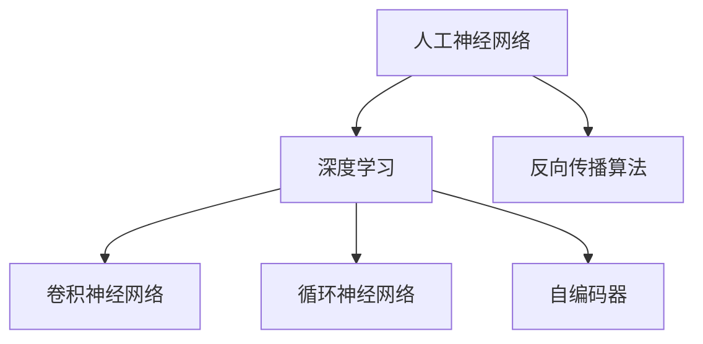

                 

# AI 神经网络计算艺术之道

> 关键词：神经网络,深度学习,计算艺术,人工智能,计算机科学

## 1. 背景介绍

### 1.1 问题由来

在现代计算机科学和人工智能领域，神经网络（Neural Networks, NNs）被广泛地应用于图像识别、语音识别、自然语言处理、推荐系统等众多领域。这些模型源自对生物神经网络的模仿，通过学习大规模数据集上的复杂模式，实现对未知数据的泛化。但为何神经网络能如此成功地应用于各种复杂问题？这背后的计算艺术之道又在哪里？

### 1.2 问题核心关键点

神经网络的计算艺术主要体现在三个方面：

1. **模型的结构设计**：如何设计有效的神经网络架构以适应特定问题。
2. **训练的优化策略**：如何快速高效地训练神经网络，防止过拟合。
3. **参数的智能调整**：如何在计算资源有限的情况下，有效地利用神经网络的计算资源。

理解这三个核心问题，将有助于我们深入掌握神经网络背后的计算艺术，从而更好地应用于实际问题中。

### 1.3 问题研究意义

深入探讨神经网络的计算艺术，不仅能够提升现有神经网络模型的性能，还能够启发新的算法设计和理论发现，推动人工智能技术的进步。此外，对于即将到来的超级智能时代，掌握计算艺术更是关键。

## 2. 核心概念与联系

### 2.1 核心概念概述

神经网络的核心概念主要包括：

- **人工神经网络（Artificial Neural Networks, ANNs）**：由互连的神经元（或称为节点）构成的计算模型，每个神经元接收输入，并通过激活函数计算输出。
- **深度学习（Deep Learning, DL）**：神经网络的高级形式，使用多层次的神经网络来学习数据特征。
- **反向传播算法（Backpropagation）**：用于训练神经网络的优化算法，通过误差反向传播更新参数。
- **卷积神经网络（Convolutional Neural Networks, CNNs）**：用于图像处理的神经网络架构，通过卷积和池化操作提取空间特征。
- **循环神经网络（Recurrent Neural Networks, RNNs）**：用于序列数据处理的神经网络架构，如文本生成、时间序列预测等。
- **自编码器（Autoencoder）**：通过无监督学习来压缩和重构数据的神经网络模型，广泛用于特征提取和降维。

这些概念之间的联系可以通过以下Mermaid流程图来展示：



这个流程图展示了一些主要概念之间的逻辑关系：

1. 人工神经网络是深度学习的底层架构。
2. 深度学习通过多个层次的神经网络学习复杂数据特征。
3. 反向传播算法是深度学习的主要优化手段。
4. 卷积神经网络和循环神经网络是深度学习的两种重要架构，分别处理图像和序列数据。
5. 自编码器是一种用于特征提取和降维的无监督学习方法。

这些概念共同构成了神经网络的基础框架，有助于我们理解其背后的计算艺术。

## 3. 核心算法原理 & 具体操作步骤
### 3.1 算法原理概述

神经网络的计算艺术主要体现在以下几个方面：

1. **结构设计**：选择合适的神经网络架构，设计合理的层数、神经元个数和激活函数等，以适应特定问题的解决。
2. **优化策略**：使用有效的训练算法，如梯度下降、Adam等，避免过拟合，提升模型泛化能力。
3. **参数调整**：通过调整学习率、正则化参数等，平衡模型的复杂度和泛化能力。

### 3.2 算法步骤详解

#### 3.2.1 数据准备

神经网络训练的前提是准备数据集。通常需要将数据分为训练集、验证集和测试集。

**训练集**：用于训练模型，发现模型的参数。
**验证集**：用于调整模型的超参数，如学习率、正则化参数等，防止过拟合。
**测试集**：用于评估模型的最终性能，决定是否接受该模型。

#### 3.2.2 模型构建

选择合适的神经网络架构，设计网络结构。以卷积神经网络为例：

1. **输入层**：接收输入数据。
2. **卷积层**：通过卷积操作提取局部特征。
3. **池化层**：通过池化操作减少特征维度和噪声。
4. **全连接层**：将卷积层提取的特征输入全连接层进行分类或回归。

#### 3.2.3 参数初始化

初始化网络参数，通常使用随机初始化或Xavier初始化。

#### 3.2.4 前向传播

将输入数据通过网络进行前向传播，计算每个神经元的输出。

#### 3.2.5 损失计算

计算模型输出与真实标签之间的损失函数，如均方误差、交叉熵等。

#### 3.2.6 反向传播

根据损失函数计算梯度，反向传播更新网络参数。

#### 3.2.7 参数更新

使用优化算法，如梯度下降、Adam等，更新模型参数。

#### 3.2.8 模型评估

在测试集上评估模型性能，决定是否接受该模型。

### 3.3 算法优缺点

神经网络的计算艺术主要体现在以下几个方面：

#### 优点

1. **强大的表达能力**：能够学习任意复杂的函数映射，适用于各种复杂问题。
2. **高度的泛化能力**：在处理新数据时表现良好，具有良好的泛化能力。
3. **自动化的特征提取**：通过神经网络可以自动发现数据中的特征，无需手工设计特征。

#### 缺点

1. **计算资源需求高**：需要大量的计算资源进行训练。
2. **易过拟合**：在训练数据不足的情况下，容易过拟合。
3. **难以解释**：神经网络的决策过程复杂，难以解释和调试。

### 3.4 算法应用领域

神经网络的计算艺术广泛应用于以下领域：

- **图像识别**：如物体检测、人脸识别等。
- **语音识别**：如自动语音识别、语音合成等。
- **自然语言处理**：如文本分类、情感分析、机器翻译等。
- **推荐系统**：如商品推荐、新闻推荐等。
- **时间序列预测**：如股票价格预测、天气预测等。

## 4. 数学模型和公式 & 详细讲解 & 举例说明

### 4.1 数学模型构建

神经网络的数学模型通常包括以下几个部分：

1. **输入层**：输入数据。
2. **隐藏层**：神经元之间的连接，通过激活函数计算输出。
3. **输出层**：模型输出，用于预测或分类。

以卷积神经网络为例，数学模型可以表示为：

$$
y = \sigma \left( \sum_{i=1}^n w_i \cdot \sigma \left( \sum_{j=1}^m u_{ij} \cdot x_j \right) + b_i \right) + c
$$

其中，$x_j$ 为输入特征，$u_{ij}$ 为卷积核，$w_i$ 为权重，$b_i$ 为偏置，$\sigma$ 为激活函数，$c$ 为常数。

### 4.2 公式推导过程

以卷积神经网络为例，推导其前向传播过程。

设输入数据为 $x_1, x_2, ..., x_m$，卷积核为 $u_1, u_2, ..., u_n$，激活函数为 $\sigma$，输出为 $y_1, y_2, ..., y_n$。

前向传播过程如下：

1. 对每个输入 $x_j$，进行卷积计算：
   $$
   y_i = \sigma \left( \sum_{j=1}^m u_{ij} \cdot x_j \right)
   $$
2. 对每个输出 $y_i$，进行激活函数计算：
   $$
   y_i = \sigma \left( \sum_{j=1}^n w_i \cdot y_j + b_i \right) + c
   $$

### 4.3 案例分析与讲解

以手写数字识别为例，使用卷积神经网络进行训练。

假设输入为 $28 \times 28$ 的灰度图像，输出为 10 个类别的概率分布。

1. **输入层**：输入图像数据。
2. **卷积层**：通过卷积核提取局部特征。
3. **池化层**：通过池化操作减少特征维度和噪声。
4. **全连接层**：将卷积层提取的特征输入全连接层进行分类。

### 4.4 常见问题与解答

**Q1: 神经网络的计算复杂度是多少？**

A: 神经网络的计算复杂度取决于其结构，通常使用指数级表示。例如，一个有 $n$ 个神经元、$m$ 个特征的神经网络，其计算复杂度为 $O(n \cdot m)$。

**Q2: 如何选择神经网络的结构？**

A: 选择神经网络的结构需要考虑多个因素，如数据集大小、问题复杂度、计算资源等。常见的结构选择方法包括：

1. **增加网络层数**：提高模型的表达能力。
2. **增加神经元个数**：提高模型的拟合能力。
3. **使用不同的激活函数**：如 ReLU、Sigmoid、Tanh 等，提高模型的非线性表达能力。
4. **使用不同的优化算法**：如 Adam、SGD、RMSprop 等，提高训练效率。

## 5. 项目实践：代码实例和详细解释说明

### 5.1 开发环境搭建

神经网络的开发需要强大的计算资源，通常使用GPU/TPU进行训练。以下是使用PyTorch搭建环境的示例：

1. 安装PyTorch：
   ```
   pip install torch torchvision torchaudio
   ```

2. 安装TensorBoard：
   ```
   pip install tensorboard
   ```

3. 安装Matplotlib：
   ```
   pip install matplotlib
   ```

### 5.2 源代码详细实现

以下是一个简单的卷积神经网络的Python代码实现：

```python
import torch
import torch.nn as nn
import torch.optim as optim
import torchvision.transforms as transforms
from torch.utils.data import DataLoader, Dataset

class MNISTDataset(Dataset):
    def __init__(self, data_dir, transform=None):
        self.data_dir = data_dir
        self.transform = transform
        self.data = []
        for filename in os.listdir(data_dir):
            if filename.endswith('.jpg'):
                img_path = os.path.join(data_dir, filename)
                label = int(filename.split('_')[1])
                self.data.append((img_path, label))
        
    def __len__(self):
        return len(self.data)
    
    def __getitem__(self, idx):
        img_path, label = self.data[idx]
        img = Image.open(img_path).convert('L')
        if self.transform:
            img = self.transform(img)
        return img, label

class ConvNet(nn.Module):
    def __init__(self):
        super(ConvNet, self).__init__()
        self.conv1 = nn.Conv2d(1, 16, 3, padding=1)
        self.conv2 = nn.Conv2d(16, 32, 3, padding=1)
        self.fc1 = nn.Linear(7 * 7 * 32, 64)
        self.fc2 = nn.Linear(64, 10)
    
    def forward(self, x):
        x = F.relu(self.conv1(x))
        x = F.max_pool2d(x, 2)
        x = F.relu(self.conv2(x))
        x = F.max_pool2d(x, 2)
        x = x.view(x.size(0), -1)
        x = F.relu(self.fc1(x))
        x = self.fc2(x)
        return F.log_softmax(x, dim=1)

def train(model, device, train_loader, optimizer, epoch, print_freq):
    model.train()
    for batch_idx, (data, target) in enumerate(train_loader):
        data, target = data.to(device), target.to(device)
        optimizer.zero_grad()
        output = model(data)
        loss = F.nll_loss(output, target)
        loss.backward()
        optimizer.step()
        if batch_idx % print_freq == 0:
            print('Train Epoch: {} [{}/{} ({:.0f}%)]\tLoss: {:.6f}'.format(
                epoch, batch_idx * len(data), len(train_loader.dataset),
                100. * batch_idx / len(train_loader), loss.item()))

def test(model, device, test_loader, print_freq):
    model.eval()
    test_loss = 0
    correct = 0
    with torch.no_grad():
        for data, target in test_loader:
            data, target = data.to(device), target.to(device)
            output = model(data)
            test_loss += F.nll_loss(output, target, reduction='sum').item()
            pred = output.argmax(dim=1, keepdim=True)
            correct += pred.eq(target.view_as(pred)).sum().item()
    test_loss /= len(test_loader.dataset)
    print('\nTest set: Average loss: {:.4f}, Accuracy: {}/{} ({:.0f}%)\n'.format(
        test_loss, correct, len(test_loader.dataset),
        100. * correct / len(test_loader.dataset)))

# 加载数据集
transform = transforms.Compose([
    transforms.ToTensor(),
    transforms.Normalize((0.5,), (0.5,))
])
train_dataset = MNISTDataset('train', transform)
test_dataset = MNISTDataset('test', transform)
train_loader = DataLoader(train_dataset, batch_size=64, shuffle=True)
test_loader = DataLoader(test_dataset, batch_size=64, shuffle=False)

# 定义模型
device = torch.device('cuda' if torch.cuda.is_available() else 'cpu')
model = ConvNet().to(device)

# 定义优化器
optimizer = optim.Adam(model.parameters(), lr=0.001)

# 训练模型
for epoch in range(10):
    train(model, device, train_loader, optimizer, epoch, 10)
    test(model, device, test_loader, 10)
```

### 5.3 代码解读与分析

#### 5.3.1 数据集定义

定义一个MNIST数据集，用于手写数字识别。

#### 5.3.2 模型定义

定义一个简单的卷积神经网络，包括两个卷积层和两个全连接层。

#### 5.3.3 训练过程

定义训练过程，包括前向传播、反向传播和优化器更新。

#### 5.3.4 测试过程

定义测试过程，计算测试集上的损失和准确率。

## 6. 实际应用场景

### 6.1 图像识别

卷积神经网络在图像识别领域表现优异，广泛应用于自动驾驶、医学影像分析、卫星图像分析等场景。

### 6.2 语音识别

卷积神经网络在语音识别领域也取得了显著成果，如语音合成、语音命令识别等。

### 6.3 自然语言处理

循环神经网络在自然语言处理领域广泛应用，如文本生成、机器翻译、情感分析等。

### 6.4 时间序列预测

循环神经网络在时间序列预测领域表现突出，如股票价格预测、天气预测等。

## 7. 工具和资源推荐

### 7.1 学习资源推荐

1. 《深度学习》书籍：Ian Goodfellow等人所著，全面介绍了深度学习的理论基础和实践方法。
2. 《神经网络与深度学习》课程：由Andrew Ng开设，是深度学习领域的经典入门课程。
3. 《动手学深度学习》书籍：李沐等人编写，提供丰富的代码示例和实践项目。
4. TensorFlow官方文档：提供了详细的API文档和代码示例，方便学习使用。
5. PyTorch官方文档：提供了丰富的教程和示例，适合快速上手。

### 7.2 开发工具推荐

1. PyTorch：基于Python的深度学习框架，适合快速迭代研究。
2. TensorFlow：由Google主导开发的深度学习框架，适合大规模工程应用。
3. TensorBoard：TensorFlow配套的可视化工具，方便调试模型。
4. Weights & Biases：模型训练的实验跟踪工具，记录训练过程中的各项指标。
5. Jupyter Notebook：开源的交互式计算环境，支持Python、R等多种语言。

### 7.3 相关论文推荐

1. "Deep Learning"论文：Ian Goodfellow等人，引入了深度学习的概念，为后续研究奠定了基础。
2. "ImageNet Classification with Deep Convolutional Neural Networks"论文：Alex Krizhevsky等人，展示了卷积神经网络在图像分类上的卓越表现。
3. "Learning Phrases, Words, and Sentences from Scratch"论文：Andrej Karpathy等人，展示了无监督学习在语言处理上的潜力。
4. "Attention is All You Need"论文：Ashish Vaswani等人，引入了Transformer架构，显著提升了语言处理的性能。
5. "BERT: Pre-training of Deep Bidirectional Transformers for Language Understanding"论文：Jacob Devlin等人，展示了预训练语言模型在语言理解上的出色表现。

## 8. 总结：未来发展趋势与挑战

### 8.1 研究成果总结

神经网络的计算艺术在过去的几十年中取得了显著进展，推动了人工智能技术的发展。未来，计算艺术将继续引领神经网络的研究和应用。

### 8.2 未来发展趋势

1. **神经网络架构创新**：未来将会出现更加高效的神经网络架构，如神经网络形态学习、神经网络架构搜索等。
2. **无监督学习**：无监督学习将继续发展，如自编码器、变分自编码器等。
3. **迁移学习**：迁移学习将在多个领域得到广泛应用，如知识迁移、领域迁移等。
4. **强化学习**：强化学习与神经网络的结合将推动智能体在复杂环境中的决策。
5. **计算资源优化**：计算资源优化技术将继续发展，如分布式训练、模型压缩等。

### 8.3 面临的挑战

1. **计算资源需求高**：神经网络的计算资源需求仍较高，需要大量的计算资源进行训练和推理。
2. **数据隐私和安全**：神经网络处理的数据隐私和安全问题日益突出，需要加强数据保护和隐私管理。
3. **模型可解释性**：神经网络的决策过程复杂，难以解释和调试，需要加强模型的可解释性和透明性。
4. **过拟合问题**：神经网络容易过拟合，需要加强模型的泛化能力和鲁棒性。
5. **伦理和社会影响**：神经网络在伦理和社会影响方面存在潜在风险，需要加强规范和监管。

### 8.4 研究展望

未来的研究将集中在以下几个方面：

1. **模型泛化能力**：提高神经网络的泛化能力，使其在各种复杂场景中表现稳定。
2. **计算资源优化**：优化神经网络的计算资源使用，提高其效率和性能。
3. **模型透明性**：提高神经网络的透明性和可解释性，使其决策过程透明可理解。
4. **数据隐私保护**：加强数据隐私保护，确保数据使用的安全性和合规性。
5. **伦理和社会影响**：加强神经网络的伦理和社会影响研究，确保其行为符合社会价值观和伦理规范。

## 9. 附录：常见问题与解答

**Q1: 神经网络的计算复杂度是多少？**

A: 神经网络的计算复杂度取决于其结构，通常使用指数级表示。例如，一个有 $n$ 个神经元、$m$ 个特征的神经网络，其计算复杂度为 $O(n \cdot m)$。

**Q2: 如何选择神经网络的结构？**

A: 选择神经网络的结构需要考虑多个因素，如数据集大小、问题复杂度、计算资源等。常见的结构选择方法包括：

1. **增加网络层数**：提高模型的表达能力。
2. **增加神经元个数**：提高模型的拟合能力。
3. **使用不同的激活函数**：如 ReLU、Sigmoid、Tanh 等，提高模型的非线性表达能力。
4. **使用不同的优化算法**：如 Adam、SGD、RMSprop 等，提高训练效率。

**Q3: 神经网络的计算艺术主要体现在哪些方面？**

A: 神经网络的计算艺术主要体现在以下几个方面：

1. **模型的结构设计**：选择合适的神经网络架构，设计合理的层数、神经元个数和激活函数等，以适应特定问题的解决。
2. **优化策略**：使用有效的训练算法，如梯度下降、Adam等，避免过拟合，提升模型泛化能力。
3. **参数调整**：通过调整学习率、正则化参数等，平衡模型的复杂度和泛化能力。

**Q4: 如何缓解神经网络的过拟合问题？**

A: 缓解神经网络的过拟合问题，可以采用以下几种方法：

1. **数据增强**：通过随机变换、旋转、裁剪等方式扩充训练集。
2. **正则化**：使用L2正则、Dropout等方法防止过拟合。
3. **早停法**：在验证集上监控模型性能，当性能不再提升时停止训练。
4. **模型简化**：减少神经元个数、层数等，提高模型的泛化能力。

**Q5: 如何提高神经网络的泛化能力？**

A: 提高神经网络的泛化能力，可以采用以下几种方法：

1. **数据增强**：通过随机变换、旋转、裁剪等方式扩充训练集。
2. **正则化**：使用L2正则、Dropout等方法防止过拟合。
3. **早停法**：在验证集上监控模型性能，当性能不再提升时停止训练。
4. **模型简化**：减少神经元个数、层数等，提高模型的泛化能力。
5. **迁移学习**：在多个任务之间共享知识，提升模型的泛化能力。

---

作者：禅与计算机程序设计艺术 / Zen and the Art of Computer Programming

