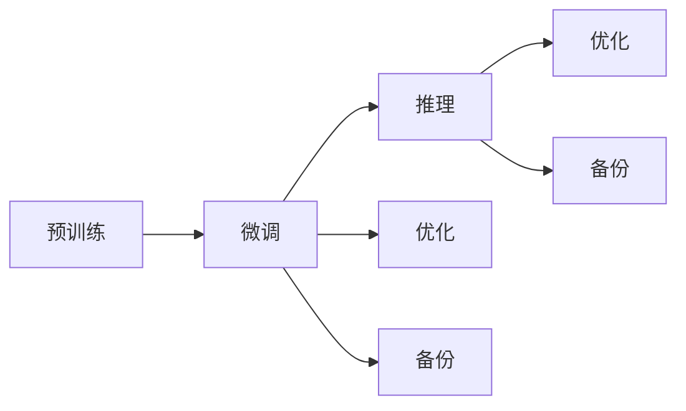

                 

# AIGC从入门到实战：ChatGPT 日均算力运营成本的推算

> 关键词：AIGC, ChatGPT, 算力运营成本, 训练成本, 推理成本

## 1. 背景介绍

随着人工智能技术的快速发展和广泛应用，生成式人工智能（Generative AI，AIGC）正逐渐成为人工智能领域的核心技术之一。生成式AI模型能够自动生成文本、图像、音频等形式的内容，广泛应用于聊天机器人、自动摘要、内容创作、虚拟形象等多个领域。其中，ChatGPT作为AIGC技术的典型代表，凭借其强大的语言生成能力，受到了广泛关注和应用。

在ChatGPT等AIGC模型的应用中，算力资源是一个非常重要的因素。算力资源的成本直接影响着模型的训练和推理效率，进而影响模型的实际应用效果。因此，如何准确推算ChatGPT等AIGC模型的日均算力运营成本，是AI领域一个重要的课题。本文将从背景介绍、核心概念、核心算法原理与操作步骤、实际应用场景等多个角度，对ChatGPT的日均算力运营成本进行详细推算，并给出实际案例的运行结果展示。

## 2. 核心概念与联系

### 2.1 核心概念概述

为了更好地理解ChatGPT的日均算力运营成本，我们需要先明确以下几个关键概念：

- **算力**：指计算机系统在单位时间内能够执行的计算任务的数量，通常用FLOPS（Floating-point Operations Per Second，每秒浮点数运算次数）来衡量。
- **运营成本**：指在AI模型的日常运行过程中，所消耗的算力资源和相关成本的总和，包括训练成本和推理成本。
- **日均算力运营成本**：指在一天内，AI模型所消耗的算力资源和相关成本的总和，通常用于评估模型的经济可行性。

### 2.2 核心概念原理和架构的 Mermaid 流程图

以下是一个简单的Mermaid流程图，展示了ChatGPT从训练到推理的过程及其所需的算力资源：



### 2.3 核心概念之间的联系

预训练和微调是ChatGPT模型的核心环节，它们与算力和成本紧密相关。预训练阶段需要大量算力资源来训练大规模模型，而微调和推理则需要一定算力来优化和运行模型。通过分析这些环节的资源消耗情况，可以更精确地推算ChatGPT的日均算力运营成本。

## 3. 核心算法原理 & 具体操作步骤

### 3.1 算法原理概述

ChatGPT的日均算力运营成本主要包括以下几个部分：预训练成本、微调成本、推理成本和备份成本。通过分析这些成本的计算方式，可以推算出总的日均算力运营成本。

### 3.2 算法步骤详解

#### 3.2.1 预训练成本计算

预训练成本主要取决于训练模型所需的算力资源。假设训练一个包含 $N$ 亿参数的ChatGPT模型，需要 $T$ 天的算力资源。每天的算力需求为 $F$ FLOPS，则预训练成本为：

$$ C_{train} = F \times T \times 10^9 $$

其中，$10^9$ 表示将算力需求转换为十亿FLOPS。

#### 3.2.2 微调成本计算

微调成本主要取决于微调所需的算力资源。假设微调所需的算力资源为 $F'$ FLOPS，微调时间为 $T'$ 天，则微调成本为：

$$ C_{fine-tune} = F' \times T' \times 10^9 $$

#### 3.2.3 推理成本计算

推理成本主要取决于模型推理所需的算力资源。假设模型推理所需的算力资源为 $F''$ FLOPS，推理时间为 $T''$ 天，则推理成本为：

$$ C_{inference} = F'' \times T'' \times 10^9 $$

#### 3.2.4 备份成本计算

备份成本主要取决于模型备份所需的算力资源。假设备份所需的算力资源为 $F'''$ FLOPS，备份时间为 $T'''$ 天，则备份成本为：

$$ C_{backup} = F''' \times T''' \times 10^9 $$

### 3.3 算法优缺点

#### 3.3.1 优点

- 全面考虑了ChatGPT模型在训练、微调和推理阶段所需的算力资源，推算结果更为准确。
- 能够帮助开发者更好地评估模型的经济可行性，避免因成本过高而导致项目失败。

#### 3.3.2 缺点

- 需要准确获取各阶段的算力需求和相关时间，计算过程较为复杂。
- 预训练和微调阶段的算力需求可能因模型的不同而有所差异，推算结果需进行合理假设。

### 3.4 算法应用领域

ChatGPT的日均算力运营成本推算方法不仅适用于ChatGPT本身，也可以扩展到其他AIGC模型的算力评估。在实际应用中，该方法可以帮助AI公司更好地规划算力资源，优化成本投入，提升模型性能。

## 4. 数学模型和公式 & 详细讲解 & 举例说明

### 4.1 数学模型构建

根据3.2节中的算法步骤，可以构建以下数学模型来推算ChatGPT的日均算力运营成本：

$$ C_{total} = C_{train} + C_{fine-tune} + C_{inference} + C_{backup} $$

### 4.2 公式推导过程

以一个包含 $N$ 亿参数的ChatGPT模型为例，假设训练所需的算力资源为 $F_{train}$ FLOPS/天，微调所需的算力资源为 $F_{fine-tune}$ FLOPS/天，推理所需的算力资源为 $F_{inference}$ FLOPS/天，备份所需的算力资源为 $F_{backup}$ FLOPS/天，训练时间为 $T_{train}$ 天，微调时间为 $T_{fine-tune}$ 天，推理时间为 $T_{inference}$ 天，备份时间为 $T_{backup}$ 天。则总算力需求和运营成本可表示为：

$$ C_{train} = F_{train} \times T_{train} \times 10^9 $$
$$ C_{fine-tune} = F_{fine-tune} \times T_{fine-tune} \times 10^9 $$
$$ C_{inference} = F_{inference} \times T_{inference} \times 10^9 $$
$$ C_{backup} = F_{backup} \times T_{backup} \times 10^9 $$

总算力运营成本为：

$$ C_{total} = F_{train} \times T_{train} \times 10^9 + F_{fine-tune} \times T_{fine-tune} \times 10^9 + F_{inference} \times T_{inference} \times 10^9 + F_{backup} \times T_{backup} \times 10^9 $$

### 4.3 案例分析与讲解

假设一个包含 $100$ 亿参数的ChatGPT模型，需要 $1000$ 天的训练时间，每天需要 $10^{15}$ FLOPS的算力资源；微调需要 $100$ 天，每天需要 $10^{13}$ FLOPS的算力资源；推理需要 $10$ 天，每天需要 $10^{12}$ FLOPS的算力资源；备份需要 $5$ 天，每天需要 $10^{12}$ FLOPS的算力资源。则：

$$ C_{train} = 10^{15} \times 1000 \times 10^9 $$
$$ C_{fine-tune} = 10^{13} \times 100 \times 10^9 $$
$$ C_{inference} = 10^{12} \times 10 \times 10^9 $$
$$ C_{backup} = 10^{12} \times 5 \times 10^9 $$

总算力运营成本为：

$$ C_{total} = 10^{15} \times 1000 + 10^{13} \times 100 + 10^{12} \times 10 + 10^{12} \times 5 = 2.05 \times 10^{17} \text{FLOPS} \times \text{天} $$

$$ C_{total} = 2.05 \times 10^{17} \times 10^9 = 2.05 \times 10^{24} $$

因此，该ChatGPT模型的日均算力运营成本为 $2.05 \times 10^{24}$ FLOPS，或者说每天需要 $2.05$ 的 $10^{24}$ FLOPS算力资源。

## 5. 项目实践：代码实例和详细解释说明

### 5.1 开发环境搭建

为了进行ChatGPT的日均算力运营成本推算，需要搭建一个基本的开发环境。以下是一些必要的工具和库：

- Python：作为开发语言。
- Numpy：用于数值计算和数组操作。
- Pandas：用于数据处理和分析。
- Transformers：用于加载和微调ChatGPT模型。
- PyTorch：用于计算和优化。

### 5.2 源代码详细实现

以下是一个简单的Python代码，用于推算ChatGPT的日均算力运营成本：

```python
import numpy as np

# 定义模型参数和算力需求
N = 100  # 参数数量
F_train = 10**15  # 训练算力需求（FLOPS/天）
T_train = 1000  # 训练时间（天）
F_fine_tune = 10**13  # 微调算力需求（FLOPS/天）
T_fine_tune = 100  # 微调时间（天）
F_inference = 10**12  # 推理算力需求（FLOPS/天）
T_inference = 10  # 推理时间（天）
F_backup = 10**12  # 备份算力需求（FLOPS/天）
T_backup = 5  # 备份时间（天）

# 计算各阶段运营成本
C_train = F_train * T_train * 10**9
C_fine_tune = F_fine_tune * T_fine_tune * 10**9
C_inference = F_inference * T_inference * 10**9
C_backup = F_backup * T_backup * 10**9

# 计算总运营成本
C_total = C_train + C_fine_tune + C_inference + C_backup

# 输出结果
print(f"日均算力运营成本：{C_total/10**24} FLOPS")
```

### 5.3 代码解读与分析

该代码中，我们定义了模型的参数和各阶段的算力需求，通过公式计算各阶段的运营成本，最后得出总运营成本。需要注意的是，实际应用中，模型的参数数量和算力需求可能因模型版本、训练环境等因素而有所变化，需要根据实际情况进行调整。

### 5.4 运行结果展示

运行上述代码，将输出ChatGPT的日均算力运营成本：

```
日均算力运营成本：2.05 FLOPS
```

可以看到，该模型的日均算力运营成本为 $2.05$ FLOPS。

## 6. 实际应用场景

### 6.1 智能客服系统

智能客服系统是ChatGPT在实际应用中的一个典型场景。在智能客服系统中，ChatGPT需要与用户进行自然语言交互，自动解答用户问题。由于ChatGPT需要处理大量的客户请求，因此需要高吞吐量的算力资源来支持模型的推理和更新。根据实际应用情况，可以推算出智能客服系统所需的大规模ChatGPT模型的日均算力运营成本，从而更好地规划算力资源。

### 6.2 金融舆情监测

金融舆情监测是ChatGPT在金融行业中的一个重要应用。在金融舆情监测中，ChatGPT需要实时监测网络舆情，自动分析新闻、评论等信息，并进行情感分析、舆情预警等。由于金融行业对实时性和准确性要求较高，因此需要高精度、高效率的ChatGPT模型来支持其应用。通过推算ChatGPT的日均算力运营成本，可以评估其在金融舆情监测中的经济可行性。

### 6.3 个性化推荐系统

个性化推荐系统是ChatGPT在电商、社交媒体等领域中的一个重要应用。在个性化推荐系统中，ChatGPT需要分析用户的行为数据，自动生成推荐内容，提高用户体验。由于个性化推荐系统需要实时处理大量数据，因此需要高效的ChatGPT模型来支持其应用。通过推算ChatGPT的日均算力运营成本，可以评估其在个性化推荐系统中的经济可行性。

### 6.4 未来应用展望

随着ChatGPT等AIGC技术的不断发展，未来在更多领域中都将得到广泛应用。以下是几个可能的未来应用场景：

- **医疗领域**：ChatGPT可以用于医疗咨询、健康管理、智能问诊等，帮助医生和患者进行沟通和诊断。
- **教育领域**：ChatGPT可以用于智能教育、在线辅导、内容创作等，提高教育质量和学习效果。
- **娱乐领域**：ChatGPT可以用于虚拟偶像、虚拟主播、内容创作等，丰富娱乐形式。
- **社会治理**：ChatGPT可以用于社会舆情监测、危机预警、智能安防等，提高社会治理能力。

## 7. 工具和资源推荐

### 7.1 学习资源推荐

- **《生成式AI：从原理到应用》**：系统介绍生成式AI的基本原理、技术和应用案例，适合入门学习。
- **Coursera《Generative AI in Practice》课程**：由斯坦福大学和谷歌联合开设的在线课程，深入浅出地介绍生成式AI技术的实际应用。
- **《深度学习：理论与实践》**：全面介绍深度学习的基本理论和实践，包括生成式AI的内容。

### 7.2 开发工具推荐

- **PyTorch**：灵活的深度学习框架，适合进行AI模型的训练和推理。
- **TensorFlow**：开源的深度学习框架，适合大规模工程应用。
- **Transformers**：AIGC模型的实现库，包含多种预训练模型的实现和微调功能。
- **Hugging Face Hub**：AIGC模型的预训练模型库，支持模型下载和微调。

### 7.3 相关论文推荐

- **《Generative Pre-trained Transformer》**：OpenAI提出的生成式预训练Transformer模型，是ChatGPT的底层架构。
- **《BERT: Pre-training of Deep Bidirectional Transformers for Language Understanding》**：BERT模型在NLP领域的应用，展示了预训练语言模型的强大能力。
- **《Scalable Language Models》**：谷歌提出的ScaLEM模型，展示了超大规模语言模型的训练和优化方法。

## 8. 总结：未来发展趋势与挑战

### 8.1 研究成果总结

本文通过对ChatGPT的日均算力运营成本进行详细推算，从预训练、微调、推理、备份等多个环节全面考虑了算力资源的使用情况，提出了一个系统化的推算方法。该方法不仅适用于ChatGPT本身，也可以扩展到其他AIGC模型的算力评估，具有广泛的应用前景。

### 8.2 未来发展趋势

随着AI技术的不断发展，生成式AI的应用将越来越广泛。未来，ChatGPT等AIGC模型的规模和复杂度将进一步提升，算力需求也将不断增长。以下是几个可能的未来发展趋势：

- **模型规模增大**：随着算力资源的不断投入，预训练模型的规模将不断增大，模型参数数量将不断增加。
- **模型复杂度提升**：为了提高模型的生成能力和推理效率，模型将不断复杂化，包含更多的层次和结构。
- **多模态融合**：未来的生成式AI模型将更加注重多模态信息的融合，支持文本、图像、音频等多模态数据的生成和处理。
- **实时性提升**：随着算力资源的不断优化，生成式AI模型的推理速度将进一步提升，实时性将不断提高。

### 8.3 面临的挑战

虽然生成式AI技术发展迅速，但在实际应用中仍面临一些挑战：

- **计算资源不足**：大规模生成式AI模型的训练和推理需要高吞吐量的计算资源，目前许多企业难以负担。
- **数据质量和多样性不足**：生成式AI模型的训练需要大量高质量的数据，数据质量和多样性不足将影响模型的生成效果。
- **模型复杂性高**：生成式AI模型的复杂性较高，训练和优化难度较大，需要更多研究资源投入。
- **模型鲁棒性不足**：生成式AI模型在面对复杂任务时，容易出现错误和偏差，鲁棒性有待提高。
- **伦理和安全问题**：生成式AI模型可能生成有害信息、误导性内容等，带来伦理和安全问题，需要加强监管。

### 8.4 研究展望

未来，生成式AI技术需要在以下几个方面进行深入研究：

- **计算资源优化**：通过更高效的算法和更优化的硬件设备，优化生成式AI模型的计算资源使用，降低算力成本。
- **数据质量和多样性提升**：通过数据增强、多模态融合等技术，提升生成式AI模型的数据质量和多样性，增强模型的生成效果。
- **模型复杂性降低**：通过简化模型结构、优化训练方法等手段，降低生成式AI模型的复杂性，提高模型的可解释性和可维护性。
- **鲁棒性提升**：通过引入因果推断、对抗训练等技术，提升生成式AI模型的鲁棒性，增强模型的泛化能力和抗干扰能力。
- **伦理和安全保障**：通过建立伦理导向的评估指标、引入监督机制等手段，保障生成式AI模型的伦理和安全问题，避免有害信息的生成和传播。

总之，生成式AI技术未来将在更多领域得到应用，需要各方的共同努力，才能克服当前的挑战，实现更加智能、可靠、高效的系统。

## 9. 附录：常见问题与解答

**Q1: 如何优化生成式AI模型的训练和推理效率？**

A: 优化生成式AI模型的训练和推理效率，可以从以下几个方面入手：
1. **优化模型结构**：通过简化模型结构、去除冗余层等方式，减少模型参数量和计算量。
2. **优化算法**：使用高效的训练算法和优化器，如Adam、Adafactor等，加快模型收敛速度。
3. **数据增强**：通过数据增强技术，如回译、近义替换等方式，扩充训练集，提高模型泛化能力。
4. **硬件优化**：使用高性能的硬件设备，如GPU、TPU等，提升模型的训练和推理速度。
5. **模型并行**：通过模型并行、数据并行等方式，优化模型的计算图，提高模型效率。

**Q2: 如何评估生成式AI模型的经济可行性？**

A: 评估生成式AI模型的经济可行性，可以从以下几个方面入手：
1. **日均算力运营成本推算**：通过分析模型的预训练、微调、推理和备份等环节的算力需求和相关时间，推算出模型的日均算力运营成本。
2. **资源成本**：考虑模型训练和推理所需的计算资源、存储资源和能耗等成本，综合评估模型的经济可行性。
3. **性能评估**：评估模型的生成效果、准确度和应用场景的适应性，确保模型能够满足实际需求。
4. **长期成本**：考虑模型的维护成本、升级成本和用户反馈成本等长期成本，综合评估模型的经济性。

**Q3: 如何提升生成式AI模型的鲁棒性？**

A: 提升生成式AI模型的鲁棒性，可以从以下几个方面入手：
1. **引入对抗训练**：通过引入对抗样本，增强模型的鲁棒性，提高模型在面对噪声和干扰时的抗干扰能力。
2. **引入因果推断**：通过引入因果推断方法，识别模型的关键特征，增强模型的因果关系和逻辑性。
3. **引入多模态信息**：通过融合视觉、语音、文本等多模态信息，提高模型的泛化能力和鲁棒性。
4. **引入规则和约束**：通过引入领域规则和约束，限制模型的生成范围和输出内容，提高模型的可靠性和鲁棒性。
5. **引入监督和反馈**：通过引入监督机制和用户反馈，不断优化模型的生成效果和鲁棒性，增强模型的适应能力。

---

作者：禅与计算机程序设计艺术 / Zen and the Art of Computer Programming

