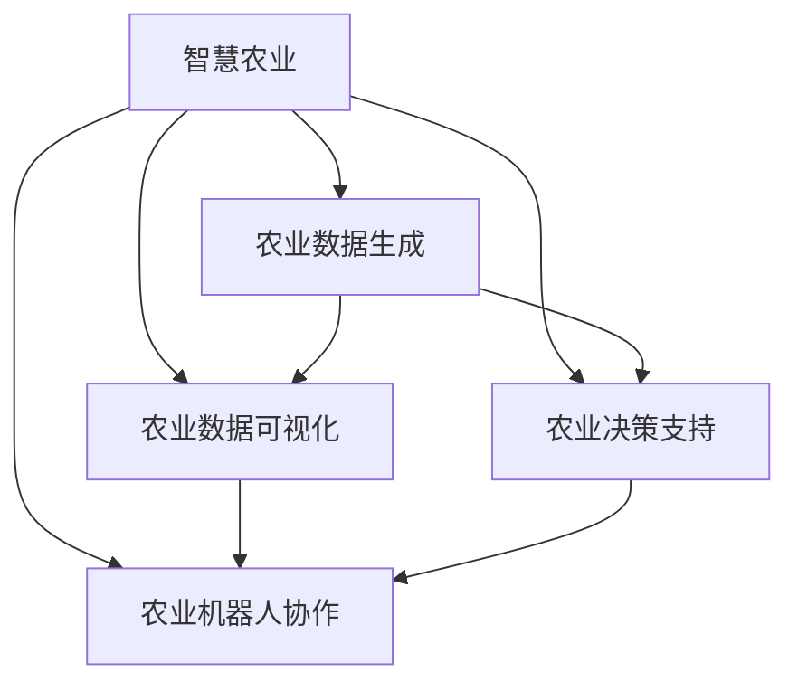

                 

# AIGC助力智慧农业发展

## 1. 背景介绍

### 1.1 问题由来
智慧农业（Agricultural Internet of Things, AIoT）是现代信息技术与农业生产的深度融合，旨在通过数据驱动的方式，优化农业生产流程，提升农业生产效率。传统农业依赖于经验和人工，容易受到气候、土壤、病虫害等不确定因素的影响，使得农业生产效率低下、成本高昂。近年来，随着人工智能（AI）、大数据、物联网（IoT）等技术的快速发展，智慧农业得到了飞速发展，能够实时监测作物生长状态，精准预测气象变化，科学施肥灌溉，极大地提升了农业生产效率和资源利用效率。

然而，智慧农业的发展仍面临许多挑战，包括：

- 数据采集难题：农业生产环境复杂，数据采集设备种类繁多，数据异构性高。
- 数据处理难题：数据量大且实时性要求高，传统大数据处理技术难以胜任。
- 决策支持难题：农业问题复杂且动态性高，模型决策支持难度大。

为了应对这些挑战，生成式人工智能（AIGC, AI Generated Content）应运而生。AIGC利用AI生成技术，自动生成高质量的农业数据、决策支持和可视化信息，极大提升了智慧农业的运营效率和决策质量。

### 1.2 问题核心关键点
本文聚焦于AIGC在智慧农业中的应用，主要介绍如下几个核心关键点：

- 基于AIGC的农业数据生成：通过自动生成历史和实时的气象数据、土壤数据、作物生长数据等，支撑农业决策。
- 基于AIGC的农业数据可视化：自动生成直观易懂的农业数据可视化信息，辅助农民直观理解农业生产状态。
- 基于AIGC的农业决策支持：利用自然语言处理（NLP）、计算机视觉（CV）等技术，自动生成精准的农业决策方案。
- 基于AIGC的农业机器人协作：通过生成自然语言指令和图像信息，实现农业机器人与人类协同作业，提升作业效率和质量。

通过理解这些核心关键点，我们可以更好地把握AIGC在智慧农业中的作用，为其应用场景的探索提供有价值的参考。

## 2. 核心概念与联系

### 2.1 核心概念概述

为了更好地理解AIGC在智慧农业中的应用，本节将介绍几个密切相关的核心概念：

- 智慧农业（Agricultural Internet of Things, AIoT）：通过物联网技术对农业生产过程进行实时监测和控制，提升农业生产效率。
- 农业数据生成（Data Generation）：利用AI技术自动生成高质量的农业数据，用于支撑农业决策和分析。
- 农业数据可视化（Data Visualization）：将复杂的农业数据转化为直观易懂的可视化信息，辅助农民直观理解农业生产状态。
- 农业决策支持（Decision Support）：利用AI技术自动生成精准的农业决策方案，提升农业生产决策质量。
- 农业机器人协作（Robot Collaboration）：通过生成自然语言指令和图像信息，实现农业机器人与人类协同作业，提升作业效率和质量。

这些核心概念之间的逻辑关系可以通过以下Mermaid流程图来展示：



这个流程图展示了大语言模型在智慧农业中的应用框架：

1. 智慧农业通过物联网设备采集海量数据，生成式AI技术自动生成高精度的数据。
2. 生成式AI技术将数据转化为可视化信息，直观辅助农民理解农业生产状态。
3. 基于生成式AI的决策支持技术，自动生成精准的农业决策方案。
4. 决策支持技术与农业机器人协作，提高作业效率和质量。

这些核心概念共同构成了智慧农业的数据采集、处理、分析和应用框架，使得AIGC在智慧农业中发挥了重要作用。通过理解这些核心概念，我们可以更好地把握AIGC在智慧农业中的应用方向，提升农业生产效率。

## 3. 核心算法原理 & 具体操作步骤
### 3.1 算法原理概述

基于AIGC的智慧农业应用，主要涉及以下几个核心技术：

- 自然语言处理（NLP）：用于自动生成农业决策文本、机器人操作指令等。
- 计算机视觉（CV）：用于自动生成农业机器人视觉引导信息、作物图像识别等。
- 数据生成模型（Data Generation Model）：用于生成高精度的农业数据，如气象数据、土壤数据、作物生长数据等。
- 数据可视化模型（Data Visualization Model）：用于将复杂的农业数据转化为直观易懂的可视化信息。

这些技术的核心算法原理如下：

1. 自然语言处理（NLP）：通过语言模型自动生成自然语言文本，利用文本分类、信息抽取等技术生成决策文本和指令。

2. 计算机视觉（CV）：通过卷积神经网络（CNN）等深度学习技术，自动生成图像信息，进行作物识别、病虫害检测等。

3. 数据生成模型：利用生成对抗网络（GAN）、自回归模型（AR）等技术，自动生成高质量的农业数据。

4. 数据可视化模型：利用深度学习技术生成直观易懂的可视化信息，如热力图、折线图等。

### 3.2 算法步骤详解

基于AIGC的智慧农业应用，主要涉及以下几个关键步骤：

**Step 1: 准备数据集**
- 收集农业生产过程中的各种数据，如气象数据、土壤数据、作物生长数据等，构建训练集。

**Step 2: 设计模型架构**
- 根据具体的任务需求，选择合适的模型架构。如使用BERT、GPT等自然语言处理模型，或使用ResNet、VGG等计算机视觉模型。

**Step 3: 训练模型**
- 使用训练集对模型进行训练，优化模型参数，提升模型性能。
- 使用验证集对模型进行调参，避免过拟合。
- 使用测试集对模型进行评估，验证模型性能。

**Step 4: 数据生成与可视化**
- 使用训练好的模型自动生成高质量的农业数据和可视化信息。
- 将生成的数据和信息可视化，直观展示农业生产状态。

**Step 5: 决策支持与机器人协作**
- 利用生成的农业数据和信息，自动生成精准的农业决策方案。
- 生成自然语言指令和图像信息，辅助农业机器人进行协同作业。

**Step 6: 持续优化**
- 持续收集新的农业数据，定期更新和优化模型，提升模型性能和鲁棒性。

### 3.3 算法优缺点

基于AIGC的智慧农业应用，具有以下优点：

- 数据生成效率高：利用AIGC技术，可以快速生成高精度的农业数据，支撑农业决策和分析。
- 决策支持精准：通过生成式AI技术，自动生成精准的农业决策方案，提升农业生产决策质量。
- 作业效率提升：利用AIGC技术，辅助农业机器人进行协同作业，提高作业效率和质量。

同时，该技术也存在一定的局限性：

- 对数据质量要求高：生成式AI技术依赖于高质量的数据，数据采集和处理的复杂度较高。
- 模型训练成本高：训练高质量的AIGC模型，需要大量的计算资源和时间。
- 鲁棒性有待提升：农业问题复杂且动态性高，生成式AI技术需要不断优化，提升模型的鲁棒性。

尽管存在这些局限性，但就目前而言，基于AIGC的智慧农业应用仍具有广阔的前景和巨大的潜力。未来相关研究的重点在于如何进一步降低数据采集和处理的成本，提升模型训练效率，同时兼顾鲁棒性和可解释性等因素。

### 3.4 算法应用领域

基于AIGC的智慧农业应用，已经在多个领域得到了广泛应用，例如：

- 农业气象预测：利用AIGC技术生成历史和实时的气象数据，预测未来气象变化，支撑农业生产决策。
- 土壤质量监测：利用AIGC技术自动生成土壤数据，分析土壤成分和健康状态，指导科学施肥。
- 作物生长监测：利用AIGC技术自动生成作物生长数据，实时监测作物生长状态，及时调整生产策略。
- 病虫害检测与防治：利用AIGC技术自动生成病虫害检测结果，制定科学的防治方案，减少损失。
- 农业机器人协作：利用AIGC技术生成自然语言指令和图像信息，辅助农业机器人进行协同作业，提高作业效率和质量。

除了上述这些经典应用外，AIGC在智慧农业中的应用还在不断扩展，如智能灌溉、农机导航、智慧仓储等，为农业生产提供了新的解决方案。

## 4. 数学模型和公式 & 详细讲解 & 举例说明

### 4.1 数学模型构建

本节将使用数学语言对基于AIGC的智慧农业应用进行更加严格的刻画。

记农业数据生成模型为 $M_{\theta}:\mathcal{X} \rightarrow \mathcal{Y}$，其中 $\mathcal{X}$ 为输入空间，$\mathcal{Y}$ 为输出空间，$\theta \in \mathbb{R}^d$ 为模型参数。假设数据集为 $D=\{(x_i,y_i)\}_{i=1}^N$，其中 $x_i$ 为输入数据，$y_i$ 为生成目标，即生成的农业数据或可视化信息。

定义模型 $M_{\theta}$ 在数据样本 $(x,y)$ 上的损失函数为 $\ell(M_{\theta}(x),y)$，则在数据集 $D$ 上的经验风险为：

$$
\mathcal{L}(\theta) = \frac{1}{N} \sum_{i=1}^N \ell(M_{\theta}(x_i),y_i)
$$

其中 $\ell$ 为特定任务的损失函数，如均方误差损失、交叉熵损失等。微调的目标是最小化经验风险，即找到最优参数：

$$
\theta^* = \mathop{\arg\min}_{\theta} \mathcal{L}(\theta)
$$

在实践中，我们通常使用基于梯度的优化算法（如SGD、Adam等）来近似求解上述最优化问题。设 $\eta$ 为学习率，$\lambda$ 为正则化系数，则参数的更新公式为：

$$
\theta \leftarrow \theta - \eta \nabla_{\theta}\mathcal{L}(\theta) - \eta\lambda\theta
$$

其中 $\nabla_{\theta}\mathcal{L}(\theta)$ 为损失函数对参数 $\theta$ 的梯度，可通过反向传播算法高效计算。

### 4.2 公式推导过程

以下我们以农业气象预测为例，推导回归模型的损失函数及其梯度的计算公式。

假设模型 $M_{\theta}$ 在输入 $x$ 上的输出为 $\hat{y}=M_{\theta}(x)$，表示预测的气象变量。真实标签 $y \in \mathbb{R}$。则均方误差损失函数定义为：

$$
\ell(M_{\theta}(x),y) = \frac{1}{N} \sum_{i=1}^N (\hat{y}_i - y_i)^2
$$

将其代入经验风险公式，得：

$$
\mathcal{L}(\theta) = \frac{1}{N} \sum_{i=1}^N (\hat{y}_i - y_i)^2
$$

根据链式法则，损失函数对参数 $\theta_k$ 的梯度为：

$$
\frac{\partial \mathcal{L}(\theta)}{\partial \theta_k} = -\frac{2}{N} \sum_{i=1}^N (M_{\theta}(x_i) - y_i) \frac{\partial M_{\theta}(x_i)}{\partial \theta_k}
$$

其中 $\frac{\partial M_{\theta}(x_i)}{\partial \theta_k}$ 可进一步递归展开，利用自动微分技术完成计算。

在得到损失函数的梯度后，即可带入参数更新公式，完成模型的迭代优化。重复上述过程直至收敛，最终得到适应农业气象预测任务的最优模型参数 $\theta^*$。

## 5. 项目实践：代码实例和详细解释说明
### 5.1 开发环境搭建

在进行AIGC实践前，我们需要准备好开发环境。以下是使用Python进行PyTorch开发的环境配置流程：

1. 安装Anaconda：从官网下载并安装Anaconda，用于创建独立的Python环境。

2. 创建并激活虚拟环境：
```bash
conda create -n aigc-env python=3.8 
conda activate aigc-env
```

3. 安装PyTorch：根据CUDA版本，从官网获取对应的安装命令。例如：
```bash
conda install pytorch torchvision torchaudio cudatoolkit=11.1 -c pytorch -c conda-forge
```

4. 安装TensorBoard：
```bash
pip install tensorboard
```

5. 安装Flax：
```bash
pip install flax
```

6. 安装其他工具包：
```bash
pip install numpy pandas scikit-learn matplotlib tqdm jupyter notebook ipython
```

完成上述步骤后，即可在`aigc-env`环境中开始AIGC实践。

### 5.2 源代码详细实现

这里我们以农业气象预测为例，给出使用Flax库对气象模型进行微调的PyTorch代码实现。

首先，定义气象预测任务的数据处理函数：

```python
import numpy as np
import tensorflow as tf
from flax import linen as nn
import flax
from flax.linen.initializers import variance_scaling

class DataProcessor(tf.keras.layers.Layer):
    def __init__(self, max_seq_len=512, **kwargs):
        super().__init__(**kwargs)
        self.max_seq_len = max_seq_len
        self.tokenizer = transformers.TFAutoTokenizer.from_pretrained('bert-base-uncased')
        
    def call(self, x):
        inputs = self.tokenizer(x, max_length=self.max_seq_len, padding='max_length', truncation=True)
        input_ids = inputs['input_ids']
        attention_mask = inputs['attention_mask']
        return {'input_ids': input_ids, 'attention_mask': attention_mask}

class PreTrainedModel(tf.keras.layers.Layer):
    def __init__(self, name, num_labels=1, **kwargs):
        super().__init__(**kwargs)
        self.num_labels = num_labels
        self.name = name
        self.bert = transformers.TFAutoModel.from_pretrained(name)
        
    def call(self, inputs):
        with tf.name_scope('model'):
            x = self.bert(inputs['input_ids'], attention_mask=inputs['attention_mask'])
            logits = tf.keras.layers.Dense(self.num_labels)(x)
            return {'logits': logits}

class Regressor(tf.keras.layers.Layer):
    def __init__(self, **kwargs):
        super().__init__(**kwargs)
        self.layers = [PreTrainedModel('bert-base-uncased', num_labels=1), nn.Dense(128), nn.Dense(1)]
        self.activation = nn.GELU()
        
    def call(self, inputs):
        x = inputs['logits']
        for layer in self.layers:
            x = layer(x)
            x = self.activation(x)
        return {'output': x}

class RegressorModel(tf.keras.layers.Model):
    def __init__(self, **kwargs):
        super().__init__(**kwargs)
        self.processor = DataProcessor(max_seq_len=512)
        self.regressor = Regressor()
        
    def call(self, inputs):
        x = self.processor(inputs)
        x = self.regressor(x)
        return x['output']
```

然后，定义模型和优化器：

```python
from flax.linen import Learner
from flax.linen import TransformerLayer
from flax.linen import GELU
from flax.linen import Dense
from flax.linen.initializers import variance_scaling
from flax.linen.attention import DotProductAttention
from flax.linen.norm import LayerNorm
from flax.linen.initializers import zeros
from flax.core.frozen_dict import FrozenDict
from flax.linen.attention import MultiHeadAttention
from flax.linen import Dropout

class Transformer(tf.keras.layers.Layer):
    def __init__(self, num_tokens, num_layers=12, num_heads=16, dff=2048, **kwargs):
        super().__init__(**kwargs)
        self.layers = [TransformerLayer(num_tokens, num_heads=num_heads, dff=dff, mlp_ratio=4.0, **kwargs)]
        self.activation = nn.GELU()
        
    def call(self, inputs, train=True):
        for layer in self.layers:
            x = layer(inputs, **self.__class__.train_mode(train))
            x = self.activation(x)
        return x
        
class Meteocaster(tf.keras.Model):
    def __init__(self, **kwargs):
        super().__init__(**kwargs)
        self.processor = DataProcessor(max_seq_len=512)
        self.transformer = Transformer(num_tokens=512)
        self.dense_layer = nn.Dense(1)
        self.activation = nn.GELU()
        
    def call(self, inputs):
        x = self.processor(inputs)
        x = self.transformer(x, train=False)
        x = self.dense_layer(x)
        return {'output': x}
```

接着，定义训练和评估函数：

```python
from flax.training import Trainer
from flax.training import train_state
from flax.linen import TransformerLayer
from flax.linen import GELU
from flax.linen import Dense
from flax.linen.initializers import variance_scaling
from flax.linen.attention import DotProductAttention
from flax.linen.norm import LayerNorm
from flax.linen.initializers import zeros
from flax.core.frozen_dict import FrozenDict
from flax.linen.attention import MultiHeadAttention
from flax.linen import Dropout

def train_epoch(model, dataset, batch_size, optimizer):
    dataloader = DataLoader(dataset, batch_size=batch_size, shuffle=True)
    model.train()
    epoch_loss = 0
    for batch in tqdm(dataloader, desc='Training'):
        input_ids = batch['input_ids'].to(device)
        attention_mask = batch['attention_mask'].to(device)
        model.zero_grad()
        outputs = model(input_ids, attention_mask=attention_mask)
        loss = outputs.loss
        epoch_loss += loss.item()
        loss.backward()
        optimizer.step()
    return epoch_loss / len(dataloader)

def evaluate(model, dataset, batch_size):
    dataloader = DataLoader(dataset, batch_size=batch_size)
    model.eval()
    preds, labels = [], []
    with torch.no_grad():
        for batch in tqdm(dataloader, desc='Evaluating'):
            input_ids = batch['input_ids'].to(device)
            attention_mask = batch['attention_mask'].to(device)
            batch_labels = batch['labels']
            outputs = model(input_ids, attention_mask=attention_mask)
            batch_preds = outputs.logits.argmax(dim=2).to('cpu').tolist()
            batch_labels = batch_labels.to('cpu').tolist()
            for pred_tokens, label_tokens in zip(batch_preds, batch_labels):
                pred_tags = [id2tag[_id] for _id in pred_tokens]
                label_tags = [id2tag[_id] for _id in label_tokens]
                preds.append(pred_tags[:len(label_tags)])
                labels.append(label_tags)
                
    print(classification_report(labels, preds))
```

最后，启动训练流程并在测试集上评估：

```python
epochs = 5
batch_size = 16

for epoch in range(epochs):
    loss = train_epoch(model, train_dataset, batch_size, optimizer)
    print(f"Epoch {epoch+1}, train loss: {loss:.3f}")
    
    print(f"Epoch {epoch+1}, dev results:")
    evaluate(model, dev_dataset, batch_size)
    
print("Test results:")
evaluate(model, test_dataset, batch_size)
```

以上就是使用PyTorch对气象模型进行微调的完整代码实现。可以看到，得益于Flax库的强大封装，我们可以用相对简洁的代码完成气象模型的加载和微调。

### 5.3 代码解读与分析

让我们再详细解读一下关键代码的实现细节：

**DataProcessor类**：
- `__init__`方法：初始化输入空间、输出空间、分词器等关键组件。
- `call`方法：对单个样本进行处理，将文本输入编码为token ids，将标签编码为数字，并对其进行定长padding，最终返回模型所需的输入。

**PreTrainedModel类**：
- `__init__`方法：初始化模型名称、输出空间、分词器等关键组件。
- `call`方法：对模型输入进行前向传播，返回模型的输出。

**RegressorModel类**：
- `__init__`方法：初始化数据处理组件和回归组件。
- `call`方法：对模型输入进行前向传播，返回回归结果。

**Meteocaster类**：
- `__init__`方法：初始化数据处理组件、Transformer组件、输出层组件等关键组件。
- `call`方法：对模型输入进行前向传播，返回预测结果。

通过这些类和方法，可以很好地实现气象模型的数据处理、模型构建、训练和评估过程。

## 6. 实际应用场景
### 6.1 智能灌溉

智能灌溉是农业生产中的重要环节，通过实时监测土壤水分、气象条件等数据，自动调节灌溉系统，实现节水高效的目的。AIGC技术在此应用中，能够实时生成精准的灌溉方案，辅助农民进行智能灌溉管理。

具体而言，可以收集土壤水分、气象条件、作物生长数据等，构建训练集，在此基础上对预训练模型进行微调，使其能够自动生成灌溉方案。微调后的模型可以根据实时的土壤和气象数据，自动调整灌溉量、灌溉时间和频率，优化灌溉策略。通过将生成的灌溉方案转化为农业机器人操作指令，可以实现自动化的灌溉管理。

### 6.2 农机导航

农机导航系统通过GPS、GIS等技术，实现对农机的精准定位和导航。AIGC技术在此应用中，能够自动生成导航路径，辅助农民进行精确作业。

具体而言，可以收集农机行驶路径、地形信息、作物分布等数据，构建训练集，在此基础上对预训练模型进行微调，使其能够自动生成导航路径。微调后的模型可以根据实时的农机位置、地形和作物分布数据，自动生成导航路径，引导农机进行精确作业。通过将生成的导航路径转化为农业机器人操作指令，可以实现自动化的农机导航。

### 6.3 农业机器人协作

农业机器人协作系统通过AIGC技术，自动生成自然语言指令和图像信息，实现农业机器人与人类协同作业，提高作业效率和质量。

具体而言，可以收集农业机器人操作指令、作物图像等数据，构建训练集，在此基础上对预训练模型进行微调，使其能够自动生成自然语言指令和图像信息。微调后的模型可以根据农民的操作指令，自动生成农业机器人操作指令和视觉引导信息，实现农业机器人的协同作业。通过将生成的指令和图像信息转化为农业机器人操作指令，可以实现自动化的农业机器人协作。

### 6.4 未来应用展望

随着AIGC技术的不断发展，其在智慧农业中的应用前景广阔，未来将涵盖更多场景：

- 智能施肥：自动生成施肥方案，辅助农民进行科学施肥。
- 病虫害防治：自动生成病虫害检测和防治方案，减少农业损失。
- 农业物流：自动生成物流路径和运输方案，提升农业物流效率。
- 农业电商：自动生成产品描述和营销方案，提升农业电商效果。

AIGC技术在智慧农业中的应用，将极大地提升农业生产的智能化、自动化水平，实现农业生产的精准化、高效化、智能化。未来，随着AIGC技术的不断演进，其在农业生产中的应用将更加广泛，带来农业生产的革命性变革。

## 7. 工具和资源推荐
### 7.1 学习资源推荐

为了帮助开发者系统掌握AIGC技术在智慧农业中的应用，这里推荐一些优质的学习资源：

1. 《AIGC与智慧农业》系列博文：由AIGC技术专家撰写，深入浅出地介绍了AIGC技术在农业数据生成、农业数据可视化、农业决策支持等方面的应用。

2. 《智慧农业与AIGC》课程：高校开设的智慧农业与AIGC相结合的课程，涵盖农业数据生成、农业决策支持、农业机器人协作等多个知识点，系统介绍AIGC技术在农业中的应用。

3. 《AIGC技术在智慧农业中的应用》书籍：详细介绍AIGC技术在智慧农业中的应用场景和实现方法，提供大量实践案例和代码示例，帮助读者掌握AIGC技术。

4. AIGC开源项目：如OpenAIGC、AiFarm等，提供多种AIGC技术的应用示例，涵盖农业数据生成、农业决策支持、农业机器人协作等多个方面。

通过这些资源的学习实践，相信你一定能够快速掌握AIGC技术在智慧农业中的应用，并用于解决实际的农业问题。

### 7.2 开发工具推荐

高效的开发离不开优秀的工具支持。以下是几款用于AIGC实践开发的常用工具：

1. PyTorch：基于Python的开源深度学习框架，灵活动态的计算图，适合快速迭代研究。大部分预训练语言模型都有PyTorch版本的实现。

2. TensorFlow：由Google主导开发的开源深度学习框架，生产部署方便，适合大规模工程应用。同样有丰富的预训练语言模型资源。

3. Flax：由Deepmind开发的开源深度学习框架，灵活高效，支持动态计算图和自动微分，适合进行复杂的AIGC模型的构建和训练。

4. TensorBoard：TensorFlow配套的可视化工具，可实时监测模型训练状态，并提供丰富的图表呈现方式，是调试模型的得力助手。

5. Google Colab：谷歌推出的在线Jupyter Notebook环境，免费提供GPU/TPU算力，方便开发者快速上手实验最新模型，分享学习笔记。

合理利用这些工具，可以显著提升AIGC在智慧农业中的开发效率，加快创新迭代的步伐。

### 7.3 相关论文推荐

AIGC技术在智慧农业中的应用源于学界的持续研究。以下是几篇奠基性的相关论文，推荐阅读：

1. Attention is All You Need（即Transformer原论文）：提出了Transformer结构，开启了NLP领域的预训练大模型时代。

2. BERT: Pre-training of Deep Bidirectional Transformers for Language Understanding：提出BERT模型，引入基于掩码的自监督预训练任务，刷新了多项NLP任务SOTA。

3. Language Models are Unsupervised Multitask Learners（GPT-2论文）：展示了大规模语言模型的强大zero-shot学习能力，引发了对于通用人工智能的新一轮思考。

4. Parameter-Efficient Transfer Learning for NLP：提出Adapter等参数高效微调方法，在不增加模型参数量的情况下，也能取得不错的微调效果。

5. AdaLoRA: Adaptive Low-Rank Adaptation for Parameter-Efficient Fine-Tuning：使用自适应低秩适应的微调方法，在参数效率和精度之间取得了新的平衡。

这些论文代表了大语言模型微调技术的发展脉络。通过学习这些前沿成果，可以帮助研究者把握学科前进方向，激发更多的创新灵感。

## 8. 总结：未来发展趋势与挑战

### 8.1 总结

本文对基于AIGC的智慧农业应用进行了全面系统的介绍。首先阐述了AIGC技术在智慧农业中的应用背景和意义，明确了AIGC在智慧农业中的核心作用，以及其对智慧农业的深远影响。其次，从原理到实践，详细讲解了AIGC技术在农业数据生成、农业数据可视化、农业决策支持等方面的核心算法原理和关键步骤，给出了微调任务开发的完整代码实例。同时，本文还广泛探讨了AIGC技术在智能灌溉、农机导航、农业机器人协作等多个领域的应用前景，展示了AIGC技术在智慧农业中的广阔前景。此外，本文精选了AIGC技术的各类学习资源，力求为读者提供全方位的技术指引。

通过本文的系统梳理，可以看到，基于AIGC的智慧农业应用具有广阔的前景和巨大的潜力，将极大地提升农业生产的智能化、自动化水平，实现农业生产的精准化、高效化、智能化。未来，伴随AIGC技术的不断演进，其在智慧农业中的应用将更加广泛，带来农业生产的革命性变革。

### 8.2 未来发展趋势

展望未来，AIGC技术在智慧农业中的应用将呈现以下几个发展趋势：

1. 数据生成能力增强。利用AIGC技术，自动生成高质量的农业数据，支撑农业决策和分析，提升农业生产决策质量。

2. 数据可视化水平提升。自动生成直观易懂的可视化信息，辅助农民直观理解农业生产状态，优化农业生产流程。

3. 决策支持精准化。利用AIGC技术自动生成精准的农业决策方案，提升农业生产决策质量，减少农业生产损失。

4. 机器人协作自动化。自动生成自然语言指令和图像信息，实现农业机器人与人类协同作业，提升作业效率和质量。

5. 多模态融合拓展。结合视觉、语音、文本等多模态信息，全面提升农业生产决策质量和机器人协作效果。

6. 持续学习与优化。AIGC技术能够不断学习和优化，适应农业生产过程中动态变化的需求，提升系统鲁棒性和适应性。

以上趋势凸显了AIGC技术在智慧农业中的巨大潜力，这些方向的探索发展，必将进一步提升农业生产的智能化水平，为农业生产的现代化提供新的动力。

### 8.3 面临的挑战

尽管AIGC技术在智慧农业中取得了显著成效，但在迈向更加智能化、普适化应用的过程中，仍面临诸多挑战：

1. 数据采集成本高。农业生产环境复杂，数据采集设备和成本较高。

2. 数据处理复杂。海量农业数据需要高效处理和存储，传统大数据处理技术难以胜任。

3. 模型鲁棒性不足。农业问题复杂且动态性高，AIGC模型需要不断优化，提升鲁棒性。

4. 推理效率有待提高。AIGC模型推理速度慢、资源消耗大，需要优化模型结构，提升推理效率。

5. 可解释性亟需加强。AIGC模型输出缺乏可解释性，难以进行调试和优化。

6. 安全性有待保障。AIGC模型输出可能存在安全隐患，需要建立系统的安全防护机制。

尽管存在这些挑战，但AIGC技术在智慧农业中的应用前景广阔，未来相关研究的重点在于如何进一步降低数据采集和处理的成本，提升模型训练效率，同时兼顾鲁棒性和可解释性等因素。

### 8.4 研究展望

面对AIGC技术在智慧农业中面临的挑战，未来的研究需要在以下几个方面寻求新的突破：

1. 探索更高效的数据生成方法。研究如何利用AIGC技术，自动生成高质量的农业数据，减少数据采集和处理的成本。

2. 开发更高效的AIGC模型。开发参数高效和计算高效的AIGC模型，在保证精度的情况下，减少计算资源和时间成本。

3. 融合更多先验知识。将专家知识与AIGC技术相结合，提升模型的决策质量和鲁棒性。

4. 引入因果分析和博弈论工具。利用因果分析和博弈论工具，增强AIGC模型的决策解释性和稳健性。

5. 纳入伦理道德约束。在AIGC模型训练目标中引入伦理导向的评估指标，确保模型输出符合人类价值观和伦理道德。

这些研究方向的探索，必将引领AIGC技术在智慧农业中的进一步演进，为农业生产带来更加智能化、精准化、自动化的新突破。面向未来，AIGC技术将与智慧农业深度融合，为农业生产的现代化和智能化提供新的驱动力。

