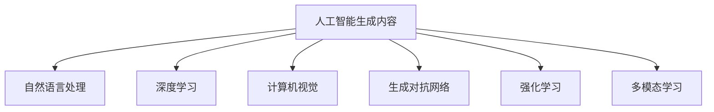

                 

# AIGC在软件与消费电子中的应用

## 1. 背景介绍

人工智能生成内容（AIGC，Artificial Intelligence Generated Content）指的是使用人工智能技术自动生成各种形式的内容，包括文本、图像、音频、视频等。近年来，随着深度学习、自然语言处理、计算机视觉等技术的发展，AIGC在软件与消费电子领域的应用逐渐深入，正在从边缘逐渐走向主流。

### 1.1 问题由来

在软件与消费电子领域，AIGC技术能够提供丰富的功能和服务，为产品开发和用户体验带来显著的提升。然而，传统的手工开发方式成本高、周期长，难以快速响应市场变化和用户需求。AIGC技术的出现，大大降低了内容生成的时间与成本，使得软件与消费电子产品的迭代速度更快，创新能力更强。

### 1.2 问题核心关键点

AIGC技术在软件与消费电子领域的应用，主要集中在以下几个关键点：

- **智能推荐**：通过用户行为分析，生成个性化的推荐内容，提升用户体验。
- **虚拟形象**：生成虚拟形象、虚拟助手等，丰富产品功能。
- **互动对话**：自动生成与用户的对话内容，增强产品互动性。
- **内容生成**：自动生成产品文档、说明书、广告文案等，提高内容生产效率。
- **图像生成**：自动生成产品广告、图标、背景等，美化界面设计。

这些关键点通过AIGC技术的应用，能够显著提升软件与消费电子产品的功能性和用户体验，为产品开发提供新的思路和方向。

## 2. 核心概念与联系

### 2.1 核心概念概述

为了更好地理解AIGC在软件与消费电子中的应用，本节将介绍几个密切相关的核心概念：

- **人工智能生成内容（AIGC）**：使用人工智能技术自动生成的各种形式的内容，包括文本、图像、音频、视频等。
- **自然语言处理（NLP）**：研究计算机如何处理、理解和生成自然语言的技术，是AIGC技术的重要组成部分。
- **深度学习（DL）**：使用多层神经网络进行数据建模和预测的机器学习技术，AIGC技术中常用的生成模型（如GPT、GAN）均基于深度学习框架。
- **计算机视觉（CV）**：研究如何让计算机理解、解释和利用图像和视频数据的领域，与AIGC中的图像生成密切相关。
- **生成对抗网络（GAN）**：一种基于对抗性训练的深度学习模型，可以生成高质量的图像、音频等，是AIGC中图像、音频生成技术的重要基础。
- **强化学习（RL）**：研究如何让机器通过与环境互动，逐步学习最优决策策略的领域，与AIGC中的推荐系统、对话系统有关。
- **多模态学习**：研究如何整合和利用不同模态数据（如文本、图像、音频）进行深度学习建模，AIGC中的虚拟形象生成、视频生成等均涉及多模态学习。

这些核心概念之间的逻辑关系可以通过以下Mermaid流程图来展示：



这个流程图展示了大语言模型的工作原理和与AIGC技术的关联：

1. AIGC通过自然语言处理（NLP）、深度学习（DL）、计算机视觉（CV）等技术，自动生成各种形式的内容。
2. GAN和强化学习（RL）用于图像、音频、视频等内容的生成。
3. 多模态学习整合多种模态数据，提升生成内容的丰富度和准确性。

## 3. 核心算法原理 & 具体操作步骤

### 3.1 算法原理概述

AIGC在软件与消费电子中的应用，主要基于以下几个核心算法原理：

- **语言模型**：通过预训练语言模型，学习文本数据中的语言规律，生成自然流畅的文本内容。
- **生成对抗网络（GAN）**：使用GAN生成高质量的图像、音频等，提供丰富的视觉和听觉内容。
- **变分自编码器（VAE）**：通过VAE生成具有较高重构质量的图像，用于文本图像的自动生成。
- **自然语言生成（NLG）**：基于NLP技术生成符合语法和语义规范的文本内容。
- **多模态融合**：整合文本、图像、音频等多种模态数据，提升生成内容的丰富性和表现力。

这些算法通过深度学习框架实现，能够在大规模数据上进行训练，生成高质量的AIGC内容。

### 3.2 算法步骤详解

基于AIGC技术在软件与消费电子中的应用，我们可以详细描述其算法步骤：

**Step 1: 数据准备**
- 收集软件与消费电子相关的文本、图像、音频等多模态数据。
- 对数据进行预处理，如文本分词、图像去噪、音频降噪等。

**Step 2: 模型选择与训练**
- 选择合适的深度学习模型，如BERT、GPT、GAN等。
- 对模型进行预训练，如使用大规模无标签文本数据训练语言模型。
- 在特定任务上微调模型，如使用标注数据训练生成对抗网络生成高质量图像。

**Step 3: 内容生成**
- 使用训练好的模型，自动生成软件与消费电子相关的文本、图像、音频等。
- 对生成的内容进行后处理，如文本校对、图像优化等。

**Step 4: 集成与应用**
- 将生成的AIGC内容集成到软件与消费电子产品中。
- 测试并优化AIGC功能，确保其在实际应用中的效果和稳定性。

### 3.3 算法优缺点

AIGC技术在软件与消费电子中的应用，具有以下优点：

- **高效便捷**：自动生成内容，大幅度降低内容生产的成本和时间。
- **灵活多样**：生成各种形式的内容，提升产品的丰富度和多样性。
- **个性化**：通过用户行为分析，生成个性化的内容，提升用户体验。
- **动态调整**：能够根据用户反馈和市场需求，快速调整内容生成策略。

同时，AIGC技术也存在以下局限：

- **数据依赖**：依赖于大量的标注数据，数据质量对生成效果有较大影响。
- **生成质量**：生成的内容质量受限于模型和训练数据，存在一定的局限性。
- **伦理风险**：生成内容可能存在误导、侵权等问题，需要关注伦理和安全问题。
- **性能消耗**：生成高质量内容需要较大的计算资源，可能导致性能瓶颈。

### 3.4 算法应用领域

AIGC技术在软件与消费电子领域的应用广泛，以下是几个典型的应用场景：

- **智能推荐**：基于用户行为数据，生成个性化的商品、内容推荐，提升用户体验。
- **虚拟形象**：生成虚拟形象、虚拟助手等，提供交互式服务。
- **互动对话**：自动生成对话内容，增强产品互动性。
- **内容生成**：自动生成产品文档、说明书、广告文案等，提高内容生产效率。
- **图像生成**：自动生成产品广告、图标、背景等，美化界面设计。
- **视频生成**：自动生成产品视频内容，丰富多媒体表现形式。

## 4. 数学模型和公式 & 详细讲解 & 举例说明

### 4.1 数学模型构建

AIGC技术在软件与消费电子中的应用，主要基于以下几个数学模型：

- **语言模型**：基于n-gram模型、Transformer模型等，学习文本数据的语言规律。
- **生成对抗网络（GAN）**：基于GAN模型，生成高质量的图像、音频等。
- **变分自编码器（VAE）**：基于VAE模型，生成具有较高重构质量的图像。
- **自然语言生成（NLG）**：基于RNN、LSTM等模型，生成符合语法和语义规范的文本内容。

### 4.2 公式推导过程

以生成对抗网络（GAN）为例，详细推导其生成过程。

假设生成模型为 $G$，判别模型为 $D$，目标函数为：

$$
L(G,D) = E_{\text{data}}[D(G(z))] + E_{z}[\log D(G(z))]
$$

其中 $z$ 为随机噪声，目标函数包含两个部分：
1. 生成器 $G$ 能够生成与真实数据分布接近的伪样本。
2. 判别器 $D$ 能够区分真实数据和伪样本。

生成器的损失函数为：

$$
L_G = E_{z}[\log D(G(z))]
$$

判别器的损失函数为：

$$
L_D = E_{\text{data}}[D(G(z))] + E_{z}[log(1 - D(G(z)))]
$$

通过交替优化生成器和判别器，使得生成器生成的样本能够通过判别器的鉴别，同时判别器也能准确区分真实数据和伪样本。最终生成的样本即为AIGC应用中的高质量图像、音频等。

### 4.3 案例分析与讲解

以虚拟形象生成为例，使用GAN技术自动生成虚拟形象。

1. **数据准备**：收集大量的虚拟形象数据，如人脸图像、身体姿态、表情等。
2. **模型训练**：使用GAN模型，将真人图像和虚拟形象数据进行混合训练。
3. **内容生成**：根据用户需求，输入文本描述，生成对应的虚拟形象图像。
4. **后处理**：对生成的图像进行优化，如细节处理、色彩调整等，提升生成效果。

通过虚拟形象生成技术，可以应用于虚拟助手、虚拟主播、虚拟偶像等场景，提供更加自然、个性化的服务。

## 5. 项目实践：代码实例和详细解释说明

### 5.1 开发环境搭建

在进行AIGC项目实践前，我们需要准备好开发环境。以下是使用Python进行PyTorch开发的环境配置流程：

1. 安装Anaconda：从官网下载并安装Anaconda，用于创建独立的Python环境。

2. 创建并激活虚拟环境：
```bash
conda create -n aigc-env python=3.8 
conda activate aigc-env
```

3. 安装PyTorch：根据CUDA版本，从官网获取对应的安装命令。例如：
```bash
conda install pytorch torchvision torchaudio cudatoolkit=11.1 -c pytorch -c conda-forge
```

4. 安装其他相关库：
```bash
pip install transformers torchtext numpy pandas scikit-learn matplotlib tqdm jupyter notebook ipython
```

完成上述步骤后，即可在`aigc-env`环境中开始AIGC项目实践。

### 5.2 源代码详细实现

下面我们以生成对抗网络（GAN）在图像生成中的应用为例，给出使用PyTorch实现的代码。

首先，定义GAN的生成器和判别器模型：

```python
import torch.nn as nn
import torch.nn.functional as F

class Generator(nn.Module):
    def __init__(self):
        super(Generator, self).__init__()
        self.fc1 = nn.Linear(100, 256)
        self.fc2 = nn.Linear(256, 256)
        self.fc3 = nn.Linear(256, 784)
        self.upsample = nn.Upsample(scale_factor=2, mode='nearest')
        self.deconv = nn.ConvTranspose2d(256, 128, 4, stride=2, padding=1)
        self.conv = nn.Conv2d(128, 1, 4, padding=1)
        
    def forward(self, x):
        x = self.fc1(x)
        x = F.leaky_relu(x)
        x = self.fc2(x)
        x = F.leaky_relu(x)
        x = self.fc3(x).view(-1, 1, 28, 28)
        x = self.upsample(x)
        x = self.deconv(x)
        x = F.leaky_relu(x)
        x = self.conv(x)
        return F.tanh(x)
        
class Discriminator(nn.Module):
    def __init__(self):
        super(Discriminator, self).__init__()
        self.conv1 = nn.Conv2d(1, 64, 4, padding=1)
        self.conv2 = nn.Conv2d(64, 128, 4, stride=2, padding=1)
        self.conv3 = nn.Conv2d(128, 256, 4, stride=2, padding=1)
        self.fc1 = nn.Linear(256, 128)
        self.fc2 = nn.Linear(128, 1)
        
    def forward(self, x):
        x = F.leaky_relu(self.conv1(x))
        x = F.leaky_relu(self.conv2(x))
        x = F.leaky_relu(self.conv3(x))
        x = x.view(-1, 256)
        x = F.leaky_relu(self.fc1(x))
        x = F.sigmoid(self.fc2(x))
        return x
```

然后，定义损失函数和优化器：

```python
from torch.optim import Adam

def calc_loss(G, D, real_data, fake_data):
    D_real = D(real_data).mean()
    D_fake = D(fake_data).mean()
    G_loss = G.loss(fake_data)
    D_loss = D_loss = D_loss + D_real + D_fake
    return G_loss, D_loss

G = Generator()
D = Discriminator()
G_loss = D_loss = 0.0
optimizer_G = optimizer_D = Adam([{'params': G.parameters()}, {'params': D.parameters()}], lr=0.0002)

real_data = torch.randn(128, 1, 28, 28)
fake_data = G(torch.randn(128, 100))
G_loss, D_loss = calc_loss(G, D, real_data, fake_data)
```

最后，启动训练流程：

```python
epochs = 100
for epoch in range(epochs):
    G_loss, D_loss = calc_loss(G, D, real_data, fake_data)
    optimizer_G.zero_grad()
    G_loss.backward()
    optimizer_G.step()
    optimizer_D.zero_grad()
    D_loss.backward()
    optimizer_D.step()
```

以上就是使用PyTorch实现GAN生成图像的完整代码实现。可以看到，通过修改生成器和判别器的结构，并设置合适的损失函数和优化器，可以轻松实现图像生成。

### 5.3 代码解读与分析

让我们再详细解读一下关键代码的实现细节：

**Generator类**：
- `__init__`方法：定义生成器模型结构，包括全连接层、卷积层、上采样层等。
- `forward`方法：定义生成器前向传播的计算过程。

**Discriminator类**：
- `__init__`方法：定义判别器模型结构，包括卷积层、全连接层等。
- `forward`方法：定义判别器前向传播的计算过程。

**calc_loss函数**：
- 定义损失函数，计算生成器和判别器的损失。
- 使用Adam优化器进行参数更新。

**训练流程**：
- 定义总的epoch数，进行循环迭代。
- 在每个epoch内，计算生成器和判别器的损失。
- 使用优化器更新模型参数。

可以看到，PyTorch库提供的强大框架，使得实现GAN生成图像的代码非常简洁高效。开发者可以根据具体需求，修改生成器和判别器的结构，并调整损失函数和优化器的参数，实现不同形式的AIGC应用。

## 6. 实际应用场景

### 6.1 智能推荐

智能推荐系统是AIGC在软件与消费电子领域的重要应用之一。通过AIGC技术，智能推荐系统可以生成个性化的推荐内容，提升用户体验。

1. **数据准备**：收集用户的历史行为数据，如浏览记录、购买记录等。
2. **模型训练**：使用自然语言处理技术，提取用户的行为特征，并训练推荐模型。
3. **内容生成**：根据用户行为特征，生成个性化的商品、内容推荐。
4. **效果评估**：测试并优化推荐系统的效果，确保其准确性和实时性。

智能推荐系统能够广泛应用于电商、视频、新闻等平台，提升用户粘性和转化率。

### 6.2 虚拟形象

虚拟形象生成技术可以应用于虚拟助手、虚拟主播、虚拟偶像等场景，提供更加自然、个性化的服务。

1. **数据准备**：收集大量的虚拟形象数据，如人脸图像、身体姿态、表情等。
2. **模型训练**：使用生成对抗网络（GAN）模型，将真人图像和虚拟形象数据进行混合训练。
3. **内容生成**：根据用户需求，输入文本描述，生成对应的虚拟形象图像。
4. **后处理**：对生成的图像进行优化，如细节处理、色彩调整等，提升生成效果。

虚拟形象技术可以应用于智能家居、娱乐、教育等多个领域，提供更加互动、个性化的体验。

### 6.3 互动对话

互动对话系统是AIGC技术的另一重要应用场景。通过AIGC技术，互动对话系统可以自动生成对话内容，增强产品的互动性。

1. **数据准备**：收集大量的对话数据，如客户服务记录、聊天机器人记录等。
2. **模型训练**：使用自然语言处理技术，训练对话生成模型。
3. **内容生成**：根据用户输入，自动生成对应的回复内容。
4. **效果评估**：测试并优化对话系统的性能，确保其流畅性和准确性。

互动对话系统可以应用于智能客服、智能家居、虚拟助手等多个场景，提升用户体验。

### 6.4 内容生成

内容生成技术可以自动生成产品文档、说明书、广告文案等，提高内容生产效率。

1. **数据准备**：收集大量的文本数据，如产品说明书、广告文案等。
2. **模型训练**：使用自然语言生成技术，训练内容生成模型。
3. **内容生成**：根据产品信息，自动生成对应的文档、说明书、广告文案等。
4. **效果评估**：测试并优化内容生成系统的性能，确保其准确性和可读性。

内容生成技术可以应用于智能制造、电商平台、市场营销等多个领域，提升内容生产效率和质量。

## 7. 工具和资源推荐

### 7.1 学习资源推荐

为了帮助开发者系统掌握AIGC理论基础和实践技巧，这里推荐一些优质的学习资源：

1. **《深度学习》**：Ian Goodfellow、Yoshua Bengio和Aaron Courville合著的经典书籍，全面介绍了深度学习的基本概念和前沿技术。
2. **Coursera深度学习课程**：由斯坦福大学Andrew Ng教授主讲的深度学习课程，涵盖深度学习的基本原理和实践。
3. **NLP专题教程**：斯坦福大学CS224N课程，涵盖自然语言处理的基本概念和前沿技术。
4. **GAN基础与实践**：Coursera上的GAN课程，涵盖生成对抗网络的基本原理和实践。
5. **PyTorch官方文档**：PyTorch官方文档，提供了丰富的代码示例和详细的使用指南。

通过对这些资源的学习实践，相信你一定能够快速掌握AIGC的精髓，并用于解决实际的NLP问题。

### 7.2 开发工具推荐

高效的开发离不开优秀的工具支持。以下是几款用于AIGC开发的常用工具：

1. **PyTorch**：基于Python的开源深度学习框架，灵活动态的计算图，适合快速迭代研究。
2. **TensorFlow**：由Google主导开发的开源深度学习框架，生产部署方便，适合大规模工程应用。
3. **JAX**：基于Python的自动微分和机器学习库，支持高效的矩阵运算和优化。
4. **PyTorch Lightning**：基于PyTorch的高性能深度学习库，支持快速的模型训练和部署。
5. **TransformerX**：面向工业界的深度学习框架，支持高效的模型训练和推理。

合理利用这些工具，可以显著提升AIGC任务的开发效率，加快创新迭代的步伐。

### 7.3 相关论文推荐

AIGC技术的发展源于学界的持续研究。以下是几篇奠基性的相关论文，推荐阅读：

1. **Attention is All You Need**：提出了Transformer模型，开启了深度学习在自然语言处理领域的应用。
2. **Generative Adversarial Nets**：提出了生成对抗网络（GAN）模型，为图像、音频、视频等生成内容提供了新思路。
3. **Conditional Generative Adversarial Nets**：提出了条件生成对抗网络（cGAN）模型，提高了生成内容的针对性和多样性。
4. **Variational Autoencoders**：提出了变分自编码器（VAE）模型，用于生成高质量的图像和文本内容。
5. **Natural Language Generation**：介绍了自然语言生成（NLG）技术的最新进展，涵盖了基于神经网络、逻辑规则、模板生成等多种方法。

这些论文代表了大语言模型微调技术的发展脉络。通过学习这些前沿成果，可以帮助研究者把握学科前进方向，激发更多的创新灵感。

## 8. 总结：未来发展趋势与挑战

### 8.1 研究成果总结

本文对AIGC技术在软件与消费电子领域的应用进行了全面系统的介绍。首先阐述了AIGC技术的研究背景和应用前景，明确了其在智能推荐、虚拟形象、互动对话、内容生成等方面的独特价值。其次，从原理到实践，详细讲解了AIGC的算法原理和关键步骤，给出了AIGC任务开发的完整代码实例。同时，本文还广泛探讨了AIGC技术在软件与消费电子领域的应用前景，展示了AIGC范式的巨大潜力。

通过本文的系统梳理，可以看到，AIGC技术正在成为软件与消费电子领域的重要范式，极大地拓展了产品功能和用户体验，为产品开发提供新的思路和方向。

### 8.2 未来发展趋势

展望未来，AIGC技术在软件与消费电子领域的应用将呈现以下几个发展趋势：

1. **多模态融合**：整合文本、图像、音频等多种模态数据，提升生成内容的丰富性和表现力。
2. **跨领域应用**：拓展AIGC技术在医疗、教育、金融等多个领域的应用，为各行各业带来变革性影响。
3. **个性化推荐**：通过深度学习技术，生成更加个性化的推荐内容，提升用户体验。
4. **虚拟形象生成**：利用生成对抗网络（GAN）技术，生成高质量的虚拟形象，提供更加互动、个性化的服务。
5. **智能对话**：使用自然语言处理技术，自动生成对话内容，增强产品的互动性。
6. **内容生成**：通过自然语言生成（NLG）技术，生成高质量的产品文档、说明书、广告文案等，提高内容生产效率。

以上趋势凸显了AIGC技术在软件与消费电子领域的广阔前景。这些方向的探索发展，必将进一步提升产品的智能化水平，为软件与消费电子行业带来新的发展机遇。

### 8.3 面临的挑战

尽管AIGC技术已经取得了瞩目成就，但在迈向更加智能化、普适化应用的过程中，它仍面临着诸多挑战：

1. **数据依赖**：依赖于大量的标注数据，数据质量对生成效果有较大影响。
2. **生成质量**：生成的内容质量受限于模型和训练数据，存在一定的局限性。
3. **伦理风险**：生成内容可能存在误导、侵权等问题，需要关注伦理和安全问题。
4. **性能消耗**：生成高质量内容需要较大的计算资源，可能导致性能瓶颈。

### 8.4 研究展望

面对AIGC技术面临的挑战，未来的研究需要在以下几个方面寻求新的突破：

1. **数据增强**：通过数据增强技术，提升AIGC模型的泛化能力和鲁棒性。
2. **模型优化**：开发更加参数高效和计算高效的AIGC模型，提升生成速度和资源利用率。
3. **伦理规范**：引入伦理规范和安全机制，确保AIGC内容的安全性和可解释性。
4. **多领域应用**：将AIGC技术应用于更多的行业和领域，提升各行业的工作效率和智能化水平。

这些研究方向的探索，必将引领AIGC技术迈向更高的台阶，为软件与消费电子行业带来新的突破和机遇。

## 9. 附录：常见问题与解答

**Q1：如何选择合适的深度学习框架？**

A: 选择深度学习框架主要考虑以下几个因素：
1. 框架的易用性和学习曲线。如TensorFlow、PyTorch较为流行，适合新手入门。
2. 框架的性能和扩展性。如TensorFlow支持分布式训练，适用于大规模工程应用。
3. 社区支持和文档质量。如PyTorch社区活跃，文档详细，易于学习和调试。

**Q2：如何优化深度学习模型的性能？**

A: 优化深度学习模型的性能主要通过以下几个方面：
1. 调整学习率。选择合适的学习率，避免过拟合和欠拟合。
2. 使用正则化技术。如L2正则、Dropout等，防止模型过度适应数据。
3. 采用模型剪枝和量化技术。减少模型参数量，提高推理效率。
4. 使用GPU或TPU等高性能设备。加速模型训练和推理过程。
5. 使用分布式训练。提高训练速度和模型性能。

**Q3：如何处理数据不平衡问题？**

A: 数据不平衡问题主要通过以下几个方法解决：
1. 数据增强。如对少数类数据进行扩充，增加其多样性。
2. 重采样。如对少数类数据进行过采样，或对多数类数据进行欠采样。
3. 生成对抗网络（GAN）。通过生成对抗网络，生成高质量的合成数据，提升少数类数据的数量。

**Q4：如何评估生成内容的性能？**

A: 评估生成内容的性能主要通过以下几个指标：
1. 生成质量。如清晰度、真实性、多样性等，使用模型评估方法或人工评估方法进行评估。
2. 生成速度。如推理时间、训练时间等，评估模型的计算效率。
3. 生成鲁棒性。如对抗样本攻击、数据扰动等，评估模型的鲁棒性和稳定性。
4. 用户满意度。如用户反馈、使用率等，评估生成内容对用户的实际价值。

这些指标可以帮助评估和优化AIGC模型的性能，确保其在实际应用中的效果和稳定性。

---

作者：禅与计算机程序设计艺术 / Zen and the Art of Computer Programming

