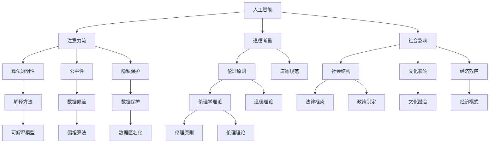

                 

# AI与人类注意力流：未来的道德和社会考虑

> 关键词：人工智能,注意力流,道德考量,社会影响,算法透明性,公平性,隐私保护

## 1. 背景介绍

### 1.1 问题由来

随着人工智能(AI)技术的快速发展，其在医疗、教育、金融等诸多领域的应用已初见成效。然而，随之而来的道德、社会问题也愈发突出。特别是在AI与人类的交互过程中，注意力流(Attention Flow)现象，即AI系统如何分配和引导人类注意力，引发了广泛的讨论与担忧。

AI的注意力流涉及AI如何理解并引导人类的输入与输出，如何处理和利用信息，以及其决策依据。这一过程不仅影响着AI的性能和效率，也牵涉到隐私、公平、安全等伦理道德问题。

### 1.2 问题核心关键点

注意力流现象的核心关键点包括：

1. **数据依赖性**：AI的注意力流高度依赖于输入数据的质量和数量，数据偏差会影响AI的决策和输出。
2. **可解释性**：AI系统缺乏透明度，人类难以理解其决策过程，可能导致决策误判或偏见。
3. **隐私保护**：AI在处理个人数据时，需确保数据隐私安全，避免数据泄露或滥用。
4. **公平性**：AI系统需确保对所有用户公平无偏，避免基于种族、性别、年龄等因素的歧视。
5. **安全性**：AI系统的输出需确保不会对用户或社会造成直接或间接的伤害。

这些关键点表明，人工智能技术在提供便利的同时，也提出了新的伦理道德和社会挑战。本文将深入探讨这些问题，并提出一些应对策略。

## 2. 核心概念与联系

### 2.1 核心概念概述

为更好地理解AI注意力流的伦理与社会影响，本节将介绍几个核心概念：

- **人工智能(AI)**：通过算法和大数据处理，使机器具备学习、推理和决策能力的技术。
- **注意力流(Attention Flow)**：AI系统在处理输入信息时，如何分配和引导人类注意力，以及这一过程对决策的影响。
- **道德考量(Ethical Consideration)**：涉及AI系统的设计、应用和影响过程中的道德问题。
- **社会影响(Social Impact)**：AI技术应用对社会结构、文化、经济等方面的深远影响。
- **算法透明性(Algorithm Transparency)**：指AI系统决策过程的可解释性和可理解性。
- **公平性(Fairness)**：指AI系统在应用过程中对所有用户平等无偏。
- **隐私保护(Privacy Protection)**：指AI系统在处理个人信息时，需确保数据隐私和安全。

这些核心概念之间的逻辑关系可以通过以下Mermaid流程图来展示：



这个流程图展示了大语言模型的核心概念及其之间的关系：

1. 人工智能通过注意力流处理输入信息。
2. 人工智能的决策需考虑道德考量，确保公平性，保护隐私。
3. 道德考量和公平性涉及伦理原则、道德规范、法律框架、政策制定等。
4. 社会影响需关注社会结构、文化融合、经济模式等。
5. 算法透明性通过解释方法实现，有助于提高公平性和可解释性。
6. 隐私保护涉及数据保护、数据匿名化等。

这些概念共同构成了AI技术的伦理与社会影响框架，使其能够在各种场景下发挥其潜在价值的同时，避免可能的负面影响。

## 3. 核心算法原理 & 具体操作步骤

### 3.1 算法原理概述

AI注意力流关注的是AI系统在处理输入数据时，如何分配和引导人类注意力，并根据这些注意力流做出决策。这一过程涉及多个算法步骤，包括但不限于：

1. **输入处理**：将输入数据转换为机器可处理的格式。
2. **特征提取**：通过算法从输入数据中提取关键特征。
3. **注意力机制**：根据提取的特征，AI系统决定如何分配注意力，即选择哪些信息进行进一步处理。
4. **决策输出**：基于注意力流处理的信息，AI系统做出决策，输出结果。

### 3.2 算法步骤详解

AI注意力流的具体实现步骤如下：

1. **数据预处理**：收集、清洗、标注数据，准备输入数据。
2. **特征提取**：使用算法（如CNN、RNN、Transformer等）从输入数据中提取特征。
3. **注意力机制**：采用注意力机制（如Softmax、dot-product等）计算不同输入数据的重要度，决定注意力分配。
4. **模型训练**：在标注数据上训练模型，优化注意力机制的参数。
5. **输出预测**：将新输入数据通过训练好的模型进行特征提取和注意力计算，输出预测结果。

### 3.3 算法优缺点

AI注意力流的算法具有以下优点：

1. **高效处理**：通过注意力机制，能够快速处理大量复杂的数据，提高处理效率。
2. **动态适应**：根据输入数据的变化，动态调整注意力分配，适应性强。
3. **泛化能力**：通过训练，注意力机制可以泛化到不同类型的数据，提高模型通用性。

同时，也存在一些缺点：

1. **数据依赖**：注意力流依赖于输入数据的质量和多样性，数据偏差可能导致决策偏差。
2. **复杂性**：注意力机制增加了模型复杂性，需要更多计算资源。
3. **可解释性差**：注意力机制的决策过程缺乏透明度，难以解释。

### 3.4 算法应用领域

AI注意力流算法在多个领域有广泛应用，包括但不限于：

1. **自然语言处理(NLP)**：如文本分类、机器翻译、问答系统等。
2. **计算机视觉(CV)**：如图像识别、目标检测、视频分析等。
3. **医疗健康**：如病历分析、影像诊断、基因组分析等。
4. **金融分析**：如市场预测、风险评估、交易策略等。
5. **智能推荐**：如商品推荐、内容推荐、个性化服务等。

这些领域的应用，展示了AI注意力流算法的强大潜力和广泛适用性。

## 4. 数学模型和公式 & 详细讲解 & 举例说明

### 4.1 数学模型构建

AI注意力流的数学模型构建主要基于以下几个假设：

1. **数据独立同分布**：假设输入数据是独立同分布的，即每个样本的特征和标签都是独立的。
2. **特征可线性组合**：假设所有输入数据都可以表示为特征向量的线性组合。
3. **注意力机制**：假设注意力机制可以根据特征的重要性，动态调整不同数据的重要度。

根据这些假设，构建如下数学模型：

设输入数据为 $X \in \mathbb{R}^{n \times d}$，其中 $n$ 为样本数，$d$ 为特征维度；输出标签为 $Y \in \mathbb{R}^{n \times k}$，其中 $k$ 为分类数。特征提取器为 $F: X \rightarrow Z \in \mathbb{R}^{n \times m}$，其中 $m$ 为特征向量的维度。注意力机制为 $A: Z \rightarrow W \in \mathbb{R}^{n \times n}$，其中 $W$ 表示每个样本与其它样本的相似度矩阵。决策函数为 $H: W \rightarrow Y$。

### 4.2 公式推导过程

根据上述模型，我们推导出注意力机制的公式：

$$
W_{i,j} = \frac{e^{\mathbf{z}_i \cdot \mathbf{z}_j}}{\sum_{i=1}^{n}e^{\mathbf{z}_i \cdot \mathbf{z}_j}}
$$

其中 $\mathbf{z}_i$ 为样本 $i$ 的特征向量。注意力机制的输出 $W$ 表示每个样本对其它样本的注意力分配，可以用于后续的特征加权处理。

### 4.3 案例分析与讲解

以自然语言处理(NLP)为例，说明注意力机制的应用：

1. **文本分类**：输入为一段文本，通过特征提取器提取文本特征向量，注意力机制决定哪些词汇对分类决策更为重要，加权后进行分类。
2. **机器翻译**：输入为一段源语言文本，通过特征提取器提取特征向量，注意力机制决定哪些单词对翻译最为关键，加权后生成目标语言文本。
3. **问答系统**：输入为问题，通过特征提取器提取问题特征向量，注意力机制决定哪些问题特征对生成答案最为重要，加权后生成答案。

这些案例展示了注意力机制在不同NLP任务中的应用，通过动态调整注意力分配，提高了模型的性能和效率。

## 5. 项目实践：代码实例和详细解释说明

### 5.1 开发环境搭建

在进行AI注意力流项目实践前，我们需要准备好开发环境。以下是使用Python进行PyTorch开发的环境配置流程：

1. 安装Anaconda：从官网下载并安装Anaconda，用于创建独立的Python环境。

2. 创建并激活虚拟环境：
```bash
conda create -n ai-env python=3.8 
conda activate ai-env
```

3. 安装PyTorch：根据CUDA版本，从官网获取对应的安装命令。例如：
```bash
conda install pytorch torchvision torchaudio cudatoolkit=11.1 -c pytorch -c conda-forge
```

4. 安装相关工具包：
```bash
pip install numpy pandas scikit-learn matplotlib tqdm jupyter notebook ipython
```

5. 安装TensorBoard：
```bash
pip install tensorboard
```

完成上述步骤后，即可在`ai-env`环境中开始项目实践。

### 5.2 源代码详细实现

下面以自然语言处理(NLP)任务为例，给出使用PyTorch实现注意力流机制的代码实现。

首先，定义注意力流模型：

```python
import torch
import torch.nn as nn
import torch.nn.functional as F

class AttentionFlow(nn.Module):
    def __init__(self, input_dim, output_dim, attention_dim):
        super(AttentionFlow, self).__init__()
        self.fc1 = nn.Linear(input_dim, attention_dim)
        self.fc2 = nn.Linear(attention_dim, output_dim)

    def forward(self, x):
        attention = F.softmax(self.fc1(x), dim=1)
        return self.fc2(attention)
```

然后，定义数据集和模型训练函数：

```python
from torch.utils.data import Dataset, DataLoader

class NLPDataset(Dataset):
    def __init__(self, data, tokenizer, max_len):
        self.data = data
        self.tokenizer = tokenizer
        self.max_len = max_len

    def __len__(self):
        return len(self.data)

    def __getitem__(self, idx):
        text = self.data[idx]
        tokens = self.tokenizer(text, return_tensors='pt', max_length=self.max_len, padding='max_length', truncation=True)
        return {'input_ids': tokens['input_ids'], 'attention_mask': tokens['attention_mask']}

# 训练函数
def train_model(model, data_loader, device, criterion, optimizer, num_epochs):
    model.train()
    for epoch in range(num_epochs):
        for batch in data_loader:
            input_ids = batch['input_ids'].to(device)
            attention_mask = batch['attention_mask'].to(device)
            optimizer.zero_grad()
            output = model(input_ids, attention_mask)
            loss = criterion(output, y)
            loss.backward()
            optimizer.step()
            print(f'Epoch: {epoch+1}/{num_epochs}, Loss: {loss:.4f}')

# 定义模型、数据集、损失函数和优化器
input_dim = 256
output_dim = 2
attention_dim = 128
model = AttentionFlow(input_dim, output_dim, attention_dim)
criterion = nn.CrossEntropyLoss()
optimizer = torch.optim.Adam(model.parameters(), lr=0.001)

# 准备数据集和数据加载器
tokenizer = BertTokenizer.from_pretrained('bert-base-cased')
train_dataset = NLPDataset(train_data, tokenizer, max_len=128)
train_loader = DataLoader(train_dataset, batch_size=16, shuffle=True)

# 训练模型
device = torch.device('cuda') if torch.cuda.is_available() else torch.device('cpu')
model.to(device)
train_model(model, train_loader, device, criterion, optimizer, num_epochs=10)
```

这个代码示例展示了如何使用PyTorch实现一个简单的注意力流模型，并在NLP任务上进行训练。在实际应用中，我们还需要考虑更多的因素，如模型压缩、超参数调优、模型融合等。

### 5.3 代码解读与分析

让我们再详细解读一下关键代码的实现细节：

**AttentionFlow类**：
- `__init__`方法：定义模型参数和特征提取器。
- `forward`方法：根据输入计算注意力权重，进行特征加权和输出。

**NLPDataset类**：
- `__init__`方法：初始化数据集和分词器。
- `__len__`方法：返回数据集长度。
- `__getitem__`方法：对单个样本进行处理，将文本分词并转换为模型输入。

**train_model函数**：
- 在每个epoch内，对数据集进行迭代训练，前向传播计算损失，反向传播更新模型参数。

**训练流程**：
- 定义模型参数、损失函数、优化器。
- 准备数据集和数据加载器。
- 定义训练函数，启动模型训练过程。

可以看到，PyTorch配合TensorBoard使得注意力流模型的代码实现变得简洁高效。开发者可以将更多精力放在数据处理、模型改进等高层逻辑上，而不必过多关注底层的实现细节。

## 6. 实际应用场景

### 6.1 智能客服系统

基于AI注意力流机制的智能客服系统，可以通过自然语言处理技术，理解客户咨询内容，动态调整对话策略，提供个性化服务。例如，系统可以根据客户提问的关注点，智能选择答案模板或引导对话流程。

在技术实现上，可以收集历史客服对话记录，通过注意力流机制分析常见问题和最佳答复，训练模型进行智能匹配。微调后的模型能够根据客户的具体需求，自动选择最优回答，提升客户满意度。

### 6.2 金融舆情监测

在金融领域，AI注意力流机制可用于舆情监测和风险预警。通过自然语言处理技术，系统能够实时监测新闻、评论等社交媒体数据，动态调整注意力分配，捕捉市场动态和舆情变化。

具体而言，可以构建金融舆情监测系统，通过微调后的注意力流模型，分析市场情绪和舆情信息，及时预警潜在风险，为投资者提供决策支持。

### 6.3 个性化推荐系统

AI注意力流机制在个性化推荐系统中也有广泛应用。通过自然语言处理技术，系统可以理解用户需求和偏好，动态调整推荐策略，提供更为精准、个性化的内容推荐。

在技术实现上，可以收集用户浏览、点击、评论等行为数据，通过注意力流机制分析文本内容，提取用户兴趣点，生成推荐列表，满足用户需求。

### 6.4 未来应用展望

随着AI注意力流机制的不断优化，其应用前景将更加广阔。未来，AI注意力流将在更多领域得到应用，为人类生活带来新的变革。

在智慧医疗领域，AI注意力流可用于病历分析、影像诊断、基因组分析等任务，提升医疗服务的智能化水平，辅助医生诊疗。

在智能教育领域，AI注意力流可用于学情分析、知识推荐、作业批改等任务，个性化制定学习计划，提高教学质量。

在智慧城市治理中，AI注意力流可用于事件监测、舆情分析、应急指挥等任务，提高城市管理的自动化和智能化水平，构建更安全、高效的未来城市。

此外，在企业生产、社会治理、文娱传媒等众多领域，AI注意力流技术也将不断涌现，为人工智能技术带来新的应用方向。相信随着技术的日益成熟，AI注意力流机制将在构建人机协同的智能时代中扮演越来越重要的角色。

## 7. 工具和资源推荐

### 7.1 学习资源推荐

为帮助开发者系统掌握AI注意力流的理论基础和实践技巧，这里推荐一些优质的学习资源：

1. 《深度学习与人工智能基础》系列博文：由深度学习专家撰写，深入浅出地介绍了深度学习的基本原理和AI注意力流机制。

2. 《自然语言处理》课程：斯坦福大学开设的NLP明星课程，涵盖了NLP基础、深度学习应用等内容。

3. 《深度学习实践》书籍：全面介绍了深度学习模型的构建、训练和优化，包括注意力流机制的实现。

4. PyTorch官方文档：提供了丰富的API参考和教程，适用于初学者和进阶开发者。

5. TensorFlow官方文档：提供了TensorFlow的深度学习模型和注意力流机制的实现。

通过对这些资源的学习实践，相信你一定能够快速掌握AI注意力流的精髓，并用于解决实际的NLP问题。

### 7.2 开发工具推荐

高效的开发离不开优秀的工具支持。以下是几款用于AI注意力流开发的工具：

1. PyTorch：基于Python的开源深度学习框架，灵活动态的计算图，适合快速迭代研究。

2. TensorFlow：由Google主导开发的开源深度学习框架，生产部署方便，适合大规模工程应用。

3. Transformers库：HuggingFace开发的NLP工具库，集成了众多SOTA语言模型，支持PyTorch和TensorFlow，是实现注意力流机制的利器。

4. Weights & Biases：模型训练的实验跟踪工具，可以记录和可视化模型训练过程中的各项指标，方便对比和调优。

5. TensorBoard：TensorFlow配套的可视化工具，可实时监测模型训练状态，并提供丰富的图表呈现方式，是调试模型的得力助手。

合理利用这些工具，可以显著提升AI注意力流模型的开发效率，加快创新迭代的步伐。

### 7.3 相关论文推荐

AI注意力流机制的研究源于学界的持续研究。以下是几篇奠基性的相关论文，推荐阅读：

1. Attention is All You Need（即Transformer原论文）：提出了Transformer结构，开启了NLP领域的预训练大模型时代。

2. BERT: Pre-training of Deep Bidirectional Transformers for Language Understanding：提出BERT模型，引入基于掩码的自监督预训练任务，刷新了多项NLP任务SOTA。

3. Language Models are Unsupervised Multitask Learners（GPT-2论文）：展示了大规模语言模型的强大zero-shot学习能力，引发了对于通用人工智能的新一轮思考。

4. Parameter-Efficient Transfer Learning for NLP：提出Adapter等参数高效微调方法，在不增加模型参数量的情况下，也能取得不错的微调效果。

5. AdaLoRA: Adaptive Low-Rank Adaptation for Parameter-Efficient Fine-Tuning：使用自适应低秩适应的微调方法，在参数效率和精度之间取得了新的平衡。

这些论文代表了大语言模型微调技术的发展脉络。通过学习这些前沿成果，可以帮助研究者把握学科前进方向，激发更多的创新灵感。

## 8. 总结：未来发展趋势与挑战

### 8.1 研究成果总结

本文对AI注意力流机制进行了全面系统的介绍。首先阐述了AI注意力流的背景和核心关键点，明确了注意力流在AI系统决策过程中的重要作用。其次，从原理到实践，详细讲解了注意力流的数学模型和关键算法步骤，给出了注意力流机制的代码实现。同时，本文还探讨了注意力流在多个行业领域的应用前景，展示了其强大潜力和广泛适用性。

通过本文的系统梳理，可以看到，AI注意力流机制在提升AI系统性能和智能化水平的同时，也提出了新的伦理道德和社会挑战。开发者需要关注数据依赖、可解释性、隐私保护、公平性等问题，通过合理设计和使用AI注意力流机制，构建更加安全和可靠的智能系统。

### 8.2 未来发展趋势

展望未来，AI注意力流机制将呈现以下几个发展趋势：

1. **多模态融合**：AI注意力流机制将与视觉、听觉等模态的信息处理机制相结合，实现多模态智能交互。
2. **跨领域应用**：AI注意力流机制将在更多领域得到应用，如医疗、教育、金融、城市管理等，为各行各业带来智能化变革。
3. **增强可解释性**：通过改进模型设计和优化算法，AI注意力流机制将变得更加透明和可解释，便于开发者理解和调试。
4. **提升公平性**：AI注意力流机制将引入更多公平性约束，确保模型在所有用户间平等无偏。
5. **加强隐私保护**：通过数据加密、隐私保护算法等技术，确保AI注意力流机制在处理个人数据时，隐私安全得到保障。

以上趋势凸显了AI注意力流机制的广阔前景。这些方向的探索发展，将进一步提升AI系统的性能和应用范围，为构建人机协同的智能时代带来新的突破。

### 8.3 面临的挑战

尽管AI注意力流机制已经取得了瞩目成就，但在迈向更加智能化、普适化应用的过程中，它仍面临着诸多挑战：

1. **数据依赖**：AI注意力流机制高度依赖输入数据的质量和多样性，数据偏差可能导致决策偏差。
2. **可解释性差**：AI注意力流机制的决策过程缺乏透明度，难以解释。
3. **隐私保护**：AI注意力流机制在处理个人数据时，需确保数据隐私安全。
4. **公平性问题**：AI注意力流机制需确保对所有用户公平无偏。
5. **计算资源消耗大**：AI注意力流机制的复杂性增加了计算资源消耗，可能导致系统效率问题。

这些挑战需要开发者从数据、模型、算法、伦理等多个维度进行全面优化，才能充分发挥AI注意力流机制的潜力。

### 8.4 研究展望

面对AI注意力流机制所面临的挑战，未来的研究需要在以下几个方面寻求新的突破：

1. **多模态学习**：开发更加多模态的AI注意力流机制，提升跨模态智能交互能力。
2. **数据增强**：通过数据增强技术，提高AI注意力流机制的泛化能力和鲁棒性。
3. **隐私保护算法**：开发更加高效的隐私保护算法，确保AI注意力流机制在处理个人数据时，隐私安全得到保障。
4. **公平性约束**：引入更多公平性约束，确保AI注意力流机制在所有用户间平等无偏。
5. **可解释性提升**：改进模型设计和优化算法，提升AI注意力流机制的可解释性和可理解性。

这些研究方向将引领AI注意力流机制走向更加智能、透明、安全、公平的未来。只有勇于创新、敢于突破，才能不断拓展AI注意力流机制的边界，构建更加强大、可靠的智能系统。

## 9. 附录：常见问题与解答

**Q1：AI注意力流机制是否适用于所有NLP任务？**

A: AI注意力流机制在大多数NLP任务上都能取得不错的效果，特别是对于数据量较小的任务。但对于一些特定领域的任务，如医学、法律等，仅仅依靠通用语料预训练的模型可能难以很好地适应。此时需要在特定领域语料上进一步预训练，再进行微调，才能获得理想效果。

**Q2：如何缓解AI注意力流机制的过拟合问题？**

A: 过拟合是AI注意力流机制面临的主要挑战之一。常见的缓解策略包括：

1. 数据增强：通过回译、近义替换等方式扩充训练集。
2. 正则化：使用L2正则、Dropout、Early Stopping等避免过拟合。
3. 对抗训练：引入对抗样本，提高模型鲁棒性。
4. 参数高效微调：只调整少量参数(如Adapter、Prefix等)，减小过拟合风险。
5. 多模型集成：训练多个AI注意力流模型，取平均输出，抑制过拟合。

这些策略往往需要根据具体任务和数据特点进行灵活组合。只有在数据、模型、训练、推理等各环节进行全面优化，才能最大限度地发挥AI注意力流机制的威力。

**Q3：AI注意力流机制在落地部署时需要注意哪些问题？**

A: 将AI注意力流机制转化为实际应用，还需要考虑以下因素：

1. 模型裁剪：去除不必要的层和参数，减小模型尺寸，加快推理速度。
2. 量化加速：将浮点模型转为定点模型，压缩存储空间，提高计算效率。
3. 服务化封装：将AI注意力流模型封装为标准化服务接口，便于集成调用。
4. 弹性伸缩：根据请求流量动态调整资源配置，平衡服务质量和成本。
5. 监控告警：实时采集系统指标，设置异常告警阈值，确保服务稳定性。
6. 安全防护：采用访问鉴权、数据脱敏等措施，保障数据和模型安全。

AI注意力流机制需要开发者根据具体任务，不断迭代和优化模型、数据和算法，方能得到理想的效果。

**Q4：AI注意力流机制在实现过程中是否存在技术难题？**

A: 在实现AI注意力流机制时，主要的技术难题包括：

1. 注意力机制的优化：如何设计有效的注意力机制，确保注意力流过程高效且准确。
2. 多模态信息的融合：如何实现跨模态的智能交互，提升系统泛化能力和鲁棒性。
3. 数据隐私保护：如何在确保数据隐私安全的前提下，充分利用AI注意力流机制。
4. 公平性和透明性：如何在确保模型公平性和透明性的同时，提升系统性能。
5. 计算资源消耗：如何在保证系统性能的前提下，优化计算资源消耗，提高系统效率。

这些技术难题需要开发者从数据、模型、算法、伦理等多个维度进行深入研究，才能充分发挥AI注意力流机制的潜力。

---

作者：禅与计算机程序设计艺术 / Zen and the Art of Computer Programming

