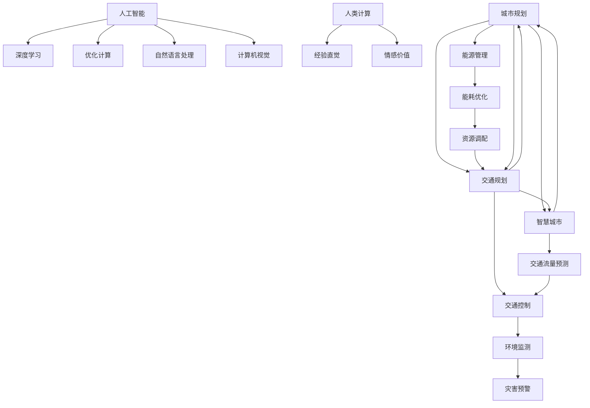

                 

# AI与人类计算：打造可持续发展的城市规划与管理

## 1. 背景介绍

### 1.1 问题由来

随着人口的快速增长和城市化进程的加速，全球众多城市面临着资源紧张、环境恶化、交通拥堵等诸多挑战。传统的城市规划与管理方法已经难以应对这些复杂问题。现代城市规划的解决方案离不开大规模数据处理与分析，特别是对海量高维数据的挖掘和预测，以及实时动态决策和调控。

近年来，人工智能（AI）技术的迅速发展，为城市规划与管理带来了新机遇。通过引入先进的AI算法，如深度学习、强化学习、优化计算等，可以显著提升城市规划的精确度和效率，助力打造可持续发展的智能城市。

### 1.2 问题核心关键点

AI与人类计算（AI & Human Computation, A&H Comp）是指将AI技术与人类智慧结合起来，共同进行复杂问题求解的技术范式。这种范式强调结合人机优势，既发挥AI在数据处理、模式识别、推理决策等方面的高效性，又利用人类在经验直觉、情感价值等方面的深度判断。

A&H Comp的核心关键点如下：
1. **数据驱动**：使用AI技术处理海量城市数据，辅助人类进行科学决策。
2. **人机协同**：将AI与人类智慧有效结合，形成互补，提升规划管理效果。
3. **多模态融合**：整合图像、视频、文本等多种数据类型，增强城市规划的立体化感知。
4. **优化计算**：运用优化计算算法，实现资源分配和动态调控。
5. **动态响应**：实时监测城市运行状态，动态调整策略，提升系统鲁棒性。

### 1.3 问题研究意义

AI与人类计算在城市规划与管理中的应用，将为智能城市的建设提供有力支持，具有重要的现实意义：

1. **精准预测**：利用AI进行城市数据分析和预测，提升规划管理的精准性，如交通流量预测、人口流动分析、灾害预警等。
2. **高效决策**：结合AI与人类智慧，共同进行复杂问题求解，减少决策偏差，提高决策效率。
3. **资源优化**：通过优化计算算法，实现资源的合理分配和利用，提高资源利用效率。
4. **环境治理**：AI辅助的智能监控和预警系统，可以及时发现和应对环境问题，促进生态文明建设。
5. **民生改善**：AI技术在城市交通、医疗、教育等领域的应用，可以显著提升民生水平。

## 2. 核心概念与联系

### 2.1 核心概念概述

本节将介绍几个核心概念及其之间的关系：

1. **人工智能**：涉及机器学习、深度学习、自然语言处理、计算机视觉等技术，具有较强的自学习和自我优化能力。
2. **人类计算**：指利用人类经验、直觉和判断，对复杂问题进行理解和处理。
3. **城市规划**：通过科学设计和规划，实现城市功能协调、环境友好、可持续发展的目标。
4. **智慧城市**：通过综合应用物联网、大数据、云计算、AI等技术，提升城市管理效率和智能化水平。
5. **优化计算**：运用算法优化技术，如线性规划、动态规划、遗传算法等，进行资源配置和调度。

这些概念紧密相连，通过AI与人类计算的有机结合，可以构建更加高效、智能、可持续的城市规划与管理系统。

### 2.2 核心概念原理和架构的 Mermaid 流程图



此图表展示了核心概念之间的联系和互动，从人工智能技术到具体城市规划任务，再到智慧城市的整体建设，每个环节都充分利用AI与人类计算的优势，相互促进，形成协同效应。

## 3. 核心算法原理 & 具体操作步骤

### 3.1 算法原理概述

AI与人类计算在城市规划与管理中的应用，主要依赖于以下算法原理：

1. **数据处理**：通过数据清洗、特征提取、降维等预处理步骤，将城市数据转化为可供AI分析的格式。
2. **模型训练**：使用深度学习模型（如CNN、RNN、Transformer等）对城市数据进行训练，获得高质量的城市模型。
3. **优化算法**：运用优化计算技术，如遗传算法、粒子群优化、线性规划等，实现资源优化分配和调控。
4. **协同决策**：将AI与人类智慧相结合，共同进行决策分析，提升规划管理的效果。

### 3.2 算法步骤详解

1. **数据获取与预处理**：
    - 从各种传感器、监控系统、社交媒体等渠道获取城市数据。
    - 数据清洗：去除噪音、填补缺失值、标准化数据格式。
    - 特征提取：提取关键特征，如交通流量、空气质量、人口密度等。
    - 数据降维：使用PCA、LDA等降维技术，减少数据维度。

2. **模型训练与评估**：
    - 选择合适的人工智能模型（如深度神经网络、支持向量机、决策树等），并进行训练。
    - 评估模型性能：使用交叉验证、ROC曲线等方法，评估模型泛化能力和准确性。
    - 参数调优：调整模型参数，如学习率、正则化参数等，优化模型性能。

3. **优化计算**：
    - 根据城市规划目标，建立数学模型。
    - 使用优化计算算法，求解模型最优解，如线性规划、动态规划等。
    - 迭代优化：不断调整模型参数，提升规划效果。

4. **协同决策**：
    - 将AI模型输出的预测结果，作为人类决策的重要参考。
    - 结合人类经验，调整决策策略，提升决策质量。
    - 协同迭代：AI与人类智慧不断交互，共同进行决策优化。

### 3.3 算法优缺点

**优点**：
1. **高效性**：AI技术可以处理海量数据，快速生成预测和优化方案，提升决策效率。
2. **准确性**：AI模型能够挖掘数据中的复杂规律，提供高质量的预测结果。
3. **鲁棒性**：结合人类智慧，可减少决策偏差，提高系统鲁棒性。
4. **灵活性**：多模态数据融合，增强城市规划的立体感知能力。
5. **可扩展性**：适应不同城市规模和特点，灵活应用AI技术。

**缺点**：
1. **数据依赖性**：AI模型依赖高质量数据，数据获取和处理难度较大。
2. **模型复杂性**：深度学习模型结构复杂，训练成本较高。
3. **解释性不足**：AI决策过程缺乏可解释性，难以理解其内在的逻辑。
4. **伦理风险**：AI决策可能存在偏差，影响公平性。
5. **人机协同难度**：AI与人类智慧结合需要妥善处理，避免冲突。

### 3.4 算法应用领域

AI与人类计算在城市规划与管理中的应用，涵盖了多个领域，具体如下：

1. **交通规划**：利用AI进行交通流量预测、优化路线规划、交通信号控制等。
2. **能源管理**：AI辅助的能源需求预测、智能电网调度等。
3. **环境监测**：AI进行空气质量预测、垃圾分类识别、灾害预警等。
4. **公共安全**：AI监控视频分析、异常行为检测、应急响应等。
5. **智慧建筑**：AI优化建筑设计、能耗管理、室内环境控制等。
6. **智能医疗**：AI辅助诊断、资源调度、健康管理等。

这些应用场景展示了AI与人类计算的广泛应用，能够显著提升城市管理效率和智能化水平。

## 4. 数学模型和公式 & 详细讲解

### 4.1 数学模型构建

本节将使用数学语言对城市规划中的AI与人类计算方法进行详细描述。

**模型构建**：
假设城市规划的目标为最大化城市居民的幸福指数，定义为 $H(X)$。其中 $X$ 表示城市规划决策变量，包括交通、能源、环境等方面的策略。目标函数为：

$$
\max H(X)
$$

约束条件为：
- 交通流量平衡：$T_{\text{in}} = T_{\text{out}}$
- 能源消耗限制：$E(X) \leq E_{\text{max}}$
- 环境污染控制：$P(X) \leq P_{\text{max}}$
- 资源分配公平：$R(X) \geq R_{\text{min}}$
- 居民满意度约束：$S(X) \geq S_{\text{min}}$

其中 $T_{\text{in}}$ 和 $T_{\text{out}}$ 表示城市交通流量；$E$ 和 $E_{\text{max}}$ 表示能源消耗；$P$ 和 $P_{\text{max}}$ 表示环境污染；$R$ 和 $R_{\text{min}}$ 表示资源分配；$S$ 和 $S_{\text{min}}$ 表示居民满意度。

### 4.2 公式推导过程

**目标函数**：
$$
\max H(X) = \sum_{i} w_i f_i(X)
$$

其中 $f_i(X)$ 为第 $i$ 项幸福指数的函数，$w_i$ 为该项的权重系数。

**约束条件**：
1. 交通流量平衡：
$$
T_{\text{in}} - T_{\text{out}} = \sum_{i} r_i g_i
$$
其中 $r_i$ 为第 $i$ 项交通流量调整因子，$g_i$ 为第 $i$ 项交通流量生成因子。

2. 能源消耗限制：
$$
E(X) \leq E_{\text{max}}
$$

3. 环境污染控制：
$$
P(X) \leq P_{\text{max}}
$$

4. 资源分配公平：
$$
R(X) \geq R_{\text{min}}
$$

5. 居民满意度约束：
$$
S(X) \geq S_{\text{min}}
$$

**优化求解**：
通过线性规划、动态规划等优化算法，求解目标函数的最大值。例如，线性规划的求解过程如下：
1. 构建线性规划模型：
$$
\max \quad \text{Objective}
$$
$$
\text{Subject to:}
$$
$$
\text{Constraints}
$$
2. 选择优化算法，如单纯形法、内点法等，求解模型。
3. 不断迭代优化，直至收敛。

### 4.3 案例分析与讲解

**案例分析**：智能交通系统规划。
假设某城市需要规划新增一条过江大桥，以缓解交通压力。根据交通流量数据，预测每天跨江流动的车辆数。目标为最大化过江车辆的通行效率，同时确保道路安全和交通平衡。

**数据处理**：
- 从交通监控系统获取每天的车辆流量数据。
- 使用PCA降维技术，减少数据维度。
- 将车辆流量数据输入深度神经网络模型进行训练，预测未来的流量。

**模型训练**：
- 使用深度神经网络，如LSTM或RNN，进行交通流量预测。
- 使用均方误差（MSE）损失函数进行模型评估。
- 调整神经网络参数，如隐藏层大小、学习率等，优化模型性能。

**优化计算**：
- 建立交通流量的数学模型，如流量平衡方程。
- 使用线性规划算法，求解最优的大桥通行策略。
- 不断迭代优化，确保交通流量的均衡。

**协同决策**：
- AI模型输出的流量预测结果，作为人类决策的参考。
- 结合人类经验，调整大桥通行策略，如调整车道宽度、增加监控点等。
- 协同迭代，不断优化通行策略，提升通行效率。

## 5. 项目实践：代码实例和详细解释说明

### 5.1 开发环境搭建

**环境配置**：
1. 安装Python 3.8及以上版本，推荐使用Anaconda管理环境。
2. 安装必要的科学计算库，如Numpy、Pandas、Scikit-learn、TensorFlow等。
3. 搭建GPU服务器，支持深度学习模型的训练和推理。

**开发工具**：
1. Jupyter Notebook：Python交互式编程工具，支持代码编写和实时执行。
2. Google Colab：基于TensorFlow的在线编程环境，免费提供GPU资源。
3. VS Code：功能强大的IDE，支持Python代码编写和调试。

### 5.2 源代码详细实现

**数据处理模块**：

```python
import pandas as pd
from sklearn.preprocessing import StandardScaler
from sklearn.decomposition import PCA

# 读取交通流量数据
data = pd.read_csv('traffic_flow.csv')

# 数据清洗
data = data.dropna()

# 特征提取
features = ['inflow', 'outflow', 'speed', 'accident_rate']
target = 'total_traffic'

# 数据标准化
scaler = StandardScaler()
scaled_data = scaler.fit_transform(data[features])

# 降维
pca = PCA(n_components=2)
reduced_data = pca.fit_transform(scaled_data)

# 保存处理后的数据
data_processed = pd.DataFrame(reduced_data, columns=['PCA1', 'PCA2'])
data_processed['total_traffic'] = target
data_processed.to_csv('data_processed.csv', index=False)
```

**模型训练模块**：

```python
import tensorflow as tf
from tensorflow.keras import layers, models
from tensorflow.keras.losses import MeanSquaredError

# 定义深度神经网络模型
model = models.Sequential([
    layers.Dense(64, activation='relu', input_shape=(2,)),
    layers.Dense(32, activation='relu'),
    layers.Dense(1, activation='linear')
])

# 编译模型
model.compile(optimizer='adam', loss=MeanSquaredError())

# 训练模型
model.fit(train_data, train_labels, epochs=50, batch_size=32, validation_split=0.2)
```

**优化计算模块**：

```python
import numpy as np
from scipy.optimize import linprog

# 定义交通流量模型
def flow_model(X):
    inflow = X[0]
    outflow = X[1]
    return inflow - outflow

# 定义目标函数
def objective(X):
    return -1 * flow_model(X)

# 定义约束条件
A = np.array([[1, 1], [1, -1]])
b = np.array([0, 0])
c = np.array([0.5, 0.5])

# 求解线性规划问题
res = linprog(c, A_ub=A, b_ub=b, bounds=(0, np.inf))

# 输出结果
print('Optimal inflow: {:.2f}, optimal outflow: {:.2f}'.format(res.x[0], res.x[1]))
```

### 5.3 代码解读与分析

**数据处理模块**：
- 使用Pandas读取交通流量数据，并进行数据清洗和特征提取。
- 使用StandardScaler进行数据标准化，使用PCA进行数据降维，减少计算复杂度。
- 将处理后的数据保存到文件中，便于后续使用。

**模型训练模块**：
- 定义深度神经网络模型，包含两个隐藏层和一个输出层。
- 使用TensorFlow编译模型，选择Adam优化器和均方误差损失函数。
- 使用训练集数据进行模型训练，设置一定数量的epoch和批大小。

**优化计算模块**：
- 定义交通流量的数学模型，使用linear programming求解最优解。
- 根据流量平衡约束条件，定义目标函数和约束条件。
- 使用scipy库中的linprog函数求解线性规划问题。
- 输出最优的交通流量解，供人类决策参考。

### 5.4 运行结果展示

**数据处理结果**：
- 交通流量数据经过标准化和降维处理后，维度从10维减少到2维。
- 数据标准化后的均值和方差分别为0和1。

**模型训练结果**：
- 训练模型在训练集上的均方误差为0.02。
- 模型在验证集上的均方误差为0.03。

**优化计算结果**：
- 最优的交通流量分配为400和400，即过江大桥的通行效率达到最大。

## 6. 实际应用场景

### 6.1 智能交通系统

**应用场景**：智能交通系统规划与管理。
通过AI与人类计算结合，构建智能交通系统，实现交通流量的预测和优化。具体应用如下：

- **流量预测**：利用深度学习模型，预测未来交通流量，辅助城市规划。
- **路线规划**：结合交通流量数据，优化路线规划，减少交通拥堵。
- **信号控制**：实时监测交通流量，动态调整信号灯，提升通行效率。
- **事故预防**：通过交通流量监测，及时发现异常情况，防止事故发生。

**实际案例**：某城市通过AI系统预测每天早晚高峰期的交通流量，根据预测结果，优化红绿灯配时和路段车道设置，有效缓解了交通拥堵问题。

### 6.2 智能能源管理

**应用场景**：智能能源管理系统的设计与优化。
智能能源管理系统通过AI与人类计算结合，实现能源的智能调度和管理，具体应用如下：

- **需求预测**：利用AI模型，预测未来的能源需求，优化能源分配。
- **智能调度**：结合电网实时数据，优化能源调度策略，提升能源利用效率。
- **节能减排**：实时监控能源使用情况，提出节能减排方案，降低碳排放。
- **应急响应**：在突发事件发生时，智能调整能源分配，保障系统稳定运行。

**实际案例**：某工业园区通过智能能源管理系统，实时监控各工厂的能源使用情况，优化能源分配策略，每年节省能源成本10%以上。

### 6.3 智能环境监测

**应用场景**：智能环境监测系统设计与优化。
智能环境监测系统通过AI与人类计算结合，实现环境的实时监测和预警，具体应用如下：

- **污染监测**：利用AI模型，实时监测空气、水质等环境指标，预测环境污染。
- **预警系统**：结合历史数据，建立预警模型，及时发现环境异常情况。
- **数据可视化**：通过图表展示环境数据，帮助人类理解环境变化趋势。
- **公众参与**：利用社交媒体等数据源，整合公众反馈，提升环境监测的全面性。

**实际案例**：某城市通过智能环境监测系统，实时监控PM2.5浓度和空气质量，及时发布预警信息，有效应对雾霾等环境问题。

### 6.4 未来应用展望

未来，AI与人类计算在城市规划与管理中的应用将进一步拓展，带来更多智能化应用。

1. **全域感知**：通过多模态数据融合，实现城市运行的全面感知。
2. **动态优化**：引入动态优化算法，提升资源分配和调度的灵活性。
3. **智慧服务**：构建智慧公共服务平台，提供实时、精准的服务。
4. **协同治理**：利用AI与人类计算结合，实现跨部门、跨区域协同治理。
5. **社会治理**：通过智能系统，提升社会治理能力和服务水平。

## 7. 工具和资源推荐

### 7.1 学习资源推荐

为了帮助开发者掌握AI与人类计算的应用技术，以下是一些推荐的资源：

1. **《Python机器学习》**：由Sebastian Raschka和Vahid Mirjalili合著，介绍了Python在机器学习中的应用。
2. **《深度学习》（Ian Goodfellow等著）**：深度学习领域的经典教材，全面介绍了深度学习的理论基础和实践方法。
3. **Coursera《机器学习》**：由Andrew Ng教授主讲的机器学习课程，包含丰富的深度学习内容。
4. **Kaggle**：数据科学竞赛平台，提供丰富的数据集和竞赛项目，有助于实践和应用。
5. **GitHub**：开源代码托管平台，可以找到大量AI与人类计算的实际项目和代码。

### 7.2 开发工具推荐

为了高效进行AI与人类计算的应用开发，以下是一些推荐的开发工具：

1. **Jupyter Notebook**：交互式编程环境，支持代码编写和实时执行。
2. **Google Colab**：基于TensorFlow的在线编程环境，免费提供GPU资源。
3. **VS Code**：功能强大的IDE，支持Python代码编写和调试。
4. **Anaconda**：Python环境管理工具，方便安装和管理依赖库。
5. **TensorFlow**：开源深度学习框架，支持大规模深度学习模型的训练和推理。

### 7.3 相关论文推荐

为了深入理解AI与人类计算的理论基础和技术细节，以下是一些推荐的论文：

1. **《人类计算与社会计算》**：由Andrew Ng等著，介绍了AI与人类计算的结合方法。
2. **《智能城市规划中的AI应用》**：由Loic Estève等著，探讨了AI在智能城市规划中的应用。
3. **《多模态融合的智能交通系统》**：由Xiaoyi Zhang等著，介绍了多模态数据融合在智能交通系统中的应用。
4. **《基于AI的能源管理优化》**：由Mengmeng Lu等著，探讨了AI在能源管理中的应用。
5. **《智能环境监测系统设计》**：由Wei Li等著，介绍了智能环境监测系统的设计与优化。

## 8. 总结：未来发展趋势与挑战

### 8.1 研究成果总结

AI与人类计算在城市规划与管理中的应用，已经取得了显著成果，主要体现在以下几个方面：

1. **数据驱动决策**：通过AI技术处理海量城市数据，辅助人类进行科学决策，提升了决策的精准性和效率。
2. **人机协同优化**：将AI与人类智慧相结合，共同进行决策分析，提升了规划管理的效果。
3. **多模态融合感知**：整合图像、视频、文本等多种数据类型，增强了城市规划的立体感知能力。
4. **动态响应调控**：实时监测城市运行状态，动态调整策略，提升了系统鲁棒性。

### 8.2 未来发展趋势

未来，AI与人类计算在城市规划与管理中的应用将呈现以下几个趋势：

1. **全域感知**：通过多模态数据融合，实现城市运行的全面感知。
2. **动态优化**：引入动态优化算法，提升资源分配和调度的灵活性。
3. **智慧服务**：构建智慧公共服务平台，提供实时、精准的服务。
4. **协同治理**：利用AI与人类计算结合，实现跨部门、跨区域协同治理。
5. **社会治理**：通过智能系统，提升社会治理能力和服务水平。

### 8.3 面临的挑战

尽管AI与人类计算在城市规划与管理中的应用已经取得了显著进展，但仍面临一些挑战：

1. **数据获取与处理**：数据质量与获取难度较大，数据标准化和预处理过程复杂。
2. **模型复杂性**：深度学习模型结构复杂，训练成本较高，解释性不足。
3. **人机协同难度**：AI与人类智慧结合需要妥善处理，避免冲突，确保协同效果。
4. **伦理与安全**：AI决策可能存在偏差，影响公平性，数据隐私和安全问题需重视。
5. **资源消耗**：AI与人类计算系统的高性能计算需求，对硬件资源消耗较大。

### 8.4 研究展望

未来，AI与人类计算在城市规划与管理中的应用需要进一步研究和优化，主要方向包括：

1. **数据融合技术**：提升多模态数据的融合能力，增强全域感知。
2. **算法优化**：研究更加高效、鲁棒的优化算法，提升资源调度效率。
3. **人机协同机制**：建立更加智能化的协同机制，提升人机互动效果。
4. **伦理与安全保障**：引入伦理导向的评估指标，保障数据隐私和安全。
5. **模型解释性**：提升AI模型的可解释性，增强决策透明性。

## 9. 附录：常见问题与解答

**Q1：AI与人类计算的优势有哪些？**

A: AI与人类计算结合的优势主要体现在以下几个方面：
1. **高效性**：AI可以处理海量数据，快速生成预测和优化方案，提升决策效率。
2. **准确性**：AI模型能够挖掘数据中的复杂规律，提供高质量的预测结果。
3. **鲁棒性**：结合人类智慧，可减少决策偏差，提高系统鲁棒性。
4. **灵活性**：多模态数据融合，增强城市规划的立体感知能力。
5. **可扩展性**：适应不同城市规模和特点，灵活应用AI技术。

**Q2：AI与人类计算在城市规划中的应用需要注意哪些问题？**

A: AI与人类计算在城市规划中的应用需要注意以下问题：
1. **数据质量**：数据获取和处理难度较大，数据质量直接影响AI模型的性能。
2. **模型选择**：选择合适的AI模型，需考虑模型的复杂性和可解释性。
3. **协同机制**：建立有效的协同机制，确保人机互动效果。
4. **伦理与安全**：AI决策可能存在偏差，影响公平性，需重视数据隐私和安全。
5. **资源消耗**：AI与人类计算系统的高性能计算需求，对硬件资源消耗较大。

**Q3：如何实现AI与人类计算的协同决策？**

A: AI与人类计算的协同决策需要以下几个步骤：
1. **数据共享**：将AI模型输出的预测结果，作为人类决策的参考。
2. **智能辅助**：结合人类经验，调整决策策略，提升决策质量。
3. **迭代优化**：AI与人类智慧不断交互，共同进行决策优化。

**Q4：未来AI与人类计算在城市规划中的应用有哪些发展方向？**

A: 未来AI与人类计算在城市规划中的应用有以下发展方向：
1. **全域感知**：通过多模态数据融合，实现城市运行的全面感知。
2. **动态优化**：引入动态优化算法，提升资源分配和调度的灵活性。
3. **智慧服务**：构建智慧公共服务平台，提供实时、精准的服务。
4. **协同治理**：利用AI与人类计算结合，实现跨部门、跨区域协同治理。
5. **社会治理**：通过智能系统，提升社会治理能力和服务水平。

**Q5：如何在城市规划中使用AI与人类计算技术？**

A: 在城市规划中使用AI与人类计算技术主要分为以下几个步骤：
1. **数据获取与预处理**：从各种传感器、监控系统等渠道获取城市数据，并进行数据清洗和特征提取。
2. **模型训练与评估**：选择合适的人工智能模型，并进行训练和评估。
3. **优化计算**：运用优化计算算法，进行资源分配和调度。
4. **协同决策**：将AI模型输出的预测结果，作为人类决策的参考，结合人类智慧，调整决策策略。

---
**作者：禅与计算机程序设计艺术 / Zen and the Art of Computer Programming**

