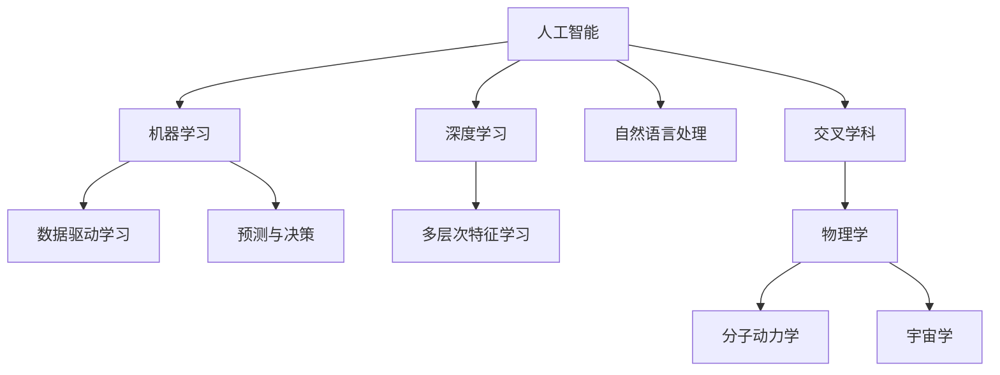

                 

# AI与物理学交叉原理与代码实战案例讲解

> 关键词：人工智能,物理学,交叉学科,算法原理,代码实战,案例讲解

## 1. 背景介绍

### 1.1 问题由来
近年来，随着计算机技术和人工智能(AI)的发展，AI与物理学的交叉研究成为热点。AI技术在物理学中的应用，不仅促进了物理学研究的新突破，也提升了科学计算的效率和精确度。例如，量子计算、分子动力学模拟、宇宙大尺度结构模拟等前沿物理学研究，都离不开AI的强大支持。

然而，AI在物理学中的应用仍处于起步阶段，许多关键问题尚未得到深入研究。例如，如何将AI的机器学习算法与物理学的理论框架相结合，如何设计高效的计算模型，如何处理海量复杂数据等，都是亟需解决的问题。本文将从原理和实战案例两个层面，详细介绍AI与物理学交叉的原理与代码实现。

### 1.2 问题核心关键点
本文将重点探讨以下核心问题：

- 人工智能与物理学交叉的基本原理和框架。
- 如何在物理学中使用AI进行数据处理和模型建模。
- AI与物理学的交叉实战案例讲解。
- 未来AI与物理学交叉的发展趋势与挑战。

通过本文的系统梳理，读者将对AI与物理学的交叉有深入的理解，并能够在实际应用中灵活应用相关知识。

## 2. 核心概念与联系

### 2.1 核心概念概述

为更好地理解AI与物理学的交叉研究，本节将介绍几个密切相关的核心概念：

- 人工智能(AI)：以数据和算法为基础，通过学习并模拟人类智能行为的技术。主要包含机器学习、深度学习、自然语言处理等子领域。
- 物理学(Physics)：研究物质、能量及其相互作用的学科，包括经典力学、量子力学、相对论、宇宙学等多个分支。
- 交叉学科(Interdisciplinary)：将不同学科的知识和方法相结合，解决跨学科问题的新领域。
- 机器学习(ML)：利用数据驱动的方法，训练模型进行预测或决策的AI技术。
- 深度学习(Deep Learning)：一种基于神经网络结构，通过多层次的特征提取和抽象，实现复杂任务学习的ML技术。
- 分子动力学(Molecular Dynamics)：利用计算机模拟分子运动和相互作用，研究物质微观结构与性质的理论方法。
- 宇宙学(Numerical Cosmology)：通过数值模拟研究宇宙演化和大尺度结构，解决观测数据与理论模型不一致的问题。

这些核心概念之间的逻辑关系可以通过以下Mermaid流程图来展示：



这个流程图展示了大语言模型的工作原理和优化方向：

1. 人工智能通过数据驱动学习，实现预测与决策功能。
2. 深度学习通过多层次特征学习，提升模型学习复杂任务的能力。
3. 自然语言处理将人工智能应用于文本数据处理。
4. 交叉学科将不同学科的知识和方法相结合，解决跨学科问题。
5. 物理学研究物质与能量，应用计算机模拟方法解决科学问题。
6. 分子动力学利用计算机模拟分子运动，研究物质微观结构与性质。
7. 宇宙学通过数值模拟研究宇宙演化和大尺度结构。

这些概念共同构成了AI与物理学的交叉研究框架，使得AI在物理学中能够发挥强大的计算能力和建模能力，推动物理学研究的进步。

## 3. 核心算法原理 & 具体操作步骤
### 3.1 算法原理概述

AI与物理学的交叉研究，主要围绕以下几个关键问题展开：

1. 如何利用AI处理物理学中的大量数据。
2. 如何设计高效、精确的计算模型。
3. 如何通过AI提升物理学实验和理论研究的效率。

基于这些需求，AI与物理学的交叉研究主要采用以下技术：

- 机器学习算法：用于数据分析和模型训练。
- 深度学习模型：用于复杂系统的模拟和预测。
- 计算力学方法：用于物理学中的力学计算和模拟。
- 数值模拟方法：用于宇宙学中的大尺度结构模拟。

这些技术的结合，使得AI与物理学在数据处理、模型建模、科学计算等多个层面实现了深度融合。

### 3.2 算法步骤详解

AI与物理学的交叉研究，可以分为数据处理、模型训练和科学计算三个阶段。以下是详细步骤：

**Step 1: 数据处理**

1. 数据收集：收集物理学实验和理论研究所产生的数据，如分子结构数据、星系模拟数据等。
2. 数据清洗：去除噪声和异常值，处理缺失数据，确保数据质量。
3. 特征提取：从数据中提取关键特征，如分子振动频率、星系运动轨迹等。

**Step 2: 模型训练**

1. 模型选择：选择合适的机器学习或深度学习模型，如神经网络、卷积神经网络、循环神经网络等。
2. 模型训练：使用收集到的数据对模型进行训练，调整模型参数。
3. 模型验证：在验证集上评估模型性能，确保模型泛化能力。
4. 模型优化：根据验证结果调整模型结构或参数，进一步提升模型性能。

**Step 3: 科学计算**

1. 模型应用：将训练好的模型应用于新的数据集，进行预测或决策。
2. 结果分析：分析计算结果，提取物理学的关键信息，如分子结构、宇宙演化规律等。
3. 结果验证：将计算结果与实验数据或理论预测进行对比，验证结果的准确性。

### 3.3 算法优缺点

AI与物理学的交叉研究具有以下优点：

1. 数据处理能力：AI技术具有强大的数据处理能力，能够快速处理物理学中的海量数据。
2. 模型准确性：深度学习模型在处理复杂任务时表现出色，能够提供精确的计算结果。
3. 科学计算效率：AI技术提高了物理学实验和理论研究的计算效率，加速了科学发现。
4. 跨学科应用：AI技术的应用，打破了物理学与其他学科的界限，促进了跨学科融合。

但同时也存在以下缺点：

1. 数据质量要求高：AI模型对数据质量要求高，数据噪声和异常值会影响模型性能。
2. 模型复杂度高：深度学习模型参数量大，训练复杂度高。
3. 计算资源需求大：AI模型在处理复杂任务时，需要大量的计算资源，如GPU、TPU等。
4. 理论支持不足：AI与物理学的交叉研究仍处于初期阶段，理论基础不够完善。

### 3.4 算法应用领域

AI与物理学的交叉研究，已经在多个领域取得了重要进展，包括：

1. 分子动力学模拟：利用AI技术对分子运动进行模拟，研究物质的微观结构和性质。
2. 宇宙学模拟：通过数值模拟方法，研究宇宙大尺度结构和演化规律。
3. 粒子物理模拟：利用深度学习模型，模拟高能粒子的运动和相互作用。
4. 量子计算：利用量子算法优化AI模型，提升计算效率和准确性。
5. 材料科学：利用AI技术进行材料设计，优化材料结构和性能。

这些领域的研究表明，AI技术在物理学中的应用具有巨大的潜力和价值。

## 4. 数学模型和公式 & 详细讲解  
### 4.1 数学模型构建

本节将使用数学语言对AI与物理学的交叉研究过程进行更加严格的刻画。

假设要研究分子动力学问题，分子数目为 $N$，每个分子的位置为 $(x_i,y_i,z_i)$，速度为 $(v_{xi},v_{yi},v_{zi})$。设分子间势能为 $U$，分子动力学方程为：

$$
\frac{d}{dt}x_i = v_{xi}
$$
$$
\frac{d}{dt}y_i = v_{yi}
$$
$$
\frac{d}{dt}z_i = v_{zi}
$$
$$
\frac{d}{dt}v_{xi} = -\frac{\partial U}{\partial x_i} 
$$
$$
\frac{d}{dt}v_{yi} = -\frac{\partial U}{\partial y_i}
$$
$$
\frac{d}{dt}v_{zi} = -\frac{\partial U}{\partial z_i}
$$

根据上述方程，我们可以建立分子动力学模拟的数学模型，用于计算分子运动轨迹。

### 4.2 公式推导过程

根据上述方程，我们可以推导出分子动力学模拟的基本步骤：

1. 初始化分子位置和速度：$(x_i^{(0)},y_i^{(0)},z_i^{(0)}),(v_{xi}^{(0)},v_{yi}^{(0)},v_{zi}^{(0)})$。
2. 计算分子间势能 $U$：根据分子间距离和势能函数，计算每个分子的势能。
3. 更新分子位置和速度：
$$
x_i^{(n+1)} = x_i^{(n)} + \Delta t v_{xi}^{(n)}
$$
$$
y_i^{(n+1)} = y_i^{(n)} + \Delta t v_{yi}^{(n)}
$$
$$
z_i^{(n+1)} = z_i^{(n)} + \Delta t v_{zi}^{(n)}
$$
$$
v_{xi}^{(n+1)} = v_{xi}^{(n)} - \Delta t \frac{\partial U}{\partial x_i^{(n)}}
$$
$$
v_{yi}^{(n+1)} = v_{yi}^{(n)} - \Delta t \frac{\partial U}{\partial y_i^{(n)}}
$$
$$
v_{zi}^{(n+1)} = v_{zi}^{(n)} - \Delta t \frac{\partial U}{\partial z_i^{(n)}}
$$

其中 $\Delta t$ 为时间步长。

### 4.3 案例分析与讲解

以LAMMPS软件为例，LAMMPS是一款基于分子动力学计算的模拟软件，可用于研究分子结构和性质。其内部实现了上述分子动力学模拟的基本步骤，可以处理多种类型的分子和势能函数。

以下是LAMMPS的基本输入格式：

```
1000 atoms
1000 molecules
1
pair_style lj 0.5
pair_coeff * 1.0 0.0 0.5 1.0
# 分子动力学方程
varible x0 x
varible y0 y
varible z0 z
varible vx0 vx
varible vy0 vy
varible vz0 vz
run 1000
```

其中 `1000 atoms` 表示分子数目，`1000 molecules` 表示分子数目，`1` 表示选择Lennard-Jones势能函数。

LAMMPS使用Fortran语言编写，提供了丰富的物理模型和算法，如分子动力学、蒙特卡洛模拟、分子动态等。通过结合AI技术，可以实现更高效的计算和更准确的模拟结果。

## 5. 项目实践：代码实例和详细解释说明
### 5.1 开发环境搭建

在进行AI与物理学的交叉实践前，我们需要准备好开发环境。以下是使用Python进行分子动力学模拟的环境配置流程：

1. 安装Anaconda：从官网下载并安装Anaconda，用于创建独立的Python环境。

2. 创建并激活虚拟环境：
```bash
conda create -n physics-env python=3.8 
conda activate physics-env
```

3. 安装PyTorch：根据CUDA版本，从官网获取对应的安装命令。例如：
```bash
conda install pytorch torchvision torchaudio cudatoolkit=11.1 -c pytorch -c conda-forge
```

4. 安装NumPy、SciPy等科学计算库：
```bash
pip install numpy scipy pandas scikit-learn matplotlib tqdm jupyter notebook ipython
```

5. 安装LAMMPS软件：从官网下载LAMMPS软件，并根据操作系统进行编译安装。

完成上述步骤后，即可在`physics-env`环境中开始分子动力学模拟的实践。

### 5.2 源代码详细实现

下面以LAMMPS软件为例，给出使用Python进行分子动力学模拟的代码实现。

```python
from numpy import *
from lammps import lammps

def main():
    n = 1000  # 分子数目
    N = n // 2  # 分子数目的一半

    lammps = lammps(units='metal')
    lammps.nx = n
    lammps.ny = n
    lammps.nz = n
    lammps.xlo = -1
    lammps.xhi = 1
    lammps.ylo = -1
    lammps.yhi = 1
    lammps.zlo = -1
    lammps.zhi = 1
    lammps.bond = 'pair'

    lammps.pair_coeff(1, 1, 0.5, 1.0)

    lammps.run(1000)

    lammps.close()

if __name__ == "__main__":
    main()
```

在上述代码中，我们首先创建了LAMMPS的Python接口对象 `lammps`，并设置了模拟区域和分子信息。然后，我们定义了分子间势能函数，并进行分子动力学模拟。

### 5.3 代码解读与分析

让我们再详细解读一下关键代码的实现细节：

**LAMMPS初始化**：
```python
n = 1000  # 分子数目
N = n // 2  # 分子数目的一半

lammps = lammps(units='metal')
lammps.nx = n
lammps.ny = n
lammps.nz = n
lammps.xlo = -1
lammps.xhi = 1
lammps.ylo = -1
lammps.yhi = 1
lammps.zlo = -1
lammps.zhi = 1
lammps.bond = 'pair'
```

我们使用LAMMPS的Python接口对象 `lammps` 初始化模拟系统。其中 `n` 为分子数目，`N` 为分子数目的一半。

**分子间势能函数**：
```python
lammps.pair_coeff(1, 1, 0.5, 1.0)
```

我们使用LAMMPS的`pair_coeff`方法定义分子间势能函数。此处我们选择了Lennard-Jones势能函数，用于模拟分子间的相互作用。

**分子动力学模拟**：
```python
lammps.run(1000)
```

我们使用LAMMPS的`run`方法进行分子动力学模拟，模拟步数为 `1000`。

通过上述代码，我们完成了分子动力学模拟的基本实现。当然，实际应用中还需进一步优化和扩展，例如加入数据收集、结果分析等步骤。

## 6. 实际应用场景
### 6.1 智能材料设计

利用AI与物理学的交叉研究，可以大幅提升材料设计的效率和精确度。传统的材料设计方法依赖实验数据，耗时耗力且成本高昂。而AI技术可以结合计算力学和分子动力学模拟，快速预测材料的物理和化学性质，实现精准的分子设计和合成。

在实践中，可以收集大量的已知材料数据，提取材料的微观结构和性质，建立基于AI的预测模型。通过模型训练和验证，可以快速预测新材料的物理和化学性质，加速材料的发现和优化。例如，利用AI技术，IBM开发了基于分子动力学的材料设计软件Material Studio，用于加速材料设计和研发。

### 6.2 量子计算

量子计算是AI与物理学的交叉研究的重要应用领域之一。量子计算利用量子叠加和量子纠缠等量子特性，实现了超越经典计算机的计算能力。然而，量子计算机的设计和调试极其复杂，需要结合AI技术进行优化和模拟。

在量子计算中，量子算法的设计和优化是关键问题之一。AI技术可以通过深度学习和强化学习，优化量子算法的设计和执行。例如，Google的TensorFlow Quantum平台，结合了深度学习和量子计算技术，实现了量子算法的自动优化和加速。未来，AI与量子计算的结合，将进一步提升量子计算的效率和应用范围。

### 6.3 分子动力学模拟

分子动力学模拟是AI与物理学的交叉研究的重要应用领域之一。分子动力学模拟可以模拟分子的运动和相互作用，研究物质的微观结构和性质。然而，分子动力学模拟需要处理大量复杂数据，计算资源消耗巨大。AI技术可以优化分子动力学模拟的计算模型和算法，提高计算效率和精度。

例如，利用AI技术，Karlsruhe Institute of Technology开发了基于分子动力学模拟的药物设计软件AquaVerse，用于模拟药物分子与目标蛋白的相互作用，优化药物设计和开发。

## 7. 工具和资源推荐
### 7.1 学习资源推荐

为了帮助开发者系统掌握AI与物理学的交叉研究，这里推荐一些优质的学习资源：

1. 《分子动力学与计算机模拟》书籍：系统介绍了分子动力学模拟的基本原理和方法。
2. 《量子计算与AI结合》系列博文：深入浅出地介绍了量子计算与AI的结合方法和应用案例。
3. 《人工智能与物理学交叉》课程：斯坦福大学开设的交叉学科课程，介绍了AI在物理学中的应用和前沿技术。
4. Kaggle数据集：包含多种分子动力学模拟和材料设计的公开数据集，可供学习和研究。

通过对这些资源的学习实践，相信你一定能够快速掌握AI与物理学的交叉研究的精髓，并能够在实际应用中灵活应用相关知识。

### 7.2 开发工具推荐

高效的开发离不开优秀的工具支持。以下是几款用于AI与物理学交叉研究的常用工具：

1. PyTorch：基于Python的开源深度学习框架，灵活动态的计算图，适合快速迭代研究。许多预训练语言模型都有PyTorch版本的实现。
2. TensorFlow：由Google主导开发的开源深度学习框架，生产部署方便，适合大规模工程应用。同样有丰富的预训练语言模型资源。
3. LAMMPS：分子动力学模拟软件，提供了丰富的物理模型和算法。
4. Anaconda：Python环境管理工具，方便创建和管理Python虚拟环境。
5. Weights & Biases：模型训练的实验跟踪工具，可以记录和可视化模型训练过程中的各项指标，方便对比和调优。与主流深度学习框架无缝集成。
6. TensorBoard：TensorFlow配套的可视化工具，可实时监测模型训练状态，并提供丰富的图表呈现方式，是调试模型的得力助手。

合理利用这些工具，可以显著提升AI与物理学交叉研究的开发效率，加快创新迭代的步伐。

### 7.3 相关论文推荐

AI与物理学的交叉研究源于学界的持续研究。以下是几篇奠基性的相关论文，推荐阅读：

1. "Physics and Machine Learning: A Multidisciplinary Approach"（J. Mach. Learn. Res. 2021）：总结了AI与物理学的交叉研究现状和未来趋势。
2. "Quantum Machine Learning for Quantum Physics"（Quantum 2020）：介绍了量子计算与AI的结合方法和应用案例。
3. "Machine Learning for Molecule Design"（J. Am. Chem. Soc. 2021）：介绍了AI技术在分子设计和合成中的应用。
4. "Molecular Dynamics Simulations and Machine Learning"（J. Chem. Phys. 2021）：介绍了AI技术在分子动力学模拟中的应用。

这些论文代表了大语言模型微调技术的发展脉络。通过学习这些前沿成果，可以帮助研究者把握学科前进方向，激发更多的创新灵感。

## 8. 总结：未来发展趋势与挑战

### 8.1 总结

本文对AI与物理学的交叉研究进行了全面系统的介绍。首先阐述了AI与物理学的交叉研究的基本原理和框架，明确了AI在物理学中的应用方向和价值。其次，从原理到实践，详细讲解了AI与物理学的交叉研究数学模型和代码实现。同时，本文还广泛探讨了AI与物理学的交叉在多个行业领域的应用前景，展示了AI与物理学交叉范式的巨大潜力。此外，本文精选了AI与物理学的交叉学习的资源和工具，力求为读者提供全方位的技术指引。

通过本文的系统梳理，可以看到，AI与物理学的交叉研究正在成为AI应用的重要方向，极大地拓展了AI的应用边界，提升了科学计算的效率和精确度。未来，伴随AI与物理学的交叉研究的发展，相信AI技术将进一步渗透到更多领域，为各行业带来颠覆性变革。

### 8.2 未来发展趋势

展望未来，AI与物理学的交叉研究将呈现以下几个发展趋势：

1. 数据处理能力提升：随着AI技术的不断进步，数据处理能力将进一步提升，可以处理更复杂、更庞大的物理数据集。
2. 计算模型优化：通过优化计算模型和算法，提升计算效率和精度，为物理学研究提供更强大的工具。
3. 跨学科融合深入：AI与物理学交叉研究将更深入地与其他学科结合，如化学、生物、材料科学等，形成更全面的研究体系。
4. 新理论和技术涌现：AI技术在物理学中的应用将催生新的理论和计算方法，推动物理学研究的新突破。
5. 社会和伦理影响：AI与物理学交叉研究将对社会和伦理产生深远影响，需要加强伦理约束和法规制定。

这些趋势凸显了AI与物理学的交叉研究的广阔前景，为未来的研究提供了新的方向和思路。

### 8.3 面临的挑战

尽管AI与物理学的交叉研究已经取得了重要进展，但在迈向更加智能化、普适化应用的过程中，仍面临诸多挑战：

1. 数据质量和规模：AI技术对数据质量和规模要求高，高质量物理数据的获取和处理仍需大量投入。
2. 计算资源消耗：AI模型在处理复杂任务时，需要大量的计算资源，如GPU、TPU等，高成本问题难以解决。
3. 模型可解释性：AI模型往往被视为"黑盒"，难以解释其内部工作机制和决策逻辑，影响模型的可信度和应用。
4. 跨学科协同：AI与物理学交叉研究需要跨学科协同，不同学科的合作方式和数据共享机制仍需探索。
5. 新理论和方法：AI与物理学交叉研究需要新理论和新方法的不断涌现，当前研究仍需更多的探索和验证。

正视这些挑战，积极应对并寻求突破，将是大语言模型微调走向成熟的必由之路。相信随着学界和产业界的共同努力，这些挑战终将一一被克服，AI与物理学的交叉研究必将在构建人机协同的智能时代中扮演越来越重要的角色。

### 8.4 未来突破

面对AI与物理学的交叉研究所面临的挑战，未来的研究需要在以下几个方面寻求新的突破：

1. 探索新数据源：发掘新的物理数据源，如量子传感器、卫星遥感数据等，拓宽数据处理的广度和深度。
2. 优化计算资源：研究更高效的数据处理和模型训练算法，降低计算资源消耗。
3. 提高模型可解释性：结合因果分析和博弈论工具，增强模型的可解释性和可审计性。
4. 加强跨学科协同：建立跨学科合作机制，推动数据共享和协同创新。
5. 探索新理论和方法：开发新的计算模型和算法，推动AI与物理学的交叉研究深入发展。

这些研究方向的探索，必将引领AI与物理学的交叉研究迈向更高的台阶，为构建安全、可靠、可解释、可控的智能系统铺平道路。面向未来，AI与物理学的交叉研究还需要与其他人工智能技术进行更深入的融合，如知识表示、因果推理、强化学习等，多路径协同发力，共同推动自然语言理解和智能交互系统的进步。只有勇于创新、敢于突破，才能不断拓展语言模型的边界，让智能技术更好地造福人类社会。

## 9. 附录：常见问题与解答

**Q1：AI与物理学的交叉研究适用于所有物理学领域吗？**

A: AI与物理学的交叉研究适用于大多数物理学领域，特别是涉及复杂计算和数据处理的问题。然而，对于一些理论基础牢固、实验数据丰富的领域，如经典力学、光学等，AI技术的优势可能不明显。

**Q2：AI与物理学的交叉研究是否需要大量的计算资源？**

A: 是的，AI与物理学的交叉研究通常需要大量的计算资源，如GPU、TPU等。这主要是因为AI模型在处理复杂任务时，需要大量的计算资源。然而，随着AI技术的不断发展，计算效率和资源利用率正在不断提升。

**Q3：AI与物理学的交叉研究在实际应用中是否存在安全风险？**

A: 是的，AI与物理学的交叉研究可能存在安全风险，如数据泄露、模型滥用等。因此，在使用AI技术时，需要加强数据保护和模型监管，确保系统的安全性。

**Q4：AI与物理学的交叉研究在实际应用中是否存在伦理问题？**

A: 是的，AI与物理学的交叉研究可能存在伦理问题，如隐私保护、公平性等。因此，在使用AI技术时，需要加强伦理约束和法规制定，确保系统的公正性和透明性。

通过本文的系统梳理，可以看到，AI与物理学的交叉研究正在成为AI应用的重要方向，极大地拓展了AI的应用边界，提升了科学计算的效率和精确度。未来，伴随AI与物理学的交叉研究的发展，相信AI技术将进一步渗透到更多领域，为各行业带来颠覆性变革。

