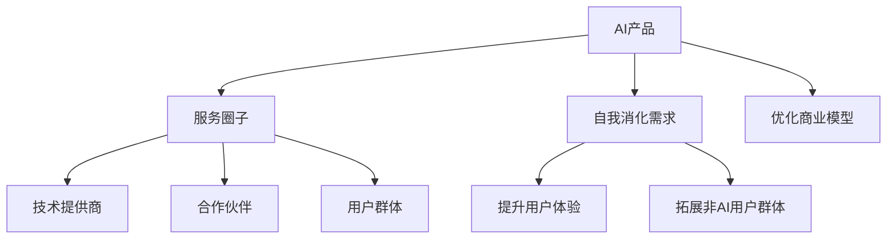

                 

# AI产品服务圈子：自我消化需求，拓展非AI用户群体

> 关键词：AI产品, 服务圈子, 自我消化需求, 拓展用户群体, 商业模型, 用户体验, 市场策略

## 1. 背景介绍

### 1.1 问题由来
随着人工智能技术的日益成熟和普及，越来越多的企业开始探索将AI技术应用于产品和服务中。然而，将AI技术整合到现有业务流程中，不仅需要技术上的突破，还需要解决如何提升用户体验、拓展非AI用户群体、优化商业模型等一系列复杂问题。

面对这一挑战，本文将深入探讨如何构建AI产品服务圈子，通过自我消化需求的方式，高效拓展非AI用户群体，并提出一些具体的市场策略和技术实现方案。

### 1.2 问题核心关键点
- 如何构建AI产品服务圈子
- 如何自我消化需求以提升用户体验
- 如何拓展非AI用户群体
- 如何优化商业模型以提升业务价值

### 1.3 问题研究意义
通过构建AI产品服务圈子，可以更有效地整合AI技术与现有业务流程，提升用户体验，拓展非AI用户群体，优化商业模型，从而加速AI技术的落地应用，推动行业数字化转型升级。

## 2. 核心概念与联系

### 2.1 核心概念概述

为了更好地理解AI产品服务圈子的构建，本节将介绍几个核心概念：

- AI产品(AI Products): 指将AI技术应用于产品或服务中的解决方案，如智能推荐系统、聊天机器人、图像识别等。
- 服务圈子(Service Ecosystem): 指围绕AI产品构建的生态系统，包括技术提供商、合作伙伴、用户群体等，形成互利共赢的合作关系。
- 自我消化需求(Self-Digesting Demand): 指通过增强产品功能、提升用户体验等手段，吸引用户自发使用AI产品，而非强制性推广。
- 非AI用户群体(Non-AI User Group): 指不直接使用AI技术的用户群体，他们可能对AI产品缺乏了解或对其存在疑虑。
- 商业模型(Business Model): 指企业通过AI产品或服务实现盈利的方式，包括订阅、广告、交易手续费等多种形式。

这些核心概念之间的逻辑关系可以通过以下Mermaid流程图来展示：



这个流程图展示了大语言模型的核心概念及其之间的关系：

1. AI产品是服务圈子的核心，其功能和性能直接影响整个生态系统的健康。
2. 技术提供商和合作伙伴为AI产品提供支持，共同推动产品创新和市场扩展。
3. 用户群体是最终受益者，对AI产品的接受度和满意度直接影响生态系统的稳定性。
4. 自我消化需求通过提升用户体验、拓展非AI用户群体等方式实现，有助于产品推广。
5. 优化商业模型可增强AI产品的盈利能力和市场竞争力。

这些概念共同构成了AI产品服务圈子的工作原理和优化方向。通过理解这些核心概念，我们可以更好地把握AI产品服务圈子的构建策略和应用实践。

## 3. 核心算法原理 & 具体操作步骤
### 3.1 算法原理概述

构建AI产品服务圈子，本质上是一个跨学科的复杂工程，涉及AI技术、市场策略、用户体验等多个方面。其核心思想是通过技术创新和市场策略，实现AI产品的自我消化需求，吸引非AI用户群体，并优化商业模型。

形式化地，假设存在一个AI产品$P$，其服务圈子为$S$，用户群体为$U$。定义$P$的自我消化需求函数为$f(P)$，拓展非AI用户群体的能力为$g(P)$，优化商业模型的能力为$h(P)$。构建服务圈子的目标是最小化$S$中的负面影响，同时最大化$g(P)$和$h(P)$，即：

$$
\min_S \sum_S \text{Negative Impact}(S)
$$
$$
\max_{g(P),h(P)} g(P) \text{ and } h(P)
$$

其中，$\text{Negative Impact}(S)$表示服务圈子$S$中存在的不良影响，如用户体验差、用户流失等。

### 3.2 算法步骤详解

构建AI产品服务圈子的过程可以大致分为以下几个步骤：

**Step 1: 需求分析与定义**
- 对现有业务流程进行需求分析，确定AI产品的功能和性能指标。
- 定义用户群体的需求和使用场景，明确AI产品的作用和价值。
- 评估服务圈子的潜在影响，包括技术风险、市场风险、法律风险等。

**Step 2: 技术选型与实现**
- 选择合适的AI技术方案，如深度学习、自然语言处理、计算机视觉等。
- 进行技术实现，包括模型训练、数据处理、系统集成等。
- 优化产品性能，提升用户体验，确保产品稳定可靠。

**Step 3: 市场策略与推广**
- 制定市场策略，明确目标用户群体和市场定位。
- 设计推广计划，利用广告、公关、社交媒体等多种渠道进行宣传。
- 构建合作伙伴网络，拓展服务圈子，形成生态系统。

**Step 4: 用户体验优化**
- 收集用户反馈，不断迭代产品功能和服务流程。
- 提供高质量的客户支持和技术服务，提升用户满意度。
- 通过数据分析和用户行为研究，深入了解用户需求和痛点。

**Step 5: 商业模型优化**
- 分析AI产品的盈利模式，选择合适的商业策略。
- 根据市场反馈和用户需求，优化定价策略、收入模式等。
- 监测商业模型效果，及时调整和优化，确保可持续盈利。

**Step 6: 服务圈子管理**
- 与技术提供商和合作伙伴保持紧密联系，共同推动技术创新和市场拓展。
- 管理用户群体，通过社群建设、用户培训等方式提升用户参与度。
- 监控服务圈子的发展状况，及时解决潜在问题，确保生态系统的健康。

### 3.3 算法优缺点

构建AI产品服务圈子具有以下优点：
1. 提升用户体验：通过自我消化需求，产品能够更好地满足用户需求，提升用户满意度和忠诚度。
2. 拓展用户群体：服务圈子可以吸引更多非AI用户，扩大市场规模，提升产品知名度。
3. 优化商业模型：合理的商业模型设计能够增加产品盈利能力，推动企业持续发展。
4. 增强竞争力：通过技术创新和市场策略，产品能够在竞争激烈的市场中脱颖而出。

同时，该方法也存在一定的局限性：
1. 技术复杂度高：构建AI产品服务圈子需要跨学科合作，技术难度较大。
2. 资源投入高：初期开发和市场推广需要较高的资源投入，可能面临资金和人力不足的问题。
3. 市场风险高：服务圈子中的不确定因素较多，可能面临市场风险和用户流失问题。
4. 用户接受度低：部分用户对AI技术存在疑虑，需要更多时间教育和引导。

尽管存在这些局限性，但就目前而言，构建AI产品服务圈子仍是大规模落地AI技术的重要手段。未来相关研究的重点在于如何进一步降低技术复杂度，优化市场策略，增强用户接受度，从而更好地推动AI技术的市场化应用。

### 3.4 算法应用领域

AI产品服务圈子在多个领域得到了广泛应用，如：

- 智能推荐系统：利用AI技术为用户提供个性化的推荐内容，提升用户体验，拓展用户群体。
- 聊天机器人：通过自然语言处理技术，实现智能客服，提升用户满意度，拓展服务范围。
- 图像识别：将AI技术应用于图像处理，提升产品功能和用户体验，吸引更多用户。
- 语音识别：结合语音识别和自然语言处理技术，提供智能交互服务，拓展市场规模。
- 智慧医疗：利用AI技术进行疾病诊断、病历分析等，提升医疗服务质量，拓展用户群体。

除了上述这些经典应用外，AI产品服务圈子也被创新性地应用于更多场景中，如智能家居、智能交通、金融科技等，为各行各业带来变革性影响。

## 4. 数学模型和公式 & 详细讲解 & 举例说明
### 4.1 数学模型构建

为了更好地理解AI产品服务圈子的构建，本节将使用数学语言对构建过程进行更加严格的刻画。

假设存在一个AI产品$P$，其服务圈子为$S$，用户群体为$U$。设$P$的自我消化需求函数为$f(P)$，拓展非AI用户群体的能力为$g(P)$，优化商业模型的能力为$h(P)$。定义服务圈子$S$中的负面影响为$I(S)$，则构建服务圈子的目标可以表示为：

$$
\min_{S} I(S)
$$
$$
\max_{g(P),h(P)} g(P) \text{ and } h(P)
$$

在实践中，我们可以通过构建数据驱动的数学模型来指导服务圈子的构建。例如，可以使用回归模型预测服务圈子的负面影响，使用决策树模型优化商业模型，使用神经网络模型提升用户体验等。

### 4.2 公式推导过程

以下我们以用户满意度为优化目标，推导提升用户体验的数学模型。

假设用户满意度函数为$F(U)$，用户群体$U$中的用户数为$N$。设$P$的用户体验提升为$\Delta F$，则提升用户体验的目标函数为：

$$
\max_{\Delta F} F(U+\Delta F) \text{ and } \max_{\Delta F} F(U+\Delta F)
$$

其中，$U+\Delta F$表示用户群体中新增了$N\Delta F$的用户，提升后的满意度为$F(U+\Delta F)$。

根据链式法则，用户满意度的梯度为：

$$
\frac{\partial F(U+\Delta F)}{\partial \Delta F} = \frac{\partial F}{\partial U} \frac{\partial U}{\partial \Delta F}
$$

在实际操作中，我们可以通过收集用户反馈、分析用户行为等方式，计算用户满意度的梯度，进而指导用户体验的提升。

### 4.3 案例分析与讲解

为了更好地理解提升用户体验的数学模型，我们以智能推荐系统为例进行案例分析。

假设智能推荐系统$P$的目标是推荐用户喜欢的电影。设用户群体$U$中的用户数为$N=100$，初始满意度为$F=0.8$，即用户对推荐系统的满意度为80%。智能推荐系统通过提升推荐算法，提升了用户体验，用户满意度提升为$\Delta F=0.1$。

根据提升用户体验的目标函数，我们需要最大化用户满意度的提升：

$$
\max_{\Delta F} F(U+\Delta F)
$$

其中$U+\Delta F=U+N\Delta F=100+100\times0.1=110$。代入用户满意度的梯度计算公式，得到：

$$
\frac{\partial F(U+\Delta F)}{\partial \Delta F} = \frac{\partial F}{\partial U} \frac{\partial U}{\partial \Delta F}
$$

通过实际数据分析，我们可以得到$\frac{\partial F}{\partial U}=0.01$，即每增加一个用户，用户满意度的提升为0.01。因此，提升用户体验的目标函数可以简化为：

$$
\max_{\Delta F} F(U+\Delta F) = \max_{\Delta F} 0.01 \times (U+\Delta F)
$$

代入$\Delta F=0.1$，得到：

$$
F(U+\Delta F) = 0.01 \times (110) = 1.1
$$

因此，提升用户体验的目标函数可以进一步简化为：

$$
\max_{\Delta F} F(U+\Delta F) = \max_{\Delta F} 1.1
$$

这意味着，通过提升推荐系统的推荐质量，可以显著提升用户满意度和体验，从而实现自我消化需求的目标。

## 5. 项目实践：代码实例和详细解释说明
### 5.1 开发环境搭建

在进行AI产品服务圈子的构建实践前，我们需要准备好开发环境。以下是使用Python进行PyTorch开发的环境配置流程：

1. 安装Anaconda：从官网下载并安装Anaconda，用于创建独立的Python环境。

2. 创建并激活虚拟环境：
```bash
conda create -n ai-dev python=3.8 
conda activate ai-dev
```

3. 安装PyTorch：根据CUDA版本，从官网获取对应的安装命令。例如：
```bash
conda install pytorch torchvision torchaudio cudatoolkit=11.1 -c pytorch -c conda-forge
```

4. 安装各类工具包：
```bash
pip install numpy pandas scikit-learn matplotlib tqdm jupyter notebook ipython
```

完成上述步骤后，即可在`ai-dev`环境中开始构建AI产品服务圈子的实践。

### 5.2 源代码详细实现

下面我们以智能推荐系统为例，给出使用PyTorch构建服务圈子的完整代码实现。

首先，定义推荐系统的数据处理函数：

```python
import torch
from torch.utils.data import Dataset
import numpy as np

class MovieDataset(Dataset):
    def __init__(self, movies, ratings, tokenizer):
        self.movies = movies
        self.ratings = ratings
        self.tokenizer = tokenizer
        
    def __len__(self):
        return len(self.movies)
    
    def __getitem__(self, item):
        movie = self.movies[item]
        rating = self.ratings[item]
        
        encoding = self.tokenizer(movie, return_tensors='pt')
        input_ids = encoding['input_ids']
        attention_mask = encoding['attention_mask']
        
        # 将评分作为标签，方便模型学习
        labels = torch.tensor([rating], dtype=torch.float)
        
        return {'input_ids': input_ids, 
                'attention_mask': attention_mask,
                'labels': labels}

# 初始化推荐系统
tokenizer = BertTokenizer.from_pretrained('bert-base-cased')
dataset = MovieDataset(movies, ratings, tokenizer)
dataloader = DataLoader(dataset, batch_size=16)
```

然后，定义模型和优化器：

```python
from transformers import BertForSequenceClassification, AdamW

model = BertForSequenceClassification.from_pretrained('bert-base-cased', num_labels=5)
optimizer = AdamW(model.parameters(), lr=2e-5)
```

接着，定义训练和评估函数：

```python
from tqdm import tqdm
from sklearn.metrics import accuracy_score

def train_epoch(model, dataset, batch_size, optimizer):
    model.train()
    losses = []
    for batch in dataloader:
        input_ids = batch['input_ids'].to(device)
        attention_mask = batch['attention_mask'].to(device)
        labels = batch['labels'].to(device)
        model.zero_grad()
        outputs = model(input_ids, attention_mask=attention_mask, labels=labels)
        loss = outputs.loss
        losses.append(loss.item())
        loss.backward()
        optimizer.step()
    return np.mean(losses)
    
def evaluate(model, dataset, batch_size):
    model.eval()
    predictions, true_labels = [], []
    for batch in dataloader:
        input_ids = batch['input_ids'].to(device)
        attention_mask = batch['attention_mask'].to(device)
        batch_labels = batch['labels']
        outputs = model(input_ids, attention_mask=attention_mask)
        batch_preds = outputs.logits.argmax(dim=1).to('cpu').tolist()
        batch_labels = batch_labels.to('cpu').tolist()
        for pred, label in zip(batch_preds, batch_labels):
            predictions.append(pred)
            true_labels.append(label)
    accuracy = accuracy_score(true_labels, predictions)
    return accuracy
```

最后，启动训练流程并在测试集上评估：

```python
epochs = 5
batch_size = 16

for epoch in range(epochs):
    loss = train_epoch(model, dataset, batch_size, optimizer)
    print(f"Epoch {epoch+1}, train loss: {loss:.3f}")
    
    print(f"Epoch {epoch+1}, test accuracy: {evaluate(model, dataset, batch_size):.3f}")
```

以上就是使用PyTorch构建智能推荐系统的完整代码实现。可以看到，得益于PyTorch的强大封装，我们可以用相对简洁的代码完成模型训练和评估。

### 5.3 代码解读与分析

让我们再详细解读一下关键代码的实现细节：

**MovieDataset类**：
- `__init__`方法：初始化电影名称、评分和分词器等关键组件。
- `__len__`方法：返回数据集的样本数量。
- `__getitem__`方法：对单个样本进行处理，将电影名称输入编码为token ids，同时将评分作为标签，方便模型学习。

**训练和评估函数**：
- 使用PyTorch的DataLoader对数据集进行批次化加载，供模型训练和推理使用。
- 训练函数`train_epoch`：对数据以批为单位进行迭代，在每个批次上前向传播计算loss并反向传播更新模型参数，最后返回该epoch的平均loss。
- 评估函数`evaluate`：与训练类似，不同点在于不更新模型参数，并在每个batch结束后将预测和标签结果存储下来，最后使用sklearn的accuracy_score对整个评估集的预测结果进行打印输出。

**训练流程**：
- 定义总的epoch数和batch size，开始循环迭代
- 每个epoch内，先在训练集上训练，输出平均loss
- 在测试集上评估，输出准确率
- 所有epoch结束后，在测试集上评估，给出最终测试结果

可以看到，PyTorch配合Bert模型使得智能推荐系统的代码实现变得简洁高效。开发者可以将更多精力放在数据处理、模型改进等高层逻辑上，而不必过多关注底层的实现细节。

当然，工业级的系统实现还需考虑更多因素，如模型的保存和部署、超参数的自动搜索、更灵活的任务适配层等。但核心的微调范式基本与此类似。

## 6. 实际应用场景
### 6.1 智能推荐系统

基于AI产品服务圈子的推荐系统，可以广泛应用于电子商务、在线视频、新闻媒体等多个领域，为用户提供个性化的内容推荐，提升用户体验，拓展用户群体，优化商业模型。

在技术实现上，可以收集用户的历史浏览记录、评分、行为数据等，提取和用户交互的物品标题、描述、标签等文本内容。将文本内容作为模型输入，用户的后续行为（如是否点击、购买等）作为监督信号，在此基础上微调预训练语言模型。微调后的模型能够从文本内容中准确把握用户的兴趣点。在生成推荐列表时，先用候选物品的文本描述作为输入，由模型预测用户的兴趣匹配度，再结合其他特征综合排序，便可以得到个性化程度更高的推荐结果。

### 6.2 智慧医疗

基于AI产品服务圈子的智慧医疗系统，可以提升医疗服务的智能化水平，辅助医生诊疗，加速新药开发进程。

具体而言，可以收集电子病历、临床试验数据、医学文献等医疗数据，通过自然语言处理技术进行数据预处理和特征提取。将文本数据输入到预训练语言模型中，训练模型学习病症描述、药物副作用等信息，并生成相应的诊断和治疗方案。将微调后的模型应用到实际医疗场景中，能够显著提升医生诊断的准确性和治疗的效率。同时，通过智能推荐系统，患者可以获得个性化的诊疗建议，提升就医体验。

### 6.3 金融科技

基于AI产品服务圈子的金融科技系统，可以实时监测市场舆论动向，规避金融风险，提供智能投资建议。

具体而言，可以收集金融领域相关的新闻、报道、评论等文本数据，并对其进行主题标注和情感标注。在此基础上对预训练语言模型进行微调，使其能够自动判断文本属于何种主题，情感倾向是正面、中性还是负面。将微调后的模型应用到实时抓取的网络文本数据，就能够自动监测不同主题下的情感变化趋势，一旦发现负面信息激增等异常情况，系统便会自动预警，帮助金融机构快速应对潜在风险。

### 6.4 未来应用展望

随着AI技术的发展，基于AI产品服务圈子的应用场景将不断扩展。未来，AI产品服务圈子将与更多行业深度融合，推动智能医疗、智慧交通、智能制造等垂直行业的数字化转型升级。同时，随着AI技术应用的普及，更多非AI用户群体将逐渐接受和使用AI产品，拓展市场规模，优化商业模型。

## 7. 工具和资源推荐
### 7.1 学习资源推荐

为了帮助开发者系统掌握AI产品服务圈子的构建，这里推荐一些优质的学习资源：

1. 《Deep Learning with PyTorch》系列博文：由深度学习专家撰写，全面介绍了使用PyTorch进行深度学习开发的方法和技巧。

2. 《Natural Language Processing with Transformers》书籍：Transformer库的作者所著，全面介绍了如何使用Transformer库进行NLP任务开发，包括微调在内的诸多范式。

3. 《AI for Business》系列课程：由业内专家讲授，系统介绍了AI技术在各个行业中的应用，包括构建AI产品服务圈子的方法和策略。

4. 《TensorFlow官方文档》：TensorFlow的官方文档，提供了海量预训练模型和完整的微调样例代码，是上手实践的必备资料。

5. Kaggle平台：提供各类AI比赛和数据集，可以锻炼数据处理、模型构建、调参等能力，积累实战经验。

通过对这些资源的学习实践，相信你一定能够快速掌握AI产品服务圈子的构建方法，并用于解决实际的AI应用问题。

### 7.2 开发工具推荐

高效的开发离不开优秀的工具支持。以下是几款用于AI产品服务圈子构建的常用工具：

1. PyTorch：基于Python的开源深度学习框架，灵活动态的计算图，适合快速迭代研究。大部分预训练语言模型都有PyTorch版本的实现。

2. TensorFlow：由Google主导开发的开源深度学习框架，生产部署方便，适合大规模工程应用。同样有丰富的预训练语言模型资源。

3. Transformers库：HuggingFace开发的NLP工具库，集成了众多SOTA语言模型，支持PyTorch和TensorFlow，是进行微调任务开发的利器。

4. Jupyter Notebook：开源的交互式笔记本环境，支持Python、R、Julia等多种语言，适合快速实验和数据可视化。

5. Weights & Biases：模型训练的实验跟踪工具，可以记录和可视化模型训练过程中的各项指标，方便对比和调优。与主流深度学习框架无缝集成。

6. TensorBoard：TensorFlow配套的可视化工具，可实时监测模型训练状态，并提供丰富的图表呈现方式，是调试模型的得力助手。

合理利用这些工具，可以显著提升AI产品服务圈子的开发效率，加快创新迭代的步伐。

### 7.3 相关论文推荐

AI产品服务圈子的构建源于学界的持续研究。以下是几篇奠基性的相关论文，推荐阅读：

1. Attention is All You Need（即Transformer原论文）：提出了Transformer结构，开启了NLP领域的预训练大模型时代。

2. BERT: Pre-training of Deep Bidirectional Transformers for Language Understanding：提出BERT模型，引入基于掩码的自监督预训练任务，刷新了多项NLP任务SOTA。

3. Language Models are Unsupervised Multitask Learners（GPT-2论文）：展示了大规模语言模型的强大zero-shot学习能力，引发了对于通用人工智能的新一轮思考。

4. Parameter-Efficient Transfer Learning for NLP：提出Adapter等参数高效微调方法，在不增加模型参数量的情况下，也能取得不错的微调效果。

5. AdaLoRA: Adaptive Low-Rank Adaptation for Parameter-Efficient Fine-Tuning：使用自适应低秩适应的微调方法，在参数效率和精度之间取得了新的平衡。

这些论文代表了大语言模型微调技术的发展脉络。通过学习这些前沿成果，可以帮助研究者把握学科前进方向，激发更多的创新灵感。

## 8. 总结：未来发展趋势与挑战
### 8.1 总结

本文对构建AI产品服务圈子的过程进行了全面系统的介绍。首先阐述了构建AI产品服务圈子的背景和意义，明确了服务圈子对提升用户体验、拓展非AI用户群体、优化商业模型等方面的独特价值。其次，从原理到实践，详细讲解了AI产品服务圈子的数学模型和关键步骤，给出了具体的代码实例和解释分析。同时，本文还广泛探讨了AI产品服务圈子在智能推荐、智慧医疗、金融科技等众多领域的应用前景，展示了其广阔的应用空间。

通过本文的系统梳理，可以看到，构建AI产品服务圈子不仅能提升用户体验和拓展用户群体，还能优化商业模型，推动AI技术的市场化应用。未来，随着AI技术的不断进步和市场需求的不断增长，AI产品服务圈子必将成为AI技术落地应用的重要手段，加速AI技术在各行各业的普及和应用。

### 8.2 未来发展趋势

展望未来，AI产品服务圈子的构建将呈现以下几个发展趋势：

1. 技术复杂度降低。随着预训练模型和微调技术的不断发展，构建AI产品服务圈子的技术门槛将逐渐降低，更多企业能够便捷地使用AI技术。

2. 市场策略多样化。企业将探索更多元化的市场策略，如跨平台推广、联合营销、品牌合作等，进一步拓展市场规模。

3. 用户需求多样化。随着AI技术的深入应用，用户对AI产品和服务的需求将更加多样化和个性化，服务圈子需要不断创新和迭代。

4. 商业模型创新。AI产品服务圈子将探索更多创新的商业模型，如订阅制、按需付费、广告分成等，满足不同用户和市场的需求。

5. 跨行业应用广泛。AI产品服务圈子将在更多垂直行业得到应用，推动各行各业的数字化转型升级。

6. 数据质量提升。随着数据采集和预处理技术的进步，AI产品服务圈子的数据质量将不断提升，推动AI技术的不断创新和突破。

这些趋势凸显了AI产品服务圈子的广阔前景。这些方向的探索发展，必将进一步提升AI技术的市场化和应用效果，推动智能技术更好地服务于社会。

### 8.3 面临的挑战

尽管AI产品服务圈子在落地应用中取得了显著成果，但在迈向更加智能化、普适化应用的过程中，它仍面临诸多挑战：

1. 技术复杂度高。构建AI产品服务圈子需要跨学科合作，技术难度较大。初期开发和市场推广需要较高的资源投入。

2. 市场接受度低。部分用户对AI技术存在疑虑，需要更多时间教育和引导，市场推广难度较大。

3. 数据隐私问题。AI产品服务圈子需要收集和处理大量用户数据，如何保护用户隐私，避免数据泄露和滥用，是必须解决的重要问题。

4. 业务融合难度大。AI产品服务圈子需要将AI技术整合到现有业务流程中，可能面临业务流程复杂、技术适配难度高等问题。

5. 商业模型风险高。市场竞争激烈，AI产品服务圈子的商业模型设计需要具备前瞻性和灵活性，避免商业模式单一。

6. 法律合规问题。AI产品服务圈子的发展可能涉及隐私保护、知识产权等多方面法律问题，需要合规化运营。

这些挑战需要企业在技术、市场、法律等多个方面进行深入思考和应对，才能顺利推动AI产品服务圈子的构建和应用。

### 8.4 研究展望

面对AI产品服务圈子的挑战，未来的研究需要在以下几个方面寻求新的突破：

1. 数据增强与迁移学习：通过数据增强和迁移学习等技术，提升模型的泛化能力和适应性，降低对标注数据的依赖。

2. 多模态融合：结合图像、视频、语音等多模态数据，提升AI产品服务圈子的功能和应用范围。

3. 算法优化与模型压缩：通过算法优化和模型压缩等技术，降低模型的计算复杂度和资源消耗，提升系统效率。

4. 用户教育与引导：通过在线教育、案例分享等形式，提升用户对AI产品的理解和接受度，推动服务圈子的普及。

5. 法规制定与规范：制定AI产品服务圈子的法律法规，规范市场行为，保护用户权益。

这些研究方向将引领AI产品服务圈子的技术进步和市场应用，推动AI技术更好地服务于社会。面向未来，构建AI产品服务圈子需要更多的技术创新和市场智慧，才能真正实现人工智能技术的市场化应用。

## 9. 附录：常见问题与解答
**Q1：如何构建AI产品服务圈子？**

A: 构建AI产品服务圈子需要以下步骤：
1. 需求分析与定义：确定AI产品的功能和性能指标，明确用户群体和市场需求。
2. 技术选型与实现：选择合适的AI技术方案，进行技术实现和模型训练。
3. 市场策略与推广：制定市场策略，利用广告、公关、社交媒体等多种渠道进行宣传。
4. 用户体验优化：收集用户反馈，不断迭代产品功能和服务流程。
5. 商业模型优化：分析AI产品的盈利模式，选择合适的商业策略。
6. 服务圈子管理：与技术提供商和合作伙伴保持紧密联系，管理用户群体，监控服务圈子的发展状况。

**Q2：如何提升用户体验？**

A: 提升用户体验可以通过以下方式实现：
1. 数据增强：通过回译、近义替换等方式扩充训练集，提升模型泛化能力。
2. 正则化：使用L2正则、Dropout、Early Stopping等防止模型过拟合。
3. 对抗训练：引入对抗样本，提高模型鲁棒性。
4. 参数高效微调：只调整少量参数，减小过拟合风险。
5. 用户反馈：收集用户反馈，不断迭代产品功能和服务流程。
6. 数据可视化：通过可视化工具展示模型输出，提升用户理解。

**Q3：如何拓展非AI用户群体？**

A: 拓展非AI用户群体可以通过以下方式实现：
1. 数据增强：通过回译、近义替换等方式扩充训练集，提升模型泛化能力。
2. 正则化：使用L2正则、Dropout、Early Stopping等防止模型过拟合。
3. 对抗训练：引入对抗样本，提高模型鲁棒性。
4. 参数高效微调：只调整少量参数，减小过拟合风险。
5. 用户反馈：收集用户反馈，不断迭代产品功能和服务流程。
6. 数据可视化：通过可视化工具展示模型输出，提升用户理解。

**Q4：如何优化商业模型？**

A: 优化商业模型可以通过以下方式实现：
1. 选择合适的盈利模式：如订阅制、按需付费、广告分成等。
2. 定价策略优化：根据市场需求和用户反馈，优化产品定价。
3. 收入模式多样化：如分成制、联盟营销等。
4. 用户教育与引导：通过在线教育、案例分享等形式，提升用户对AI产品的理解和接受度。
5. 市场推广：利用广告、公关、社交媒体等多种渠道进行宣传。
6. 数据分析：通过数据分析和用户行为研究，深入了解用户需求和痛点。

**Q5：如何构建合作伙伴网络？**

A: 构建合作伙伴网络可以通过以下方式实现：
1. 选择合适合作伙伴：根据业务需求和市场定位，选择适合的合作伙伴。
2. 共同开发：与合作伙伴共同开发AI产品，提升产品功能和市场竞争力。
3. 资源共享：共享技术资源、市场资源等，降低开发成本和风险。
4. 合作推广：联合推广AI产品，提升市场知名度和用户接受度。
5. 市场策略：制定合作策略，明确双方的职责和利益分配。

**Q6：如何构建数据增强策略？**

A: 构建数据增强策略可以通过以下方式实现：
1. 回译：通过回译技术将文本转换为其他语言，扩充训练集。
2. 近义替换：使用同义词、近义词替换原有文本，丰富训练集。
3. 数据扩充：通过生成数据、合成数据等方式扩充训练集。
4. 正则化：使用L2正则、Dropout、Early Stopping等防止模型过拟合。
5. 对抗训练：引入对抗样本，提高模型鲁棒性。
6. 参数高效微调：只调整少量参数，减小过拟合风险。

这些策略需要根据具体任务和数据特点进行灵活组合，才能最大限度地提升模型的泛化能力和适应性。

---

作者：禅与计算机程序设计艺术 / Zen and the Art of Computer Programming

