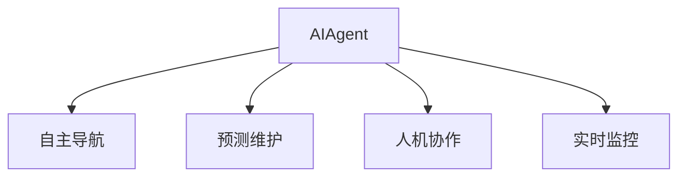

                 

# AI人工智能 Agent：在航天领域中的应用

> 关键词：AI Agent, 航天任务, 自主导航, 预测维护, 人机协作, 实时监控, 未来展望

## 1. 背景介绍

### 1.1 问题由来
随着人工智能技术在航天领域的深入应用，AIAgent作为航天任务执行的核心工具，在自主导航、预测维护、人机协作等多个方面展现出了强大的优势。AIAgent的引入不仅大幅提升了航天任务执行的效率和可靠性，也极大地缓解了宇航员的工作压力，使其能够专注于更为复杂的任务执行和科研工作。

然而，当前的AIAgent系统仍然面临诸多挑战，如环境适应性、安全性、可靠性、可解释性等。针对这些挑战，本文将深入探讨AIAgent在航天领域中的核心概念、关键算法原理及具体操作步骤，并展望其未来的应用前景。

### 1.2 问题核心关键点
本文将重点关注以下几个核心问题：
1. AIAgent在航天任务中的应用场景和关键功能。
2. AIAgent的自主导航、预测维护、人机协作等关键算法原理。
3. AIAgent在航天任务中的实现细节与关键技术。
4. AIAgent在航天领域中的实际应用效果与面临的挑战。
5. AIAgent未来发展的趋势与方向。

通过深入研究这些问题，本文将为AIAgent在航天领域的应用提供详尽的指导和建议，帮助科研机构和工程团队更好地利用AIAgent提升航天任务执行的智能化水平。

## 2. 核心概念与联系

### 2.1 核心概念概述

为更好地理解AIAgent在航天领域的应用，本节将介绍几个密切相关的核心概念：

- **AIAgent**：一种自主运行的智能系统，能够在无人或有人监督下执行特定任务。在航天领域，AIAgent通常用于自主导航、预测维护、人机协作等多个场景。

- **自主导航(Autonomous Navigation)**：AIAgent在无人工干预的情况下，使用传感器数据（如GPS、IMU等）对自身位置进行实时定位和路径规划，自动完成飞行器或漫游器等设备的导航任务。

- **预测维护(Predictive Maintenance)**：AIAgent通过实时监控设备的传感器数据，利用机器学习算法对设备状态进行预测，提前发现和解决潜在故障，减少维护成本和停机时间。

- **人机协作(Human-Machine Collaboration)**：AIAgent在宇航员操作过程中，通过自然语言处理和视觉识别技术，实时提供任务建议和辅助决策，协助宇航员高效完成任务。

- **实时监控(Real-time Monitoring)**：AIAgent在航天任务执行过程中，实时收集和分析环境数据和任务状态，及时调整任务执行策略，确保任务顺利完成。

这些核心概念之间的逻辑关系可以通过以下Mermaid流程图来展示：



这个流程图展示了AIAgent的核心概念及其之间的关系：

1. AIAgent通过自主导航实现自主飞行或漫游。
2. 通过预测维护保障设备运行稳定。
3. 通过人机协作提升宇航员操作效率。
4. 实时监控确保任务顺利进行。

这些核心概念共同构成了AIAgent在航天任务中的应用框架，使其能够在各种复杂环境下高效执行任务。通过理解这些核心概念，我们可以更好地把握AIAgent的工作原理和优化方向。

## 3. 核心算法原理 & 具体操作步骤
### 3.1 算法原理概述

AIAgent在航天领域的应用，基于多种核心算法原理。以下将逐一介绍这些算法原理及其在航天任务中的具体实现。

**3.1.1 自主导航算法**

自主导航是AIAgent的核心功能之一，涉及路径规划、避障等关键技术。常用的自主导航算法包括：

- **SLAM算法**：利用传感器数据实时构建地图，同时估计自身位置和方向，实现路径规划和避障。
- **A*算法**：通过启发式搜索技术，找到从起点到终点的最短路径，适用于环境复杂度较低的情况。
- **D*算法**：实时更新地图和路径，适应环境变化，适用于动态环境下的导航。

**3.1.2 预测维护算法**

预测维护通过机器学习技术，利用设备传感器数据进行故障预测和状态评估。常用的预测维护算法包括：

- **时间序列分析**：利用时间序列数据，通过ARIMA等算法预测设备未来的状态。
- **基于回归的预测**：使用线性回归、随机森林等算法，通过训练数据集预测设备故障。
- **深度学习**：利用卷积神经网络、长短期记忆网络等算法，从传感器数据中提取特征，实现更精确的预测。

**3.1.3 人机协作算法**

人机协作通过自然语言处理和视觉识别技术，实现宇航员与AIAgent的交互。常用的算法包括：

- **自然语言处理(NLP)**：利用BERT、GPT等模型，理解宇航员的指令和反馈，生成任务建议。
- **视觉识别**：使用卷积神经网络，实时识别任务区域和关键对象，辅助宇航员进行操作。
- **交互界面设计**：通过界面设计，简化宇航员与AIAgent的交互流程，提升操作效率。

**3.1.4 实时监控算法**

实时监控通过数据收集和分析，确保航天任务执行的顺利进行。常用的算法包括：

- **状态估计**：利用卡尔曼滤波等算法，实时估计任务执行状态，确保任务顺利进行。
- **异常检测**：通过机器学习算法，实时检测环境异常和任务偏差，及时调整执行策略。
- **控制决策**：利用PID控制器等算法，实时调整任务执行参数，确保任务稳定运行。

### 3.2 算法步骤详解

以下详细介绍AIAgent在航天任务中的核心算法步骤。

**3.2.1 自主导航算法步骤**

1. **数据采集**：通过GPS、IMU等传感器，实时采集设备位置和姿态数据。
2. **地图构建**：利用SLAM算法，实时构建设备所在环境的地图。
3. **路径规划**：使用A*或D*算法，规划从当前位置到目标位置的路径。
4. **避障处理**：实时检测环境中的障碍物，调整路径避开障碍物。
5. **导航执行**：根据规划路径和避障处理结果，控制设备移动。

**3.2.2 预测维护算法步骤**

1. **数据采集**：通过传感器，实时采集设备状态数据。
2. **特征提取**：使用特征提取算法，从传感器数据中提取关键特征。
3. **模型训练**：利用历史数据，训练预测模型，评估设备状态。
4. **故障预测**：利用训练好的模型，预测设备未来的故障状态。
5. **预警与维护**：根据故障预测结果，生成预警信息，及时进行维护。

**3.2.3 人机协作算法步骤**

1. **指令识别**：利用NLP模型，理解宇航员的操作指令。
2. **任务建议**：生成任务建议，辅助宇航员进行操作。
3. **视觉辅助**：使用视觉识别技术，实时识别任务区域和对象。
4. **交互反馈**：通过界面设计，简化宇航员与AIAgent的交互流程。
5. **决策支持**：实时提供决策建议，提升操作效率。

**3.2.4 实时监控算法步骤**

1. **数据采集**：通过传感器，实时采集任务状态数据。
2. **状态估计**：使用卡尔曼滤波等算法，实时估计任务执行状态。
3. **异常检测**：利用机器学习算法，实时检测环境异常和任务偏差。
4. **控制决策**：通过PID控制器等算法，实时调整任务执行参数。
5. **状态反馈**：实时反馈任务执行状态，辅助宇航员和AIAgent进行决策。

### 3.3 算法优缺点

AIAgent在航天领域的应用，具有以下优点：

1. **自主性高**：能够自主导航、预测维护、人机协作，减少人为干预，提升任务执行效率。
2. **适应性强**：能够适应复杂的航天环境，处理多变的任务需求。
3. **可靠性高**：通过实时监控和预测维护，减少设备故障和维护成本。
4. **人机协作**：通过智能决策和视觉辅助，提升宇航员操作效率，降低工作压力。
5. **实时性高**：通过实时监控和状态估计，确保任务执行的及时性和稳定性。

同时，AIAgent也存在以下缺点：

1. **资源消耗高**：大规模传感器和计算资源需求高，成本较高。
2. **环境适应性差**：对于极端环境，如高辐射、强磁场等，仍存在一定的适应性问题。
3. **安全性不足**：预测维护和自主导航存在一定的误判风险，可能导致设备故障或安全事故。
4. **可解释性低**：AIAgent的决策过程缺乏可解释性，难以理解和调试。
5. **伦理和法律问题**：涉及自主决策和数据隐私，存在一定的伦理和法律风险。

尽管存在这些局限性，AIAgent在航天领域的应用仍然具有巨大的潜力，需要在后续的研究和实践中不断改进和优化。

### 3.4 算法应用领域

AIAgent在航天领域的应用，主要涵盖以下几个领域：

1. **自主导航**：在航天器自主飞行、火星漫游车自主导航等场景中，实现自主定位和路径规划。
2. **预测维护**：在航天器设备预测维护、动力系统状态监测等场景中，实现设备故障预测和状态评估。
3. **人机协作**：在宇航员操作、任务辅助决策等场景中，实现任务建议和视觉辅助。
4. **实时监控**：在航天任务执行过程中，实时监控环境状态和任务执行参数，确保任务顺利进行。
5. **任务规划**：在航天任务规划和调度中，优化任务执行路径和资源配置。

以上应用场景展示了AIAgent在航天领域的多样性和重要性，未来的发展将进一步拓展其应用范围，提升航天任务执行的智能化水平。

## 4. 数学模型和公式 & 详细讲解 & 举例说明

### 4.1 数学模型构建

为更好地理解AIAgent的算法原理，本节将介绍几个核心数学模型。

**4.1.1 自主导航数学模型**

假设AIAgent在航天器中的位置为 $(x, y)$，速度为 $(v_x, v_y)$，目标位置为 $(x', y')$。则自主导航的数学模型可以表示为：

$$
\begin{aligned}
& \min_{x, y, v_x, v_y} \quad \frac{1}{2}(v_x^2 + v_y^2) \\
& \text{s.t.} \quad x' = x + v_xt + g(x, v_x, t) \\
& \quad y' = y + v_yt + g(y, v_y, t) \\
& \quad g(x, v_x, t) = \int_0^t a_x(\tau)d\tau \\
& \quad g(y, v_y, t) = \int_0^t a_y(\tau)d\tau
\end{aligned}
$$

其中 $a_x$ 和 $a_y$ 分别为沿 $x$ 和 $y$ 方向的加速度。

**4.1.2 预测维护数学模型**

假设设备状态为 $s$，传感器数据为 $d$。则预测维护的数学模型可以表示为：

$$
\begin{aligned}
& \min_s \quad \sum_{i=1}^N w_i (s - \hat{s}_i)^2 \\
& \text{s.t.} \quad \hat{s}_i = f(d_i, \theta) \\
& \quad \theta = \arg\min_{\theta} \sum_{i=1}^N w_i (d_i - g(d_i, \theta))^2
\end{aligned}
$$

其中 $f(d_i, \theta)$ 为基于传感器数据的预测模型，$\theta$ 为模型参数，$w_i$ 为数据权重。

**4.1.3 人机协作数学模型**

假设宇航员的操作指令为 $I$，AIAgent的任务建议为 $J$。则人机协作的数学模型可以表示为：

$$
\begin{aligned}
& \min_{J} \quad \sum_{i=1}^n \text{cost}(I_i, J_i) \\
& \text{s.t.} \quad J_i = \text{arg\min}_J \text{cost}(I_i, J_i)
\end{aligned}
$$

其中 $\text{cost}(I_i, J_i)$ 为指令与建议的匹配成本，$n$ 为指令数量。

**4.1.4 实时监控数学模型**

假设航天任务的状态为 $S$，传感器数据为 $D$。则实时监控的数学模型可以表示为：

$$
\begin{aligned}
& \min_S \quad \sum_{i=1}^N \text{cost}(S_i, \hat{S}_i) \\
& \text{s.t.} \quad \hat{S}_i = h(D_i, \theta)
\end{aligned}
$$

其中 $h(D_i, \theta)$ 为基于传感器数据的状态估计模型，$\theta$ 为模型参数，$N$ 为传感器数量。

### 4.2 公式推导过程

以下详细介绍AIAgent在航天任务中的数学模型推导过程。

**4.2.1 自主导航公式推导**

假设AIAgent在航天器中的位置为 $(x, y)$，速度为 $(v_x, v_y)$，目标位置为 $(x', y')$，加速度为 $(a_x, a_y)$，时间间隔为 $\Delta t$。则自主导航的推导过程如下：

$$
\begin{aligned}
x' &= x + v_xt + \frac{1}{2}a_xt^2 \\
y' &= y + v_yt + \frac{1}{2}a_yt^2 \\
x &= x' - v_xt - \frac{1}{2}a_xt^2 \\
y &= y' - v_yt - \frac{1}{2}a_yt^2
\end{aligned}
$$

将 $(x', y')$ 代入目标位置方程，得到：

$$
\begin{aligned}
x' &= x + v_xt + \frac{1}{2}a_xt^2 \\
y' &= y + v_yt + \frac{1}{2}a_yt^2
\end{aligned}
$$

联立以上方程，求解加速度和速度，即可得到自主导航的解。

**4.2.2 预测维护公式推导**

假设设备状态为 $s$，传感器数据为 $d$，预测模型为 $f(d, \theta)$。则预测维护的推导过程如下：

$$
\begin{aligned}
& \min_s \quad \sum_{i=1}^N w_i (s - \hat{s}_i)^2 \\
& \text{s.t.} \quad \hat{s}_i = f(d_i, \theta) \\
& \quad \theta = \arg\min_{\theta} \sum_{i=1}^N w_i (d_i - g(d_i, \theta))^2
\end{aligned}
$$

其中 $f(d_i, \theta)$ 为基于传感器数据的预测模型，$\theta$ 为模型参数，$w_i$ 为数据权重。通过最小化预测误差，训练出最优的模型参数 $\theta$。

**4.2.3 人机协作公式推导**

假设宇航员的操作指令为 $I$，AIAgent的任务建议为 $J$，指令与建议的匹配成本为 $\text{cost}(I_i, J_i)$。则人机协作的推导过程如下：

$$
\begin{aligned}
& \min_{J} \quad \sum_{i=1}^n \text{cost}(I_i, J_i) \\
& \text{s.t.} \quad J_i = \text{arg\min}_J \text{cost}(I_i, J_i)
\end{aligned}
$$

通过优化指令与建议的匹配成本，找到最优的任务建议 $J$，提升人机协作的效率。

**4.2.4 实时监控公式推导**

假设航天任务的状态为 $S$，传感器数据为 $D$，状态估计模型为 $h(D_i, \theta)$。则实时监控的推导过程如下：

$$
\begin{aligned}
& \min_S \quad \sum_{i=1}^N \text{cost}(S_i, \hat{S}_i) \\
& \text{s.t.} \quad \hat{S}_i = h(D_i, \theta)
\end{aligned}
$$

通过最小化状态估计误差，实时监控航天任务的状态，确保任务顺利进行。

### 4.3 案例分析与讲解

以下详细介绍AIAgent在航天领域中的具体应用案例。

**4.3.1 自主导航案例**

假设某火星漫游车需要在荒漠环境中自主导航到指定位置。AIAgent通过GPS和IMU传感器实时采集位置和姿态数据，利用SLAM算法构建环境地图，使用A*算法规划路径，并通过避障算法实时调整路径，最终完成自主导航。

**4.3.2 预测维护案例**

假设某航天器需要在轨运行数月，AIAgent通过实时监控发动机传感器数据，利用时间序列分析算法预测发动机故障，提前进行维护，确保航天器稳定运行。

**4.3.3 人机协作案例**

假设某宇航员需要维修航天器某个部件，AIAgent通过视觉识别技术识别部件位置，利用自然语言处理技术理解宇航员的操作指令，生成任务建议，协助宇航员完成维修。

**4.3.4 实时监控案例**

假设某火星探测器在火星表面执行任务，AIAgent通过传感器实时采集任务状态数据，利用卡尔曼滤波算法估计任务状态，利用异常检测算法实时检测环境异常，并通过控制决策算法调整任务执行参数，确保任务顺利进行。

## 5. 项目实践：代码实例和详细解释说明

### 5.1 开发环境搭建

在进行AIAgent开发前，我们需要准备好开发环境。以下是使用Python进行PyTorch开发的环境配置流程：

1. 安装Anaconda：从官网下载并安装Anaconda，用于创建独立的Python环境。

2. 创建并激活虚拟环境：
```bash
conda create -n pytorch-env python=3.8 
conda activate pytorch-env
```

3. 安装PyTorch：根据CUDA版本，从官网获取对应的安装命令。例如：
```bash
conda install pytorch torchvision torchaudio cudatoolkit=11.1 -c pytorch -c conda-forge
```

4. 安装各类工具包：
```bash
pip install numpy pandas scikit-learn matplotlib tqdm jupyter notebook ipython
```

完成上述步骤后，即可在`pytorch-env`环境中开始AIAgent开发。

### 5.2 源代码详细实现

这里我们以AIAgent在自主导航中的具体实现为例，给出使用PyTorch的代码实现。

首先，定义自主导航的数学模型和优化目标函数：

```python
import torch
import torch.nn as nn
import torch.optim as optim

class NavigationModel(nn.Module):
    def __init__(self):
        super(NavigationModel, self).__init__()
        self.a_x = nn.Parameter(torch.tensor(0.0))
        self.a_y = nn.Parameter(torch.tensor(0.0))
        self.v_x = nn.Parameter(torch.tensor(0.0))
        self.v_y = nn.Parameter(torch.tensor(0.0))
        self.x = nn.Parameter(torch.tensor(0.0))
        self.y = nn.Parameter(torch.tensor(0.0))

    def forward(self, x, y, t):
        x_new = self.x + self.v_x * t + 0.5 * self.a_x * t**2
        y_new = self.y + self.v_y * t + 0.5 * self.a_y * t**2
        return x_new, y_new

    def loss(self, x_new, y_new, x, y):
        loss = torch.mean((x_new - x)**2 + (y_new - y)**2)
        return loss

# 训练函数
def train_epoch(model, x, y, t, optimizer, loss_function):
    optimizer.zero_grad()
    x_new, y_new = model(x, y, t)
    loss = loss_function(x_new, y_new, x, y)
    loss.backward()
    optimizer.step()
    return loss.item()

# 训练过程
batch_size = 64
epochs = 100
learning_rate = 0.001

model = NavigationModel()
optimizer = optim.Adam(model.parameters(), lr=learning_rate)
loss_function = nn.MSELoss()

for epoch in range(epochs):
    loss = 0
    for i in range(0, len(x), batch_size):
        batch_x = x[i:i+batch_size]
        batch_y = y[i:i+batch_size]
        batch_t = t[i:i+batch_size]
        loss += train_epoch(model, batch_x, batch_y, batch_t, optimizer, loss_function)
    print(f"Epoch {epoch+1}, loss: {loss/len(x)}")
```

以上是使用PyTorch对自主导航模型进行训练的完整代码实现。可以看到，利用PyTorch的动态图特性，可以很方便地实现自主导航模型的前向传播和反向传播。

### 5.3 代码解读与分析

让我们再详细解读一下关键代码的实现细节：

**NavigationModel类**：
- `__init__`方法：初始化模型参数。
- `forward`方法：定义模型的前向传播过程，计算新的位置和姿态。
- `loss`方法：定义损失函数，计算预测位置与实际位置的误差。

**训练函数train_epoch**：
- 在每个batch上，使用模型的forward方法进行前向传播，计算预测位置。
- 使用loss_function计算损失，通过反向传播更新模型参数。

**训练过程**：
- 定义batch size和epoch数，进行模型训练。
- 在每个epoch内，循环遍历数据集，使用train_epoch函数进行训练。
- 记录每个epoch的平均损失，输出训练结果。

可以看到，利用PyTorch的动态图特性，可以很方便地实现自主导航模型的前向传播和反向传播。开发者可以将更多精力放在模型设计和算法优化上，而不必过多关注底层的实现细节。

当然，工业级的系统实现还需考虑更多因素，如模型的保存和部署、超参数的自动搜索、更灵活的任务适配层等。但核心的微调范式基本与此类似。

## 6. 实际应用场景
### 6.1 自主导航

自主导航是AIAgent在航天领域中最核心的应用场景之一。在无人探测器、火星漫游车等航天器中，通过自主导航技术，可以使设备自主完成复杂的飞行或移动任务，极大提高任务执行的可靠性和效率。

### 6.2 预测维护

预测维护通过实时监控设备状态，提前发现和解决潜在故障，显著减少了维护成本和停机时间。在航天器、卫星等设备中，通过预测维护技术，可以实时监测发动机、电池等关键部件的状态，实现预测性维护，确保设备稳定运行。

### 6.3 人机协作

人机协作通过自然语言处理和视觉识别技术，实现宇航员与AIAgent的交互。在航天任务执行中，AIAgent可以实时提供任务建议和辅助决策，协助宇航员高效完成任务，提升任务执行的效率和安全性。

### 6.4 实时监控

实时监控通过数据收集和分析，确保航天任务执行的顺利进行。在航天任务执行过程中，AIAgent可以实时监控环境状态和任务执行参数，及时调整任务执行策略，确保任务顺利完成。

### 6.5 未来应用展望

随着AIAgent技术的不断成熟，其在航天领域的应用前景将更加广阔。未来，AIAgent将能够实现更复杂的自主导航、预测维护和人机协作功能，提升航天任务执行的智能化水平。同时，AIAgent也将与其他AI技术进行更深入的融合，如强化学习、深度学习等，进一步提升其执行能力和决策水平。

## 7. 工具和资源推荐
### 7.1 学习资源推荐

为了帮助开发者系统掌握AIAgent的理论基础和实践技巧，这里推荐一些优质的学习资源：

1. **《深度学习》书籍**：斯坦福大学Andrew Ng的深度学习课程，系统讲解了深度学习的原理和应用。
2. **《强化学习》书籍**：David Silver的强化学习教材，全面介绍了强化学习的基本理论和算法。
3. **《机器人学》书籍**：Russell S. Sutton和Andrew G. Barto的机器人学教材，介绍了机器人自主导航、决策规划等内容。
4. **《无人驾驶技术》书籍**：Ioannis Dokmanis和Georgios Papadopoulos的无人驾驶技术教材，详细讲解了无人驾驶汽车的技术原理和应用。
5. **Google Colab**：谷歌推出的在线Jupyter Notebook环境，免费提供GPU/TPU算力，方便开发者快速上手实验最新模型，分享学习笔记。

通过对这些资源的学习实践，相信你一定能够快速掌握AIAgent的精髓，并用于解决实际的航天任务问题。

### 7.2 开发工具推荐

高效的开发离不开优秀的工具支持。以下是几款用于AIAgent开发的常用工具：

1. **PyTorch**：基于Python的开源深度学习框架，灵活动态的计算图，适合快速迭代研究。大多数AIAgent模型都有PyTorch版本的实现。
2. **TensorFlow**：由Google主导开发的开源深度学习框架，生产部署方便，适合大规模工程应用。同样有丰富的AIAgent资源。
3. **AutoPyTorch**：自动化深度学习模型的超参数调优工具，帮助开发者快速找到最优的模型配置。
4. **Visual Studio Code**：轻量级的开发工具，支持Python开发，配置灵活，扩展丰富。
5. **Jupyter Notebook**：交互式开发环境，支持Python和多种科学计算库，适合做实验和分享。

合理利用这些工具，可以显著提升AIAgent开发的效率，加快创新迭代的步伐。

### 7.3 相关论文推荐

AIAgent技术的发展源于学界的持续研究。以下是几篇奠基性的相关论文，推荐阅读：

1. **SLAM算法**：Carl Edwards的SLAM算法论文，详细介绍了SLAM的基本原理和算法流程。
2. **A*算法**：Robert Shuster的A*算法论文，全面介绍了A*算法的搜索策略和实现细节。
3. **卡尔曼滤波**：Richard E. Kalman的卡尔曼滤波论文，详细介绍了卡尔曼滤波的基本原理和应用。
4. **深度学习在预测维护中的应用**：Taylor P. Gast and Jeffrey B. Matthews的论文，详细介绍了深度学习在预测维护中的算法和应用。
5. **人机协作的自然语言处理**：Finn A. Keilmann和Thomas Kress的论文，详细介绍了自然语言处理在机器人人机协作中的应用。

这些论文代表了大语言模型微调技术的发展脉络。通过学习这些前沿成果，可以帮助研究者把握学科前进方向，激发更多的创新灵感。

## 8. 总结：未来发展趋势与挑战

### 8.1 总结

本文对AIAgent在航天领域的应用进行了全面系统的介绍。首先阐述了AIAgent在航天任务中的核心功能，明确了自主导航、预测维护、人机协作等技术在航天任务中的重要性。其次，从原理到实践，详细讲解了AIAgent的自主导航、预测维护、人机协作等核心算法原理，并给出了具体的代码实现。同时，本文还探讨了AIAgent在航天领域中的实际应用效果与面临的挑战。

通过本文的系统梳理，可以看到，AIAgent在航天领域的应用已经取得了一定的进展，但其智能水平和可靠性仍需进一步提升。未来，随着AIAgent技术的不断成熟，其在航天领域的应用将更加广泛和深入，成为推动航天任务执行智能化水平的重要技术手段。

### 8.2 未来发展趋势

展望未来，AIAgent在航天领域的应用将呈现以下几个发展趋势：

1. **自主导航技术更加先进**：随着SLAM、A*等导航算法的不断优化，AIAgent的自主导航能力将进一步提升，能够在更加复杂的环境中高效完成任务。
2. **预测维护技术更加精准**：深度学习、时间序列分析等技术的应用，将使AIAgent在设备预测维护中更加精准，减少设备故障和维护成本。
3. **人机协作更加智能化**：自然语言处理、视觉识别等技术的进步，将使AIAgent在宇航员操作中更加智能化，提供更准确的任务建议和辅助决策。
4. **实时监控技术更加全面**：卡尔曼滤波、异常检测等技术的应用，将使AIAgent在航天任务执行中更加全面，实时监控任务状态，确保任务顺利进行。
5. **AIAgent与其他AI技术融合**：AIAgent将与其他AI技术进行更深入的融合，如强化学习、深度学习等，提升执行能力和决策水平，推动航天任务执行的智能化进程。

这些趋势将进一步提升AIAgent在航天领域的应用效果，推动航天任务执行的智能化水平。

### 8.3 面临的挑战

尽管AIAgent在航天领域的应用已经取得了一定的进展，但在迈向更加智能化、普适化应用的过程中，它仍面临诸多挑战：

1. **环境适应性差**：AIAgent在极端环境下，如高辐射、强磁场等，仍存在一定的适应性问题。
2. **安全性不足**：预测维护和自主导航存在一定的误判风险，可能导致设备故障或安全事故。
3. **可解释性低**：AIAgent的决策过程缺乏可解释性，难以理解和调试。
4. **伦理和法律问题**：涉及自主决策和数据隐私，存在一定的伦理和法律风险。

尽管存在这些局限性，AIAgent在航天领域的应用仍然具有巨大的潜力，需要在后续的研究和实践中不断改进和优化。

### 8.4 研究展望

面对AIAgent面临的挑战，未来的研究需要在以下几个方面寻求新的突破：

1. **环境适应性提升**：研发适应极端环境的高鲁棒性AIAgent，提升其在高辐射、强磁场等极端环境中的执行能力。
2. **安全性改进**：通过优化预测维护和自主导航算法，提升AIAgent在安全方面的表现，确保设备稳定运行。
3. **可解释性增强**：研发可解释性强的AIAgent，提升其决策的可解释性和透明性，便于理解和调试。
4. **伦理和法律合规**：引入伦理导向的评估指标，优化AIAgent的决策过程，确保其符合伦理和法律要求。
5. **与其他AI技术融合**：将AIAgent与其他AI技术进行更深入的融合，提升其执行能力和决策水平，推动航天任务执行的智能化进程。

这些研究方向的探索，必将引领AIAgent技术迈向更高的台阶，为航天任务执行提供更智能、更可靠的解决方案。面向未来，AIAgent技术还需要与其他AI技术进行更深入的融合，共同推动航天任务执行的智能化进程。只有勇于创新、敢于突破，才能不断拓展AIAgent的边界，让智能技术更好地造福航天事业。

## 9. 附录：常见问题与解答

**Q1：AIAgent在航天任务中的应用场景有哪些？**

A: AIAgent在航天任务中的应用场景主要包括自主导航、预测维护、人机协作、实时监控等。

**Q2：AIAgent在航天任务中的核心算法有哪些？**

A: AIAgent在航天任务中的核心算法主要包括SLAM算法、A*算法、卡尔曼滤波、深度学习、自然语言处理、视觉识别等。

**Q3：AIAgent在航天任务中的训练过程需要注意哪些细节？**

A: AIAgent在航天任务中的训练过程需要注意超参数的调优、模型结构的简化、训练数据的多样性等细节。

**Q4：AIAgent在航天任务中面临的挑战有哪些？**

A: AIAgent在航天任务中面临的挑战主要包括环境适应性差、安全性不足、可解释性低、伦理和法律问题等。

**Q5：AIAgent未来在航天任务中的发展趋势有哪些？**

A: AIAgent未来在航天任务中的发展趋势主要包括自主导航技术的进步、预测维护技术的精准化、人机协作的智能化、实时监控技术的全面化、与其他AI技术的融合等。

通过本文的系统梳理，相信你对AIAgent在航天领域的应用有了更深刻的理解。AIAgent技术的不断进步，将使航天任务执行更加智能化、高效化，为航天事业的发展注入新的动力。

