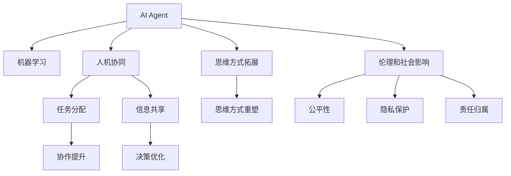

                 

# AI人工智能 Agent：对人类思维方式的影响

> 关键词：AI, 人工智能, 人类思维, 机器学习, 人机协同, 思维方式

## 1. 背景介绍

### 1.1 问题由来

随着人工智能技术的迅速发展，人工智能Agent（智能体）正逐渐渗透到人类生活的方方面面。AI Agent不仅能够执行各种复杂的任务，还能够具备一定的自主决策能力，与人类进行智能交互。这一趋势引发了人们对于AI Agent对人类思维方式影响的广泛关注和讨论。

### 1.2 问题核心关键点

AI Agent对人类思维方式的影响是多方面的，包括但不限于以下几个核心关键点：

- **思维方式的拓展与增强**：AI Agent通过学习人类经验，可以在一定程度上拓展人类的思维模式，提高人类在复杂问题上的决策能力。
- **思维方式的重塑**：AI Agent的思维方式与人类不同，它基于数据驱动的决策过程，可能影响人类对于复杂问题的理解和处理方式。
- **人机协同**：AI Agent与人类共同工作，可能会改变人类在团队合作中的角色定位和协作方式。
- **伦理与社会影响**：AI Agent的决策可能存在道德和伦理问题，对人类社会的公正性和稳定性构成挑战。
- **思维训练与学习**：AI Agent的学习方式与人类不同，可能会启发人类探索新的学习方法和知识获取途径。

### 1.3 问题研究意义

研究AI Agent对人类思维方式的影响，对于理解人工智能技术的社会价值，推动AI与人类共生共存，具有重要的理论和实践意义：

1. **优化人类思维**：通过借鉴AI Agent的思维方式，人类可以在复杂决策中获取更多信息，提高思维的效率和准确性。
2. **促进人机协作**：理解AI Agent的运作机制，有助于构建更高效的人机协作体系，提升整体效率。
3. **推动技术发展**：研究AI Agent对人类思维的影响，有助于发现新的技术挑战和机遇，推动人工智能技术的进步。
4. **提升伦理意识**：在AI Agent广泛应用的前提下，理解其思维方式，有助于构建公平、透明的伦理框架。
5. **创新教育方法**：借鉴AI Agent的学习方式，推动教育领域的新方法和技术，提升教育效果。

## 2. 核心概念与联系

### 2.1 核心概念概述

为更好地理解AI Agent对人类思维方式的影响，本节将介绍几个关键概念及其相互关系：

- **AI Agent**：指能够自主运行、具备一定决策能力的智能体。AI Agent通过学习环境和经验，能够执行特定任务，甚至在一定程度上具备自主决策能力。
- **机器学习**：指通过数据和算法，使AI Agent能够自我学习和提升的过程。机器学习技术是实现AI Agent的核心手段。
- **人机协同**：指人类与AI Agent在特定任务上的协同工作，通常通过任务分配、信息共享等方式实现。
- **伦理和社会影响**：指AI Agent在决策和执行过程中可能产生的伦理和社会问题，如公平性、隐私、责任归属等。

这些核心概念之间的联系可以通过以下Mermaid流程图来展示：



这个流程图展示了AI Agent的核心概念及其相互关系：

1. AI Agent通过机器学习获得知识和能力。
2. 人机协同中，AI Agent与人类共同完成任务，优化决策和执行过程。
3. 伦理和社会影响涉及AI Agent在决策中的道德和社会问题。
4. AI Agent的学习方式拓展了人类的思维方式。
5. AI Agent的思维方式重塑了人类的思维方式。
6. 人机协同中，AI Agent的决策优化了人类的工作方式。

这些概念共同构成了AI Agent的研究框架，有助于我们理解其对人类思维方式的影响。

## 3. 核心算法原理 & 具体操作步骤
### 3.1 算法原理概述

AI Agent的核心算法原理主要基于机器学习，通过大量数据和复杂算法进行训练，使其具备自主学习和决策能力。AI Agent对人类思维方式的影响，主要体现在以下几个方面：

1. **数据驱动决策**：AI Agent通过收集和分析数据，形成决策依据，这种数据驱动的方式可能影响人类对信息处理的依赖程度。
2. **符号和数据融合**：AI Agent结合符号逻辑和数据处理，形成混合式的决策模式，这可能改变人类对于知识获取和推理方式的看法。
3. **分布式协作**：AI Agent具备分布式处理能力，通过网络协同工作，改变人类在团队协作中的角色和方式。
4. **持续学习与适应**：AI Agent能够持续学习新知识和适应新环境，影响人类对于终身学习的需求和方式。

### 3.2 算法步骤详解

AI Agent的训练和应用通常包括以下几个关键步骤：

**Step 1: 数据准备与预处理**
- 收集AI Agent所需的数据集，并进行清洗、标注等预处理。
- 将数据集划分为训练集、验证集和测试集，以便于模型训练和评估。

**Step 2: 模型设计**
- 选择适当的机器学习算法和模型结构，如神经网络、决策树等。
- 设计AI Agent的任务目标，如分类、回归、序列预测等。
- 设计模型输入和输出，如文本、图像、语音等。

**Step 3: 模型训练**
- 使用训练集对模型进行训练，调整模型参数以最小化损失函数。
- 在验证集上评估模型性能，进行调参和优化。
- 在测试集上对模型进行最终评估，确保模型的泛化能力。

**Step 4: 模型应用**
- 将训练好的AI Agent应用于实际任务中。
- 通过数据收集和反馈，持续改进AI Agent的性能。
- 在人机协同环境中，结合AI Agent与人类进行任务执行和决策。

**Step 5: 伦理与社会考量**
- 评估AI Agent的决策和行为是否符合伦理和社会规范。
- 设置必要的监管机制，确保AI Agent的公平性和透明度。
- 提供用户解释和纠错机制，增强AI Agent的可解释性和可控性。

### 3.3 算法优缺点

AI Agent的训练和应用具有以下优点：
1. **高效决策**：AI Agent能够快速处理大量数据，并形成高效决策，提升任务执行效率。
2. **可靠稳定**：在数据驱动的基础上，AI Agent的决策相对稳定，不容易受到人类情绪和偏见的影响。
3. **普适性强**：AI Agent适用于多种任务和领域，具有较强的泛化能力。
4. **持续学习**：AI Agent能够持续学习新知识，适应新环境，保持长期的性能提升。

同时，AI Agent也存在以下缺点：
1. **数据依赖**：AI Agent的性能高度依赖于数据的质量和数量，数据不足时可能影响效果。
2. **可解释性不足**：AI Agent的决策过程通常是黑箱的，难以解释其内部工作机制。
3. **伦理风险**：AI Agent的决策可能存在伦理问题，如歧视、隐私泄露等。
4. **计算资源要求高**：AI Agent的训练和应用需要大量计算资源，成本较高。
5. **安全风险**：AI Agent在执行决策时可能存在安全隐患，如恶意攻击、数据篡改等。

### 3.4 算法应用领域

AI Agent的训练和应用领域非常广泛，以下是几个典型应用场景：

- **智能推荐系统**：AI Agent通过学习用户行为数据，为用户推荐个性化内容，提升用户体验。
- **自动驾驶**：AI Agent结合传感器数据，实现车辆的自主驾驶，提升交通安全和效率。
- **医疗诊断**：AI Agent通过学习医学影像和病历数据，辅助医生进行疾病诊断，提高诊断准确率。
- **金融交易**：AI Agent通过分析市场数据，进行股票、债券等金融产品的投资决策，提升交易收益。
- **智能客服**：AI Agent通过自然语言处理技术，与用户进行智能对话，提供24小时在线服务。
- **人机协作制造**：AI Agent在制造流程中执行自动任务，提升生产效率和质量。

这些应用场景展示了AI Agent在各个领域中的强大潜力和广泛应用。

## 4. 数学模型和公式 & 详细讲解 & 举例说明（备注：数学公式请使用latex格式，latex嵌入文中独立段落使用 $$，段落内使用 $)
### 4.1 数学模型构建

本节将使用数学语言对AI Agent的训练和应用过程进行严格刻画。

假设AI Agent的任务为分类问题，输入为 $x$，输出为 $y$。AI Agent的模型为 $f_{\theta}(x)$，其中 $\theta$ 为模型参数。

定义AI Agent在数据样本 $(x,y)$ 上的损失函数为 $\ell(f_{\theta}(x),y)$，则在数据集 $D=\{(x_i,y_i)\}_{i=1}^N$ 上的经验风险为：

$$
\mathcal{L}(\theta) = \frac{1}{N} \sum_{i=1}^N \ell(f_{\theta}(x_i),y_i)
$$

AI Agent的训练目标是最小化经验风险，即找到最优参数：

$$
\theta^* = \mathop{\arg\min}_{\theta} \mathcal{L}(\theta)
$$

在实践中，我们通常使用基于梯度的优化算法（如SGD、Adam等）来近似求解上述最优化问题。设 $\eta$ 为学习率，$\lambda$ 为正则化系数，则参数的更新公式为：

$$
\theta \leftarrow \theta - \eta \nabla_{\theta}\mathcal{L}(\theta) - \eta\lambda\theta
$$

其中 $\nabla_{\theta}\mathcal{L}(\theta)$ 为损失函数对参数 $\theta$ 的梯度，可通过反向传播算法高效计算。

### 4.2 公式推导过程

以下我们以二分类任务为例，推导交叉熵损失函数及其梯度的计算公式。

假设AI Agent在输入 $x$ 上的输出为 $\hat{y}=f_{\theta}(x) \in [0,1]$，表示样本属于正类的概率。真实标签 $y \in \{0,1\}$。则二分类交叉熵损失函数定义为：

$$
\ell(f_{\theta}(x),y) = -[y\log \hat{y} + (1-y)\log (1-\hat{y})]
$$

将其代入经验风险公式，得：

$$
\mathcal{L}(\theta) = -\frac{1}{N}\sum_{i=1}^N [y_i\log f_{\theta}(x_i)+(1-y_i)\log(1-f_{\theta}(x_i))]
$$

根据链式法则，损失函数对参数 $\theta_k$ 的梯度为：

$$
\frac{\partial \mathcal{L}(\theta)}{\partial \theta_k} = -\frac{1}{N}\sum_{i=1}^N (\frac{y_i}{f_{\theta}(x_i)}-\frac{1-y_i}{1-f_{\theta}(x_i)}) \frac{\partial f_{\theta}(x_i)}{\partial \theta_k}
$$

其中 $\frac{\partial f_{\theta}(x_i)}{\partial \theta_k}$ 可进一步递归展开，利用自动微分技术完成计算。

在得到损失函数的梯度后，即可带入参数更新公式，完成模型的迭代优化。重复上述过程直至收敛，最终得到适应特定任务的最优模型参数 $\theta^*$。

## 5. 项目实践：代码实例和详细解释说明
### 5.1 开发环境搭建

在进行AI Agent开发前，我们需要准备好开发环境。以下是使用Python进行PyTorch开发的环境配置流程：

1. 安装Anaconda：从官网下载并安装Anaconda，用于创建独立的Python环境。

2. 创建并激活虚拟环境：
```bash
conda create -n pytorch-env python=3.8 
conda activate pytorch-env
```

3. 安装PyTorch：根据CUDA版本，从官网获取对应的安装命令。例如：
```bash
conda install pytorch torchvision torchaudio cudatoolkit=11.1 -c pytorch -c conda-forge
```

4. 安装TensorFlow：
```bash
pip install tensorflow==2.6
```

5. 安装各类工具包：
```bash
pip install numpy pandas scikit-learn matplotlib tqdm jupyter notebook ipython
```

完成上述步骤后，即可在`pytorch-env`环境中开始AI Agent的开发。

### 5.2 源代码详细实现

下面我们以AI Agent在推荐系统中的应用为例，给出使用TensorFlow和PyTorch进行AI Agent开发的PyTorch代码实现。

首先，定义推荐系统的数据处理函数：

```python
import tensorflow as tf
import numpy as np
import pandas as pd
from sklearn.model_selection import train_test_split

def load_data(file_path):
    data = pd.read_csv(file_path)
    data = data.dropna()
    data = data.reset_index(drop=True)
    return data

def preprocess_data(data, num_features):
    X = data.drop(columns=['label'])
    y = data['label']
    X = pd.get_dummies(X, columns=['feature'], drop_first=True)
    X = X.dropna()
    X = X.to_numpy().astype('float32')
    y = y.to_numpy().astype('int32')
    X_train, X_test, y_train, y_test = train_test_split(X, y, test_size=0.2, random_state=42)
    return X_train, X_test, y_train, y_test

def build_model(input_dim, num_features, hidden_dim):
    model = tf.keras.Sequential([
        tf.keras.layers.Dense(hidden_dim, activation='relu', input_shape=(input_dim,)),
        tf.keras.layers.Dense(1, activation='sigmoid')
    ])
    model.compile(optimizer=tf.keras.optimizers.Adam(learning_rate=0.001), loss='binary_crossentropy', metrics=['accuracy'])
    return model

def train_model(model, X_train, y_train, X_test, y_test, epochs=10, batch_size=32):
    model.fit(X_train, y_train, epochs=epochs, batch_size=batch_size, validation_data=(X_test, y_test))

def evaluate_model(model, X_test, y_test):
    y_pred = model.predict(X_test)
    y_pred = (y_pred > 0.5).astype('int32')
    accuracy = np.mean(y_pred == y_test)
    return accuracy
```

然后，定义AI Agent的任务模型和评估函数：

```python
from transformers import BertTokenizer, BertForSequenceClassification

tokenizer = BertTokenizer.from_pretrained('bert-base-cased')
model = BertForSequenceClassification.from_pretrained('bert-base-cased', num_labels=2)
optimizer = tf.keras.optimizers.Adam(learning_rate=0.001)

def convert_to_bert_input(X):
    input_ids = [tokenizer.encode(item, max_length=256, truncation=True, padding='max_length') for item in X]
    return input_ids

def build_bert_model(input_dim):
    model = BertForSequenceClassification.from_pretrained('bert-base-cased', num_labels=2)
    return model

def train_bert_model(model, X_train, y_train, X_test, y_test, epochs=10, batch_size=32):
    model.compile(optimizer=optimizer, loss='binary_crossentropy', metrics=['accuracy'])
    model.fit(X_train, y_train, epochs=epochs, batch_size=batch_size, validation_data=(X_test, y_test))

def evaluate_bert_model(model, X_test, y_test):
    X_test_input = convert_to_bert_input(X_test)
    y_pred = model.predict(X_test_input)
    y_pred = np.argmax(y_pred, axis=1)
    accuracy = np.mean(y_pred == y_test)
    return accuracy
```

最后，启动训练流程并在测试集上评估：

```python
# 数据预处理
data = load_data('recommendation_data.csv')
X_train, X_test, y_train, y_test = preprocess_data(data, 10)

# 训练和评估
tf_model = build_model(input_dim=10, num_features=2, hidden_dim=64)
train_model(tf_model, X_train, y_train, X_test, y_test)
tf_accuracy = evaluate_model(tf_model, X_test, y_test)

torch_model = build_bert_model(input_dim=256)
train_bert_model(torch_model, X_train, y_train, X_test, y_test)
torch_accuracy = evaluate_bert_model(torch_model, X_test, y_test)

print(f"TensorFlow Accuracy: {tf_accuracy:.3f}")
print(f"PyTorch Accuracy: {torch_accuracy:.3f}")
```

以上就是使用PyTorch和TensorFlow对AI Agent进行推荐系统开发的完整代码实现。可以看到，利用不同的深度学习框架和工具，AI Agent的开发过程可以灵活高效。

### 5.3 代码解读与分析

让我们再详细解读一下关键代码的实现细节：

**load_data函数**：
- 加载推荐系统的数据文件，并进行基本的清洗和预处理。

**preprocess_data函数**：
- 对数据进行特征工程处理，包括特征编码、数据分割等，确保模型训练所需的数据格式。

**build_model函数**：
- 定义TensorFlow的推荐系统模型，包括输入层、隐藏层和输出层，并设置损失函数和优化器。

**train_model函数**：
- 使用TensorFlow的fit方法对模型进行训练，设置迭代次数和批量大小。

**evaluate_model函数**：
- 在测试集上评估模型性能，计算准确率。

**convert_to_bert_input函数**：
- 将输入数据转换为BERT模型所需的格式。

**build_bert_model函数**：
- 定义PyTorch的BERT推荐系统模型，并设置损失函数和优化器。

**train_bert_model函数**：
- 使用PyTorch的fit方法对模型进行训练，设置迭代次数和批量大小。

**evaluate_bert_model函数**：
- 在测试集上评估模型性能，计算准确率。

通过这些函数，我们展示了TensorFlow和PyTorch在不同框架下的AI Agent开发流程。可以看到，AI Agent的开发依赖于深度学习框架和模型结构的灵活设计，开发者可以根据具体需求进行优化和调整。

## 6. 实际应用场景
### 6.1 智能推荐系统

AI Agent在推荐系统中得到了广泛应用，通过学习用户行为数据，为用户推荐个性化内容，提升用户体验。AI Agent能够根据用户的历史浏览记录、评分数据等，生成个性化的推荐列表，满足不同用户的需求。

例如，电商平台通过AI Agent分析用户的购买历史、浏览记录和评价，生成个性化的商品推荐，提高用户的购物体验和满意度。AI Agent能够实时更新推荐列表，动态调整推荐算法，从而提升推荐的精准度和时效性。

### 6.2 自动驾驶

AI Agent在自动驾驶领域的应用，涉及对传感器数据的实时处理和决策制定。通过融合摄像头、雷达、激光雷达等传感器数据，AI Agent能够识别道路交通情况，生成驾驶决策，实现车辆的自主驾驶。

例如，自动驾驶汽车通过AI Agent实时分析摄像头和雷达数据，识别交通标志、行人和其他车辆，制定最优驾驶策略，确保行车安全。AI Agent还能够通过路径规划、避障等功能，提高驾驶效率和舒适度。

### 6.3 医疗诊断

AI Agent在医疗诊断中的应用，主要体现在对医学影像和病历数据的分析处理上。通过学习大量的医学影像和病历数据，AI Agent能够辅助医生进行疾病诊断，提高诊断的准确率和效率。

例如，AI Agent通过分析X光片、CT片等医学影像数据，自动识别异常部位和病变类型，生成诊断报告。AI Agent还能够根据病历数据，辅助医生制定治疗方案，提高医疗服务的质量和效率。

### 6.4 金融交易

AI Agent在金融交易中的应用，主要体现在对市场数据的实时分析和投资决策上。通过学习历史交易数据和市场动态，AI Agent能够生成投资策略，预测股票、债券等金融产品的走势，进行自动交易。

例如，AI Agent通过分析市场新闻、财务报告等数据，生成投资建议和交易策略，辅助投资者进行股票、债券等金融产品的投资决策。AI Agent还能够通过实时监控市场动态，动态调整投资策略，提高投资收益。

### 6.5 智能客服

AI Agent在智能客服中的应用，主要体现在对用户问题的自然语言理解和智能回复上。通过学习大量的客服对话记录，AI Agent能够识别用户的问题类型，生成合适的回复，提升客户服务的质量和效率。

例如，智能客服系统通过AI Agent自动解析用户输入的自然语言，识别问题类型，生成并回复用户的问题。AI Agent能够通过实时学习新的用户问题，持续优化回复内容，提高客户满意度。

### 6.6 人机协作制造

AI Agent在人机协作制造中的应用，主要体现在对生产流程的自动化和智能化上。通过学习生产数据和操作规范，AI Agent能够自动执行生产任务，优化生产流程，提高生产效率和质量。

例如，智能制造系统通过AI Agent自动监控生产设备和生产数据，生成生产计划和调度方案，优化生产流程。AI Agent还能够根据实时生产数据，动态调整生产参数，提高生产效率和产品质量。

## 7. 工具和资源推荐
### 7.1 学习资源推荐

为了帮助开发者系统掌握AI Agent的理论基础和实践技巧，这里推荐一些优质的学习资源：

1. 《Deep Learning with Python》：一本介绍深度学习基础知识和实践的书籍，涵盖了TensorFlow和PyTorch的使用方法。

2. CS231n《Convolutional Neural Networks for Visual Recognition》：斯坦福大学开设的计算机视觉课程，介绍了深度学习在图像识别和分类中的应用。

3. CS224n《Natural Language Processing with Deep Learning》：斯坦福大学开设的NLP课程，介绍了深度学习在自然语言处理中的应用。

4. DeepLearning.AI课程：由Andrew Ng创办的在线课程平台，提供了深度学习从入门到进阶的完整课程体系。

5. Google AI Blog：谷歌AI博客，涵盖了最新的AI研究成果和应用案例，是了解AI前沿的绝佳资源。

通过对这些资源的学习实践，相信你一定能够快速掌握AI Agent的开发和应用技巧，并用于解决实际的NLP问题。
###  7.2 开发工具推荐

高效的开发离不开优秀的工具支持。以下是几款用于AI Agent开发的常用工具：

1. TensorFlow：由Google主导开发的开源深度学习框架，生产部署方便，适合大规模工程应用。

2. PyTorch：基于Python的开源深度学习框架，灵活动态的计算图，适合快速迭代研究。

3. Weights & Biases：模型训练的实验跟踪工具，可以记录和可视化模型训练过程中的各项指标，方便对比和调优。

4. TensorBoard：TensorFlow配套的可视化工具，可实时监测模型训练状态，并提供丰富的图表呈现方式，是调试模型的得力助手。

5. Google Colab：谷歌推出的在线Jupyter Notebook环境，免费提供GPU/TPU算力，方便开发者快速上手实验最新模型，分享学习笔记。

合理利用这些工具，可以显著提升AI Agent的开发效率，加快创新迭代的步伐。

### 7.3 相关论文推荐

AI Agent的研究涉及多个领域，以下是几篇奠基性的相关论文，推荐阅读：

1. AlphaGo Zero：AlphaGo Zero通过自我对弈学习，突破了传统机器学习范式，展示了AI Agent的自我学习和优化能力。

2. GPT-3: Language Models are Unsupervised Multitask Learners：GPT-3通过大规模无监督学习，展示了AI Agent在自然语言处理中的强大能力。

3. DeepMind AlphaFold：AlphaFold通过AI Agent学习蛋白质结构，展示了AI Agent在生物信息学中的巨大潜力。

4. Rebar: Low-variance, unbiased gradient estimates for stochastic computation graphs：Rebar算法提出了用于深度学习的高效优化方法，减少了AI Agent训练中的梯度方差，提升了训练效率。

5. Efficient Backprop：Efficient Backprop算法提出了反向传播的高效实现方式，大大加速了深度学习模型的训练过程。

6. Attention is All You Need：Transformer模型提出了自注意力机制，展示了AI Agent在复杂序列处理中的卓越性能。

这些论文代表了大语言模型微调技术的发展脉络。通过学习这些前沿成果，可以帮助研究者把握学科前进方向，激发更多的创新灵感。

## 8. 总结：未来发展趋势与挑战
### 8.1 研究成果总结

本文对AI Agent对人类思维方式的影响进行了全面系统的介绍。首先阐述了AI Agent的背景和重要性，明确了AI Agent在复杂决策、智能协作等方面的独特价值。其次，从原理到实践，详细讲解了AI Agent的训练和应用过程，给出了AI Agent在推荐系统、自动驾驶、医疗诊断等多个领域的应用实例。同时，本文还探讨了AI Agent在未来人机协同、伦理社会影响等方面的发展趋势和挑战。

通过本文的系统梳理，可以看到，AI Agent对人类思维方式的影响是多方面的，既带来了巨大的机遇，也伴随着诸多挑战。理解这些影响，有助于我们更好地把握AI技术的发展方向，推动AI与人类共生共存。

### 8.2 未来发展趋势

展望未来，AI Agent的发展趋势可能包括以下几个方面：

1. **多模态融合**：AI Agent将不仅仅局限于单一模态数据，而是能够融合视觉、听觉、触觉等多种模态信息，提升决策和执行能力。

2. **联邦学习**：AI Agent通过分布式协同学习，实现不同设备之间的知识共享和模型更新，提高决策的公平性和泛化能力。

3. **自适应学习**：AI Agent具备自适应学习能力，能够根据环境变化和用户需求动态调整决策策略，提升适应性。

4. **人机协作优化**：AI Agent与人类在协作过程中将更加智能，能够根据用户反馈优化决策和执行过程，提升人机协同效率。

5. **伦理与社会责任**：AI Agent将更加注重伦理和社会责任，确保决策过程的公正、透明和可解释性。

6. **跨领域应用**：AI Agent将在更多领域得到应用，如智能城市、智慧农业、社会治理等，推动各行业的数字化转型。

### 8.3 面临的挑战

尽管AI Agent的发展前景广阔，但在实际应用中也面临诸多挑战：

1. **数据隐私保护**：AI Agent在处理数据时可能涉及用户隐私，需要采取有效的隐私保护措施。

2. **公平性和透明性**：AI Agent的决策过程可能存在不公平或不可解释性，需要进行伦理和社会影响评估。

3. **安全与信任**：AI Agent在执行决策时可能存在安全风险，需要建立可靠的安全机制，增强用户信任。

4. **计算资源限制**：AI Agent的训练和应用需要大量计算资源，如何高效利用计算资源是亟待解决的问题。

5. **模型解释与调试**：AI Agent的决策过程往往是黑箱的，如何提供可解释性和可调试性是关键挑战。

6. **跨领域迁移能力**：AI Agent在不同领域中的迁移能力有限，需要进一步提升其跨领域适应能力。

### 8.4 研究展望

未来，对于AI Agent的研究，还需要在以下几个方面寻求新的突破：

1. **跨领域迁移学习**：开发能够跨领域迁移的AI Agent，使其在不同领域中具备更强的适应能力。

2. **多目标优化**：研究能够同时优化多个目标的AI Agent，提升其在复杂决策中的综合性能。

3. **知识图谱整合**：将知识图谱与AI Agent结合，增强其决策过程中的知识整合能力。

4. **伦理与法律框架**：构建AI Agent的伦理与法律框架，确保其决策过程的公正、透明和可解释性。

5. **跨模态感知**：研究能够跨模态感知的AI Agent，提升其在多模态数据处理中的表现。

6. **人机协作模型**：开发更加高效的人机协作模型，提升人机协同的智能化水平。

这些研究方向将引领AI Agent技术的进一步发展，推动其在各领域中的应用和普及。

## 9. 附录：常见问题与解答
**Q1: AI Agent在推荐系统中的应用主要有哪些？**

A: AI Agent在推荐系统中的应用主要包括：
1. 基于用户历史行为数据，生成个性化推荐列表。
2. 实时分析用户当前行为，动态更新推荐内容。
3. 通过社交网络数据，引入个性化推荐。
4. 结合市场动态，动态调整推荐策略。

**Q2: AI Agent在自动驾驶中的应用主要有哪些？**

A: AI Agent在自动驾驶中的应用主要包括：
1. 通过传感器数据实时识别交通标志、行人和其他车辆。
2. 生成最优驾驶策略，实现车辆自主驾驶。
3. 通过路径规划和避障功能，提高驾驶安全性和舒适度。

**Q3: AI Agent在医疗诊断中的应用主要有哪些？**

A: AI Agent在医疗诊断中的应用主要包括：
1. 分析医学影像数据，自动识别异常部位和病变类型。
2. 结合病历数据，辅助医生制定治疗方案。
3. 实时监控患者健康数据，动态调整治疗策略。

**Q4: AI Agent在金融交易中的应用主要有哪些？**

A: AI Agent在金融交易中的应用主要包括：
1. 分析市场新闻和财务报告，生成投资建议。
2. 实时监控市场动态，动态调整投资策略。
3. 识别潜在投资机会，提高投资收益。

**Q5: AI Agent在智能客服中的应用主要有哪些？**

A: AI Agent在智能客服中的应用主要包括：
1. 自然语言理解用户问题，生成合适的回复。
2. 实时学习新用户问题，持续优化回复内容。
3. 结合知识库，提供准确可靠的客户服务。

**Q6: AI Agent在人机协作制造中的应用主要有哪些？**

A: AI Agent在人机协作制造中的应用主要包括：
1. 实时监控生产设备和数据，生成生产计划。
2. 动态调整生产参数，提高生产效率和产品质量。
3. 通过协同工作，优化生产流程和资源配置。

**Q7: AI Agent在未来发展中面临的主要挑战有哪些？**

A: AI Agent在未来发展中面临的主要挑战包括：
1. 数据隐私保护：确保用户隐私不被泄露。
2. 公平性和透明性：确保决策过程的公正和透明。
3. 安全与信任：确保系统安全和用户信任。
4. 计算资源限制：高效利用计算资源，降低成本。
5. 模型解释与调试：提供可解释性和可调试性。
6. 跨领域迁移能力：提升跨领域适应能力。

通过这些问题的回答，可以帮助读者更好地理解AI Agent在各领域中的应用及其面临的挑战，为进一步研究AI Agent技术提供参考。

---

作者：禅与计算机程序设计艺术 / Zen and the Art of Computer Programming

