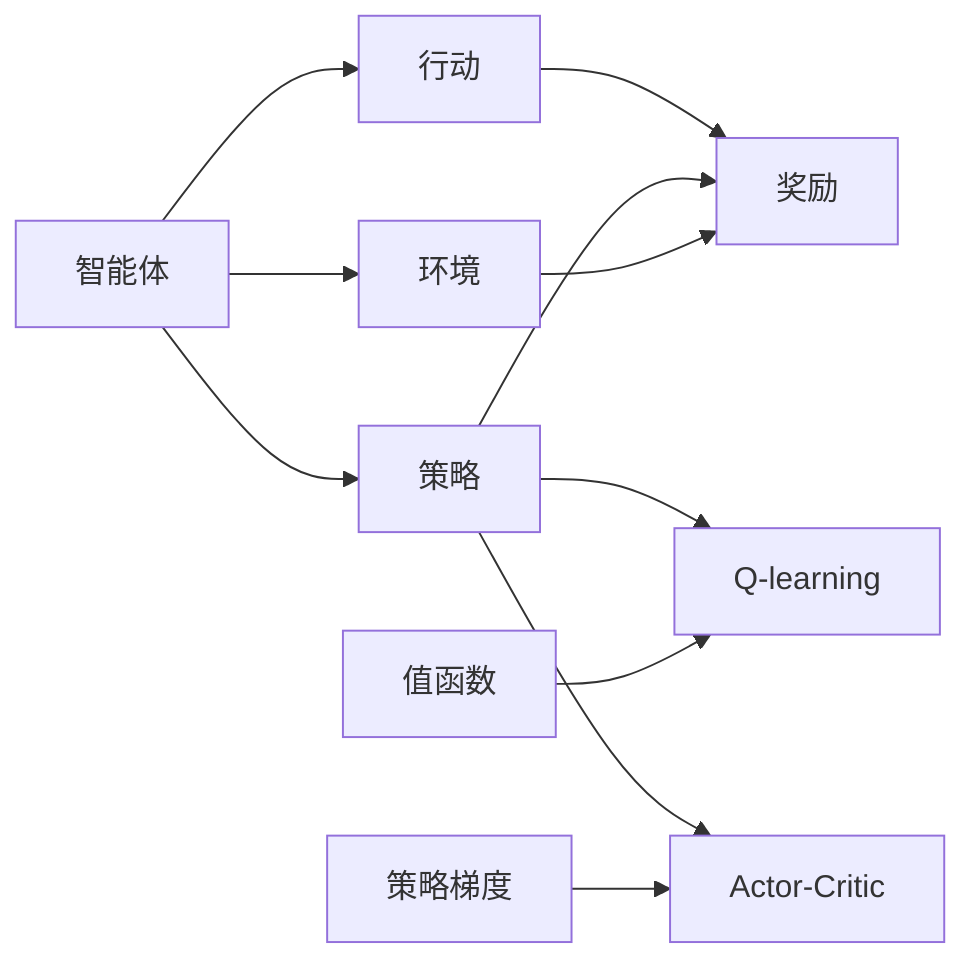

                 

# AI人工智能 Agent：智能体策略迭代与优化

> 关键词：智能体,强化学习,策略优化,算法选择,环境模型,决策过程

## 1. 背景介绍

### 1.1 问题由来

随着人工智能技术的飞速发展，智能体(Agent)在各行各业中应用日益广泛，如自动驾驶、机器人控制、金融交易、游戏AI等。这些智能体依赖于复杂的决策系统，在动态变化的环境中进行交互和学习。然而，传统的决策方法往往基于静态模型和局部最优，难以应对多变和复杂的现实世界环境。

近年来，强化学习(Reinforcement Learning, RL)作为求解智能体最优策略的有效方法，吸引了大量研究者的关注。强化学习通过智能体在环境中与目标互动，利用奖励信号不断调整策略，优化决策行为。然而，在实际应用中，智能体决策过程可能面临参数过拟合、环境模型不确定、策略优化复杂等问题，阻碍了其在真实场景中的高效应用。

为此，本文将系统介绍基于强化学习的智能体策略迭代与优化方法。首先，我们将介绍智能体的核心概念和算法框架，接着阐述如何选择合适的算法和环境模型，最后结合具体应用场景，展示参数迭代和优化策略的实施方法。通过深入剖析强化学习在智能体决策中的表现和优化路径，本文旨在为智能体的策略迭代与优化提供全面、系统的理论指导和实践建议。

## 2. 核心概念与联系

### 2.1 核心概念概述

为了更好地理解智能体的策略迭代与优化，本节将介绍几个核心概念及其相互联系：

- **智能体(Agent)**：在环境中通过与环境交互，执行决策并接收反馈的实体。智能体的行为由策略决定，策略的选择和优化是强化学习的重要研究目标。

- **环境(Environment)**：智能体执行决策的外部世界，提供智能体行动后接收到的奖励或惩罚。环境模型的准确性直接影响智能体的学习效果。

- **策略(Policy)**：智能体在给定状态(state)下选择行动(action)的规则或函数。策略优化是强化学习的主要目标。

- **奖励函数(Reward Function)**：根据智能体的行为和环境状态，提供正负奖励的函数。奖励函数的设计直接影响智能体的学习目标和方向。

- **值函数(Value Function)**：评估智能体在不同状态(state)下，采取特定行动(action)后，预期获得的长期奖励。

- **Q-learning**：一种基于值函数逼近的强化学习算法，通过状态-行动对(states-action)的Q值迭代优化，学习最优策略。

- **策略梯度(SPG)**：一种直接优化策略的强化学习算法，通过对策略函数的梯度计算，迭代优化策略参数，提升智能体的学习效率。

- **Actor-Critic**：结合策略梯度和值函数逼近，在智能体策略迭代与优化过程中，同时优化策略和值函数，提高决策精度和鲁棒性。

这些概念之间的逻辑关系可以通过以下Mermaid流程图来展示：



这个流程图展示了智能体与环境、策略、行动、奖励和值函数等关键概念之间的联系：

1. 智能体在环境中执行行动，并接收奖励。
2. 智能体的策略指导其选择行动，行动与环境交互后得到奖励。
3. 值函数评估行动的长期收益，辅助Q-learning和Actor-Critic算法优化策略。
4. 策略梯度算法直接优化策略参数，结合值函数逼近，提高智能体的学习效果。

## 3. 核心算法原理 & 具体操作步骤

### 3.1 算法原理概述

智能体的策略迭代与优化，核心在于通过与环境的交互，学习最优策略。强化学习通过奖励信号指导智能体的行为选择，使得智能体在给定环境下不断调整策略，最终达到最优决策。

具体的策略迭代过程如下：

1. **探索与利用**：智能体在探索与利用之间取得平衡，既要探索新行动以发现更好的策略，又要利用已知的策略进行稳定的决策。
2. **策略优化**：智能体根据当前状态和行动，计算状态-行动对的收益，更新策略参数或值函数，以获得更高收益的策略。
3. **状态评估**：通过值函数逼近，智能体评估不同状态下采取特定行动的长期收益，辅助决策。

### 3.2 算法步骤详解

智能体的策略迭代与优化，一般包括如下关键步骤：

**Step 1: 定义环境与状态**

- 根据智能体的应用场景，设计环境模型，描述智能体与环境的交互机制。
- 定义状态空间，包括环境所有可能的状态。状态可以是简单的位置、速度、角度等，也可以是复杂的文本、图像等。

**Step 2: 定义奖励函数**

- 设计合理的奖励函数，奖励智能体期望的目标行为，如最大化收益、最小化损失等。
- 考虑奖励函数的延迟与累积，设定短期与长期的奖励权重。

**Step 3: 选择优化算法**

- 根据任务需求和数据特性，选择适当的强化学习算法，如Q-learning、Sarsa、Actor-Critic等。
- 确定算法的参数，如学习率、批量大小等，设置优化目标。

**Step 4: 模型训练与优化**

- 初始化智能体策略和值函数，设定探索率。
- 在每个时间步，智能体执行行动，接收环境反馈，计算奖励。
- 使用算法更新策略参数和值函数，根据奖励调整策略。
- 记录训练过程中的各项指标，如平均奖励、策略参数变化等。

**Step 5: 策略评估与部署**

- 在训练完成后，评估智能体的性能，进行策略测试。
- 根据测试结果，调整策略参数，优化策略效果。
- 将优化后的策略部署到实际应用中，进行持续监控和优化。

### 3.3 算法优缺点

强化学习在智能体策略迭代与优化中具有以下优点：

1. **动态适应**：能够实时调整策略，适应动态变化的环境，具有较强的泛化能力。
2. **自监督学习**：通过与环境互动获取数据，无需大量标注数据。
3. **高效优化**：能够自动探索最优策略，减少人工干预。

然而，强化学习也存在一些缺点：

1. **探索与利用冲突**：智能体需要在探索新行为和利用已有行为之间进行平衡，探索过少可能导致策略停滞，探索过多可能导致策略不稳定。
2. **状态爆炸**：高维度状态空间可能导致状态空间爆炸，使得策略优化困难。
3. **局部最优**：智能体可能陷入局部最优策略，难以找到全局最优。
4. **参数调整困难**：奖励函数和探索率等参数需要细致调整，不当调整可能导致性能下降。

### 3.4 算法应用领域

强化学习在智能体策略迭代与优化中具有广泛的应用领域，包括但不限于：

- **机器人控制**：如自动驾驶、无人机导航、工业机器人操作等。通过强化学习，机器人能够在复杂环境中学习最优行动策略。
- **金融交易**：如量化交易、投资组合优化、风险管理等。智能体能够在市场波动中学习最优交易策略，提高投资回报。
- **游戏AI**：如棋类游戏、电子竞技、游戏环境模拟等。智能体通过强化学习，能够在高复杂度游戏中学习最优策略，提高胜率。
- **智能推荐**：如电商推荐、内容推荐、广告投放等。智能体能够在用户反馈中学习最优推荐策略，提升用户体验。
- **自然语言处理**：如聊天机器人、文本生成、语言翻译等。智能体通过与用户交互，学习最优对话策略，提升人机交互体验。

## 4. 数学模型和公式 & 详细讲解 & 举例说明

### 4.1 数学模型构建

本节将使用数学语言对智能体的策略迭代与优化过程进行严格刻画。

设智能体在状态 $s_t$ 下执行行动 $a_t$ 后，环境提供奖励 $r_{t+1}$，智能体进入状态 $s_{t+1}$。智能体的状态空间为 $S$，行动空间为 $A$，奖励函数为 $R: S \times A \rightarrow [0,1]$。

定义智能体的策略 $\pi: S \rightarrow A$，策略的期望奖励函数为 $J(\pi)$。在时间步 $t$ 的策略迭代过程如下：

1. 初始化策略参数 $\theta$。
2. 在每个时间步 $t$，智能体根据当前状态 $s_t$ 和策略 $\pi$，选择行动 $a_t$。
3. 智能体执行行动 $a_t$，接收奖励 $r_{t+1}$，进入状态 $s_{t+1}$。
4. 使用强化学习算法更新策略参数 $\theta$。
5. 重复步骤2至4，直至策略收敛。

### 4.2 公式推导过程

以Q-learning算法为例，推导其更新公式。

设智能体在状态 $s_t$ 下的Q值函数逼近为 $\hat{Q}(s_t,a_t)$，状态-行动对 $(s_t,a_t)$ 的即时奖励为 $r_{t+1}$，智能体在状态 $s_{t+1}$ 下的Q值函数逼近为 $\hat{Q}(s_{t+1},a_{t+1})$。

Q-learning算法的更新公式为：

$$
\hat{Q}(s_t,a_t) \leftarrow \hat{Q}(s_t,a_t) + \eta \cdot (r_{t+1} + \gamma \cdot \max_{a} \hat{Q}(s_{t+1},a) - \hat{Q}(s_t,a_t))
$$

其中，$\eta$ 为学习率，$\gamma$ 为折扣因子，表示长期奖励的权重。

### 4.3 案例分析与讲解

假设智能体在迷宫中寻找出口。智能体的行动包括向上、向下、向左、向右，每个方向行动后的奖励为 $[0,1]$ 之间的随机值。智能体的目标是在有限步内找到出口，最大化累积奖励。

我们使用Q-learning算法进行优化。首先定义状态空间 $S=\{(0,0),(0,1),(0,2),...(10,9)\}$，行动空间 $A=\{U,D,L,R\}$，奖励函数 $R(s,a) \sim U(0,1)$。设定学习率 $\eta=0.1$，折扣因子 $\gamma=0.9$。

初始化智能体策略，随机选择一个行动，接收环境奖励，进入新状态。使用Q-learning更新智能体的Q值函数，不断迭代至收敛。

最终，智能体通过与环境的互动，学习到最优策略，在迷宫中快速找到出口。

## 5. 项目实践：代码实例和详细解释说明

### 5.1 开发环境搭建

在进行智能体策略迭代与优化实践前，我们需要准备好开发环境。以下是使用Python进行PyTorch开发的环境配置流程：

1. 安装Anaconda：从官网下载并安装Anaconda，用于创建独立的Python环境。

2. 创建并激活虚拟环境：
```bash
conda create -n pytorch-env python=3.8 
conda activate pytorch-env
```

3. 安装PyTorch：根据CUDA版本，从官网获取对应的安装命令。例如：
```bash
conda install pytorch torchvision torchaudio cudatoolkit=11.1 -c pytorch -c conda-forge
```

4. 安装相关库：
```bash
pip install gym gymnasium
pip install numpy pandas scikit-learn matplotlib tqdm jupyter notebook ipython
```

完成上述步骤后，即可在`pytorch-env`环境中开始策略迭代与优化实践。

### 5.2 源代码详细实现

下面我们以智能体在迷宫中找到出口为例，给出使用PyTorch实现Q-learning算法的代码实现。

首先，定义迷宫环境和行动空间：

```python
import gymnasium as gym

env = gym.make('LunarLander-v2')
state_dim = env.observation_space.shape[0]
action_dim = env.action_space.n
```

然后，定义Q值函数逼近和更新公式：

```python
import torch
import torch.nn as nn
import torch.optim as optim

class QNetwork(nn.Module):
    def __init__(self, state_dim, action_dim):
        super(QNetwork, self).__init__()
        self.fc1 = nn.Linear(state_dim, 128)
        self.fc2 = nn.Linear(128, 128)
        self.fc3 = nn.Linear(128, action_dim)
    
    def forward(self, x):
        x = torch.relu(self.fc1(x))
        x = torch.relu(self.fc2(x))
        x = self.fc3(x)
        return x

class QLearning:
    def __init__(self, env, state_dim, action_dim, learning_rate, discount_factor):
        self.env = env
        self.state_dim = state_dim
        self.action_dim = action_dim
        self.learning_rate = learning_rate
        self.discount_factor = discount_factor
        self.model = QNetwork(state_dim, action_dim)
        self.optimizer = optim.Adam(self.model.parameters(), lr=learning_rate)
        self.loss_fn = nn.MSELoss()
    
    def choose_action(self, state, epsilon=0.01):
        if np.random.uniform() < epsilon:
            return np.random.choice(self.action_dim)
        with torch.no_grad():
            q_values = self.model(torch.Tensor(state)).detach().numpy()
        return np.argmax(q_values)
    
    def update(self, state, action, reward, next_state, done):
        q_values = self.model(torch.Tensor(state)).detach().numpy()
        q_next = self.model(torch.Tensor(next_state)).detach().numpy()
        target = reward + self.discount_factor * np.max(q_next)
        target[q_values[action] == 0] = -100  # 惩罚不采取的动作
        self.optimizer.zero_grad()
        loss = self.loss_fn(torch.Tensor(target), torch.Tensor(q_values[action]))
        loss.backward()
        self.optimizer.step()
```

接着，定义训练和测试函数：

```python
def train(env, q_learning, num_episodes, epsilon=0.1):
    for episode in range(num_episodes):
        state = env.reset()
        total_reward = 0
        done = False
        while not done:
            action = q_learning.choose_action(state, epsilon)
            next_state, reward, done, _ = env.step(action)
            q_learning.update(state, action, reward, next_state, done)
            state = next_state
            total_reward += reward
        print(f"Episode {episode+1}, Total Reward: {total_reward}")
    
def test(env, q_learning, num_episodes):
    for episode in range(num_episodes):
        state = env.reset()
        done = False
        while not done:
            action = np.argmax(q_learning.model(torch.Tensor(state)).detach().numpy())
            next_state, reward, done, _ = env.step(action)
            state = next_state
        print(f"Episode {episode+1}, Total Reward: {total_reward}")
```

最后，启动训练流程并在测试集上评估：

```python
num_episodes = 1000
epsilon = 0.1

q_learning = QLearning(env, state_dim, action_dim, learning_rate=0.1, discount_factor=0.9)

train(env, q_learning, num_episodes, epsilon=epsilon)

test(env, q_learning, num_episodes)
```

以上就是使用PyTorch实现Q-learning算法的完整代码实现。可以看到，通过简单的代码编写，我们成功地训练了一个智能体在迷宫中找到出口的Q-learning模型。

### 5.3 代码解读与分析

让我们再详细解读一下关键代码的实现细节：

**LunarLander环境**：
- 使用Gym库创建LunarLander-v2环境，该环境是一个经典的控制问题，智能体需要在月球表面着陆，避免掉出。

**QNetwork模型**：
- 定义一个简单的线性网络模型，用于逼近Q值函数。
- 模型包含三个全连接层，每层128个神经元，使用ReLU激活函数。
- 最后一层根据行动维度输出Q值，每个行动对应一个Q值。

**QLearning类**：
- 定义一个QLearning类，包含初始化、选择行动、更新Q值等方法。
- 初始化时，构建QNetwork模型，并使用Adam优化器进行参数优化。
- `choose_action`方法：在每个时间步，根据当前状态和策略参数，选择行动。
- `update`方法：使用Q-learning更新模型参数，将当前状态的Q值更新为目标Q值。

**训练和测试函数**：
- `train`函数：对每个训练集中的样本进行迭代，更新Q值函数逼近。
- `test`函数：测试优化后的Q值函数，评估智能体的性能。

可以看到，通过PyTorch的封装，我们将强化学习算法和优化过程封装在一个类中，极大地简化了代码实现。开发者可以更加专注于模型的优化和调试，提升实验效率。

当然，工业级的系统实现还需考虑更多因素，如模型的保存和部署、超参数的自动搜索、多智能体协同等问题。但核心的Q-learning算法和策略迭代与优化过程基本与此类似。

## 6. 实际应用场景

### 6.1 自动驾驶

自动驾驶技术依赖于复杂的环境感知和决策系统。通过强化学习，智能体能够在多变的环境中学习最优驾驶策略，提高行车安全和效率。

智能体通过车载传感器收集道路信息，识别行人、车辆等障碍物。智能体的目标是在保证安全的前提下，最小化行车时间和燃油消耗。智能体可以通过与环境互动，学习最优的加速度、转向策略等，实现自动驾驶。

### 6.2 工业机器人操作

工业机器人操作需要高精度、高可靠性的决策系统。通过强化学习，智能体能够在生产线上学习最优的作业策略，提高生产效率和设备利用率。

智能体通过传感器获取设备状态和环境信息，识别任务目标和执行路径。智能体的目标是在给定时间和资源约束下，完成最优的作业任务。智能体可以通过与环境互动，学习最优的作业顺序、速度等，实现高效、稳定的操作。

### 6.3 游戏AI

游戏AI需要快速反应和智能决策。通过强化学习，智能体能够在复杂游戏中学习最优的策略，提升胜率。

智能体通过游戏规则和环境反馈，学习最优的行动策略。智能体的目标是在多轮互动中最大化游戏得分。智能体可以通过与游戏环境互动，学习最优的行动时机、策略组合等，实现智能化的游戏对弈。

### 6.4 未来应用展望

随着强化学习算法的不断优化和硬件资源的持续提升，智能体策略迭代与优化技术将在更多领域得到应用，为各行各业带来变革性影响：

1. **智慧城市**：智能体能够在智慧城市治理中，实现交通管理、垃圾分类、能源调度等智能决策，提升城市运行效率和居民生活质量。

2. **医疗健康**：智能体能够在医疗健康领域，进行药物研发、疾病诊断、患者监护等，提升医疗服务水平。

3. **金融交易**：智能体能够在金融交易中，进行量化交易、风险管理、投资组合优化等，提升投资回报和风险控制能力。

4. **教育培训**：智能体能够在教育培训中，进行个性化学习、智能辅导、知识推荐等，提升学习效率和教育质量。

5. **智能客服**：智能体能够在智能客服系统中，进行对话管理、问题解答、情感分析等，提升客户服务体验。

6. **智能推荐**：智能体能够在智能推荐系统中，进行内容推荐、个性化定制等，提升用户满意度。

以上应用场景展示了强化学习在智能体策略迭代与优化中的广阔前景。未来的智能体将具备更加智能、灵活、鲁棒的决策能力，为各行各业带来颠覆性的变革。

## 7. 工具和资源推荐

### 7.1 学习资源推荐

为了帮助开发者系统掌握强化学习在智能体策略迭代与优化中的应用，这里推荐一些优质的学习资源：

1. 《Reinforcement Learning: An Introduction》书籍：由Richard S. Sutton和Andrew G. Barto合著，全面介绍了强化学习的理论和算法，是入门强化的经典教材。

2. CS294A《Reinforcement Learning》课程：由Peters、Abbeel和Zhou授课，斯坦福大学开设的强化学习课程，涵盖强化学习的基本概念和算法，适合系统学习。

3. Udacity《Reinforcement Learning》课程：由David Silver讲授，Udacity的强化学习课程，适合动手实践，通过项目学习强化算法。

4. DeepMind Blog：DeepMind团队发布的强化学习研究文章和代码实现，涵盖最新的研究成果和实现技巧。

5. OpenAI Gym：Gym库提供了丰富的环境库，便于开发者进行强化学习实验和算法比较。

通过对这些资源的学习实践，相信你一定能够系统掌握强化学习在智能体策略迭代与优化中的理论和实践。

### 7.2 开发工具推荐

高效的开发离不开优秀的工具支持。以下是几款用于强化学习开发的常用工具：

1. PyTorch：基于Python的开源深度学习框架，灵活动态的计算图，适合快速迭代研究。

2. TensorFlow：由Google主导开发的开源深度学习框架，生产部署方便，适合大规模工程应用。

3. OpenAI Gym：Gym库提供了丰富的环境库，便于开发者进行强化学习实验和算法比较。

4. Ray：开源分布式计算框架，支持分布式训练和并行计算，适用于大规模强化学习实验。

5. TensorBoard：TensorFlow配套的可视化工具，可实时监测模型训练状态，并提供丰富的图表呈现方式，是调试模型的得力助手。

6. Weights & Biases：模型训练的实验跟踪工具，可以记录和可视化模型训练过程中的各项指标，方便对比和调优。

合理利用这些工具，可以显著提升强化学习算法的开发效率，加快创新迭代的步伐。

### 7.3 相关论文推荐

强化学习在智能体策略迭代与优化中的研究与应用，经历了多个重要的发展阶段。以下是几篇奠基性的相关论文，推荐阅读：

1. "Human-level Control Through Deep Reinforcement Learning"（DeepMind）：提出使用深度Q网络（DQN）解决复杂的控制问题，奠定了强化学习在复杂环境中的应用基础。

2. "Playing Atari with Deep Reinforcement Learning"（DeepMind）：通过使用深度Q网络解决游戏AI问题，展示了强化学习在复杂游戏中的应用潜力。

3. "Policy Gradient Methods for General Reinforcement Learning with Function Approximation"（Sutton et al.）：提出策略梯度算法，直接优化策略参数，提高强化学习的学习效率。

4. "Actor-Critic Algorithms for Discrete Stochastic Control Problems"（Williams et al.）：提出Actor-Critic算法，结合策略梯度和值函数逼近，提升智能体的学习效果。

5. "Rainbow: Combining Improvements in Deep Reinforcement Learning"（Bengio et al.）：提出Rainbow算法，综合多种强化学习算法，提升智能体的学习性能。

这些论文代表了强化学习在智能体策略迭代与优化中的研究脉络。通过学习这些前沿成果，可以帮助研究者把握学科前进方向，激发更多的创新灵感。

## 8. 总结：未来发展趋势与挑战

### 8.1 总结

本文对基于强化学习的智能体策略迭代与优化方法进行了全面系统的介绍。首先阐述了智能体的核心概念和算法框架，接着介绍了如何选择合适的算法和环境模型，最后结合具体应用场景，展示了参数迭代和优化策略的实施方法。通过深入剖析强化学习在智能体决策中的表现和优化路径，本文旨在为智能体的策略迭代与优化提供全面、系统的理论指导和实践建议。

通过本文的系统梳理，可以看到，强化学习在智能体策略迭代与优化中的重要性和广泛应用前景。未来，伴随强化学习算法的不断优化和硬件资源的持续提升，智能体策略迭代与优化技术将在更多领域得到应用，为各行各业带来变革性影响。

### 8.2 未来发展趋势

展望未来，强化学习在智能体策略迭代与优化中可能呈现以下几个发展趋势：

1. **多智能体协作**：未来的智能体将不仅仅局限于个体决策，而是通过多智能体协作，实现更高效、更智能的群体行为。多智能体强化学习算法，如Multi-Agent RL（MARL），将变得更加重要。

2. **持续学习**：智能体需要具备持续学习的能力，能够在动态变化的环境中，不断适应新数据和新任务。持续学习算法，如在线学习、元学习等，将得到更广泛的应用。

3. **强化学习与深度学习的融合**：深度强化学习将结合深度学习和强化学习的方法，提高智能体的决策精度和鲁棒性。强化学习框架，如DeepMind的AlphaZero，将进一步发展。

4. **分布式训练与优化**：随着训练数据和模型规模的不断扩大，分布式训练和优化技术将得到更广泛的应用，提升模型训练的效率和性能。

5. **可解释性和安全性**：智能体的决策过程需要具备可解释性和安全性，以便于人类理解和使用。可解释性和安全性强化学习算法，如Robust Multi-Agent RL，将得到更多的关注。

6. **多模态数据的融合**：未来的智能体将不仅仅局限于单一模态的数据，而是融合视觉、语音、文本等多模态数据，提升决策的全面性和准确性。多模态强化学习算法，如Multi-modal RL，将得到更广泛的应用。

以上趋势凸显了强化学习在智能体策略迭代与优化中的广阔前景。这些方向的探索发展，必将进一步提升智能体的决策能力和应用范围，为构建智能系统提供新的技术路径。

### 8.3 面临的挑战

尽管强化学习在智能体策略迭代与优化中已经取得了显著成果，但在迈向更加智能化、普适化应用的过程中，它仍面临诸多挑战：

1. **探索与利用冲突**：智能体需要在探索新行为和利用已有行为之间进行平衡，探索过少可能导致策略停滞，探索过多可能导致策略不稳定。

2. **状态空间爆炸**：高维度状态空间可能导致状态空间爆炸，使得策略优化困难。

3. **局部最优**：智能体可能陷入局部最优策略，难以找到全局最优。

4. **参数调整困难**：奖励函数和探索率等参数需要细致调整，不当调整可能导致性能下降。

5. **可解释性不足**：智能体的决策过程往往缺乏可解释性，难以对其推理逻辑进行分析和调试。

6. **安全性问题**：智能体的决策可能存在误导性、有害性，需要加强安全性和伦理约束。

7. **资源消耗高**：大规模强化学习模型需要大量的计算资源，需要优化模型结构、加速计算过程。

正视强化学习面临的这些挑战，积极应对并寻求突破，将是大语言模型微调走向成熟的必由之路。相信随着学界和产业界的共同努力，这些挑战终将一一被克服，强化学习算法将在智能体的策略迭代与优化中发挥更大的作用。

### 8.4 研究展望

面对强化学习在智能体策略迭代与优化中面临的挑战，未来的研究需要在以下几个方面寻求新的突破：

1. **探索与利用平衡**：进一步优化探索策略，提高智能体在探索与利用之间的平衡能力，增强策略的探索能力和鲁棒性。

2. **高维度状态空间优化**：采用更高效的算法和模型结构，处理高维度状态空间，避免状态空间爆炸问题。

3. **全局最优策略求解**：开发更高效的算法，寻找全局最优策略，避免陷入局部最优。

4. **可解释性增强**：引入可解释性增强技术，提高智能体决策的可解释性和可理解性，增强系统的透明性和安全性。

5. **模型结构优化**：优化模型结构，采用深度强化学习等技术，提高智能体决策的精度和鲁棒性。

6. **多模态数据融合**：融合视觉、语音、文本等多模态数据，提升智能体决策的全面性和准确性。

7. **安全性与伦理约束**：引入安全性与伦理约束机制，确保智能体决策的合法性和安全性，避免有害行为。

这些研究方向的探索，必将引领强化学习在智能体策略迭代与优化中迈向更高的台阶，为构建安全、可靠、可解释、可控的智能系统铺平道路。面向未来，强化学习算法还需要与其他人工智能技术进行更深入的融合，如知识表示、因果推理、强化学习等，多路径协同发力，共同推动智能决策系统的进步。只有勇于创新、敢于突破，才能不断拓展智能体的边界，让智能技术更好地造福人类社会。

## 9. 附录：常见问题与解答

**Q1：强化学习中的探索与利用策略如何选择？**

A: 探索与利用策略的选择通常根据具体任务和数据特点进行。常用的策略包括ε-贪心策略、UCB策略、Thompson采样等。ε-贪心策略通过设定探索率ε，在每个时间步以ε的概率随机选择行动，其余概率选择当前状态下的最优行动。UCB策略通过引入不确定性惩罚，选择既优又新的行动，平衡探索与利用。Thompson采样策略通过采样当前状态下的策略参数，选择最优策略。

**Q2：强化学习中的状态空间如何表示？**

A: 强化学习中的状态空间可以根据具体任务进行定义。常用的表示方法包括向量、矩阵、张量等。对于连续状态空间，可以通过函数逼近方法，如神经网络逼近Q值函数，对状态进行离散化处理。对于高维状态空间，可以通过特征提取方法，如卷积神经网络、深度强化学习等，提取状态特征，降低维度。

**Q3：强化学习中的参数调整如何优化？**

A: 强化学习的参数调整通常包括学习率、探索率、奖励函数等。需要通过实验不断调整，找到最优的参数组合。常用的方法包括网格搜索、贝叶斯优化、遗传算法等。此外，还可以通过分布式训练、元学习等方法，提升参数调整的效率和效果。

**Q4：强化学习中的模型训练如何优化？**

A: 强化学习的模型训练通常需要考虑计算效率和模型精度。常用的方法包括分布式训练、模型并行、混合精度训练等。此外，还可以通过模型压缩、知识蒸馏等方法，优化模型结构，提高训练效率和推理速度。

**Q5：强化学习中的模型部署如何优化？**

A: 强化学习的模型部署通常需要考虑推理效率和系统稳定性。常用的方法包括模型裁剪、量化加速、模型压缩等。此外，还可以结合多智能体协作、模型融合等方法，提升模型的综合性能。

这些问题展示了强化学习在智能体策略迭代与优化中的常见挑战，通过合理的方法和工具，可以有效解决这些问题，提升智能体的决策能力和应用范围。未来，随着强化学习算法的不断优化和硬件资源的持续提升，智能体策略迭代与优化技术将在更多领域得到应用，为各行各业带来变革性影响。

---

作者：禅与计算机程序设计艺术 / Zen and the Art of Computer Programming

