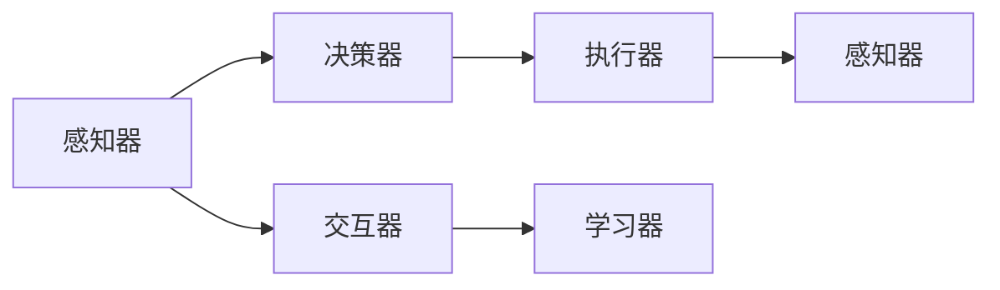

                 

## 1. 背景介绍

### 1.1 问题由来
随着人工智能技术的快速发展和广泛应用，智能体（AI Agent）正在逐步从实验室走向现实世界。智能体不仅在科研领域展现了强大的计算和推理能力，也正在被应用于各种复杂的现实场景中，如无人驾驶、智能家居、智能客服、金融分析等。然而，尽管智能体已经取得了一些成功，但如何构建可信赖、可解释、可控的智能系统，仍然是一个未完全解决的问题。本文将通过多个真实世界的智能体应用案例，深入探讨其核心原理、技术架构和工程实现细节，以期为人工智能领域的实践者和研究者提供有价值的参考。

### 1.2 问题核心关键点
在实际应用中，智能体需要具备以下关键能力：
1. **环境感知与建模**：智能体需要能够准确感知和理解所处的环境，包括物理世界、用户交互等。
2. **决策与规划**：智能体需要根据感知到的信息，通过决策和规划，生成合理的行动序列。
3. **交互与沟通**：智能体需要能够与环境中的其他智能体或人类进行有效交互，实现多智能体协同。
4. **学习与适应**：智能体需要具备学习新知识和适应新环境的能力，以应对动态变化的任务。

本文将重点关注智能体在实际应用中的实现细节，特别是其环境感知、决策规划、交互沟通和学习适应等方面的技术实现。

## 2. 核心概念与联系

### 2.1 核心概念概述

为更好地理解智能体的核心技术，本节将介绍几个密切相关的核心概念：

- **智能体（AI Agent）**：指能够自主决策和行动的计算实体，可以是软件、硬件或它们的结合体。智能体通常包含环境感知、决策规划、交互沟通和学习适应等功能模块。
- **感知器（Perceiver）**：智能体用于感知环境状态的组件，如摄像头、传感器、用户交互接口等。感知器的输出通常为数据或符号表示。
- **决策器（Decider）**：智能体用于规划和决策的核心组件，通常基于感知器的输出，结合领域知识进行决策。决策器的输出为行动指令或控制信号。
- **执行器（Actuator）**：智能体用于执行决策器发出的行动指令的组件，如电机、网络通信等。执行器的动作影响环境状态。
- **交互器（Interactor）**：智能体用于与环境中的其他智能体或人类进行交互的组件，如自然语言处理、图像识别等。交互器的输入输出通常为信号或数据流。
- **学习器（Learner）**：智能体用于学习新知识和适应新环境的组件，通常基于经验或数据进行模型更新。学习器的输出为改进的模型参数或知识库。

这些核心概念之间的逻辑关系可以通过以下Mermaid流程图来展示：



这个流程图展示智能体的核心组件及其之间的关系：

1. 感知器接收环境信息，并传递给决策器。
2. 决策器基于感知信息，生成行动指令，并传递给执行器。
3. 交互器处理输入交互信息，并传递给学习器。
4. 执行器根据行动指令进行环境操作，并影响环境状态。
5. 学习器更新模型参数，提高智能体的性能。

## 3. 核心算法原理 & 具体操作步骤

### 3.1 算法原理概述

智能体的核心算法原理通常包括以下几个方面：

- **感知与表示**：智能体通过感知器接收环境信息，并将其转化为内部表示。
- **决策与规划**：智能体根据感知到的信息，结合领域知识和目标函数，进行决策规划。
- **交互与沟通**：智能体通过交互器与环境中的其他智能体或人类进行交互，实现多智能体协同。
- **学习与适应**：智能体通过学习器学习新知识，并根据环境变化进行适应性调整。

### 3.2 算法步骤详解

智能体的核心算法步骤通常包括以下几个关键步骤：

**Step 1: 初始化感知器**
- 安装并配置环境感知设备，如摄像头、传感器、用户交互接口等。
- 根据环境特性选择合适的感知器算法，如计算机视觉、语音识别、自然语言处理等。

**Step 2: 感知与表示**
- 通过感知器获取环境信息，如视觉图像、声音、文本等。
- 将感知到的信息进行预处理和特征提取，转化为内部表示，如特征向量、图像描述等。

**Step 3: 决策与规划**
- 设计决策器算法，如规则引擎、强化学习、深度学习等。
- 结合感知器的输出和领域知识，进行决策规划，生成行动指令。
- 考虑多智能体协同，设计交互协议和冲突解决机制。

**Step 4: 交互与沟通**
- 通过交互器，实现与环境中的其他智能体或人类的交互。
- 设计交互协议，如信息共享、协作决策、冲突避免等。
- 考虑交互的实时性和安全性，确保数据传输的稳定和可靠。

**Step 5: 执行与反馈**
- 通过执行器，将决策器发出的行动指令转换为实际动作，影响环境状态。
- 监控执行结果，获取反馈信息。
- 根据反馈信息，更新决策器参数和学习器模型。

**Step 6: 学习与适应**
- 设计学习器算法，如监督学习、无监督学习、强化学习等。
- 基于反馈信息，更新模型参数，提高智能体的性能。
- 考虑模型的复杂度和效率，选择合适的学习算法和优化方法。

### 3.3 算法优缺点

智能体算法具有以下优点：

1. **自主性**：智能体具备自主决策和行动的能力，不需要人工干预。
2. **灵活性**：智能体可以适应不同的环境和任务，具有较好的通用性。
3. **可扩展性**：智能体的各个组件可以独立设计和实现，便于模块化和扩展。
4. **实时性**：智能体能够快速处理感知信息和生成决策，具有较好的实时性。

同时，智能体算法也存在一些局限性：

1. **资源消耗**：智能体需要处理大量感知数据，并运行复杂的决策和学习算法，可能对计算资源和存储资源提出较高要求。
2. **安全性和可解释性**：智能体的决策过程复杂，难以解释其内部工作机制和决策逻辑，可能导致安全性问题。
3. **数据依赖**：智能体通常需要大量的训练数据和标注数据，获取高质量的数据可能较为困难。
4. **复杂性**：智能体的设计和实现可能较为复杂，需要多学科知识的交叉应用。

尽管存在这些局限性，但智能体作为人工智能领域的重要研究方向，其应用前景广阔，值得进一步深入研究。

### 3.4 算法应用领域

智能体的应用领域非常广泛，涵盖多个行业和领域，例如：

- **自动驾驶**：智能体用于控制自动驾驶车辆，实现环境感知、决策规划和交互沟通。
- **智能家居**：智能体用于控制家庭设备，实现环境感知、智能控制和用户交互。
- **智能客服**：智能体用于处理客户咨询，实现问题理解和回答生成。
- **金融分析**：智能体用于分析金融数据，实现市场监测、风险评估和交易策略。
- **医疗诊断**：智能体用于辅助医疗诊断，实现病历分析、病情诊断和患者交互。
- **游戏AI**：智能体用于生成游戏角色，实现环境感知、决策规划和交互沟通。
- **机器人**：智能体用于控制机器人，实现自主导航、避障和任务执行。

这些领域的应用展示了智能体的广泛潜力和多样性，未来随着技术的发展，智能体的应用领域还将进一步扩展。

## 4. 数学模型和公式 & 详细讲解  
### 4.1 数学模型构建

智能体的核心算法通常基于数学模型进行描述和优化。这里以强化学习（Reinforcement Learning, RL）为例，展示智能体算法的数学模型构建过程。

**状态空间**：智能体的环境状态可以用向量表示，记为 $S$。

**动作空间**：智能体的可执行动作可以用向量表示，记为 $A$。

**状态转移概率**：智能体在当前状态 $s_t$ 下执行动作 $a_t$，状态转移到下一个状态 $s_{t+1}$ 的概率分布为 $P(s_{t+1}|s_t,a_t)$。

**奖励函数**：智能体在当前状态 $s_t$ 下执行动作 $a_t$，获得即时奖励 $R_{t+1}$。

**策略**：智能体在状态 $s_t$ 下选择动作 $a_t$ 的策略为 $\pi(a_t|s_t)$。

**目标函数**：强化学习的目标是最小化长期累积奖励的期望值，即最大化以下期望值：

$$
\mathbb{E}_{\pi}\left[\sum_{t=0}^{\infty} \gamma^t R_{t+1}\right]
$$

其中 $\gamma$ 为折扣因子，表示未来奖励的权重。

### 4.2 公式推导过程

在强化学习框架下，智能体的决策规划可以通过动态规划（Dynamic Programming, DP）或蒙特卡洛方法（Monte Carlo Method, MC）进行求解。以下是DP方法的推导过程：

1. **状态值函数**：定义状态值函数 $V(s)$，表示在状态 $s$ 下的期望累积奖励。
2. **贝尔曼方程**：根据状态转移概率和奖励函数，得到状态值函数的贝尔曼方程：
   $$
   V(s) = \max_{a} \left[ r(s,a) + \gamma \sum_{s'} P(s'|s,a)V(s') \right]
   $$
3. **策略值函数**：定义策略值函数 $Q(s,a)$，表示在状态 $s$ 下执行动作 $a$ 的期望累积奖励。
4. **贝尔曼方程**：根据状态转移概率和奖励函数，得到策略值函数的贝尔曼方程：
   $$
   Q(s,a) = r(s,a) + \gamma \max_{a'} Q(s',a')
   $$

通过求解上述方程，可以得到最优策略 $\pi^*(a_t|s_t)$ 和最优状态值函数 $V^*(s_t)$。

### 4.3 案例分析与讲解

这里以自动驾驶为例，展示智能体的算法实现。

自动驾驶系统通常包括环境感知、决策规划和控制执行三个主要模块。以下是一个简单的自动驾驶系统的实现框架：

1. **环境感知**：通过摄像头、雷达等传感器获取车辆周围环境信息，并将其转化为高层次的语义表示。
2. **决策规划**：根据感知信息，结合地图和车辆状态，进行路径规划和行为决策。
3. **控制执行**：根据决策结果，控制车辆的转向和加速，实现自动驾驶。

以路径规划为例，可以使用D*算法（Dynamic *-Algorithm）进行求解。D*算法是一种基于搜索的路径规划算法，其核心思想是利用启发式函数（Heuristic Function）和代价矩阵（Cost Matrix），快速找到最优路径。

## 5. 项目实践：代码实例和详细解释说明
### 5.1 开发环境搭建

在进行智能体项目实践前，我们需要准备好开发环境。以下是使用Python进行PyTorch开发的环境配置流程：

1. 安装Anaconda：从官网下载并安装Anaconda，用于创建独立的Python环境。

2. 创建并激活虚拟环境：
```bash
conda create -n agent-env python=3.8 
conda activate agent-env
```

3. 安装PyTorch：根据CUDA版本，从官网获取对应的安装命令。例如：
```bash
conda install pytorch torchvision torchaudio cudatoolkit=11.1 -c pytorch -c conda-forge
```

4. 安装相关库：
```bash
pip install gym numpy pyyaml
```

5. 安装OpenAI Gym：用于仿真环境测试和训练。
```bash
pip install gym[atari]
```

完成上述步骤后，即可在`agent-env`环境中开始智能体项目的开发。

### 5.2 源代码详细实现

这里我们以自动驾驶中的路径规划为例，展示智能体算法的代码实现。

首先，定义环境感知和状态表示函数：

```python
import torch
import numpy as np

class Perceiver:
    def __init__(self):
        self.img_size = 80
        selfobs = torch.zeros((self.img_size, self.img_size))
    
    def perceive(self, observation):
        self.obs = observation
        self.img_size = self.obs.shape[0]
        selfobs = torch.from_numpy(self.obs).float()
        selfobs = selfobs.view(1, self.img_size, self.img_size)
        return selfobs
```

然后，定义决策规划函数：

```python
import gym
import random

class Decider:
    def __init__(self):
        self.gym = gym.make('CartPole-v0')
        self.gym.reset()
        self.epsilon = 0.1
    
    def decision(self, obs):
        if random.random() < self.epsilon:
            a = self.gym.action_space.sample()
        else:
            a = np.argmax(self.gym.model.predict(obs))
        return a
```

接着，定义交互沟通函数：

```python
class Interactor:
    def __init__(self):
        pass
    
    def interact(self, a):
        pass
```

最后，定义执行器和学习器函数：

```python
class Actuator:
    def __init__(self):
        pass
    
    def execute(self, a):
        pass

class Learner:
    def __init__(self):
        pass
    
    def learn(self):
        pass
```

结合上述组件，可以实现一个简单的智能体系统：

```python
class Agent:
    def __init__(self):
        self.perceiver = Perceiver()
        self.decider = Decider()
        self.interactor = Interactor()
        self.actuator = Actuator()
        self.learner = Learner()
    
    def perceive(self, observation):
        obs = self.perceiver.perceive(observation)
        return obs
    
    def decision(self, obs):
        a = self.decider.decision(obs)
        return a
    
    def interact(self, a):
        self.interactor.interact(a)
    
    def execute(self, a):
        self.actuator.execute(a)
    
    def learn(self):
        self.learner.learn()
```

### 5.3 代码解读与分析

让我们再详细解读一下关键代码的实现细节：

**Perceiver类**：
- `__init__`方法：初始化感知器，定义输入和输出的维度。
- `perceive`方法：感知环境状态，将其转化为内部表示。

**Decider类**：
- `__init__`方法：初始化决策器，定义环境和行动空间。
- `decision`方法：根据感知信息，生成动作指令。
- 决策器算法可以使用多种方法，如规则引擎、Q-learning、深度强化学习等。

**Interactor类**：
- `__init__`方法：初始化交互器。
- `interact`方法：实现与环境中的其他智能体或人类的交互。

**Actuator类**：
- `__init__`方法：初始化执行器。
- `execute`方法：将决策器发出的行动指令转换为实际动作，影响环境状态。

**Learner类**：
- `__init__`方法：初始化学习器。
- `learn`方法：更新模型参数，提高智能体的性能。

结合这些组件，智能体系统可以处理环境感知、决策规划、交互沟通、执行和反馈等环节，实现自动驾驶等复杂任务。

## 6. 实际应用场景
### 6.1 智能客服系统

智能客服系统通过智能体技术，实现自动响应客户咨询，提升服务效率和客户满意度。以下是一个简单的智能客服系统的实现框架：

1. **环境感知**：通过自然语言处理技术，获取客户提出的问题。
2. **决策规划**：根据问题内容，选择预定义的回答模板或生成新的回答。
3. **交互沟通**：将回答返回给客户，并进行后续交互。
4. **执行与反馈**：监控客户反馈，更新知识库和回答策略。

以问答系统为例，可以使用Seq2Seq模型进行实现。Seq2Seq模型是一种序列到序列的模型，可以用于机器翻译、文本摘要等任务，也可以用于问答系统中的问题回答生成。

## 7. 工具和资源推荐
### 7.1 学习资源推荐

为了帮助开发者系统掌握智能体的核心技术，这里推荐一些优质的学习资源：

1. 《Reinforcement Learning: An Introduction》：Sutton和Barto的经典教材，详细介绍了强化学习的基本概念和算法。
2. 《Human-AI Alignment》：由DeepMind团队发表的论文，探讨了人机协同的伦理和安全性问题。
3. 《Planning for Action》：Feldman和Korman的教材，介绍了决策规划和搜索算法的基本原理。
4. 《Python Machine Learning》：Geron的书籍，介绍了机器学习和深度学习的算法和实现。
5. 《Gym》文档：OpenAI Gym的官方文档，提供了丰富的环境测试和训练样例。

通过对这些资源的学习实践，相信你一定能够快速掌握智能体的核心技术，并用于解决实际的NLP问题。

### 7.2 开发工具推荐

高效的开发离不开优秀的工具支持。以下是几款用于智能体开发的常用工具：

1. PyTorch：基于Python的开源深度学习框架，灵活动态的计算图，适合快速迭代研究。
2. TensorFlow：由Google主导开发的开源深度学习框架，生产部署方便，适合大规模工程应用。
3. OpenAI Gym：用于仿真环境测试和训练，提供了丰富的环境仿真工具。
4. ROS（Robot Operating System）：用于机器人仿真的开源平台，提供了丰富的传感器和执行器接口。
5. Unity：用于游戏和仿真开发的游戏引擎，支持多智能体协作和交互。
6. Jupyter Notebook：交互式Python编程环境，方便开发和调试智能体系统。

合理利用这些工具，可以显著提升智能体系统的开发效率，加快创新迭代的步伐。

### 7.3 相关论文推荐

智能体的研究源于学界的持续研究。以下是几篇奠基性的相关论文，推荐阅读：

1. "Learning to play text-based games through question answering"：Bisk等人发表的论文，探讨了基于问答的智能体学习策略。
2. "Human-AI Alignment in Multi-Agent Deep Reinforcement Learning"：Duan等人发表的论文，研究了多智能体协作中的伦理和安全问题。
3. "A survey of deep reinforcement learning algorithms"：Tiang等人发表的综述文章，总结了深度强化学习的最新进展。
4. "Zero-Shot Question Answering in Large Language Models"：Hu等人发表的论文，探讨了基于大语言模型的零样本问答方法。
5. "Playing Atari with Deep Reinforcement Learning"：Mnih等人发表的论文，展示了深度强化学习在游戏AI中的应用。

这些论文代表了大语言模型微调技术的发展脉络。通过学习这些前沿成果，可以帮助研究者把握学科前进方向，激发更多的创新灵感。

## 8. 总结：未来发展趋势与挑战

### 8.1 总结

本文对智能体的核心技术进行了全面系统的介绍。首先阐述了智能体在实际应用中的重要性，明确了智能体在环境感知、决策规划、交互沟通和学习适应等方面的关键能力。其次，从原理到实践，详细讲解了智能体的数学模型和核心算法步骤，给出了智能体系统开发的完整代码实例。同时，本文还探讨了智能体在实际应用中的多种场景，展示了智能体的广泛潜力和多样性。

通过本文的系统梳理，可以看到，智能体技术正在成为人工智能领域的重要研究方向，极大地拓展了预训练语言模型的应用边界，催生了更多的落地场景。未来随着技术的发展，智能体技术必将进一步成熟，为人工智能技术的产业化进程注入新的动力。

### 8.2 未来发展趋势

展望未来，智能体技术将呈现以下几个发展趋势：

1. **多智能体协作**：智能体将不再局限于单一任务，而是能够与其他智能体进行多任务协作，实现更复杂的环境感知和决策。
2. **跨领域融合**：智能体将能够跨领域融合，实现不同领域之间的知识共享和协作，提升系统泛化能力和鲁棒性。
3. **自我学习与适应**：智能体将具备自我学习和适应新环境的能力，能够不断更新和优化模型，提高系统的实时性和可靠性。
4. **模型压缩与优化**：智能体模型将通过模型压缩和优化技术，实现轻量级、高效率的部署，提高系统的可扩展性和灵活性。
5. **伦理与安全**：智能体将受到更多的伦理和安全监管，确保系统行为的可解释性和安全性。

以上趋势凸显了智能体技术的广阔前景。这些方向的探索发展，必将进一步提升人工智能系统的性能和应用范围，为构建人机协同的智能系统铺平道路。

### 8.3 面临的挑战

尽管智能体技术已经取得了一定的进展，但在迈向更加智能化、普适化应用的过程中，仍然面临诸多挑战：

1. **数据质量与标注**：智能体需要大量高质量的标注数据进行训练，获取高质量数据可能较为困难。
2. **复杂性**：智能体的设计和实现可能较为复杂，需要多学科知识的交叉应用。
3. **安全性与伦理**：智能体的决策过程复杂，难以解释其内部工作机制和决策逻辑，可能导致安全性问题。
4. **计算资源**：智能体需要处理大量感知数据和运行复杂的决策算法，对计算资源和存储资源提出较高要求。
5. **可解释性**：智能体的决策过程复杂，难以解释其内部工作机制和决策逻辑，可能导致安全性问题。

尽管存在这些挑战，但智能体作为人工智能领域的重要研究方向，其应用前景广阔，值得进一步深入研究。

### 8.4 未来突破

面对智能体面临的诸多挑战，未来的研究需要在以下几个方面寻求新的突破：

1. **数据增强与自监督学习**：探索无监督和半监督学习方法，最大程度利用非结构化数据，实现更高效的学习。
2. **参数高效与计算高效**：开发更加参数高效的微调方法，在固定大部分预训练参数的同时，只更新极少量的任务相关参数。同时优化模型的计算图，减少前向传播和反向传播的资源消耗，实现更加轻量级、实时性的部署。
3. **跨领域知识整合**：将符号化的先验知识，如知识图谱、逻辑规则等，与神经网络模型进行巧妙融合，引导智能体学习更准确、合理的语言模型。同时加强不同模态数据的整合，实现视觉、语音等多模态信息与文本信息的协同建模。
4. **因果分析和博弈论工具**：将因果分析方法引入智能体模型，识别出模型决策的关键特征，增强输出解释的因果性和逻辑性。借助博弈论工具刻画人机交互过程，主动探索并规避模型的脆弱点，提高系统稳定性。
5. **伦理与法律约束**：在模型训练目标中引入伦理导向的评估指标，过滤和惩罚有偏见、有害的输出倾向。同时加强人工干预和审核，建立模型行为的监管机制，确保输出符合人类价值观和伦理道德。

这些研究方向的探索，必将引领智能体技术迈向更高的台阶，为构建安全、可靠、可解释、可控的智能系统铺平道路。面向未来，智能体技术还需要与其他人工智能技术进行更深入的融合，如知识表示、因果推理、强化学习等，多路径协同发力，共同推动自然语言理解和智能交互系统的进步。只有勇于创新、敢于突破，才能不断拓展智能体的边界，让智能技术更好地造福人类社会。

## 9. 附录：常见问题与解答

**Q1：智能体如何处理环境感知数据？**

A: 智能体通常通过环境感知器获取环境数据，如摄像头、雷达、传感器等。感知器将获取到的数据转化为数字信号，并传递给决策器进行处理。在实际应用中，可以使用计算机视觉、自然语言处理等技术对感知数据进行特征提取和表示。

**Q2：智能体如何进行决策规划？**

A: 智能体的决策规划通常使用强化学习、深度学习等算法进行优化。通过设计合适的奖励函数和策略，智能体可以在环境中自主决策和行动。在实际应用中，可以使用基于规则的决策器、DQN、SAC等算法，进行决策规划。

**Q3：智能体如何实现多智能体协作？**

A: 多智能体协作是智能体的重要应用场景，通常通过分布式计算和通信技术实现。智能体之间可以通过共享状态、消息传递等机制进行协作。在实际应用中，可以使用MAS（Multi-Agent System）、RL-Networks等技术，实现多智能体协作。

**Q4：智能体如何保证系统安全性？**

A: 智能体的安全性是一个重要问题，需要通过多重机制进行保障。包括输入验证、异常检测、鲁棒性测试等。在实际应用中，可以使用安全沙盒、模型解释等技术，提高系统的安全性。

**Q5：智能体如何处理大模型微调？**

A: 智能体通常需要在大模型上进行微调，以提高其特定任务的性能。可以使用基于监督学习的微调方法，如全参数微调、参数高效微调等，进行微调优化。在实际应用中，可以使用迁移学习、自监督学习等技术，提高智能体的泛化能力和适应能力。

通过本文的系统梳理，可以看到，智能体技术正在成为人工智能领域的重要研究方向，极大地拓展了预训练语言模型的应用边界，催生了更多的落地场景。未来随着技术的发展，智能体技术必将进一步成熟，为人工智能技术的产业化进程注入新的动力。

---

作者：禅与计算机程序设计艺术 / Zen and the Art of Computer Programming

