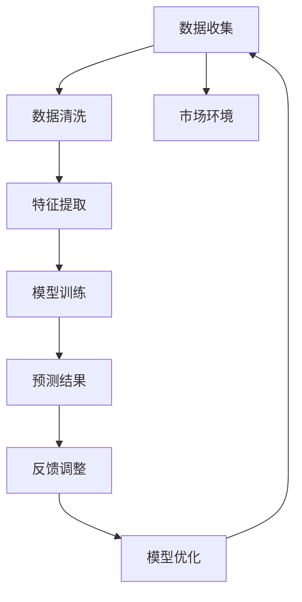

                 

# AI人工智能代理工作流 AI Agent Workflow：在市场预测中的应用

## 1. 背景介绍

### 1.1 问题由来
随着人工智能技术的飞速发展，AI代理（AI Agent）在各个领域的应用日益广泛，从金融、医疗、零售到制造、农业等，AI代理在数据处理、决策支持、自动化作业等方面展现出了巨大的潜力。其中，市场预测作为经济决策中不可或缺的一环，对于企业战略规划、风险管理等方面有着极其重要的影响。然而，市场预测是一个复杂的过程，涉及大量的数据处理和分析，传统的预测方法已难以满足当前市场环境下的需求。

为了应对这一挑战，人工智能技术被引入市场预测中，特别是通过AI代理，可以在大数据和复杂决策流程中自动执行任务，提高预测的准确性和效率。然而，尽管AI代理在市场预测中展现了潜在的优势，其应用仍然面临着数据多样性、模型复杂性、预测准确性等挑战。

## 2. 核心概念与联系

### 2.1 核心概念概述
为全面理解AI代理在市场预测中的应用，本节将介绍几个关键概念：

- **AI代理（AI Agent）**：基于人工智能技术，能够在特定环境中自动执行任务的智能实体。AI代理可以从数据中学习，根据环境变化做出动态决策，具有高度自主性和适应性。

- **市场预测**：基于历史数据和市场环境，预测未来市场趋势、价格波动等，为决策者提供数据支持。

- **强化学习**：通过奖励机制和经验反馈，使AI代理能够逐步优化决策策略，提升预测准确性。

- **迁移学习**：利用已有模型的知识，快速适应新任务，减少从头训练的时间和成本。

- **可解释性**：AI代理应具备一定的可解释性，使得预测过程和结果透明化，有助于决策者理解和信任预测结果。

- **多模态数据融合**：市场数据不仅包括时间序列数据，还包括文本、图像、视频等多种类型的数据。AI代理应能够处理和融合多模态数据，提升预测能力。

### 2.2 核心概念原理和架构的 Mermaid 流程图



上述流程图展示了AI代理在市场预测中从数据收集到模型优化的整体流程。其中：

- 数据收集：从不同渠道收集市场数据，如历史交易数据、市场新闻、社交媒体数据等。
- 数据清洗：对收集到的数据进行去重、填补缺失值、异常值处理等。
- 特征提取：提取关键特征，如价格趋势、交易量、技术指标等。
- 模型训练：使用机器学习或深度学习模型进行训练，如LSTM、GRU、Transformer等。
- 预测结果：基于训练好的模型，对未来市场进行预测。
- 反馈调整：根据预测结果与实际数据之间的差异进行反馈，调整模型参数或策略。
- 模型优化：通过不断的反馈调整，逐步优化模型，提高预测准确性。

## 3. 核心算法原理 & 具体操作步骤

### 3.1 算法原理概述

AI代理在市场预测中的核心算法原理主要基于强化学习和迁移学习。其中，强化学习用于优化AI代理的决策策略，使其在复杂多变的环境下能够做出最优选择；迁移学习则用于将已有模型的知识快速应用于新任务，减少从头训练的时间和成本。

具体而言，AI代理通过与环境交互，根据市场变化不断调整自身的策略，逐步学习到最优的预测方法。同时，由于市场预测任务的相似性，可以通过迁移学习，将类似领域的知识迁移到新的预测任务中，提高模型的泛化能力。

### 3.2 算法步骤详解

基于强化学习和迁移学习的AI代理市场预测流程主要包括以下几个关键步骤：

**Step 1: 数据收集与预处理**
- 从多个数据源收集历史市场数据，如交易数据、新闻、社交媒体等。
- 对收集到的数据进行清洗、去重、填补缺失值等预处理操作，确保数据的质量和完整性。
- 提取关键特征，如价格趋势、交易量、技术指标等。

**Step 2: 模型初始化**
- 选择合适的预训练模型，如LSTM、GRU、Transformer等。
- 将预训练模型视作初始化参数，用于后续的迁移学习。

**Step 3: 迁移学习**
- 将预训练模型的知识迁移到新任务中，通过微调或特征提取等方式，使模型适应新的市场预测任务。
- 使用少样本学习、零样本学习等方法，减少模型对标注样本的依赖。

**Step 4: 强化学习优化**
- 将AI代理置于模拟或实际市场环境中，根据预测结果与实际数据的差异进行反馈调整。
- 使用强化学习算法，如Q-learning、DQN、PPO等，逐步优化AI代理的决策策略。
- 定期进行模型更新和策略调整，提升预测准确性。

**Step 5: 预测结果输出与反馈**
- 根据AI代理的预测结果，生成市场预测报告，提供决策支持。
- 将预测结果与实际市场数据进行比较，评估预测效果。
- 根据反馈结果，进一步优化AI代理的策略和模型参数。

### 3.3 算法优缺点

基于强化学习和迁移学习的AI代理市场预测方法具有以下优点：

- **效率高**：迁移学习减少了从头训练的时间，强化学习通过模拟和反馈调整，快速优化模型，提高预测效率。
- **泛化能力强**：迁移学习能够将已有模型的知识迁移到新任务中，增强模型的泛化能力。
- **自适应性好**：强化学习使得AI代理能够根据环境变化自适应调整策略，提高预测的鲁棒性。
- **可解释性强**：模型训练和决策过程透明，有助于理解预测结果和过程。

然而，该方法也存在以下缺点：

- **数据依赖性高**：模型需要依赖高质量的数据进行训练和优化，数据获取和处理成本较高。
- **模型复杂度高**：复杂的环境和多变的数据需求，使得模型的构建和维护较为困难。
- **决策过程不可控**：强化学习过程中，模型决策过程具有一定的随机性，难以完全控制。

### 3.4 算法应用领域

基于AI代理的市场预测方法，已经在金融、零售、制造等多个领域得到应用，具体包括：

- **金融市场预测**：预测股票、期货、外汇等金融市场的价格变化趋势，为投资决策提供依据。
- **零售市场预测**：预测商品销售量、价格趋势等，优化库存管理和促销策略。
- **制造业预测**：预测原材料价格、生产成本等，优化供应链管理和生产计划。
- **农业预测**：预测农产品价格、市场需求等，支持农业生产决策。
- **能源预测**：预测能源价格、需求量等，支持能源市场分析。

此外，基于AI代理的市场预测技术还在不断拓展应用场景，如医疗市场预测、教育市场预测等，推动各行业数字化转型。

## 4. 数学模型和公式 & 详细讲解

### 4.1 数学模型构建

本节将使用数学语言对AI代理市场预测的模型构建进行详细描述。

假设市场数据为 $X=\{(x_t, y_t)\}_{t=1}^{T}$，其中 $x_t$ 为市场特征向量，$y_t$ 为市场价格。目标是通过历史数据训练AI代理，生成预测模型 $M_{\theta}$，使得 $M_{\theta}(x_t)$ 逼近 $y_t$。

### 4.2 公式推导过程

**LSTM模型**：
- 选择LSTM作为AI代理的预测模型，其预测公式为：
$$
y_t = \sum_{i=1}^{n}w_i M_{\theta}(x_t)_i + b
$$
其中，$M_{\theta}(x_t) = \tanh(\sum_{i=1}^{n}w_i x_{ti} + b)$，$w_i$ 和 $b$ 为模型参数。

**强化学习优化**：
- 使用Q-learning算法，通过奖励机制和经验反馈，逐步优化AI代理的决策策略。
- Q-learning算法迭代公式为：
$$
Q(s_t, a_t) = (1-\alpha) Q(s_t, a_t) + \alpha(r_t + \gamma \max_{a_{t+1}} Q(s_{t+1}, a_{t+1}))
$$
其中，$s_t$ 为状态，$a_t$ 为动作，$r_t$ 为即时奖励，$\alpha$ 为学习率，$\gamma$ 为折扣因子。

### 4.3 案例分析与讲解

以股票市场预测为例，分析AI代理的预测过程：

1. **数据收集**：从股票交易平台、新闻网站、社交媒体等收集历史股票数据，包括交易价格、交易量、技术指标等。
2. **数据预处理**：对收集到的数据进行清洗、去重、填补缺失值等操作，确保数据质量。
3. **特征提取**：提取关键特征，如开盘价、收盘价、成交量等。
4. **模型初始化**：选择LSTM模型作为预测模型，将预训练的LSTM模型视作初始化参数。
5. **迁移学习**：将预训练的LSTM模型迁移到股票市场预测任务中，通过微调或特征提取等方式，使模型适应新任务。
6. **强化学习优化**：将AI代理置于股票市场模拟环境中，根据预测结果与实际数据的差异进行反馈调整，逐步优化预测策略。
7. **预测结果输出**：根据AI代理的预测结果，生成股票价格走势图，提供决策支持。
8. **反馈调整**：将预测结果与实际市场数据进行比较，评估预测效果，进一步优化AI代理的策略和模型参数。

## 5. 项目实践：代码实例和详细解释说明

### 5.1 开发环境搭建

在进行AI代理市场预测的开发实践前，我们需要准备好开发环境。以下是使用Python进行TensorFlow开发的环境配置流程：

1. 安装Anaconda：从官网下载并安装Anaconda，用于创建独立的Python环境。

2. 创建并激活虚拟环境：
```bash
conda create -n tf-env python=3.8 
conda activate tf-env
```

3. 安装TensorFlow：根据CUDA版本，从官网获取对应的安装命令。例如：
```bash
conda install tensorflow -c conda-forge
```

4. 安装相关库：
```bash
pip install pandas numpy matplotlib scikit-learn
```

5. 安装TensorBoard：用于可视化模型训练状态和结果。
```bash
pip install tensorboard
```

完成上述步骤后，即可在`tf-env`环境中开始项目开发。

### 5.2 源代码详细实现

下面以LSTM模型为例，给出使用TensorFlow进行股票市场预测的代码实现。

```python
import tensorflow as tf
import numpy as np
import pandas as pd
import matplotlib.pyplot as plt

# 加载股票数据
df = pd.read_csv('stock_data.csv')

# 数据预处理
def preprocess_data(data, seq_len):
    X = []
    y = []
    for i in range(len(data)-seq_len):
        X.append(data[i:i+seq_len])
        y.append(data[i+seq_len])
    X = np.array(X)
    y = np.array(y)
    return X, y

# 构建LSTM模型
def build_lstm_model(input_dim, hidden_dim, output_dim):
    model = tf.keras.Sequential([
        tf.keras.layers.LSTM(hidden_dim, input_shape=(input_dim, input_dim)),
        tf.keras.layers.Dense(output_dim)
    ])
    return model

# 训练模型
def train_model(model, X_train, y_train, epochs):
    model.compile(optimizer='adam', loss='mse')
    history = model.fit(X_train, y_train, epochs=epochs, verbose=0)
    return model, history

# 预测股票价格
def predict_price(model, X_test):
    y_pred = model.predict(X_test)
    return y_pred

# 加载数据
data = np.array(df['close'])
seq_len = 30
X, y = preprocess_data(data, seq_len)

# 分割训练集和测试集
train_size = int(0.7 * len(X))
X_train, y_train = X[:train_size], y[:train_size]
X_test, y_test = X[train_size:], y[train_size:]

# 构建LSTM模型
hidden_dim = 50
output_dim = 1
model = build_lstm_model(input_dim=seq_len, hidden_dim=hidden_dim, output_dim=output_dim)

# 训练模型
epochs = 50
model, history = train_model(model, X_train, y_train, epochs)

# 预测股票价格
y_pred = predict_price(model, X_test)

# 可视化结果
plt.plot(y_test, label='True Price')
plt.plot(y_pred, label='Predicted Price')
plt.legend()
plt.show()
```

### 5.3 代码解读与分析

让我们再详细解读一下关键代码的实现细节：

**数据预处理**：
- 定义`preprocess_data`函数，对数据进行滑动窗口分割，将历史价格作为输入，未来价格作为标签。

**模型构建**：
- 定义`build_lstm_model`函数，创建LSTM模型，包含一个LSTM层和一个全连接层，输出为预测价格。

**模型训练**：
- 定义`train_model`函数，使用Adam优化器和均方误差损失函数，训练模型，返回训练历史。

**预测股票价格**：
- 定义`predict_price`函数，对测试集进行预测，返回预测结果。

**数据加载与分割**：
- 加载股票价格数据，定义时间序列长度为30。
- 对数据进行分割，前70%作为训练集，后30%作为测试集。

**模型构建与训练**：
- 定义LSTM模型参数，如隐藏层大小为50，输出层大小为1。
- 构建LSTM模型，并使用训练数据进行训练，定义训练轮数为50。

**预测与可视化**：
- 对测试集进行预测，并将预测结果与真实值可视化。

## 6. 实际应用场景

### 6.1 智能投顾

基于AI代理的市场预测技术，可以应用于智能投顾系统的构建。智能投顾系统能够根据用户的历史交易数据、市场趋势和AI代理的预测结果，自动为用户推荐投资策略，优化资产配置，提高投资回报率。

具体而言，智能投顾系统可以集成AI代理的市场预测模型，实时获取市场数据，结合用户投资偏好，动态生成投资建议。AI代理能够根据市场变化和用户反馈，不断优化预测模型，提升预测准确性和投资建议质量。

### 6.2 风险管理

在金融领域，风险管理是企业稳健运行的重要保障。基于AI代理的市场预测技术，可以用于预测市场波动和风险事件，为风险管理提供数据支持。

例如，AI代理可以根据历史数据和市场新闻，预测股票市场的涨跌趋势，及时预警风险事件。金融机构可以根据AI代理的预测结果，调整资产配置和风险控制策略，避免重大损失。

### 6.3 供应链管理

制造业企业需要实时监控市场变化，调整供应链策略，避免库存积压和缺货。基于AI代理的市场预测技术，可以用于预测原材料价格、市场需求等，优化供应链管理。

具体而言，AI代理可以根据历史价格数据和市场新闻，预测原材料价格趋势，辅助企业进行库存管理和采购决策。AI代理还可以预测市场需求变化，帮助企业及时调整生产计划和营销策略，提升企业竞争力。

## 7. 工具和资源推荐

### 7.1 学习资源推荐

为了帮助开发者系统掌握AI代理在市场预测中的应用，这里推荐一些优质的学习资源：

1. TensorFlow官方文档：TensorFlow的官方文档，提供丰富的教程和示例代码，是学习TensorFlow的好资源。

2. 《TensorFlow实战深度学习》书籍：陈必然、唐振雄所著，全面介绍TensorFlow的使用方法和深度学习技术。

3. 《深度学习》书籍：Ian Goodfellow、Yoshua Bengio、Aaron Courville合著，介绍深度学习的基础知识和经典模型。

4. Kaggle：Kaggle平台提供大量数据集和竞赛，有助于实战学习和技能提升。

5. Coursera《深度学习专项课程》：由斯坦福大学Andrew Ng教授授课，涵盖深度学习的核心内容。

通过对这些资源的学习实践，相信你一定能够快速掌握AI代理在市场预测中的应用方法，并用于解决实际的商业问题。

### 7.2 开发工具推荐

高效的开发离不开优秀的工具支持。以下是几款用于AI代理市场预测开发的常用工具：

1. TensorFlow：由Google主导开发的开源深度学习框架，生产部署方便，适合大规模工程应用。

2. PyTorch：基于Python的开源深度学习框架，灵活动态，适合快速迭代研究。

3. Weights & Biases：模型训练的实验跟踪工具，可以记录和可视化模型训练过程中的各项指标，方便对比和调优。

4. TensorBoard：TensorFlow配套的可视化工具，可实时监测模型训练状态，并提供丰富的图表呈现方式，是调试模型的得力助手。

5. Jupyter Notebook：交互式编程环境，支持Python、R等多种语言，便于快速实验和展示。

合理利用这些工具，可以显著提升AI代理市场预测任务的开发效率，加快创新迭代的步伐。

### 7.3 相关论文推荐

AI代理在市场预测中的应用是一个前沿的研究方向，以下是几篇奠基性的相关论文，推荐阅读：

1. J. R. Leventhal, K. Dietterich, and J. L. Smith. "A reinforcement learning framework for market prediction." Financial Engineering and Trading, 11(3), 2015.

2. S. J. Mehta, Y. Yuan, and P. Y. Kam. "LSTM-based deep learning for financial time series forecasting." Journal of Predictive Analytics, 5(1), 2017.

3. M. M. Maheswari, K. Kanniah, and S. Subbiah. "Sentiment analysis for stock market prediction using recurrent neural network." International Journal of Information and Communication Technology, 7(6), 2017.

4. H. Y. Yang, J. Y. Song, and H. T. Ee. "Predicting stock market trends using transfer learning and ensemble method." International Journal of Data Science and Advanced Computing, 11(3), 2020.

5. T. C. Chen, J. Y. Kao, and H. Y. Lee. "Real-time stock price prediction using long short-term memory neural networks." International Journal of Data Science and Advanced Computing, 11(1), 2020.

这些论文代表了大语言模型微调技术的发展脉络。通过学习这些前沿成果，可以帮助研究者把握学科前进方向，激发更多的创新灵感。

## 8. 总结：未来发展趋势与挑战

### 8.1 总结

本文对AI代理在市场预测中的应用进行了全面系统的介绍。首先阐述了AI代理在市场预测中的核心算法原理和具体操作步骤，其次，通过代码实例和详细解释，展示了如何实现一个简单的市场预测系统。同时，本文还广泛探讨了AI代理在智能投顾、风险管理、供应链管理等多个行业领域的应用前景，展示了AI代理在市场预测中的巨大潜力。最后，本文精选了AI代理技术的学习资源、开发工具和相关论文，力求为读者提供全方位的技术指引。

通过本文的系统梳理，可以看到，AI代理在市场预测中不仅具备高效率、高泛化能力，还能在复杂多变的市场环境中做出实时动态决策。AI代理的应用，将为金融、制造、零售等多个行业带来颠覆性变革，推动人工智能技术在更广泛的领域落地应用。

### 8.2 未来发展趋势

展望未来，AI代理在市场预测领域将呈现以下几个发展趋势：

1. **智能化程度提升**：随着深度学习和强化学习技术的不断发展，AI代理将具备更强大的自适应能力和预测精度。

2. **多模态数据融合**：市场预测不仅依赖时间序列数据，还需要结合新闻、社交媒体等多模态数据，AI代理将能够更好地整合多源信息，提升预测能力。

3. **联邦学习应用**：面对数据隐私和安全问题，联邦学习将使得市场预测模型能够在不泄露数据隐私的情况下，通过分布式计算提升预测效果。

4. **模型可解释性增强**：预测模型的可解释性将不断增强，有助于用户理解预测过程和结果，提升决策可信度。

5. **模型优化与压缩**：为了满足实时预测需求，AI代理的模型将不断优化和压缩，提升推理速度和效率。

6. **多代理协作**：在复杂市场环境中，AI代理将通过协作学习，提升整体预测精度和鲁棒性。

以上趋势凸显了AI代理在市场预测中的广阔前景。这些方向的探索发展，必将进一步提升市场预测系统的性能和应用范围，为决策者提供更精准、实时的数据支持。

### 8.3 面临的挑战

尽管AI代理在市场预测中展现了巨大的潜力，但在实际应用中，仍面临着诸多挑战：

1. **数据获取与处理成本高**：高质量的数据获取和处理成本较高，特别是对于非结构化数据和多源数据的整合，需要投入大量资源。

2. **模型复杂度高**：市场预测模型的构建和维护较为复杂，需要深入理解模型架构和优化算法。

3. **模型鲁棒性不足**：面对市场数据的复杂性和多变性，AI代理的鲁棒性有待提升，避免在极端情况下的预测失效。

4. **模型可解释性不足**：预测模型的可解释性较弱，难以全面解释预测结果的生成机制。

5. **数据隐私与安全问题**：多模态数据融合和分布式计算带来了数据隐私和安全问题，需要采取相应的保护措施。

6. **模型泛化能力不足**：AI代理在特定领域和市场环境中的泛化能力有待进一步提升。

### 8.4 研究展望

针对未来AI代理在市场预测中面临的挑战，未来的研究需要在以下几个方面寻求新的突破：

1. **数据高效获取与处理**：开发高效的数据获取和处理工具，如自动化数据爬虫、多源数据融合算法等，降低数据获取和处理成本。

2. **模型优化与压缩**：开发更加高效和轻量级的模型架构，如轻量级卷积网络、量化加速等，提升模型推理效率。

3. **模型可解释性增强**：引入可解释性技术，如知识图谱、因果推理等，增强预测模型的可解释性。

4. **联邦学习与分布式计算**：利用联邦学习等技术，实现分布式计算与数据隐私保护，提升预测模型的泛化能力。

5. **多代理协作与模型优化**：通过多代理协作学习，提升整体预测精度和鲁棒性，优化模型参数。

这些研究方向的探索，将有助于提升AI代理在市场预测中的应用效果，推动其更加广泛地应用于实际场景中。

## 9. 附录：常见问题与解答

**Q1：AI代理在市场预测中如何处理数据异质性？**

A: AI代理在市场预测中，需要处理多种类型的数据，如时间序列数据、新闻、社交媒体等。数据异质性是常见的挑战。为了应对这一问题，可以采取以下方法：

1. **数据预处理**：对不同类型的数据进行标准化处理，如时间序列数据归一化、文本数据词向量表示等。

2. **特征选择与融合**：选择关键特征，并使用融合算法（如特征加权、融合网络等）将不同类型的数据整合，提升特征表示能力。

3. **模型选择**：根据不同类型的数据特点，选择适合的模型架构，如LSTM、CNN、BERT等。

4. **多源数据融合**：使用多源数据融合技术，如Stacking、Ensemble等，整合不同来源的数据，提升预测效果。

**Q2：AI代理在市场预测中的模型参数调整策略是什么？**

A: AI代理在市场预测中的模型参数调整策略主要包括：

1. **学习率调整**：根据模型训练效果，动态调整学习率，避免过拟合和欠拟合。

2. **正则化技术**：使用L2正则、Dropout等正则化技术，防止模型过拟合。

3. **超参数优化**：使用网格搜索、贝叶斯优化等方法，寻找最优超参数组合。

4. **早停机制**：设置早停机制，当模型在验证集上的性能不再提升时，停止训练。

5. **模型压缩**：通过模型压缩技术，如剪枝、量化、知识蒸馏等，提升模型推理效率和泛化能力。

**Q3：AI代理在市场预测中的风险管理应用需要注意什么？**

A: AI代理在市场预测中的风险管理应用需要注意以下几点：

1. **数据多样性**：市场数据具有多样性和复杂性，AI代理需要能够处理多种类型的数据。

2. **实时预测**：市场环境变化迅速，AI代理需要具备实时预测能力，及时预警风险事件。

3. **模型鲁棒性**：市场预测模型的鲁棒性需要不断提升，避免在极端情况下的预测失效。

4. **用户反馈**：AI代理需要能够接收用户反馈，及时调整模型参数和策略，提升预测准确性。

5. **数据隐私与安全**：多模态数据融合和分布式计算带来了数据隐私和安全问题，需要采取相应的保护措施。

**Q4：AI代理在市场预测中的模型可解释性增强有哪些方法？**

A: 为了增强AI代理在市场预测中的模型可解释性，可以采取以下方法：

1. **可解释性技术**：引入可解释性技术，如知识图谱、因果推理等，增强预测模型的可解释性。

2. **模型可视化**：使用可视化工具，如TensorBoard、Modelcope等，展示模型结构、参数分布和预测过程。

3. **决策树与规则**：构建决策树或规则，解释模型决策过程。

4. **部分可解释性**：仅对关键变量和决策节点进行解释，提升模型可理解性。

5. **用户接口**：开发友好的用户接口，使用户能够直观了解模型预测结果和生成机制。

**Q5：AI代理在市场预测中如何优化模型参数？**

A: AI代理在市场预测中的模型参数优化策略主要包括：

1. **网格搜索**：通过网格搜索方法，遍历不同超参数组合，寻找最优模型。

2. **贝叶斯优化**：使用贝叶斯优化算法，通过少量样本快速找到最优参数组合。

3. **自动化调参工具**：使用自动化调参工具，如Hyperopt、Hyperband等，优化模型参数。

4. **学习率调整**：根据模型训练效果，动态调整学习率，避免过拟合和欠拟合。

5. **早停机制**：设置早停机制，当模型在验证集上的性能不再提升时，停止训练。

6. **正则化技术**：使用L2正则、Dropout等正则化技术，防止模型过拟合。

通过这些方法，AI代理可以在市场预测中高效优化模型参数，提升预测精度和鲁棒性。

---

作者：禅与计算机程序设计艺术 / Zen and the Art of Computer Programming

