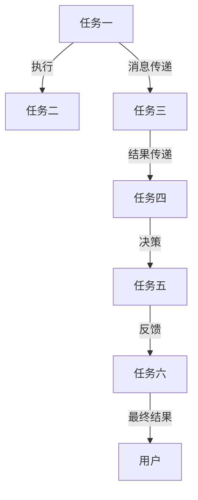
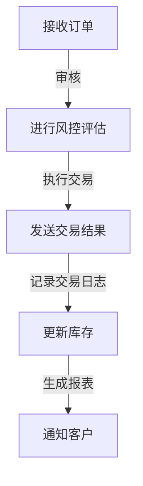

                 

# AI人工智能代理工作流AI Agent WorkFlow：搭建可拓展的AI代理工作流架构

## 1. 背景介绍

### 1.1 问题由来

在当前数字化、自动化转型的背景下，各个行业和组织面临着巨大的业务复杂性和管理挑战。业务流程自动化（BPA）已成为提升效率、降低成本、改进质量的关键手段。AI人工智能代理（AI Agent）作为自动化流程的核心，通过模拟人的智能行为，实现对业务规则的智能决策与执行，具有广泛的应用前景。

然而，AI代理的构建与维护是一项复杂且耗时的任务，需要大量的工程投入和专业知识。传统的手工编码、维护方法难以满足快速迭代、灵活扩展的需求。如何构建一个可拓展、易维护、高可用的AI代理工作流架构，成为当前AI应用开发的一个热门话题。

### 1.2 问题核心关键点

构建可拓展的AI代理工作流架构，需要围绕以下几个核心问题进行思考和解答：

1. **可拓展性**：如何根据业务需求的变化，快速、灵活地扩展AI代理的功能和规模？
2. **易维护性**：如何降低AI代理构建和维护的难度，提升开发效率和系统稳定性？
3. **高可用性**：如何设计架构，确保AI代理系统的高可用性，支持7x24小时不间断运行？
4. **自动化流程管理**：如何通过AI代理，实现业务的自动化流程管理，提升工作效率？
5. **集成和协作**：如何将AI代理与现有的IT系统、业务系统进行有效集成，实现数据的流畅传递和协同工作？

本文将系统介绍AI代理工作流架构的设计原理、技术细节和实践案例，希望能为构建高效、可扩展的AI代理工作流提供有价值的参考。

## 2. 核心概念与联系

### 2.1 核心概念概述

AI代理工作流架构，是指通过构建一套标准化、可扩展的AI代理系统，实现自动化流程管理的技术框架。其核心概念包括：

- **AI代理(AI Agent)**：基于AI技术的自动化工作流程执行者，能够理解、处理、执行各种业务规则和任务。
- **工作流(Workflow)**：一组有组织的、可执行的任务序列，用于定义业务流程。
- **任务(Task)**：工作流中的基本执行单元，可以是数据处理、决策执行、交互服务等。
- **消息(Message)**：任务之间进行信息传递的载体，包括请求、响应、指令等。
- **状态(State)**：任务执行过程中的状态，包括初始状态、执行状态、完成状态等。

通过这些核心概念的协同工作，AI代理工作流架构能够实现对业务流程的自动化管理和执行，提升企业运营效率。

### 2.2 核心概念原理和架构的 Mermaid 流程图



此图展示了AI代理工作流的基本流程：

1. 任务一执行后，通过消息传递给任务二。
2. 任务二执行完毕，将结果传递给任务三。
3. 任务三执行后，将结果传递给任务四。
4. 任务四执行后，进行决策并传递给任务五。
5. 任务五执行完毕，将结果传递给任务六。
6. 任务六执行完毕后，将最终结果反馈给用户。

### 2.3 核心概念间的联系

各核心概念之间的联系主要体现在：

- **任务和消息**：任务是工作流的基本执行单元，消息是任务之间传递数据和指令的载体。
- **状态**：任务的执行状态决定了下一步操作的流程，如等待、执行、完成等。
- **决策**：在执行过程中，任务之间可能需要进行决策，以确定下一步操作的路径。

通过这些联系，AI代理工作流架构能够实现复杂的业务流程自动化。

## 3. 核心算法原理 & 具体操作步骤

### 3.1 算法原理概述

AI代理工作流架构的设计，主要围绕以下几个关键算法和步骤：

1. **任务执行算法**：定义任务的执行逻辑，包括数据处理、决策执行、交互服务等。
2. **消息传递算法**：实现任务之间的信息传递，包括消息的发送、接收和处理。
3. **状态管理算法**：定义任务的状态转换规则，确保任务执行的有序性和正确性。
4. **决策算法**：实现任务的智能决策，根据业务规则和输入数据，确定下一步操作的路径。
5. **任务调度算法**：优化任务的执行顺序，提升系统性能和资源利用率。

### 3.2 算法步骤详解

1. **任务定义**：根据业务需求，定义需要执行的任务及其逻辑。任务定义包括任务的输入输出、执行步骤、异常处理等。

2. **消息传递设计**：定义消息的类型和传递规则，实现任务之间的数据交互。消息传递设计需要考虑消息的序列性、同步性、可靠性等。

3. **状态管理设计**：定义任务的状态转换规则，包括任务的初始状态、执行状态、完成状态等。状态管理设计需要考虑状态之间的转换条件和状态转移逻辑。

4. **决策算法实现**：实现任务的智能决策，通常使用决策树、规则引擎等技术，根据输入数据和业务规则，确定下一步操作的路径。

5. **任务调度实现**：优化任务的执行顺序，提升系统性能和资源利用率。任务调度通常使用任务队列、优先级调度等技术，确保任务执行的有序性和正确性。

### 3.3 算法优缺点

#### 优点：

- **灵活性**：可以根据业务需求的变化，灵活地扩展和调整任务和流程。
- **可扩展性**：支持大规模、高并发任务的执行，具备高度的伸缩性。
- **高可用性**：通过任务队列、状态管理、异常处理等机制，确保系统的稳定性和可用性。
- **易维护性**：采用模块化和组件化的设计，降低开发和维护难度。

#### 缺点：

- **复杂性**：设计复杂，需要综合考虑任务逻辑、消息传递、状态管理、决策算法等多个方面。
- **性能调优**：需要根据实际应用场景进行性能优化，以提升系统效率。
- **安全性和可靠性**：需要设计合理的安全机制和故障恢复策略，确保系统的可靠性和安全性。

### 3.4 算法应用领域

AI代理工作流架构可以应用于各种业务流程的自动化，包括但不限于以下领域：

1. **金融行业**：自动化交易、风险管理、客户服务、信用评分等。
2. **医疗行业**：自动化病历管理、诊断支持、药物管理、患者服务。
3. **零售行业**：自动化库存管理、订单处理、客户服务、营销分析。
4. **制造业**：自动化生产调度、设备维护、质量控制、供应链管理。
5. **公共服务**：自动化政府事务、公共安全、城市管理、公共卫生。

## 4. 数学模型和公式 & 详细讲解 & 举例说明

### 4.1 数学模型构建

AI代理工作流架构的设计，涉及到多种算法和模型，其中关键模型包括任务执行模型、消息传递模型、状态管理模型、决策模型等。

以任务执行模型为例，我们可以定义任务的输入输出、执行步骤、异常处理等，如下所示：

$$
\text{Task} = \{\text{Input}, \text{Output}, \text{ExecStep}, \text{ExceptionHandling}\}
$$

其中，

- Input：任务的输入数据，包括输入格式、数据类型等。
- Output：任务的输出数据，包括输出格式、数据类型等。
- ExecStep：任务的执行步骤，包括数据处理、决策执行等。
- ExceptionHandling：任务的异常处理机制，包括异常类型、异常处理逻辑等。

### 4.2 公式推导过程

对于任务执行模型，我们可以使用流程图来表示任务的执行步骤。以金融行业自动化交易流程为例，其流程图如下：



### 4.3 案例分析与讲解

以金融行业自动化交易流程为例，其任务执行模型的推导如下：

1. 任务一：接收订单。输入为订单信息，输出为订单审核结果。
2. 任务二：进行风控评估。输入为订单信息，输出为风控评估结果。
3. 任务三：执行交易。输入为订单信息、风控评估结果，输出为交易结果。
4. 任务四：记录交易日志。输入为交易结果，输出为交易日志。
5. 任务五：生成报表。输入为交易日志，输出为交易报表。
6. 任务六：通知客户。输入为交易结果，输出为通知信息。

通过上述步骤，金融行业自动化交易流程的执行逻辑和数据传递路径清晰明了，能够确保交易的顺利进行和风险控制。

## 5. 项目实践：代码实例和详细解释说明

### 5.1 开发环境搭建

为了构建AI代理工作流架构，我们需要搭建相应的开发环境，包括：

1. **编程语言**：Python是最常用的开发语言，具有丰富的第三方库和工具支持。
2. **开发框架**：Flask、Django、Tornado等Web开发框架，用于构建API接口。
3. **消息传递**：RabbitMQ、ActiveMQ等消息队列系统，用于任务之间的数据传递。
4. **任务调度**：Celery等任务调度系统，用于优化任务执行顺序。
5. **状态管理**：MySQL、Redis等数据库系统，用于存储任务状态和业务数据。
6. **决策算法**：Scikit-learn、TensorFlow等机器学习库，用于实现决策算法。

### 5.2 源代码详细实现

以下是AI代理工作流架构的代码实现示例，以金融行业自动化交易流程为例：

1. **任务定义**：

```python
class OrderTask:
    def __init__(self, input_data):
        self.input_data = input_data
        self.output_data = None
    
    def execute(self):
        # 处理订单数据，进行风控评估
        risk_level = self.evaluate_risk(self.input_data)
        self.output_data = {'risk_level': risk_level}
    
    def evaluate_risk(self, order_data):
        # 使用Scikit-learn进行风险评估
        risk_model = load_risk_model()
        return risk_model.predict_proba(order_data)[1]
```

2. **消息传递设计**：

```python
class OrderManager:
    def __init__(self, order_queue):
        self.order_queue = order_queue
    
    def process_order(self, order_data):
        # 将订单数据加入队列
        self.order_queue.put(order_data)
    
    def get_next_order(self):
        # 从队列中取出下一个订单数据
        return self.order_queue.get()
```

3. **状态管理设计**：

```python
class OrderStatus:
    PENDING = 'PENDING'
    APPROVED = 'APPROVED'
    REJECTED = 'REJECTED'
    
    def __init__(self, order_id, status):
        self.order_id = order_id
        self.status = status
    
    def update_status(self, new_status):
        self.status = new_status
```

4. **决策算法实现**：

```python
class RiskModel:
    def __init__(self, model_path):
        self.model = load_model(model_path)
    
    def predict_proba(self, order_data):
        # 使用TensorFlow进行风险评估
        return self.model.predict(order_data)
```

5. **任务调度实现**：

```python
from celery import Celery

app = Celery('tasks', broker='amqp://guest@localhost//')

@app.task
def process_order(order_id):
    # 执行订单任务
    order = OrderTask(order_id)
    order.execute()
    # 记录任务状态
    order_status = OrderStatus(order_id, OrderStatus.APPROVED)
    order_status.update_status(OrderStatus.REJECTED)  # 模拟交易失败
    # 生成报表和通知客户
    reports = generate_reports(order_id)
    notify_customer(order_id, reports)
```

### 5.3 代码解读与分析

上述代码实现中，我们通过Python定义了订单任务、订单管理器、订单状态、风险模型和任务调度等组件。其中，订单任务定义了订单的执行逻辑和输出数据；订单管理器负责处理订单数据，并从队列中取出下一个订单数据；订单状态定义了订单的状态转换规则；风险模型实现了风险评估的决策算法；任务调度使用Celery优化了任务的执行顺序。

## 6. 实际应用场景

### 6.1 智能客服系统

智能客服系统是AI代理工作流架构的重要应用场景之一。通过构建基于AI的客服工作流，可以实现客户问题的自动分派、智能回复、情绪分析等功能，提升客户满意度和服务效率。

### 6.2 金融风险管理

在金融领域，AI代理工作流架构可以用于自动化交易、风险评估、信用评分等任务，通过实时监控和决策，降低风险，提高交易效率。

### 6.3 智能制造

智能制造领域中，AI代理工作流架构可以用于自动化生产调度、设备维护、质量控制等任务，提升生产效率和产品质量。

### 6.4 未来应用展望

未来，AI代理工作流架构将更加广泛地应用于各行业，实现业务的自动化和智能化。随着技术的不断发展，预计将在以下领域得到更多应用：

1. **智慧城市**：用于城市管理、交通控制、公共安全等领域，提升城市运营效率和服务水平。
2. **智能家居**：用于智能家居设备的控制、数据分析、用户行为预测等，提升居住体验。
3. **健康医疗**：用于电子病历管理、诊断支持、药物管理等，提升医疗服务质量。

## 7. 工具和资源推荐

### 7.1 学习资源推荐

1. **《Python Web开发实战》**：介绍Python Web开发的基础知识和实战案例，涵盖Flask、Django、Tornado等框架的使用。
2. **《RabbitMQ实战》**：介绍RabbitMQ消息队列系统的操作和应用，包括消息传递、队列管理、集群部署等。
3. **《Celery实战》**：介绍Celery任务调度的使用方法和最佳实践，涵盖任务定义、任务调度、任务监控等。
4. **《机器学习实战》**：介绍Scikit-learn、TensorFlow等机器学习库的基本用法和经典案例，涵盖模型训练、特征工程、模型评估等。
5. **《MySQL实战》**：介绍MySQL数据库的基本操作和应用，涵盖数据库设计、数据查询、性能优化等。
6. **《Redis实战》**：介绍Redis数据库的基本操作和应用，涵盖数据存储、数据结构、分布式锁等。

### 7.2 开发工具推荐

1. **PyCharm**：Python开发工具，提供代码高亮、代码自动补全、代码自动调试等功能。
2. **Jupyter Notebook**：交互式开发工具，支持Python、R、Scala等语言，便于实验和调试。
3. **VSCode**：全栈开发工具，支持多种编程语言和开发框架，提供丰富的插件和扩展功能。
4. **Docker**：容器化部署工具，支持分布式部署和微服务架构，便于管理和扩展。

### 7.3 相关论文推荐

1. **《Model-Based Reinforcement Learning for Sequential Decision-Making》**：介绍基于模型强化学习的决策算法，用于自动化流程管理。
2. **《Deep Learning in Natural Language Processing》**：介绍深度学习在自然语言处理中的应用，涵盖BERT、GPT等模型的使用。
3. **《Graph Neural Networks for Recommendation Systems》**：介绍基于图神经网络的推荐系统，用于用户行为预测和个性化推荐。

## 8. 总结：未来发展趋势与挑战

### 8.1 研究成果总结

AI代理工作流架构的设计和实现，为AI技术在各行业的应用提供了重要参考。通过任务定义、消息传递、状态管理、决策算法和任务调度的协同工作，实现了业务流程的自动化和智能化。

### 8.2 未来发展趋势

未来，AI代理工作流架构将在以下几个方面得到进一步发展：

1. **微服务化**：将任务组件化和模块化，实现服务的微服务化，提升系统的可扩展性和灵活性。
2. **容器化部署**：采用Docker等容器化技术，实现服务的快速部署和扩展。
3. **边缘计算**：将AI代理工作流部署到边缘计算设备上，实现低延迟、高可靠的服务。
4. **自动化运维**：采用Kubernetes等自动化运维工具，实现服务的自动化部署、监控和维护。
5. **智能决策**：引入深度学习、强化学习等技术，实现更智能、更高效的决策算法。

### 8.3 面临的挑战

尽管AI代理工作流架构在各行业的应用前景广阔，但在推广应用过程中，仍面临以下挑战：

1. **技术复杂性**：设计和实现AI代理工作流架构需要较高的技术门槛，需要跨学科的知识和技能。
2. **数据安全**：处理敏感数据时，需要确保数据的安全性和隐私保护。
3. **系统可靠性**：在处理大规模并发请求时，需要确保系统的稳定性和可靠性。
4. **性能瓶颈**：在处理高并发请求时，需要优化系统的性能，提升响应速度和处理能力。

### 8.4 研究展望

未来，AI代理工作流架构的研究方向将包括：

1. **多领域融合**：将AI代理工作流与其他AI技术，如自然语言处理、计算机视觉、传感器技术等进行融合，实现跨领域的自动化流程管理。
2. **人机协作**：引入人机协作技术，提升AI代理的工作效率和用户满意度。
3. **智能决策**：引入智能决策算法，提升AI代理的决策准确性和智能性。
4. **大规模数据处理**：引入大数据处理技术，提升数据处理和分析能力。

总之，AI代理工作流架构的构建和应用，将为各行业的自动化和智能化带来巨大的变革，提升运营效率和服务质量，降低成本和风险。未来，通过不断的研究和探索，AI代理工作流架构将在更多领域得到应用，为人类社会带来更多价值和便利。

## 9. 附录：常见问题与解答

**Q1: 如何设计高效的AI代理工作流架构？**

A: 设计高效的AI代理工作流架构需要考虑以下几个方面：

1. **任务定义**：明确任务的具体执行逻辑和数据处理方式。
2. **消息传递**：设计合适的消息传递机制，确保数据的高效传递。
3. **状态管理**：定义合理的状态转换规则，确保任务的正确执行。
4. **决策算法**：使用高效、准确的决策算法，提升任务的执行效率。
5. **任务调度**：优化任务的执行顺序，提升系统的性能和资源利用率。

**Q2: 如何处理大规模并发请求？**

A: 处理大规模并发请求，可以采用以下方法：

1. **任务队列**：使用消息队列系统，如RabbitMQ、ActiveMQ等，实现任务的异步处理。
2. **任务分片**：将任务进行分片处理，实现并行执行。
3. **资源分配**：合理分配系统资源，确保系统的稳定性和性能。
4. **负载均衡**：使用负载均衡技术，确保请求的均衡分配。

**Q3: 如何确保数据的安全性和隐私保护？**

A: 确保数据的安全性和隐私保护，可以采用以下方法：

1. **数据加密**：对敏感数据进行加密处理，防止数据泄露。
2. **访问控制**：对数据的访问进行严格的控制和认证，防止未经授权的访问。
3. **数据脱敏**：对敏感数据进行脱敏处理，保护用户隐私。

**Q4: 如何优化AI代理工作流的性能？**

A: 优化AI代理工作流的性能，可以采用以下方法：

1. **任务调度和优化**：优化任务的执行顺序，提升系统的性能和资源利用率。
2. **缓存技术**：使用缓存技术，提升数据访问速度和系统性能。
3. **负载均衡**：使用负载均衡技术，均衡系统负载，提升系统性能。

**Q5: 如何实现智能决策？**

A: 实现智能决策，可以采用以下方法：

1. **深度学习**：使用深度学习模型，提升决策的准确性和智能性。
2. **强化学习**：使用强化学习算法，提升决策的优化效果。
3. **规则引擎**：使用规则引擎，实现基于规则的智能决策。

---

作者：禅与计算机程序设计艺术 / Zen and the Art of Computer Programming

