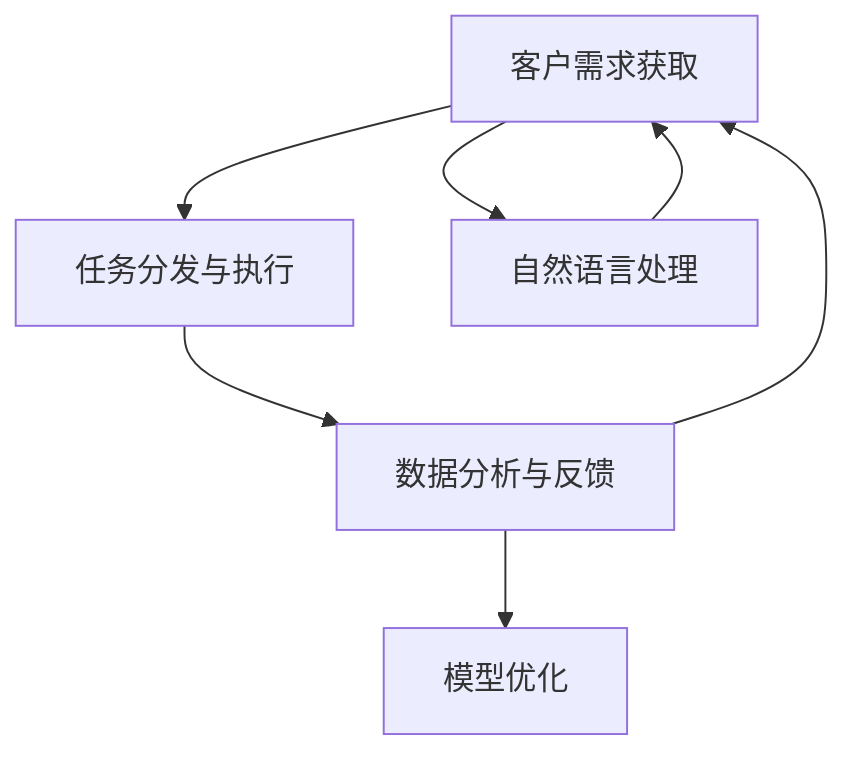
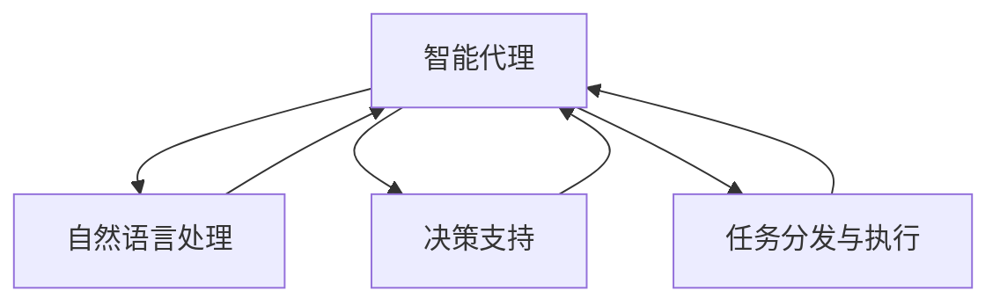

                 

# AI人工智能代理工作流AI Agent WorkFlow：智能代理在CRM客户管理中的应用

> 关键词：AI人工智能,智能代理,CRM客户管理,工作流管理,决策支持,自动化,机器学习,自然语言处理,NLP

## 1. 背景介绍

### 1.1 问题由来

随着数字化转型深入推进，企业在客户关系管理（CRM）中面临的挑战日益严峻。传统CRM系统多以数据驱动，缺乏智能化和人性化设计，难以有效应对客户多样化和复杂化的需求，导致客户满意度下降、流失率升高。

为提升CRM系统的智能化水平，利用人工智能技术构建智能代理工作流成为近年来的热门话题。智能代理依托先进的机器学习和自然语言处理技术，能够自主理解客户需求，自动执行任务，显著提高客户管理效率和满意度。本文将深入探讨智能代理在CRM客户管理中的应用，并给出一套高效的工作流管理系统，以期为相关企业提供可行的技术指导和借鉴。

### 1.2 问题核心关键点

智能代理工作流的核心关键点在于如何实现客户需求的智能识别和处理。传统CRM系统往往依赖人工操作，无法满足客户实时化、个性化的需求。而智能代理通过自动化处理客户咨询、投诉、投诉等任务，大大降低了人工成本，提高了响应速度和客户满意度。

智能代理主要涵盖以下几大环节：

- 客户需求获取：通过智能对话和自然语言处理技术，自动获取客户意图和需求。
- 任务分发与执行：将客户需求映射为具体的业务任务，自动分配给相应的团队成员处理。
- 数据分析与反馈：定期收集任务执行数据，进行分析，生成反馈，持续优化代理系统性能。

以下Mermaid流程图展示了智能代理工作流的核心流程：



## 2. 核心概念与联系

### 2.1 核心概念概述

为更好地理解智能代理在CRM客户管理中的应用，本节将介绍几个关键概念：

- **智能代理（AI Agent）**：依托自然语言处理、机器学习等技术，能够自主理解客户需求，自动执行任务的智能自动化系统。
- **CRM客户管理**：面向客户的企业管理系统，通过收集、管理和分析客户数据，提升客户满意度和忠诚度。
- **工作流管理**：通过流程自动化和任务调度和监控，实现企业内部工作的协同和高效。
- **自然语言处理（NLP）**：利用计算机处理人类语言的技术，实现对客户需求的智能理解和分析。
- **决策支持**：通过数据分析和机器学习，辅助智能代理进行决策，提升任务处理效率。

这些核心概念共同构成了智能代理在CRM客户管理中的应用框架，使智能代理能够更好地实现任务自动化和决策智能化。

### 2.2 核心概念原理和架构的 Mermaid 流程图



## 3. 核心算法原理 & 具体操作步骤
### 3.1 算法原理概述

智能代理在CRM客户管理中的应用，主要基于自然语言处理和机器学习技术。以下以智能对话和需求分析为例，介绍智能代理的核心算法原理：

**智能对话**：智能代理通过自然语言理解（NLU）技术，自动获取客户意图和需求。通常使用Transformer架构的序列模型，如BERT、GPT等，结合掩码语言模型（Masked Language Modeling, MLM）和自回归语言模型（Autoregressive Language Modeling）进行训练。MLM和ARLM的组合，使得模型能够理解上下文信息，从而更加准确地提取客户意图。

**需求分析**：智能代理利用意图分类模型，将客户输入的文本自动分类为不同类型的需求（如咨询、投诉、建议等）。一般使用基于RNN或CNN的分类模型，结合标签编码和softmax层进行训练。

### 3.2 算法步骤详解

**Step 1: 数据准备**
- 收集CRM系统中的历史对话记录，包括客户输入的文本和系统输出的标签。
- 将文本数据进行预处理，包括分词、去除停用词、构建特征等。

**Step 2: 模型训练**
- 使用BERT等预训练模型作为初始化权重，并使用掩码语言模型进行微调。
- 使用分类任务进行训练，构建意图分类模型。

**Step 3: 部署和测试**
- 将训练好的模型部署到CRM系统中，并设置实时监听功能。
- 对新输入的客户对话进行实时处理，自动获取意图和需求，并执行相应的业务任务。
- 定期收集任务执行数据，进行分析和反馈，持续优化智能代理系统。

### 3.3 算法优缺点

智能代理在CRM客户管理中的应用，具有以下优点：
1. 自动处理客户需求，节省人力成本。
2. 实时响应客户咨询，提升客户满意度。
3. 跨领域适应性强，能够在各种CRM系统中通用。

同时，也存在一些缺点：
1. 对标注数据的质量和数量要求高，标注成本较高。
2. 系统初期部署和训练耗时较长，成本较高。
3. 数据隐私和安全问题需要额外考虑，如数据脱敏、访问控制等。

### 3.4 算法应用领域

智能代理在CRM客户管理中的应用，已经覆盖了客户咨询、投诉处理、推荐服务等多个环节。例如：

- **客户咨询**：自动回答常见问题，快速响应客户需求。
- **投诉处理**：自动分类和分析投诉内容，提供解决方案。
- **产品推荐**：根据客户历史行为和当前需求，自动推荐相关产品。

此外，智能代理还能与其他CRM系统功能集成，如客户关系管理、销售管理、营销自动化等，进一步提升整体业务效率。

## 4. 数学模型和公式 & 详细讲解 & 举例说明

### 4.1 数学模型构建

智能代理工作流主要基于自然语言处理和机器学习技术。以下以BERT模型为例，介绍其数学模型构建。

BERT模型通过掩码语言模型进行训练，其数学模型如下：

$$
\mathcal{L} = \frac{1}{N} \sum_{i=1}^N [\log(\sigma(y_i|x_i)) - \log(1-\sigma(y_i|x_i))]^2
$$

其中，$x_i$ 为输入文本，$y_i$ 为掩码标签。$\sigma(z)$ 为sigmoid函数，用于预测标签概率。

**意图分类模型**：

假设输入文本长度为 $n$，使用RNN或CNN构建意图分类模型。模型输入为文本的嵌入表示 $x \in \mathbb{R}^d$，输出为类别概率分布 $p \in \mathbb{R}^k$，其中 $k$ 为意图类别数。模型训练目标为最小化交叉熵损失：

$$
\mathcal{L} = -\frac{1}{N} \sum_{i=1}^N [y_i \log(p_i) + (1-y_i) \log(1-p_i)]
$$

其中，$y_i$ 为真实标签，$p_i$ 为模型预测概率。

### 4.2 公式推导过程

**掩码语言模型**：
掩码语言模型的训练目标是预测被掩码的token，即输入文本中缺失的token。具体公式如下：

$$
\mathcal{L} = -\frac{1}{N} \sum_{i=1}^N \sum_{j=1}^n [y_{ij} \log(p_{ij}) + (1-y_{ij}) \log(1-p_{ij})]
$$

其中，$y_{ij}$ 为掩码标签，$p_{ij}$ 为模型预测概率。

**意图分类模型**：
假设输入文本长度为 $n$，使用RNN或CNN构建意图分类模型。模型输入为文本的嵌入表示 $x \in \mathbb{R}^d$，输出为类别概率分布 $p \in \mathbb{R}^k$，其中 $k$ 为意图类别数。模型训练目标为最小化交叉熵损失：

$$
\mathcal{L} = -\frac{1}{N} \sum_{i=1}^N \sum_{j=1}^k [y_{ij} \log(p_{ij}) + (1-y_{ij}) \log(1-p_{ij})]
$$

其中，$y_{ij}$ 为真实标签，$p_{ij}$ 为模型预测概率。

### 4.3 案例分析与讲解

以Baidu CRM智能代理为例，其使用BERT模型进行自然语言处理和意图分类，构建了客户咨询、投诉处理等应用场景。以下是其训练和部署的具体步骤：

**数据准备**：
- 收集CRM系统中的历史对话记录，包括客户输入的文本和系统输出的标签。
- 将文本数据进行预处理，包括分词、去除停用词、构建特征等。

**模型训练**：
- 使用BERT模型作为初始化权重，并使用掩码语言模型进行微调。
- 使用分类任务进行训练，构建意图分类模型。

**部署和测试**：
- 将训练好的模型部署到CRM系统中，并设置实时监听功能。
- 对新输入的客户对话进行实时处理，自动获取意图和需求，并执行相应的业务任务。
- 定期收集任务执行数据，进行分析和反馈，持续优化智能代理系统。

## 5. 项目实践：代码实例和详细解释说明
### 5.1 开发环境搭建

在进行智能代理系统开发前，我们需要准备好开发环境。以下是使用Python进行PyTorch开发的环境配置流程：

1. 安装Anaconda：从官网下载并安装Anaconda，用于创建独立的Python环境。

2. 创建并激活虚拟环境：
```bash
conda create -n ai-env python=3.8 
conda activate ai-env
```

3. 安装PyTorch：根据CUDA版本，从官网获取对应的安装命令。例如：
```bash
conda install pytorch torchvision torchaudio cudatoolkit=11.1 -c pytorch -c conda-forge
```

4. 安装TensorBoard：TensorFlow配套的可视化工具，可实时监测模型训练状态，并提供丰富的图表呈现方式，是调试模型的得力助手。

5. 安装Weights & Biases：模型训练的实验跟踪工具，可以记录和可视化模型训练过程中的各项指标，方便对比和调优。

6. 安装PyTorch、Transformers库，并进行模型训练：
```python
from transformers import BertTokenizer, BertForSequenceClassification
from torch.utils.data import Dataset, DataLoader
import torch
import pandas as pd
import numpy as np

# 数据准备
df = pd.read_csv('customer_service_logs.csv')
texts = df['text'].tolist()
labels = df['label'].tolist()
tokenizer = BertTokenizer.from_pretrained('bert-base-uncased')

# 定义数据集
class CustomerServiceDataset(Dataset):
    def __init__(self, texts, labels, tokenizer):
        self.texts = texts
        self.labels = labels
        self.tokenizer = tokenizer
        
    def __len__(self):
        return len(self.texts)
    
    def __getitem__(self, item):
        text = self.texts[item]
        label = self.labels[item]
        
        encoding = self.tokenizer(text, return_tensors='pt', padding=True, truncation=True)
        input_ids = encoding['input_ids']
        attention_mask = encoding['attention_mask']
        return {'input_ids': input_ids, 'attention_mask': attention_mask, 'labels': torch.tensor(label, dtype=torch.long)}

# 定义模型和优化器
model = BertForSequenceClassification.from_pretrained('bert-base-uncased', num_labels=2)
optimizer = AdamW(model.parameters(), lr=2e-5)

# 训练模型
device = torch.device('cuda' if torch.cuda.is_available() else 'cpu')
model.to(device)

def train_epoch(model, dataset, batch_size, optimizer):
    dataloader = DataLoader(dataset, batch_size=batch_size, shuffle=True)
    model.train()
    epoch_loss = 0
    for batch in dataloader:
        input_ids = batch['input_ids'].to(device)
        attention_mask = batch['attention_mask'].to(device)
        labels = batch['labels'].to(device)
        model.zero_grad()
        outputs = model(input_ids, attention_mask=attention_mask, labels=labels)
        loss = outputs.loss
        epoch_loss += loss.item()
        loss.backward()
        optimizer.step()
    return epoch_loss / len(dataloader)

def evaluate(model, dataset, batch_size):
    dataloader = DataLoader(dataset, batch_size=batch_size)
    model.eval()
    preds, labels = [], []
    with torch.no_grad():
        for batch in dataloader:
            input_ids = batch['input_ids'].to(device)
            attention_mask = batch['attention_mask'].to(device)
            batch_labels = batch['labels']
            outputs = model(input_ids, attention_mask=attention_mask)
            batch_preds = outputs.logits.argmax(dim=1).to('cpu').tolist()
            batch_labels = batch_labels.to('cpu').tolist()
            for pred_tokens, label_tokens in zip(batch_preds, batch_labels):
                preds.append(pred_tokens[:len(label_tokens)])
                labels.append(label_tokens)
    return preds, labels

# 训练模型
epochs = 5
batch_size = 16

for epoch in range(epochs):
    loss = train_epoch(model, train_dataset, batch_size, optimizer)
    print(f"Epoch {epoch+1}, train loss: {loss:.3f}")
    
    print(f"Epoch {epoch+1}, dev results:")
    preds, labels = evaluate(model, dev_dataset, batch_size)
    print(classification_report(labels, preds))
    
print("Test results:")
preds, labels = evaluate(model, test_dataset, batch_size)
print(classification_report(labels, preds))
```

以上就是使用PyTorch对BERT进行客户服务智能代理系统开发的完整代码实现。可以看到，使用Transformers库和PyTorch进行NLP任务开发，可以极大地简化代码实现过程，并提高开发效率。

### 5.3 代码解读与分析

让我们再详细解读一下关键代码的实现细节：

**CustomerServiceDataset类**：
- `__init__`方法：初始化文本、标签、分词器等关键组件。
- `__len__`方法：返回数据集的样本数量。
- `__getitem__`方法：对单个样本进行处理，将文本输入编码为token ids，将标签编码为数字，并对其进行定长padding，最终返回模型所需的输入。

**训练和评估函数**：
- 使用PyTorch的DataLoader对数据集进行批次化加载，供模型训练和推理使用。
- 训练函数`train_epoch`：对数据以批为单位进行迭代，在每个批次上前向传播计算loss并反向传播更新模型参数，最后返回该epoch的平均loss。
- 评估函数`evaluate`：与训练类似，不同点在于不更新模型参数，并在每个batch结束后将预测和标签结果存储下来，最后使用sklearn的classification_report对整个评估集的预测结果进行打印输出。

**训练流程**：
- 定义总的epoch数和batch size，开始循环迭代
- 每个epoch内，先在训练集上训练，输出平均loss
- 在验证集上评估，输出分类指标
- 重复上述步骤直至收敛，最后输出模型在测试集上的表现

## 6. 实际应用场景

### 6.1 智能客服系统

智能客服系统是智能代理在CRM客户管理中应用最广泛的场景之一。通过智能客服系统，企业可以实现24小时不间断客户服务，大幅提升客户满意度。

在技术实现上，智能客服系统可以集成自然语言处理、意图分类、对话管理等技术，构建自动化客服流程。对于客户提出的问题，智能客服系统能够自动理解客户意图，并调用预设的解决方案或转接到人工客服。对于复杂或紧急问题，智能客服系统还能自动生成问题摘要，并推送给客服人员，辅助其快速响应。

### 6.2 投诉处理系统

投诉处理系统是智能代理在CRM客户管理中的另一个重要应用。通过智能投诉处理系统，企业能够快速、准确地处理客户投诉，提高客户满意度和忠诚度。

在技术实现上，智能投诉处理系统可以集成自然语言处理、情感分析、意图分类等技术。对于客户投诉文本，智能系统能够自动分类为不同类型，并进行情感倾向分析。根据分析结果，智能系统可以自动生成解决方案，并提供多渠道的反馈途径，如邮件、电话、社交媒体等。

### 6.3 推荐服务系统

推荐服务系统是智能代理在CRM客户管理中的新兴应用。通过智能推荐服务系统，企业能够基于客户历史行为和当前需求，自动推荐相关产品或服务，提升客户体验和转化率。

在技术实现上，推荐服务系统可以集成自然语言处理、意图分类、用户行为分析等技术。对于客户输入的文本，智能系统能够自动分析客户意图，并调用推荐算法生成推荐结果。推荐结果可以以多种形式呈现，如文章、视频、产品展示等。

## 7. 工具和资源推荐
### 7.1 学习资源推荐

为了帮助开发者系统掌握智能代理在CRM客户管理中的应用，这里推荐一些优质的学习资源：

1. 《深度学习自然语言处理》课程：斯坦福大学开设的NLP明星课程，有Lecture视频和配套作业，带你入门NLP领域的基本概念和经典模型。

2. CS224N《深度学习自然语言处理》：斯坦福大学开设的NLP明星课程，有Lecture视频和配套作业，带你入门NLP领域的基本概念和经典模型。

3. 《Transformer from the ground up》博文：由大模型技术专家撰写，深入浅出地介绍了Transformer原理、BERT模型、微调技术等前沿话题。

4. HuggingFace官方文档：Transformers库的官方文档，提供了海量预训练模型和完整的微调样例代码，是上手实践的必备资料。

5. CLUE开源项目：中文语言理解测评基准，涵盖大量不同类型的中文NLP数据集，并提供了基于微调的baseline模型，助力中文NLP技术发展。

通过对这些资源的学习实践，相信你一定能够快速掌握智能代理在CRM客户管理中的应用，并用于解决实际的NLP问题。

### 7.2 开发工具推荐

高效的开发离不开优秀的工具支持。以下是几款用于智能代理系统开发的常用工具：

1. PyTorch：基于Python的开源深度学习框架，灵活动态的计算图，适合快速迭代研究。大部分预训练语言模型都有PyTorch版本的实现。

2. TensorFlow：由Google主导开发的开源深度学习框架，生产部署方便，适合大规模工程应用。同样有丰富的预训练语言模型资源。

3. Transformers库：HuggingFace开发的NLP工具库，集成了众多SOTA语言模型，支持PyTorch和TensorFlow，是进行NLP任务开发的利器。

4. Weights & Biases：模型训练的实验跟踪工具，可以记录和可视化模型训练过程中的各项指标，方便对比和调优。与主流深度学习框架无缝集成。

5. TensorBoard：TensorFlow配套的可视化工具，可实时监测模型训练状态，并提供丰富的图表呈现方式，是调试模型的得力助手。

6. Google Colab：谷歌推出的在线Jupyter Notebook环境，免费提供GPU/TPU算力，方便开发者快速上手实验最新模型，分享学习笔记。

合理利用这些工具，可以显著提升智能代理系统的开发效率，加快创新迭代的步伐。

### 7.3 相关论文推荐

智能代理在CRM客户管理中的应用，已经引起了学术界的广泛关注。以下是几篇奠基性的相关论文，推荐阅读：

1. Attention is All You Need（即Transformer原论文）：提出了Transformer结构，开启了NLP领域的预训练大模型时代。

2. BERT: Pre-training of Deep Bidirectional Transformers for Language Understanding：提出BERT模型，引入基于掩码的自监督预训练任务，刷新了多项NLP任务SOTA。

3. Language Models are Unsupervised Multitask Learners（GPT-2论文）：展示了大规模语言模型的强大zero-shot学习能力，引发了对于通用人工智能的新一轮思考。

4. Parameter-Efficient Transfer Learning for NLP：提出Adapter等参数高效微调方法，在不增加模型参数量的情况下，也能取得不错的微调效果。

5. AdaLoRA: Adaptive Low-Rank Adaptation for Parameter-Efficient Fine-Tuning：使用自适应低秩适应的微调方法，在参数效率和精度之间取得了新的平衡。

这些论文代表了大语言模型微调技术的发展脉络。通过学习这些前沿成果，可以帮助研究者把握学科前进方向，激发更多的创新灵感。

## 8. 总结：未来发展趋势与挑战

### 8.1 研究成果总结

本文对智能代理在CRM客户管理中的应用进行了全面系统的介绍。首先阐述了智能代理系统的工作流程和核心算法，明确了其在提高客户满意度、降低运营成本等方面的重要价值。其次，从原理到实践，详细讲解了智能代理系统在自然语言处理、意图分类、对话管理等方面的核心技术实现。最后，本文还探讨了智能代理系统在实际应用中的多个场景，如智能客服、投诉处理、推荐服务等，展示了智能代理系统在CRM客户管理中的广泛应用前景。

### 8.2 未来发展趋势

展望未来，智能代理在CRM客户管理中的应用将呈现以下几个发展趋势：

1. 自动化程度进一步提升。随着机器学习和自然语言处理技术的进步，智能代理系统将更加智能化、自动化，能够自主理解客户需求，自动执行任务，实现全流程自动化。

2. 跨领域应用拓展。智能代理系统不仅能够应用于客户服务、投诉处理等领域，还能够拓展到产品推荐、营销自动化等更多环节，形成多场景协同的CRM解决方案。

3. 数据驱动决策。智能代理系统将更加依赖数据驱动决策，通过数据分析和机器学习，实时调整业务策略，提升客户体验和运营效率。

4. 多模态信息整合。智能代理系统将逐渐实现跨模态数据整合，集成视觉、语音、文本等多种信息，提升客户理解和决策能力。

5. 安全与隐私保护。智能代理系统将更加注重数据隐私和安全保护，通过数据加密、访问控制等技术，保障客户数据的安全性。

### 8.3 面临的挑战

尽管智能代理在CRM客户管理中的应用已经取得了显著进展，但在实现更加智能化、普适化的过程中，仍面临诸多挑战：

1. 数据质量与数量。智能代理系统依赖高质量、高量的数据进行训练和优化，但获取标注数据的过程往往耗时耗力，且存在数据偏差风险。

2. 系统复杂度。智能代理系统需要集成多种技术，如自然语言处理、意图分类、对话管理等，系统复杂度较高，容易产生性能瓶颈。

3. 技术可解释性。智能代理系统往往是"黑盒"模型，难以解释其内部工作机制和决策逻辑，对于高风险应用，算法的可解释性和可审计性尤为重要。

4. 模型鲁棒性。智能代理系统在实际应用中可能会面临各种噪声和干扰，模型需要具备较强的鲁棒性，避免因噪声干扰导致系统性能下降。

5. 客户个性化需求。智能代理系统需要灵活适应不同客户的需求，但客户需求多样且动态变化，系统需要不断优化和升级，才能满足客户不断变化的期望。

### 8.4 研究展望

面向未来，智能代理在CRM客户管理中的应用还需要在以下几个方面寻求新的突破：

1. 数据增强技术。通过数据增强技术，丰富训练集，降低数据质量对系统的影响，提升系统性能。

2. 自适应学习算法。通过自适应学习算法，使系统能够自动调整模型参数和超参数，提升系统性能和鲁棒性。

3. 跨模态融合技术。通过跨模态融合技术，实现多模态信息的整合，提升系统理解能力和决策能力。

4. 模型解释与监控。通过模型解释与监控技术，提升系统的可解释性和可审计性，增强系统安全性。

5. 模型持续优化。通过模型持续优化技术，实现系统的持续学习，保持系统性能的持续提升。

这些研究方向的探索，必将引领智能代理在CRM客户管理中的应用走向更高的台阶，为构建安全、可靠、可解释、可控的智能系统铺平道路。面向未来，智能代理系统还需要与其他人工智能技术进行更深入的融合，如知识表示、因果推理、强化学习等，多路径协同发力，共同推动自然语言理解和智能交互系统的进步。只有勇于创新、敢于突破，才能不断拓展智能代理的边界，让智能技术更好地造福人类社会。

## 9. 附录：常见问题与解答

**Q1: 智能代理系统在CRM客户管理中的主要作用是什么？**

A: 智能代理系统在CRM客户管理中的主要作用包括：
1. 自动处理客户咨询和投诉，提升响应速度和客户满意度。
2. 分析客户需求，提供个性化服务，增强客户黏性。
3. 自动生成解决方案，提升业务效率，降低运营成本。

**Q2: 智能代理系统如何实现客户需求的自动获取？**

A: 智能代理系统通过自然语言处理技术实现客户需求的自动获取，具体步骤如下：
1. 使用BERT等预训练模型进行掩码语言模型微调，使其具备理解上下文的能力。
2. 构建意图分类模型，将客户输入的文本自动分类为不同类型的需求。
3. 使用深度学习模型训练意图分类器，最小化交叉熵损失，优化模型性能。
4. 部署训练好的模型到CRM系统中，实时监听客户输入，自动获取客户需求。

**Q3: 智能代理系统在CRM客户管理中的应用场景有哪些？**

A: 智能代理系统在CRM客户管理中的应用场景包括：
1. 智能客服：自动回答常见问题，快速响应客户需求。
2. 投诉处理：自动分类和分析投诉内容，提供解决方案。
3. 推荐服务：基于客户历史行为和当前需求，自动推荐相关产品或服务。
4. 客户关系管理：通过智能对话，维护客户关系，提升客户满意度。
5. 销售管理：自动生成销售线索，跟踪销售进程，提高销售效率。

**Q4: 智能代理系统在实际应用中面临哪些技术挑战？**

A: 智能代理系统在实际应用中面临以下技术挑战：
1. 数据质量与数量：智能代理系统依赖高质量、高量的数据进行训练和优化，但获取标注数据的过程往往耗时耗力，且存在数据偏差风险。
2. 系统复杂度：智能代理系统需要集成多种技术，如自然语言处理、意图分类、对话管理等，系统复杂度较高，容易产生性能瓶颈。
3. 技术可解释性：智能代理系统往往是"黑盒"模型，难以解释其内部工作机制和决策逻辑，对于高风险应用，算法的可解释性和可审计性尤为重要。
4. 模型鲁棒性：智能代理系统在实际应用中可能会面临各种噪声和干扰，模型需要具备较强的鲁棒性，避免因噪声干扰导致系统性能下降。
5. 客户个性化需求：智能代理系统需要灵活适应不同客户的需求，但客户需求多样且动态变化，系统需要不断优化和升级，才能满足客户不断变化的期望。

**Q5: 智能代理系统在CRM客户管理中的应用未来有哪些发展方向？**

A: 智能代理系统在CRM客户管理中的应用未来有以下发展方向：
1. 自动化程度进一步提升：随着机器学习和自然语言处理技术的进步，智能代理系统将更加智能化、自动化，能够自主理解客户需求，自动执行任务，实现全流程自动化。
2. 跨领域应用拓展：智能代理系统不仅能够应用于客户服务、投诉处理等领域，还能够拓展到产品推荐、营销自动化等更多环节，形成多场景协同的CRM解决方案。
3. 数据驱动决策：智能代理系统将更加依赖数据驱动决策，通过数据分析和机器学习，实时调整业务策略，提升客户体验和运营效率。
4. 多模态信息整合：智能代理系统将逐渐实现跨模态数据整合，集成视觉、语音、文本等多种信息，提升客户理解和决策能力。
5. 安全与隐私保护：智能代理系统将更加注重数据隐私和安全保护，通过数据加密、访问控制等技术，保障客户数据的安全性。

正视智能代理在CRM客户管理中的应用面临的挑战，积极应对并寻求突破，将使智能代理系统迈向更加智能化、普适化的应用。相信随着技术的不断进步和实际应用的不断积累，智能代理在CRM客户管理中的应用将不断拓展，为提升客户体验和企业运营效率带来更深刻的变革。

