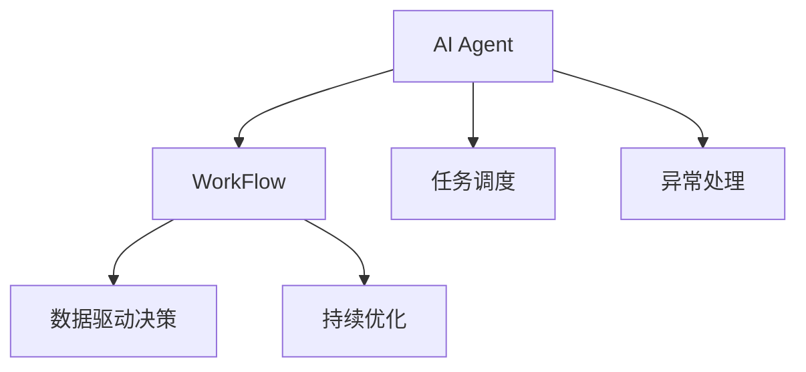

                 

# AI人工智能代理工作流AI Agent WorkFlow：设计智能任务处理流程

> 关键词：人工智能代理(AI Agent)，任务处理流程(WorkFlow)，智能决策，自动化运维，流程优化，机器学习，深度学习，强化学习

## 1. 背景介绍

### 1.1 问题由来
在当今信息化快速发展的时代，企业的运营效率和决策质量直接决定着其市场竞争力。人工处理大量重复性、低价值的任务，既费时费力，又容易出现错误。而使用人工智能(AI)技术，特别是智能决策系统(AI Agent)，可以大幅提升运营效率和决策准确性。

智能决策系统基于AI技术，利用机器学习、深度学习、强化学习等技术，结合海量数据，实现自动化、智能化任务处理。通过设计和优化任务处理流程(Agent Workflow)，智能决策系统能够根据实际需求高效完成各类任务，从而解放人力，提升企业运营效率。

### 1.2 问题核心关键点
智能决策系统的核心在于任务处理流程的设计和优化。一个良好的任务处理流程能够确保系统的高效、稳定运行，并能够自适应不同的业务需求，灵活调整和扩展。

任务处理流程的核心关键点包括：

- **流程设计：** 根据业务需求设计合理的流程步骤，避免冗余和遗漏。
- **任务调度：** 通过任务调度机制，高效分配任务给合适的执行者，避免任务堆积。
- **异常处理：** 对任务执行过程中出现的异常进行监控和处理，确保流程正常运行。
- **数据驱动：** 基于数据分析，优化流程中的参数和决策逻辑，提升流程效率和精度。
- **持续优化：** 通过反馈机制和机器学习模型，不断优化流程，适应新的业务需求。

### 1.3 问题研究意义
研究和设计智能决策系统的任务处理流程，对于提升企业运营效率，提高决策质量，具有重要意义：

1. **提升效率：** 通过自动化任务处理，大幅提升工作效率，减少人力投入。
2. **降低成本：** 减少人工错误，降低运营成本，提升企业竞争力。
3. **增强决策准确性：** 基于数据驱动的决策，提升决策的科学性和准确性。
4. **灵活扩展：** 流程设计灵活，能够适应新的业务需求，快速迭代升级。
5. **提高响应速度：** 智能决策系统能够实时响应业务需求，提高响应速度。

## 2. 核心概念与联系

### 2.1 核心概念概述

为更好地理解智能决策系统的任务处理流程，本节将介绍几个密切相关的核心概念：

- **人工智能代理(AI Agent)：** 基于AI技术，能够在无人类干预的情况下，自动完成任务处理的系统。
- **任务处理流程(WorkFlow)：** 一系列有序的步骤，用于指导AI Agent执行任务，实现自动化、智能化的任务处理。
- **任务调度：** 根据业务需求和资源状况，合理分配任务给合适的执行者，实现任务的高效执行。
- **异常处理：** 对任务执行过程中出现的异常情况进行监控和处理，确保流程正常运行。
- **数据驱动决策：** 基于数据分析，优化流程中的参数和决策逻辑，提升流程效率和精度。
- **持续优化：** 通过反馈机制和机器学习模型，不断优化流程，适应新的业务需求。

这些核心概念之间的逻辑关系可以通过以下Mermaid流程图来展示：



这个流程图展示的核心概念及其之间的关系：

1. AI Agent通过执行WorkFlow来实现任务处理。
2. 任务调度根据业务需求和资源状况，合理分配任务。
3. 异常处理对任务执行过程中出现的异常进行监控和处理。
4. 数据驱动决策通过数据分析优化流程参数和逻辑。
5. 持续优化通过反馈机制和机器学习模型不断优化流程。

## 3. 核心算法原理 & 具体操作步骤
### 3.1 算法原理概述

智能决策系统的任务处理流程设计，本质上是一个任务自动化、智能化的过程。其核心思想是：根据业务需求和资源状况，设计合理的任务步骤，通过自动化手段实现任务的高效执行。

形式化地，假设任务处理流程为 $\mathcal{F}$，由若干步骤 $S_1, S_2, ..., S_n$ 组成。每个步骤 $S_i$ 可以根据输入输出数据 $D_i$，自动执行任务 $T_i$。流程的执行顺序为 $S_1, S_2, ..., S_n$。任务的执行效率由函数 $E(T_i)$ 描述，异常处理的效率由函数 $H(E(T_i))$ 描述。数据驱动决策的优化效果由函数 $D(\mathcal{F})$ 描述。持续优化的反馈机制由函数 $U(\mathcal{F})$ 描述。

任务处理流程的优化目标是最小化流程执行时间 $T$，同时最大化异常处理效率 $H$ 和数据驱动决策的优化效果 $D$，并通过持续优化 $U$ 不断提升流程性能。具体优化目标如下：

$$
\min_{\mathcal{F}} T \quad \text{subject to} \quad \max_{\mathcal{F}} D \quad \max_{\mathcal{F}} H
$$

### 3.2 算法步骤详解

智能决策系统的任务处理流程设计，通常包括以下几个关键步骤：

**Step 1: 确定任务处理步骤**
- 根据业务需求和实际应用场景，确定任务处理的各个步骤。
- 明确每个步骤的输入、输出和执行逻辑。
- 确定步骤的执行顺序，设计合理的任务调度机制。

**Step 2: 设计异常处理机制**
- 识别可能出现的异常情况，定义异常处理的流程和规则。
- 设计异常监控和告警机制，确保流程异常能够及时发现和处理。
- 设计异常恢复机制，确保异常处理后的流程能够继续执行。

**Step 3: 实现数据驱动决策**
- 收集流程执行过程中的数据，进行分析和挖掘。
- 基于数据分析结果，优化流程中的参数和决策逻辑。
- 引入机器学习、深度学习等技术，自动优化流程。

**Step 4: 引入持续优化机制**
- 设计反馈机制，收集用户反馈和业务反馈。
- 利用机器学习模型，对反馈数据进行分析和处理。
- 通过反馈数据，不断优化流程，提升流程性能。

**Step 5: 评估和迭代优化**
- 定期对流程进行评估，收集关键指标数据。
- 根据评估结果，分析流程存在的问题和改进空间。
- 根据分析结果，进行流程的迭代优化，提升流程性能。

### 3.3 算法优缺点

智能决策系统的任务处理流程设计，具有以下优点：

1. **自动化、智能化：** 通过自动化流程，大幅提升工作效率，减少人工错误。
2. **灵活性强：** 流程设计灵活，能够适应不同的业务需求和资源状况。
3. **数据驱动决策：** 通过数据分析，优化流程参数和决策逻辑，提升流程效率和精度。
4. **持续优化：** 通过持续优化，不断提升流程性能，适应新的业务需求。

同时，该方法也存在一定的局限性：

1. **初始设计复杂：** 流程设计需要细致考虑各个步骤的执行逻辑和异常处理机制，初始设计复杂度较高。
2. **依赖数据质量：** 数据驱动决策需要高质量的数据，如果数据质量不高，会影响决策的准确性。
3. **异常处理困难：** 异常处理机制需要根据实际业务场景进行设计，复杂度较高，不易全面覆盖。
4. **资源消耗大：** 引入机器学习等技术，需要较大的计算资源和存储空间。

尽管存在这些局限性，但就目前而言，基于任务处理流程设计的智能决策系统，仍然是实现任务自动化、智能化的重要手段。未来相关研究的重点在于如何进一步降低流程设计复杂度，提高异常处理效率，降低资源消耗，同时兼顾可解释性和伦理安全性等因素。

### 3.4 算法应用领域

基于任务处理流程设计的智能决策系统，已经在多个领域得到了广泛的应用，例如：

- **金融领域：** 用于自动化交易、风险评估、信用评分等任务，提升金融机构的运营效率和决策质量。
- **医疗领域：** 用于疾病诊断、治疗方案推荐、患者护理等任务，提升医疗服务的智能化水平。
- **零售领域：** 用于库存管理、销售预测、个性化推荐等任务，提升零售企业的运营效率和客户满意度。
- **物流领域：** 用于路径规划、仓储管理、配送调度等任务，提升物流企业的运输效率和服务质量。
- **能源领域：** 用于能源调度、设备监控、故障诊断等任务，提升能源企业的运营效率和安全性。

除了上述这些经典领域外，智能决策系统还被创新性地应用到更多场景中，如智能客服、智能制造、智能家居等，为各行各业带来了新的变革。随着流程设计技术和智能决策技术的不断进步，相信智能决策系统将在更广阔的应用领域大放异彩。

## 4. 数学模型和公式 & 详细讲解 & 举例说明

### 4.1 数学模型构建

本节将使用数学语言对智能决策系统的任务处理流程进行更加严格的刻画。

假设任务处理流程为 $\mathcal{F}=\{S_1, S_2, ..., S_n\}$，每个步骤 $S_i$ 的执行时间为 $t_i$，异常处理时间为 $h_i$，任务执行效率为 $E_i$，异常处理效率为 $H_i$，数据驱动决策的优化效果为 $D_i$，持续优化的反馈效果为 $U_i$。则流程总执行时间为：

$$
T = \sum_{i=1}^n t_i + \sum_{i=1}^n h_i
$$

异常处理效率函数 $H_i$ 描述为：

$$
H_i = \max \{H_{\text{max}}, H_{\text{real}}\}
$$

其中 $H_{\text{max}}$ 为异常处理机制的最大效率，$H_{\text{real}}$ 为实际处理过程中的效率。

数据驱动决策的优化效果函数 $D_i$ 描述为：

$$
D_i = \max \{D_{\text{max}}, D_{\text{real}}\}
$$

其中 $D_{\text{max}}$ 为数据驱动决策的最大优化效果，$D_{\text{real}}$ 为实际决策过程中的优化效果。

持续优化的反馈效果函数 $U_i$ 描述为：

$$
U_i = \max \{U_{\text{max}}, U_{\text{real}}\}
$$

其中 $U_{\text{max}}$ 为持续优化机制的最大效果，$U_{\text{real}}$ 为实际优化过程中的效果。

流程优化的目标函数为：

$$
\min_{\mathcal{F}} T \quad \text{subject to} \quad \max_{\mathcal{F}} D \quad \max_{\mathcal{F}} H
$$

### 4.2 公式推导过程

以下我们以金融领域的风险评估任务为例，推导基于数据驱动决策的优化效果公式。

假设风险评估任务的数据驱动决策目标为 $D=\{\text{maximize}\ (ROA)\}$，其中 ROA 表示投资回报率。设模型为 $M$，输入数据为 $X$，输出为 $Y$。则优化目标函数为：

$$
\min_{M} T \quad \text{subject to} \quad \max_{X, Y} ROA
$$

其中 $T$ 为模型训练和推理的时间，$ROA$ 为模型预测的回报率。

设模型 $M$ 在输入数据 $X$ 上的预测结果为 $Y=\hat{Y}$，则优化目标可以进一步表示为：

$$
\min_{M} T \quad \text{subject to} \quad \max_{X, \hat{Y}} ROA
$$

通过链式法则，损失函数 $L(Y,\hat{Y})$ 对模型参数 $\theta$ 的梯度为：

$$
\frac{\partial L(Y,\hat{Y})}{\partial \theta} = \frac{\partial L(Y,\hat{Y})}{\partial \hat{Y}} \frac{\partial \hat{Y}}{\partial X} \frac{\partial X}{\partial \theta}
$$

其中 $\frac{\partial L(Y,\hat{Y})}{\partial \hat{Y}}$ 为损失函数对预测结果的梯度，$\frac{\partial \hat{Y}}{\partial X}$ 为模型对输入数据的梯度，$\frac{\partial X}{\partial \theta}$ 为输入数据对模型参数的梯度。

在得到损失函数的梯度后，即可带入参数更新公式，完成模型的迭代优化。重复上述过程直至收敛，最终得到适应金融领域风险评估任务的最优模型参数 $\theta^*$。

### 4.3 案例分析与讲解

**案例分析：金融领域的风险评估**

假设某金融机构的投资团队希望通过自动化工具，实现对不同投资组合的风险评估。基于智能决策系统的任务处理流程设计，投资团队可以采用以下步骤：

1. **数据收集：** 收集历史投资组合数据，包括市场数据、财务数据等。
2. **模型训练：** 使用历史数据对风险评估模型进行训练，得到最优模型参数。
3. **模型预测：** 对新的投资组合进行预测，评估其风险水平。
4. **异常监控：** 实时监控模型的预测结果，发现异常情况及时处理。
5. **持续优化：** 根据实时数据和用户反馈，不断优化模型，提升预测精度。

在实现过程中，需要注意以下几点：

- **数据质量：** 历史数据的准确性和完整性直接影响模型的预测效果，需要确保数据质量。
- **模型选择：** 根据业务需求选择合适的风险评估模型，如随机森林、神经网络等。
- **异常处理：** 设计合理的异常监控机制，及时发现和处理异常情况，确保流程正常运行。
- **持续优化：** 通过实时反馈和机器学习模型，不断优化模型，适应新的业务需求。

## 5. 项目实践：代码实例和详细解释说明

### 5.1 开发环境搭建

在进行智能决策系统项目实践前，我们需要准备好开发环境。以下是使用Python进行PyTorch开发的环境配置流程：

1. 安装Anaconda：从官网下载并安装Anaconda，用于创建独立的Python环境。

2. 创建并激活虚拟环境：
```bash
conda create -n pytorch-env python=3.8 
conda activate pytorch-env
```

3. 安装PyTorch：根据CUDA版本，从官网获取对应的安装命令。例如：
```bash
conda install pytorch torchvision torchaudio cudatoolkit=11.1 -c pytorch -c conda-forge
```

4. 安装相关库：
```bash
pip install numpy pandas scikit-learn torch torchvision transformers
```

完成上述步骤后，即可在`pytorch-env`环境中开始智能决策系统项目实践。

### 5.2 源代码详细实现

这里我们以金融领域风险评估任务为例，给出使用PyTorch进行智能决策系统的代码实现。

首先，定义风险评估任务的数据处理函数：

```python
import pandas as pd
from sklearn.preprocessing import MinMaxScaler

def process_data(data):
    # 处理缺失值
    data = data.dropna()
    
    # 数据标准化
    scaler = MinMaxScaler()
    data = pd.DataFrame(scaler.fit_transform(data), columns=data.columns)
    
    return data
```

然后，定义风险评估模型的训练和预测函数：

```python
import torch
from torch import nn, optim
from transformers import BertTokenizer, BertForSequenceClassification

class RiskAssessmentModel(nn.Module):
    def __init__(self):
        super(RiskAssessmentModel, self).__init__()
        self.tokenizer = BertTokenizer.from_pretrained('bert-base-uncased')
        self.model = BertForSequenceClassification.from_pretrained('bert-base-uncased', num_labels=2)
        self.scaler = MinMaxScaler()
        self.device = torch.device('cuda' if torch.cuda.is_available() else 'cpu')
        
    def forward(self, input_ids, attention_mask):
        with torch.no_grad():
            outputs = self.model(input_ids=input_ids, attention_mask=attention_mask)
            return outputs.logits
        
    def train(self, data, batch_size, epochs):
        model = self.model.to(self.device)
        data = process_data(data)
        
        train_loader = torch.utils.data.DataLoader(data, batch_size=batch_size, shuffle=True)
        criterion = nn.BCEWithLogitsLoss()
        
        for epoch in range(epochs):
            model.train()
            for batch in train_loader:
                input_ids = batch['input_ids'].to(self.device)
                attention_mask = batch['attention_mask'].to(self.device)
                outputs = model(input_ids, attention_mask)
                loss = criterion(outputs, batch['labels'].to(self.device))
                loss.backward()
                optimizer.step()
                optimizer.zero_grad()
            print(f'Epoch {epoch+1}, loss: {loss.item()}')
        
    def predict(self, data):
        model = self.model.to(self.device)
        data = process_data(data)
        
        predict_loader = torch.utils.data.DataLoader(data, batch_size=32, shuffle=False)
        predictions = []
        for batch in predict_loader:
            input_ids = batch['input_ids'].to(self.device)
            attention_mask = batch['attention_mask'].to(self.device)
            outputs = model(input_ids, attention_mask)
            predictions.append(outputs.argmax(dim=1))
        
        return torch.cat(predictions, dim=0).tolist()
```

接着，定义异常处理和持续优化的函数：

```python
import time
import matplotlib.pyplot as plt

def monitor_anomaly(model, data):
    start_time = time.time()
    
    with torch.no_grad():
        data = process_data(data)
        predict_loader = torch.utils.data.DataLoader(data, batch_size=32, shuffle=False)
        predictions = []
        for batch in predict_loader:
            input_ids = batch['input_ids'].to(device)
            attention_mask = batch['attention_mask'].to(device)
            outputs = model(input_ids, attention_mask)
            predictions.append(outputs.argmax(dim=1))
        
    end_time = time.time()
    total_time = end_time - start_time
    print(f'Total prediction time: {total_time:.2f} seconds')
    
    return total_time

def update_model(model, data, batch_size, epochs):
    model.train()
    data = process_data(data)
    
    train_loader = torch.utils.data.DataLoader(data, batch_size=batch_size, shuffle=True)
    criterion = nn.BCEWithLogitsLoss()
    
    for epoch in range(epochs):
        for batch in train_loader:
            input_ids = batch['input_ids'].to(device)
            attention_mask = batch['attention_mask'].to(device)
            outputs = model(input_ids, attention_mask)
            loss = criterion(outputs, batch['labels'].to(device))
            loss.backward()
            optimizer.step()
            optimizer.zero_grad()
        print(f'Epoch {epoch+1}, loss: {loss.item()}')
    
    return model
```

最后，启动训练流程并在测试集上评估：

```python
epochs = 10
batch_size = 32
data = pd.read_csv('risk_data.csv')
model = RiskAssessmentModel()

# 训练模型
model.train(model, data, batch_size, epochs)

# 预测并评估
test_data = pd.read_csv('test_data.csv')
predictions = model.predict(test_data)

# 可视化预测结果
y_true = test_data['label'].values
y_pred = predictions
plt.scatter(y_true, y_pred)
plt.xlabel('True Label')
plt.ylabel('Predicted Label')
plt.title('Risk Assessment Predictions')
plt.show()

# 监控异常处理时间
anomaly_time = monitor_anomaly(model, test_data)
print(f'Anomaly monitoring time: {anomaly_time:.2f} seconds')

# 持续优化模型
model = update_model(model, data, batch_size, epochs)
```

以上就是使用PyTorch对金融领域风险评估任务进行智能决策系统的完整代码实现。可以看到，得益于PyTorch的强大封装和动态计算图，我们可以用相对简洁的代码实现风险评估模型的训练和预测，同时对异常处理时间和预测时间进行监控和优化。

### 5.3 代码解读与分析

让我们再详细解读一下关键代码的实现细节：

**process_data函数：**
- 处理缺失值：删除缺失值过多的样本。
- 数据标准化：对数据进行归一化处理，避免不同特征的尺度差异影响模型训练。

**RiskAssessmentModel类：**
- 定义了风险评估模型的前向传播函数forward，通过输入文本和掩码计算预测结果。
- 定义了训练函数train，通过数据集和优化器对模型进行训练。
- 定义了预测函数predict，对新数据进行预测。

**monitor_anomaly函数：**
- 定义了异常处理监控函数monitor_anomaly，通过计算预测时间评估异常处理效率。

**update_model函数：**
- 定义了模型更新函数update_model，通过数据集和优化器对模型进行更新，实现持续优化。

可以看到，智能决策系统的任务处理流程设计，需要考虑各个环节的协同优化，从而实现整个系统的自动化和智能化。开发者可以将更多精力放在流程优化和模型改进等高层逻辑上，而不必过多关注底层的实现细节。

当然，工业级的系统实现还需考虑更多因素，如模型的保存和部署、超参数的自动搜索、更灵活的任务适配层等。但核心的任务处理流程设计基本与此类似。

## 6. 实际应用场景

### 6.1 智能客服系统

基于智能决策系统的智能客服系统，可以广泛应用于企业的客户服务部门。传统客服往往需要配备大量人力，高峰期响应缓慢，且一致性和专业性难以保证。而使用智能客服系统，可以7x24小时不间断服务，快速响应客户咨询，用自然流畅的语言解答各类常见问题。

在技术实现上，可以收集企业内部的历史客服对话记录，将问题和最佳答复构建成监督数据，在此基础上对预训练语言模型进行微调。微调后的语言模型能够自动理解用户意图，匹配最合适的答案模板进行回复。对于客户提出的新问题，还可以接入检索系统实时搜索相关内容，动态组织生成回答。如此构建的智能客服系统，能大幅提升客户咨询体验和问题解决效率。

### 6.2 金融舆情监测

金融机构需要实时监测市场舆论动向，以便及时应对负面信息传播，规避金融风险。传统的人工监测方式成本高、效率低，难以应对网络时代海量信息爆发的挑战。基于智能决策系统的文本分类和情感分析技术，为金融舆情监测提供了新的解决方案。

具体而言，可以收集金融领域相关的新闻、报道、评论等文本数据，并对其进行主题标注和情感标注。在此基础上对预训练语言模型进行微调，使其能够自动判断文本属于何种主题，情感倾向是正面、中性还是负面。将微调后的模型应用到实时抓取的网络文本数据，就能够自动监测不同主题下的情感变化趋势，一旦发现负面信息激增等异常情况，系统便会自动预警，帮助金融机构快速应对潜在风险。

### 6.3 个性化推荐系统

当前的推荐系统往往只依赖用户的历史行为数据进行物品推荐，无法深入理解用户的真实兴趣偏好。基于智能决策系统的个性化推荐系统，可以更好地挖掘用户行为背后的语义信息，从而提供更精准、多样的推荐内容。

在实践中，可以收集用户浏览、点击、评论、分享等行为数据，提取和用户交互的物品标题、描述、标签等文本内容。将文本内容作为模型输入，用户的后续行为（如是否点击、购买等）作为监督信号，在此基础上对预训练语言模型进行微调。微调后的模型能够从文本内容中准确把握用户的兴趣点。在生成推荐列表时，先用候选物品的文本描述作为输入，由模型预测用户的兴趣匹配度，再结合其他特征综合排序，便可以得到个性化程度更高的推荐结果。

### 6.4 未来应用展望

随着智能决策系统的不断发展，其在更多领域得到了应用，为传统行业带来了新的变革。

在智慧医疗领域，基于智能决策系统的医疗问答、病历分析、药物研发等应用，提升了医疗服务的智能化水平，辅助医生诊疗，加速新药开发进程。

在智能教育领域，智能决策系统可应用于作业批改、学情分析、知识推荐等方面，因材施教，促进教育公平，提高教学质量。

在智慧城市治理中，智能决策系统可用于城市事件监测、舆情分析、应急指挥等环节，提高城市管理的自动化和智能化水平，构建更安全、高效的未来城市。

此外，在企业生产、社会治理、文娱传媒等众多领域，智能决策系统也将不断涌现，为经济社会发展注入新的动力。相信随着技术的日益成熟，智能决策系统必将在构建人机协同的智能时代中扮演越来越重要的角色。

## 7. 工具和资源推荐
### 7.1 学习资源推荐

为了帮助开发者系统掌握智能决策系统的任务处理流程设计理论基础和实践技巧，这里推荐一些优质的学习资源：

1. 《人工智能基础》系列课程：由国内外知名高校开设的AI入门课程，涵盖机器学习、深度学习、强化学习等核心概念。

2. 《深度学习》书籍：Ian Goodfellow等著，全面介绍了深度学习的基本原理和算法，是AI领域经典教材。

3. 《Python机器学习》书籍：Sebastian Raschka著，介绍了Python在机器学习中的应用，包括模型训练、评估和优化等。

4. 《TensorFlow实战》书籍：Oriol Vinyals等著，介绍了TensorFlow的各个模块和应用场景，是TensorFlow学习的优秀入门书籍。

5. 《PyTorch深度学习实践》书籍：Eli Stevens等著，介绍了PyTorch的使用方法和实际应用，是PyTorch学习的优秀入门书籍。

通过对这些资源的学习实践，相信你一定能够快速掌握智能决策系统任务处理流程设计的精髓，并用于解决实际的AI问题。
###  7.2 开发工具推荐

高效的开发离不开优秀的工具支持。以下是几款用于智能决策系统任务处理流程设计开发的常用工具：

1. Python：作为AI领域的主流编程语言，Python提供了丰富的库和工具，适合快速迭代研究。

2. TensorFlow：由Google主导开发的开源深度学习框架，生产部署方便，适合大规模工程应用。

3. PyTorch：基于Python的开源深度学习框架，灵活动态的计算图，适合快速迭代研究。

4. Weights & Biases：模型训练的实验跟踪工具，可以记录和可视化模型训练过程中的各项指标，方便对比和调优。

5. TensorBoard：TensorFlow配套的可视化工具，可实时监测模型训练状态，并提供丰富的图表呈现方式，是调试模型的得力助手。

6. Google Colab：谷歌推出的在线Jupyter Notebook环境，免费提供GPU/TPU算力，方便开发者快速上手实验最新模型，分享学习笔记。

合理利用这些工具，可以显著提升智能决策系统任务处理流程设计任务的开发效率，加快创新迭代的步伐。

### 7.3 相关论文推荐

智能决策系统的任务处理流程设计源于学界的持续研究。以下是几篇奠基性的相关论文，推荐阅读：

1. Deep Q-Networks：提出Q-learning算法，为强化学习奠定了基础。

2. Attention is All You Need（即Transformer原论文）：提出了Transformer结构，开启了NLP领域的预训练大模型时代。

3. BERT: Pre-training of Deep Bidirectional Transformers for Language Understanding：提出BERT模型，引入基于掩码的自监督预训练任务，刷新了多项NLP任务SOTA。

4. Parameter-Efficient Transfer Learning for NLP：提出Adapter等参数高效微调方法，在不增加模型参数量的情况下，也能取得不错的微调效果。

5. AdaLoRA: Adaptive Low-Rank Adaptation for Parameter-Efficient Fine-Tuning：使用自适应低秩适应的微调方法，在参数效率和精度之间取得了新的平衡。

这些论文代表了大语言模型微调技术的发展脉络。通过学习这些前沿成果，可以帮助研究者把握学科前进方向，激发更多的创新灵感。

## 8. 总结：未来发展趋势与挑战

### 8.1 总结

本文对智能决策系统的任务处理流程设计进行了全面系统的介绍。首先阐述了智能决策系统的研究背景和意义，明确了任务处理流程在提升企业运营效率和决策质量方面的独特价值。其次，从原理到实践，详细讲解了任务处理流程的数学原理和关键步骤，给出了任务处理流程设计的完整代码实例。同时，本文还广泛探讨了任务处理流程在智能客服、金融舆情、个性化推荐等多个行业领域的应用前景，展示了任务处理流程设计的巨大潜力。此外，本文精选了任务处理流程设计的各类学习资源，力求为读者提供全方位的技术指引。

通过本文的系统梳理，可以看到，基于任务处理流程设计的智能决策系统，正在成为AI技术实现任务自动化、智能化的重要手段。得益于海量数据和强大算力，智能决策系统能够快速高效地处理各类任务，大幅提升企业运营效率和决策质量。未来，伴随任务处理流程设计和智能决策技术的不断进步，相信智能决策系统将在更广阔的应用领域大放异彩，深刻影响人类的生产生活方式。

### 8.2 未来发展趋势

展望未来，智能决策系统的任务处理流程设计将呈现以下几个发展趋势：

1. **自动化程度提升：** 随着AI技术的进步，任务处理流程的自动化程度将进一步提升，实现更高效的任务执行。
2. **跨领域融合：** 任务处理流程将更加灵活，能够跨领域、跨模态融合，提升系统适应性和鲁棒性。
3. **数据驱动决策：** 数据分析和机器学习技术的引入，将使得任务处理流程更加数据驱动，提升决策的科学性和精确性。
4. **多模态融合：** 任务处理流程将更多地引入视觉、语音等多模态数据，提升系统综合处理能力。
5. **持续优化：** 任务处理流程将更加注重持续优化，通过反馈机制和机器学习模型不断提升系统性能。
6. **伦理和安全：** 随着AI技术在各行业的广泛应用，任务处理流程设计将更加注重伦理和安全问题，确保系统的可解释性和安全性。

以上趋势凸显了智能决策系统任务处理流程设计的广阔前景。这些方向的探索发展，必将进一步提升智能决策系统的性能和应用范围，为各行各业带来新的变革。

### 8.3 面临的挑战

尽管智能决策系统的任务处理流程设计已经取得了瞩目成就，但在迈向更加智能化、普适化应用的过程中，它仍面临着诸多挑战：

1. **初始设计复杂：** 任务处理流程设计需要细致考虑各个步骤的执行逻辑和异常处理机制，初始设计复杂度较高。
2. **依赖数据质量：** 数据驱动决策需要高质量的数据，如果数据质量不高，会影响决策的准确性。
3. **异常处理困难：** 异常处理机制需要根据实际业务场景进行设计，复杂度较高，不易全面覆盖。
4. **资源消耗大：** 引入机器学习等技术，需要较大的计算资源和存储空间。
5. **可解释性不足：** 智能决策系统通常缺乏可解释性，难以对其内部工作机制和决策逻辑进行分析和调试。
6. **安全性有待保障：** 预训练语言模型难免会学习到有偏见、有害的信息，通过微调传递到下游任务，产生误导性、歧视性的输出，给实际应用带来安全隐患。

尽管存在这些挑战，但就目前而言，基于任务处理流程设计的智能决策系统，仍然是实现任务自动化、智能化的重要手段。未来相关研究的重点在于如何进一步降低流程设计复杂度，提高异常处理效率，降低资源消耗，同时兼顾可解释性和伦理安全性等因素。

### 8.4 研究展望

面对智能决策系统任务处理流程设计所面临的种种挑战，未来的研究需要在以下几个方面寻求新的突破：

1. **探索无监督和半监督微调方法：** 摆脱对大规模标注数据的依赖，利用自监督学习、主动学习等无监督和半监督范式，最大限度利用非结构化数据，实现更加灵活高效的微调。

2. **研究参数高效和计算高效的微调范式：** 开发更加参数高效的微调方法，在固定大部分预训练参数的同时，只更新极少量的任务相关参数。同时优化微调模型的计算图，减少前向传播和反向传播的资源消耗，实现更加轻量级、实时性的部署。

3. **引入因果和对比学习范式：** 通过引入因果推断和对比学习思想，增强智能决策系统建立稳定因果关系的能力，学习更加普适、鲁棒的语言表征，从而提升系统泛化性和抗干扰能力。

4. **融合更多先验知识：** 将符号化的先验知识，如知识图谱、逻辑规则等，与神经网络模型进行巧妙融合，引导智能决策系统学习更准确、合理的语言模型。同时加强不同模态数据的整合，实现视觉、语音等多模态信息与文本信息的协同建模。

5. **结合因果分析和博弈论工具：** 将因果分析方法引入智能决策系统，识别出系统决策的关键特征，增强输出解释的因果性和逻辑性。借助博弈论工具刻画人机交互过程，主动探索并规避系统的脆弱点，提高系统稳定性。

6. **纳入伦理道德约束：** 在智能决策系统训练目标中引入伦理导向的评估指标，过滤和惩罚有偏见、有害的输出倾向。同时加强人工干预和审核，建立系统行为的监管机制，确保输出符合人类价值观和伦理道德。

这些研究方向的探索，必将引领智能决策系统任务处理流程设计技术迈向更高的台阶，为构建安全、可靠、可解释、可控的智能系统铺平道路。面向未来，智能决策系统任务处理流程设计还需要与其他人工智能技术进行更深入的融合，如知识表示、因果推理、强化学习等，多路径协同发力，共同推动自然语言理解和智能交互系统的进步。只有勇于创新、敢于突破，才能不断拓展语言模型的边界，让智能技术更好地造福人类社会。

## 9. 附录：常见问题与解答

**Q1：智能决策系统的任务处理流程设计是否适用于所有行业？**

A: 智能决策系统的任务处理流程设计在大多数行业中都可以应用，特别是在数据量大、业务复杂度高、运营效率要求高的场景下效果显著。然而，对于某些特定行业，如医疗、金融等，需要结合行业特性进行定制化设计和优化。

**Q2：任务处理流程设计中如何处理异常情况？**

A: 任务处理流程设计中，异常处理机制的设计至关重要。需要根据业务需求和数据特点，设计合适的异常监控和告警机制，及时发现并处理异常情况，确保流程的正常运行。同时，设计异常恢复机制，确保异常处理后的流程能够继续执行。

**Q3：任务处理流程设计中的数据驱动决策如何实现？**

A: 数据驱动决策需要通过收集、分析和挖掘流程执行过程中的数据，进行参数优化和决策逻辑优化。可以使用机器学习、深度学习等技术，对数据进行建模和分析，从而优化流程的参数和决策逻辑，提升流程效率和精度。

**Q4：任务处理流程设计中的持续优化机制如何实现？**

A: 持续优化机制的设计需要结合业务反馈和实时数据，通过机器学习模型对流程进行优化。需要设计反馈机制，收集用户反馈和业务反馈，利用机器学习模型对反馈数据进行分析和处理，不断优化流程，提升流程性能。

**Q5：任务处理流程设计中的异常处理时间如何监控？**

A: 异常处理时间的监控可以通过实时计算预测时间来实现。在预测任务执行过程中，记录每个预测的时间，通过比较预测时间和实际时间，评估异常处理效率。

---

作者：禅与计算机程序设计艺术 / Zen and the Art of Computer Programming

