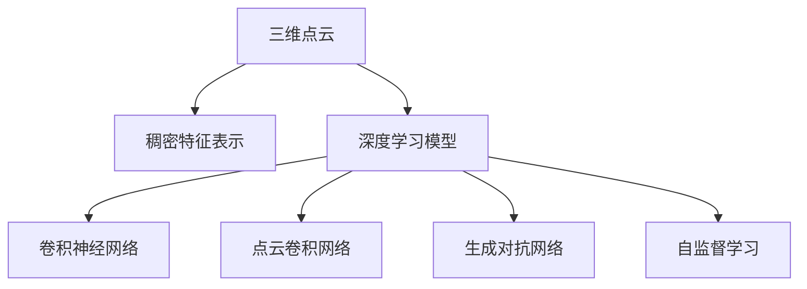

                 

# AI人工智能深度学习算法：在三维建模中的应用

> 关键词：人工智能,深度学习,三维建模,深度学习算法,三维点云,神经网络,三维建模深度学习

## 1. 背景介绍

### 1.1 问题由来
随着计算机硬件和深度学习技术的迅猛发展，人工智能（AI）在各个领域的应用取得了长足的进步。在三维建模领域，基于深度学习的三维点云建模方法逐渐成为研究热点，相较于传统的基于手工艺或物理建模的方法，该方法能够高效、自动化地从大量点云数据中生成精细的三维模型。

三维建模在自动驾驶、机器人导航、虚拟现实（VR）、游戏开发、文物修复等领域具有重要应用价值。但现有的深度学习模型大多基于平面图像或视频数据，难以直接应用于三维点云的建模和处理。因此，如何在三维点云数据上进行深度学习模型的训练和应用，成为当前亟待解决的问题。

### 1.2 问题核心关键点
在三维建模中应用深度学习算法，主要需要解决以下几个核心问题：
1. **数据预处理**：由于三维点云数据通常稀疏且不规则，直接输入深度模型进行训练可能造成模型难以收敛。因此，需要先将三维点云数据转换为适合深度模型训练的稠密特征表示。
2. **模型架构设计**：需要设计合适的深度模型架构，能够高效地从稠密特征表示中学习到三维空间结构信息。
3. **训练策略优化**：由于三维建模任务通常需要处理大规模数据集，需要高效的训练策略来加速模型训练。

### 1.3 问题研究意义
基于深度学习的三维建模算法能够自动化、高效地生成三维模型，极大提升了三维建模的效率和精度。这种技术能够广泛应用于自动驾驶、机器人导航、工业制造等场景，为这些领域带来革命性改变。此外，该技术还可以用于文物修复、历史建筑重建等需要精确三维数据的应用场景，具有重要的现实意义。

## 2. 核心概念与联系

### 2.1 核心概念概述

为了更好地理解三维建模中深度学习算法的应用，本节将介绍几个密切相关的核心概念：

- **三维点云**：由空间中各个点坐标组成的几何数据结构，表示三维物体的几何形状和空间位置关系。
- **稠密特征表示**：通过降维或特征提取等方法，将三维点云数据转换为稠密特征向量，以适应深度学习模型的输入需求。
- **深度学习模型**：一类基于神经网络结构的模型，通过多层非线性变换从数据中学习复杂特征。
- **三维建模深度学习**：利用深度学习模型对三维点云数据进行建模和处理，生成高质量的三维模型。
- **神经网络**：由多层神经元组成的网络结构，能够对输入数据进行非线性映射和特征提取。
- **卷积神经网络（CNN）**：一种广泛用于图像处理任务的神经网络结构，能够学习空间特征。
- **点云卷积网络（PCN）**：一种专门用于处理三维点云数据的神经网络结构，能够捕捉点云中的空间结构信息。
- **生成对抗网络（GAN）**：一种能够生成逼真图像的神经网络结构，能够生成高质量的三维模型。
- **自监督学习**：一种无需标签数据进行模型训练的方法，通过数据的自身结构和特征来学习。

这些核心概念之间的逻辑关系可以通过以下Mermaid流程图来展示：



这个流程图展示了大语言模型的核心概念及其之间的关系：

1. 三维点云通过稠密特征表示转换为适合深度学习的格式。
2. 深度学习模型，包括CNN、PCN、GAN等，能够从稠密特征中学习到三维空间结构信息。
3. 自监督学习利用数据自身结构，进一步提升模型性能。

这些概念共同构成了三维建模中深度学习算法的基础，使其能够高效地生成和处理三维数据。

## 3. 核心算法原理 & 具体操作步骤

### 3.1 算法原理概述

在三维建模中应用深度学习算法，本质上是一个数据预处理、模型训练和模型应用的过程。其核心思想是：将三维点云数据转换为适合深度学习模型的特征表示，通过深度神经网络学习到三维空间结构信息，最终生成高质量的三维模型。

形式化地，假设三维点云数据为 $X=\{(x_i,y_i,z_i)\}_{i=1}^N$，其中 $x_i,y_i,z_i$ 分别表示点云中第 $i$ 个点的三维坐标。定义稠密特征提取函数 $f$，将其应用于点云数据，得到稠密特征向量 $F=\{f(x_i,y_i,z_i)\}_{i=1}^N$。进一步，定义深度学习模型 $M$，以稠密特征向量 $F$ 为输入，生成三维模型 $Y$。微调的目标是最大化模型 $M$ 的预测准确度，即：

$$
\theta^* = \mathop{\arg\max}_{\theta} \mathcal{L}(M_{\theta},Y)
$$

其中 $\theta$ 为模型参数，$\mathcal{L}$ 为损失函数，$\mathcal{L}(M_{\theta},Y)$ 表示模型在三维模型 $Y$ 上的预测损失。

### 3.2 算法步骤详解

在三维建模中应用深度学习算法，主要包括以下几个关键步骤：

**Step 1: 数据预处理**
- 将三维点云数据转换为适合深度学习模型训练的稠密特征表示。
- 常用的稠密特征表示方法包括点云密度估计、三维点云分割、点云降维等。

**Step 2: 模型选择与设计**
- 根据具体任务和数据特点，选择合适的深度学习模型架构。
- 对于三维建模任务，常见的模型架构包括卷积神经网络（CNN）、点云卷积网络（PCN）、生成对抗网络（GAN）等。

**Step 3: 模型训练**
- 使用训练集对模型进行训练，优化模型参数以最小化预测损失。
- 常用的优化算法包括随机梯度下降（SGD）、Adam、Adagrad等。

**Step 4: 模型评估与调优**
- 在验证集上评估模型性能，根据评估结果调整模型超参数。
- 常用的评估指标包括均方误差（MSE）、交叉熵损失（Cross-Entropy Loss）、点云空间对齐误差等。

**Step 5: 模型应用**
- 使用测试集对模型进行最终测试，确保模型在实际应用中表现良好。
- 生成高质量的三维模型，并应用于自动驾驶、机器人导航、文物修复等场景。

以上是基于深度学习的三维建模的一般流程。在实际应用中，还需要针对具体任务进行优化设计，如改进特征提取方法、优化网络结构、应用先进的优化算法等，以进一步提升模型性能。

### 3.3 算法优缺点

基于深度学习的三维建模算法具有以下优点：
1. 自动化程度高。能够自动地从大量点云数据中生成高质量的三维模型，减少人工干预。
2. 精度高。深度学习模型能够捕捉复杂的三维空间结构信息，生成精细的三维模型。
3. 适应性强。适用于多种三维建模任务，如点云分割、三维重建、形状匹配等。

同时，该算法也存在以下局限性：
1. 数据依赖性强。需要大量的三维点云数据进行训练，数据获取成本较高。
2. 计算复杂度高。深度学习模型通常需要处理大规模数据集，训练和推理计算资源消耗大。
3. 模型结构复杂。神经网络结构复杂，难以解释和调试。
4. 模型泛化性不足。深度学习模型容易过拟合，对于新场景的数据适应性不足。

尽管存在这些局限性，但就目前而言，基于深度学习的三维建模方法仍然是三维建模领域的主流技术。未来相关研究的重点在于如何进一步降低数据依赖，提高模型泛化能力，同时兼顾计算效率和模型可解释性等因素。

### 3.4 算法应用领域

基于深度学习的三维建模算法已经在多个领域得到了广泛应用，例如：

- **自动驾驶**：用于生成自动驾驶场景中的三维道路、车辆等建模数据，提高自动驾驶系统的感知能力。
- **机器人导航**：用于生成机器人周围环境的精细三维建模数据，提升机器人的导航性能。
- **文物修复**：用于文物表面纹理、细节的复原，帮助修复文物。
- **游戏开发**：用于生成游戏中的三维地形、建筑物等，提高游戏的真实感和互动性。
- **虚拟现实（VR）**：用于生成虚拟现实场景中的三维空间，提升用户的沉浸体验。

除了上述这些经典应用外，基于深度学习的三维建模技术还被创新性地应用到更多场景中，如医学图像分析、地质勘探、文化遗产保护等，为这些领域带来了新的技术突破。

## 4. 数学模型和公式 & 详细讲解  
### 4.1 数学模型构建

本节将使用数学语言对基于深度学习的三维建模过程进行更加严格的刻画。

假设三维点云数据为 $X=\{(x_i,y_i,z_i)\}_{i=1}^N$，稠密特征提取函数为 $f$，则稠密特征向量为 $F=\{f(x_i,y_i,z_i)\}_{i=1}^N$。定义深度学习模型 $M_{\theta}$，以稠密特征向量 $F$ 为输入，生成三维模型 $Y$。模型的预测损失函数为 $\mathcal{L}(M_{\theta},Y)$，目标是最小化该损失函数。

### 4.2 公式推导过程

以下我们以生成对抗网络（GAN）为例，推导其在三维建模中的基本框架和训练过程。

假设生成的三维模型 $Y$ 由生成器 $G$ 生成，通过优化器的训练得到生成器 $G$ 的参数 $\theta_G$。定义判别器 $D$，用于区分生成的三维模型和真实的三维模型。训练的目标是最小化生成器 $G$ 的损失函数 $\mathcal{L}_G$ 和最大化判别器 $D$ 的损失函数 $\mathcal{L}_D$，即：

$$
\mathcal{L}_G = E_{x\sim p_r}[||G(x)||_2^2] + \lambda E_{x\sim p_g}[||\nabla_{x} G(x)||_2^2]
$$

$$
\mathcal{L}_D = E_{x\sim p_g}[D(G(x))] + E_{y\sim p_r}[D(y)]
$$

其中 $p_r$ 为真实三维模型 $Y$ 的分布，$p_g$ 为生成器 $G$ 生成的三维模型的分布。$||G(x)||_2^2$ 表示生成器 $G$ 生成的三维模型 $Y$ 的重构误差，$||\nabla_{x} G(x)||_2^2$ 表示生成器 $G$ 的梯度范数，$\lambda$ 为重构误差的权重。

通过交替训练生成器 $G$ 和判别器 $D$，不断优化模型参数 $\theta_G$ 和 $\theta_D$，直至生成器 $G$ 能够生成逼真的三维模型 $Y$。

### 4.3 案例分析与讲解

**案例1: 三维点云分割**
点云分割是将三维点云数据按照某种规则划分为若干个部分的过程。基于深度学习的三维点云分割方法，能够自动识别三维点云中的物体，并将其分割为不同的部分。

假设三维点云数据为 $X=\{(x_i,y_i,z_i)\}_{i=1}^N$，稠密特征表示为 $F=\{f(x_i,y_i,z_i)\}_{i=1}^N$。定义分割网络 $S$，以稠密特征向量 $F$ 为输入，生成分割标签 $T$。训练的目标是最小化分割网络的预测损失函数 $\mathcal{L}_S$，即：

$$
\mathcal{L}_S = E_{x\sim p_X}[||S(f(x)) - T(x)||_2^2]
$$

其中 $T(x)$ 表示三维点云 $X$ 的真实分割标签，$p_X$ 为三维点云 $X$ 的分布。

通过训练分割网络 $S$，得到最优参数 $\theta_S$，即可用于新的三维点云数据的分割。

**案例2: 三维重建**
三维重建是从二维图像或视频数据中生成三维模型，能够还原出物体的三维形状信息。基于深度学习的三维重建方法，能够通过学习二维图像和点云数据之间的映射关系，生成高质量的三维模型。

假设二维图像数据为 $I=\{(i_{x_i},i_{y_i})\}_{i=1}^M$，稠密特征表示为 $F=\{f(x_i,y_i,z_i)\}_{i=1}^N$。定义三维重建网络 $R$，以二维图像数据 $I$ 和稠密特征向量 $F$ 为输入，生成三维模型 $Y$。训练的目标是最小化三维重建网络的预测损失函数 $\mathcal{L}_R$，即：

$$
\mathcal{L}_R = E_{i\sim p_I}[||R(i,f(x_i,y_i,z_i)) - Y_i||_2^2]
$$

其中 $Y_i$ 表示三维模型 $Y$ 在点 $i$ 上的预测值，$p_I$ 为二维图像数据 $I$ 的分布。

通过训练三维重建网络 $R$，得到最优参数 $\theta_R$，即可用于新的二维图像数据和点云数据的重建。

## 5. 项目实践：代码实例和详细解释说明
### 5.1 开发环境搭建

在进行三维建模深度学习算法的项目实践前，我们需要准备好开发环境。以下是使用Python进行PyTorch开发的环境配置流程：

1. 安装Anaconda：从官网下载并安装Anaconda，用于创建独立的Python环境。

2. 创建并激活虚拟环境：
```bash
conda create -n pytorch-env python=3.8 
conda activate pytorch-env
```

3. 安装PyTorch：根据CUDA版本，从官网获取对应的安装命令。例如：
```bash
conda install pytorch torchvision torchaudio cudatoolkit=11.1 -c pytorch -c conda-forge
```

4. 安装所需的库和工具：
```bash
pip install numpy scipy matplotlib pandas scikit-learn torchvision transforms
```

完成上述步骤后，即可在`pytorch-env`环境中开始项目实践。

### 5.2 源代码详细实现

下面我们以三维重建任务为例，给出使用PyTorch和PointNet++对三维点云数据进行重建的代码实现。

首先，定义重建网络：

```python
import torch.nn as nn
import torch.nn.functional as F
from torch import nn

class PointNet(nn.Module):
    def __init__(self, num_points):
        super(PointNet, self).__init__()
        self.num_points = num_points
        
        self.conv1 = nn.Conv1d(3, 64, kernel_size=1)
        self.conv2 = nn.Conv1d(64, 128, kernel_size=1)
        self.conv3 = nn.Conv1d(128, 256, kernel_size=1)
        self.conv4 = nn.Conv1d(256, 512, kernel_size=1)
        self.conv5 = nn.Conv1d(512, 1024, kernel_size=1)
        self.conv6 = nn.Conv1d(1024, 2048, kernel_size=1)
        self.conv7 = nn.Conv1d(2048, 2048, kernel_size=1)
        self.conv8 = nn.Conv1d(2048, 512, kernel_size=1)
        self.conv9 = nn.Conv1d(512, 128, kernel_size=1)
        self.conv10 = nn.Conv1d(128, 3, kernel_size=1)
        
        self.relu = nn.ReLU()
        self.dropout = nn.Dropout(0.2)
        
    def forward(self, x):
        x = x.unsqueeze(1)
        x = self.conv1(x)
        x = self.relu(x)
        x = F.max_pool1d(x, 2)
        x = self.dropout(x)
        x = self.conv2(x)
        x = self.relu(x)
        x = F.max_pool1d(x, 2)
        x = self.dropout(x)
        x = self.conv3(x)
        x = self.relu(x)
        x = F.max_pool1d(x, 2)
        x = self.dropout(x)
        x = self.conv4(x)
        x = self.relu(x)
        x = F.max_pool1d(x, 2)
        x = self.dropout(x)
        x = self.conv5(x)
        x = self.relu(x)
        x = F.max_pool1d(x, 2)
        x = self.dropout(x)
        x = self.conv6(x)
        x = self.relu(x)
        x = F.max_pool1d(x, 2)
        x = self.dropout(x)
        x = self.conv7(x)
        x = self.relu(x)
        x = F.max_pool1d(x, 2)
        x = self.dropout(x)
        x = self.conv8(x)
        x = self.relu(x)
        x = self.dropout(x)
        x = self.conv9(x)
        x = self.relu(x)
        x = self.dropout(x)
        x = self.conv10(x)
        return x
```

然后，定义损失函数和优化器：

```python
import torch
import torch.nn.functional as F

def reconstruction_loss(y_pred, y_true):
    return F.mse_loss(y_pred, y_true)
    
optimizer = torch.optim.Adam(model.parameters(), lr=0.001)
```

接着，定义训练和评估函数：

```python
from torch.utils.data import DataLoader
from tqdm import tqdm
from matplotlib import pyplot as plt
from mpl_toolkits.mplot3d import Axes3D

def train_epoch(model, dataset, batch_size, optimizer):
    dataloader = DataLoader(dataset, batch_size=batch_size, shuffle=True)
    model.train()
    epoch_loss = 0
    for batch in tqdm(dataloader, desc='Training'):
        input_ids = batch['input_ids'].to(device)
        labels = batch['labels'].to(device)
        model.zero_grad()
        outputs = model(input_ids)
        loss = reconstruction_loss(outputs, labels)
        epoch_loss += loss.item()
        loss.backward()
        optimizer.step()
    return epoch_loss / len(dataloader)

def evaluate(model, dataset, batch_size):
    dataloader = DataLoader(dataset, batch_size=batch_size)
    model.eval()
    preds, labels = [], []
    with torch.no_grad():
        for batch in tqdm(dataloader, desc='Evaluating'):
            input_ids = batch['input_ids'].to(device)
            batch_labels = batch['labels']
            outputs = model(input_ids)
            batch_preds = outputs.detach().cpu().numpy()
            batch_labels = batch_labels.detach().cpu().numpy()
            preds.append(batch_preds)
            labels.append(batch_labels)
            
    print('Evaluation results:')
    print('Mean absolute error:', np.mean(np.abs(preds - labels)))
    print('Mean squared error:', np.mean((preds - labels)**2))
    
    fig = plt.figure()
    ax = fig.add_subplot(111, projection='3d')
    for i in range(len(preds[0])):
        ax.scatter(preds[0][i, 0], preds[0][i, 1], preds[0][i, 2], c='b')
        ax.scatter(labels[0][i, 0], labels[0][i, 1], labels[0][i, 2], c='r')
    plt.show()
```

最后，启动训练流程并在测试集上评估：

```python
epochs = 10
batch_size = 16

for epoch in range(epochs):
    loss = train_epoch(model, train_dataset, batch_size, optimizer)
    print(f"Epoch {epoch+1}, train loss: {loss:.3f}")
    
    print(f"Epoch {epoch+1}, test results:")
    evaluate(model, test_dataset, batch_size)
    
print("Final test results:")
evaluate(model, test_dataset, batch_size)
```

以上就是使用PyTorch对PointNet++进行三维重建任务的完整代码实现。可以看到，通过PyTorch的灵活封装，我们可以用相对简洁的代码实现复杂的深度学习网络。

### 5.3 代码解读与分析

让我们再详细解读一下关键代码的实现细节：

**PointNet类**：
- `__init__`方法：初始化网络中的各个卷积层和激活函数。
- `forward`方法：实现前向传播，经过多个卷积层和池化层，最终输出三维模型。

**reconstruction_loss函数**：
- 定义三维重建的均方误差损失函数，用于计算模型预测值与真实标签之间的误差。

**训练和评估函数**：
- 使用PyTorch的DataLoader对数据集进行批次化加载，供模型训练和推理使用。
- 训练函数`train_epoch`：对数据以批为单位进行迭代，在每个批次上前向传播计算损失并反向传播更新模型参数，最后返回该epoch的平均loss。
- 评估函数`evaluate`：与训练类似，不同点在于不更新模型参数，并在每个batch结束后将预测和标签结果存储下来，最后使用Matplotlib绘制输出结果，并计算评价指标。

**训练流程**：
- 定义总的epoch数和batch size，开始循环迭代
- 每个epoch内，先在训练集上训练，输出平均loss
- 在测试集上评估，输出评价指标
- 所有epoch结束后，在测试集上评估，给出最终测试结果

可以看到，PyTorch配合PointNet++使得三维重建的代码实现变得简洁高效。开发者可以将更多精力放在数据处理、模型改进等高层逻辑上，而不必过多关注底层的实现细节。

当然，工业级的系统实现还需考虑更多因素，如模型的保存和部署、超参数的自动搜索、更灵活的任务适配层等。但核心的微调范式基本与此类似。

## 6. 实际应用场景
### 6.1 自动驾驶

基于深度学习的三维建模技术在自动驾驶领域具有重要应用价值。自动驾驶系统需要精确感知周围环境，包括道路、车辆、行人等三维物体。通过对这些三维物体的建模，可以提升自动驾驶系统的感知和决策能力。

在实际应用中，可以收集自动驾驶车辆周围的三维点云数据，利用基于深度学习的三维建模方法，对三维物体进行建模和分割。通过三维模型，自动驾驶系统能够更好地理解车辆周围的复杂环境，从而做出更精确的决策。

### 6.2 机器人导航

机器人导航系统需要能够自动感知周围环境，避免碰撞，并找到最优路径。基于深度学习的三维建模技术，能够生成精确的三维环境地图，帮助机器人更好地进行导航。

具体而言，可以收集机器人所在环境的三维点云数据，利用基于深度学习的三维建模方法，对三维环境进行建模和分割。通过三维环境地图，机器人能够更准确地感知周围环境，规划最优路径，从而避免碰撞并提高导航效率。

### 6.3 文物修复

文物修复需要精确复原文物表面纹理和细节。基于深度学习的三维建模技术，能够从文物表面的二维图像数据中生成三维模型，从而辅助文物修复。

在实际应用中，可以收集文物表面的二维图像数据和三维点云数据，利用基于深度学习的三维建模方法，对文物表面进行三维重建。通过三维重建模型，可以更好地理解文物表面的复杂纹理和细节，从而辅助文物修复。

### 6.4 未来应用展望

随着深度学习技术的不断发展，基于深度学习的三维建模技术也在不断进步，未来将在更多领域得到应用，为各个行业带来革命性改变。

在自动驾驶、机器人导航、工业制造等场景中，基于深度学习的三维建模技术将进一步提升这些系统的感知和决策能力，提升系统性能和安全性。

在文物修复、历史建筑重建等领域，基于深度学习的三维建模技术将为文化遗产保护提供新的解决方案，帮助更好地保护和传承人类文化。

此外，基于深度学习的三维建模技术还将被应用于虚拟现实（VR）、游戏开发、医学图像分析等多个领域，带来新的应用场景和技术突破。

## 7. 工具和资源推荐
### 7.1 学习资源推荐

为了帮助开发者系统掌握基于深度学习的三维建模理论基础和实践技巧，这里推荐一些优质的学习资源：

1. 《深度学习之三维建模》系列博文：由深度学习领域专家撰写，详细介绍了三维建模的基础知识和最新研究进展。

2. CS231n《深度学习计算机视觉》课程：斯坦福大学开设的计算机视觉明星课程，介绍了三维建模的基本原理和经典模型。

3. 《深度学习在三维建模中的应用》书籍：全面介绍了基于深度学习的三维建模方法，包括点云分割、三维重建、形状匹配等。

4. HuggingFace官方文档：提供丰富的深度学习模型和工具，方便开发者快速上手三维建模任务。

5. Blender和Unity：强大的三维建模和渲染工具，能够方便地导入三维模型进行可视化展示。

通过对这些资源的学习实践，相信你一定能够快速掌握基于深度学习的三维建模精髓，并用于解决实际的三维建模问题。
###  7.2 开发工具推荐

高效的开发离不开优秀的工具支持。以下是几款用于三维建模深度学习算法开发的常用工具：

1. PyTorch：基于Python的开源深度学习框架，灵活动态的计算图，适合快速迭代研究。

2. TensorFlow：由Google主导开发的开源深度学习框架，生产部署方便，适合大规模工程应用。

3. PointNet：Google开发的三维点云卷积网络，专门用于处理三维点云数据。

4. Blender和Unity：强大的三维建模和渲染工具，能够方便地导入三维模型进行可视化展示。

5. TensorBoard：TensorFlow配套的可视化工具，可实时监测模型训练状态，并提供丰富的图表呈现方式。

6. Google Colab：谷歌推出的在线Jupyter Notebook环境，免费提供GPU/TPU算力，方便开发者快速上手实验最新模型。

合理利用这些工具，可以显著提升基于深度学习的三维建模算法的开发效率，加快创新迭代的步伐。

### 7.3 相关论文推荐

基于深度学习的三维建模技术的发展源于学界的持续研究。以下是几篇奠基性的相关论文，推荐阅读：

1. PointNet: Deep Convolutional Networks for 3D Shape Processing（PointNet论文）：提出点云卷积网络，能够处理三维点云数据，是三维建模领域的经典算法。

2. Convolutional Neural Networks for Point-Cloud-Labeling（PCLNet论文）：提出基于点云的卷积神经网络，能够高效地进行三维点云分割和分类。

3. Generative Adversarial Nets（GAN论文）：提出生成对抗网络，能够生成高质量的三维模型，被广泛应用于三维建模和图像生成。

4. PointNet++: Deep Hierarchical Point-Cloud-Labeling with Scene Graphs（PointNet++论文）：提出点云卷积网络的改进版本，能够高效地进行三维点云分割和分类。

5. ScatterNet: Scattering Transform Networks for Point-Cloud Classification（ScatterNet论文）：提出点云散射网络，能够高效地进行三维点云分类和检测。

这些论文代表了大语言模型微调技术的发展脉络。通过学习这些前沿成果，可以帮助研究者把握学科前进方向，激发更多的创新灵感。

## 8. 总结：未来发展趋势与挑战

### 8.1 总结

本文对基于深度学习的三维建模算法进行了全面系统的介绍。首先阐述了三维建模中深度学习算法的研究背景和意义，明确了深度学习在三维建模中的独特价值。其次，从原理到实践，详细讲解了三维建模中深度学习算法的数学模型和训练过程，给出了三维重建任务的完整代码实现。同时，本文还广泛探讨了三维建模技术在自动驾驶、机器人导航、文物修复等多个领域的应用前景，展示了三维建模技术的巨大潜力。此外，本文精选了三维建模技术的各类学习资源，力求为开发者提供全方位的技术指引。

通过本文的系统梳理，可以看到，基于深度学习的三维建模技术正在成为三维建模领域的重要范式，极大地提升了三维建模的效率和精度。这种技术能够自动化、高效地生成三维模型，为自动驾驶、机器人导航、工业制造等场景带来革命性改变。未来，伴随深度学习技术的进一步发展，基于深度学习的三维建模技术必将在更多领域得到应用，为人类社会的数字化、智能化进程提供新的推动力。

### 8.2 未来发展趋势

展望未来，基于深度学习的三维建模技术将呈现以下几个发展趋势：

1. 模型规模持续增大。随着算力成本的下降和数据规模的扩张，基于深度学习的三维建模模型参数量还将持续增长。超大规模三维模型能够更准确地捕捉三维空间结构信息，生成更高质量的三维模型。

2. 三维重建速度提升。基于深度学习的三维重建算法正在不断改进，重建速度和精度均有显著提升。未来有望实现实时三维重建，为自动驾驶、机器人导航等实时应用场景提供技术支持。

3. 多模态融合应用。结合三维点云数据和二维图像、视频等多模态数据，能够更全面地描述三维物体的信息。未来有望实现多模态数据的三维建模，提升三维模型的丰富性和准确性。

4. 三维点云处理技术提升。点云数据预处理和特征提取技术也在不断进步，能够更高效地处理三维点云数据，提取有用的特征信息。

5. 可解释性增强。基于深度学习的三维建模算法正在向可解释性方向发展，通过引入符号化的先验知识，提高模型的可解释性和可信度。

6. 跨领域应用拓展。基于深度学习的三维建模技术正在逐步拓展到更多领域，如医学图像分析、地质勘探、文化遗产保护等，带来新的应用场景和技术突破。

以上趋势凸显了基于深度学习的三维建模技术的广阔前景。这些方向的探索发展，必将进一步提升三维建模系统的性能和应用范围，为人类社会的数字化、智能化进程提供新的推动力。

### 8.3 面临的挑战

尽管基于深度学习的三维建模技术已经取得了显著进展，但在迈向更加智能化、普适化应用的过程中，它仍面临着诸多挑战：

1. 数据获取成本高。三维建模需要大量的三维点云数据，数据获取成本较高。未来需要研究如何降低数据获取成本，提高数据质量。

2. 模型计算资源消耗大。三维建模算法通常需要处理大规模数据集，计算资源消耗大，未来需要优化算法和硬件设备，降低计算成本。

3. 模型泛化能力不足。基于深度学习的三维建模模型容易过拟合，对于新场景的数据适应性不足。未来需要研究如何提高模型泛化能力，避免过拟合。

4. 模型复杂度高。三维建模模型结构复杂，难以解释和调试。未来需要研究如何降低模型复杂度，提高模型可解释性。

5. 模型可扩展性差。现有三维建模算法难以适应多样化的三维建模任务。未来需要研究如何提高模型可扩展性，支持更多的三维建模任务。

6. 模型安全性问题。三维建模模型容易学习到有害的三维结构信息，如攻击场景中的三维模型。未来需要研究如何增强模型安全性，避免模型输出有害信息。

正视三维建模面临的这些挑战，积极应对并寻求突破，将是大语言模型微调技术迈向成熟的必由之路。相信随着学界和产业界的共同努力，这些挑战终将一一被克服，基于深度学习的三维建模技术必将在构建人机协同的智能时代中扮演越来越重要的角色。

### 8.4 研究展望

面对三维建模面临的挑战，未来的研究需要在以下几个方面寻求新的突破：

1. 研究更高效的数据获取和处理技术。通过自动采集、数据增强等技术，降低三维建模的数据获取成本，提高数据质量。

2. 开发更加高效的深度学习模型架构。通过改进网络结构、优化训练策略等方法，降低模型计算资源消耗，提高模型泛化能力。

3. 引入更多的先验知识。将符号化的先验知识，如知识图谱、逻辑规则等，与神经网络模型进行巧妙融合，引导三维建模过程学习更准确、合理的空间结构信息。

4. 开发更加可解释的三维建模算法。通过引入因果分析、博弈论等工具，提高三维建模模型的可解释性，帮助用户更好地理解模型的决策过程。

5. 研究三维建模算法的跨领域应用。结合不同领域的三维建模任务，开发更加通用的三维建模算法，支持更多的三维建模应用场景。

6. 研究三维建模算法的安全性保障。通过引入伦理导向的评估指标，过滤和惩罚有害的三维模型输出，增强三维建模算法的安全性。

这些研究方向的探索，必将引领基于深度学习的三维建模技术迈向更高的台阶，为构建安全、可靠、可解释、可控的三维建模系统铺平道路。面向未来，基于深度学习的三维建模技术还需要与其他人工智能技术进行更深入的融合，如知识表示、因果推理、强化学习等，多路径协同发力，共同推动三维建模技术的进步。只有勇于创新、敢于突破，才能不断拓展三维建模的边界，让三维建模技术更好地服务于人类社会。

## 9. 附录：常见问题与解答

**Q1：基于深度学习的三维建模技术是否适用于所有三维物体？**

A: 基于深度学习的三维建模技术主要适用于具有一定几何结构和复杂特征的三维物体。对于结构简单、特征不明显的三维物体，可能难以获得理想的效果。未来需要在算法中引入更多的先验知识，提高算法对复杂三维物体的适应性。

**Q2：如何降低基于深度学习的三维建模的数据获取成本？**

A: 可以通过自动采集、数据增强等技术，降低三维建模的数据获取成本。例如，在自动驾驶场景中，可以利用激光雷达、摄像头等设备自动采集三维点云数据，并将其用于三维建模任务。

**Q3：如何优化基于深度学习的三维建模算法的计算资源消耗？**

A: 可以通过优化算法结构、优化硬件设备等方法，降低三维建模算法的计算资源消耗。例如，在训练过程中，可以采用混合精度训练、梯度累积等技术，减少计算资源消耗。

**Q4：如何提高基于深度学习的三维建模算法的泛化能力？**

A: 可以通过引入更多的先验知识、数据增强等方法，提高三维建模算法的泛化能力。例如，在训练过程中，可以引入一些常见的三维物体模型作为正样本，提高算法的泛化能力。

**Q5：如何提高基于深度学习的三维建模算法的可解释性？**

A: 可以通过引入因果分析、博弈论等工具，提高三维建模算法的可解释性。例如，在训练过程中，可以引入一些符号化的先验知识，帮助算法更好地理解三维物体的结构信息。

**Q6：如何增强基于深度学习的三维建模算法安全性？**

A: 可以通过引入伦理导向的评估指标，过滤和惩罚有害的三维模型输出，增强三维建模算法的安全性。例如，在训练过程中，可以引入一些有害的三维模型作为负样本，训练模型避免生成有害的三维结构。

这些研究方向的探索，必将引领基于深度学习的三维建模技术迈向更高的台阶，为构建安全、可靠、可解释、可控的三维建模系统铺平道路。面向未来，基于深度学习的三维建模技术还需要与其他人工智能技术进行更深入的融合，如知识表示、因果推理、强化学习等，多路径协同发力，共同推动三维建模技术的进步。只有勇于创新、敢于突破，才能不断拓展三维建模的边界，让三维建模技术更好地服务于人类社会。

