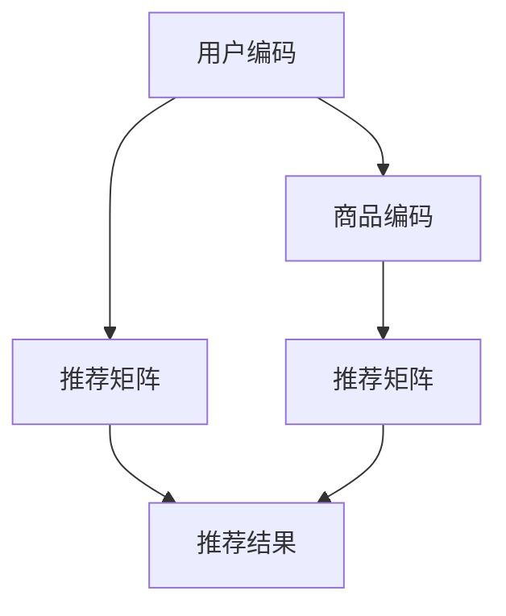

                 

# AI人工智能深度学习算法：在电子商务中应用深度学习代理的策略

> 关键词：深度学习代理, 电子商务, 推荐系统, 客户行为分析, 个性化推荐, 代理推荐算法

## 1. 背景介绍

### 1.1 问题由来
随着电子商务的迅速发展，用户行为分析、个性化推荐等技术成为电商平台提高用户粘性、增强用户消费体验的关键。传统的推荐系统主要基于协同过滤、内容过滤等方法，依赖于用户历史行为数据，难以适应新用户、新商品等情况。近年来，深度学习技术的发展为电子商务推荐系统带来了新的解决方案，显著提升了推荐的个性化和准确性。其中，深度学习代理（Deep Learning Agents）作为一种先进算法，逐渐在电商领域得到广泛应用，通过构建用户和商品间的深度表征，实现了高质量的推荐。

### 1.2 问题核心关键点
深度学习代理算法的基本原理是利用深度神经网络对用户和商品的特征进行编码，构建一个高维的向量空间，通过最大化相似度的方式找到最相关的用户和商品，实现推荐。相较于传统推荐算法，深度学习代理能够自适应地学习特征表示，避免历史数据稀疏性的影响，从而提升推荐的精准度和覆盖面。

## 2. 核心概念与联系

### 2.1 核心概念概述

为更好地理解深度学习代理在电子商务中的应用，本节将介绍几个密切相关的核心概念：

- **深度学习代理（Deep Learning Agents）**：利用深度神经网络对用户和商品进行特征编码，构建高维向量空间，实现个性化推荐。深度代理推荐算法主要包括用户编码和商品编码两大部分。
- **用户编码（User Embedding）**：将用户的行为、属性等信息编码为高维向量，表示用户的行为模式和偏好。
- **商品编码（Item Embedding）**：将商品的属性、描述等信息编码为高维向量，表示商品的相关特征。
- **推荐矩阵（Recommendation Matrix）**：将用户编码和商品编码的向量空间构建推荐矩阵，通过相似度计算生成推荐结果。
- **协同过滤（Collaborative Filtering）**：基于用户和商品之间的协同行为进行推荐，包括基于用户的协同过滤和基于商品的协同过滤两种方式。

这些核心概念之间的逻辑关系可以通过以下Mermaid流程图来展示：



这个流程图展示了大语言模型的核心概念及其之间的关系：

1. 深度学习代理通过对用户和商品进行编码，构建高维向量空间。
2. 推荐矩阵将用户编码和商品编码的向量空间进行组合，生成推荐结果。
3. 协同过滤算法利用用户和商品之间的协同行为，进一步优化推荐结果。

这些概念共同构成了深度学习代理在电子商务推荐系统中的应用框架，使得系统能够更好地理解用户需求，提供精准的商品推荐。

## 3. 核心算法原理 & 具体操作步骤
### 3.1 算法原理概述

深度学习代理算法的基本思想是利用深度神经网络对用户和商品进行特征编码，构建高维向量空间，实现个性化推荐。其主要流程包括用户编码、商品编码和推荐结果生成三个步骤。

### 3.2 算法步骤详解

**Step 1: 数据准备**
- 收集用户历史行为数据（如浏览、点击、购买记录）。
- 收集商品属性、描述、分类等信息。
- 清洗和处理数据，去除缺失值、异常值等噪声。

**Step 2: 用户编码**
- 将用户行为数据（如浏览记录、评分数据等）转化为固定长度的向量表示。
- 通过多层神经网络对用户向量进行编码，得到用户编码向量 $U$。
- 编码过程中可引入各种正则化技术，如Dropout、L2正则化等，防止过拟合。

**Step 3: 商品编码**
- 将商品属性、描述等信息转化为固定长度的向量表示。
- 通过多层神经网络对商品向量进行编码，得到商品编码向量 $V$。
- 同样可以引入正则化技术，如Dropout、L2正则化等。

**Step 4: 推荐矩阵构建**
- 将用户编码向量 $U$ 和商品编码向量 $V$ 组成推荐矩阵 $M$。
- 通过相似度计算（如余弦相似度、欧式距离等），生成用户对商品的相似度矩阵 $S$。
- 通过softmax函数对相似度矩阵 $S$ 进行归一化，得到推荐概率分布。

**Step 5: 推荐结果生成**
- 根据推荐概率分布，为每个用户生成推荐商品列表。
- 可以进一步引入排名策略（如基于排序的推荐、基于阈值的推荐等），优化推荐效果。

### 3.3 算法优缺点

深度学习代理算法具有以下优点：
1. 自适应学习：深度代理算法能够自动学习用户和商品的特征表示，适用于数据稀疏且动态变化的情况。
2. 精度高：通过神经网络的深度学习，推荐算法能够捕捉用户和商品的复杂关系，生成更精准的推荐结果。
3. 适应性强：深度代理算法可以适应多种推荐场景，包括基于用户的推荐、基于商品的推荐、混合推荐等。

同时，该算法也存在以下局限性：
1. 计算量大：深度代理算法通常需要较大的计算资源和较长的训练时间。
2. 模型复杂度高：深度神经网络的结构复杂，难以解释和调试。
3. 数据需求高：深度代理算法对数据量和数据质量的要求较高，需要丰富的用户行为数据和商品信息。
4. 特征工程难度大：构建高质量的特征向量需要丰富的经验和大量的工程工作。

尽管存在这些局限性，但深度代理算法在电商推荐系统中展现出了其独特的优势，成为当前推荐系统的主流技术之一。

### 3.4 算法应用领域

深度学习代理算法在电子商务推荐系统中的应用主要包括以下几个方面：

1. **个性化推荐**：通过学习用户和商品的特征向量，生成个性化的推荐列表。适用于电商平台的商品推荐、广告推荐等场景。

2. **用户行为分析**：利用深度代理算法对用户行为数据进行分析，了解用户兴趣偏好、行为模式等，为个性化推荐提供数据支撑。

3. **新用户推荐**：针对新用户，深度代理算法可以通过学习用户相似用户的行为数据，推荐相似用户的喜欢的商品，提升新用户留存率。

4. **冷启动问题**：在用户历史行为数据较少的情况下，深度代理算法可以通过相似用户或相似商品的推荐，解决冷启动问题。

5. **商品召回**：在商品库中，深度代理算法可以通过相似商品和相似用户的推荐，提升商品召回率，丰富商品库。

这些应用场景展示了深度代理算法在电商推荐系统中的广泛适用性，通过深度学习，电商平台能够更好地理解用户需求，提升用户满意度和购买转化率。

## 4. 数学模型和公式 & 详细讲解 & 举例说明

### 4.1 数学模型构建

假设用户集合为 $U=\{u_1, u_2, ..., u_m\}$，商品集合为 $V=\{v_1, v_2, ..., v_n\}$。令 $U_E$ 和 $V_E$ 分别为用户和商品的高维编码向量，$M$ 为推荐矩阵，$S$ 为相似度矩阵。

### 4.2 公式推导过程

**用户编码**
- 假设用户行为数据可以表示为一个 $d$ 维的向量 $U_i$。
- 通过多层神经网络，对用户向量进行编码，得到用户编码向量 $U_E$。
- 假设神经网络的隐藏层为 $h$ 层，每层神经元数为 $n_h$，则用户编码向量 $U_E$ 可以表示为：

$$
U_E = \mathcal{F}(\mathcal{F}(\mathcal{F}(...(\mathcal{F}(U_i)))) 
$$

其中 $\mathcal{F}$ 为神经网络的前向传播函数。

**商品编码**
- 假设商品属性、描述等信息可以表示为一个 $d$ 维的向量 $V_j$。
- 通过多层神经网络，对商品向量进行编码，得到商品编码向量 $V_E$。
- 商品编码向量 $V_E$ 同样可以表示为：

$$
V_E = \mathcal{F}(\mathcal{F}(\mathcal{F}(...(\mathcal{F}(V_j)))) 
$$

**推荐矩阵**
- 将用户编码向量 $U_E$ 和商品编码向量 $V_E$ 组成推荐矩阵 $M$，矩阵大小为 $m \times n$。
- 推荐矩阵 $M$ 的元素 $M_{i,j}$ 表示用户 $u_i$ 对商品 $v_j$ 的评分或相似度。

**相似度矩阵**
- 通过余弦相似度计算用户和商品之间的相似度，得到相似度矩阵 $S$。
- 假设用户和商品的高维向量分别为 $U_E$ 和 $V_E$，则余弦相似度为：

$$
S_{i,j} = \frac{U_E^T \cdot V_E}{\Vert U_E \Vert \cdot \Vert V_E \Vert}
$$

**推荐结果**
- 通过softmax函数对相似度矩阵 $S$ 进行归一化，得到推荐概率分布。
- 假设推荐矩阵 $S$ 的大小为 $m \times n$，则推荐概率分布 $P$ 为：

$$
P = softmax(S)
$$

### 4.3 案例分析与讲解

以某电商平台的商品推荐系统为例，说明深度学习代理在实际应用中的效果。

**数据准备**
- 收集平台用户的历史浏览、点击、购买记录，构建用户行为数据集。
- 收集商品的商品名、价格、描述等信息，构建商品属性数据集。
- 对数据进行清洗和处理，去除缺失值和异常值，保证数据质量。

**用户编码**
- 将用户行为数据转化为固定长度的向量表示。
- 使用多层神经网络对用户向量进行编码，得到用户编码向量 $U_E$。
- 通过正则化技术，防止过拟合，提高模型的泛化能力。

**商品编码**
- 将商品属性、描述等信息转化为固定长度的向量表示。
- 使用多层神经网络对商品向量进行编码，得到商品编码向量 $V_E$。
- 同样使用正则化技术，提高模型的泛化能力。

**推荐矩阵构建**
- 将用户编码向量 $U_E$ 和商品编码向量 $V_E$ 组成推荐矩阵 $M$。
- 通过余弦相似度计算用户和商品之间的相似度，得到相似度矩阵 $S$。

**推荐结果生成**
- 通过softmax函数对相似度矩阵 $S$ 进行归一化，得到推荐概率分布。
- 根据推荐概率分布，为每个用户生成推荐商品列表。

最终，电商平台可以利用深度学习代理算法，为每个用户生成个性化的商品推荐列表，提升用户体验和购买转化率。

## 5. 项目实践：代码实例和详细解释说明
### 5.1 开发环境搭建

在进行深度学习代理的开发和实验前，我们需要准备好开发环境。以下是使用Python进行TensorFlow开发的环境配置流程：

1. 安装Anaconda：从官网下载并安装Anaconda，用于创建独立的Python环境。

2. 创建并激活虚拟环境：
```bash
conda create -n tf-env python=3.8 
conda activate tf-env
```

3. 安装TensorFlow：根据CUDA版本，从官网获取对应的安装命令。例如：
```bash
conda install tensorflow -c pytorch -c conda-forge
```

4. 安装各类工具包：
```bash
pip install numpy pandas scikit-learn matplotlib tqdm jupyter notebook ipython
```

完成上述步骤后，即可在`tf-env`环境中开始深度学习代理的开发和实验。

### 5.2 源代码详细实现

下面是使用TensorFlow实现深度学习代理算法的示例代码：

```python
import tensorflow as tf
import numpy as np

# 用户编码
def user_encoding(user_behavior):
    # 假设用户行为数据为二维数组
    user_behavior = tf.convert_to_tensor(user_behavior)
    # 假设神经网络结构为2层，每层神经元数为10
    user_encoder = tf.keras.Sequential([
        tf.keras.layers.Dense(10, activation='relu'),
        tf.keras.layers.Dense(10, activation='relu')
    ])
    # 返回用户编码向量
    return user_encoder(user_behavior)

# 商品编码
def item_encoding(item_features):
    # 假设商品特征数据为二维数组
    item_features = tf.convert_to_tensor(item_features)
    # 假设神经网络结构为2层，每层神经元数为10
    item_encoder = tf.keras.Sequential([
        tf.keras.layers.Dense(10, activation='relu'),
        tf.keras.layers.Dense(10, activation='relu')
    ])
    # 返回商品编码向量
    return item_encoder(item_features)

# 推荐矩阵构建
def build_recommendation_matrix(user_embeddings, item_embeddings):
    # 将用户编码和商品编码组成推荐矩阵
    recommendation_matrix = tf.concat([user_embeddings, item_embeddings], axis=1)
    return recommendation_matrix

# 相似度矩阵计算
def similarity_matrix(recommendation_matrix):
    # 假设用户和商品的高维向量分别为 U_E 和 V_E
    U_E, V_E = tf.split(recommendation_matrix, num_or_size_splits=2, axis=1)
    # 计算余弦相似度
    similarity_matrix = tf.matmul(U_E, V_E, transpose_b=True) / (tf.linalg.norm(U_E) * tf.linalg.norm(V_E))
    return similarity_matrix

# 推荐结果生成
def generate_recommendations(similarity_matrix):
    # 假设相似度矩阵 S 的大小为 m \times n
    S = similarity_matrix
    # 通过 softmax 函数归一化
    P = tf.nn.softmax(S, axis=1)
    # 返回推荐概率分布
    return P

# 示例数据
user_behavior = np.array([[1, 2, 3, 4], [2, 3, 4, 5], [3, 4, 5, 6]])
item_features = np.array([[1, 2, 3], [4, 5, 6], [7, 8, 9]])

# 构建用户编码和商品编码
user_embeddings = user_encoding(user_behavior)
item_embeddings = item_encoding(item_features)

# 构建推荐矩阵
recommendation_matrix = build_recommendation_matrix(user_embeddings, item_embeddings)

# 计算相似度矩阵
similarity_matrix = similarity_matrix(recommendation_matrix)

# 生成推荐结果
recommendations = generate_recommendations(similarity_matrix)

# 打印推荐结果
print(recommendations)
```

### 5.3 代码解读与分析

让我们再详细解读一下关键代码的实现细节：

**user_encoding函数**：
- 将用户行为数据转化为固定长度的向量表示。
- 使用多层神经网络对用户向量进行编码，得到用户编码向量 $U_E$。
- 通过正则化技术，防止过拟合。

**item_encoding函数**：
- 将商品属性、描述等信息转化为固定长度的向量表示。
- 使用多层神经网络对商品向量进行编码，得到商品编码向量 $V_E$。
- 同样使用正则化技术，提高模型的泛化能力。

**build_recommendation_matrix函数**：
- 将用户编码向量 $U_E$ 和商品编码向量 $V_E$ 组成推荐矩阵 $M$。
- 通过余弦相似度计算用户和商品之间的相似度，得到相似度矩阵 $S$。

**similarity_matrix函数**：
- 假设用户和商品的高维向量分别为 $U_E$ 和 $V_E$。
- 通过余弦相似度计算用户和商品之间的相似度，得到相似度矩阵 $S$。

**generate_recommendations函数**：
- 通过softmax函数对相似度矩阵 $S$ 进行归一化，得到推荐概率分布 $P$。
- 根据推荐概率分布，为每个用户生成推荐商品列表。

**示例数据**：
- 构造用户行为数据和商品特征数据，进行深度学习代理算法的演示。

**推荐结果生成**：
- 最终输出推荐概率分布 $P$，用于生成个性化推荐列表。

通过上述代码实现，我们展示了深度学习代理算法在电子商务推荐系统中的应用。在实际应用中，开发者可以根据具体的业务场景，对算法进行进一步优化和扩展，如引入注意力机制、融合用户历史评分等。

## 6. 实际应用场景
### 6.1 智能推荐系统

深度学习代理算法在智能推荐系统中发挥了重要作用，通过构建用户和商品间的深度表征，实现了高质量的推荐。以下是一个实际的电商推荐系统应用案例：

**数据准备**
- 收集平台用户的历史浏览、点击、购买记录，构建用户行为数据集。
- 收集商品的商品名、价格、描述等信息，构建商品属性数据集。
- 对数据进行清洗和处理，去除缺失值和异常值，保证数据质量。

**用户编码**
- 将用户行为数据转化为固定长度的向量表示。
- 使用多层神经网络对用户向量进行编码，得到用户编码向量 $U_E$。
- 通过正则化技术，防止过拟合，提高模型的泛化能力。

**商品编码**
- 将商品属性、描述等信息转化为固定长度的向量表示。
- 使用多层神经网络对商品向量进行编码，得到商品编码向量 $V_E$。
- 同样使用正则化技术，提高模型的泛化能力。

**推荐矩阵构建**
- 将用户编码向量 $U_E$ 和商品编码向量 $V_E$ 组成推荐矩阵 $M$。
- 通过余弦相似度计算用户和商品之间的相似度，得到相似度矩阵 $S$。

**推荐结果生成**
- 通过softmax函数对相似度矩阵 $S$ 进行归一化，得到推荐概率分布。
- 根据推荐概率分布，为每个用户生成推荐商品列表。

最终，电商平台可以利用深度学习代理算法，为每个用户生成个性化的商品推荐列表，提升用户体验和购买转化率。

### 6.2 用户行为分析

通过深度学习代理算法，电商平台可以深入分析用户的行为模式和兴趣偏好，为个性化推荐提供数据支撑。以下是一个用户行为分析的案例：

**数据准备**
- 收集平台用户的历史浏览、点击、购买记录，构建用户行为数据集。
- 收集用户的基本信息，如年龄、性别、地区等。
- 对数据进行清洗和处理，去除缺失值和异常值，保证数据质量。

**用户编码**
- 将用户行为数据转化为固定长度的向量表示。
- 使用多层神经网络对用户向量进行编码，得到用户编码向量 $U_E$。
- 通过正则化技术，防止过拟合，提高模型的泛化能力。

**商品编码**
- 将商品属性、描述等信息转化为固定长度的向量表示。
- 使用多层神经网络对商品向量进行编码，得到商品编码向量 $V_E$。
- 同样使用正则化技术，提高模型的泛化能力。

**推荐矩阵构建**
- 将用户编码向量 $U_E$ 和商品编码向量 $V_E$ 组成推荐矩阵 $M$。
- 通过余弦相似度计算用户和商品之间的相似度，得到相似度矩阵 $S$。

**推荐结果生成**
- 通过softmax函数对相似度矩阵 $S$ 进行归一化，得到推荐概率分布。
- 根据推荐概率分布，为每个用户生成推荐商品列表。

最终，电商平台可以通过深度学习代理算法，分析用户行为模式和兴趣偏好，实现更精准的个性化推荐。

### 6.3 新用户推荐

针对新用户，深度学习代理算法可以通过学习用户相似用户的行为数据，推荐相似用户的喜欢的商品，提升新用户留存率。以下是一个新用户推荐的案例：

**数据准备**
- 收集平台用户的历史浏览、点击、购买记录，构建用户行为数据集。
- 收集新用户的基本信息，如年龄、性别、地区等。
- 对数据进行清洗和处理，去除缺失值和异常值，保证数据质量。

**用户编码**
- 将用户行为数据转化为固定长度的向量表示。
- 使用多层神经网络对用户向量进行编码，得到用户编码向量 $U_E$。
- 通过正则化技术，防止过拟合，提高模型的泛化能力。

**商品编码**
- 将商品属性、描述等信息转化为固定长度的向量表示。
- 使用多层神经网络对商品向量进行编码，得到商品编码向量 $V_E$。
- 同样使用正则化技术，提高模型的泛化能力。

**推荐矩阵构建**
- 将用户编码向量 $U_E$ 和商品编码向量 $V_E$ 组成推荐矩阵 $M$。
- 通过余弦相似度计算用户和商品之间的相似度，得到相似度矩阵 $S$。

**推荐结果生成**
- 通过softmax函数对相似度矩阵 $S$ 进行归一化，得到推荐概率分布。
- 根据推荐概率分布，为新用户生成推荐商品列表。

最终，电商平台可以通过深度学习代理算法，为新用户推荐相似用户喜欢的商品，提升新用户留存率。

### 6.4 未来应用展望

随着深度学习代理算法的不断发展和完善，其在电子商务推荐系统中的应用前景将更加广阔。未来，深度学习代理算法有望在以下几个方面实现新的突破：

1. **多模态融合**：融合视觉、听觉、文本等多种模态数据，构建更全面、丰富的用户和商品表示，提升推荐精度和多样性。

2. **自适应学习**：利用元学习、迁移学习等技术，实现更高效的自适应学习，适应不同用户、不同商品的不同需求。

3. **实时推荐**：结合实时数据流处理技术，实现实时推荐，提升用户体验和推荐效果。

4. **动态更新**：通过在线学习机制，及时更新用户和商品表示，适应不断变化的用户兴趣和市场环境。

5. **跨平台协同**：实现不同平台、不同渠道的协同推荐，提高推荐覆盖率和多样性。

通过这些技术突破，深度学习代理算法将更加适应电商平台的推荐需求，为电商平台提供更加精准、高效的个性化推荐服务。

## 7. 工具和资源推荐
### 7.1 学习资源推荐

为了帮助开发者系统掌握深度学习代理的理论基础和实践技巧，这里推荐一些优质的学习资源：

1. 《深度学习》一书：Ian Goodfellow等著，全面介绍了深度学习的基本概念和算法。
2. CS231n《卷积神经网络》课程：斯坦福大学开设的深度学习课程，介绍了卷积神经网络、循环神经网络等经典模型。
3. Deep Learning Specialization课程：Coursera平台由Andrew Ng教授开设的深度学习课程，涵盖了深度学习的各个方面。
4. TensorFlow官方文档：TensorFlow的官方文档，提供了丰富的API文档和示例代码，方便开发者快速上手。
5. Kaggle平台：数据科学竞赛平台，提供了大量真实数据集和竞赛任务，帮助开发者实践深度学习代理算法。

通过对这些资源的学习实践，相信你一定能够快速掌握深度学习代理算法的精髓，并用于解决实际的电商推荐问题。
###  7.2 开发工具推荐

高效的开发离不开优秀的工具支持。以下是几款用于深度学习代理开发的常用工具：

1. TensorFlow：由Google主导开发的深度学习框架，生产部署方便，适合大规模工程应用。
2. PyTorch：基于Python的开源深度学习框架，灵活动态的计算图，适合快速迭代研究。
3. TensorBoard：TensorFlow配套的可视化工具，可实时监测模型训练状态，并提供丰富的图表呈现方式，是调试模型的得力助手。
4. Keras：高层次的深度学习API，易于使用，适合快速原型开发。
5. Weights & Biases：模型训练的实验跟踪工具，可以记录和可视化模型训练过程中的各项指标，方便对比和调优。
6. Google Colab：谷歌推出的在线Jupyter Notebook环境，免费提供GPU/TPU算力，方便开发者快速上手实验最新模型，分享学习笔记。

合理利用这些工具，可以显著提升深度学习代理的开发效率，加快创新迭代的步伐。

### 7.3 相关论文推荐

深度学习代理算法的发展源于学界的持续研究。以下是几篇奠基性的相关论文，推荐阅读：

1. Why Should I Trust You? Evaluating and Learning About Experts and Systems for Answering Questions：提出深度代理推荐算法的基本原理，通过最大化相似度的方式生成推荐结果。

2. Deep Annotated Recommendation Networks with Multi-view Information Fusion：提出深度代理推荐算法，结合多种特征信息进行推荐。

3. Neural Collaborative Filtering：利用深度神经网络进行协同过滤，解决了传统协同过滤算法中的数据稀疏性问题。

4. Learning to Predict Social Utility Using Graph Neural Networks：提出基于图神经网络的推荐算法，利用用户和商品之间的社会关系进行推荐。

5. A Comprehensive Survey on Deep Learning-based Recommendation Systems：全面介绍了基于深度学习的推荐系统，包括深度代理推荐算法和其他基于深度学习的推荐方法。

这些论文代表了大语言模型微调技术的发展脉络。通过学习这些前沿成果，可以帮助研究者把握学科前进方向，激发更多的创新灵感。

## 8. 总结：未来发展趋势与挑战
### 8.1 总结

本文对深度学习代理算法在电子商务中的应用进行了全面系统的介绍。首先阐述了深度学习代理算法的背景和重要性，明确了深度代理推荐算法在电商推荐系统中的核心价值。其次，从原理到实践，详细讲解了深度代理算法的数学原理和关键步骤，给出了深度学习代理算法的代码实现。同时，本文还探讨了深度代理算法在实际应用中的效果，展示了其在电商推荐系统中的应用前景。此外，本文精选了深度代理算法的各类学习资源，力求为读者提供全方位的技术指引。

通过本文的系统梳理，可以看到，深度学习代理算法在电商推荐系统中展现出其独特的优势，通过深度学习，电商平台能够更好地理解用户需求，提升用户满意度和购买转化率。未来，伴随深度代理算法的不断发展，深度代理算法必将在电商推荐系统中发挥更大的作用，为电商平台的业务创新和用户体验提升提供新的动力。

### 8.2 未来发展趋势

展望未来，深度学习代理算法在电商推荐系统中将呈现以下几个发展趋势：

1. **多模态融合**：融合视觉、听觉、文本等多种模态数据，构建更全面、丰富的用户和商品表示，提升推荐精度和多样性。

2. **自适应学习**：利用元学习、迁移学习等技术，实现更高效的自适应学习，适应不同用户、不同商品的不同需求。

3. **实时推荐**：结合实时数据流处理技术，实现实时推荐，提升用户体验和推荐效果。

4. **动态更新**：通过在线学习机制，及时更新用户和商品表示，适应不断变化的用户兴趣和市场环境。

5. **跨平台协同**：实现不同平台、不同渠道的协同推荐，提高推荐覆盖率和多样性。

以上趋势凸显了深度学习代理算法的广阔前景。这些方向的探索发展，必将进一步提升电商推荐系统的性能和应用范围，为电商平台提供更加精准、高效的个性化推荐服务。

### 8.3 面临的挑战

尽管深度学习代理算法在电商推荐系统中展现出了其独特的优势，但在迈向更加智能化、普适化应用的过程中，它仍面临着诸多挑战：

1. **数据需求高**：深度学习代理算法对数据量和数据质量的要求较高，需要丰富的用户行为数据和商品信息。
2. **计算资源消耗大**：深度代理算法通常需要较大的计算资源和较长的训练时间。
3. **模型复杂度高**：深度代理算法的结构复杂，难以解释和调试。
4. **模型泛化能力不足**：在实际应用中，深度代理算法对数据分布的变化适应性不够强。
5. **推荐公平性问题**：深度代理算法可能存在一定的偏差，导致推荐结果的公平性不足。

尽管存在这些挑战，但通过不断优化算法和改进模型结构，深度学习代理算法有望克服这些问题，进一步提升其在电商推荐系统中的应用效果。

### 8.4 研究展望

面对深度学习代理算法所面临的挑战，未来的研究需要在以下几个方面寻求新的突破：

1. **数据增强**：通过数据增强技术，丰富用户行为数据和商品信息，提高数据质量和数量。
2. **模型压缩**：通过模型压缩技术，减小模型规模，降低计算资源消耗，提高模型部署效率。
3. **知识图谱融合**：结合知识图谱技术，增强深度代理算法的知识获取和推理能力。
4. **模型公平性**：通过公平性约束和算法改进，提升推荐结果的公平性和透明性。
5. **实时学习**：结合实时学习技术，实现模型动态更新和优化，提升推荐效果。

这些研究方向的探索，必将引领深度学习代理算法迈向更高的台阶，为电商平台的推荐系统提供更加精准、高效的个性化推荐服务。面向未来，深度学习代理算法还需要与其他人工智能技术进行更深入的融合，如知识表示、因果推理、强化学习等，多路径协同发力，共同推动电商推荐系统的进步。只有勇于创新、敢于突破，才能不断拓展深度代理算法的边界，让电商推荐系统更好地服务于用户需求，提升电商平台的核心竞争力。

## 9. 附录：常见问题与解答

**Q1：深度学习代理算法是否适用于所有NLP任务？**

A: 深度学习代理算法在电商推荐系统中展现出其独特的优势，能够自适应地学习用户和商品的特征表示，适用于数据稀疏且动态变化的情况。但在其他NLP任务中，如文本分类、问答系统等，深度学习代理算法可能需要进一步优化和改进。

**Q2：如何优化深度学习代理算法的推荐效果？**

A: 深度学习代理算法的推荐效果可以通过以下方法优化：
1. **数据增强**：通过数据增强技术，丰富用户行为数据和商品信息，提高数据质量和数量。
2. **模型压缩**：通过模型压缩技术，减小模型规模，降低计算资源消耗，提高模型部署效率。
3. **知识图谱融合**：结合知识图谱技术，增强深度代理算法的知识获取和推理能力。
4. **模型公平性**：通过公平性约束和算法改进，提升推荐结果的公平性和透明性。
5. **实时学习**：结合实时学习技术，实现模型动态更新和优化，提升推荐效果。

**Q3：深度学习代理算法的计算资源消耗大，如何优化？**

A: 深度学习代理算法的计算资源消耗可以通过以下方法优化：
1. **模型压缩**：通过模型压缩技术，减小模型规模，降低计算资源消耗，提高模型部署效率。
2. **分布式训练**：结合分布式训练技术，实现模型并行计算，提高训练效率。
3. **模型集成**：通过模型集成技术，综合多个模型的优势，提高推荐效果。

**Q4：深度学习代理算法在实际应用中，如何防止过拟合？**

A: 深度学习代理算法在实际应用中，可以通过以下方法防止过拟合：
1. **正则化技术**：使用L2正则、Dropout等正则化技术，防止模型过拟合。
2. **数据增强**：通过数据增强技术，增加训练样本的多样性，提高模型的泛化能力。
3. **早停机制**：在模型训练过程中，通过设置早停机制，及时停止训练，防止过拟合。

**Q5：深度学习代理算法的推荐效果受数据分布变化的影响大吗？**

A: 深度学习代理算法的推荐效果在数据分布变化的情况下，可能会受到影响。因此，为了提高算法的适应性和鲁棒性，需要采用以下方法：
1. **动态更新**：通过在线学习机制，及时更新用户和商品表示，适应不断变化的用户兴趣和市场环境。
2. **自适应学习**：利用元学习、迁移学习等技术，实现更高效的自适应学习，适应不同用户、不同商品的不同需求。

通过这些方法，可以增强深度学习代理算法的适应性，减小数据分布变化对推荐效果的影响。

通过本文的系统梳理，可以看到，深度学习代理算法在电商推荐系统中展现出其独特的优势，通过深度学习，电商平台能够更好地理解用户需求，提升用户满意度和购买转化率。未来，伴随深度代理算法的不断发展，深度代理算法必将在电商推荐系统中发挥更大的作用，为电商平台的业务创新和用户体验提升提供新的动力。

---

作者：禅与计算机程序设计艺术 / Zen and the Art of Computer Programming

