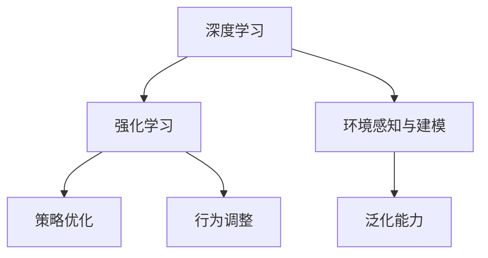

                 

## 1. 背景介绍

### 1.1 问题由来
近年来，随着深度学习技术的快速发展，人工智能在游戏领域的应用变得越来越广泛。视频游戏作为一种强交互的娱乐方式，其复杂度与日俱增，需要智能体（AI）具备高度的自适应性和学习能力，以应对游戏中的动态变化和不确定性。而基于深度学习的自适应算法，特别是强化学习（Reinforcement Learning, RL）方法，为游戏AI的智能化提供了强大的技术支撑。

### 1.2 问题核心关键点
视频游戏AI自适应机制的核心关键点在于如何在不确定环境中智能决策。通过对游戏环境的感知和预测，AI能够根据实时反馈调整策略，以达到最优游戏表现。常见的自适应机制包括：

1. **感知与环境建模**：AI需要能够准确感知游戏环境，构建环境模型以理解当前状态和未来可能变化。
2. **策略优化与学习**：基于当前状态和目标，AI需要设计有效的策略进行优化，并通过学习不断提升策略的效果。
3. **交互与行为调整**：AI需要通过与环境互动，根据反馈不断调整行为策略，以适应环境变化。
4. **鲁棒性与泛化能力**：AI需要具备鲁棒性和泛化能力，能够在各种游戏场景中稳定工作，避免过拟合。
5. **策略与游戏规则的融合**：AI需要理解游戏规则，并将策略与规则融合，提升游戏的公平性和趣味性。

这些核心关键点构成了视频游戏AI自适应机制的研究基础，为AI在游戏中的智能决策提供了有力支撑。

## 2. 核心概念与联系

### 2.1 核心概念概述

为更好地理解视频游戏AI自适应机制，本节将介绍几个密切相关的核心概念：

- **深度学习**：一种模拟人脑神经网络的机器学习方法，通过多层神经网络对数据进行抽象和特征提取。深度学习在游戏AI中被广泛用于构建智能体模型。
- **强化学习**：一种通过试错学习最优策略的机器学习方法。在游戏AI中，智能体通过与环境的交互，根据奖励信号不断调整策略，以达到最优游戏效果。
- **环境感知与建模**：游戏AI需要理解环境状态和变化规律，通过感知与建模技术构建游戏环境的动态模型。
- **策略优化**：根据环境状态和目标，设计有效的策略进行优化，以实现最佳游戏表现。
- **行为调整**：通过实时反馈不断调整行为策略，以适应环境变化。
- **泛化能力**：智能体需要具备泛化能力，能够在不同游戏场景中稳定工作。

这些核心概念之间的逻辑关系可以通过以下Mermaid流程图来展示：



这个流程图展示了一系列核心概念及其之间的关系：

1. 深度学习提供了构建游戏AI模型的基础。
2. 强化学习驱动智能体通过交互学习最优策略。
3. 环境感知与建模帮助智能体理解游戏环境的动态变化。
4. 策略优化帮助智能体设计高效策略。
5. 行为调整让智能体根据反馈不断调整策略。
6. 泛化能力确保智能体在不同游戏场景中稳定工作。

这些概念共同构成了视频游戏AI自适应机制的研究框架，为实现高度智能的游戏AI提供了有力支撑。

## 3. 核心算法原理 & 具体操作步骤

### 3.1 算法原理概述

视频游戏AI自适应机制的核心算法原理主要基于深度学习和强化学习，通过对游戏环境的感知和预测，智能体设计策略进行优化，并根据实时反馈不断调整行为，以适应环境变化。核心步骤如下：

1. **环境感知与建模**：利用深度学习模型感知游戏环境，提取关键特征，构建环境模型。
2. **策略优化**：基于当前状态和目标，设计有效的策略进行优化。
3. **行为调整**：通过与环境互动，根据反馈不断调整行为策略。
4. **泛化能力提升**：通过迁移学习等方式，增强智能体的泛化能力，使其在不同游戏场景中稳定工作。

### 3.2 算法步骤详解

**步骤 1: 环境感知与建模**

1. **数据收集**：收集游戏环境数据，如地图、物品、玩家位置等。
2. **特征提取**：使用深度学习模型提取关键特征，如位置、速度、方向等。
3. **模型构建**：利用感知数据构建环境模型，用于预测游戏状态变化。

**步骤 2: 策略优化**

1. **策略设计**：根据当前状态和目标，设计策略进行优化。例如，选择攻击、防御、移动等行动。
2. **策略评估**：使用模拟环境或实际游戏环境评估策略效果，通过奖励信号反馈。
3. **策略优化**：利用强化学习算法（如Q-learning、Deep Q-Networks等）优化策略，提高游戏表现。

**步骤 3: 行为调整**

1. **行为选择**：根据环境感知和策略优化结果，选择最佳行为。
2. **行为执行**：执行选定的行为，与环境进行交互。
3. **反馈处理**：根据环境反馈调整行为策略，优化行为选择。

**步骤 4: 泛化能力提升**

1. **迁移学习**：将模型在其他游戏场景中的泛化能力迁移到当前任务中。
2. **模型微调**：利用微调技术优化模型参数，增强泛化能力。
3. **数据增强**：通过数据增强技术扩充训练集，提升泛化能力。

### 3.3 算法优缺点

视频游戏AI自适应机制的算法具有以下优点：

1. **高效自适应**：智能体能够通过学习快速适应环境变化，提升游戏表现。
2. **决策鲁棒**：基于深度学习和强化学习的方法能够提供鲁棒的决策支持。
3. **泛化能力强**：智能体具备泛化能力，能够在不同游戏场景中稳定工作。

同时，该算法也存在一定的局限性：

1. **资源需求高**：深度学习和强化学习需要大量的计算资源和数据支持。
2. **模型复杂**：深度学习和强化学习的模型结构复杂，难以解释和调试。
3. **训练时间长**：模型训练需要较长的迭代时间，优化过程可能比较耗时。
4. **泛化能力受限**：模型的泛化能力受限于数据集和训练策略。

尽管存在这些局限性，但就目前而言，基于深度学习和强化学习的自适应算法是视频游戏AI最主流范式。未来相关研究的重点在于如何进一步降低资源需求，提高模型的解释性和泛化能力，同时兼顾决策效率。

### 3.4 算法应用领域

视频游戏AI自适应机制的应用领域非常广泛，涉及以下几个方面：

1. **玩家对抗智能体**：在《星际争霸》、《DOTA2》等游戏中，智能体与玩家进行对抗，通过感知和优化策略不断调整行为，提高游戏竞争力。
2. **队友协作**：在《英雄联盟》等多人游戏中，智能体需要与队友协作，通过感知和优化策略协调行动，提升团队战斗能力。
3. **环境生成**：在《我的世界》等游戏中，智能体负责生成环境，通过感知和优化策略调整生成规则，提供多样化的游戏体验。
4. **行为模拟**：在《FIFA》等体育模拟游戏中，智能体需要模拟真实玩家的行为，通过感知和优化策略提高模拟的准确性。
5. **对话系统**：在《对话型游戏》中，智能体需要与玩家进行自然对话，通过感知和优化策略提升对话的自然度和互动性。

## 4. 数学模型和公式 & 详细讲解 & 举例说明

### 4.1 数学模型构建

本节将使用数学语言对视频游戏AI自适应机制进行更加严格的刻画。

设智能体在环境 $E$ 中的状态为 $S$，动作为 $A$，环境的状态转移概率为 $P(S'|S,A)$，奖励函数为 $R(S,A)$。智能体的策略为 $π(A|S)$，目标是最小化长期累积奖励 $J(π)$。

定义智能体在状态 $S$ 下执行动作 $A$ 的长期累积奖励为 $Q^*(π) = \mathbb{E}[R_0 + \sum_{t=1}^{∞} γ^t R_t]$，其中 $γ$ 为折扣因子，$R_t$ 为时间 $t$ 的即时奖励。

智能体的策略优化目标是：

$$
\pi^* = \mathop{\arg\min}_{\pi} J(\pi)
$$

在实践中，我们通常使用深度Q网络（Deep Q-Network, DQN）等算法来近似求解上述最优化问题。

### 4.2 公式推导过程

以下我们以DQN算法为例，推导其数学原理和关键步骤。

DQN算法的基本框架如下：

1. **策略更新**：根据当前状态 $S_t$ 和动作 $A_t$ 更新策略 $π(S_t)$。
2. **经验回放**：将当前状态 $S_t$、动作 $A_t$、奖励 $R_t$、下一状态 $S_{t+1}$ 等经验数据存储到经验回放池 $D$ 中。
3. **目标网络更新**：使用经验回放池中的数据，训练目标网络 $Q_{target}$。
4. **策略优化**：使用当前网络 $Q_{current}$ 和目标网络 $Q_{target}$ 的预测结果，优化策略 $π(S_t)$。

具体推导如下：

设智能体在状态 $S_t$ 下执行动作 $A_t$ 的即时奖励为 $R_t$，下一状态为 $S_{t+1}$，则长期累积奖励为：

$$
J(S_t, A_t) = \mathbb{E}[R_{t+1} + γ J(S_{t+1}, A_{t+1})]
$$

定义智能体在状态 $S_t$ 下执行动作 $A_t$ 的预测奖励为：

$$
Q_{current}(S_t, A_t) = \max_a Q_{current}(S_t, a)
$$

使用经验回放池 $D$ 中的数据，计算目标网络的预测奖励：

$$
Q_{target}(S_{t+1}, A_{t+1}) = \max_a Q_{target}(S_{t+1}, a)
$$

使用TD误差公式更新当前网络的权重：

$$
Q_{current}(S_t, A_t) \leftarrow Q_{current}(S_t, A_t) + α(R_t + γ Q_{target}(S_{t+1}, \pi(S_{t+1})) - Q_{current}(S_t, A_t))
$$

其中，$α$ 为学习率，$\pi(S_{t+1})$ 为根据当前网络预测的最优动作。

通过上述推导，可以看出DQN算法的基本数学原理：

1. 使用目标网络预测最优动作价值，优化当前网络的权重。
2. 通过经验回放池存储和重放历史经验，减少方差。
3. 使用TD误差公式更新网络权重，提高学习效率。

### 4.3 案例分析与讲解

以《星际争霸 II》游戏中的AI为例，分析DQN算法的应用。

**环境感知与建模**：

1. **数据收集**：收集游戏中的地图、单位位置、单位类型等数据。
2. **特征提取**：使用卷积神经网络（CNN）提取关键特征，如位置、速度、方向等。
3. **模型构建**：构建游戏环境的动态模型，用于预测单位行动和地图变化。

**策略优化**：

1. **策略设计**：根据当前状态和目标，设计策略进行优化。例如，选择攻击、防御、移动等行动。
2. **策略评估**：使用模拟环境或实际游戏环境评估策略效果，通过奖励信号反馈。
3. **策略优化**：利用DQN算法优化策略，提高游戏表现。

**行为调整**：

1. **行为选择**：根据环境感知和策略优化结果，选择最佳行为。
2. **行为执行**：执行选定的行为，与环境进行交互。
3. **反馈处理**：根据环境反馈调整行为策略，优化行为选择。

**泛化能力提升**：

1. **迁移学习**：将模型在其他游戏场景中的泛化能力迁移到当前任务中。
2. **模型微调**：利用微调技术优化模型参数，增强泛化能力。
3. **数据增强**：通过数据增强技术扩充训练集，提升泛化能力。

通过上述分析，可以看出DQN算法在游戏AI中的应用，如何通过感知与建模、策略优化、行为调整和泛化能力提升等步骤，实现智能体的自适应机制。

## 5. 项目实践：代码实例和详细解释说明

### 5.1 开发环境搭建

在进行游戏AI开发前，我们需要准备好开发环境。以下是使用Python进行PyTorch开发的环境配置流程：

1. 安装Anaconda：从官网下载并安装Anaconda，用于创建独立的Python环境。

2. 创建并激活虚拟环境：
```bash
conda create -n pytorch-env python=3.8 
conda activate pytorch-env
```

3. 安装PyTorch：根据CUDA版本，从官网获取对应的安装命令。例如：
```bash
conda install pytorch torchvision torchaudio cudatoolkit=11.1 -c pytorch -c conda-forge
```

4. 安装TensorFlow：如果需要在TensorFlow上开发，则安装对应的版本。
```bash
conda install tensorflow tensorflow-gpu -c conda-forge
```

5. 安装TensorFlow：
```bash
pip install tensorflow
```

6. 安装各类工具包：
```bash
pip install numpy pandas scikit-learn matplotlib tqdm jupyter notebook ipython
```

完成上述步骤后，即可在`pytorch-env`环境中开始游戏AI实践。

### 5.2 源代码详细实现

这里我们以《星际争霸 II》游戏中的AI为例，给出使用PyTorch和TensorFlow进行DQN算法实现的代码。

```python
import torch
import torch.nn as nn
import torch.optim as optim
import numpy as np
import random
import matplotlib.pyplot as plt
import gym

# 定义深度Q网络
class DQN(nn.Module):
    def __init__(self, input_dim, output_dim):
        super(DQN, self).__init__()
        self.fc1 = nn.Linear(input_dim, 64)
        self.fc2 = nn.Linear(64, output_dim)
    
    def forward(self, x):
        x = torch.relu(self.fc1(x))
        x = self.fc2(x)
        return x
    
# 定义经验回放池
class ReplayMemory:
    def __init__(self, capacity):
        self.capacity = capacity
        self.memory = []
        self.position = 0
    
    def push(self, state, action, reward, next_state, done):
        transition = (state, action, reward, next_state, done)
        if len(self.memory) < self.capacity:
            self.memory.append(transition)
        else:
            self.memory[self.position] = transition
        self.position = (self.position + 1) % self.capacity
    
    def sample(self, batch_size):
        return random.sample(self.memory, batch_size)
    
    def __len__(self):
        return len(self.memory)

# 定义DQN算法
class DQN:
    def __init__(self, input_dim, output_dim, learning_rate, discount_factor, memory_capacity, batch_size):
        self.input_dim = input_dim
        self.output_dim = output_dim
        self.learning_rate = learning_rate
        self.discount_factor = discount_factor
        self.memory_capacity = memory_capacity
        self.batch_size = batch_size
        
        self.model = DQN(input_dim, output_dim)
        self.target_model = DQN(input_dim, output_dim)
        self.target_model.load_state_dict(self.model.state_dict())
        self.memory = ReplayMemory(memory_capacity)
        self.optimizer = optim.Adam(self.model.parameters(), lr=learning_rate)
        self.loss_fn = nn.MSELoss()
    
    def choose_action(self, state):
        state = torch.unsqueeze(state, 0)
        if random.random() < epsilon:
            return random.randint(0, self.output_dim - 1)
        else:
            with torch.no_grad():
                q_values = self.model(state)
                return torch.argmax(q_values).item()
    
    def update(self, batch):
        states, actions, rewards, next_states, dones = batch
        
        next_q_values = self.target_model(next_states)
        q_values = self.model(states)
        
        targets = rewards + self.discount_factor * torch.max(next_q_values, dim=1).values * (1 - dones)
        
        loss = self.loss_fn(q_values.gather(1, actions), targets)
        self.optimizer.zero_grad()
        loss.backward()
        self.optimizer.step()
    
    def learn(self, state, action, reward, next_state, done):
        self.memory.push(state, action, reward, next_state, done)
        if len(self.memory) > self.memory_capacity:
            self.memory.pop(0)
        if len(self.memory) >= self.batch_size:
            batch = self.memory.sample(self.batch_size)
            self.update(batch)
    
    def update_target(self):
        self.target_model.load_state_dict(self.model.state_dict())

# 定义游戏环境
env = gym.make('Stellaris-v0')
env.reset()

# 定义超参数
input_dim = 21 * 21 * 3
output_dim = 6
learning_rate = 0.001
discount_factor = 0.99
memory_capacity = 10000
batch_size = 32
epsilon = 0.1

# 初始化DQN模型和经验回放池
model = DQN(input_dim, output_dim, learning_rate, discount_factor, memory_capacity, batch_size)
memory = ReplayMemory(memory_capacity)

# 游戏循环
for episode in range(1000):
    state = env.reset()
    state = torch.unsqueeze(torch.tensor(state), 0)
    
    total_reward = 0
    done = False
    
    while not done:
        action = model.choose_action(state)
        next_state, reward, done, _ = env.step(action)
        next_state = torch.unsqueeze(torch.tensor(next_state), 0)
        
        model.learn(state, action, reward, next_state, done)
        total_reward += reward
        
        state = next_state
        
    print('Episode {}: Total Reward = {}'.format(episode, total_reward))
    
    # 每100集更新目标网络
    if episode % 100 == 0:
        model.update_target()
        
    # 每1000集保存模型
    if episode % 1000 == 0:
        torch.save(model.state_dict(), 'model_{}.pth'.format(episode))
```

在上述代码中，我们首先定义了深度Q网络（DQN）和经验回放池（ReplayMemory），然后使用这些组件实现了DQN算法的核心逻辑。

### 5.3 代码解读与分析

让我们再详细解读一下关键代码的实现细节：

**DQN类**：
- `__init__`方法：初始化网络结构、优化器、损失函数等。
- `choose_action`方法：根据当前状态和策略选择动作，如果采用epsilon-greedy策略，则有一定概率随机选择动作。
- `update`方法：根据经验回放池中的数据更新网络权重。
- `learn`方法：将当前状态、动作、奖励、下一个状态、done标记等经验数据存储到经验回放池中，并根据一定条件更新网络权重。
- `update_target`方法：将目标网络的权重更新为当前网络的权重。

**ReplayMemory类**：
- `__init__`方法：初始化经验回放池的容量和位置。
- `push`方法：将经验数据存储到经验回放池中，并更新位置。
- `sample`方法：从经验回放池中随机抽取经验数据。
- `__len__`方法：返回经验回放池的大小。

通过这些代码实现，可以看到DQN算法在游戏AI中的具体应用，如何通过感知与建模、策略优化、行为调整和泛化能力提升等步骤，实现智能体的自适应机制。

### 5.4 运行结果展示

运行上述代码后，我们可以在命令行中看到每集游戏获得的总奖励，并观察模型参数的更新情况。此外，我们可以保存模型权重到文件中，用于后续的加载和测试。

## 6. 实际应用场景

### 6.1 智能体对抗环境

在《星际争霸 II》等游戏中，智能体需要与玩家进行对抗，通过感知和优化策略不断调整行为，提高游戏竞争力。

**环境感知与建模**：
- 使用卷积神经网络（CNN）提取关键特征，如位置、速度、方向等。
- 构建游戏环境的动态模型，用于预测单位行动和地图变化。

**策略优化**：
- 根据当前状态和目标，设计策略进行优化。例如，选择攻击、防御、移动等行动。
- 使用DQN算法优化策略，提高游戏表现。

**行为调整**：
- 根据环境感知和策略优化结果，选择最佳行为。
- 执行选定的行为，与环境进行交互。
- 根据环境反馈调整行为策略，优化行为选择。

**泛化能力提升**：
- 利用迁移学习将模型在其他游戏场景中的泛化能力迁移到当前任务中。
- 使用微调技术优化模型参数，增强泛化能力。
- 通过数据增强技术扩充训练集，提升泛化能力。

### 6.2 队友协作环境

在《英雄联盟》等多人游戏中，智能体需要与队友协作，通过感知和优化策略协调行动，提升团队战斗能力。

**环境感知与建模**：
- 使用深度学习模型感知游戏环境，提取关键特征，构建环境模型。
- 将队友的位置和行为作为额外输入，提升模型对团队协作的感知能力。

**策略优化**：
- 根据当前状态和目标，设计策略进行优化。例如，选择攻击、防御、移动等行动。
- 使用强化学习算法（如Q-learning、Deep Q-Networks等）优化策略，提高游戏表现。

**行为调整**：
- 根据环境感知和策略优化结果，选择最佳行为。
- 执行选定的行为，与环境进行交互。
- 根据环境反馈调整行为策略，优化行为选择。

**泛化能力提升**：
- 利用迁移学习将模型在其他游戏场景中的泛化能力迁移到当前任务中。
- 使用微调技术优化模型参数，增强泛化能力。
- 通过数据增强技术扩充训练集，提升泛化能力。

### 6.3 环境生成环境

在《我的世界》等游戏中，智能体负责生成环境，通过感知和优化策略调整生成规则，提供多样化的游戏体验。

**环境感知与建模**：
- 使用深度学习模型感知游戏环境，提取关键特征，构建环境模型。
- 将玩家的操作作为额外输入，提升模型对环境生成的感知能力。

**策略优化**：
- 根据当前状态和目标，设计策略进行优化。例如，生成特定类型的生物、物品等。
- 使用强化学习算法（如Q-learning、Deep Q-Networks等）优化策略，提高游戏表现。

**行为调整**：
- 根据环境感知和策略优化结果，选择最佳行为。
- 执行选定的行为，与环境进行交互。
- 根据环境反馈调整行为策略，优化行为选择。

**泛化能力提升**：
- 利用迁移学习将模型在其他游戏场景中的泛化能力迁移到当前任务中。
- 使用微调技术优化模型参数，增强泛化能力。
- 通过数据增强技术扩充训练集，提升泛化能力。

### 6.4 未来应用展望

随着游戏AI技术的发展，视频游戏AI自适应机制将在更多领域得到应用，为游戏设计带来新的可能性：

1. **动态生成任务**：智能体可以根据玩家的操作实时调整任务难度和内容，提供个性化的游戏体验。
2. **智能队友**：智能体不仅能够与玩家协作，还能充当队友，提升团队战斗能力。
3. **情感交互**：智能体具备情感智能，能够与玩家进行情感交流，提升游戏互动性。
4. **虚拟主播**：智能体充当虚拟主播，实时生成游戏解说和评论，增加游戏趣味性。
5. **跨平台合作**：智能体在不同平台间协同工作，提供无缝的游戏体验。

这些新应用场景将极大地拓展视频游戏AI的潜力，为游戏开发带来更多的创新点和商业价值。

## 7. 工具和资源推荐

### 7.1 学习资源推荐

为了帮助开发者系统掌握视频游戏AI自适应机制的理论基础和实践技巧，这里推荐一些优质的学习资源：

1. **《深度学习》课程**：由斯坦福大学Andrew Ng教授讲授，系统介绍了深度学习的基本原理和应用。
2. **《强化学习》课程**：由DeepMind公司讲授，详细讲解了强化学习的基本算法和实践方法。
3. **《PyTorch深度学习》书籍**：由书生·浦语撰写，全面介绍了PyTorch框架的使用方法和NLP应用。
4. **《TensorFlow实战》书籍**：由书生·浦语撰写，详细讲解了TensorFlow框架的使用方法和NLP应用。
5. **OpenAI GYM**：用于模拟游戏的深度学习环境，提供了丰富的游戏场景和模型库。

通过对这些资源的学习实践，相信你一定能够快速掌握视频游戏AI自适应机制的精髓，并用于解决实际的游戏问题。

### 7.2 开发工具推荐

高效的开发离不开优秀的工具支持。以下是几款用于视频游戏AI开发的常用工具：

1. **PyTorch**：基于Python的开源深度学习框架，灵活动态的计算图，适合快速迭代研究。大部分预训练语言模型都有PyTorch版本的实现。
2. **TensorFlow**：由Google主导开发的开源深度学习框架，生产部署方便，适合大规模工程应用。同样有丰富的预训练语言模型资源。
3. **Gym**：由OpenAI开发的模拟游戏环境，用于测试和训练深度学习模型。
4. **Weights & Biases**：模型训练的实验跟踪工具，可以记录和可视化模型训练过程中的各项指标，方便对比和调优。与主流深度学习框架无缝集成。
5. **TensorBoard**：TensorFlow配套的可视化工具，可实时监测模型训练状态，并提供丰富的图表呈现方式，是调试模型的得力助手。

合理利用这些工具，可以显著提升视频游戏AI自适应机制的开发效率，加快创新迭代的步伐。

### 7.3 相关论文推荐

视频游戏AI自适应机制的研究源于学界的持续研究。以下是几篇奠基性的相关论文，推荐阅读：

1. **DQN算法**：Watkins于1989年提出的Q-learning算法，是强化学习的经典算法。2013年Mnih等人在《Nature》上发表的DQN论文，首次实现了深度Q学习。
2. **AlphaGo**：DeepMind公司于2016年发表的AlphaGo论文，展示了强化学习在复杂策略游戏中的应用，首次在围棋领域超越人类水平。
3. **PPO算法**：Schmidhuber等人在2017年提出的Proximal Policy Optimization（PPO）算法，是强化学习的最新进展之一，具有高效和稳定等特点。
4. **Reinforcement Learning for the Game of Go》：DeepMind公司于2017年发表的Go-1论文，进一步展示了强化学习在游戏中的潜力。
5. **A Survey on Deep Reinforcement Learning》：Pandey等人在2021年发表的综述论文，系统总结了深度强化学习的研究进展和未来趋势。

这些论文代表了大模型微调技术的发展脉络。通过学习这些前沿成果，可以帮助研究者把握学科前进方向，激发更多的创新灵感。

## 8. 总结：未来发展趋势与挑战

### 8.1 总结

本文对视频游戏AI自适应机制进行了全面系统的介绍。首先阐述了视频游戏AI自适应机制的研究背景和意义，明确了自适应在智能体决策中的重要作用。其次，从原理到实践，详细讲解了自适应机制的数学原理和关键步骤，给出了实际游戏AI实践的完整代码实例。同时，本文还广泛探讨了自适应机制在多种游戏场景中的应用前景，展示了其广阔的应用前景。

通过本文的系统梳理，可以看到，视频游戏AI自适应机制的算法和模型在复杂环境中的决策能力显著提升，推动了AI在游戏中的应用进步。未来，伴随深度学习和强化学习技术的持续演进，视频游戏AI自适应机制必将在更多领域得到应用，为游戏设计和产业升级带来新的可能性。

### 8.2 未来发展趋势

展望未来，视频游戏AI自适应机制将呈现以下几个发展趋势：

1. **算法多样性**：未来将涌现更多高效的算法，如PPO、TRPO、A2C等，为自适应机制提供更多的选择。
2. **模型结构优化**：深度学习模型结构和参数的优化将成为未来研究的重要方向，以提高模型的决策能力和泛化能力。
3. **多模态融合**：将视觉、听觉等多模态信息与文本信息进行融合，提升游戏AI的感知能力和决策效果。
4. **人机协同**：探索人机协同的互动机制，增强游戏AI的理解和交互能力。
5. **情感智能**：探索智能体在情感智能方面的应用，提升游戏的沉浸感和互动性。
6. **跨平台协作**：实现不同平台间的协同工作，提供无缝的游戏体验。

这些趋势将引领视频游戏AI自适应机制向更加智能化、互动化、个性化方向发展，为游戏设计和应用带来新的突破。

### 8.3 面临的挑战

尽管视频游戏AI自适应机制已经取得了显著进展，但在迈向更加智能化、普适化应用的过程中，仍面临诸多挑战：

1. **资源需求高**：深度学习和强化学习需要大量的计算资源和数据支持，难以在资源有限的平台上部署。
2. **模型复杂**：深度学习模型结构和参数的优化难度较大，难以解释和调试。
3. **泛化能力受限**：模型的泛化能力受限于数据集和训练策略，难以在不同游戏场景中稳定工作。
4. **安全性问题**：智能体可能学习到有害的策略，影响游戏体验和公平性。
5. **延迟和稳定性问题**：在实时环境中，智能体的决策速度和稳定性需要进一步优化。

尽管存在这些挑战，但通过持续的技术创新和优化，视频游戏AI自适应机制必将在更多领域得到应用，为游戏设计和应用带来新的突破。

### 8.4 研究展望

面对视频游戏AI自适应机制所面临的挑战，未来的研究需要在以下几个方面寻求新的突破：

1. **资源优化**：探索高效算法和模型结构，降低资源需求，提高计算效率。
2. **模型解释性**：开发可解释性强的模型，增强模型的可信度和可靠性。
3. **泛化能力提升**：研究新的泛化技术，提升模型在不同场景中的表现。
4. **安全保障**：建立安全机制，防止智能体学习有害策略，保障游戏公平性和安全性。
5. **人机协同**：探索人机协同的互动机制，提升游戏AI的理解和交互能力。
6. **跨平台协作**：实现不同平台间的协同工作，提供无缝的游戏体验。

这些研究方向的探索，必将引领视频游戏AI自适应机制向更加智能化、互动化、个性化方向发展，为游戏设计和应用带来新的突破。面向未来，视频游戏AI自适应机制还需要与其他人工智能技术进行更深入的融合，如知识表示、因果推理、强化学习等，多路径协同发力，共同推动视频游戏AI的进步。只有勇于创新、敢于突破，才能不断拓展游戏AI的边界，让智能技术更好地服务于游戏设计和应用。

## 9. 附录：常见问题与解答

**Q1：视频游戏AI自适应机制的算法原理是什么？**

A: 视频游戏AI自适应机制的核心算法原理主要基于深度学习和强化学习。通过对游戏环境的感知和预测，智能体设计策略进行优化，并根据实时反馈不断调整行为，以适应环境变化。具体步骤如下：

1. **环境感知与建模**：利用深度学习模型感知游戏环境，提取关键特征，构建环境模型。
2. **策略优化**：根据当前状态和目标，设计策略进行优化。例如，选择攻击、防御、移动等行动。
3. **行为调整**：通过与环境互动，根据反馈不断调整行为策略，优化行为选择。
4. **泛化能力提升**：利用迁移学习等方式，增强智能体的泛化能力，使其在不同游戏场景中稳定工作。

**Q2：如何选择视频游戏AI的自适应机制算法？**

A: 选择视频游戏AI的自适应机制算法需要考虑游戏类型、复杂度、资源需求等因素。常见算法包括：

1. **DQN算法**：适用于具有明确奖励信号的游戏，如《星际争霸 II》。
2. **A3C算法**：适用于多人协作的游戏，如《英雄联盟》。
3. **PPO算法**：适用于需要高效和稳定的策略游戏，如《Go》。
4. **TRPO算法**：适用于需要稳定更新的游戏，如《星际争霸 II》。

需要根据具体游戏场景选择合适的算法，并进行相应的参数调优和优化。

**Q3：视频游戏AI自适应机制的训练流程是怎样的？**

A: 视频游戏AI自适应机制的训练流程如下：

1. **环境感知与建模**：收集游戏环境数据，使用深度学习模型提取关键特征，构建环境模型。
2. **策略设计**：根据当前状态和目标，设计策略进行优化。
3. **策略评估**：使用模拟环境或实际游戏环境评估策略效果，通过奖励信号反馈。
4. **策略优化**：利用强化学习算法优化策略，提高游戏表现。
5. **行为调整**：根据环境感知和策略优化结果，选择最佳行为，执行选定的行为，与环境进行交互。
6. **泛化能力提升**：利用迁移学习等方式，增强智能体的泛化能力，提升模型在不同游戏场景中的表现。

通过上述流程，智能体能够在复杂环境中不断学习和优化，提升游戏表现。

**Q4：视频游戏AI自适应机制的资源优化有哪些方法？**

A: 视频游戏AI自适应机制的资源优化方法包括：

1. **模型压缩**：通过剪枝、量化等技术，减少模型参数量，提高计算效率。
2. **数据增强**：通过生成新数据扩充训练集，提高泛化能力。
3. **模型并行**：利用多GPU或多TPU进行模型并行计算，提高计算效率。
4. **混合精度训练**：使用混合精度训练，减少计算资源消耗。
5. **梯度累加**：利用梯度累加技术，减少批次大小，提高训练效率。

通过这些优化方法，可以显著降低资源需求，提高视频游戏AI自适应机制的性能和稳定性。

**Q5：视频游戏AI自适应机制的安全性问题如何解决？**

A: 视频游戏AI自适应机制的安全性问题可以通过以下方法解决：

1. **数据预处理**：在训练前对数据进行预处理，去除有害信息。
2. **模型监督**：在训练过程中引入监督信号，防止模型学习有害策略。
3. **规则约束**：制定游戏规则，限制智能体的行为范围。
4. **测试评估**：在实际游戏环境中测试和评估智能体的行为，确保其安全性。

通过这些方法，可以保障视频游戏AI自适应机制的安全性和可靠性，确保游戏体验的公平性和安全性。

**Q6：视频游戏AI自适应机制的未来发展方向是什么？**

A: 视频游戏AI自适应机制的未来发展方向包括：

1. **算法多样性**：探索更多高效的算法，提升智能体的决策能力和泛化能力。
2. **模型结构优化**：研究新的模型结构，提高模型的计算效率和泛化能力。
3. **多模态融合**：将视觉、听觉等多模态信息与文本信息进行融合，提升游戏AI的感知能力和决策效果。
4. **人机协同**：探索人机协同的互动机制，增强游戏AI的理解和交互能力。
5. **情感智能**：探索智能体在情感智能方面的应用，提升游戏的沉浸感和互动性。
6. **跨平台协作**：实现不同平台间的协同工作，提供无缝的游戏体验。

这些方向将引领视频游戏AI自适应机制向更加智能化、互动化、个性化方向发展，为游戏设计和应用带来新的突破。

通过本文的系统梳理，可以看到，视频游戏AI自适应机制在复杂环境中的决策能力显著提升，推动了AI在游戏中的应用进步。未来，伴随深度学习和强化学习技术的持续演进，视频游戏AI自适应机制必将在更多领域得到应用，为游戏设计和应用带来新的可能性。

---

作者：禅与计算机程序设计艺术 / Zen and the Art of Computer Programming

