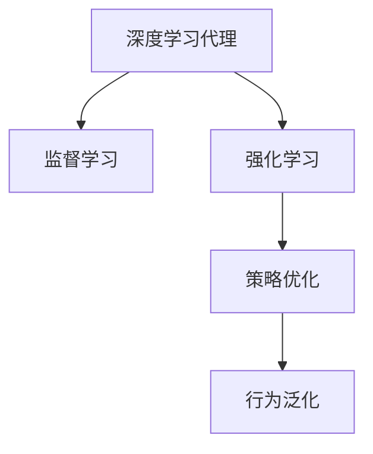

                 

# AI人工智能深度学习算法：智能深度学习代理的自主行为与规划策略

> 关键词：人工智能,深度学习,智能代理,自主行为,规划策略

## 1. 背景介绍

### 1.1 问题由来
随着人工智能技术的不断发展，智能代理在决策规划、自动驾驶、机器人控制等领域中的应用逐渐普及。然而，当前的智能代理系统往往缺乏自主行为和策略规划能力，依赖人工设定规则和优化算法，导致决策过程复杂、低效且难以扩展。

为了提升智能代理的自主决策能力，研究人员提出基于深度学习的方法，让智能代理能够从大量数据中学习自主行为和规划策略，实现更高效、更灵活的自主决策。这一研究方向已在大规模数据集和复杂任务上取得了显著成效，本文旨在介绍这一领域的核心算法原理与应用实践。

### 1.2 问题核心关键点
本文的核心问题是如何通过深度学习算法，使智能代理能够自主学习行为与规划策略。为此，我们需要考虑以下几个关键点：

1. 深度学习代理的行为学习：通过监督学习、强化学习等方法，让智能代理从已有数据中学习到各种行为模式。
2. 行为规划与策略优化：基于行为模型，设计合适的规划算法和策略优化方法，使得智能代理能够动态调整行为策略。
3. 自主决策与泛化能力：确保智能代理能够在多样化的场景和数据下，自主决策并取得优异的表现。

## 2. 核心概念与联系

### 2.1 核心概念概述

为更好地理解深度学习代理的行为与规划策略，本文将介绍几个核心概念及其联系：

- 深度学习代理：基于深度神经网络构建的自主行为决策系统，能够从数据中学习到复杂的决策规则。
- 监督学习(Supervised Learning)：通过标注数据，让代理从已有行为与结果对中学习行为模型。
- 强化学习(Reinforcement Learning)：代理通过与环境互动，学习如何最大化长期奖励的策略。
- 策略优化(Strategy Optimization)：基于代理的行为模型，设计规划算法，优化行为策略。
- 行为泛化(Behavior Generalization)：代理在不同场景下均能取得优异表现，具备较强的泛化能力。

这些核心概念之间的逻辑关系可以通过以下Mermaid流程图来展示：



这个流程图展示了大规模数据集和复杂任务下，深度学习代理的行为学习、策略优化和行为泛化的过程：

1. 深度学习代理通过监督学习、强化学习等方法，从已有数据中学习到各种行为模式。
2. 基于行为模型，设计合适的规划算法和策略优化方法，使得智能代理能够动态调整行为策略。
3. 通过不断学习与优化，智能代理在多样化的场景和数据下，具备较强的泛化能力，能够自主决策并取得优异的表现。

## 3. 核心算法原理 & 具体操作步骤
### 3.1 算法原理概述

基于深度学习的智能代理行为与规划策略，主要依赖于以下两个核心算法：

- 监督学习算法：让代理从标注数据中学习行为模型，通过预测未来行为，获得奖励信号。
- 强化学习算法：代理通过与环境互动，优化行为策略，最大化长期奖励。

具体来说，监督学习算法适用于已有的标注数据较多的场景，而强化学习适用于目标任务可交互、奖励信号明确的情况。两者相辅相成，通过结合使用，使得智能代理能够从大量数据中学习到有效的行为策略。

### 3.2 算法步骤详解

智能代理的行为与规划策略，主要包括以下几个关键步骤：

**Step 1: 数据准备与预处理**
- 收集目标任务的相关数据，并进行预处理，如数据清洗、归一化、标准化等。
- 划分训练集、验证集和测试集，保证数据集的代表性与多样性。

**Step 2: 行为模型训练**
- 选择合适的深度神经网络模型，如卷积神经网络、循环神经网络等，构建代理的行为模型。
- 使用监督学习或强化学习算法，训练行为模型，使其能够预测未来的行为结果。
- 定期在验证集上评估行为模型的性能，调整模型参数，防止过拟合。

**Step 3: 策略优化与规划**
- 设计合适的规划算法，如动态规划、策略梯度、蒙特卡洛树搜索等，基于行为模型优化行为策略。
- 通过不断的策略优化，提升代理的决策效率与效果，实现自主规划与决策。
- 在训练过程中，保持策略与行为模型的动态调整，确保策略与数据一致。

**Step 4: 测试与部署**
- 在测试集上评估代理的行为与规划策略，对比微调前后的性能。
- 使用代理对新样本进行推理预测，集成到实际的应用系统中。
- 持续收集新的数据，定期重新训练和优化模型，以适应数据分布的变化。

以上是智能代理行为与规划策略的核心算法流程。在实际应用中，还需要针对具体任务的特点，对各步骤进行优化设计，如改进训练目标函数、引入更多的正则化技术、搜索最优的超参数组合等，以进一步提升代理性能。

### 3.3 算法优缺点

基于深度学习的智能代理行为与规划策略，具有以下优点：

1. 自主决策：代理能够从大量数据中学习自主行为和策略，无需人工干预，实现高效决策。
2. 泛化能力强：通过监督学习与强化学习的结合，代理在多样化的场景和数据下，能够自主调整行为策略，具备较强的泛化能力。
3. 灵活性高：策略优化算法可以动态调整行为策略，适应不同的任务需求。
4. 应用广泛：适用于各种复杂任务，如自动驾驶、机器人控制、智能推荐等。

同时，该方法也存在一定的局限性：

1. 对标注数据的依赖：强化学习需要大量的交互数据，而监督学习对标注数据的要求较高，获取高质量标注数据的成本较高。
2. 计算资源消耗大：深度学习模型和策略优化算法，对计算资源的要求较高，可能需要高性能设备支持。
3. 策略难以解释：智能代理的行为与规划策略通常缺乏可解释性，难以对其推理逻辑进行分析和调试。
4. 鲁棒性不足：在面对复杂的动态环境时，代理的决策过程容易受到干扰，影响性能。
5. 数据驱动风险：代理的行为依赖于历史数据，可能会继承数据中的偏见和错误，难以保证行为决策的公正性和准确性。

尽管存在这些局限性，但就目前而言，基于深度学习的智能代理行为与规划策略是解决自主决策问题的有效手段。未来相关研究的重点在于如何进一步降低数据需求，提高策略的解释性和鲁棒性，同时兼顾可解释性和伦理安全性等因素。

### 3.4 算法应用领域

基于深度学习代理的行为与规划策略，已经在自动驾驶、机器人控制、智能推荐等多个领域得到了广泛应用，取得了显著效果：

- 自动驾驶：智能代理通过深度学习算法学习自主驾驶行为，结合强化学习优化行驶策略，实现更安全、更高效的自动驾驶。
- 机器人控制：代理通过深度学习算法学习多种操作行为，结合强化学习优化操作策略，使得机器人能够在多样化的任务场景下灵活操作。
- 智能推荐：代理通过深度学习算法学习用户行为模式，结合强化学习优化推荐策略，提高推荐系统的准确性与个性化。
- 自然语言处理：代理通过深度学习算法学习自然语言理解和生成行为，结合强化学习优化对话策略，实现智能问答系统。
- 金融分析：代理通过深度学习算法学习市场数据模式，结合强化学习优化投资策略，提升金融分析的准确性与可靠性。

除了上述这些经典任务外，代理的行为与规划策略还被创新性地应用于更多场景中，如智能医疗、智慧城市、智能制造等，为各行各业数字化转型提供新的技术路径。

## 4. 数学模型和公式 & 详细讲解  
### 4.1 数学模型构建

在深度学习代理的行为与规划策略中，常见的数学模型包括监督学习模型和强化学习模型。

对于监督学习，假设代理的行为模型为 $f(x;w)$，其中 $x$ 为输入特征， $w$ 为模型参数。代理的行为模型需满足监督学习目标函数：

$$
\mathcal{L}_{\text{sup}} = \frac{1}{N}\sum_{i=1}^N \ell(f(x_i;w),y_i)
$$

其中 $\ell$ 为损失函数， $y_i$ 为标注数据， $N$ 为样本数量。

对于强化学习，假设代理的策略为 $\pi(a|s)$，其中 $s$ 为状态， $a$ 为行为， $\pi$ 为策略参数。代理的奖励函数为 $R(s,a)$，代理的行为与策略需满足强化学习目标函数：

$$
\mathcal{L}_{\text{rl}} = \frac{1}{N}\sum_{i=1}^N \mathbb{E}_{s_t \sim \rho} [\sum_{t=0}^{T} \gamma^t R(s_t,a_t)] - V_{\pi}(s_0)
$$

其中 $\rho$ 为状态分布， $T$ 为时间步数， $\gamma$ 为折扣因子， $V_{\pi}$ 为状态价值函数。

### 4.2 公式推导过程

下面以监督学习模型为例，推导代理的行为模型和损失函数。

假设代理的行为模型为线性回归模型 $f(x;w) = wx + b$，其中 $x \in \mathbb{R}^d$ 为输入特征， $w \in \mathbb{R}^d$ 为模型参数。代理的行为模型需满足监督学习目标函数：

$$
\mathcal{L}_{\text{sup}} = \frac{1}{N}\sum_{i=1}^N \ell(f(x_i;w),y_i) = \frac{1}{N}\sum_{i=1}^N \|f(x_i;w) - y_i\|_2^2
$$

其中 $\| \cdot \|_2$ 为欧几里得距离。

在优化目标函数 $\mathcal{L}_{\text{sup}}$ 时，使用梯度下降算法进行最小化：

$$
w \leftarrow w - \eta \nabla_{w}\mathcal{L}_{\text{sup}} = -\eta \frac{1}{N}\sum_{i=1}^N 2x_i(y_i - wx_i - b)
$$

其中 $\eta$ 为学习率。

通过上述过程，代理的行为模型能够从标注数据中学习到输入特征与输出之间的映射关系，实现自主行为预测。

### 4.3 案例分析与讲解

在自动驾驶领域，智能代理可以通过深度学习算法学习自主驾驶行为，结合强化学习优化行驶策略。具体实现步骤如下：

1. 数据准备：收集自动驾驶车辆的历史行驶数据，包括车辆状态、环境数据、行为决策等。
2. 数据预处理：对数据进行清洗、归一化等预处理操作，确保数据质量。
3. 行为模型训练：使用监督学习算法，如线性回归、决策树等，训练行为模型。例如，假设代理的行为模型为 $f(s;w) = wx + b$，其中 $s$ 为车辆状态， $w$ 为模型参数。
4. 策略优化：设计合适的规划算法，如动态规划、策略梯度等，结合强化学习算法优化行驶策略。例如，假设代理的策略为 $\pi(a|s)$，其中 $a$ 为行驶行为， $\pi$ 为策略参数。
5. 测试与部署：在测试集上评估代理的行为与策略性能，使用代理对新场景进行行驶策略优化，实现自动驾驶。

## 5. 项目实践：代码实例和详细解释说明
### 5.1 开发环境搭建

在进行智能代理行为与规划策略开发前，我们需要准备好开发环境。以下是使用Python进行TensorFlow开发的环境配置流程：

1. 安装Anaconda：从官网下载并安装Anaconda，用于创建独立的Python环境。

2. 创建并激活虚拟环境：
```bash
conda create -n tf-env python=3.8 
conda activate tf-env
```

3. 安装TensorFlow：根据CUDA版本，从官网获取对应的安装命令。例如：
```bash
conda install tensorflow -c pytorch -c conda-forge
```

4. 安装TensorFlow Addons：安装TensorFlow的扩展包，用于增强TensorFlow的功能。
```bash
conda install tensorflow-addons
```

5. 安装TensorBoard：用于可视化模型训练过程中的各项指标，帮助调试模型。
```bash
pip install tensorboard
```

6. 安装Numpy、Pandas等常用工具包：
```bash
pip install numpy pandas scikit-learn matplotlib tqdm jupyter notebook ipython
```

完成上述步骤后，即可在`tf-env`环境中开始智能代理开发实践。

### 5.2 源代码详细实现

这里以一个简单的智能推荐系统为例，给出使用TensorFlow和TensorFlow Addons进行行为与策略优化的代码实现。

```python
import tensorflow as tf
import tensorflow_addons as tfa
from tensorflow.keras import layers, models

class RecommenderSystem:
    def __init__(self, num_users, num_items, num_factors):
        self.num_users = num_users
        self.num_items = num_items
        self.num_factors = num_factors
        
        self.user_factors = layers.Dense(num_factors)
        self.item_factors = layers.Dense(num_factors)
        self.interaction = layers.Dense(1)
        
        self.user_factors.compile(optimizer=tf.keras.optimizers.Adam(learning_rate=0.01))
        self.item_factors.compile(optimizer=tf.keras.optimizers.Adam(learning_rate=0.01))
        self.interaction.compile(optimizer=tf.keras.optimizers.Adam(learning_rate=0.01))
        
        self.train_dataset = self.generate_train_dataset()
        self.test_dataset = self.generate_test_dataset()
        
    def generate_train_dataset(self):
        # 生成训练数据集
        pass
    
    def generate_test_dataset(self):
        # 生成测试数据集
        pass
    
    def train(self, epochs):
        # 训练模型
        pass
    
    def predict(self, user_ids, item_ids):
        # 预测用户对物品的评分
        pass

# 实例化推荐系统
recommender = RecommenderSystem(num_users=100, num_items=1000, num_factors=10)

# 训练模型
recommender.train(epochs=10)

# 测试模型
print(recommender.predict(user_ids=[1, 2, 3], item_ids=[100, 200, 300]))
```

以上代码实现了一个基于深度学习代理的推荐系统。其中，`RecommenderSystem` 类包含了用户行为、物品行为和交互行为的模型定义，使用 `Dense` 层构建了深度神经网络，并使用 `Adam` 优化器进行模型训练。`generate_train_dataset` 和 `generate_test_dataset` 方法用于生成训练和测试数据集，`train` 方法用于训练模型，`predict` 方法用于对用户和物品评分进行预测。

### 5.3 代码解读与分析

让我们再详细解读一下关键代码的实现细节：

**RecommenderSystem类**：
- `__init__`方法：初始化用户数量、物品数量、因子数量，定义行为模型。
- `generate_train_dataset` 和 `generate_test_dataset` 方法：根据特定需求生成训练和测试数据集。
- `train` 方法：在训练数据集上训练模型，使用 `Adam` 优化器优化模型参数。
- `predict` 方法：对新用户和物品评分进行预测，输出推荐结果。

**训练过程**：
- 使用 `generate_train_dataset` 和 `generate_test_dataset` 方法生成训练和测试数据集。
- 在 `train` 方法中，使用 `Dense` 层构建深度神经网络模型，使用 `Adam` 优化器进行模型训练。
- 在 `predict` 方法中，使用训练好的模型对新用户和物品评分进行预测，返回推荐结果。

可以看到，TensorFlow和TensorFlow Addons提供了强大的工具和库，使得深度学习代理的行为与规划策略开发变得相对简洁和高效。开发者可以通过调整模型结构、优化器参数等，灵活设计行为与策略优化模型，实现复杂的决策与规划任务。

当然，工业级的系统实现还需考虑更多因素，如模型的保存和部署、超参数的自动搜索、更灵活的任务适配层等。但核心的行为与策略优化模型基本与此类似。

## 6. 实际应用场景
### 6.1 智能驾驶

基于深度学习代理的行为与规划策略，智能驾驶系统可以实现自主驾驶决策与行为控制。在实际应用中，智能代理可以从历史驾驶数据中学习行为模式，结合强化学习优化行驶策略，实现更安全、更高效的自动驾驶。

在技术实现上，可以收集自动驾驶车辆的历史行驶数据，将车辆状态、环境数据、行为决策等作为标注数据，构建监督学习模型。在此基础上，设计合适的规划算法和强化学习策略，训练代理的行为与策略模型，使其能够在复杂道路环境中自主决策与行驶。

### 6.2 机器人控制

智能代理的行为与规划策略，在机器人控制中同样有着广泛的应用。通过深度学习算法，代理可以学习多种操作行为，结合强化学习优化操作策略，使得机器人能够在多样化的任务场景下灵活操作。

在工业制造、农业作业、服务行业等多个领域，机器人自动化作业的需求日益增长。智能代理的行为与规划策略，能够帮助机器人学习自主操作行为，提升作业效率和精准度。例如，在汽车制造中，智能代理可以学习焊接、组装等操作行为，结合强化学习优化操作策略，实现更高效、更精确的自动化作业。

### 6.3 金融分析

智能代理在金融领域也有着广阔的应用前景。代理可以从历史市场数据中学习行为模式，结合强化学习优化投资策略，提升金融分析的准确性与可靠性。

在金融投资中，智能代理可以从大量历史数据中学习市场规律，结合强化学习优化投资决策，实现更智能、更精准的投资策略。例如，在股票交易中，智能代理可以学习市场波动趋势，结合强化学习优化买入、卖出策略，避免市场风险，提高投资收益。

### 6.4 未来应用展望

随着深度学习代理的行为与规划策略技术的不断发展，其在更多领域的应用前景将更加广阔。

在智慧医疗领域，智能代理可以从患者历史数据中学习行为模式，结合强化学习优化诊疗策略，实现更精准、更个性化的医疗服务。

在智能教育领域，智能代理可以从学生行为数据中学习学习模式，结合强化学习优化教学策略，实现因材施教，提高教育效果。

在智慧城市治理中，智能代理可以从城市运行数据中学习行为模式，结合强化学习优化城市管理策略，实现更高效、更智能的城市治理。

此外，在企业生产、社会治理、文娱传媒等众多领域，基于深度学习的智能代理行为与规划策略都将发挥重要作用，为各行各业数字化转型提供新的技术路径。

## 7. 工具和资源推荐
### 7.1 学习资源推荐

为了帮助开发者系统掌握深度学习代理的行为与规划策略理论基础和实践技巧，这里推荐一些优质的学习资源：

1. 《Deep Reinforcement Learning》书籍：由Ian Goodfellow等人撰写，全面介绍了深度强化学习的核心算法和应用，是强化学习领域的经典教材。
2. 《Reinforcement Learning: An Introduction》书籍：由Richard S. Sutton等人撰写，系统讲解了强化学习的理论基础和实践方法，是入门强化学习的经典读物。
3. 《Deep Learning》书籍：由Ian Goodfellow等人撰写，全面介绍了深度学习的基础理论和实践方法，是深度学习领域的经典教材。
4. TensorFlow官方文档：TensorFlow的官方文档，提供了丰富的教程、示例和API参考，是学习TensorFlow的重要资源。
5. TensorFlow Addons官方文档：TensorFlow Addons的官方文档，提供了更多的深度学习工具和库，用于增强TensorFlow的功能。
6. PyTorch官方文档：PyTorch的官方文档，提供了丰富的教程、示例和API参考，是学习PyTorch的重要资源。

通过对这些资源的学习实践，相信你一定能够快速掌握深度学习代理的行为与规划策略的精髓，并用于解决实际的NLP问题。

### 7.2 开发工具推荐

高效的开发离不开优秀的工具支持。以下是几款用于深度学习代理的行为与规划策略开发的常用工具：

1. TensorFlow：由Google主导开发的开源深度学习框架，生产部署方便，适合大规模工程应用。
2. PyTorch：基于Python的开源深度学习框架，灵活动态的计算图，适合快速迭代研究。
3. TensorFlow Addons：TensorFlow的扩展包，提供了更多的深度学习工具和库，用于增强TensorFlow的功能。
4. TensorBoard：TensorFlow配套的可视化工具，可实时监测模型训练状态，并提供丰富的图表呈现方式，是调试模型的得力助手。
5. Weights & Biases：模型训练的实验跟踪工具，可以记录和可视化模型训练过程中的各项指标，方便对比和调优。
6. PyTorch Lightning：基于PyTorch的快速原型开发框架，支持高性能训练、模型部署等功能，适合快速迭代研究。

合理利用这些工具，可以显著提升深度学习代理的行为与规划策略开发效率，加快创新迭代的步伐。

### 7.3 相关论文推荐

深度学习代理的行为与规划策略的发展源于学界的持续研究。以下是几篇奠基性的相关论文，推荐阅读：

1. DeepMind AI Blog：DeepMind的官方博客，介绍了多项深度强化学习技术，如AlphaGo、AlphaStar等，展示了深度学习代理在复杂任务中的应用。
2. AlphaGo Zero论文：DeepMind的研究团队撰写的论文，介绍了AlphaGo Zero的实现过程和效果，展示了深度学习代理在围棋领域的应用。
3. OpenAI Gym论文：OpenAI的研究团队撰写的论文，介绍了Gym环境的构建，提供了丰富的深度强化学习应用案例。
4. A3C论文：由DeepMind的研究团队撰写的论文，介绍了A3C算法，展示了深度学习代理在复杂任务中的应用。
5. Rainbow论文：由DeepMind的研究团队撰写的论文，介绍了Rainbow算法，展示了深度学习代理在复杂任务中的应用。
6. Proximal Policy Optimization论文：由OpenAI的研究团队撰写的论文，介绍了Proximal Policy Optimization算法，展示了深度学习代理在复杂任务中的应用。

这些论文代表了大规模数据集和复杂任务下，深度学习代理的行为与规划策略的发展脉络。通过学习这些前沿成果，可以帮助研究者把握学科前进方向，激发更多的创新灵感。

## 8. 总结：未来发展趋势与挑战

### 8.1 总结

本文对基于深度学习代理的行为与规划策略进行了全面系统的介绍。首先阐述了深度学习代理的行为学习、策略优化和行为泛化等核心概念，明确了智能代理在复杂任务上的自主决策能力。其次，从原理到实践，详细讲解了监督学习、强化学习等核心算法，给出了智能代理的行为与规划策略开发的完整代码实例。同时，本文还广泛探讨了智能代理在自动驾驶、机器人控制、智能推荐等多个行业领域的应用前景，展示了深度学习代理的广阔前景。

通过本文的系统梳理，可以看到，基于深度学习的智能代理行为与规划策略正在成为决策规划领域的重要范式，极大地拓展了深度学习代理的应用边界，催生了更多的落地场景。受益于大规模数据集和深度学习算法的持续演进，智能代理必将在更广泛的领域展现其强大的决策能力，为各行各业带来变革性影响。

### 8.2 未来发展趋势

展望未来，深度学习代理的行为与规划策略将呈现以下几个发展趋势：

1. 模型规模持续增大。随着算力成本的下降和数据规模的扩张，深度学习代理的参数量还将持续增长。超大规模代理蕴含的丰富决策知识，有望支撑更加复杂多变的决策任务。
2. 策略优化日趋多样化。除了传统的强化学习外，未来将涌现更多策略优化方法，如策略梯度、行为克隆等，在节省计算资源的同时也能保证代理的决策效果。
3. 模型通用性增强。经过海量数据和任务的预训练和微调，代理能够具备更强的泛化能力和跨领域适应性，逐步迈向通用人工智能(AGI)的目标。
4. 知识融合能力提升。未来代理将更好地与外部知识库、规则库等专家知识进行融合，形成更加全面、准确的信息整合能力，实现更智能的决策。
5. 多模态代理兴起。未来的代理将能够融合视觉、语音、文本等多模态信息，实现更全面、更深入的决策与规划。
6. 伦理和安全问题受关注。随着智能代理在更多领域的应用，如何保证其决策的公正性、透明性、安全性等问题将成为重要的研究方向。

以上趋势凸显了深度学习代理行为与规划策略的广阔前景。这些方向的探索发展，必将进一步提升代理的决策性能和应用范围，为人类社会带来更深刻的影响。

### 8.3 面临的挑战

尽管深度学习代理的行为与规划策略技术已经取得了显著成效，但在迈向更加智能化、普适化应用的过程中，其仍面临诸多挑战：

1. 数据驱动风险：代理的行为依赖于历史数据，可能会继承数据中的偏见和错误，难以保证决策的公正性和准确性。
2. 计算资源消耗大：深度学习模型和策略优化算法，对计算资源的要求较高，可能需要高性能设备支持。
3. 决策透明性不足：智能代理的决策过程通常缺乏可解释性，难以对其推理逻辑进行分析和调试。
4. 对抗攻击风险：代理在面对复杂环境和恶意攻击时，容易受到干扰，影响决策效果。
5. 模型鲁棒性不足：代理在面对动态变化的环境时，决策的稳定性和鲁棒性仍需进一步提升。
6. 伦理与法律问题：代理的行为决策可能涉及隐私保护、数据安全等法律和伦理问题，需要相应的法规和技术保障。

尽管存在这些挑战，但随着学界和产业界的共同努力，这些问题终将逐步解决，深度学习代理的行为与规划策略必将在构建智能决策系统方面发挥重要作用。

### 8.4 研究展望

面对深度学习代理行为与规划策略所面临的挑战，未来的研究需要在以下几个方面寻求新的突破：

1. 引入更多先验知识。将符号化的先验知识，如知识图谱、逻辑规则等，与深度学习代理进行融合，引导代理学习更全面、准确的信息整合能力。
2. 提高代理的决策透明性。通过引入可解释性算法，如LIME、SHAP等，增强代理决策过程的透明性和可解释性，使其具备更好的可理解性和可审计性。
3. 设计更鲁棒的行为模型。引入抗干扰机制，如对抗训练、鲁棒优化等，提高代理在动态环境下的决策鲁棒性和稳定性。
4. 探索无监督和半监督学习。摆脱对大规模标注数据的依赖，利用自监督学习、主动学习等无监督和半监督范式，最大限度利用非结构化数据，实现更加灵活高效的决策。
5. 提升代理的伦理与法律合规性。引入伦理导向的评估指标，过滤和惩罚有偏见、有害的决策，确保代理行为符合人类价值观和法律规范。

这些研究方向将为深度学习代理的行为与规划策略带来新的突破，推动其在更多领域的应用，提升智能决策系统的性能和可靠性。

## 9. 附录：常见问题与解答

**Q1：如何选择合适的深度学习代理行为模型？**

A: 选择合适的行为模型需要考虑任务的复杂度和数据特征。对于简单的任务，如线性回归、逻辑回归等线性模型即可。对于复杂的任务，如图像分类、自然语言处理等，则需要使用更复杂的模型，如卷积神经网络、循环神经网络等。

**Q2：深度学习代理的行为模型如何训练？**

A: 行为模型的训练主要使用监督学习算法，如线性回归、决策树等。训练过程中，需要选择合适的损失函数和优化器，并通过交叉验证等技术调整模型参数，防止过拟合。

**Q3：代理的行为策略如何优化？**

A: 代理的行为策略优化主要使用强化学习算法，如Q-learning、SARSA等。优化过程中，需要选择合适的奖励函数和策略更新方法，并通过经验回放等技术增强学习效率，防止过拟合。

**Q4：如何评估代理的行为与策略效果？**

A: 代理的行为与策略效果评估主要使用准确率、召回率、F1分数等指标。对于复杂任务，如自动驾驶、机器人控制等，还需要进行具体的行为评估，如安全性能、控制稳定性等。

**Q5：代理的行为与策略模型如何在实际应用中部署？**

A: 代理的行为与策略模型部署主要使用TensorFlow、PyTorch等深度学习框架。部署过程中，需要进行模型裁剪、量化加速、服务化封装等优化操作，确保模型在实际应用中的高效性和可靠性。

通过本文的系统梳理，可以看到，基于深度学习的智能代理行为与规划策略正在成为决策规划领域的重要范式，极大地拓展了代理的应用边界，催生了更多的落地场景。受益于大规模数据集和深度学习算法的持续演进，智能代理必将在更广泛的领域展现其强大的决策能力，为各行各业带来变革性影响。

