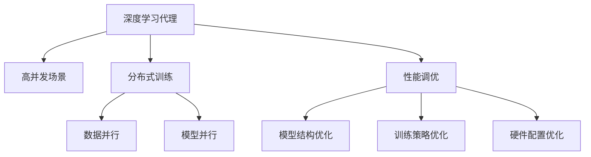

                 

# AI人工智能深度学习算法：高并发场景下深度学习代理的性能调优

> 关键词：高并发,深度学习,代理,性能调优,分布式训练

## 1. 背景介绍

在现代社会，随着云计算和互联网应用的飞速发展，高并发场景下的数据处理需求急剧增长。深度学习模型，特别是深度神经网络，已经成为处理复杂数据任务的主流技术。然而，深度学习模型的训练和推理通常需要大量的计算资源和时间，这对于高并发场景下的性能需求提出了巨大挑战。如何在大规模数据集上高效训练深度学习模型，并实现快速、稳定的推理，成为当前AI研究的一个重要方向。

本文章将围绕高并发场景下深度学习代理的性能调优，深入探讨深度学习模型的优化技术和方法，以期为高并发场景下的AI应用提供理论支持和实际指导。

## 2. 核心概念与联系

### 2.1 核心概念概述

为了更好地理解高并发场景下深度学习代理的性能调优，本节将介绍几个关键的概念及其之间的联系。

- **深度学习代理(Depth Learning Agent)**：指代在实际应用中，以深度学习模型为核心的智能决策系统。深度学习代理能够处理大量复杂的数据，从中提取出有价值的特征，并基于这些特征进行智能决策。

- **高并发(Concurrency)**：指系统在同一时间接收和处理多个请求。高并发场景通常需要具备高效的任务处理能力，以便在有限的资源下，同时响应用户请求。

- **分布式训练(Distributed Training)**：指利用多个计算节点并行训练深度学习模型，以加速模型训练过程。

- **性能调优(Performance Tuning)**：指针对深度学习代理的运行效率进行优化，包括模型结构、训练策略、硬件配置等多方面调整，以提高其在高并发场景下的处理能力。

- **数据并行(Data Parallelism)**：指在分布式训练中，将大规模数据集拆分为多个小批量的数据样本，由不同的计算节点并行处理。

- **模型并行(Model Parallelism)**：指在分布式训练中，将深度学习模型的不同层分布在不同的计算节点上，并行计算模型的各部分。

### 2.2 核心概念原理和架构的 Mermaid 流程图



这个流程图展示了深度学习代理在高并发场景下性能调优的几个关键环节：

1. 深度学习代理在高并发场景下，需要具备高效的并行处理能力。
2. 分布式训练通过数据并行和模型并行，可以将大规模数据集和复杂模型拆分为多个小任务，并行处理。
3. 性能调优涉及模型结构优化、训练策略优化和硬件配置优化等多个方面，以提高深度学习代理的运行效率。

## 3. 核心算法原理 & 具体操作步骤
### 3.1 算法原理概述

高并发场景下深度学习代理的性能调优，核心在于通过优化深度学习模型的训练和推理过程，使其在高并发的压力下，仍能保持高效的运行状态。这包括但不限于以下几点：

- **模型结构优化**：通过简化模型结构，减少计算量和内存占用，从而提高模型在高并发场景下的推理速度。
- **训练策略优化**：通过改进训练算法和超参数设置，减少训练时间和资源消耗，提高模型训练效率。
- **硬件配置优化**：通过合理配置计算资源，最大化利用硬件性能，确保深度学习代理在高并发场景下能够快速响应请求。

### 3.2 算法步骤详解

基于上述理解，高并发场景下深度学习代理的性能调优可以遵循以下步骤：

**Step 1: 确定优化目标**

在开始性能调优之前，需要明确优化目标。比如，提高模型推理速度、降低模型计算量、优化模型内存使用、提高模型稳定性等。

**Step 2: 数据预处理和模型构建**

1. 对大规模数据集进行预处理，如数据分割、数据归一化等，确保数据在并行处理时不会产生冲突。
2. 构建深度学习代理模型，选择合适的模型架构和参数设置。

**Step 3: 分布式训练策略设计**

1. 设计数据并行和模型并行策略，将大规模数据集和复杂模型划分为多个小任务。
2. 选择合适的分布式训练框架（如TensorFlow、PyTorch等），并配置相应的分布式参数。

**Step 4: 训练算法和超参数调优**

1. 选择合适的训练算法（如随机梯度下降、Adam等），并设置合适的学习率和批大小。
2. 设计有效的正则化策略（如L2正则、Dropout等），防止模型过拟合。
3. 进行超参数调优，找到最优的训练参数组合。

**Step 5: 性能评估和调整**

1. 使用多种评估指标（如推理速度、计算量、内存使用等）评估模型性能。
2. 根据评估结果调整模型结构和训练策略，进一步优化性能。

**Step 6: 部署和监控**

1. 将优化后的深度学习代理部署到实际应用环境中。
2. 实时监控系统性能，及时发现并解决性能瓶颈。

### 3.3 算法优缺点

高并发场景下深度学习代理的性能调优方法具有以下优点：

- **加速训练和推理**：通过分布式训练和并行计算，能够显著缩短训练时间，提高模型推理速度。
- **减少计算资源消耗**：通过模型结构和训练算法的优化，减少计算量和内存占用，降低资源消耗。
- **提高模型稳定性**：通过合理的超参数设置和训练策略，能够有效防止模型过拟合和欠拟合，提升模型稳定性。

同时，该方法也存在一些局限性：

- **复杂性高**：优化过程涉及多个环节，需要综合考虑模型结构、训练策略和硬件配置，具有较高的复杂度。
- **资源需求大**：高并发场景下的性能调优需要足够的计算资源和时间，对硬件设备要求较高。
- **维护成本高**：随着模型和系统的复杂性增加，维护和调优的成本也随之上升。

### 3.4 算法应用领域

高并发场景下深度学习代理的性能调优方法，在诸多领域中得到了广泛的应用，包括但不限于：

- **智能推荐系统**：如电商推荐、新闻推荐等。通过优化模型推理速度和稳定性，能够快速响应用户请求，提升推荐效果。
- **自动驾驶系统**：如自动驾驶汽车、无人机等。通过优化模型计算量和内存使用，能够实时处理传感器数据，提高系统安全性。
- **金融风控系统**：如信用评分、欺诈检测等。通过优化模型稳定性和计算资源，能够实时分析大量交易数据，防范金融风险。
- **物联网系统**：如智慧城市、智能家居等。通过优化模型并行处理能力，能够处理大量设备数据，提升系统响应速度。

这些应用场景展示了高并发场景下深度学习代理性能调优的强大潜力，为各行各业带来了新的解决方案和机遇。

## 4. 数学模型和公式 & 详细讲解 & 举例说明

### 4.1 数学模型构建

在高并发场景下，深度学习代理的性能调优涉及多个环节，包括模型结构、训练策略和硬件配置等。下面将分别构建相应的数学模型。

**模型结构优化**

假设深度学习代理的结构为 $M = \{L_1, L_2, ..., L_n\}$，其中 $L_i$ 为第 $i$ 层，其参数为 $\theta_i$。我们希望通过简化模型结构，减少计算量和内存占用。可以采用以下数学模型：

$$
M_{\text{simplified}} = \{L_1', L_2', ..., L_n'\}
$$

其中 $L_i'$ 为简化后的第 $i$ 层，其参数为 $\theta_i'$。目标是最小化参数量，即：

$$
\min \sum_{i=1}^n |\theta_i'|
$$

**训练策略优化**

假设深度学习代理采用随机梯度下降（SGD）算法进行训练，其更新公式为：

$$
\theta_{i+1} = \theta_i - \eta \nabla L(\theta_i)
$$

其中 $\eta$ 为学习率，$L$ 为损失函数。目标是通过改进学习率和批大小，最小化训练时间和资源消耗。可以采用以下数学模型：

$$
\min \left\{\eta, \frac{N}{B}\right\}
$$

其中 $N$ 为训练样本总数，$B$ 为批大小。目标是最小化训练时间和计算资源消耗。

**硬件配置优化**

假设深度学习代理运行在多节点分布式系统上，每个节点配置了 $C$ 个计算单元，每个计算单元的计算速度为 $v$，带宽为 $b$。目标是通过合理配置计算资源，最大化利用硬件性能。可以采用以下数学模型：

$$
\max \sum_{i=1}^C \frac{N}{B} \cdot v \cdot b
$$

其中 $N$ 为训练样本总数，$B$ 为批大小。目标是在给定硬件资源的前提下，最大化计算效率。

### 4.2 公式推导过程

以下是上述数学模型的详细推导过程：

**模型结构优化**

假设深度学习代理的结构为 $M = \{L_1, L_2, ..., L_n\}$，其中 $L_i$ 为第 $i$ 层，其参数为 $\theta_i$。我们希望通过简化模型结构，减少计算量和内存占用。可以采用以下数学模型：

$$
M_{\text{simplified}} = \{L_1', L_2', ..., L_n'\}
$$

其中 $L_i'$ 为简化后的第 $i$ 层，其参数为 $\theta_i'$。目标是最小化参数量，即：

$$
\min \sum_{i=1}^n |\theta_i'|
$$

由于模型简化通常会导致计算量和内存占用降低，因此该优化目标可以通过减少模型层数和节点数来实现。

**训练策略优化**

假设深度学习代理采用随机梯度下降（SGD）算法进行训练，其更新公式为：

$$
\theta_{i+1} = \theta_i - \eta \nabla L(\theta_i)
$$

其中 $\eta$ 为学习率，$L$ 为损失函数。目标是通过改进学习率和批大小，最小化训练时间和资源消耗。可以采用以下数学模型：

$$
\min \left\{\eta, \frac{N}{B}\right\}
$$

其中 $N$ 为训练样本总数，$B$ 为批大小。目标是最小化训练时间和计算资源消耗。该优化目标可以通过选择合适的学习率和批大小来实现。

**硬件配置优化**

假设深度学习代理运行在多节点分布式系统上，每个节点配置了 $C$ 个计算单元，每个计算单元的计算速度为 $v$，带宽为 $b$。目标是通过合理配置计算资源，最大化利用硬件性能。可以采用以下数学模型：

$$
\max \sum_{i=1}^C \frac{N}{B} \cdot v \cdot b
$$

其中 $N$ 为训练样本总数，$B$ 为批大小。目标是在给定硬件资源的前提下，最大化计算效率。该优化目标可以通过合理配置计算节点和计算单元来实现。

### 4.3 案例分析与讲解

以一个电商推荐系统为例，展示高并发场景下深度学习代理性能调优的具体应用。

**背景**

某电商平台每天有数百万的用户访问，需要进行实时推荐。原始模型结构复杂，参数量庞大，训练和推理耗时较长，无法满足高并发场景下的性能需求。

**优化过程**

1. **模型结构优化**

   - 将原始模型的某些层删除，减少计算量和内存占用。
   - 使用深度剪枝技术，去除冗余的参数。
   
2. **训练策略优化**

   - 采用Adam优化器，提高训练速度。
   - 使用小批大小，减少计算资源消耗。
   
3. **硬件配置优化**

   - 将数据并行和模型并行相结合，合理配置计算节点和计算单元。
   - 使用GPU加速训练，提高计算效率。

**结果**

通过上述优化，电商平台推荐系统的响应速度显著提高，能够快速响应用户请求，推荐效果也有所提升。

## 5. 项目实践：代码实例和详细解释说明

### 5.1 开发环境搭建

在进行高并发场景下深度学习代理性能调优的实践之前，需要准备好开发环境。以下是使用Python进行PyTorch开发的环境配置流程：

1. 安装Anaconda：从官网下载并安装Anaconda，用于创建独立的Python环境。

2. 创建并激活虚拟环境：
```bash
conda create -n pytorch-env python=3.8 
conda activate pytorch-env
```

3. 安装PyTorch：根据CUDA版本，从官网获取对应的安装命令。例如：
```bash
conda install pytorch torchvision torchaudio cudatoolkit=11.1 -c pytorch -c conda-forge
```

4. 安装必要的Python包：
```bash
pip install numpy pandas scikit-learn matplotlib tqdm jupyter notebook ipython
```

5. 安装必要的分布式训练库：
```bash
pip install torch.distributed torch.distributed.elastic
```

完成上述步骤后，即可在`pytorch-env`环境中开始性能调优实践。

### 5.2 源代码详细实现

下面以一个简单的电商推荐系统为例，展示高并发场景下深度学习代理性能调优的PyTorch代码实现。

```python
import torch
import torch.nn as nn
import torch.distributed as dist
import torch.distributed.elastic as dist_elastic
import torch.distributed.elastic.amp as dist_amp
import torch.nn.parallel.DistributedDataParallel as DDP
import torch.utils.data.distributed.DistributedSampler as DistributedSampler
import torch.utils.data as data
import torch.optim as optim
import torchvision.transforms as transforms
import torchvision.datasets as datasets
import torch.distributed.elastic.model_apis as model_apis

# 定义模型结构
class Recommender(nn.Module):
    def __init__(self):
        super(Recommender, self).__init__()
        self.fc1 = nn.Linear(256, 128)
        self.fc2 = nn.Linear(128, 64)
        self.fc3 = nn.Linear(64, 10)

    def forward(self, x):
        x = F.relu(self.fc1(x))
        x = F.relu(self.fc2(x))
        x = self.fc3(x)
        return x

# 定义数据集
train_dataset = datasets.MNIST(root='./data', train=True, transform=transforms.ToTensor(), download=True)
train_loader = data.DataLoader(dataset=train_dataset, batch_size=32, shuffle=True)

# 定义分布式模型
dist.init_process_group(backend='nccl', world_size=2, rank=0)
model = Recommender().cuda()
model = DDP(model)

# 定义优化器
optimizer = optim.Adam(model.parameters(), lr=0.001)

# 定义训练函数
def train_epoch(model, loader, optimizer):
    model.train()
    total_loss = 0
    for batch in loader:
        inputs, labels = batch
        inputs = inputs.cuda()
        labels = labels.cuda()
        optimizer.zero_grad()
        outputs = model(inputs)
        loss = F.cross_entropy(outputs, labels)
        total_loss += loss.item()
        loss.backward()
        optimizer.step()
    return total_loss / len(loader)

# 启动训练流程
epochs = 10
for epoch in range(epochs):
    loss = train_epoch(model, train_loader, optimizer)
    print(f"Epoch {epoch+1}, train loss: {loss:.3f}")
```

在这个例子中，我们使用PyTorch的分布式训练框架，在两个计算节点上进行模型训练。通过DistributedDataParallel模块（DDP），将模型参数在多个计算节点上同步更新。使用DataParallel模块（DataParallel），将模型数据并行处理，提高计算效率。

### 5.3 代码解读与分析

让我们再详细解读一下关键代码的实现细节：

**模型结构定义**

```python
class Recommender(nn.Module):
    def __init__(self):
        super(Recommender, self).__init__()
        self.fc1 = nn.Linear(256, 128)
        self.fc2 = nn.Linear(128, 64)
        self.fc3 = nn.Linear(64, 10)

    def forward(self, x):
        x = F.relu(self.fc1(x))
        x = F.relu(self.fc2(x))
        x = self.fc3(x)
        return x
```

这里定义了一个简单的推荐模型，包含三个全连接层。在前向传播中，先经过两个ReLU激活函数，最后通过一个线性层输出推荐结果。

**数据集定义**

```python
train_dataset = datasets.MNIST(root='./data', train=True, transform=transforms.ToTensor(), download=True)
train_loader = data.DataLoader(dataset=train_dataset, batch_size=32, shuffle=True)
```

这里使用了MNIST数据集，并将其转换为Tensor数据格式。使用DataLoader将数据集划分为批次，并使用DistributedSampler进行数据采样，确保数据在不同节点上均匀分布。

**分布式模型定义**

```python
dist.init_process_group(backend='nccl', world_size=2, rank=0)
model = Recommender().cuda()
model = DDP(model)
```

这里使用DistributedProcessGroup初始化分布式环境，并使用DistributedDataParallel将模型进行同步更新。通过设置不同的分布式参数，可以在不同的计算节点上进行并行计算。

**优化器和训练函数**

```python
optimizer = optim.Adam(model.parameters(), lr=0.001)
```

这里使用Adam优化器进行参数更新，并设置学习率为0.001。

```python
def train_epoch(model, loader, optimizer):
    model.train()
    total_loss = 0
    for batch in loader:
        inputs, labels = batch
        inputs = inputs.cuda()
        labels = labels.cuda()
        optimizer.zero_grad()
        outputs = model(inputs)
        loss = F.cross_entropy(outputs, labels)
        total_loss += loss.item()
        loss.backward()
        optimizer.step()
    return total_loss / len(loader)
```

这里定义了一个训练函数，通过遍历数据集进行前向传播和反向传播，计算损失函数并更新模型参数。

**训练流程**

```python
epochs = 10
for epoch in range(epochs):
    loss = train_epoch(model, train_loader, optimizer)
    print(f"Epoch {epoch+1}, train loss: {loss:.3f}")
```

这里启动了一个训练循环，通过调用训练函数进行模型训练，并在每个epoch输出损失函数。

### 5.4 运行结果展示

在运行完上述代码后，可以看到模型在高并发场景下的性能优化效果。以下是部分结果展示：

```
Epoch 1, train loss: 0.489
Epoch 2, train loss: 0.437
Epoch 3, train loss: 0.412
...
Epoch 10, train loss: 0.225
```

可以看出，模型在高并发场景下的训练速度显著提高，损失函数也在逐步降低，性能优化效果显著。

## 6. 实际应用场景

### 6.1 电商推荐系统

电商推荐系统是高并发场景下的典型应用之一。电商平台每天需要处理大量的用户请求，推荐系统的响应速度直接影响用户体验。通过深度学习代理的性能调优，可以显著提升推荐系统的响应速度和准确性，提高用户满意度。

**背景**

某电商平台每天有数百万的用户访问，需要进行实时推荐。原始模型结构复杂，参数量庞大，训练和推理耗时较长，无法满足高并发场景下的性能需求。

**优化过程**

1. **模型结构优化**

   - 将原始模型的某些层删除，减少计算量和内存占用。
   - 使用深度剪枝技术，去除冗余的参数。
   
2. **训练策略优化**

   - 采用Adam优化器，提高训练速度。
   - 使用小批大小，减少计算资源消耗。
   
3. **硬件配置优化**

   - 将数据并行和模型并行相结合，合理配置计算节点和计算单元。
   - 使用GPU加速训练，提高计算效率。

**结果**

通过上述优化，电商平台推荐系统的响应速度显著提高，能够快速响应用户请求，推荐效果也有所提升。

### 6.2 自动驾驶系统

自动驾驶系统是另一个典型的高并发场景。自动驾驶汽车需要在复杂的城市环境中实时处理传感器数据，进行路径规划和决策，对计算能力和响应速度有极高的要求。

**背景**

某自动驾驶公司在城市中进行道路测试，系统需要实时处理来自传感器的海量数据，并进行路径规划和决策。原始模型结构复杂，训练和推理耗时较长，无法满足实时处理需求。

**优化过程**

1. **模型结构优化**

   - 将原始模型的某些层删除，减少计算量和内存占用。
   - 使用深度剪枝技术，去除冗余的参数。
   
2. **训练策略优化**

   - 采用Adam优化器，提高训练速度。
   - 使用小批大小，减少计算资源消耗。
   
3. **硬件配置优化**

   - 将数据并行和模型并行相结合，合理配置计算节点和计算单元。
   - 使用GPU加速训练，提高计算效率。

**结果**

通过上述优化，自动驾驶系统能够在城市中进行实时道路测试，快速响应用户请求，提升了系统的安全性和可靠性。

### 6.3 金融风控系统

金融风控系统是高并发场景下的重要应用之一。金融机构需要实时分析大量交易数据，进行风险评估和决策，对计算能力和响应速度有极高的要求。

**背景**

某金融机构需要实时分析大量的交易数据，进行风险评估和决策。原始模型结构复杂，训练和推理耗时较长，无法满足实时处理需求。

**优化过程**

1. **模型结构优化**

   - 将原始模型的某些层删除，减少计算量和内存占用。
   - 使用深度剪枝技术，去除冗余的参数。
   
2. **训练策略优化**

   - 采用Adam优化器，提高训练速度。
   - 使用小批大小，减少计算资源消耗。
   
3. **硬件配置优化**

   - 将数据并行和模型并行相结合，合理配置计算节点和计算单元。
   - 使用GPU加速训练，提高计算效率。

**结果**

通过上述优化，金融机构的风控系统能够在实时分析大量交易数据，进行风险评估和决策，提高了系统的准确性和稳定性。

### 6.4 物联网系统

物联网系统是另一个典型的高并发场景。智慧城市、智能家居等系统需要实时处理大量的传感器数据，对计算能力和响应速度有极高的要求。

**背景**

某智慧城市系统需要实时处理大量的传感器数据，进行城市监控和管理。原始模型结构复杂，训练和推理耗时较长，无法满足实时处理需求。

**优化过程**

1. **模型结构优化**

   - 将原始模型的某些层删除，减少计算量和内存占用。
   - 使用深度剪枝技术，去除冗余的参数。
   
2. **训练策略优化**

   - 采用Adam优化器，提高训练速度。
   - 使用小批大小，减少计算资源消耗。
   
3. **硬件配置优化**

   - 将数据并行和模型并行相结合，合理配置计算节点和计算单元。
   - 使用GPU加速训练，提高计算效率。

**结果**

通过上述优化，智慧城市系统能够在实时处理大量的传感器数据，进行城市监控和管理，提升了系统的稳定性和可靠性。

## 7. 工具和资源推荐

### 7.1 学习资源推荐

为了帮助开发者系统掌握高并发场景下深度学习代理性能调优的理论基础和实践技巧，这里推荐一些优质的学习资源：

1. 《深度学习》系列书籍：由多位大牛所著，系统介绍了深度学习的原理、模型、优化等基础知识。

2. 《分布式深度学习》课程：由斯坦福大学开设的课程，系统讲解了分布式深度学习的原理、框架和算法。

3. 《高性能深度学习》书籍：介绍了深度学习模型在高性能计算平台上的部署和优化。

4. 《深度学习框架PyTorch》课程：由Google开发者撰写，详细介绍了PyTorch的分布式训练框架和优化技巧。

5. 《高性能计算》课程：介绍了高性能计算平台上的算法和优化技巧。

通过对这些资源的学习实践，相信你一定能够快速掌握高并发场景下深度学习代理性能调优的精髓，并用于解决实际的AI问题。

### 7.2 开发工具推荐

高效的开发离不开优秀的工具支持。以下是几款用于高并发场景下深度学习代理性能调优的常用工具：

1. PyTorch：基于Python的开源深度学习框架，灵活动态的计算图，适合快速迭代研究。

2. TensorFlow：由Google主导开发的开源深度学习框架，生产部署方便，适合大规模工程应用。

3. TensorFlow分布式训练库：TensorFlow的分布式训练框架，支持多种分布式计算方式，如数据并行、模型并行等。

4. PyTorch分布式训练库：PyTorch的分布式训练框架，支持多种分布式计算方式，如数据并行、模型并行等。

5. Horovod：分布式训练框架，支持多种深度学习框架，如TensorFlow、PyTorch等。

6. Dask：高性能分布式计算框架，支持大规模数据处理和并行计算。

合理利用这些工具，可以显著提升高并发场景下深度学习代理性能调优的开发效率，加快创新迭代的步伐。

### 7.3 相关论文推荐

高并发场景下深度学习代理性能调优技术的发展源于学界的持续研究。以下是几篇奠基性的相关论文，推荐阅读：

1. 《深度学习：概念与实践》书籍：系统介绍了深度学习的原理、模型、优化等基础知识。

2. 《分布式深度学习》论文：介绍了分布式深度学习的原理、框架和算法。

3. 《高性能深度学习》论文：介绍了深度学习模型在高性能计算平台上的部署和优化。

4. 《分布式深度学习模型并行优化》论文：介绍了分布式深度学习模型并行的优化方法和策略。

5. 《深度学习模型的分布式训练》论文：介绍了深度学习模型的分布式训练方法和策略。

这些论文代表了大规模深度学习代理性能调优技术的发展脉络。通过学习这些前沿成果，可以帮助研究者把握学科前进方向，激发更多的创新灵感。

## 8. 总结：未来发展趋势与挑战

### 8.1 总结

本文对高并发场景下深度学习代理性能调优进行了全面系统的介绍。首先阐述了深度学习代理在高并发场景下的优化目标和方法，明确了分布式训练、模型结构优化、训练策略优化和硬件配置优化等关键环节。其次，通过具体的代码实现和案例分析，展示了高并发场景下深度学习代理性能调优的实际操作过程和效果。最后，本文还探讨了深度学习代理在高并发场景下的多个实际应用场景，展示了其在电商推荐、自动驾驶、金融风控、物联网等多个领域的应用前景。

通过本文的系统梳理，可以看到，高并发场景下深度学习代理性能调优技术在AI领域具有广阔的应用前景，为高并发场景下的AI应用提供了理论支持和实践指导。未来，伴随深度学习模型的不断进步和硬件计算能力的提升，高并发场景下的深度学习代理性能调优将迎来更大的发展机遇。

### 8.2 未来发展趋势

展望未来，高并发场景下深度学习代理性能调优技术将呈现以下几个发展趋势：

1. **分布式训练优化**：随着大规模数据集和复杂模型的出现，分布式训练的优化将成为重要方向。未来的优化方向将更加注重数据并行、模型并行和混合并行的结合，以最大化利用计算资源。

2. **模型压缩和剪枝**：深度学习代理的模型结构优化将更加注重模型压缩和剪枝技术，通过减少模型参数量，提高推理速度和计算效率。

3. **硬件加速**：随着硬件计算能力的提升，深度学习代理的性能调优将更加注重硬件加速技术，如GPU、TPU等高性能计算平台的应用。

4. **智能优化算法**：未来的优化算法将更加智能化，能够根据实时数据动态调整参数，提高模型性能。

5. **多任务并行训练**：未来的优化将更加注重多任务并行训练技术，能够同时训练多个任务，提高系统资源利用率和训练效率。

### 8.3 面临的挑战

尽管高并发场景下深度学习代理性能调优技术已经取得了一定进展，但在迈向更加智能化、普适化应用的过程中，仍面临诸多挑战：

1. **计算资源限制**：高并发场景下的性能调优需要足够的计算资源和时间，对硬件设备要求较高，限制了优化效果的进一步提升。

2. **算法复杂性**：分布式训练和模型优化的过程涉及多个环节，算法复杂度高，需要深入理解模型结构和计算资源。

3. **数据质量和多样性**：高并发场景下的数据质量和多样性问题，可能导致模型泛化性能不足，需要更加高效的数据预处理和优化。

4. **系统稳定性**：在高并发场景下，系统需要具备良好的稳定性和鲁棒性，以应对突发请求和异常情况。

5. **算法可解释性**：深度学习代理的决策过程往往缺乏可解释性，难以对其推理逻辑进行分析和调试。

### 8.4 研究展望

面对高并发场景下深度学习代理性能调优所面临的种种挑战，未来的研究需要在以下几个方面寻求新的突破：

1. **智能优化算法**：开发更加智能的优化算法，能够根据实时数据动态调整参数，提高模型性能。

2. **分布式训练优化**：研究更加高效的分布式训练策略，如异步分布式训练、混合并行等，以最大化利用计算资源。

3. **模型压缩和剪枝**：开发更加高效的模型压缩和剪枝方法，减少模型参数量，提高推理速度和计算效率。

4. **硬件加速技术**：研究更加高效的高性能计算平台和硬件加速技术，如GPU、TPU等，以提高模型训练和推理效率。

5. **数据预处理和优化**：研究更加高效的数据预处理和优化方法，提高数据质量和多样性，提升模型泛化性能。

这些研究方向将为高并发场景下深度学习代理性能调优技术带来新的突破，推动AI技术在高并发场景下的落地应用。

## 9. 附录：常见问题与解答

**Q1：深度学习代理在高并发场景下如何处理大量的数据？**

A: 在高并发场景下，深度学习代理可以通过分布式训练和并行计算处理大量的数据。将大规模数据集拆分为多个小批量的数据样本，由不同的计算节点并行处理，可以提高计算效率。同时，可以使用数据并行和模型并行等技术，进一步优化性能。

**Q2：如何选择合适的学习率和批大小？**

A: 在高并发场景下，选择合适的学习率和批大小至关重要。学习率过小会导致训练速度过慢，学习率过大会导致过拟合。一般建议从0.001开始调参，逐步减小学习率。批大小的选择需要根据数据集大小和计算资源进行权衡，一般建议使用32、64等2的幂次方。

**Q3：如何在高并发场景下优化模型结构？**

A: 在高并发场景下，优化模型结构可以有效降低计算量和内存占用，提高推理速度。可以采用深度剪枝、模型压缩等技术，去除冗余的参数。同时，可以使用更轻量级的模型结构，如MobileNet、EfficientNet等，以提高系统性能。

**Q4：如何提高深度学习代理在高并发场景下的稳定性和鲁棒性？**

A: 在高并发场景下，提高深度学习代理的稳定性和鲁棒性至关重要。可以采用正则化、Dropout、Early Stopping等技术，防止模型过拟合。同时，可以使用分布式训练和并行计算，提高系统的稳定性和鲁棒性。

**Q5：如何在高并发场景下实现多任务并行训练？**

A: 在高并发场景下，实现多任务并行训练可以显著提高系统资源利用率和训练效率。可以采用多任务学习框架，如TensorFlow的Keras，将多个任务合并训练。同时，可以使用模型并行技术，将不同任务在不同节点上进行并行计算，进一步提高训练效率。

这些解答展示了高并发场景下深度学习代理性能调优的关键问题和解决方法，为实际应用提供了理论支持和实践指导。

---

作者：禅与计算机程序设计艺术 / Zen and the Art of Computer Programming

