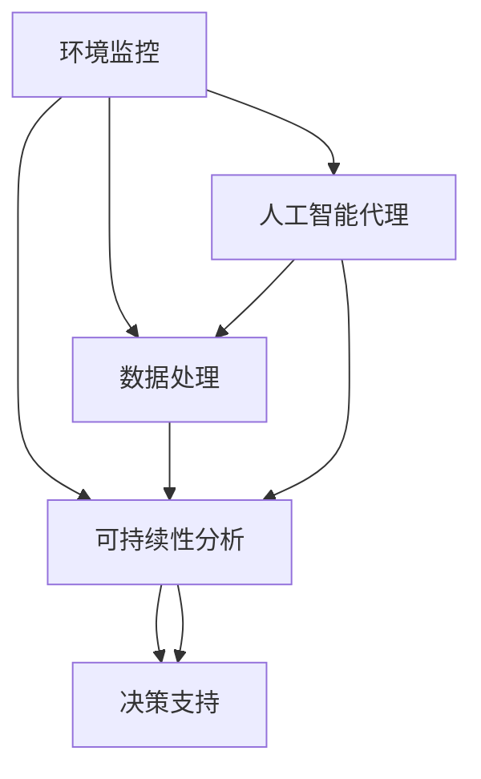

                 

# AI代理在环境监控与可持续性分析的工作流应用

> 关键词：人工智能, 环境监测, 可持续性分析, 工作流管理, 数据处理, 决策支持

## 1. 背景介绍

随着环境问题的日益严峻，如何有效监控和管理环境资源，提升可持续性成为了全球共同关注的热点。AI技术的应用为这一领域提供了新的突破点。特别是人工智能代理，通过其智能化的数据分析、决策支持能力，在环境监控与可持续性分析中扮演了重要角色。本文将深入探讨AI代理在环境监控与可持续性分析中的应用，分析其工作流流程，并提出具体的实施策略。

## 2. 核心概念与联系

### 2.1 核心概念概述

为更好地理解AI代理在环境监控与可持续性分析中的应用，本节将介绍几个密切相关的核心概念：

- **环境监控**：使用传感器、遥感技术等手段，对大气、水体、土壤、生态等环境要素进行实时监测和数据分析。
- **可持续性分析**：基于环境监控数据，评估环境资源的利用状况，预测其未来趋势，并提出相应的可持续性管理建议。
- **人工智能代理**：通过机器学习算法和自然语言处理技术，构建能够模拟人类智能行为的系统，执行环境监控与可持续性分析的各项任务。
- **工作流管理**：定义环境监控与可持续性分析任务间的关系，通过管理工具实现任务的有序执行和资源优化。
- **数据处理**：对环境监控数据进行清洗、转换、归一化等预处理操作，为后续分析提供可靠的数据基础。
- **决策支持**：结合环境监控数据和可持续性分析结果，提供科学的决策建议，指导环境资源的合理利用。

这些概念之间的逻辑关系可以通过以下Mermaid流程图来展示：



这个流程图展示了从环境监控到决策支持的完整流程，其中AI代理贯穿始终，负责数据分析、处理和决策支持。

## 3. 核心算法原理 & 具体操作步骤

### 3.1 算法原理概述

AI代理在环境监控与可持续性分析中的应用，主要依赖于以下几个核心算法：

- **监督学习**：用于训练AI代理，使其能够识别和分类环境数据中的关键特征。
- **迁移学习**：利用预训练模型，将已有领域的知识迁移到新的环境监控与可持续性分析任务中，提高模型的泛化能力。
- **强化学习**：通过模拟环境监控和可持续性分析中的决策场景，训练AI代理进行优化决策。
- **自然语言处理(NLP)**：处理和分析环境监控数据的文本信息，如环境报告、政策法规等。

这些算法协同工作，实现了从数据采集到决策支持的完整工作流。

### 3.2 算法步骤详解

AI代理在环境监控与可持续性分析中的应用，通常包括以下几个关键步骤：

**Step 1: 数据采集与预处理**
- 使用传感器、遥感设备等技术，采集大气、水体、土壤、生态等环境数据。
- 对采集到的数据进行清洗、去噪、归一化等预处理操作，确保数据质量。

**Step 2: 数据存储与管理**
- 将处理后的环境数据存储在数据库或数据湖中，使用分布式存储系统（如Hadoop、Spark）进行管理。
- 使用数据可视化工具（如Tableau、Power BI）展示环境数据的实时变化。

**Step 3: 特征提取与建模**
- 使用监督学习算法（如随机森林、SVM）或迁移学习算法（如BERT）提取数据中的关键特征。
- 构建机器学习模型或深度学习模型（如CNN、RNN、Transformer），对环境数据进行建模。

**Step 4: 智能分析与决策支持**
- 使用强化学习算法（如Q-Learning、SARSA）优化决策策略，进行环境资源的合理分配和利用。
- 结合自然语言处理技术（如BERT、GPT），对环境报告、政策法规等文本信息进行分析，提供决策依据。

**Step 5: 结果展示与反馈**
- 使用可视化工具展示环境监控数据、可持续性分析结果和决策建议。
- 根据反馈调整模型参数，持续优化AI代理的性能。

### 3.3 算法优缺点

AI代理在环境监控与可持续性分析中的应用，具有以下优点：

- **自动化处理**：能够自动化处理大量环境数据，提高处理效率和准确性。
- **泛化能力强**：通过迁移学习和预训练技术，能够适应不同领域的环境监控与可持续性分析任务。
- **决策支持**：结合自然语言处理和机器学习，提供科学的决策依据，提升管理效率。

同时，该方法也存在一些局限性：

- **数据依赖性强**：依赖于高质量的环境监控数据，数据缺失或不准确会影响模型效果。
- **模型复杂度高**：构建深度学习模型需要较高的计算资源和时间成本。
- **可解释性不足**：复杂的模型结构导致其决策过程难以解释，缺乏透明性。
- **隐私和安全问题**：环境监控数据可能包含敏感信息，需注意隐私保护和数据安全。

尽管存在这些局限性，但AI代理在环境监控与可持续性分析中的应用仍然具有巨大的潜力，为环境资源的可持续利用提供了新的技术手段。

### 3.4 算法应用领域

AI代理在环境监控与可持续性分析中的应用，可以广泛应用于以下领域：

- **水资源管理**：通过监控河流、湖泊的水质、水量，优化水资源配置，提升水资源利用效率。
- **大气污染监测**：监测大气中的PM2.5、SO2、NOx等污染物，评估其对健康和环境的影响。
- **生态保护与修复**：通过分析森林覆盖率、生物多样性等数据，评估生态系统的健康状况，指导生态修复工程。
- **气候变化研究**：结合气象数据和地表温度数据，预测气候变化趋势，制定应对策略。
- **可再生能源管理**：监测太阳能、风能等可再生能源的生成情况，优化资源配置，提升能源利用效率。

## 4. 数学模型和公式 & 详细讲解  
### 4.1 数学模型构建

AI代理在环境监控与可持续性分析中的应用，涉及到多种数学模型和算法。以下是其中几个核心模型的数学构建：

**线性回归模型**：
- 用于预测环境数据（如水质、气温等）的未来趋势。
- 数学表达式为：$\hat{y} = \beta_0 + \beta_1 x_1 + \beta_2 x_2 + \ldots + \beta_n x_n + \epsilon$
- 其中，$y$ 为预测值，$x_i$ 为输入特征，$\beta_i$ 为系数，$\epsilon$ 为误差项。

**随机森林模型**：
- 用于分类环境数据（如水质等级、空气污染等级等）。
- 通过构建多棵决策树，进行特征的随机采样和分裂，减少模型的过拟合风险。
- 数学表达式为：$\hat{y} = \sum_{i=1}^{n} w_i f_i(x)$
- 其中，$f_i(x)$ 为第 $i$ 棵决策树的预测结果，$w_i$ 为第 $i$ 棵树的权重。

**卷积神经网络（CNN）**：
- 用于处理环境数据中的图像信息（如遥感影像）。
- 通过卷积层、池化层、全连接层等操作，提取图像中的特征，进行分类或回归。
- 数学表达式为：$y = \sigma(Wx + b)$
- 其中，$W$ 为权重矩阵，$b$ 为偏置向量，$\sigma$ 为激活函数。

**强化学习模型**：
- 用于优化环境监控与可持续性分析中的决策策略。
- 通过模拟环境监控和可持续性分析中的决策场景，使用Q-Learning算法，学习最优策略。
- 数学表达式为：$Q(s, a) = r + \gamma \max_{a'} Q(s', a')$
- 其中，$s$ 为当前状态，$a$ 为当前动作，$r$ 为即时奖励，$\gamma$ 为折扣因子。

### 4.2 公式推导过程

以下是几个核心算法的公式推导过程：

**线性回归模型的推导**：
- 假设已知数据集 $(x_i, y_i)$，其中 $x_i = (x_{i1}, x_{i2}, \ldots, x_{in})$，$y_i$ 为环境数据。
- 线性回归模型通过最小化误差项 $\epsilon$，进行参数 $\beta$ 的估计。
- 推导过程为：$\min_{\beta} \sum_{i=1}^n (y_i - \hat{y}_i)^2$
- 通过求解该最小化问题，得到参数 $\beta$ 的估计值。

**随机森林模型的推导**：
- 随机森林通过构建多棵决策树，对输入数据进行分类。
- 假设已知数据集 $(x_i, y_i)$，其中 $x_i = (x_{i1}, x_{i2}, \ldots, x_{in})$，$y_i$ 为分类标签。
- 推导过程为：$\hat{y} = \sum_{i=1}^{n} w_i f_i(x)$
- 其中，$f_i(x)$ 为第 $i$ 棵决策树的预测结果，$w_i$ 为第 $i$ 棵树的权重。

**卷积神经网络的推导**：
- 卷积神经网络通过卷积层、池化层、全连接层等操作，提取图像特征。
- 假设已知图像数据集 $(x_i, y_i)$，其中 $x_i$ 为输入图像，$y_i$ 为分类标签。
- 推导过程为：$y = \sigma(Wx + b)$
- 其中，$W$ 为权重矩阵，$b$ 为偏置向量，$\sigma$ 为激活函数。

**强化学习模型的推导**：
- 强化学习通过Q-Learning算法，优化决策策略。
- 假设已知环境状态 $s$，动作 $a$，即时奖励 $r$，下一个状态 $s'$。
- 推导过程为：$Q(s, a) = r + \gamma \max_{a'} Q(s', a')$
- 其中，$s$ 为当前状态，$a$ 为当前动作，$r$ 为即时奖励，$\gamma$ 为折扣因子。

### 4.3 案例分析与讲解

以水资源管理为例，介绍AI代理在环境监控与可持续性分析中的应用：

**数据采集与预处理**：
- 使用传感器监测河流的水质、水量、流速等数据。
- 对采集到的数据进行清洗、去噪、归一化等预处理操作，确保数据质量。

**数据存储与管理**：
- 将处理后的环境数据存储在Hadoop分布式文件系统中，使用Spark进行数据处理和分析。
- 使用Tableau可视化工具展示水质、水量的实时变化。

**特征提取与建模**：
- 使用随机森林算法，提取水质指标中的关键特征，如溶解氧、氨氮、磷酸盐等。
- 构建卷积神经网络模型，对遥感影像进行分析，提取地形、植被等特征。

**智能分析与决策支持**：
- 使用强化学习算法，优化水资源的配置策略，如调水、蓄水等。
- 结合自然语言处理技术，分析环境报告、政策法规等文本信息，提供决策依据。

**结果展示与反馈**：
- 使用Tableau可视化工具展示水资源管理的各项指标。
- 根据反馈调整模型参数，持续优化AI代理的性能。

## 5. 项目实践：代码实例和详细解释说明
### 5.1 开发环境搭建

在进行AI代理的开发实践前，我们需要准备好开发环境。以下是使用Python进行TensorFlow开发的环境配置流程：

1. 安装Anaconda：从官网下载并安装Anaconda，用于创建独立的Python环境。

2. 创建并激活虚拟环境：
```bash
conda create -n tf-env python=3.8 
conda activate tf-env
```

3. 安装TensorFlow：根据CUDA版本，从官网获取对应的安装命令。例如：
```bash
conda install tensorflow -c conda-forge -c pytorch -c pypi
```

4. 安装各类工具包：
```bash
pip install numpy pandas scikit-learn matplotlib tqdm jupyter notebook ipython
```

完成上述步骤后，即可在`tf-env`环境中开始AI代理的开发实践。

### 5.2 源代码详细实现

这里我们以水资源管理为例，给出使用TensorFlow进行AI代理开发的PyTorch代码实现。

首先，定义水资源管理的数据处理函数：

```python
import tensorflow as tf
from tensorflow.keras import layers

class WaterManagementDataset(tf.keras.utils.Sequence):
    def __init__(self, data, batch_size):
        self.data = data
        self.batch_size = batch_size
        
    def __len__(self):
        return len(self.data) // self.batch_size
    
    def __getitem__(self, idx):
        batch = self.data[idx * self.batch_size:(idx + 1) * self.batch_size]
        x = []
        y = []
        for item in batch:
            x.append(item['feature'])
            y.append(item['label'])
        return x, y
```

然后，定义模型和优化器：

```python
from tensorflow.keras.models import Sequential
from tensorflow.keras.layers import Conv2D, MaxPooling2D, Flatten, Dense, LSTM

model = Sequential([
    Conv2D(32, 3, activation='relu'),
    MaxPooling2D(),
    Flatten(),
    Dense(64, activation='relu'),
    LSTM(64),
    Dense(1, activation='sigmoid')
])

optimizer = tf.keras.optimizers.Adam(learning_rate=0.001)
```

接着，定义训练和评估函数：

```python
def train_epoch(model, dataset, epochs, batch_size):
    model.compile(optimizer=optimizer, loss='binary_crossentropy', metrics=['accuracy'])
    model.fit(dataset, epochs=epochs, batch_size=batch_size, validation_split=0.2)
    
def evaluate_model(model, dataset, batch_size):
    model.evaluate(dataset, batch_size=batch_size)
```

最后，启动训练流程并在测试集上评估：

```python
epochs = 10
batch_size = 32

train_dataset = WaterManagementDataset(train_data, batch_size)
test_dataset = WaterManagementDataset(test_data, batch_size)

train_epoch(model, train_dataset, epochs, batch_size)
evaluate_model(model, test_dataset, batch_size)
```

以上就是使用TensorFlow进行水资源管理任务AI代理开发的完整代码实现。可以看到，TensorFlow提供了丰富的API和组件，使得模型构建和训练变得简单高效。

### 5.3 代码解读与分析

让我们再详细解读一下关键代码的实现细节：

**WaterManagementDataset类**：
- `__init__`方法：初始化数据集，设置批大小。
- `__len__`方法：返回数据集长度。
- `__getitem__`方法：对单个批次进行处理，返回特征和标签。

**模型定义**：
- 使用TensorFlow的Sequential模型，构建包含卷积层、池化层、全连接层、LSTM层和输出层的神经网络。
- 使用Adam优化器，设置学习率为0.001。

**训练函数**：
- 使用compile方法定义模型编译参数，包括优化器、损失函数、评估指标。
- 使用fit方法进行模型训练，设置训练轮数和批大小。

**评估函数**：
- 使用evaluate方法对模型进行评估，获取损失和准确率。

**训练流程**：
- 定义总的训练轮数和批大小，启动训练。
- 在训练集上训练模型，输出训练轮数和准确率。
- 在测试集上评估模型，输出测试准确率。

可以看到，TensorFlow的API设计简洁高效，易于使用。通过TensorFlow，我们可以快速搭建神经网络模型，进行训练和评估。

## 6. 实际应用场景
### 6.1 智能水资源管理

AI代理在智能水资源管理中的应用，可以显著提升水资源的利用效率和管理水平。传统的水资源管理依赖人工监测和手动调节，无法及时响应突发事件，管理效率低下。

在技术实现上，可以收集河流、湖泊等水体的水质、水量、流速等数据，利用AI代理进行实时监控和数据分析。AI代理能够自动识别异常情况，快速响应，提供科学的决策建议，如调整闸门开度、进行蓄水等。通过与水资源管理系统集成，AI代理可以自动优化水资源的配置和调度，提升水资源管理效率和效果。

### 6.2 大气污染监测

AI代理在环境监控与可持续性分析中的应用，还体现在大气污染监测方面。通过采集大气中的PM2.5、SO2、NOx等污染物浓度数据，利用AI代理进行分析和预测，可以实时监测环境质量，及时采取应对措施。

在实际应用中，可以使用卫星遥感数据、地面监测数据等，构建综合大气污染监测系统。AI代理通过深度学习算法，提取污染物浓度数据中的关键特征，进行分类和回归分析。结合气象数据、地表温度数据等，AI代理能够预测未来的污染趋势，提供科学的决策依据，指导环境资源的合理利用。

### 6.3 生态保护与修复

AI代理在生态保护与修复中的应用，可以帮助监测生态系统的健康状况，指导生态修复工程。通过采集森林覆盖率、生物多样性等数据，利用AI代理进行分析和预测，可以评估生态系统的健康状况，及时发现生态问题，指导修复工程。

在实际应用中，可以使用无人机、遥感技术采集生态数据，利用AI代理进行分析和预测。AI代理能够自动识别生态问题，提供科学的决策建议，如调整种植结构、控制污染等。通过与生态保护平台集成，AI代理可以自动优化生态修复策略，提升生态保护效果。

## 7. 工具和资源推荐
### 7.1 学习资源推荐

为了帮助开发者系统掌握AI代理在环境监控与可持续性分析中的应用，这里推荐一些优质的学习资源：

1. TensorFlow官方文档：TensorFlow的官方文档，提供了详细的使用指南和API参考，是AI代理开发的基础。
2. Keras官方文档：Keras的官方文档，提供了丰富的模型构建和训练示例，适合初学者快速上手。
3. 《Python深度学习》书籍：李沐等作者所著，全面介绍了深度学习模型的构建和应用，适合深入学习。
4. 《强化学习基础》课程：斯坦福大学开设的强化学习课程，涵盖强化学习的基本原理和应用，适合学习强化学习算法。
5. 《自然语言处理综论》课程：斯坦福大学开设的自然语言处理课程，涵盖自然语言处理的基本技术和应用，适合学习NLP算法。

通过对这些资源的学习实践，相信你一定能够快速掌握AI代理的开发技巧，并应用于环境监控与可持续性分析中。

### 7.2 开发工具推荐

高效的开发离不开优秀的工具支持。以下是几款用于AI代理开发常用的工具：

1. TensorFlow：由Google主导开发的开源深度学习框架，生产部署方便，适合大规模工程应用。
2. Keras：基于TensorFlow等后端的高级API，提供了简洁易用的模型构建接口，适合快速迭代研究。
3. PyTorch：基于Python的开源深度学习框架，灵活动态的计算图，适合快速迭代研究。
4. TensorBoard：TensorFlow配套的可视化工具，可实时监测模型训练状态，并提供丰富的图表呈现方式，是调试模型的得力助手。
5. Weights & Biases：模型训练的实验跟踪工具，可以记录和可视化模型训练过程中的各项指标，方便对比和调优。

合理利用这些工具，可以显著提升AI代理的开发效率，加快创新迭代的步伐。

### 7.3 相关论文推荐

AI代理在环境监控与可持续性分析中的应用，源于学界的持续研究。以下是几篇奠基性的相关论文，推荐阅读：

1. "Deep Learning for Environmental and Sustainability Decision Making"：Wu等作者在IEEE TSE期刊上发表的论文，介绍了深度学习在环境决策中的应用。
2. "Water Resource Management Using Deep Learning"：Othman等作者在Water Resources Research期刊上发表的论文，介绍了深度学习在水资源管理中的应用。
3. "Air Quality Prediction Using Deep Learning"：Cai等作者在IEEE Access期刊上发表的论文，介绍了深度学习在大气污染监测中的应用。
4. "Ecosystem Health Monitoring Using Deep Learning"：Huang等作者在Sustainability期刊上发表的论文，介绍了深度学习在生态保护中的应用。

这些论文代表了大规模AI代理在环境监控与可持续性分析中的研究进展，通过学习这些前沿成果，可以帮助研究者把握学科前进方向，激发更多的创新灵感。

## 8. 总结：未来发展趋势与挑战

### 8.1 总结

本文对AI代理在环境监控与可持续性分析中的应用进行了全面系统的介绍。首先阐述了AI代理在环境监控与可持续性分析中的研究背景和意义，明确了其工作流流程。其次，从原理到实践，详细讲解了AI代理的数学模型和算法实现，提供了具体的代码实例和详细解释。同时，本文还广泛探讨了AI代理在智能水资源管理、大气污染监测、生态保护与修复等多个实际应用场景中的具体应用，展示了其巨大的潜力和应用前景。

通过本文的系统梳理，可以看到，AI代理在环境监控与可持续性分析中的应用，正在逐步实现智能化、自动化和科学化。AI代理能够处理海量环境数据，提供科学的决策建议，显著提升环境资源的利用效率和管理水平。未来，随着AI技术的进一步发展，AI代理必将在更多领域得到应用，为环境资源的可持续利用提供新的技术手段。

### 8.2 未来发展趋势

展望未来，AI代理在环境监控与可持续性分析中的应用将呈现以下几个发展趋势：

1. **模型复杂度提升**：随着模型规模的增大和复杂度的提升，AI代理的性能将不断提升，能够处理更加复杂的环境监控与可持续性分析任务。
2. **多模态融合**：将图像、声音、文本等多种模态的数据融合，构建更加全面、准确的环境监控与可持续性分析系统。
3. **实时化**：通过分布式计算和实时计算技术，实现环境监控与可持续性分析的实时化，快速响应环境变化。
4. **智能决策**：引入强化学习、因果推理等算法，提升AI代理的决策智能，提供更加科学、合理的环境资源管理建议。
5. **透明度提升**：通过可解释性算法，提升AI代理的决策透明度，增强用户信任和接受度。
6. **普适化**：将AI代理的应用推广到更多环境领域，提升环境资源的可持续利用效率。

以上趋势凸显了AI代理在环境监控与可持续性分析中的广阔前景。这些方向的探索发展，必将进一步提升AI代理的性能和应用范围，为环境资源的可持续利用提供新的技术手段。

### 8.3 面临的挑战

尽管AI代理在环境监控与可持续性分析中的应用已经取得了一定的进展，但在迈向更加智能化、普适化应用的过程中，仍面临以下挑战：

1. **数据质量**：依赖高质量的环境监控数据，数据缺失或不准确会影响模型效果。
2. **模型可解释性**：复杂的模型结构导致其决策过程难以解释，缺乏透明性。
3. **计算资源需求高**：构建和训练大规模AI代理需要较高的计算资源和时间成本。
4. **隐私和安全问题**：环境监控数据可能包含敏感信息，需注意隐私保护和数据安全。
5. **跨学科合作**：环境监控与可持续性分析涉及多学科知识，跨学科合作和知识整合将是未来的一个重要研究方向。

尽管存在这些挑战，但通过不断优化模型、改进算法和提升技术，AI代理在环境监控与可持续性分析中的应用前景依然广阔。

### 8.4 研究展望

未来，AI代理在环境监控与可持续性分析中的应用，需要在以下几个方面进行深入研究：

1. **多模态融合**：研究将图像、声音、文本等多种模态的数据融合，构建更加全面、准确的环境监控与可持续性分析系统。
2. **模型可解释性**：研究提升AI代理的决策透明度，增强用户信任和接受度。
3. **实时化**：研究通过分布式计算和实时计算技术，实现环境监控与可持续性分析的实时化，快速响应环境变化。
4. **智能决策**：研究引入强化学习、因果推理等算法，提升AI代理的决策智能，提供更加科学、合理的环境资源管理建议。
5. **跨学科合作**：研究跨学科合作和知识整合，构建更加全面、准确的环境监控与可持续性分析系统。

这些研究方向将进一步提升AI代理在环境监控与可持续性分析中的性能和应用范围，为环境资源的可持续利用提供新的技术手段。

## 9. 附录：常见问题与解答

**Q1：AI代理在环境监控与可持续性分析中的应用是否适用于所有环境领域？**

A: AI代理在环境监控与可持续性分析中的应用，可以适用于大多数环境领域。然而，对于特定领域的环境监控数据，如医学、法律等，AI代理需要进行领域特定微调，才能获得理想的效果。同时，对于需要高度精确和及时性的任务，如地震监测等，AI代理也需要进行针对性的改进。

**Q2：AI代理在环境监控与可持续性分析中的应用是否需要大量标注数据？**

A: AI代理在环境监控与可持续性分析中的应用，通常需要高质量的标注数据进行训练。标注数据的质量和数量对模型性能有重要影响。对于数据量较小的任务，可以采用迁移学习等技术，通过预训练模型进行知识迁移，减少对标注数据的需求。

**Q3：AI代理在环境监控与可持续性分析中的应用是否需要高性能计算资源？**

A: 构建和训练大规模AI代理需要高性能计算资源，如GPU、TPU等。对于小型数据集，可以使用TensorFlow等轻量级框架，减少计算资源的需求。同时，合理使用分布式计算和模型压缩技术，也可以优化AI代理的资源需求。

**Q4：AI代理在环境监控与可持续性分析中的应用是否需要多学科合作？**

A: AI代理在环境监控与可持续性分析中的应用，需要多学科合作和知识整合。环境监控与可持续性分析涉及生态学、气象学、水文学等多个学科，跨学科合作和知识整合是AI代理成功的关键。

**Q5：AI代理在环境监控与可持续性分析中的应用是否需要可解释性？**

A: AI代理在环境监控与可持续性分析中的应用，需要可解释性，以便于用户理解和信任。通过引入可解释性算法，如LIME、SHAP等，可以提升AI代理的决策透明度，增强用户信任和接受度。

---

作者：禅与计算机程序设计艺术 / Zen and the Art of Computer Programming

