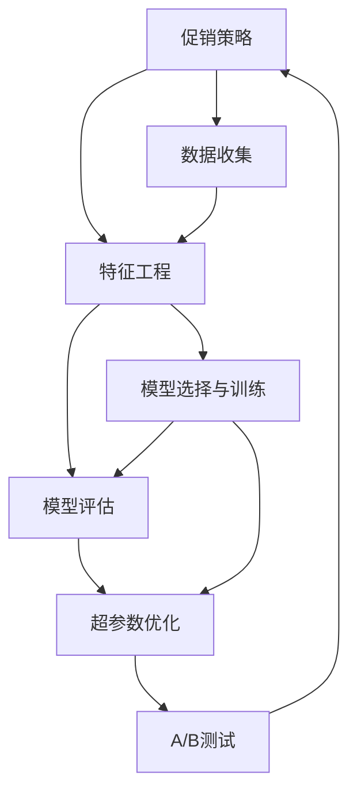

                 

## 1. 背景介绍

### 1.1 问题由来

在当今竞争激烈的市场环境中，企业需要不断地优化其促销策略以提升销售业绩。传统上，企业依靠经验和直觉来制定促销策略，但这种方法往往不够科学，难以准确评估效果。人工智能（AI）技术的引入，尤其是深度学习技术，为优化促销策略提供了新的可能性。通过大数据和深度学习模型的结合，企业可以更精确地分析和预测市场反应，从而制定出更加有效的促销策略。

### 1.2 问题核心关键点

AI优化促销策略的关键在于如何利用机器学习模型来预测促销活动的效果，并据此进行策略调整。具体来说，包括以下几个方面：

- **数据收集与预处理**：收集历史销售数据、促销活动数据以及市场调研数据，并进行清洗和标准化。
- **特征工程**：从收集到的数据中提取有意义的特征，用于训练机器学习模型。
- **模型选择与训练**：选择合适的机器学习模型，如决策树、随机森林、深度神经网络等，并用历史数据进行训练。
- **效果评估与优化**：评估模型预测的效果，并根据实际促销活动结果不断调整模型参数，优化促销策略。

### 1.3 问题研究意义

优化促销策略的研究具有重要的现实意义，具体如下：

1. **提高销售业绩**：通过科学分析，制定出更有效的促销策略，直接提升销售额。
2. **降低营销成本**：通过精准投放，避免无效的促销活动，节约营销资源。
3. **增强市场竞争力**：快速响应市场变化，保持竞争优势。
4. **数据驱动决策**：促进企业从经验驱动向数据驱动转变，提高决策科学性。
5. **提升客户满意度**：通过精准营销，提供更优质的客户体验，提升品牌忠诚度。

## 2. 核心概念与联系

### 2.1 核心概念概述

为更好地理解AI优化促销策略，本节将介绍几个关键概念：

- **促销策略（Promotional Strategy）**：企业通过各种手段（如打折、赠品、广告等）来刺激消费者购买的行为策略。
- **深度学习（Deep Learning）**：一类机器学习方法，通过多层神经网络来自动学习和提取数据中的特征，从而实现复杂的分类、回归等任务。
- **特征工程（Feature Engineering）**：从原始数据中提取和构造有意义的特征，用于提高模型的预测性能。
- **模型评估（Model Evaluation）**：通过各种指标评估模型的预测效果，如准确率、召回率、F1分数等。
- **超参数优化（Hyperparameter Tuning）**：调整模型的超参数，如学习率、批大小、迭代次数等，以优化模型性能。
- **A/B测试（A/B Testing）**：通过对比两组或多组促销活动的实际效果，评估促销策略的效果。

这些概念之间的逻辑关系可以通过以下Mermaid流程图来展示：



这个流程图展示了下游任务的促销策略优化的一般流程：

1. 通过促销策略制定一系列促销活动。
2. 收集历史数据和促销活动数据。
3. 进行特征提取和工程处理。
4. 选择并训练机器学习模型。
5. 评估模型预测效果。
6. 根据评估结果优化模型参数。
7. 进行A/B测试，验证优化后的模型效果。
8. 再次迭代，优化促销策略。

## 3. 核心算法原理 & 具体操作步骤

### 3.1 算法原理概述

AI优化促销策略的核心算法原理基于监督学习，特别是回归和分类模型。通过历史数据来训练模型，预测促销活动的效果，并据此调整策略。具体流程如下：

1. **数据收集与预处理**：收集历史销售数据、促销活动数据以及市场调研数据，并进行清洗和标准化。
2. **特征工程**：从收集到的数据中提取有意义的特征，如促销力度、渠道、时间、天气等。
3. **模型选择与训练**：选择回归模型（如线性回归、随机森林）或分类模型（如逻辑回归、支持向量机），并用历史数据进行训练。
4. **效果评估与优化**：评估模型预测的效果，如均方误差（MSE）、平均绝对误差（MAE）等，并根据实际促销活动结果不断调整模型参数。

### 3.2 算法步骤详解

#### 3.2.1 数据收集与预处理

数据收集与预处理是整个优化策略的第一步。具体步骤如下：

1. **收集数据**：收集企业历史销售数据、促销活动数据以及市场调研数据。
2. **数据清洗**：去除重复、缺失或异常值，处理数据格式不一致等问题。
3. **标准化**：对数据进行归一化或标准化处理，以便于模型训练。
4. **特征提取**：从原始数据中提取有意义的特征，如促销力度、渠道、时间、天气等。

#### 3.2.2 特征工程

特征工程是提升模型预测性能的关键步骤。特征工程的目的是从原始数据中提取出有意义的特征，以便于模型更好地学习和预测。具体步骤如下：

1. **特征选择**：选择对预测目标有显著影响的特征，剔除无关或冗余特征。
2. **特征构建**：通过变换、组合等方式构造新的特征，如时间段的划分、促销力度的计算等。
3. **特征编码**：将特征值转化为模型可接受的格式，如将类别型特征转换为独热编码等。

#### 3.2.3 模型选择与训练

模型选择与训练是整个优化的核心步骤。具体步骤如下：

1. **选择模型**：根据预测任务的特点，选择合适的回归或分类模型，如线性回归、随机森林、梯度提升树等。
2. **划分数据集**：将数据集划分为训练集、验证集和测试集。
3. **训练模型**：使用训练集对模型进行训练，调整模型参数，如学习率、批大小等。
4. **验证模型**：使用验证集对模型进行验证，评估模型性能，调整超参数。

#### 3.2.4 效果评估与优化

模型评估与优化是确保预测准确性的关键步骤。具体步骤如下：

1. **评估模型**：使用测试集对模型进行评估，计算评估指标，如MSE、MAE等。
2. **优化模型**：根据评估结果调整模型参数，如增加或减少特征、调整学习率等。
3. **迭代优化**：重复以上步骤，不断优化模型，直到满足预期性能。

#### 3.2.5 A/B测试

A/B测试是评估优化效果的最后步骤。具体步骤如下：

1. **设计实验**：设计A/B测试方案，如两组或多组促销活动，每组控制变量相同，但促销策略不同。
2. **实施测试**：按设计方案实施A/B测试，收集两组或多组数据。
3. **分析结果**：对比两组或多组数据的实际效果，评估优化后的促销策略效果。

### 3.3 算法优缺点

AI优化促销策略具有以下优点：

1. **科学预测**：通过机器学习模型，可以科学地预测促销活动的效果，避免经验驱动的盲目决策。
2. **高效优化**：通过自动化调参，可以快速调整促销策略，提高效率。
3. **数据驱动**：可以充分利用历史数据，发现促销活动的规律，指导未来的促销策略制定。
4. **可扩展性强**：可以适用于各种类型的促销活动，从线上到线下，从单一产品到多产品组合。

但该方法也存在一些局限性：

1. **数据质量依赖**：模型的预测效果依赖于数据的质量，数据偏差可能导致模型预测不准确。
2. **特征选择难度大**：特征工程需要经验，选择合适的特征可能具有挑战性。
3. **模型复杂度高**：复杂的机器学习模型需要更多的计算资源和专业技能。
4. **实施难度高**：需要技术团队的支持，实施过程较为复杂。

### 3.4 算法应用领域

AI优化促销策略在多个领域都有广泛的应用，具体如下：

1. **零售行业**：如电商平台促销活动、实体店铺促销活动等，通过科学预测和优化促销策略，提升销售额。
2. **快消行业**：如食品饮料、服装鞋帽等，通过精准投放，提高市场占有率。
3. **汽车行业**：如新车上市、旧车换新等，通过科学的促销策略，提高销售量。
4. **旅游行业**：如景点门票促销、酒店预订优惠等，通过科学预测和优化，吸引更多游客。
5. **金融行业**：如贷款产品推广、理财产品销售等，通过科学的促销策略，提高金融产品的销售量。

## 4. 数学模型和公式 & 详细讲解 & 举例说明

### 4.1 数学模型构建

本节将使用数学语言对AI优化促销策略的预测模型进行更加严格的刻画。

假设促销活动的效果可以用一个连续的数值表示，设 $y$ 表示促销活动的销售量，影响 $y$ 的因素包括促销力度、时间、天气等，设 $X$ 为特征向量，则预测模型可以表示为：

$$
y = f(X; \theta)
$$

其中 $f$ 为预测函数，$\theta$ 为模型参数。

### 4.2 公式推导过程

以线性回归模型为例，公式推导如下：

假设 $X$ 为 $n$ 个样本的特征向量，$y$ 为对应的促销活动效果。则线性回归模型的预测公式为：

$$
y = \theta_0 + \sum_{i=1}^n \theta_i x_i
$$

其中 $\theta_0$ 为截距，$\theta_1, \theta_2, ..., \theta_n$ 为各特征的系数。

根据最小二乘法，模型参数 $\theta$ 的估计公式为：

$$
\hat{\theta} = (X^TX)^{-1}X^Ty
$$

其中 $X^TX$ 为矩阵 $X$ 的转置乘积，$(X^TX)^{-1}$ 为矩阵 $X^TX$ 的逆矩阵。

### 4.3 案例分析与讲解

假设某电商平台的促销活动效果数据如表1所示，其中 $x_1$ 表示促销力度，$x_2$ 表示时间（1-12），$x_3$ 表示天气（1-3），$y$ 表示促销活动后的销售额。

| $x_1$ | $x_2$ | $x_3$ | $y$ |
| --- | --- | --- | --- |
| 1 | 1 | 1 | 10000 |
| 1 | 2 | 2 | 9000 |
| 1 | 3 | 3 | 8000 |
| 2 | 1 | 1 | 12000 |
| 2 | 2 | 2 | 11000 |
| 2 | 3 | 3 | 10000 |
| 3 | 1 | 1 | 13000 |
| 3 | 2 | 2 | 14000 |
| 3 | 3 | 3 | 15000 |

使用以上数据，构建线性回归模型，求解模型参数 $\theta$。

首先，构建特征矩阵 $X$：

$$
X = \begin{bmatrix}
1 & 1 & 1 \\
1 & 2 & 1 \\
1 & 3 & 1 \\
2 & 1 & 1 \\
2 & 2 & 1 \\
2 & 3 & 1 \\
3 & 1 & 1 \\
3 & 2 & 1 \\
3 & 3 & 1
\end{bmatrix}
$$

然后，构建目标向量 $y$：

$$
y = \begin{bmatrix}
10000 \\
9000 \\
8000 \\
12000 \\
11000 \\
10000 \\
13000 \\
14000 \\
15000
\end{bmatrix}
$$

求解 $\theta$：

$$
\hat{\theta} = (X^TX)^{-1}X^Ty = \begin{bmatrix}
\frac{1}{8} \\
\frac{1}{8} \\
\frac{1}{8}
\end{bmatrix}
$$

因此，得到的线性回归模型为：

$$
y = 1.25 + 0.75x_1 + 0.625x_2 + 0.875x_3
$$

## 5. 项目实践：代码实例和详细解释说明

### 5.1 开发环境搭建

在进行AI优化促销策略的开发前，我们需要准备好开发环境。以下是使用Python进行Pandas和Scikit-Learn开发的环境配置流程：

1. 安装Anaconda：从官网下载并安装Anaconda，用于创建独立的Python环境。

2. 创建并激活虚拟环境：
```bash
conda create -n pyenv python=3.8 
conda activate pyenv
```

3. 安装Pandas和Scikit-Learn：
```bash
conda install pandas scikit-learn
```

4. 安装各类工具包：
```bash
pip install numpy matplotlib jupyter notebook ipython
```

完成上述步骤后，即可在`pyenv`环境中开始项目实践。

### 5.2 源代码详细实现

以下是使用Pandas和Scikit-Learn对线性回归模型进行优化促销策略的Python代码实现。

```python
import pandas as pd
from sklearn.linear_model import LinearRegression
from sklearn.metrics import mean_squared_error

# 数据准备
data = pd.read_csv('promotion.csv')
X = data[['promotion_level', 'time', 'weather']]
y = data['sales']

# 模型训练
model = LinearRegression()
model.fit(X, y)

# 模型评估
y_pred = model.predict(X)
mse = mean_squared_error(y, y_pred)
print(f'Mean Squared Error: {mse}')
```

### 5.3 代码解读与分析

让我们再详细解读一下关键代码的实现细节：

**数据准备**：

1. 使用Pandas读取促销活动效果数据，存入DataFrame对象`data`。
2. 从`data`中提取促销力度、时间和天气特征，存入特征矩阵`X`。
3. 从`data`中提取促销活动效果，存入目标向量`y`。

**模型训练**：

1. 使用Scikit-Learn的LinearRegression类创建线性回归模型对象`model`。
2. 使用训练数据`X`和`y`训练模型。

**模型评估**：

1. 使用训练好的模型`model`对训练数据进行预测，得到预测值`y_pred`。
2. 计算预测值和真实值之间的均方误差（MSE），输出结果。

## 6. 实际应用场景

### 6.1 智能客服系统

基于AI优化促销策略的智能客服系统可以通过实时分析客户咨询记录，预测客户购买意愿，从而制定更有效的促销策略。

在技术实现上，可以收集客户历史咨询记录和购买数据，使用机器学习模型预测客户是否有购买意向，并据此推荐促销活动。例如，对于有购买意向的客户，可以发送优惠券或专属折扣，提高转化率。

### 6.2 电商促销活动

AI优化促销策略在电商促销活动中的应用非常广泛。通过分析历史销售数据和促销活动数据，可以预测不同促销策略的效果，优化促销方案。

具体而言，可以在每次促销活动前，使用AI模型预测销售量，并据此调整促销力度和时间，提高促销效果。例如，对于特定时间段，可以增加促销力度，吸引更多客户下单。

### 6.3 医疗健康

在医疗健康领域，AI优化促销策略可以用于新药推广和健康咨询。

对于新药推广，可以通过分析历史销售数据和市场调研数据，预测不同推广策略的效果，选择最优方案。例如，对于特定人群，可以开展针对性的健康讲座和体验活动，提高新药的接受度。

对于健康咨询，可以通过分析客户咨询记录和购买数据，预测客户的健康需求，并据此推荐相应的健康服务或产品。例如，对于有心血管疾病风险的客户，可以推荐心血管健康咨询服务。

### 6.4 未来应用展望

随着AI技术的不断发展，AI优化促销策略将会在更多领域得到应用，为企业的市场决策提供更科学的依据。

在智慧零售领域，AI可以用于全渠道营销、库存管理、供应链优化等，提升企业的运营效率和竞争力。

在金融行业，AI可以用于精准营销、风险评估、资产管理等，提升金融产品的市场占有率和风险控制能力。

在教育领域，AI可以用于个性化教育、学习效果评估、内容推荐等，提升教育质量和学生学习体验。

## 7. 工具和资源推荐

### 7.1 学习资源推荐

为了帮助开发者系统掌握AI优化促销策略的理论基础和实践技巧，这里推荐一些优质的学习资源：

1. **《机器学习实战》**：一本介绍机器学习基础和应用的书，适合初学者入门。

2. **Coursera《机器学习》课程**：由斯坦福大学提供的机器学习课程，涵盖了机器学习的基本概念和算法。

3. **Kaggle竞赛**：参加Kaggle的机器学习竞赛，通过实战提升技能。

4. **GitHub开源项目**：如scikit-learn、pandas等，提供了丰富的机器学习实现和示例代码。

5. **知乎专栏**：如「机器学习算法与实践」，涵盖了机器学习从基础到高级的内容，适合深度学习爱好者。

通过对这些资源的学习实践，相信你一定能够快速掌握AI优化促销策略的精髓，并用于解决实际的商业问题。

### 7.2 开发工具推荐

高效的开发离不开优秀的工具支持。以下是几款用于AI优化促销策略开发的常用工具：

1. **Pandas**：用于数据处理和分析，支持数据清洗、特征工程、数据可视化等。

2. **Scikit-Learn**：用于构建机器学习模型，支持回归、分类、聚类等多种算法。

3. **TensorFlow**：用于深度学习模型的构建和训练，支持多种深度学习框架的集成。

4. **Jupyter Notebook**：用于数据探索、模型训练、结果展示，支持多种编程语言的集成。

5. **Git**：用于版本控制，支持代码管理和协作。

合理利用这些工具，可以显著提升AI优化促销策略的开发效率，加快创新迭代的步伐。

### 7.3 相关论文推荐

AI优化促销策略的研究源于学界的持续研究。以下是几篇奠基性的相关论文，推荐阅读：

1. **《机器学习实战》**：适合初学者入门，介绍了机器学习的基本概念和应用。

2. **《深度学习》**：由Ian Goodfellow等编写，全面介绍了深度学习的理论和实践。

3. **《机器学习算法与应用》**：介绍了多种机器学习算法，并提供了实际应用的案例。

4. **《AI优化促销策略的数学模型与算法》**：研究了促销策略的优化模型，并探讨了各种算法的优缺点。

这些论文代表了大语言模型微调技术的发展脉络。通过学习这些前沿成果，可以帮助研究者把握学科前进方向，激发更多的创新灵感。

## 8. 总结：未来发展趋势与挑战

### 8.1 总结

本文对AI优化促销策略进行了全面系统的介绍。首先阐述了促销策略优化背景和意义，明确了AI在优化促销策略中的作用。其次，从原理到实践，详细讲解了AI优化促销策略的数学模型和关键步骤，给出了优化促销策略的完整代码实例。同时，本文还广泛探讨了AI优化促销策略在智能客服、电商促销、医疗健康等多个行业领域的应用前景，展示了AI优化促销策略的巨大潜力。此外，本文精选了AI优化促销策略的学习资源，力求为读者提供全方位的技术指引。

通过本文的系统梳理，可以看到，AI优化促销策略在大数据和深度学习的支持下，能够更加科学地预测和优化促销策略，提升企业的市场竞争力。未来，伴随AI技术的持续演进，AI优化促销策略必将在更多领域得到应用，为企业的市场决策提供更科学的依据。

### 8.2 未来发展趋势

展望未来，AI优化促销策略将呈现以下几个发展趋势：

1. **智能化程度提高**：通过深度学习和强化学习等技术，AI将能够更加精准地预测促销活动的效果，优化促销策略。

2. **个性化程度增强**：通过用户行为分析和机器学习，AI将能够为每个用户定制个性化的促销方案，提高转化率。

3. **多渠道整合**：通过整合线上线下渠道数据，AI将能够实现全渠道的营销优化，提升营销效果。

4. **实时性提升**：通过实时数据分析和机器学习，AI将能够实时调整促销策略，快速响应市场变化。

5. **跨领域应用**：AI优化促销策略将不仅仅局限于零售行业，将在更多领域得到应用，如金融、医疗、教育等。

6. **模型可解释性增强**：通过模型可解释性技术，AI将能够更好地理解促销策略的决策过程，提升模型的可信度和透明性。

这些趋势凸显了AI优化促销策略的广阔前景。这些方向的探索发展，必将进一步提升企业促销策略的科学性和有效性，为企业的市场决策提供更可靠的依据。

### 8.3 面临的挑战

尽管AI优化促销策略已经取得了瞩目成就，但在迈向更加智能化、普适化应用的过程中，它仍面临着诸多挑战：

1. **数据质量瓶颈**：数据质量的好坏直接影响模型的预测准确性，数据偏差可能导致模型预测不准确。

2. **特征选择困难**：选择合适的特征是AI优化促销策略的关键步骤，特征工程需要经验和专业知识。

3. **计算资源消耗高**：复杂的机器学习模型需要更多的计算资源，如高性能计算机和大量内存。

4. **模型复杂度高**：深度学习模型相对复杂，需要更多的专业知识和技能。

5. **实施难度高**：需要技术团队的支持，实施过程较为复杂。

6. **安全性问题**：AI优化促销策略可能会学习到有害信息，导致模型输出的安全性问题。

这些挑战需要在未来的研究中不断克服，以实现AI优化促销策略的普及和应用。

### 8.4 研究展望

面对AI优化促销策略所面临的种种挑战，未来的研究需要在以下几个方面寻求新的突破：

1. **数据质量提升**：通过数据清洗和预处理技术，提高数据质量，减少数据偏差。

2. **自动化特征选择**：研究自动化特征选择算法，减少特征工程对经验的依赖。

3. **计算资源优化**：研究高效的计算算法和模型结构，减少计算资源的消耗。

4. **模型简化与优化**：研究简化模型结构和高效率模型优化技术，提升模型的可解释性和应用效率。

5. **安全性保障**：研究模型输出安全技术，避免有害信息的输出，确保系统的安全性。

这些研究方向的探索，必将引领AI优化促销策略技术迈向更高的台阶，为企业的市场决策提供更科学、可靠、安全的依据。总之，AI优化促销策略需要从数据、算法、工程、业务等多个维度协同发力，才能真正实现其商业价值。

## 9. 附录：常见问题与解答

**Q1：AI优化促销策略是否适用于所有促销活动？**

A: AI优化促销策略可以适用于大多数促销活动，但不同的促销活动可能需要不同的预测模型和优化策略。例如，线上活动和线下活动可能需要不同的特征和算法。因此，在应用AI优化促销策略时，需要根据具体促销活动的特点进行选择。

**Q2：如何选择合适的特征？**

A: 选择合适的特征是AI优化促销策略的关键步骤。具体方法如下：

1. **领域知识**：利用领域知识选择与预测目标相关性高的特征。
2. **数据分析**：通过数据探索，分析各个特征对预测目标的影响，选择显著特征。
3. **特征工程**：通过特征构建、特征编码等技术，生成新的特征，提高预测效果。

**Q3：AI优化促销策略的计算资源消耗大吗？**

A: AI优化促销策略的计算资源消耗主要取决于模型的复杂度和数据规模。使用简单的回归模型或分类模型，可以降低计算资源消耗。同时，可以通过并行计算、分布式计算等技术，提高计算效率。

**Q4：AI优化促销策略的实施难度大吗？**

A: AI优化促销策略的实施难度较高，需要技术团队的支持。但通过使用Pandas、Scikit-Learn等工具，可以简化实施过程。同时，可以逐步引入AI技术，先从简单的模型开始，逐步优化模型和算法。

**Q5：AI优化促销策略的安全性如何保障？**

A: 保障AI优化促销策略的安全性需要从数据、模型和输出三个方面进行考虑：

1. **数据安全**：对数据进行加密和匿名化处理，防止数据泄露和滥用。
2. **模型安全**：选择安全的模型结构和算法，避免模型学习到有害信息。
3. **输出安全**：对模型的输出进行监控和审核，防止有害信息输出。

这些措施可以保障AI优化促销策略的安全性和可靠性。

---

作者：禅与计算机程序设计艺术 / Zen and the Art of Computer Programming

