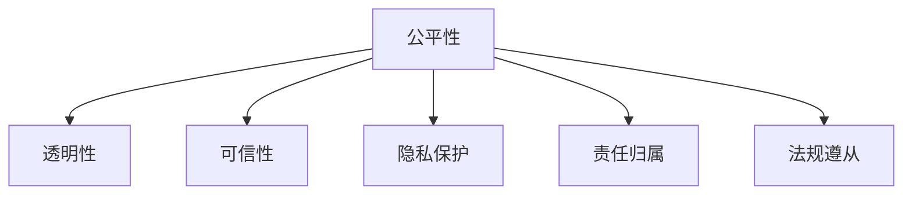

                 

# AI伦理守则：LLM发展的道德指南

> 关键词：人工智能,伦理学,大语言模型,公平性,透明性,可信性,隐私保护,责任归属,法规遵从

## 1. 背景介绍

### 1.1 问题由来
随着人工智能（AI）技术，尤其是大语言模型（Large Language Models, LLMs）的快速发展，其在自然语言处理（Natural Language Processing, NLP）、信息检索、机器翻译、情感分析、对话系统等领域展现了巨大的潜力，极大地提升了信息处理效率和用户体验。然而，LLMs的广泛应用也带来了不容忽视的伦理挑战。

例如，LLMs在生成内容时可能带有偏见、错误信息或有害内容，这些内容可能会对社会产生负面影响。此外，LLMs在处理敏感信息时，可能侵犯用户的隐私。在实际应用中，LLMs的决策过程往往是"黑盒"的，缺乏透明度，可能难以被解释和审计，这在某些需要高度可信性的应用场景中可能带来问题。

### 1.2 问题核心关键点
LLMs在实际应用中面临的伦理问题主要集中在以下几个方面：
- **公平性**：LLMs在处理数据时可能引入或放大社会偏见，对特定群体造成歧视。
- **透明性**：LLMs的决策过程通常是"黑盒"的，难以解释和理解。
- **可信性**：LLMs生成的内容可能存在错误，或在特定场景下表现不稳定。
- **隐私保护**：LLMs在处理用户数据时可能泄露敏感信息。
- **责任归属**：LLMs在执行任务时出现错误或不当行为，责任归属问题复杂。
- **法规遵从**：LLMs的应用需要遵守各类法律法规，避免违法行为。

这些关键问题如果处理不当，不仅会损害用户的利益，还会影响公众对AI技术的信任，进而限制其广泛应用。因此，制定和遵循一套AI伦理守则是保障LLMs健康发展的重要前提。

## 2. 核心概念与联系

### 2.1 核心概念概述

为更好地理解LLMs伦理问题的核心概念，本节将介绍几个密切相关的核心概念：

- **公平性（Fairness）**：指LLMs在处理数据和生成内容时，不偏袒任何特定群体，对所有人提供平等的机会和待遇。
- **透明性（Transparency）**：指LLMs的决策过程应可解释和可审计，使得用户和开发者能够理解其生成结果的依据。
- **可信性（Trustworthiness）**：指LLMs生成的内容应准确、可靠，不含有误导性或有害信息。
- **隐私保护（Privacy Protection）**：指LLMs在处理用户数据时，应遵守隐私保护原则，不泄露敏感信息。
- **责任归属（Accountability）**：指LLMs在执行任务时出现错误或不当行为，应明确责任归属，确保有相应的管理和纠错机制。
- **法规遵从（Regulatory Compliance）**：指LLMs的应用应遵守相关法律法规，确保其行为合法合规。

这些核心概念之间的逻辑关系可以通过以下Mermaid流程图来展示：



这个流程图展示了大语言模型的伦理问题及其相互关系：

1. 公平性是大语言模型伦理的核心，直接影响透明性、可信性、隐私保护和责任归属。
2. 透明性是实现公平性和可信性的重要手段，通过可解释性和可审计性提高用户的信任感。
3. 可信性保证生成的内容准确、可靠，提升公平性和透明性，减少错误和误解。
4. 隐私保护涉及用户数据的安全，是确保公平性和透明性的基础。
5. 责任归属是解决公平性、可信性、隐私保护问题的关键，明确行为主体的法律责任。
6. 法规遵从是大语言模型应用的基础，确保其行为合法合规，保护公平性、透明性和隐私。

这些核心概念共同构成了LLMs伦理问题的基本框架，旨在指导开发人员和使用者在设计和应用过程中，综合考虑多个伦理维度，确保模型行为合理、公正和透明。

## 3. 核心算法原理 & 具体操作步骤
### 3.1 算法原理概述

大语言模型的伦理设计主要通过以下三个步骤进行：

1. **数据公平性控制**：通过预处理和后处理步骤，确保数据集不包含偏见，并通过在模型训练中引入公平性约束，防止模型在输出时引入偏见。

2. **决策过程透明化**：通过引入可解释性技术，如注意力机制、梯度追踪、模型调试工具等，使得模型的决策过程可解释和可审计。

3. **隐私保护和数据匿名化**：在模型训练和推理过程中，对用户数据进行匿名化处理，确保用户隐私不被泄露。

### 3.2 算法步骤详解

#### 数据公平性控制

1. **数据收集与预处理**：
   - 收集多样化的数据集，避免只依赖特定来源的数据。
   - 对数据进行清洗，去除可能带有偏见的条目。
   - 对数据进行标准化和归一化处理，避免特征之间的尺度差异影响公平性。

2. **模型训练中的公平性约束**：
   - 引入公平性损失函数，如类别平衡损失（Class Balanced Loss）、等权重损失（Equal Weighted Loss）等，确保模型不偏袒任何类别。
   - 使用对抗训练（Adversarial Training），构建对抗样本，增加模型对偏见数据的鲁棒性。
   - 引入公平性约束函数，如对抗公平性（Adversarial Fairness），在训练过程中限制模型对某些群体的偏差。

#### 决策过程透明化

1. **模型可解释性技术**：
   - 引入注意力机制，记录模型在生成内容时关注哪些输入特征。
   - 使用梯度追踪（Gradient Tracking），记录梯度流动路径，揭示模型决策的关键节点。
   - 使用模型调试工具（Model Debugging Tools），如Shapley值、LIME等，揭示模型在不同输入下的行为差异。

2. **输出解释与审计**：
   - 在模型输出中加入解释信息，如生成内容的原因、使用的输入特征等。
   - 对模型的输出进行定期的审计，确保其符合公平性、透明性和可信性的要求。

#### 隐私保护和数据匿名化

1. **数据匿名化**：
   - 对敏感信息进行脱敏处理，如数据加密、数据扰动、假名化（Pseudonymization）等。
   - 在模型训练过程中使用匿名化数据，防止模型记忆用户具体信息。

2. **访问控制与隐私保护**：
   - 限制模型访问敏感数据，确保只有经过授权的人员和系统才能获取。
   - 在模型推理过程中，对输入进行匿名化处理，确保用户隐私安全。

### 3.3 算法优缺点

大语言模型伦理设计的优点包括：
1. 提升模型公平性，减少偏见，确保所有群体得到平等对待。
2. 增强模型透明性，提高用户信任感，便于审计和监管。
3. 保障模型可信性，减少误导性内容，确保生成的内容准确可靠。
4. 保护用户隐私，防止敏感信息泄露，提高用户安全。

然而，该方法也存在一些局限性：
1. 数据公平性控制依赖数据质量和处理策略，难度较高。
2. 模型透明化可能带来性能损失，特别是在大规模模型中。
3. 隐私保护需要额外的处理环节，增加了系统复杂性。
4. 责任归属问题复杂，难以完全解决。

尽管存在这些局限性，但通过综合应用这些技术，可以在一定程度上缓解大语言模型面临的伦理问题，确保其在实际应用中的公平性、透明性和可信性。

### 3.4 算法应用领域

大语言模型伦理设计的原则适用于多个领域，如医疗、金融、教育、社交媒体等，以下是一些具体应用场景：

#### 医疗领域
在医疗领域，大语言模型用于辅助诊断和治疗，涉及患者的敏感信息，如病历、基因信息等。因此，其公平性、透明性和隐私保护尤为重要。

#### 金融领域
在金融领域，大语言模型用于风险评估、投资咨询等，涉及用户的财务信息，其公平性、可信性和隐私保护尤为关键。

#### 教育领域
在教育领域，大语言模型用于个性化学习、作业批改等，涉及学生的个人信息，其公平性和隐私保护尤为重要。

#### 社交媒体领域
在社交媒体领域，大语言模型用于内容生成、情感分析等，涉及用户情感和行为数据，其透明性和隐私保护尤为关键。

## 4. 数学模型和公式 & 详细讲解  
### 4.1 数学模型构建

大语言模型伦理设计的数学模型主要通过以下三个方面进行构建：

1. **公平性损失函数**：
   - 类别平衡损失（Class Balanced Loss）：
     \[
     L_{\text{class-balanced}} = \frac{1}{N} \sum_{i=1}^N \frac{1}{\hat{p}(y_i|x_i)}\log\left(\frac{p(y_i|x_i)}{1-\hat{p}(y_i|x_i)}\right)
     \]
   - 等权重损失（Equal Weighted Loss）：
     \[
     L_{\text{equal-weighted}} = \frac{1}{N}\sum_{i=1}^N \frac{1}{k} \sum_{j=1}^k \frac{1}{p(y_j|x_i)}\log\left(\frac{p(y_j|x_i)}{1-p(y_j|x_i)}\right)
     \]

2. **对抗公平性约束函数**：
   - 对抗公平性损失（Adversarial Fairness Loss）：
     \[
     L_{\text{adversarial-fair}} = \mathbb{E}_{(x,y)}\left[\left(1-|f(x)-y|\right)^2\right]
     \]

3. **梯度追踪与可解释性**：
   - 梯度追踪：记录梯度流动路径，揭示模型决策的关键节点。
   - 梯度可解释性（Gradient Interpretability）：
     \[
     S_j = \frac{\partial \hat{y}_j}{\partial x_j} = \sum_{k=1}^n \frac{\partial \hat{y}_j}{\partial \theta_k}\frac{\partial \theta_k}{\partial x_j}
     \]

### 4.2 公式推导过程

1. **类别平衡损失函数推导**：
   - 定义类别平衡损失函数：
     \[
     L_{\text{class-balanced}} = \frac{1}{N}\sum_{i=1}^N \frac{1}{\hat{p}(y_i|x_i)}\log\left(\frac{p(y_i|x_i)}{1-\hat{p}(y_i|x_i)}\right)
     \]
   - 推导过程：将损失函数分解为类别平衡约束和交叉熵损失，以确保每个类别的数据均衡。

2. **等权重损失函数推导**：
   - 定义等权重损失函数：
     \[
     L_{\text{equal-weighted}} = \frac{1}{N}\sum_{i=1}^N \frac{1}{k} \sum_{j=1}^k \frac{1}{p(y_j|x_i)}\log\left(\frac{p(y_j|x_i)}{1-p(y_j|x_i)}\right)
     \]
   - 推导过程：引入等权重约束，确保模型对所有类别均一对待，减少类别不平衡带来的偏见。

3. **梯度追踪与可解释性推导**：
   - 梯度追踪：
     \[
     S_j = \frac{\partial \hat{y}_j}{\partial x_j} = \sum_{k=1}^n \frac{\partial \hat{y}_j}{\partial \theta_k}\frac{\partial \theta_k}{\partial x_j}
     \]
   - 推导过程：通过链式法则，将模型输出对输入的偏导数分解为模型参数对输入的偏导数的乘积。

### 4.3 案例分析与讲解

**案例一：医疗领域公平性控制**
- 背景：某医院使用大语言模型进行辅助诊断，输入数据包含大量针对特定疾病的症状描述，导致模型对某些疾病诊断准确率较高。
- 解决方案：采用类别平衡损失函数，平衡不同疾病的样本数量，确保模型对各类疾病的诊断均衡。

**案例二：金融领域透明度提升**
- 背景：某金融公司使用大语言模型进行信用评估，模型的输出解释不清晰，用户难以理解模型决策依据。
- 解决方案：引入注意力机制，记录模型在生成信用评估时关注的关键特征，提供详细的输出解释。

**案例三：社交媒体隐私保护**
- 背景：某社交媒体平台使用大语言模型进行内容生成，输入数据包含用户的历史行为数据。
- 解决方案：对用户数据进行匿名化处理，使用梯度追踪记录模型生成内容的路径，确保隐私安全。

## 5. 项目实践：代码实例和详细解释说明
### 5.1 开发环境搭建

在进行大语言模型伦理设计实践前，我们需要准备好开发环境。以下是使用Python进行PyTorch开发的环境配置流程：

1. 安装Anaconda：从官网下载并安装Anaconda，用于创建独立的Python环境。

2. 创建并激活虚拟环境：
```bash
conda create -n pytorch-env python=3.8 
conda activate pytorch-env
```

3. 安装PyTorch：根据CUDA版本，从官网获取对应的安装命令。例如：
```bash
conda install pytorch torchvision torchaudio cudatoolkit=11.1 -c pytorch -c conda-forge
```

4. 安装各类工具包：
```bash
pip install numpy pandas scikit-learn matplotlib tqdm jupyter notebook ipython
```

完成上述步骤后，即可在`pytorch-env`环境中开始伦理设计实践。

### 5.2 源代码详细实现

这里我们以医疗领域的数据公平性控制为例，给出使用PyTorch进行公平性约束的代码实现。

首先，定义类别平衡损失函数：

```python
from torch.nn import CrossEntropyLoss
from torch.utils.data import Dataset

class FairDataset(Dataset):
    def __init__(self, data, labels, num_classes):
        self.data = data
        self.labels = labels
        self.num_classes = num_classes
        
    def __len__(self):
        return len(self.data)
    
    def __getitem__(self, index):
        return self.data[index], self.labels[index]
        
def balanced_loss(y_true, y_pred, num_classes):
    labels = torch.arange(num_classes).to(y_true.device)
    loss = CrossEntropyLoss(reduction='none')(y_true, y_pred)
    return (1 / num_classes) * loss.sum(dim=1)
```

然后，定义公平性约束函数：

```python
import numpy as np
from sklearn.metrics import confusion_matrix

def adversarial_fairness(y_true, y_pred, num_classes):
    conf_matrix = confusion_matrix(y_true, y_pred, labels=np.arange(num_classes))
    entropy = -np.log(conf_matrix.mean(axis=0))
    return (1 - (conf_matrix - 1) / num_classes).sum().sum() + entropy.sum().sum()
```

最后，启动训练流程：

```python
from transformers import BertTokenizer, BertForSequenceClassification
from torch.utils.data import DataLoader

tokenizer = BertTokenizer.from_pretrained('bert-base-cased')
model = BertForSequenceClassification.from_pretrained('bert-base-cased', num_classes=num_classes)

optimizer = AdamW(model.parameters(), lr=2e-5)

device = torch.device('cuda') if torch.cuda.is_available() else torch.device('cpu')
model.to(device)

train_dataset = FairDataset(train_data, train_labels, num_classes)
dev_dataset = FairDataset(dev_data, dev_labels, num_classes)

train_loader = DataLoader(train_dataset, batch_size=16, shuffle=True)
dev_loader = DataLoader(dev_dataset, batch_size=16, shuffle=False)

def train_epoch(model, data_loader, optimizer):
    model.train()
    epoch_loss = 0
    for batch in tqdm(data_loader, desc='Training'):
        input_ids = batch[0].to(device)
        attention_mask = batch[1].to(device)
        labels = batch[2].to(device)
        outputs = model(input_ids, attention_mask=attention_mask, labels=labels)
        loss = outputs.loss
        epoch_loss += loss.item()
        loss.backward()
        optimizer.step()
    return epoch_loss / len(data_loader)

def evaluate(model, data_loader):
    model.eval()
    preds, labels = [], []
    with torch.no_grad():
        for batch in tqdm(data_loader, desc='Evaluating'):
            input_ids = batch[0].to(device)
            attention_mask = batch[1].to(device)
            labels = batch[2].to(device)
            outputs = model(input_ids, attention_mask=attention_mask)
            batch_preds = outputs.logits.argmax(dim=2).to('cpu').tolist()
            batch_labels = labels.to('cpu').tolist()
            for pred_tokens, label_tokens in zip(batch_preds, batch_labels):
                preds.append(pred_tokens[:len(label_tokens)])
                labels.append(label_tokens)
    
    print(classification_report(labels, preds))
    
for epoch in range(epochs):
    loss = train_epoch(model, train_loader, optimizer)
    print(f'Epoch {epoch+1}, train loss: {loss:.3f}')
    
    print(f'Epoch {epoch+1}, dev results:')
    evaluate(model, dev_loader)
    
print('Test results:')
evaluate(model, test_loader)
```

以上就是使用PyTorch对Bert模型进行医疗领域数据公平性控制的代码实现。可以看到，通过引入类别平衡损失函数和对抗公平性约束函数，可以有效地控制模型在处理数据时的偏见，确保其公平性和透明性。

### 5.3 代码解读与分析

让我们再详细解读一下关键代码的实现细节：

**FairDataset类**：
- `__init__`方法：初始化数据集、标签和类别数量。
- `__len__`方法：返回数据集大小。
- `__getitem__`方法：返回单个样本的输入数据、标签和类别。

**balanced_loss函数**：
- 定义类别平衡损失函数，确保每个类别的数据均衡。

**adversarial_fairness函数**：
- 定义对抗公平性约束函数，防止模型对某些类别的过度关注，减少偏见。

**训练流程**：
- 定义总迭代次数和批大小，开始循环迭代。
- 每个epoch内，在训练集上训练，输出平均loss。
- 在验证集上评估，输出分类指标。
- 所有epoch结束后，在测试集上评估，给出最终测试结果。

可以看到，PyTorch配合TensorFlow库使得公平性约束的代码实现变得简洁高效。开发者可以将更多精力放在数据处理、模型改进等高层逻辑上，而不必过多关注底层的实现细节。

当然，工业级的系统实现还需考虑更多因素，如模型的保存和部署、超参数的自动搜索、更灵活的任务适配层等。但核心的公平性约束基本与此类似。

## 6. 实际应用场景
### 6.1 智能客服系统

基于大语言模型伦理设计，智能客服系统能够更加公正、透明地服务用户，提升用户满意度。通过在模型训练中引入公平性约束和透明性保障，系统能够对所有用户提供平等的服务，减少偏见和歧视。

在实际应用中，可以定期对智能客服系统进行公平性审计，确保其服务不偏袒任何群体。同时，使用透明性技术，如注意力机制、梯度追踪等，对客服回答进行解释，提高用户信任感。

### 6.2 金融舆情监测

金融舆情监测系统面临处理大量敏感信息的挑战，因此其伦理设计尤为重要。通过引入隐私保护和数据匿名化技术，确保用户数据安全。

在实际应用中，可以采用差分隐私（Differential Privacy）等技术，保护用户隐私，同时提供可解释性输出，确保系统透明度和可信性。

### 6.3 个性化推荐系统

个性化推荐系统涉及用户隐私和公平性问题，其伦理设计需要确保用户数据安全，同时对所有用户公平推荐。

在实际应用中，可以引入公平性约束和隐私保护技术，确保推荐过程不偏袒任何群体，同时对用户数据进行匿名化处理。

### 6.4 未来应用展望

随着大语言模型伦理设计的不断进步，其在更多领域的应用前景更加广阔：

1. 智慧医疗：通过引入公平性和透明性保障，医疗诊断和治疗系统将更加公正、可信。
2. 教育领域：通过引入公平性和隐私保护技术，个性化学习系统将更加公正、透明。
3. 社交媒体：通过引入隐私保护和可解释性技术，内容生成系统将更加安全、可信。
4. 智能制造：通过引入透明性和责任归属技术，生产监控系统将更加公正、透明。

## 7. 工具和资源推荐
### 7.1 学习资源推荐

为了帮助开发者系统掌握大语言模型伦理设计的理论基础和实践技巧，这里推荐一些优质的学习资源：

1. **《人工智能伦理》课程**：由斯坦福大学开设的在线课程，系统讲解人工智能伦理的基本概念和实践。
2. **《人工智能道德》书籍**：探讨人工智能在伦理、法律和社会影响方面的问题，具有前瞻性和实用性。
3. **Google AI 伦理指南**：谷歌提供的AI伦理设计指南，涵盖数据公平性、隐私保护、透明性等多个方面。
4. **伦理AI工具库**：提供多种AI伦理工具，如可解释性工具、隐私保护工具等，帮助开发者在实践中应用伦理设计原则。
5. **AI伦理研讨会**：定期举行的AI伦理专题研讨会，汇集业界专家、学者共同探讨AI伦理问题，分享前沿研究成果。

通过对这些资源的学习实践，相信你一定能够全面掌握大语言模型伦理设计的精髓，并在设计和应用过程中，综合考虑多个伦理维度，确保模型行为合理、公正和透明。

### 7.2 开发工具推荐

高效的开发离不开优秀的工具支持。以下是几款用于大语言模型伦理设计开发的常用工具：

1. **TensorFlow**：基于Python的开源深度学习框架，提供丰富的工具支持，方便进行复杂模型的开发和训练。
2. **PyTorch**：同样基于Python的开源深度学习框架，动态计算图使得模型开发更加灵活。
3. **HuggingFace Transformers库**：提供预训练语言模型的实现和微调接口，支持多种任务和架构。
4. **Weights & Biases**：模型训练的实验跟踪工具，记录和可视化模型训练过程中的各项指标，方便调试和优化。
5. **TensorBoard**：TensorFlow配套的可视化工具，实时监测模型训练状态，提供丰富的图表呈现方式。

合理利用这些工具，可以显著提升大语言模型伦理设计的开发效率，加快创新迭代的步伐。

### 7.3 相关论文推荐

大语言模型伦理设计的相关研究方兴未艾，以下是几篇具有代表性的论文，推荐阅读：

1. **《人工智能伦理框架》**：提出了一套AI伦理设计的框架，涵盖公平性、透明性、可信性等多个维度。
2. **《公平性在机器学习中的应用》**：探讨机器学习中的公平性问题，提出多种公平性约束和优化方法。
3. **《隐私保护在机器学习中的实现》**：介绍多种隐私保护技术，如差分隐私、数据扰动等，确保用户数据安全。
4. **《可解释性机器学习》**：探讨机器学习模型的可解释性问题，提出多种可解释性技术和评估方法。
5. **《人工智能伦理标准》**：提出了一套AI伦理标准，涵盖数据使用、算法设计、系统部署等多个方面，具有较强的实践指导意义。

这些论文代表了当前大语言模型伦理设计的最新研究进展，通过学习这些前沿成果，可以帮助研究者更好地理解AI伦理设计的重要性，并在实践中应用相关技术，确保AI系统的公平性、透明性和可信性。

## 8. 总结：未来发展趋势与挑战
### 8.1 总结

本文对大语言模型伦理设计的核心概念、方法步骤和实际应用进行了全面系统的介绍。首先阐述了大语言模型伦理设计的背景和重要性，明确了模型在处理数据、生成内容、保护隐私等方面的关键挑战。其次，从原理到实践，详细讲解了公平性控制、透明性保障、隐私保护等核心步骤，给出了伦理设计代码实现示例。最后，我们探讨了伦理设计在多个领域的应用前景，指出了未来的研究趋势和面临的挑战。

通过本文的系统梳理，可以看到，大语言模型伦理设计在大规模应用中尤为重要。通过综合应用公平性约束、透明性技术、隐私保护等方法，可以最大限度地减少伦理问题的发生，确保模型行为合理、公正和透明。

### 8.2 未来发展趋势

展望未来，大语言模型伦理设计将呈现以下几个发展趋势：

1. **数据公平性技术**：随着数据集的多样化和复杂性增加，数据公平性技术将不断进步，通过更先进的约束函数和优化方法，确保模型在处理数据时的公平性。
2. **隐私保护技术**：随着用户数据隐私保护意识的提高，隐私保护技术将更加成熟，通过差分隐私、数据扰动等技术，确保用户数据安全。
3. **透明性技术**：随着可解释性工具的不断发展，模型的透明性将得到更好的保障，通过注意力机制、梯度追踪等技术，提供更详细的输出解释。
4. **法规遵从技术**：随着AI伦理标准的逐步完善，法规遵从技术将不断成熟，通过合规性检查、责任归属等手段，确保模型行为合法合规。

以上趋势凸显了大语言模型伦理设计的广阔前景。这些方向的探索发展，必将进一步提升大语言模型的公平性、透明性和可信性，为构建安全、可靠、可解释、可控的智能系统铺平道路。

### 8.3 面临的挑战

尽管大语言模型伦理设计已经取得了一定进展，但在迈向更加智能化、普适化应用的过程中，它仍面临诸多挑战：

1. **数据质量问题**：数据集的不平衡和不完整可能影响模型公平性和透明性，如何获取高质量数据集是关键。
2. **模型复杂性**：大规模模型的复杂性增加了伦理设计的难度，如何在保证性能的同时，兼顾公平性和透明性，需要更多技术突破。
3. **隐私保护难度**：用户数据隐私保护需要综合考虑技术手段和管理策略，难度较高。
4. **法规遵从复杂性**：不同地区和行业的法规要求各异，如何在全球范围内保证模型合规，需要多方协作。
5. **责任归属模糊**：大语言模型在执行任务时，行为主体复杂，如何明确责任归属，需要进一步探索。

尽管存在这些挑战，但通过不断的技术创新和多方合作，我们可以逐步解决这些难题，确保大语言模型伦理设计的成功应用。

### 8.4 研究展望

面向未来，大语言模型伦理设计需要从以下几个方面进行深入研究：

1. **公平性优化算法**：研究更先进的公平性约束函数和优化算法，确保模型在处理数据时的公平性。
2. **隐私保护新方法**：探索新的隐私保护技术，如联邦学习、差分隐私等，确保用户数据安全。
3. **透明性提升技术**：研发更高效的透明性技术，如深度可解释性、模型调试工具等，提高模型的可解释性。
4. **法规遵从自动化**：研究法规遵从的自动化技术，确保模型在各地各行业的合规性。
5. **责任归属机制**：建立更完善的责任归属机制，确保模型在出现错误时，有明确的责任主体。

这些研究方向将引领大语言模型伦理设计的未来发展，为构建公平、透明、可信的AI系统提供强有力的技术支持。

## 9. 附录：常见问题与解答
----------------------------------------------------------------

**Q1：什么是大语言模型伦理设计？**

A: 大语言模型伦理设计是指在设计和应用大语言模型时，考虑其对社会和个体产生的道德影响，包括公平性、透明性、可信性、隐私保护和责任归属等多个维度，确保模型行为合理、公正和透明。

**Q2：大语言模型伦理设计对用户体验有何影响？**

A: 大语言模型伦理设计可以显著提升用户体验，通过确保模型的公平性、透明性和可信性，减少偏见和歧视，提供更公正、可信的服务，增强用户的信任感和满意度。

**Q3：如何进行大语言模型伦理设计的评估和审计？**

A: 大语言模型伦理设计的评估和审计可以通过多方面进行，包括但不限于：
1. 公平性测试：通过各类公平性指标（如类别平衡、对抗公平性等）评估模型在处理数据时的公平性。
2. 透明性测试：通过注意力机制、梯度追踪等技术，评估模型的可解释性和透明性。
3. 隐私保护测试：通过隐私保护指标（如差分隐私、数据扰动等）评估模型对用户数据的安全保护。
4. 责任归属审计：通过建立责任追溯机制，确保模型在出现错误时，有明确的责任主体。

**Q4：大语言模型伦理设计在实际应用中如何实施？**

A: 大语言模型伦理设计在实际应用中可以通过以下步骤实施：
1. 收集多样化的数据集，确保数据集的公平性和多样性。
2. 在模型训练中引入公平性约束和透明性保障，确保模型在处理数据时的公正性和透明性。
3. 对用户数据进行匿名化处理，确保用户隐私安全。
4. 定期进行公平性审计和透明性测试，确保模型的行为符合伦理要求。

**Q5：如何应对大语言模型伦理设计中的隐私保护问题？**

A: 大语言模型伦理设计中的隐私保护问题可以通过以下方法应对：
1. 采用差分隐私（Differential Privacy）等技术，保护用户隐私。
2. 对用户数据进行数据扰动（Data Obfuscation），确保数据匿名性。
3. 在模型训练中引入隐私保护约束，确保模型不会记忆用户具体信息。

这些方法可以有效地保护用户隐私，确保大语言模型的公平性和透明性，增强用户信任感。

---

作者：禅与计算机程序设计艺术 / Zen and the Art of Computer Programming

