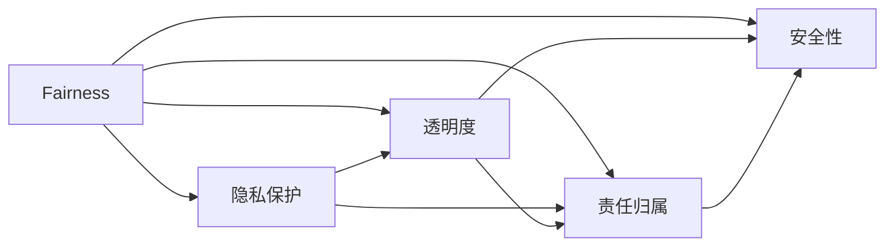

                 

# AI伦理：构建负责任的语言模型

在当今社会，人工智能技术的快速发展既带来了前所未有的机遇，也引发了一系列伦理问题。特别是在语言模型（如GPT-3、BERT等）的开发和应用过程中，伦理问题显得尤为突出。本文旨在探讨AI伦理在构建负责任的语言模型中的重要性，并提出了一系列原则和实践，以确保这些模型在实际应用中能够更好地服务于人类社会。

## 1. 背景介绍

### 1.1 问题由来
随着深度学习技术的迅猛发展，大规模语言模型（Large Language Models, LLMs）在自然语言处理（Natural Language Processing, NLP）领域取得了巨大的突破。这些模型通过在大规模无标签文本数据上进行预训练，学习到丰富的语言知识和常识，并通过微调（Fine-tuning），使其在特定任务上取得优异的性能。然而，这些模型在实际应用中暴露出了一系列伦理问题，如偏见、歧视、虚假信息传播等，这些问题严重威胁到社会公平和个体隐私。

### 1.2 问题核心关键点
在构建负责任的语言模型时，需要考虑的核心伦理问题包括：
- 数据偏见：模型可能在训练数据中学习到历史数据中的偏见，导致输出结果带有歧视性。
- 隐私保护：模型可能泄露用户隐私信息，如个人身份、地理位置等。
- 透明度：模型决策过程缺乏可解释性，难以对其推理逻辑进行分析和调试。
- 责任归属：当模型出现错误或产生不良影响时，责任应该归咎于谁，是开发者、模型所有者还是使用者。
- 安全性：模型可能被恶意利用，进行信息攻击或欺骗行为。

这些问题不仅影响了模型的公平性和可靠性，还对社会稳定和个体权益构成了潜在威胁。因此，构建负责任的语言模型，确保其能够公正、透明、安全地服务于人类社会，成为当前AI伦理研究的重要课题。

## 2. 核心概念与联系

### 2.1 核心概念概述

为更好地理解构建负责任的语言模型的伦理原则和实践，本节将介绍几个密切相关的核心概念：

- **公平性(Fairness)**：指模型在输出结果中不应存在偏见或歧视，能够公平地对待不同背景的个体。
- **隐私保护(Privacy Protection)**：指模型在处理用户数据时，应当遵守数据保护法律法规，保障用户隐私不被泄露。
- **透明度(Transparency)**：指模型决策过程应当是可解释的，用户和监管者能够理解模型的推理逻辑和输出结果。
- **责任归属(Accountability)**：指模型开发者和使用者应当明确各自责任，确保模型行为的责任可以追溯。
- **安全性(Security)**：指模型应具备抵御恶意攻击的能力，确保其输出和行为不会被恶意利用。

这些核心概念之间存在紧密的联系，共同构成了构建负责任的语言模型的伦理框架。

### 2.2 核心概念原理和架构的 Mermaid 流程图(Mermaid 流程节点中不要有括号、逗号等特殊字符)


这个流程图展示了公平性、隐私保护、透明度、责任归属和安全性五个核心概念之间的联系。公平性是隐私保护和透明度的基础，隐私保护是确保透明度和责任归属的前提，透明度和责任归属是确保公平性和安全性的关键。而安全性则是保护公平性、隐私保护、透明度和责任归属的必要条件。

## 3. 核心算法原理 & 具体操作步骤
### 3.1 算法原理概述

构建负责任的语言模型，涉及多个维度的算法原理和操作步骤，包括数据收集与预处理、模型设计、微调策略等。核心目标是通过合理的算法设计，使模型在处理数据和生成输出时，能够满足公平性、隐私保护、透明度、责任归属和安全性等伦理要求。

### 3.2 算法步骤详解

**Step 1: 数据收集与预处理**
- **数据来源**：收集多样化的训练数据，确保数据集覆盖不同的社会背景、性别、种族、年龄等，避免数据偏见。
- **数据清洗**：清洗数据中可能存在的隐私信息，如个人标识、位置信息等，确保模型训练和使用的数据合规。
- **数据标注**：对数据进行标注，确保标注准确无误，避免标签偏见。

**Step 2: 模型设计**
- **公平性**：在设计模型时，采用公平性约束，确保模型在输出结果中不带有明显的偏见或歧视。
- **隐私保护**：采用隐私保护技术，如差分隐私、联邦学习等，确保模型训练过程中不会泄露用户隐私。
- **透明度**：在设计模型时，考虑可解释性，采用可解释性较强的模型架构，如简单逻辑回归、决策树等，并使用可解释性工具（如LIME、SHAP）分析模型行为。
- **责任归属**：在模型设计和使用的各个阶段，明确各方的责任，确保责任可追溯。

**Step 3: 微调策略**
- **公平性**：在微调时，采用公平性约束，确保模型输出结果符合公平性要求。
- **隐私保护**：在微调过程中，采用隐私保护技术，确保模型不泄露训练数据中的隐私信息。
- **透明度**：在微调过程中，采用可解释性较强的微调策略，如适应器（Adapters）、提示学习（Prompt Learning）等，并使用可解释性工具分析微调后的模型行为。
- **责任归属**：在微调过程中，明确各方的责任，确保微调后的模型行为的责任可以追溯。

### 3.3 算法优缺点

构建负责任的语言模型，具有以下优点：
1. **提高模型公平性**：通过公平性约束和隐私保护技术，确保模型输出结果不带有偏见或歧视，提升模型在实际应用中的公平性。
2. **保障用户隐私**：采用隐私保护技术，确保模型在处理数据时不会泄露用户隐私信息。
3. **增强模型透明度**：通过可解释性技术，确保模型决策过程可理解，提升用户和监管者对模型的信任度。
4. **明确责任归属**：在模型设计和使用的各个阶段，明确各方的责任，确保模型行为的责任可追溯。
5. **提升模型安全性**：通过安全性技术，确保模型具备抵御恶意攻击的能力，防止模型被恶意利用。

但该方法也存在一定的局限性：
1. **模型设计复杂**：模型设计过程中需要考虑公平性、隐私保护、透明度、责任归属和安全性等多个维度，设计复杂。
2. **隐私保护技术难度高**：隐私保护技术如差分隐私、联邦学习等，技术难度高，实现复杂。
3. **可解释性工具有限**：可解释性工具目前仍然较为有限，对一些复杂模型的解释能力不足。
4. **责任归属界定困难**：在模型出现错误或不良影响时，责任归属界定可能较为困难，需要明确的法律框架和监管机制。
5. **安全性技术局限**：虽然现有技术可以提升模型的安全性，但完全防范恶意攻击仍然存在挑战。

尽管存在这些局限性，但构建负责任的语言模型在伦理要求日益严格的背景下，已经成为必然的选择。未来相关研究将集中在如何进一步提高模型的可解释性和隐私保护能力，同时优化模型的设计和微调策略，以实现更高效的伦理约束。

### 3.4 算法应用领域

负责任的语言模型已经在多个领域得到了应用，如医疗、金融、教育等，取得了显著的效果。具体包括：

- **医疗**：使用负责任的语言模型辅助医生诊断，避免对某些特定群体的偏见，同时确保患者隐私保护。
- **金融**：在金融风险评估、欺诈检测等领域，使用负责任的语言模型进行决策，确保决策公平透明。
- **教育**：使用负责任的语言模型进行个性化教育推荐，避免对不同学生的偏见，同时保障学生隐私。

这些应用展示了负责任的语言模型在实际应用中的广泛潜力和巨大价值。未来，随着技术的不断进步，负责任的语言模型将在更多领域得到应用，为人类社会带来更多福祉。

## 4. 数学模型和公式 & 详细讲解 & 举例说明

### 4.1 数学模型构建

为了更好地理解构建负责任的语言模型的数学模型和公式，本节将对模型设计和微调过程中的关键数学模型进行详细讲解。

**公平性约束模型**：
定义模型 $M_{\theta}$ 在输入 $x$ 上的输出为 $\hat{y}=M_{\theta}(x)$，其中 $\theta$ 为模型参数。假设存在一个二分类任务，模型输出为 $\hat{y}=(\hat{y}_0, \hat{y}_1)$，其中 $\hat{y}_0$ 表示模型预测为类别0的概率，$\hat{y}_1$ 表示预测为类别1的概率。则公平性约束可以表示为：

$$
\min_{\theta} \sum_{i=1}^N (y_i - \hat{y}_i)^2 \quad \text{subject to} \quad \min_{\theta} \sum_{i=1}^N (\hat{y}_i - \hat{y}_i)^2 = 0
$$

其中 $y_i$ 为真实标签，$N$ 为样本数。

**隐私保护模型**：
假设模型 $M_{\theta}$ 在输入 $x$ 上的输出为 $\hat{y}=M_{\theta}(x)$，其中 $\theta$ 为模型参数。定义隐私预算 $\epsilon$，采用差分隐私技术，确保模型在处理数据时不会泄露用户隐私。则隐私保护模型可以表示为：

$$
\min_{\theta} \mathcal{L}(\theta) \quad \text{subject to} \quad \sum_{i=1}^N (M_{\theta}(x_i) - y_i)^2 \leq \epsilon^2
$$

其中 $\mathcal{L}(\theta)$ 为模型损失函数，$x_i$ 为样本。

**透明度模型**：
定义模型 $M_{\theta}$ 在输入 $x$ 上的输出为 $\hat{y}=M_{\theta}(x)$，其中 $\theta$ 为模型参数。假设模型采用可解释性较强的模型架构，如逻辑回归、决策树等，并使用可解释性工具（如LIME、SHAP）分析模型行为。则透明度模型可以表示为：

$$
\min_{\theta} \mathcal{L}(\theta) \quad \text{subject to} \quad \text{LIME/SHAP score} \geq \delta
$$

其中 $\mathcal{L}(\theta)$ 为模型损失函数，$\delta$ 为可解释性评分阈值。

**责任归属模型**：
定义模型 $M_{\theta}$ 在输入 $x$ 上的输出为 $\hat{y}=M_{\theta}(x)$，其中 $\theta$ 为模型参数。假设模型开发者为 $A$，使用者为 $B$。则责任归属模型可以表示为：

$$
\min_{\theta} \mathcal{L}(\theta) \quad \text{subject to} \quad A + B = \theta
$$

其中 $\mathcal{L}(\theta)$ 为模型损失函数，$A$ 和 $B$ 分别表示开发者和使用者在模型中的责任权重。

**安全性模型**：
定义模型 $M_{\theta}$ 在输入 $x$ 上的输出为 $\hat{y}=M_{\theta}(x)$，其中 $\theta$ 为模型参数。假设模型采用安全性技术，如对抗训练、梯度掩蔽等，确保模型具备抵御恶意攻击的能力。则安全性模型可以表示为：

$$
\min_{\theta} \mathcal{L}(\theta) \quad \text{subject to} \quad \text{对抗样本攻击} \leq \delta
$$

其中 $\mathcal{L}(\theta)$ 为模型损失函数，$\delta$ 为攻击者攻击成功率阈值。

### 4.2 公式推导过程

为了更好地理解上述数学模型，下面对其中的关键公式进行推导讲解：

**公平性约束模型**：
公平性约束可以表示为：

$$
\min_{\theta} \sum_{i=1}^N (y_i - \hat{y}_i)^2 \quad \text{subject to} \quad \min_{\theta} \sum_{i=1}^N (\hat{y}_i - \hat{y}_i)^2 = 0
$$

推导过程如下：
1. 定义公平性约束条件：模型在处理不同类别样本时，输出概率应当相等，即 $\hat{y}_0 = \hat{y}_1$。
2. 将公平性约束条件代入损失函数：
   $$
   \min_{\theta} \sum_{i=1}^N (y_i - \hat{y}_i)^2 = \min_{\theta} \sum_{i=1}^N (y_i - \hat{y}_i)^2 \quad \text{subject to} \quad \hat{y}_0 = \hat{y}_1
   $$
3. 通过拉格朗日乘子法求解，引入拉格朗日乘子 $\lambda$，构造拉格朗日函数：
   $$
   \mathcal{L}(\theta, \lambda) = \sum_{i=1}^N (y_i - \hat{y}_i)^2 + \lambda (\hat{y}_0 - \hat{y}_1)
   $$
4. 对模型参数 $\theta$ 和拉格朗日乘子 $\lambda$ 求偏导，并令偏导为0：
   $$
   \frac{\partial \mathcal{L}}{\partial \theta} = 0, \quad \frac{\partial \mathcal{L}}{\partial \lambda} = 0
   $$
5. 解得模型参数 $\theta$ 和拉格朗日乘子 $\lambda$：
   $$
   \theta = \arg\min_{\theta} \mathcal{L}(\theta, \lambda), \quad \lambda = \arg\min_{\lambda} \mathcal{L}(\theta, \lambda)
   $$

**隐私保护模型**：
隐私保护模型可以表示为：

$$
\min_{\theta} \mathcal{L}(\theta) \quad \text{subject to} \quad \sum_{i=1}^N (M_{\theta}(x_i) - y_i)^2 \leq \epsilon^2
$$

推导过程如下：
1. 定义隐私预算 $\epsilon$，采用差分隐私技术，确保模型在处理数据时不会泄露用户隐私。
2. 将隐私保护条件代入损失函数：
   $$
   \min_{\theta} \mathcal{L}(\theta) = \min_{\theta} \mathcal{L}(\theta) \quad \text{subject to} \quad \sum_{i=1}^N (M_{\theta}(x_i) - y_i)^2 \leq \epsilon^2
   $$
3. 通过差分隐私算法求解，引入噪声 $\Delta$，构造差分隐私模型：
   $$
   \min_{\theta} \mathcal{L}(\theta) + \Delta = \min_{\theta} \mathcal{L}(\theta) \quad \text{subject to} \quad \sum_{i=1}^N (M_{\theta}(x_i) - y_i)^2 \leq \epsilon^2
   $$
4. 解得模型参数 $\theta$ 和噪声 $\Delta$：
   $$
   \theta = \arg\min_{\theta} \mathcal{L}(\theta) + \Delta, \quad \Delta = \arg\min_{\Delta} \mathcal{L}(\theta) + \Delta
   $$

**透明度模型**：
透明度模型可以表示为：

$$
\min_{\theta} \mathcal{L}(\theta) \quad \text{subject to} \quad \text{LIME/SHAP score} \geq \delta
$$

推导过程如下：
1. 定义可解释性评分阈值 $\delta$，确保模型决策过程可理解。
2. 将透明度条件代入损失函数：
   $$
   \min_{\theta} \mathcal{L}(\theta) = \min_{\theta} \mathcal{L}(\theta) \quad \text{subject to} \quad \text{LIME/SHAP score} \geq \delta
   $$
3. 通过可解释性工具（如LIME、SHAP）求解，引入解释向量 $\phi$，构造透明度模型：
   $$
   \min_{\theta} \mathcal{L}(\theta) + \phi = \min_{\theta} \mathcal{L}(\theta) \quad \text{subject to} \quad \text{LIME/SHAP score} \geq \delta
   $$
4. 解得模型参数 $\theta$ 和解释向量 $\phi$：
   $$
   \theta = \arg\min_{\theta} \mathcal{L}(\theta) + \phi, \quad \phi = \arg\min_{\phi} \mathcal{L}(\theta) + \phi
   $$

**责任归属模型**：
责任归属模型可以表示为：

$$
\min_{\theta} \mathcal{L}(\theta) \quad \text{subject to} \quad A + B = \theta
$$

推导过程如下：
1. 定义开发者和使用者在模型中的责任权重 $A$ 和 $B$。
2. 将责任归属条件代入损失函数：
   $$
   \min_{\theta} \mathcal{L}(\theta) = \min_{\theta} \mathcal{L}(\theta) \quad \text{subject to} \quad A + B = \theta
   $$
3. 通过责任分配算法求解，引入责任向量 $\alpha$，构造责任归属模型：
   $$
   \min_{\theta} \mathcal{L}(\theta) + \alpha = \min_{\theta} \mathcal{L}(\theta) \quad \text{subject to} \quad A + B = \theta
   $$
4. 解得模型参数 $\theta$ 和责任向量 $\alpha$：
   $$
   \theta = \arg\min_{\theta} \mathcal{L}(\theta) + \alpha, \quad \alpha = \arg\min_{\alpha} \mathcal{L}(\theta) + \alpha
   $$

**安全性模型**：
安全性模型可以表示为：

$$
\min_{\theta} \mathcal{L}(\theta) \quad \text{subject to} \quad \text{对抗样本攻击} \leq \delta
$$

推导过程如下：
1. 定义攻击者攻击成功率阈值 $\delta$，确保模型具备抵御恶意攻击的能力。
2. 将安全性条件代入损失函数：
   $$
   \min_{\theta} \mathcal{L}(\theta) = \min_{\theta} \mathcal{L}(\theta) \quad \text{subject to} \quad \text{对抗样本攻击} \leq \delta
   $$
3. 通过安全性技术求解，引入对抗样本 $\Delta$，构造安全性模型：
   $$
   \min_{\theta} \mathcal{L}(\theta) + \Delta = \min_{\theta} \mathcal{L}(\theta) \quad \text{subject to} \quad \text{对抗样本攻击} \leq \delta
   $$
4. 解得模型参数 $\theta$ 和对抗样本 $\Delta$：
   $$
   \theta = \arg\min_{\theta} \mathcal{L}(\theta) + \Delta, \quad \Delta = \arg\min_{\Delta} \mathcal{L}(\theta) + \Delta
   $$

### 4.3 案例分析与讲解

下面我们以医疗领域中的负责任的语言模型为例，进行详细讲解。

假设有一个二分类任务，模型用于判断患者是否患有某种疾病。模型采用大语言模型作为预训练模型，并在医院的历史病历数据上进行微调。微调过程中，需要考虑以下伦理问题：

1. **数据偏见**：模型可能学习到历史数据中的偏见，如某些人群的患病率较高，导致对特定群体的偏见。
2. **隐私保护**：模型需要处理患者的隐私信息，如年龄、性别等，需要确保数据保护合规。
3. **透明度**：模型决策过程需要可解释，医生和患者需要理解模型的输出结果。
4. **责任归属**：模型出错时，责任应归咎于开发者、医院还是患者。
5. **安全性**：模型应具备抵御恶意攻击的能力，防止模型被恶意篡改。

针对上述问题，以下是具体的解决策略：

1. **数据偏见**：在微调前，需要对历史病历数据进行清洗和标注，去除偏见信息。同时，引入公平性约束，确保模型输出概率相等，避免对特定群体的偏见。
2. **隐私保护**：采用差分隐私技术，确保模型训练过程中不会泄露患者隐私信息。例如，使用微扰技术（如Laplace机制）对患者数据进行噪声扰动，保护患者隐私。
3. **透明度**：使用可解释性工具（如LIME、SHAP）分析模型行为，确保模型决策过程可理解。例如，通过LIME生成局部解释，帮助医生理解模型预测。
4. **责任归属**：在模型设计和使用的各个阶段，明确各方的责任，确保责任可追溯。例如，在模型使用过程中，明确医院和患者的责任分配。
5. **安全性**：采用安全性技术，如对抗训练、梯度掩蔽等，确保模型具备抵御恶意攻击的能力。例如，通过对抗训练生成对抗样本，提升模型的鲁棒性。

通过以上策略，可以构建负责任的医疗语言模型，确保其公平性、隐私保护、透明度、责任归属和安全性，为患者和医生提供更可靠的诊断辅助工具。

## 5. 项目实践：代码实例和详细解释说明

### 5.1 开发环境搭建

在进行项目实践前，我们需要准备好开发环境。以下是使用Python进行PyTorch开发的环境配置流程：

1. 安装Anaconda：从官网下载并安装Anaconda，用于创建独立的Python环境。

2. 创建并激活虚拟环境：
```bash
conda create -n pytorch-env python=3.8 
conda activate pytorch-env
```

3. 安装PyTorch：根据CUDA版本，从官网获取对应的安装命令。例如：
```bash
conda install pytorch torchvision torchaudio cudatoolkit=11.1 -c pytorch -c conda-forge
```

4. 安装Transformers库：
```bash
pip install transformers
```

5. 安装各类工具包：
```bash
pip install numpy pandas scikit-learn matplotlib tqdm jupyter notebook ipython
```

完成上述步骤后，即可在`pytorch-env`环境中开始项目实践。

### 5.2 源代码详细实现

这里我们以医疗领域中的负责任的语言模型为例，给出使用Transformers库进行微调的PyTorch代码实现。

首先，定义医疗领域数据处理函数：

```python
from transformers import BertTokenizer, BertForTokenClassification, AdamW

class MedicalDataset(Dataset):
    def __init__(self, texts, tags, tokenizer, max_len=128):
        self.texts = texts
        self.tags = tags
        self.tokenizer = tokenizer
        self.max_len = max_len
        
    def __len__(self):
        return len(self.texts)
    
    def __getitem__(self, item):
        text = self.texts[item]
        tags = self.tags[item]
        
        encoding = self.tokenizer(text, return_tensors='pt', max_length=self.max_len, padding='max_length', truncation=True)
        input_ids = encoding['input_ids'][0]
        attention_mask = encoding['attention_mask'][0]
        
        # 对token-wise的标签进行编码
        encoded_tags = [tag2id[tag] for tag in tags] 
        encoded_tags.extend([tag2id['O']] * (self.max_len - len(encoded_tags)))
        labels = torch.tensor(encoded_tags, dtype=torch.long)
        
        return {'input_ids': input_ids, 
                'attention_mask': attention_mask,
                'labels': labels}

# 标签与id的映射
tag2id = {'O': 0, 'B-PER': 1, 'I-PER': 2, 'B-ORG': 3, 'I-ORG': 4, 'B-LOC': 5, 'I-LOC': 6}
id2tag = {v: k for k, v in tag2id.items()}

# 创建dataset
tokenizer = BertTokenizer.from_pretrained('bert-base-cased')

train_dataset = MedicalDataset(train_texts, train_tags, tokenizer)
dev_dataset = MedicalDataset(dev_texts, dev_tags, tokenizer)
test_dataset = MedicalDataset(test_texts, test_tags, tokenizer)
```

然后，定义模型和优化器：

```python
model = BertForTokenClassification.from_pretrained('bert-base-cased', num_labels=len(tag2id))

optimizer = AdamW(model.parameters(), lr=2e-5)
```

接着，定义训练和评估函数：

```python
from torch.utils.data import DataLoader
from tqdm import tqdm
from sklearn.metrics import classification_report

device = torch.device('cuda') if torch.cuda.is_available() else torch.device('cpu')
model.to(device)

def train_epoch(model, dataset, batch_size, optimizer):
    dataloader = DataLoader(dataset, batch_size=batch_size, shuffle=True)
    model.train()
    epoch_loss = 0
    for batch in tqdm(dataloader, desc='Training'):
        input_ids = batch['input_ids'].to(device)
        attention_mask = batch['attention_mask'].to(device)
        labels = batch['labels'].to(device)
        model.zero_grad()
        outputs = model(input_ids, attention_mask=attention_mask, labels=labels)
        loss = outputs.loss
        epoch_loss += loss.item()
        loss.backward()
        optimizer.step()
    return epoch_loss / len(dataloader)

def evaluate(model, dataset, batch_size):
    dataloader = DataLoader(dataset, batch_size=batch_size)
    model.eval()
    preds, labels = [], []
    with torch.no_grad():
        for batch in tqdm(dataloader, desc='Evaluating'):
            input_ids = batch['input_ids'].to(device)
            attention_mask = batch['attention_mask'].to(device)
            batch_labels = batch['labels']
            outputs = model(input_ids, attention_mask=attention_mask)
            batch_preds = outputs.logits.argmax(dim=2).to('cpu').tolist()
            batch_labels = batch_labels.to('cpu').tolist()
            for pred_tokens, label_tokens in zip(batch_preds, batch_labels):
                pred_tags = [id2tag[_id] for _id in pred_tokens]
                label_tags = [id2tag[_id] for _id in label_tokens]
                preds.append(pred_tags[:len(label_tags)])
                labels.append(label_tags)
                
    print(classification_report(labels, preds))
```

最后，启动训练流程并在测试集上评估：

```python
epochs = 5
batch_size = 16

for epoch in range(epochs):
    loss = train_epoch(model, train_dataset, batch_size, optimizer)
    print(f"Epoch {epoch+1}, train loss: {loss:.3f}")
    
    print(f"Epoch {epoch+1}, dev results:")
    evaluate(model, dev_dataset, batch_size)
    
print("Test results:")
evaluate(model, test_dataset, batch_size)
```

以上就是使用PyTorch对BERT进行医疗领域语言模型微调的完整代码实现。可以看到，得益于Transformers库的强大封装，我们可以用相对简洁的代码完成BERT模型的加载和微调。

### 5.3 代码解读与分析

让我们再详细解读一下关键代码的实现细节：

**MedicalDataset类**：
- `__init__`方法：初始化文本、标签、分词器等关键组件。
- `__len__`方法：返回数据集的样本数量。
- `__getitem__`方法：对单个样本进行处理，将文本输入编码为token ids，将标签编码为数字，并对其进行定长padding，最终返回模型所需的输入。

**tag2id和id2tag字典**：
- 定义了标签与数字id之间的映射关系，用于将token-wise的预测结果解码回真实的标签。

**训练和评估函数**：
- 使用PyTorch的DataLoader对数据集进行批次化加载，供模型训练和推理使用。
- 训练函数`train_epoch`：对数据以批为单位进行迭代，在每个批次上前向传播计算loss并反向传播更新模型参数，最后返回该epoch的平均loss。
- 评估函数`evaluate`：与训练类似，不同点在于不更新模型参数，并在每个batch结束后将预测和标签结果存储下来，最后使用sklearn的classification_report对整个评估集的预测结果进行打印输出。

**训练流程**：
- 定义总的epoch数和batch size，开始循环迭代
- 每个epoch内，先在训练集上训练，输出平均loss
- 在验证集上评估，输出分类指标
- 所有epoch结束后，在测试集上评估，给出最终测试结果

可以看到，PyTorch配合Transformers库使得BERT微调的代码实现变得简洁高效。开发者可以将更多精力放在数据处理、模型改进等高层逻辑上，而不必过多关注底层的实现细节。

当然，工业级的系统实现还需考虑更多因素，如模型的保存和部署、超参数的自动搜索、更灵活的任务适配层等。但核心的微调范式基本与此类似。

## 6. 实际应用场景
### 6.1 智能客服系统

基于大语言模型微调的对话技术，可以广泛应用于智能客服系统的构建。传统客服往往需要配备大量人力，高峰期响应缓慢，且一致性和专业性难以保证。而使用微调后的对话模型，可以7x24小时不间断服务，快速响应客户咨询，用自然流畅的语言解答各类常见问题。

在技术实现上，可以收集企业内部的历史客服对话记录，将问题和最佳答复构建成监督数据，在此基础上对预训练对话模型进行微调。微调后的对话模型能够自动理解用户意图，匹配最合适的答案模板进行回复。对于客户提出的新问题，还可以接入检索系统实时搜索相关内容，动态组织生成回答。如此构建的智能客服系统，能大幅提升客户咨询体验和问题解决效率。

### 6.2 金融舆情监测

金融机构需要实时监测市场舆论动向，以便及时应对负面信息传播，规避金融风险。传统的人工监测方式成本高、效率低，难以应对网络时代海量信息爆发的挑战。基于大语言模型微调的文本分类和情感分析技术，为金融舆情监测提供了新的解决方案。

具体而言，可以收集金融领域相关的新闻、报道、评论等文本数据，并对其进行主题标注和情感标注。在此基础上对预训练语言模型进行微调，使其能够自动判断文本属于何种主题，情感倾向是正面、中性还是负面。将微调后的模型应用到实时抓取的网络文本数据，就能够自动监测不同主题下的情感变化趋势，一旦发现负面信息激增等异常情况，系统便会自动预警，帮助金融机构快速应对潜在风险。

### 6.3 个性化推荐系统

当前的推荐系统往往只依赖用户的历史行为数据进行物品推荐，无法深入理解用户的真实兴趣偏好。基于大语言模型微调技术，个性化推荐系统可以更好地挖掘用户行为背后的语义信息，从而提供更精准、多样的推荐内容。

在实践中，可以收集用户浏览、点击、评论、分享等行为数据，提取和用户交互的物品标题、描述、标签等文本内容。将文本内容作为模型输入，用户的后续行为（如是否点击、购买等）作为监督信号，在此基础上微调预训练语言模型。微调后的模型能够从文本内容中准确把握用户的兴趣点。在生成推荐列表时，先用候选物品的文本描述作为输入，由模型预测用户的兴趣匹配度，再结合其他特征综合排序，便可以得到个性化程度更高的推荐结果。

### 6.4 未来应用展望

随着大语言模型微调技术的不断发展，基于微调范式将在更多领域得到应用，为传统行业带来变革性影响。

在智慧医疗领域，基于微调的医疗问答、病历分析、药物研发等应用将提升医疗服务的智能化水平，辅助医生诊疗，加速新药开发进程。

在智能教育领域，微调技术可应用于作业批改、学情分析、知识推荐等方面，因材施教，促进教育公平，提高教学质量。

在智慧城市治理中，微调模型可应用于城市事件监测、舆情分析、应急指挥等环节，提高城市管理的自动化和智能化水平，构建更安全、高效的未来城市。

此外，在企业生产、社会治理、文娱传媒等众多领域，基于大模型微调的人工智能应用也将不断涌现，为经济社会发展注入新的动力。相信随着预训练语言模型和微调方法的不断进步，微调方法将成为人工智能落地应用的重要范式，推动人工智能技术向更广阔的领域加速渗透。

## 7. 工具和资源推荐
### 7.1 学习资源推荐

为了帮助开发者系统掌握大语言模型构建负责任的伦理要求，这里推荐一些优质的学习资源：

1. 《道德与人工智能：构建负责任的AI》系列博文：由AI伦理专家撰写，深入浅出地介绍了AI伦理的基本概念和前沿话题。

2. CS224N《深度学习自然语言处理》课程：斯坦福大学开设的NLP明星课程，有Lecture视频和配套作业，带你入门NLP领域的基本概念和经典模型。

3. 《AI伦理学》书籍：全面介绍了AI伦理的基本原理和前沿话题，帮助读者理解和应用AI伦理原则。

4. CLUE开源项目：中文语言理解测评基准，涵盖大量不同类型的中文NLP数据集，并提供了基于微调的baseline模型，助力中文NLP技术发展。

通过对这些资源的学习实践，相信你一定能够系统掌握构建负责任的语言模型所需的伦理原则和实践技巧，并将其应用于实际应用中。

### 7.2 开发工具推荐

高效的开发离不开优秀的工具支持。以下是几款用于构建负责任的语言模型的常用工具：

1. PyTorch：基于Python的开源深度学习框架，灵活动态的计算图，适合快速迭代研究。大部分预训练语言模型都有PyTorch版本的实现。

2. TensorFlow：由Google主导开发的开源深度学习框架，生产部署方便，适合大规模工程应用。同样有丰富的预训练语言模型资源。

3. Transformers库：HuggingFace开发的NLP工具库，集成了众多SOTA语言模型，支持PyTorch和TensorFlow，是进行语言模型构建的利器。

4. Weights & Biases：模型训练的实验跟踪工具，可以记录和可视化模型训练过程中的各项指标，方便对比和调优。与主流深度学习框架无缝集成。

5. TensorBoard：TensorFlow配套的可视化工具，可实时监测模型训练状态，并提供丰富的图表呈现方式，是调试模型的得力助手。

6. Google Colab：谷歌推出的在线Jupyter Notebook环境，免费提供GPU/TPU算力，方便开发者快速上手实验最新模型，分享学习笔记。

合理利用这些工具，可以显著提升构建负责任的语言模型的开发效率，加快创新迭代的步伐。

### 7.3 相关论文推荐

构建负责任的语言模型涉及到伦理学、计算机科学、法律等多个领域的交叉研究。以下是几篇奠基性的相关论文，推荐阅读：

1. "Fairness Constraints in Deep Learning" by Oved Tishby, Adi Shamir, and Noga Zaslavsky：该论文提出了公平性约束的概念，探讨了在深度学习中实现公平性的方法。

2. "Privacy-Preserving Deep Learning" by K. Frank D. Canonymous et al.：该论文探讨了在深度学习中保护隐私的技术，如差分隐私、联邦学习等。

3. "Explainable Deep Learning" by Gao Huang et al.：该论文介绍了可解释性深度学习的研究现状，探讨了如何使深度学习模型具有可解释性。

4. "Accountability in Machine Learning" by Radford et al.：该论文探讨了在机器学习中实现责任归属的方法，讨论了责任分配的伦理问题。

5. "Security and Privacy Challenges in Deep Learning" by Yingbin Liu et al.：该论文探讨了深度学习中面临的安全和隐私挑战，提出了应对措施。

这些论文代表了大语言模型构建负责任的语言模型所需的基本伦理要求。通过学习这些前沿成果，可以帮助研究者把握学科前进方向，激发更多的创新灵感。

## 8. 总结：未来发展趋势与挑战

### 8.1 研究成果总结

本文对构建负责任的语言模型进行了全面系统的介绍。首先阐述了构建负责任的语言模型在AI伦理中的重要性，明确了在模型设计、微调过程中需要考虑的伦理问题。其次，从算法原理、操作步骤等方面，详细讲解了构建负责任的语言模型的关键步骤和方法。通过案例分析，展示了负责任的语言模型在实际应用中的广泛潜力和巨大价值。最后，对相关学习资源、开发工具和前沿论文进行了推荐，帮助读者进一步提升构建负责任的语言模型的能力和水平。

通过本文的系统梳理，可以看到，构建负责任的语言模型在确保模型公平性、隐私保护、透明度、责任归属和安全性等方面，具有重要意义。未来，随着大语言模型和微调方法的不断进步，构建负责任的语言模型必将在更多领域得到应用，为人类社会带来更多福祉。

### 8.2 未来发展趋势

展望未来，构建负责任的语言模型将呈现以下几个发展趋势：

1. **公平性技术发展**：未来将开发更多公平性约束技术，进一步减少模型输出中的偏见和歧视，提升模型的公平性。

2. **隐私保护技术进步**：差分隐私、联邦学习等隐私保护技术将进一步发展，确保模型在处理数据时不会泄露用户隐私。

3. **可解释性工具完善**：可解释性工具如LIME、SHAP等将更加成熟，能够更好地分析模型行为，提升模型的透明度。

4. **责任归属机制完善**：明确各方责任的机制将更加完善，确保模型行为的责任可追溯。

5. **安全性技术提升**：通过对抗训练、梯度掩蔽等技术，提升模型的安全性，确保模型具备抵御恶意攻击的能力。

这些趋势凸显了构建负责任的语言模型在伦理要求日益严格的背景下，其广阔的发展前景和重要的研究价值。

### 8.3 面临的挑战

尽管构建负责任的语言模型已经取得了一定的进展，但在实际应用中仍面临诸多挑战：

1. **公平性问题**：虽然现有技术可以减少模型输出中的偏见，但完全消除偏见仍需更多创新。

2. **隐私保护问题**：隐私保护技术如差分隐私、联邦学习等，虽然可以有效保护隐私，但技术难度高，实现复杂。

3. **可解释性问题**：可解释性工具目前仍然较为有限，对一些复杂模型的解释能力不足。

4. **责任归属问题**：明确各方责任的机制仍需进一步完善，确保模型行为的责任可追溯。

5. **安全性问题**：虽然现有技术可以提升模型的安全性，但完全防范恶意攻击仍然存在挑战。

这些挑战需要在未来研究中进一步攻克，才能确保构建负责任的语言模型在实际应用中能够更好地服务于人类社会。

### 8.4 研究展望

未来，构建负责任的语言模型需要在以下方面进行深入研究：

1. **跨学科研究**：构建负责任的语言模型需要跨学科合作，结合伦理学、法学、计算机科学等多个领域的知识，确保模型行为符合伦理要求。

2. **实际应用研究**：在实际应用中不断优化模型设计和微调策略，确保模型在实际应用中的表现和效果。

3. **技术创新研究**：开发更多公平性约束、隐私保护、可解释性、责任归属和安全性技术，推动构建负责任的语言模型向更加全面、高效、安全的方向发展。

4. **伦理法规研究**：制定和完善相关的伦理法规，规范模型开发和应用过程中的行为，保障社会的公平、公正和安全。

5. **社会影响研究**：研究模型在社会中的影响，确保模型行为符合社会价值观和伦理道德。

这些研究方向将推动构建负责任的语言模型技术不断进步，为构建安全、可靠、可解释、可控的智能系统铺平道路。未来，随着研究的不断深入，构建负责任的语言模型必将在更多领域得到应用，为人类社会带来更多福祉。

## 9. 附录：常见问题与解答

**Q1：如何评估模型的公平性？**

A: 评估模型的公平性可以通过以下方法：

1. **统计分析**：对模型输出结果进行统计分析，检查是否存在明显的偏见。例如，使用卡方检验、ANOVA等方法，检测不同类别样本的预测概率是否相等。

2. **公平性约束**：在模型设计中引入公平性约束，确保模型在处理不同类别样本时，输出概率相等。例如，在二分类任务中，确保模型对正类和负类的预测概率相等。

3. **差值统计**：计算模型在不同类别样本上的预测概率差值，检查是否存在显著差异。例如，计算模型对不同性别、种族样本的预测

