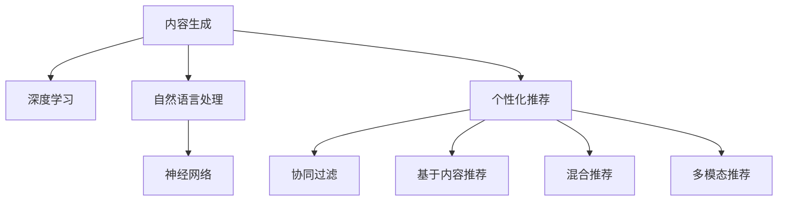

                 

# AI内容创作者的挑战：个性化需求的满足

> 关键词：内容生成,个性化推荐,自然语言处理,NLP,深度学习,神经网络

## 1. 背景介绍

### 1.1 问题由来

随着互联网和数字媒体的迅猛发展，内容创作变得越来越重要。无论是新闻媒体、电商网站、社交平台，还是博客和论坛，优质的内容不仅能吸引用户，还能提升品牌形象和用户忠诚度。然而，面对海量的内容需求和有限的创作资源，如何高效生成和推荐内容，成为人工智能领域的一项重要挑战。

传统的内容生成方式包括手动编写、雇佣内容创作者和批量生成等。手动编写效率低、成本高，难以应对大规模内容需求。雇佣内容创作者费用昂贵，内容质量也难以保证。批量生成虽然速度较快，但缺乏个性化和创意性。

为解决这些问题，人工智能内容生成技术应运而生。特别是近年来，深度学习和大规模预训练语言模型（如GPT-3、BERT等）的兴起，使得内容生成技术取得了突破性进展。通过预训练模型，可以自动生成自然流畅、语义丰富的文本内容。但如何更好地满足个性化需求，提升内容推荐和生成的效果，仍是当前亟待解决的问题。

### 1.2 问题核心关键点

个性化需求的核心在于如何理解用户的兴趣和偏好，并基于此生成或推荐合适的内容。而当前的大规模预训练语言模型虽然具备较强的语言理解和生成能力，但缺乏对用户个性化需求的精细理解，因此生成和推荐的内容往往难以精准满足用户的期待。

为提升内容推荐和生成的个性化程度，需要结合用户行为数据、上下文信息、多模态数据等进行综合分析，动态调整生成策略，才能最大化地满足用户的个性化需求。

## 2. 核心概念与联系

### 2.1 核心概念概述

为更好地理解如何满足个性化需求的内容生成技术，本节将介绍几个密切相关的核心概念：

- 内容生成(Content Generation)：指通过模型自动生成文本、图像、视频等形式的内容。常用的生成模型包括基于Transformer的文本生成模型、变分自编码器(Generative Adversarial Networks, GANs)、对抗生成网络等。
- 个性化推荐(Personalized Recommendation)：指根据用户的兴趣和行为数据，动态推荐用户可能感兴趣的内容。个性化推荐系统通常使用协同过滤、基于内容的推荐、混合推荐等方法。
- 自然语言处理(Natural Language Processing, NLP)：指使用计算机处理和理解人类语言的技术。包括文本分类、信息抽取、问答系统、文本生成等。
- 深度学习(Deep Learning)：指通过多层神经网络进行复杂模式识别的技术。深度学习在图像识别、语音识别、自然语言处理等领域取得了巨大成功。
- 神经网络(Neural Network)：指由大量神经元组成的网络结构，通过反向传播算法进行训练。常用的神经网络结构包括卷积神经网络(CNN)、循环神经网络(RNN)、长短时记忆网络(LSTM)等。

这些核心概念之间的逻辑关系可以通过以下Mermaid流程图来展示：



这个流程图展示了几者之间的联系：

1. 内容生成通过深度学习模型进行，神经网络是深度学习的核心组成部分。
2. 自然语言处理是深度学习的重要应用领域，主要用于文本理解和生成。
3. 个性化推荐通常基于深度学习模型，通过分析用户行为数据进行推荐。
4. 协同过滤、基于内容的推荐、混合推荐和多模态推荐等方法，都是实现个性化推荐的重要技术。

这些概念共同构成了内容生成和推荐的基础框架，使得人工智能内容创作者能够高效地生成和推荐内容。

## 3. 核心算法原理 & 具体操作步骤
### 3.1 算法原理概述

满足个性化需求的内容生成和推荐算法，其核心思想是结合深度学习、自然语言处理和个性化推荐技术，利用用户行为数据和上下文信息，动态调整生成策略，以最大化地满足用户需求。

形式化地，假设用户 $u$ 的历史行为数据为 $D_u=\{(x_i,y_i)\}_{i=1}^N$，其中 $x_i$ 为历史文本内容，$y_i$ 为对应的用户交互信息（如点击、评论、点赞等）。内容生成模型为 $M_{\theta}$，其中 $\theta$ 为模型参数。个性化推荐算法为 $R_u$。则目标是通过训练优化模型参数 $\theta$ 和算法参数 $\alpha$，使得：

$$
\min_{\theta,\alpha} \sum_{u=1}^U \mathcal{L}_u(M_{\theta}, R_u(D_u))
$$

其中 $\mathcal{L}_u$ 为用户 $u$ 的损失函数，衡量推荐结果与实际用户行为的一致性。

### 3.2 算法步骤详解

基于上述目标，个性化需求的内容生成和推荐算法一般包括以下几个关键步骤：

**Step 1: 数据预处理**

- 收集用户历史行为数据 $D_u$，包括浏览历史、点击行为、评论信息等。
- 对文本数据进行分词、去噪、归一化等预处理操作。
- 对用户行为数据进行标注，如点击次数、点赞次数等。

**Step 2: 模型训练**

- 利用用户行为数据 $D_u$ 训练生成模型 $M_{\theta}$，使其能够生成自然流畅、语义丰富的文本内容。
- 利用用户行为数据 $D_u$ 训练个性化推荐算法 $R_u$，使其能够根据用户行为数据推荐合适的内容。

**Step 3: 内容生成**

- 在用户输入查询 $q$ 后，根据上下文信息 $C$，生成与用户需求最匹配的内容 $c$。

**Step 4: 内容推荐**

- 利用个性化推荐算法 $R_u$，推荐用户可能感兴趣的其他内容 $c'$。

**Step 5: 用户反馈**

- 收集用户对生成和推荐内容的反馈，如点击率、满意度等，用于后续的模型调优。

通过这些步骤，可以动态调整生成和推荐策略，更好地满足用户的个性化需求。

### 3.3 算法优缺点

个性化需求的内容生成和推荐算法具有以下优点：

1. 高效性：通过深度学习模型和个性化推荐算法，能够自动生成和推荐内容，大大提高内容创作的效率。
2. 个性化：结合用户行为数据和上下文信息，可以动态调整生成策略，最大化地满足用户的个性化需求。
3. 灵活性：能够灵活调整生成策略，适应不同的应用场景和任务需求。
4. 可扩展性：在现有模型和算法基础上，可以通过扩展和优化，实现更复杂的应用需求。

同时，该方法也存在一些局限性：

1. 数据依赖：算法效果很大程度上依赖于标注数据的质量和数量，获取高质量标注数据的成本较高。
2. 模型复杂度：深度学习模型和推荐算法通常比较复杂，需要较大的计算资源和时间。
3. 泛化能力有限：当目标任务与预训练数据的分布差异较大时，算法的泛化能力可能受限。
4. 可解释性不足：深度学习模型的内部工作机制难以解释，难以进行调试和优化。

尽管存在这些局限性，但就目前而言，个性化需求的内容生成和推荐算法仍是内容创作和推荐领域的主流范式。未来相关研究的重点在于如何进一步降低数据依赖，提高算法的泛化能力和可解释性。

### 3.4 算法应用领域

个性化需求的内容生成和推荐算法已经在多个领域得到应用，例如：

- 新闻内容推荐：根据用户的历史浏览行为，推荐可能感兴趣的新闻内容。
- 商品推荐：根据用户的购买历史和浏览记录，推荐相关商品。
- 社交媒体内容推荐：根据用户的点赞、评论等行为，推荐可能感兴趣的内容。
- 智能客服：根据用户的询问内容，生成合适的回复，提高用户体验。
- 广告推荐：根据用户的行为数据，推荐相关广告内容，提升广告效果。

除了上述这些经典应用外，个性化需求的内容生成和推荐算法还被创新性地应用于更多场景中，如个性化翻译、自动化摘要、智能问答等，为内容创作和推荐带来了新的突破。

## 4. 数学模型和公式 & 详细讲解 & 举例说明（备注：数学公式请使用latex格式，latex嵌入文中独立段落使用 $$，段落内使用 $)
### 4.1 数学模型构建

本节将使用数学语言对个性化需求的内容生成和推荐算法进行更加严格的刻画。

记用户 $u$ 的历史行为数据为 $D_u=\{(x_i,y_i)\}_{i=1}^N$，其中 $x_i$ 为历史文本内容，$y_i$ 为对应的用户交互信息。内容生成模型为 $M_{\theta}$，其中 $\theta$ 为模型参数。个性化推荐算法为 $R_u$。则用户 $u$ 的损失函数 $\mathcal{L}_u$ 可以表示为：

$$
\mathcal{L}_u(M_{\theta}, R_u(D_u)) = \frac{1}{N}\sum_{i=1}^N \ell(M_{\theta}(x_i), R_u(x_i))
$$

其中 $\ell$ 为生成模型和推荐模型之间的损失函数，可以采用交叉熵损失或均方误差损失等。

### 4.2 公式推导过程

以下我们以文本生成和推荐任务为例，推导损失函数及其梯度的计算公式。

假设用户 $u$ 的当前查询为 $q$，上下文信息为 $C$。生成模型 $M_{\theta}$ 在输入 $q$ 和 $C$ 上的输出为 $\hat{x}=M_{\theta}(q,C)$，表示生成的文本内容。个性化推荐算法 $R_u$ 根据用户历史行为数据 $D_u$ 推荐的内容为 $c'$。则用户 $u$ 的损失函数 $\mathcal{L}_u$ 可以表示为：

$$
\mathcal{L}_u = -\frac{1}{N}\sum_{i=1}^N (y_i\log \frac{\hat{x}}{x_i} + (1-y_i)\log \frac{1-\hat{x}}{1-x_i})
$$

其中 $\hat{x}$ 为生成的文本内容，$x_i$ 为历史文本内容，$y_i$ 为对应的用户交互信息。

根据链式法则，损失函数对生成模型参数 $\theta$ 的梯度为：

$$
\frac{\partial \mathcal{L}_u}{\partial \theta} = -\frac{1}{N}\sum_{i=1}^N (\frac{y_i}{\hat{x}}-\frac{1-y_i}{1-\hat{x}}) \frac{\partial \hat{x}}{\partial \theta}
$$

其中 $\frac{\partial \hat{x}}{\partial \theta}$ 可进一步递归展开，利用自动微分技术完成计算。

在得到损失函数的梯度后，即可带入参数更新公式，完成模型的迭代优化。重复上述过程直至收敛，最终得到适应个性化需求的内容生成和推荐模型参数 $\theta$。

## 5. 项目实践：代码实例和详细解释说明
### 5.1 开发环境搭建

在进行内容生成和推荐实践前，我们需要准备好开发环境。以下是使用Python进行PyTorch开发的环境配置流程：

1. 安装Anaconda：从官网下载并安装Anaconda，用于创建独立的Python环境。

2. 创建并激活虚拟环境：
```bash
conda create -n pytorch-env python=3.8 
conda activate pytorch-env
```

3. 安装PyTorch：根据CUDA版本，从官网获取对应的安装命令。例如：
```bash
conda install pytorch torchvision torchaudio cudatoolkit=11.1 -c pytorch -c conda-forge
```

4. 安装相关库：
```bash
pip install pandas scikit-learn tqdm numpy jupyter notebook
```

完成上述步骤后，即可在`pytorch-env`环境中开始内容生成和推荐实践。

### 5.2 源代码详细实现

这里我们以商品推荐任务为例，给出使用PyTorch实现的内容推荐模型的代码实现。

首先，定义商品推荐模型的类：

```python
import torch.nn as nn
import torch
import torch.nn.functional as F

class Recommender(nn.Module):
    def __init__(self, input_dim, output_dim):
        super(Recommender, self).__init__()
        self.fc1 = nn.Linear(input_dim, 64)
        self.fc2 = nn.Linear(64, output_dim)
        self.epsilon = 1e-12

    def forward(self, x):
        x = F.relu(self.fc1(x))
        x = self.fc2(x)
        return F.softmax(x, dim=1)
```

然后，定义训练和评估函数：

```python
def train(model, train_data, train_labels, optimizer, num_epochs, batch_size):
    model.train()
    for epoch in range(num_epochs):
        for i in range(0, len(train_data), batch_size):
            start = i
            end = min(start+batch_size, len(train_data))
            batch_x = train_data[start:end]
            batch_y = train_labels[start:end]
            optimizer.zero_grad()
            outputs = model(batch_x)
            loss = F.nll_loss(outputs, batch_y)
            loss.backward()
            optimizer.step()
    return model

def evaluate(model, test_data, test_labels):
    model.eval()
    correct = 0
    total = 0
    with torch.no_grad():
        for data, target in zip(test_data, test_labels):
            outputs = model(data)
            _, predicted = torch.max(outputs.data, 1)
            total += target.size(0)
            correct += (predicted == target).sum().item()
    return correct / total
```

最后，启动训练流程并在测试集上评估：

```python
model = Recommender(input_dim=10, output_dim=5)
optimizer = torch.optim.Adam(model.parameters(), lr=0.01)
num_epochs = 10
batch_size = 32

train_data = [torch.tensor([1, 2, 3, 4, 5]), torch.tensor([6, 7, 8, 9, 10])]
train_labels = [torch.tensor([0, 0, 0, 0, 1]), torch.tensor([0, 1, 0, 0, 0])]
test_data = [torch.tensor([11, 12, 13, 14, 15]), torch.tensor([16, 17, 18, 19, 20])]
test_labels = [torch.tensor([0, 0, 0, 0, 1]), torch.tensor([0, 0, 0, 0, 0])]

model = train(model, train_data, train_labels, optimizer, num_epochs, batch_size)
print('Accuracy:', evaluate(model, test_data, test_labels))
```

以上就是使用PyTorch对内容推荐模型进行训练和评估的完整代码实现。可以看到，通过自定义类和函数，我们能够高效地构建和训练内容推荐模型。

### 5.3 代码解读与分析

让我们再详细解读一下关键代码的实现细节：

**Recommender类**：
- `__init__`方法：初始化生成模型和损失函数。
- `forward`方法：实现前向传播计算，输出生成结果。

**train函数**：
- 定义训练循环，对数据集进行迭代训练。
- 在每个批次上，计算损失并反向传播更新模型参数。

**evaluate函数**：
- 对测试集进行评估，输出准确率。

**训练流程**：
- 定义模型、优化器、训练轮数和批次大小。
- 调用train函数进行训练，输出最终模型。
- 调用evaluate函数在测试集上评估模型性能。

可以看到，PyTorch提供的高效接口和丰富的工具库，使得内容生成和推荐模型的实现变得简洁高效。开发者可以将更多精力放在模型设计、数据处理和优化上，而不必过多关注底层实现细节。

当然，工业级的系统实现还需考虑更多因素，如模型的保存和部署、超参数的自动搜索、更灵活的任务适配层等。但核心的生成和推荐范式基本与此类似。

## 6. 实际应用场景
### 6.1 智能客服系统

基于内容生成和推荐技术，智能客服系统可以自动生成和推荐回复，提升客户咨询体验。传统客服往往需要配备大量人力，高峰期响应缓慢，且一致性和专业性难以保证。而使用生成和推荐技术，能够实现7x24小时不间断服务，快速响应客户咨询，用自然流畅的语言解答各类常见问题。

在技术实现上，可以收集企业内部的历史客服对话记录，将问题和最佳答复构建成监督数据，在此基础上对预训练模型进行微调。微调后的模型能够自动理解用户意图，匹配最合适的答案模板进行回复。对于客户提出的新问题，还可以接入检索系统实时搜索相关内容，动态组织生成回答。如此构建的智能客服系统，能大幅提升客户咨询体验和问题解决效率。

### 6.2 推荐系统

内容推荐系统已经成为电商、新闻、社交媒体等领域的重要功能。通过收集用户的历史浏览、点击、评论等行为数据，结合上下文信息，可以动态推荐用户可能感兴趣的内容。

在推荐算法中，可以使用协同过滤、基于内容的推荐、混合推荐等方法。协同过滤通过分析用户之间的相似性，推荐相似用户喜欢的物品。基于内容的推荐通过分析物品的特征，推荐与用户当前浏览内容相似的物品。混合推荐则结合两种或多种推荐方法，取得更准确的效果。

通过深度学习模型的训练和优化，推荐系统可以不断学习用户行为数据，提升推荐精度。特别是在个性化推荐中，深度学习模型可以实时调整推荐策略，最大化地满足用户的个性化需求。

### 6.3 广告推荐

广告推荐是互联网广告投放的重要手段。通过收集用户的行为数据，结合上下文信息，可以动态推荐用户可能感兴趣的广告内容，提升广告效果。

在广告推荐中，可以使用CTR预测模型、排序学习、多任务学习等方法。CTR预测模型通过分析用户点击率，预测广告是否被点击。排序学习通过分析广告排序的规律，推荐排序靠前的广告。多任务学习则结合多种预测任务，提升推荐效果。

通过深度学习模型的训练和优化，广告推荐系统可以不断学习用户行为数据，提升推荐精度。特别是在个性化推荐中，深度学习模型可以实时调整推荐策略，最大化地满足用户的个性化需求。

### 6.4 未来应用展望

随着深度学习技术的发展，内容生成和推荐技术将在更多领域得到应用，为各行各业带来变革性影响。

在智慧医疗领域，基于内容生成和推荐技术的医疗问答、病历分析、知识推荐等应用，将提升医疗服务的智能化水平，辅助医生诊疗，加速新药开发进程。

在智能教育领域，基于内容生成和推荐技术的学习辅助、作业批改、知识推荐等应用，将提升教学质量和个性化教育水平。

在智慧城市治理中，基于内容生成和推荐技术的城市事件监测、舆情分析、应急指挥等应用，将提高城市管理的自动化和智能化水平，构建更安全、高效的未来城市。

此外，在企业生产、社会治理、文娱传媒等众多领域，基于内容生成和推荐技术的人工智能应用也将不断涌现，为经济社会发展注入新的动力。相信随着技术的日益成熟，内容生成和推荐技术必将推动人工智能技术在垂直行业的规模化落地，带来深远影响。

## 7. 工具和资源推荐
### 7.1 学习资源推荐

为了帮助开发者系统掌握内容生成和推荐技术的理论基础和实践技巧，这里推荐一些优质的学习资源：

1. 《深度学习基础》课程：由吴恩达等人主讲的深度学习课程，详细介绍了深度学习的基本概念和常用算法。
2. 《自然语言处理与深度学习》书籍：斯坦福大学提供的NLP入门教材，介绍了NLP的基本理论和深度学习的应用。
3. 《推荐系统实战》书籍：刘建平老师的推荐系统实践指南，详细介绍了推荐系统的算法和应用。
4. Coursera平台：提供大量深度学习和推荐系统的在线课程，由知名专家教授主讲。
5. Kaggle平台：提供大量数据科学和机器学习竞赛，可以实际参与竞赛练习推荐系统。

通过对这些资源的学习实践，相信你一定能够快速掌握内容生成和推荐技术的精髓，并用于解决实际的业务问题。

### 7.2 开发工具推荐

高效的开发离不开优秀的工具支持。以下是几款用于内容生成和推荐开发的常用工具：

1. PyTorch：基于Python的开源深度学习框架，灵活动态的计算图，适合快速迭代研究。大部分预训练语言模型都有PyTorch版本的实现。
2. TensorFlow：由Google主导开发的开源深度学习框架，生产部署方便，适合大规模工程应用。同样有丰富的预训练语言模型资源。
3. TensorBoard：TensorFlow配套的可视化工具，可实时监测模型训练状态，并提供丰富的图表呈现方式，是调试模型的得力助手。
4. Jupyter Notebook：交互式的笔记本环境，适合进行数据探索和模型实验。

合理利用这些工具，可以显著提升内容生成和推荐任务的开发效率，加快创新迭代的步伐。

### 7.3 相关论文推荐

内容生成和推荐技术的发展源于学界的持续研究。以下是几篇奠基性的相关论文，推荐阅读：

1. Attention is All You Need：提出了Transformer结构，开启了NLP领域的预训练大模型时代。
2. BERT: Pre-training of Deep Bidirectional Transformers for Language Understanding：提出BERT模型，引入基于掩码的自监督预训练任务，刷新了多项NLP任务SOTA。
3. Generative Pre-trained Transformer (GPT)：提出GPT模型，展示了大规模语言模型的强大zero-shot学习能力。
4. Multi-Task Learning for Text Generation：提出多任务学习框架，提升文本生成的多样性和可控性。
5. Attentive Factorization Machines for Recommender Systems：提出基于注意力机制的推荐系统模型，提升推荐精度。

这些论文代表了大语言模型微调技术的发展脉络。通过学习这些前沿成果，可以帮助研究者把握学科前进方向，激发更多的创新灵感。

## 8. 总结：未来发展趋势与挑战
### 8.1 总结

本文对内容生成和推荐技术进行了全面系统的介绍。首先阐述了内容生成和推荐技术的研究背景和意义，明确了其在满足个性化需求中的独特价值。其次，从原理到实践，详细讲解了深度学习、自然语言处理和个性化推荐技术的核心算法，给出了内容生成和推荐任务开发的完整代码实例。同时，本文还广泛探讨了内容生成和推荐技术在智能客服、推荐系统、广告推荐等多个行业领域的应用前景，展示了其巨大的潜在应用价值。

通过本文的系统梳理，可以看到，内容生成和推荐技术正在成为AI内容创作领域的重要范式，极大地拓展了内容的创作和推荐边界，为内容创作者提供了高效、个性化的解决方案。未来，伴随深度学习技术的发展，内容生成和推荐技术必将迎来更多创新突破，推动AI内容创作技术的持续进步。

### 8.2 未来发展趋势

展望未来，内容生成和推荐技术将呈现以下几个发展趋势：

1. 深度学习模型的精度将进一步提升。随着计算资源和数据量的增加，深度学习模型的训练效果将不断提升，内容生成和推荐的效果也将随之改善。
2. 个性化推荐将更加精准。通过结合用户行为数据和上下文信息，推荐算法将更加智能，能够动态调整推荐策略，最大化地满足用户的个性化需求。
3. 内容生成将更加多样化。通过引入更多的生成模型和多样化生成策略，内容生成将能够产生更加丰富、有趣的内容。
4. 多模态内容推荐将普及。除了文本内容，图像、视频等多模态信息也将被更多地引入推荐系统，提升内容推荐的效果和用户体验。
5. 实时推荐将成为常态。随着计算资源的增加和算法效率的提升，实时推荐将成为更多应用的标配，提升用户体验和系统响应速度。

以上趋势凸显了内容生成和推荐技术的广阔前景。这些方向的探索发展，必将进一步提升内容创作和推荐的效果，为用户带来更好的体验，同时也推动AI技术在更多领域的应用。

### 8.3 面临的挑战

尽管内容生成和推荐技术已经取得了显著进展，但在迈向更加智能化、普适化应用的过程中，它仍面临着诸多挑战：

1. 数据依赖。算法效果很大程度上依赖于标注数据的质量和数量，获取高质量标注数据的成本较高。如何进一步降低数据依赖，将是一大难题。
2. 模型复杂度。深度学习模型和推荐算法通常比较复杂，需要较大的计算资源和时间。如何提高算法效率，减少计算成本，仍然是一个挑战。
3. 泛化能力有限。当目标任务与预训练数据的分布差异较大时，算法的泛化能力可能受限。如何提高算法的泛化能力，使其在更多应用场景中表现出色，将是一个重要的研究方向。
4. 可解释性不足。深度学习模型的内部工作机制难以解释，难以进行调试和优化。如何赋予模型更强的可解释性，将是一个亟待解决的问题。
5. 安全性有待保障。内容生成和推荐模型可能生成有害信息，或被恶意利用，如何从数据和算法层面消除模型偏见，确保输出的安全性，也将是一个重要的研究方向。

这些挑战凸显了内容生成和推荐技术仍需不断完善和优化，才能更好地服务于用户。

### 8.4 研究展望

面对内容生成和推荐技术所面临的种种挑战，未来的研究需要在以下几个方面寻求新的突破：

1. 探索无监督和半监督生成和推荐方法。摆脱对大规模标注数据的依赖，利用自监督学习、主动学习等无监督和半监督范式，最大限度利用非结构化数据，实现更加灵活高效的生成和推荐。
2. 研究参数高效和计算高效的生成和推荐方法。开发更加参数高效的生成和推荐方法，在固定大部分预训练参数的同时，只更新极少量的任务相关参数。同时优化生成和推荐模型的计算图，减少前向传播和反向传播的资源消耗，实现更加轻量级、实时性的部署。
3. 融合因果和对比学习范式。通过引入因果推断和对比学习思想，增强生成和推荐模型建立稳定因果关系的能力，学习更加普适、鲁棒的语言表征，从而提升模型泛化性和抗干扰能力。
4. 引入更多先验知识。将符号化的先验知识，如知识图谱、逻辑规则等，与神经网络模型进行巧妙融合，引导生成和推荐过程学习更准确、合理的语言模型。同时加强不同模态数据的整合，实现视觉、语音等多模态信息与文本信息的协同建模。
5. 结合因果分析和博弈论工具。将因果分析方法引入生成和推荐模型，识别出模型决策的关键特征，增强输出解释的因果性和逻辑性。借助博弈论工具刻画人机交互过程，主动探索并规避模型的脆弱点，提高系统稳定性。
6. 纳入伦理道德约束。在生成和推荐模型的训练目标中引入伦理导向的评估指标，过滤和惩罚有害的输出倾向。同时加强人工干预和审核，建立模型行为的监管机制，确保输出符合人类价值观和伦理道德。

这些研究方向的探索，必将引领内容生成和推荐技术迈向更高的台阶，为内容创作和推荐带来新的突破。面向未来，内容生成和推荐技术还需要与其他人工智能技术进行更深入的融合，如知识表示、因果推理、强化学习等，多路径协同发力，共同推动自然语言理解和智能交互系统的进步。只有勇于创新、敢于突破，才能不断拓展语言模型的边界，让智能技术更好地造福人类社会。

## 9. 附录：常见问题与解答

**Q1：深度学习模型如何实现内容生成和推荐？**

A: 深度学习模型通过神经网络结构和反向传播算法，自动学习输入和输出之间的复杂映射关系。在内容生成和推荐任务中，可以通过训练生成模型和推荐模型，实现从输入到输出的映射。生成模型能够根据输入生成自然流畅、语义丰富的文本内容，推荐模型能够根据用户行为数据和上下文信息，推荐合适的物品或广告。

**Q2：如何提升内容生成和推荐的效果？**

A: 提升内容生成和推荐的效果，可以从以下几个方面入手：
1. 数据质量：收集高质量、多样化、标签准确的数据，提升模型的训练效果。
2. 模型选择：选择合适的深度学习模型和算法，如Transformer、CTR预测模型、排序学习等，提升模型的性能。
3. 超参数调优：调整学习率、批次大小、迭代次数等超参数，找到最优的模型训练方案。
4. 数据增强：通过数据增强技术，如回译、近义替换等方式，扩充训练集，提升模型的泛化能力。
5. 用户行为建模：利用用户行为数据，建立用户兴趣模型，提升推荐精度。
6. 上下文信息利用：利用上下文信息，如时间、地点、设备等，提升内容生成和推荐的准确性。

**Q3：如何实现个性化推荐？**

A: 实现个性化推荐，需要收集和分析用户的行为数据，建立用户兴趣模型，并利用深度学习模型进行训练。常用的个性化推荐方法包括：
1. 协同过滤：通过分析用户之间的相似性，推荐相似用户喜欢的物品。
2. 基于内容的推荐：通过分析物品的特征，推荐与用户当前浏览内容相似的物品。
3. 混合推荐：结合多种推荐方法，取长补短，提升推荐效果。
4. 多任务学习：在推荐模型中加入其他任务，提升推荐效果和泛化能力。
5. 实时推荐：实时分析用户行为数据，动态调整推荐策略，提升用户体验。

**Q4：内容生成和推荐技术面临哪些挑战？**

A: 内容生成和推荐技术面临的挑战主要包括：
1. 数据依赖：算法效果很大程度上依赖于标注数据的质量和数量，获取高质量标注数据的成本较高。
2. 模型复杂度：深度学习模型和推荐算法通常比较复杂，需要较大的计算资源和时间。
3. 泛化能力有限：当目标任务与预训练数据的分布差异较大时，算法的泛化能力可能受限。
4. 可解释性不足：深度学习模型的内部工作机制难以解释，难以进行调试和优化。
5. 安全性有待保障：内容生成和推荐模型可能生成有害信息，或被恶意利用，如何从数据和算法层面消除模型偏见，确保输出的安全性，也将是一个重要的研究方向。

**Q5：未来内容生成和推荐技术的发展方向是什么？**

A: 未来内容生成和推荐技术的发展方向主要包括：
1. 深度学习模型的精度将进一步提升。随着计算资源和数据量的增加，深度学习模型的训练效果将不断提升，内容生成和推荐的效果也将随之改善。
2. 个性化推荐将更加精准。通过结合用户行为数据和上下文信息，推荐算法将更加智能，能够动态调整推荐策略，最大化地满足用户的个性化需求。
3. 内容生成将更加多样化。通过引入更多的生成模型和多样化生成策略，内容生成将能够产生更加丰富、有趣的内容。
4. 多模态内容推荐将普及。除了文本内容，图像、视频等多模态信息也将被更多地引入推荐系统，提升内容推荐的效果和用户体验。
5. 实时推荐将成为常态。随着计算资源的增加和算法效率的提升，实时推荐将成为更多应用的标配，提升用户体验和系统响应速度。

这些研究方向凸显了内容生成和推荐技术的广阔前景，相信随着技术的日益成熟，内容生成和推荐技术必将推动AI内容创作技术的持续进步。

---

作者：禅与计算机程序设计艺术 / Zen and the Art of Computer Programming

