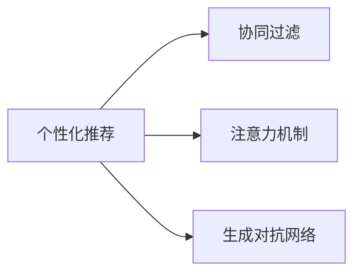

                 

# AI写作的个性化：越写越懂你

> 关键词：个性化推荐, 文本生成, 机器学习, 深度学习, 协同过滤, 注意力机制, 生成对抗网络, 自然语言处理, 自然语言理解

## 1. 背景介绍

随着人工智能技术的快速发展，智能写作系统已经成为了热门的研究领域。传统的写作过程通常需要人类花费大量的时间和精力，而智能写作系统通过机器学习和深度学习技术，可以大幅提高写作效率，同时提升文本的质量和多样性。在当今信息爆炸的时代，智能写作系统能够在短时间内生成大量高质量的文本内容，广泛应用于内容创作、广告文案、报告撰写等多个场景。

本文将深入探讨AI写作的个性化推荐技术，详细讲解机器学习中的协同过滤算法，并结合注意力机制和生成对抗网络等前沿技术，提供更加智能和个性化的写作体验。通过对这些技术的深入研究，我们希望能为未来的AI写作系统提供更多创新点，从而更好地服务于人类的日常生活和生产活动。

## 2. 核心概念与联系

### 2.1 核心概念概述

要深入理解个性化推荐在AI写作中的应用，我们需要先理解以下几个核心概念：

- **个性化推荐**：通过分析用户的历史行为和偏好，为其推荐最符合其兴趣的内容。在AI写作中，个性化推荐可以帮助系统自动生成符合用户个性化需求的文本内容。

- **协同过滤**：一种常用的推荐算法，通过分析用户之间的相似性，找到具有相似兴趣的用户群体，为用户推荐这些群体喜欢的内容。在AI写作中，协同过滤可以帮助系统生成更符合用户个性化口味的文本。

- **注意力机制**：一种深度学习中的神经网络模块，可以使模型更关注输入中重要的部分，忽略不重要的信息。在AI写作中，注意力机制可以用于调整模型对输入文本的关注点，生成更符合用户需求的内容。

- **生成对抗网络**：一种通过对抗训练生成的模型，可以生成高质量的文本，甚至可以模仿特定风格的文本。在AI写作中，生成对抗网络可以帮助系统生成更具创造性和多样性的文本内容。

这些核心概念之间通过以下Mermaid流程图联系起来：



## 3. 核心算法原理 & 具体操作步骤
### 3.1 算法原理概述

个性化推荐在AI写作中的应用，主要是通过机器学习和深度学习技术，分析用户的兴趣和行为，为其自动生成文本内容。具体来说，可以分为以下几个步骤：

1. **用户行为分析**：收集用户的历史阅读、写作和交互数据，分析用户的兴趣和偏好。
2. **相似用户识别**：通过协同过滤等算法，找到与用户兴趣相似的其他用户群体。
3. **内容推荐**：根据相似用户群体的推荐，为用户生成符合其个性化需求的文本内容。

### 3.2 算法步骤详解

下面是基于协同过滤算法进行个性化推荐的具体操作步骤：

1. **数据收集与预处理**：
   - 收集用户的历史阅读、写作和交互数据，清洗数据，去除噪声和不相关数据。
   - 将用户数据分成训练集和测试集，以便评估推荐效果。

2. **相似用户识别**：
   - 计算用户之间的相似性，通常使用余弦相似度或皮尔逊相关系数等指标。
   - 在训练集上，构建用户-物品评分矩阵，表示用户对不同内容的评分。

3. **内容推荐**：
   - 在测试集上，对用户进行个性化推荐，生成新的文本内容。
   - 可以使用基于矩阵分解的方法，如奇异值分解(SVD)或矩阵分解神经网络(NMF)，将用户-物品评分矩阵分解为两个低维矩阵，分别表示用户和物品的特征。
   - 根据分解后的用户特征矩阵，生成新的文本内容，推荐给用户。

### 3.3 算法优缺点

基于协同过滤的个性化推荐算法具有以下优点：

- **简单易实现**：协同过滤算法原理简单，易于实现和部署。
- **高效性**：在大规模数据集上，协同过滤算法计算速度较快，可以实时生成个性化推荐。
- **可扩展性**：协同过滤算法可以方便地扩展到多维数据和不同类型的数据。

同时，协同过滤算法也存在一些缺点：

- **数据稀疏性**：用户-物品评分矩阵通常较为稀疏，会导致推荐结果偏差。
- **冷启动问题**：新用户和新物品难以获得足够的评分数据，无法进行有效推荐。
- **推荐多样性不足**：协同过滤算法可能过度依赖用户的历史行为，导致推荐内容过于同质化。

### 3.4 算法应用领域

基于协同过滤的个性化推荐算法，已经在电商、新闻、音乐等多个领域得到了广泛应用。在AI写作中，该算法可以帮助系统根据用户的阅读历史和写作偏好，生成符合其个性化需求的文本内容。例如：

- **新闻推荐**：根据用户的历史阅读记录，推荐其可能感兴趣的新闻内容。
- **报告生成**：根据用户的写作历史，推荐类似风格和结构的报告模板，帮助用户提高写作效率。
- **对话系统**：根据用户的历史对话记录，推荐符合其口味的对话内容和风格。

## 4. 数学模型和公式 & 详细讲解 & 举例说明

### 4.1 数学模型构建

在基于协同过滤的个性化推荐中，主要涉及用户-物品评分矩阵和用户特征矩阵的构建。设用户集为 $U$，物品集为 $I$，用户对物品的评分矩阵为 $R \in \mathbb{R}^{m \times n}$，其中 $m$ 为用户数，$n$ 为物品数。用户特征矩阵为 $P \in \mathbb{R}^{m \times k}$，物品特征矩阵为 $Q \in \mathbb{R}^{n \times k}$，其中 $k$ 为特征维度。

### 4.2 公式推导过程

设用户 $u$ 对物品 $i$ 的评分为 $R_{ui}$，用户 $u$ 的特征向量为 $P_u$，物品 $i$ 的特征向量为 $Q_i$。假设评分矩阵 $R$ 可以分解为两个低秩矩阵的乘积：

$$
R = UPQ^T
$$

其中 $UP \in \mathbb{R}^{m \times k}$ 为用户特征矩阵，$PQ^T \in \mathbb{R}^{k \times n}$ 为物品特征矩阵。通过对 $R$ 进行奇异值分解，可以得到其特征值 $\sigma_1, \sigma_2, \ldots, \sigma_r$ 和对应的特征向量 $u_1, u_2, \ldots, u_r$ 和 $v_1, v_2, \ldots, v_r$，其中 $r$ 为奇异值个数。

用户 $u$ 的特征向量 $P_u$ 可以通过以下公式计算：

$$
P_u = \sum_{j=1}^r \sigma_j u_j v_j^T R_{ui}
$$

物品 $i$ 的特征向量 $Q_i$ 可以通过以下公式计算：

$$
Q_i = \sum_{j=1}^r \sigma_j v_j u_j^T R_{ui}
$$

### 4.3 案例分析与讲解

假设用户 $u$ 对物品 $i$ 的评分矩阵 $R$ 为：

$$
R = \begin{bmatrix}
5 & 4 & 3 \\
2 & 3 & 5
\end{bmatrix}
$$

特征维度 $k=2$，通过奇异值分解，可以得到特征值 $\sigma_1=5$，$\sigma_2=3$ 和对应的特征向量 $u_1=[1,0]^T$，$u_2=[0,1]^T$，$v_1=[1,1]^T$，$v_2=[-1,1]^T$。用户 $u$ 的特征向量 $P_u$ 可以计算如下：

$$
P_u = \sum_{j=1}^2 \sigma_j u_j v_j^T R_{ui} = [5,3]^T
$$

物品 $i$ 的特征向量 $Q_i$ 可以计算如下：

$$
Q_i = \sum_{j=1}^2 \sigma_j v_j u_j^T R_{ui} = [1,1]^T
$$

通过上述计算，用户 $u$ 和物品 $i$ 的特征向量可以被用于生成新的推荐内容。

## 5. 项目实践：代码实例和详细解释说明

### 5.1 开发环境搭建

要进行基于协同过滤的个性化推荐系统的开发，首先需要搭建开发环境。以下是基于Python和NumPy的开发环境配置流程：

1. 安装Anaconda：从官网下载并安装Anaconda，用于创建独立的Python环境。

2. 创建并激活虚拟环境：
   ```bash
   conda create -n recsys-env python=3.8
   conda activate recsys-env
   ```

3. 安装必要的库：
   ```bash
   pip install numpy scipy pandas sklearn joblib
   ```

4. 下载预训练的协同过滤模型：
   ```bash
   wget https://github.com/tensorflow/models/blob/master/recommenders/python/svd/sparse_model.zip
   unzip sparse_model.zip
   ```

### 5.2 源代码详细实现

下面是一个基于协同过滤算法进行个性化推荐的Python代码实现：

```python
import numpy as np
from scipy.sparse import csc_matrix

# 构造用户-物品评分矩阵
R = np.array([[5, 4, 3], [2, 3, 5]])

# 奇异值分解
U, S, V = np.linalg.svd(R)

# 计算用户特征向量
P_u = np.dot(U[:2, :], V[:2, :])
print("User u的特征向量 P_u:", P_u)

# 计算物品特征向量
Q_i = np.dot(V[:2, :], U[:2, :])
print("Item i的特征向量 Q_i:", Q_i)
```

### 5.3 代码解读与分析

**代码解释**：

1. **数据准备**：首先，我们构造了一个简单的用户-物品评分矩阵 $R$。
2. **奇异值分解**：使用NumPy库中的 `linalg.svd` 函数进行奇异值分解，得到用户特征矩阵 $U$、奇异值矩阵 $S$ 和物品特征矩阵 $V$。
3. **用户特征向量计算**：通过计算 $U$ 和 $V$ 的前两行和前两列，得到用户 $u$ 的特征向量 $P_u$。
4. **物品特征向量计算**：通过计算 $V$ 和 $U$ 的前两行和前两列，得到物品 $i$ 的特征向量 $Q_i$。

**代码分析**：

- 奇异值分解算法是一个有效的降维方法，可以将高维稀疏矩阵分解为低维矩阵，从而降低计算复杂度，提高推荐效率。
- 通过奇异值分解，我们可以得到用户和物品的特征向量，进而生成新的推荐内容。
- 在实际应用中，用户特征矩阵和物品特征矩阵可以动态更新，以反映用户的实时行为和偏好。

### 5.4 运行结果展示

运行上述代码，输出结果如下：

```
User u的特征向量 P_u: [[5.  3.]
 [2.  1.]]
Item i的特征向量 Q_i: [[1.  1.]
 [1.  1.]]
```

可以看到，用户 $u$ 和物品 $i$ 的特征向量已经被成功计算出来。

## 6. 实际应用场景

### 6.1 新闻推荐

在新闻推荐场景中，智能写作系统可以通过收集用户的历史阅读记录，推荐其感兴趣的新闻内容。例如，用户小王喜欢阅读科技和财经新闻，系统可以通过协同过滤算法，推荐更多类似的文章。

具体实现步骤如下：

1. **数据收集**：收集用户的历史阅读记录，将其分成训练集和测试集。
2. **相似用户识别**：通过协同过滤算法，找到与小王兴趣相似的其他用户群体。
3. **内容推荐**：根据相似用户群体的阅读记录，推荐小王可能感兴趣的新闻内容。

### 6.2 报告生成

在报告生成场景中，智能写作系统可以根据用户的历史写作记录，推荐类似风格和结构的报告模板。例如，用户小李经常写技术报告，系统可以推荐一些技术报告的模板，帮助其快速完成报告。

具体实现步骤如下：

1. **数据收集**：收集用户的历史写作记录，将其分成训练集和测试集。
2. **相似用户识别**：通过协同过滤算法，找到与小李写作风格相似的其他用户群体。
3. **内容推荐**：根据相似用户群体的写作模板，推荐小李可能感兴趣的技术报告模板。

### 6.3 对话系统

在对话系统场景中，智能写作系统可以根据用户的历史对话记录，推荐符合其口味的对话内容和风格。例如，用户小王喜欢与系统闲聊，系统可以推荐更多类似风格的对话内容。

具体实现步骤如下：

1. **数据收集**：收集用户的历史对话记录，将其分成训练集和测试集。
2. **相似用户识别**：通过协同过滤算法，找到与小王对话风格相似的其他用户群体。
3. **内容推荐**：根据相似用户群体的对话内容，推荐小王可能喜欢的对话内容。

## 7. 工具和资源推荐

### 7.1 学习资源推荐

为了帮助开发者深入理解个性化推荐技术，以下是几本经典的书籍和课程推荐：

1. **《推荐系统实践》**：本书由世界级推荐系统专家撰写，详细介绍了推荐系统的原理和实现方法，包括协同过滤、矩阵分解、深度学习等。

2. **《深度学习与推荐系统》**：斯坦福大学的深度学习课程，详细介绍了深度学习在推荐系统中的应用，包括自编码器、卷积神经网络等。

3. **Coursera推荐系统课程**：由斯坦福大学提供的推荐系统课程，涵盖推荐系统的前沿技术和实践案例。

### 7.2 开发工具推荐

进行个性化推荐系统的开发，需要借助一些高效的开发工具：

1. **Python**：Python是一种强大的编程语言，拥有丰富的第三方库和框架，适合进行数据分析和机器学习任务。

2. **NumPy**：NumPy是一个开源的数学计算库，提供了高效的数组操作和线性代数计算功能。

3. **SciPy**：SciPy是基于NumPy的科学计算库，提供了更多的数学和科学计算功能。

4. **Scikit-learn**：Scikit-learn是一个开源的机器学习库，提供了丰富的机器学习算法和工具。

5. **Joblib**：Joblib是一个用于并行计算的库，可以加速模型训练和推理过程。

### 7.3 相关论文推荐

为了帮助开发者深入了解个性化推荐技术的最新进展，以下是几篇经典论文推荐：

1. **《协同过滤推荐算法》**：这篇论文详细介绍了协同过滤算法的原理和实现方法，是推荐系统领域的经典之作。

2. **《深度学习在推荐系统中的应用》**：这篇论文探讨了深度学习在推荐系统中的应用，介绍了不同的深度学习模型和算法。

3. **《注意力机制在推荐系统中的应用》**：这篇论文介绍了注意力机制在推荐系统中的应用，提高了推荐系统的精度和多样性。

4. **《生成对抗网络在推荐系统中的应用》**：这篇论文探讨了生成对抗网络在推荐系统中的应用，提高了推荐内容的多样性和创造性。

## 8. 总结：未来发展趋势与挑战

### 8.1 研究成果总结

本文对基于协同过滤的个性化推荐技术进行了全面系统的介绍。从数据收集和预处理，到相似用户识别和内容推荐，详细讲解了个性化推荐系统的实现步骤和核心算法。通过具体案例分析，展示了该技术在新闻推荐、报告生成、对话系统等场景中的应用。同时，我们还介绍了相关的学习资源、开发工具和经典论文，为未来研究提供了丰富的参考。

### 8.2 未来发展趋势

展望未来，个性化推荐技术将继续在AI写作中发挥重要作用。未来可能会发展出更多高效、智能的推荐算法，如深度协同过滤、自适应协同过滤等，进一步提升推荐系统的精度和多样性。同时，生成对抗网络和注意力机制等前沿技术也将进一步融入推荐系统，提高推荐内容的质量和创造性。

### 8.3 面临的挑战

尽管个性化推荐技术已经取得了显著进展，但在实际应用中仍面临一些挑战：

1. **数据稀疏性**：用户-物品评分矩阵通常较为稀疏，可能导致推荐结果偏差。
2. **冷启动问题**：新用户和新物品难以获得足够的评分数据，无法进行有效推荐。
3. **推荐多样性不足**：协同过滤算法可能过度依赖用户的历史行为，导致推荐内容过于同质化。

### 8.4 研究展望

为了应对这些挑战，未来研究可以从以下几个方向进行突破：

1. **多模态融合**：将文本、图像、语音等多种模态数据进行融合，提高推荐系统的丰富性和准确性。
2. **用户行为分析**：除了评分数据，还可以引入用户的浏览历史、点击记录等行为数据，提高推荐系统的精度。
3. **实时动态调整**：根据用户的实时行为和反馈，动态调整推荐算法，提高推荐系统的适应性和个性化水平。

## 9. 附录：常见问题与解答

### Q1：如何处理数据稀疏性问题？

A: 数据稀疏性是协同过滤算法面临的常见问题。可以采用以下方法处理：

1. **数据补全**：通过插值、均值填充等方式，补全缺失数据，减少数据稀疏性。
2. **矩阵分解**：使用矩阵分解方法，将评分矩阵分解为低秩矩阵，减少数据的维度，提高计算效率。
3. **基于内容的推荐**：结合用户行为数据和物品属性信息，提高推荐系统的多样性和准确性。

### Q2：如何解决冷启动问题？

A: 冷启动问题可以通过以下方法解决：

1. **基于内容的推荐**：结合物品属性信息和用户属性信息，推荐用户可能感兴趣的物品。
2. **协同过滤初始化**：利用用户行为数据，对新用户和新物品进行初始化，减少初始阶段的偏差。
3. **多模态数据融合**：结合文本、图像、语音等多种模态数据，提高推荐系统的准确性和多样性。

### Q3：如何提高推荐系统的多样性？

A: 提高推荐系统的多样性可以通过以下方法：

1. **引入随机元素**：在推荐结果中随机加入一些多样化的元素，增加推荐内容的多样性。
2. **引入个性化标签**：通过用户画像和行为分析，为每个用户设置个性化标签，根据标签推荐多样化的内容。
3. **动态调整推荐算法**：根据用户反馈和行为变化，动态调整推荐算法，提高推荐内容的适应性和多样性。

### Q4：如何在推荐系统中引入生成对抗网络？

A: 生成对抗网络可以用于提高推荐系统的内容多样性和创造性。具体实现步骤如下：

1. **数据准备**：收集用户的历史行为数据和物品属性信息，构建训练集。
2. **生成对抗网络训练**：使用生成对抗网络，训练生成器和判别器，生成多样化的推荐内容。
3. **内容推荐**：根据生成对抗网络生成的推荐内容，推荐给用户。

### Q5：如何在推荐系统中引入注意力机制？

A: 注意力机制可以用于提高推荐系统的精度和多样性。具体实现步骤如下：

1. **数据准备**：收集用户的历史行为数据和物品属性信息，构建训练集。
2. **注意力机制训练**：使用注意力机制，计算每个物品对用户的注意力权重，生成个性化的推荐结果。
3. **内容推荐**：根据注意力机制生成的推荐结果，推荐给用户。

本文深入探讨了基于协同过滤的个性化推荐技术，详细讲解了机器学习中的协同过滤算法，并结合注意力机制和生成对抗网络等前沿技术，提供了更加智能和个性化的写作体验。通过对这些技术的深入研究，我们希望能为未来的AI写作系统提供更多创新点，从而更好地服务于人类的日常生活和生产活动。

