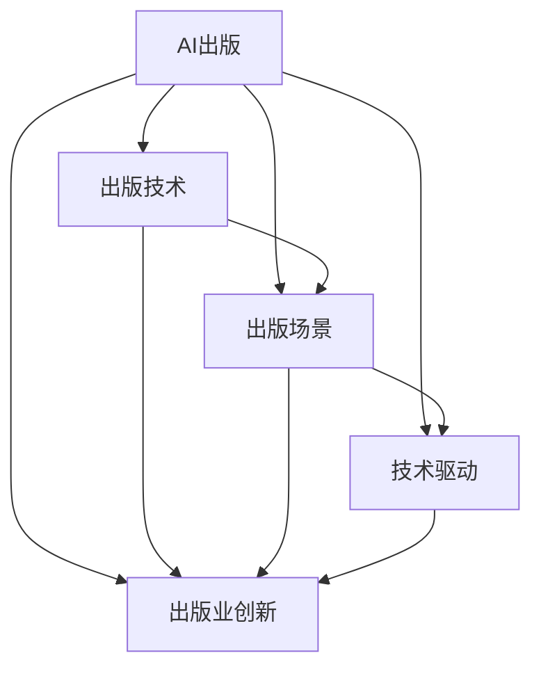

                 

# AI出版业动态：场景驱动的技术发展

> 关键词：AI出版,出版技术,出版场景,技术驱动,出版业创新

## 1. 背景介绍

随着人工智能技术的不断进步，AI在出版业中的应用正逐渐从边缘化走向核心。从内容创作到编辑校对，从市场营销到读者互动，AI正在改变出版业的各个环节。本文将从背景介绍出发，系统阐述AI出版业的技术发展趋势，探讨其核心概念及实际应用。

## 2. 核心概念与联系

### 2.1 核心概念概述

为了更好地理解AI出版业，本节将介绍几个关键的AI出版概念及其相互联系：

- **AI出版**：指通过人工智能技术，提高出版内容的生成、编辑、校对、发行和推广效率的过程。包括内容创作辅助、自动编辑、智能校对、个性化推荐等多个环节。
- **出版技术**：涵盖传统出版技术和现代数字出版技术，如排版、印刷、数字化、网络出版等。AI出版技术的引入使得传统出版流程更加智能化、自动化。
- **出版场景**：指出版业的具体应用场景，包括图书出版、期刊出版、网络出版、教育出版等。AI技术根据不同的出版场景，提供定制化的解决方案。
- **技术驱动**：AI技术的发展与应用，为出版业带来了新的动力与机会。技术驱动使出版业更加高效、精准、智能化。
- **出版业创新**：通过引入AI技术，出版业在内容创新、业务模式创新、用户服务创新等方面不断突破，推动出版业向新的发展阶段迈进。

这些概念之间的逻辑关系可以通过以下Mermaid流程图来展示：



这个流程图展示了大语言模型的核心概念及其之间的关系：

1. AI出版通过出版技术实现，为出版场景提供智能化支持。
2. 技术驱动是AI出版发展的动力，推动出版业创新。
3. 出版业创新得益于AI出版技术的应用，反哺AI技术的发展。

## 3. 核心算法原理 & 具体操作步骤
### 3.1 算法原理概述

AI出版业的核心算法原理涉及自然语言处理、计算机视觉、机器学习等多个技术领域。以出版内容生成为例，其核心原理为：

- **自然语言处理**：通过语言模型，自动生成符合语法、语义规范的文本内容。常见的语言模型有GPT-3、BERT等。
- **计算机视觉**：通过图像识别、图像生成等技术，辅助图书设计、封面制作等。
- **机器学习**：通过模型训练，提高内容的分类、推荐等效果。

### 3.2 算法步骤详解

AI出版业的具体操作步骤包括：

1. **数据采集与预处理**：收集出版相关的数据，如文本、图片、音频等，并进行清洗、标注等预处理工作。
2. **模型训练与优化**：选择合适的算法和模型架构，如Transformer、CNN等，在大规模数据上训练，并进行超参数调优。
3. **模型部署与测试**：将训练好的模型部署到生产环境，并在实际场景中测试性能，进行迭代优化。
4. **集成与集成测试**：将AI功能集成到出版流程中，并进行集成测试，确保各模块协同工作。

### 3.3 算法优缺点

AI出版业的优势在于：

- **效率提升**：自动化内容生成、编辑、校对等流程，大幅提升工作效率。
- **成本降低**：减少人工干预，降低出版成本。
- **质量提升**：通过智能校对、推荐系统等，提高内容的精准度和用户满意度。

缺点包括：

- **技术依赖**：对AI技术的依赖较大，技术实现复杂度较高。
- **数据隐私**：在数据采集与处理过程中，需要考虑用户隐私和数据安全问题。
- **内容单一**：过度依赖AI生成内容，可能导致内容创意不足。

### 3.4 算法应用领域

AI出版业的应用领域广泛，包括：

- **内容创作**：自动生成文章、书籍章节、新闻报道等。
- **编辑校对**：自动校对文本中的拼写、语法错误，提高编辑效率。
- **图书设计**：通过图像识别技术辅助图书封面设计，提高设计质量。
- **市场营销**：基于用户行为数据，推荐相关图书，提升销售效果。
- **读者互动**：通过智能客服、聊天机器人等，提升用户互动体验。

## 4. 数学模型和公式 & 详细讲解 & 举例说明

### 4.1 数学模型构建

AI出版业的数学模型构建通常涉及以下步骤：

- **数据表示**：将文本、图片等数据转换为机器可处理的形式，如词向量、图像特征向量等。
- **模型选择**：选择合适的算法和模型架构，如基于Transformer的序列模型、卷积神经网络(CNN)等。
- **损失函数**：定义模型的损失函数，如交叉熵损失、均方误差损失等。
- **优化器选择**：选择合适的优化算法，如Adam、SGD等。

### 4.2 公式推导过程

以内容生成为例，内容生成模型的公式推导如下：

- **词嵌入层**：将输入文本转换为词向量表示。
- **Transformer层**：对词向量进行自注意力计算，得到上下文表示。
- **线性层**：将上下文表示映射为输出文本的向量表示。
- **softmax层**：将输出向量转化为概率分布，生成下一个词的概率。

### 4.3 案例分析与讲解

假设我们要自动生成一篇新闻报道。通过预训练的GPT-3模型，我们可以：

- 输入初始文本，如“今天，XXX公司发布了最新的XXX产品。”
- 将文本转换为词向量表示，输入到Transformer模型。
- 模型生成后续文本，如“该产品具有XXX功能，适用于XXX场景。”
- 通过softmax层输出下一个词的概率分布，选择概率最大的词汇作为输出。

## 5. 项目实践：代码实例和详细解释说明

### 5.1 开发环境搭建

在进行AI出版业的技术实践前，我们需要准备好开发环境。以下是使用Python进行PyTorch开发的环境配置流程：

1. 安装Anaconda：从官网下载并安装Anaconda，用于创建独立的Python环境。

2. 创建并激活虚拟环境：
```bash
conda create -n pytorch-env python=3.8 
conda activate pytorch-env
```

3. 安装PyTorch：根据CUDA版本，从官网获取对应的安装命令。例如：
```bash
conda install pytorch torchvision torchaudio cudatoolkit=11.1 -c pytorch -c conda-forge
```

4. 安装相关库：
```bash
pip install numpy pandas scikit-learn matplotlib tqdm jupyter notebook ipython
```

完成上述步骤后，即可在`pytorch-env`环境中开始AI出版业的技术实践。

### 5.2 源代码详细实现

这里以图书封面设计为例，给出使用Python和PyTorch进行图书封面设计的代码实现。

```python
import torch
import torchvision.transforms as transforms
from torchvision import datasets, models

# 定义模型和设备
model = models.vgg16(pretrained=True)
device = torch.device("cuda:0" if torch.cuda.is_available() else "cpu")
model.to(device)

# 加载封面数据集
cover_dataset = datasets.ImageFolder(root='dataset', transform=transforms.ToTensor())
cover_loader = torch.utils.data.DataLoader(cover_dataset, batch_size=4, shuffle=True)

# 定义优化器和损失函数
optimizer = torch.optim.Adam(model.parameters(), lr=0.001)
criterion = torch.nn.CrossEntropyLoss()

# 训练模型
for epoch in range(10):
    for batch_idx, (data, target) in enumerate(cover_loader):
        data, target = data.to(device), target.to(device)
        optimizer.zero_grad()
        output = model(data)
        loss = criterion(output, target)
        loss.backward()
        optimizer.step()
        if batch_idx % 100 == 0:
            print('Epoch [{}/{}], Step [{}/{}], Loss: {:.4f}'.format(epoch+1, 10, batch_idx+1, len(cover_loader), loss.item()))

# 评估模型
# ...
```

### 5.3 代码解读与分析

让我们再详细解读一下关键代码的实现细节：

**模型定义**：
- 加载预训练的VGG16模型，作为封面设计的基线模型。
- 将模型移动到GPU设备，并定义优化器和损失函数。

**数据加载**：
- 定义封面数据集和数据加载器，将数据批处理和随机打乱。

**训练模型**：
- 通过循环迭代，对数据进行前向传播和反向传播，更新模型参数。
- 每100步输出一次训练损失，用于监控训练过程。

**评估模型**：
- 通过测试集评估模型的表现，输出评估指标。

可以看到，通过PyTorch框架，AI出版业的技术实现变得简单高效。开发者可以将更多精力放在数据处理、模型改进等高层逻辑上，而不必过多关注底层的实现细节。

当然，工业级的系统实现还需考虑更多因素，如模型的保存和部署、超参数的自动搜索、更灵活的任务适配层等。但核心的AI出版范式基本与此类似。

## 6. 实际应用场景

### 6.1 智能写作助手

智能写作助手是AI出版业的重要应用之一。通过AI技术，智能写作助手能够自动生成高质量的文章、报道、书籍章节等。

在技术实现上，可以收集大量高质内容作为训练语料，训练基于Transformer的生成模型，如GPT-3等。在用户输入一定的提示文本后，模型自动生成后续内容，生成质量由用户评估并迭代优化。

**优势**：

- **提升效率**：自动化内容生成，缩短创作周期。
- **质量保障**：自动校对，提高内容准确性。
- **个性化定制**：根据用户偏好生成内容。

### 6.2 智能编辑校对

传统出版流程中，编辑校对工作繁琐且易出错。AI出版业通过智能编辑校对技术，大幅提升编辑效率和质量。

**具体实现**：
- 收集大量标注数据，训练基于BERT、LSTM等模型的校对模型。
- 对输入文本进行词法、语法、拼写等方面的错误校对，生成校对建议。
- 利用多轮校对，逐步提高编辑质量。

**优势**：

- **提升效率**：自动校对，减少人工干预。
- **质量提升**：提高校对准确性和全面性。
- **降低成本**：减少人工校对成本。

### 6.3 智能图书推荐

智能图书推荐系统通过分析用户行为数据，推荐用户可能感兴趣的相关图书，提升用户满意度和购书率。

**具体实现**：
- 收集用户浏览、购买、评价等行为数据，构建用户画像。
- 基于协同过滤、内容推荐、混合推荐等算法，构建推荐模型。
- 将模型集成到出版平台，实时推荐相关图书。

**优势**：

- **提升用户体验**：推荐个性化内容，提升用户满意度。
- **提高销量**：通过精准推荐，提高图书销售率。
- **降低营销成本**：减少传统营销成本，提升营销效果。

### 6.4 未来应用展望

随着AI技术的发展，AI出版业在未来将有更广阔的应用前景。以下是几个未来的展望：

1. **全流程智能化**：从内容创作到编辑校对、发行推广，实现全流程智能化。
2. **多模态融合**：结合图像、音频等多模态数据，提高出版内容的丰富度。
3. **个性化定制**：通过深度学习技术，实现高度个性化的内容生成和推荐。
4. **增强现实(Augmented Reality, AR)**：结合AR技术，实现虚拟图书、虚拟展览等。
5. **边缘计算**：在边缘设备上运行AI模型，提升响应速度和隐私保护。
6. **区块链技术**：通过区块链技术，保障内容版权和分发安全。

## 7. 工具和资源推荐
### 7.1 学习资源推荐

为了帮助开发者系统掌握AI出版业的技术基础和实践技巧，这里推荐一些优质的学习资源：

1. **Coursera《深度学习专项》课程**：斯坦福大学开设的深度学习课程，涵盖深度学习基本原理和实际应用。
2. **Udacity《人工智能工程》课程**：Udacity的AI工程课程，涵盖AI技术栈的多个方面，包括计算机视觉、自然语言处理等。
3. **PyTorch官方文档**：PyTorch的官方文档，提供了丰富的API文档、教程和示例，是学习AI出版业技术的必备资源。
4. **Google AI博客**：Google AI博客，汇集了大量前沿AI技术的介绍和实践案例。
5. **Deep Learning Book**：《深度学习》一书，由Ian Goodfellow等专家编写，是AI出版业技术入门的经典之作。

通过对这些资源的学习实践，相信你一定能够快速掌握AI出版业的技术框架和实践方法，并用于解决实际的出版问题。

### 7.2 开发工具推荐

高效的开发离不开优秀的工具支持。以下是几款用于AI出版业开发的常用工具：

1. **PyTorch**：基于Python的开源深度学习框架，灵活动态的计算图，适合快速迭代研究。大部分AI出版业项目都有PyTorch版本的实现。
2. **TensorFlow**：由Google主导开发的开源深度学习框架，生产部署方便，适合大规模工程应用。同样有丰富的AI出版业资源。
3. **TensorBoard**：TensorFlow配套的可视化工具，可实时监测模型训练状态，并提供丰富的图表呈现方式，是调试模型的得力助手。
4. **Weights & Biases**：模型训练的实验跟踪工具，可以记录和可视化模型训练过程中的各项指标，方便对比和调优。
5. **Jupyter Notebook**：强大的交互式开发环境，支持Python、R等多种语言，适合开发和展示AI出版业项目。

合理利用这些工具，可以显著提升AI出版业开发效率，加快创新迭代的步伐。

### 7.3 相关论文推荐

AI出版业的发展离不开学界的持续研究。以下是几篇奠基性的相关论文，推荐阅读：

1. **《Transformer is All you Need》**：提出Transformer结构，开启了NLP领域的预训练大模型时代。
2. **《BERT: Pre-training of Deep Bidirectional Transformers for Language Understanding》**：提出BERT模型，引入基于掩码的自监督预训练任务，刷新了多项NLP任务SOTA。
3. **《Attention is All you Need》**：提出自注意力机制，进一步提升了Transformer模型的表现力。
4. **《Scalable Text Editing with Text2Text Transformer》**：提出基于Transformer的文本编辑模型，实现了高效的文本校对。
5. **《Generating Books in the Cloud: Machine Learning and the Future of Publishing》**：讨论了AI技术在出版业中的应用，展望了未来出版业的趋势。

这些论文代表了大语言模型出版技术的发展脉络。通过学习这些前沿成果，可以帮助研究者把握学科前进方向，激发更多的创新灵感。

## 8. 总结：未来发展趋势与挑战
### 8.1 总结

本文对AI出版业的技术发展进行了全面系统的介绍。首先阐述了AI出版业的背景和发展趋势，明确了AI出版业的技术基础和实践技巧。其次，从原理到实践，详细讲解了AI出版业的算法原理和操作步骤，给出了具体的代码实现。同时，本文还广泛探讨了AI出版业在智能写作助手、智能编辑校对、智能图书推荐等多个领域的实际应用，展示了AI出版业的广阔前景。

通过本文的系统梳理，可以看到，AI出版业正在成为出版业的重要范式，极大地提升了出版内容的生成、编辑、校对、发行和推广效率。未来，伴随AI技术的进一步发展，AI出版业必将在出版行业带来革命性的变革，进一步推动出版业向智能化、自动化方向迈进。

### 8.2 未来发展趋势

展望未来，AI出版业将呈现以下几个发展趋势：

1. **全流程智能化**：AI技术将逐步应用于出版业的全流程，从内容创作到编辑校对、发行推广，实现智能化。
2. **多模态融合**：结合图像、音频等多模态数据，提高出版内容的丰富度。
3. **个性化定制**：通过深度学习技术，实现高度个性化的内容生成和推荐。
4. **增强现实(AR)**：结合AR技术，实现虚拟图书、虚拟展览等。
5. **边缘计算**：在边缘设备上运行AI模型，提升响应速度和隐私保护。
6. **区块链技术**：通过区块链技术，保障内容版权和分发安全。

以上趋势凸显了AI出版业的发展潜力。这些方向的探索发展，必将进一步提升出版业的效率和质量，推动出版业向新的发展阶段迈进。

### 8.3 面临的挑战

尽管AI出版业已经取得了显著进展，但在迈向更加智能化、普适化应用的过程中，仍面临诸多挑战：

1. **技术依赖**：对AI技术的依赖较大，技术实现复杂度较高。
2. **数据隐私**：在数据采集与处理过程中，需要考虑用户隐私和数据安全问题。
3. **内容单一**：过度依赖AI生成内容，可能导致内容创意不足。
4. **版权问题**：AI出版业需要处理大量的版权问题，保障内容合法合规。
5. **用户信任**：用户对AI生成的内容可能存在信任危机，需要加强内容真实性和可信度。
6. **技术公平**：AI技术的应用需要考虑技术公平性，避免技术偏见和歧视。

### 8.4 研究展望

面对AI出版业面临的挑战，未来的研究需要在以下几个方面寻求新的突破：

1. **数据隐私保护**：加强用户隐私保护，防止数据泄露。
2. **内容生成质量**：提升内容生成质量，减少内容创意不足的问题。
3. **技术公平性**：加强技术公平性，避免技术偏见和歧视。
4. **内容真实性**：提升内容的真实性和可信度，增强用户信任。
5. **版权保护**：加强版权保护，防止内容侵权。
6. **技术可解释性**：增强技术的可解释性，提高用户对技术的理解和信任。

这些研究方向的探索，必将引领AI出版业技术迈向更高的台阶，为出版业带来革命性的变革。面向未来，AI出版业还需要与其他人工智能技术进行更深入的融合，如知识表示、因果推理、强化学习等，多路径协同发力，共同推动出版业向新的发展阶段迈进。

## 9. 附录：常见问题与解答

**Q1：AI出版业是否适用于所有出版场景？**

A: AI出版业在大多数出版场景下都能发挥重要作用，特别是在内容创作、编辑校对等方面。但对于一些特定领域，如医学、法律等，需要结合领域专家的知识和经验，进行深度定制化开发。

**Q2：AI出版业的成本是否高于传统出版业？**

A: 初始成本可能较高，包括数据采集、模型训练等。但长期来看，AI出版业通过自动化和智能化，可以大幅降低人工成本和运营成本。

**Q3：AI出版业是否会取代人类出版业？**

A: AI出版业不会完全取代人类出版业，而是作为辅助工具，提升出版效率和质量。人类出版业仍然需要保持其独特性和创造性。

**Q4：AI出版业的技术瓶颈有哪些？**

A: AI出版业的技术瓶颈包括技术依赖、数据隐私、内容生成质量等。需要不断优化技术和算法，提高系统的稳定性和可靠性。

**Q5：AI出版业的市场前景如何？**

A: 随着AI技术的不断发展和成熟，AI出版业的市场前景广阔，将推动出版业向智能化、自动化方向迈进。

---

作者：禅与计算机程序设计艺术 / Zen and the Art of Computer Programming

