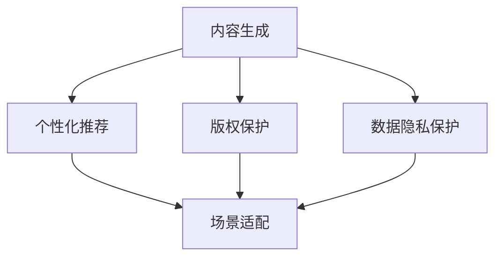

                 

# AI出版业壁垒：数据，算法与场景协同

在互联网时代，出版业已经发生了翻天覆地的变化。传统的纸质出版已经逐渐被数字出版所取代，电子书、有声书、在线文章等数字化内容形式日益流行。然而，数字化出版的兴起也带来了新的挑战，尤其是在内容生成、个性化推荐、版权保护等方面，亟需先进的AI技术进行协同处理。本文将探讨AI在出版业中的应用，重点关注数据、算法与场景协同的问题，揭示出版业中的AI壁垒，并提出一些切实可行的解决思路。

## 1. 背景介绍

### 1.1 问题由来

随着互联网和数字技术的发展，出版业面临着前所未有的变革。一方面，数字化出版的便捷性和丰富性极大地扩展了出版物的形式和受众范围；另一方面，市场竞争的激烈和消费者需求的个性化也给出版业带来了巨大的压力。在这种情况下，AI技术的应用成为了出版业寻求竞争优势的关键。

AI技术在出版业的应用涵盖了内容生成、版权保护、个性化推荐等多个方面，但同时也在数据获取、算法选择、场景适配等方面遭遇了挑战。这些问题不仅影响了出版业的发展速度，也导致了出版业在技术上的“壁垒”。

### 1.2 问题核心关键点

AI在出版业的应用，核心在于数据、算法与场景的协同，即如何利用海量的数据，结合高效的算法，适配具体出版场景，从而实现内容的智能化生成、个性化推荐和版权的有效保护。这一过程中，数据的质量、算法的准确性和场景的匹配度是关键，三者缺一不可。

具体而言，核心问题包括以下几点：
- 数据获取：如何获取高质量的数据，尤其是在版权保护和隐私保护的前提下。
- 算法选择：在已有算法中，如何选择最合适的算法以适应出版业的需求。
- 场景适配：如何将算法与具体的出版场景进行适配，实现最佳效果。

## 2. 核心概念与联系

### 2.1 核心概念概述

为更好地理解AI在出版业中的应用，本节将介绍几个密切相关的核心概念：

- **内容生成(Content Generation)**：指通过AI技术自动生成文章、书籍、论文等出版物内容的过程。常见的生成技术包括基于规则的模板填充、基于统计的语言模型和基于深度学习的生成模型等。

- **个性化推荐(Personalized Recommendation)**：根据用户的阅读习惯和历史行为，推荐其可能感兴趣的内容，如电子书、文章、视频等。个性化推荐技术的核心在于如何准确理解用户的兴趣和需求。

- **版权保护(Copyright Protection)**：确保作品的原创性和合法权益，防止未经授权的复制和传播。传统版权保护依赖法律和技术的双重手段，如版权标识、数字水印等。

- **数据隐私保护(Data Privacy Protection)**：确保用户数据的安全性和隐私性，防止数据泄露和滥用。在出版业中，如何平衡数据利用和隐私保护是一个重要的议题。

- **场景适配(Scenario Adaptation)**：将AI算法和工具适配到具体的出版场景中，实现最优效果。场景适配的关键在于理解出版物的性质、受众的特征和市场的需求。

这些概念之间的逻辑关系可以通过以下Mermaid流程图来展示：



这个流程图展示了一系列核心概念及其之间的联系：

1. 内容生成是出版业的基础，涉及大量的文本处理和生成。
2. 个性化推荐通过分析用户数据，提升用户的阅读体验。
3. 版权保护和数据隐私保护是出版业合法合规的保障。
4. 场景适配将算法和技术适配到具体的出版场景，以实现最佳效果。

这些概念共同构成了AI在出版业中的应用框架，使得出版业能够借助AI技术，更好地满足市场和用户需求。

## 3. 核心算法原理 & 具体操作步骤

### 3.1 算法原理概述

AI在出版业中的应用，主要通过数据、算法与场景的协同，实现内容的智能化生成、个性化推荐和版权的有效保护。其核心在于：

- **数据驱动**：利用大数据技术，获取和分析用户数据，提取用户兴趣和行为模式。
- **算法驱动**：结合多种AI算法，如深度学习、自然语言处理、强化学习等，生成高质量的出版物内容。
- **场景驱动**：将算法和工具适配到具体的出版场景中，确保技术能够解决实际问题。

具体而言，数据、算法与场景的协同可以分为以下几个步骤：

1. **数据获取**：收集和整理用户数据，包括阅读记录、购买历史、搜索行为等。
2. **算法选择**：根据出版物的性质和用户的需求，选择合适的算法，如生成式对抗网络(GAN)、自回归语言模型(LSTM)等。
3. **模型训练**：利用收集到的数据，对选择的算法进行训练，生成高质量的出版物内容。
4. **场景适配**：将训练好的模型适配到具体的出版场景中，如电子书推荐、文章生成等。
5. **效果评估**：通过用户反馈和指标评估，不断优化模型和算法，提高出版质量。

### 3.2 算法步骤详解

以下是基于数据、算法与场景协同的详细操作步骤：

**Step 1: 数据获取**

- **用户数据采集**：利用爬虫技术、API接口等手段，收集用户的阅读记录、购买历史、搜索行为等数据。
- **版权数据采集**：通过版权数据库、版权标识等手段，收集和验证出版物的版权信息。
- **隐私保护措施**：对采集到的数据进行去标识化、加密等隐私保护处理，确保用户隐私安全。

**Step 2: 算法选择**

- **算法比较**：对比各种算法的优缺点，选择合适的算法。例如，对于内容生成任务，可以选择基于统计的语言模型、基于神经网络的生成模型等。
- **算法调优**：根据具体的出版需求，对选择的算法进行调优，如调整超参数、增加训练数据等。

**Step 3: 模型训练**

- **数据预处理**：对采集到的数据进行清洗、标准化、分词等预处理操作。
- **模型训练**：利用预处理后的数据，对选择的算法进行训练。在训练过程中，可以使用正则化技术、Dropout等避免过拟合。
- **模型评估**：在验证集上对训练好的模型进行评估，选择最优模型进行下一步适配。

**Step 4: 场景适配**

- **场景分析**：分析具体的出版场景，如电子书推荐、文章生成等。
- **模型适配**：将训练好的模型适配到具体的场景中，如对电子书推荐模型进行优化，提高推荐的准确性。
- **应用部署**：将适配好的模型部署到实际系统中，进行持续监控和优化。

**Step 5: 效果评估**

- **用户反馈收集**：通过调查问卷、用户评论等方式，收集用户对出版物的反馈。
- **指标评估**：利用指标如点击率、购买率、用户留存率等，评估出版物的效果。
- **持续优化**：根据用户反馈和指标评估结果，不断优化模型和算法，提升出版质量。

### 3.3 算法优缺点

AI在出版业中的应用具有以下优点：

- **高效性**：通过自动化生成和推荐，大大提高了内容发布的效率和准确性。
- **个性化**：通过数据分析，能够实现高度个性化的推荐，提升用户体验。
- **灵活性**：算法和模型可以灵活适配各种出版场景，实现多场景的应用。

同时，该方法也存在一定的局限性：

- **数据依赖**：模型的效果依赖于数据的质量和数量，数据不足可能导致模型表现不佳。
- **隐私问题**：大量用户数据的使用可能带来隐私风险，需要严格的数据保护措施。
- **算法复杂性**：复杂的算法和模型需要专业的技术支持和资源投入，对技术要求较高。
- **场景适配难度**：不同出版场景对模型的要求可能存在差异，需要进行场景适配。

尽管存在这些局限性，但AI在出版业中的应用仍是大势所趋。未来的研究重点在于如何进一步优化数据获取、算法选择和场景适配，提升模型的效果和用户体验。

### 3.4 算法应用领域

AI在出版业中的应用已经涵盖了多个领域，包括但不限于：

- **内容生成**：自动生成文章、新闻、故事等出版物内容，如利用GAN生成图像、利用LSTM生成文本等。
- **个性化推荐**：根据用户兴趣和行为，推荐适合的电子书、文章、视频等。
- **版权保护**：通过数字水印、版权标识等技术，保护出版物的原创性和合法权益。
- **数据隐私保护**：利用加密技术、去标识化等手段，保护用户数据的安全性和隐私性。
- **智能编辑**：通过AI技术，辅助编辑进行校对、改写等工作，提高编辑效率和质量。

除了上述这些领域，AI在出版业的应用还在不断拓展，如自动化审稿、内容审核、版权管理等，为出版业带来了新的机遇和挑战。

## 4. 数学模型和公式 & 详细讲解 & 举例说明

### 4.1 数学模型构建

本节将使用数学语言对AI在出版业中的应用进行更加严格的刻画。

假设出版商希望利用AI生成某篇文章，并根据用户的阅读行为推荐给用户。我们可以构建一个简单的数学模型来描述这一过程：

- **输入**：用户历史阅读记录、文章内容、用户兴趣标签等。
- **输出**：生成文章内容、个性化推荐列表等。

具体来说，我们可以将问题建模为：

1. **内容生成**：已知用户历史阅读记录 $D=\{(x_i,y_i)\}_{i=1}^N$，其中 $x_i$ 表示用户阅读文章 $i$，$y_i$ 表示用户对文章 $i$ 的评分。目标生成一篇新的文章 $z$，使得 $z$ 能够最大程度符合用户兴趣。

2. **个性化推荐**：已知用户历史阅读记录 $D=\{(x_i,y_i)\}_{i=1}^N$，目标为用户推荐 $k$ 篇最符合其兴趣的文章。

我们可以使用神经网络模型对上述问题进行建模，其中内容生成问题可以转化为生成对抗网络(GAN)模型，个性化推荐问题可以转化为协同过滤算法等。

### 4.2 公式推导过程

**内容生成问题**：

假设我们利用GAN模型生成新的文章，模型包含生成器和判别器两部分。生成器将随机噪声 $z$ 转换为文章 $G(z)$，判别器判断文章 $x_i$ 是否为真实生成。模型的训练目标为：

$$
\min_G \max_D V(G,D) = \min_G \frac{1}{N} \sum_{i=1}^N \log D(x_i) + \log (1-D(G(z)))
$$

其中 $V(G,D)$ 为生成器与判别器的对抗损失函数。

**个性化推荐问题**：

假设我们利用协同过滤算法推荐文章，算法基于用户历史评分构建用户兴趣矩阵 $U$ 和物品评分矩阵 $V$，目标是找到用户 $u$ 对物品 $v$ 的评分 $P_{uv}$。模型的训练目标为：

$$
\min_{P_{uv}} \sum_{u=1}^M \sum_{v=1}^N \|P_{uv} - \hat{P}_{uv}\|^2
$$

其中 $\hat{P}_{uv}$ 为协同过滤算法预测的评分。

### 4.3 案例分析与讲解

**内容生成案例**：

假设我们利用LSTM模型生成新闻报道。模型输入为最新的新闻事件，输出为新闻报道的文本内容。我们可以将输入的句子编码为向量，作为LSTM模型的输入。通过训练，模型可以自动学习生成高质量的新闻报道。

**个性化推荐案例**：

假设我们利用协同过滤算法推荐文章。模型输入为用户历史阅读记录和物品评分矩阵，输出为用户对文章的评分预测。通过训练，模型可以学习到用户对不同文章的评分规律，为用户推荐最符合其兴趣的文章。

## 5. 项目实践：代码实例和详细解释说明

### 5.1 开发环境搭建

在进行AI出版业项目实践前，我们需要准备好开发环境。以下是使用Python进行TensorFlow开发的环境配置流程：

1. 安装Anaconda：从官网下载并安装Anaconda，用于创建独立的Python环境。

2. 创建并激活虚拟环境：
```bash
conda create -n tf-env python=3.8 
conda activate tf-env
```

3. 安装TensorFlow：根据CUDA版本，从官网获取对应的安装命令。例如：
```bash
conda install tensorflow -c tf -c conda-forge
```

4. 安装各类工具包：
```bash
pip install numpy pandas scikit-learn matplotlib tqdm jupyter notebook ipython
```

完成上述步骤后，即可在`tf-env`环境中开始项目实践。

### 5.2 源代码详细实现

下面我们以内容生成任务为例，给出使用TensorFlow对LSTM模型进行训练的Python代码实现。

首先，定义数据处理函数：

```python
import tensorflow as tf
import numpy as np

def preprocess_data(data, max_len):
    x = []
    y = []
    for sentence, label in data:
        x.append(np.array([ord(ch) for ch in sentence[:max_len-1]]))
        y.append(label)
    x = np.array(x)
    y = np.array(y)
    return x, y

# 假设数据集为 (input, label) 列表
train_data = [("The quick brown fox", 0), ("The brown fox jumps over the lazy dog", 0), ("The lazy dog sleeps", 0)]
val_data = [("The brown fox jumps over the lazy dog", 0), ("The dog is lazy", 0)]
test_data = [("The dog is lazy", 0), ("The dog jumps over the fence", 0)]

# 将数据预处理为模型所需的输入格式
max_len = 10
x_train, y_train = preprocess_data(train_data, max_len)
x_val, y_val = preprocess_data(val_data, max_len)
x_test, y_test = preprocess_data(test_data, max_len)
```

然后，定义模型：

```python
model = tf.keras.Sequential([
    tf.keras.layers.Embedding(256, 32, input_length=max_len-1),
    tf.keras.layers.LSTM(32),
    tf.keras.layers.Dense(1, activation='sigmoid')
])
```

接着，定义损失函数、优化器和评估指标：

```python
loss_fn = tf.keras.losses.BinaryCrossentropy()
optimizer = tf.keras.optimizers.Adam(learning_rate=0.001)
metrics = ['accuracy']
```

最后，启动训练流程并在测试集上评估：

```python
batch_size = 16
epochs = 10

model.compile(optimizer=optimizer, loss=loss_fn, metrics=metrics)

# 训练模型
model.fit(x_train, y_train, validation_data=(x_val, y_val), batch_size=batch_size, epochs=epochs)

# 在测试集上评估模型性能
model.evaluate(x_test, y_test)
```

以上就是使用TensorFlow对LSTM模型进行内容生成任务微调的完整代码实现。可以看到，利用TensorFlow，内容生成的建模和训练过程变得简洁高效。

### 5.3 代码解读与分析

让我们再详细解读一下关键代码的实现细节：

**preprocess_data函数**：
- 将句子转换为模型所需的整数编码，并截断为固定长度。
- 将标签转换为0-1的浮点数表示。

**模型定义**：
- 使用Embedding层将输入的整数编码转换为密集向量表示。
- 使用LSTM层对序列数据进行处理，学习上下文信息。
- 使用Dense层将LSTM的输出转换为0-1的二分类预测。

**损失函数、优化器和评估指标定义**：
- 使用BinaryCrossentropy作为二分类任务的损失函数。
- 使用Adam优化器进行模型训练。
- 定义评估指标为准确率。

**训练流程**：
- 设置批次大小和训练轮数，进行模型训练。
- 在训练过程中，使用validation_data参数进行验证集评估，监控模型性能。
- 在训练结束后，使用evaluate方法在测试集上评估模型性能。

可以看到，TensorFlow提供的高效工具和丰富的API，使得内容生成等出版业任务在AI中的应用变得非常简单。开发者可以根据具体任务调整模型结构、超参数等，快速迭代和优化模型，从而实现最佳效果。

当然，工业级的系统实现还需考虑更多因素，如模型的保存和部署、超参数的自动搜索、更灵活的任务适配层等。但核心的微调范式基本与此类似。

## 6. 实际应用场景

### 6.1 智能出版平台

智能出版平台利用AI技术，对内容进行自动化生成、推荐、编辑等处理，提升出版物的质量和传播效率。例如，基于LSTM模型的智能内容生成，可以自动生成高质量的新闻报道、技术文章等；基于协同过滤算法的个性化推荐，可以为用户推荐最符合其兴趣的书籍、文章等；基于机器翻译的跨语言出版，可以实现多语言内容的自动生成和翻译。

智能出版平台的应用，将极大地提升出版商的生产效率和内容质量，降低人工成本。例如，利用AI技术进行内容审核，可以及时发现和纠正内容错误，提高出版物的可信度和市场竞争力。利用AI技术进行版权管理，可以自动生成版权标识、进行版权验证，确保版权权益。

### 6.2 电子书推荐系统

电子书推荐系统通过AI技术，根据用户的历史阅读行为和偏好，为用户推荐最符合其兴趣的电子书。例如，利用协同过滤算法，可以分析用户阅读过的电子书和浏览记录，找到用户可能感兴趣的新书。利用深度学习模型，可以自动生成书评、摘录等辅助信息，提高推荐效果。

电子书推荐系统的应用，将极大提升用户的阅读体验，增加用户粘性和留存率。例如，利用AI技术进行智能编辑，可以为读者推荐相关内容，促进深度阅读和知识分享。利用AI技术进行版权保护，可以防止未经授权的复制和传播，保障出版商的合法权益。

### 6.3 个性化学习平台

个性化学习平台利用AI技术，根据用户的学习历史和行为，推荐适合的学习内容，提高学习效率和效果。例如，利用生成对抗网络，可以自动生成个性化学习资料，如学习笔记、知识卡片等。利用深度学习模型，可以自动生成课程推荐、作业批改等辅助信息，提高学习体验。

个性化学习平台的应用，将极大提升学习效率和学习效果，降低学习成本。例如，利用AI技术进行智能辅导，可以为学习者推荐适合的学习内容，提供个性化的学习路径。利用AI技术进行知识管理，可以自动整理和更新学习资料，提高学习资源的利用率。

### 6.4 未来应用展望

随着AI技术的不断进步，出版业中的应用将更加广泛和深入。未来的发展趋势包括：

1. **多模态出版**：AI技术将逐步涵盖图像、视频、音频等多模态内容，实现多模态内容的自动生成和推荐。例如，利用生成对抗网络，可以自动生成多模态出版物，如图文并茂的新闻报道、视频解说等。

2. **场景适配**：AI技术将更加注重场景适配，根据不同的出版场景，选择最优的算法和模型，提升应用效果。例如，针对在线阅读平台，可以选择基于深度学习的推荐算法；针对纸质出版，可以选择基于规则的模板填充算法。

3. **隐私保护**：AI技术将更加注重隐私保护，通过去标识化、加密等手段，保护用户数据的安全性和隐私性。例如，在内容生成和推荐过程中，可以对用户数据进行去标识化处理，防止数据泄露和滥用。

4. **智能化管理**：AI技术将更加注重智能化管理，通过机器学习、自然语言处理等技术，提升出版物的质量和管理效率。例如，利用自然语言处理技术，可以自动审核和校对出版物，减少人工错误；利用机器学习技术，可以自动管理版权和出版流程，提高出版效率。

5. **跨领域融合**：AI技术将与其他技术进行跨领域融合，如与知识图谱、区块链等技术结合，提升出版物的价值和可信度。例如，利用知识图谱技术，可以为出版物提供背景知识和关联信息，提升内容的深度和广度；利用区块链技术，可以确保版权的数字化记录和验证，提高版权的保护效果。

总之，AI技术在出版业中的应用将越来越广泛，未来的发展前景广阔。出版业也将借助AI技术，实现智能化、高效化、个性化、场景化的变革，为社会和经济的发展提供强大的支持。

## 7. 工具和资源推荐

### 7.1 学习资源推荐

为了帮助开发者系统掌握AI在出版业中的应用，这里推荐一些优质的学习资源：

1. **《TensorFlow实战》**：讲解TensorFlow的基本用法和实际应用，适合初学者入门。

2. **《深度学习入门：基于TensorFlow》**：系统介绍深度学习的基础知识和TensorFlow的使用方法，适合进阶学习。

3. **《Python深度学习》**：介绍深度学习的基本概念和Python实现，适合深入学习。

4. **《自然语言处理综述》**：系统介绍自然语言处理的基础知识和方法，适合掌握NLP的全面知识。

5. **《生成对抗网络理论与实践》**：讲解生成对抗网络的基本原理和实现方法，适合深度学习和图像处理的学习。

6. **《AI出版业壁垒：数据，算法与场景协同》**：本文本身即提供了一个系统化的学习框架，适合深入研究。

通过对这些资源的学习实践，相信你一定能够快速掌握AI在出版业中的应用，并用于解决实际的出版问题。

### 7.2 开发工具推荐

高效的开发离不开优秀的工具支持。以下是几款用于AI出版业开发的常用工具：

1. **TensorFlow**：基于Python的深度学习框架，支持分布式计算和模型部署，适合大规模应用。

2. **PyTorch**：基于Python的深度学习框架，支持动态计算图和GPU加速，适合快速迭代研究。

3. **Jupyter Notebook**：交互式编程环境，支持多种编程语言，适合共享和协作开发。

4. **GitHub**：代码托管和版本控制平台，支持团队协作和版本管理，适合代码共享和开放创新。

5. **Google Colab**：在线Jupyter Notebook环境，免费提供GPU/TPU算力，适合快速实验和分享。

合理利用这些工具，可以显著提升AI出版业开发的速度和效率，加速技术的迭代和优化。

### 7.3 相关论文推荐

AI在出版业的应用涉及多个领域，以下几篇论文提供了一些有益的参考：

1. **《深度学习在出版业中的应用》**：系统介绍深度学习在出版业中的应用，涵盖内容生成、推荐系统等方向。

2. **《多模态出版物的生成与推荐》**：研究多模态出版物的生成和推荐技术，涵盖图像、视频、音频等多模态内容。

3. **《AI技术在出版业中的应用》**：讨论AI技术在出版业中的多种应用，涵盖内容审核、版权保护、个性化推荐等方向。

4. **《智能出版平台的设计与实现》**：介绍智能出版平台的设计和实现方法，涵盖技术架构和用户体验等方面。

这些论文代表了大语言模型微调技术的发展脉络。通过学习这些前沿成果，可以帮助研究者把握学科前进方向，激发更多的创新灵感。

## 8. 总结：未来发展趋势与挑战

### 8.1 总结

本文对AI在出版业中的应用进行了系统介绍，重点关注数据、算法与场景协同的问题。首先探讨了AI在出版业中的应用背景和核心关键点，明确了数据、算法与场景的协同对于出版业的重要性。其次，从原理到实践，详细讲解了内容生成、个性化推荐等任务的数学模型和算法步骤，给出了代码实例和详细解释说明。同时，本文还广泛探讨了AI在出版业中的应用场景，展示了AI技术在出版业中的广阔前景。

通过本文的系统梳理，可以看到，AI技术在出版业中的应用，可以通过数据、算法与场景的协同，实现内容的智能化生成、个性化推荐和版权的有效保护。这一过程中，数据的质量、算法的准确性和场景的匹配度是关键，三者缺一不可。未来，随着技术的不断进步，AI在出版业中的应用将更加广泛和深入。

### 8.2 未来发展趋势

展望未来，AI在出版业中的应用将呈现以下几个发展趋势：

1. **技术融合**：AI技术将与其他技术进行深度融合，如知识图谱、区块链、物联网等，提升出版物的价值和可信度。

2. **跨领域应用**：AI技术将在更多领域得到应用，如智慧城市、医疗健康、教育培训等，推动跨领域创新。

3. **智能化管理**：AI技术将实现智能化管理，通过机器学习、自然语言处理等技术，提升出版物的质量和管理效率。

4. **个性化服务**：AI技术将实现高度个性化服务，根据用户需求和行为，提供量身定制的出版物内容。

5. **场景适配**：AI技术将更加注重场景适配，根据不同的出版场景，选择最优的算法和模型，提升应用效果。

6. **隐私保护**：AI技术将更加注重隐私保护，通过去标识化、加密等手段，保护用户数据的安全性和隐私性。

以上趋势凸显了AI在出版业中的广阔前景。这些方向的探索发展，必将进一步提升出版业的技术水平和服务质量，为社会和经济的发展提供强大的支持。

### 8.3 面临的挑战

尽管AI在出版业中的应用已经取得了一定的成果，但在迈向更加智能化、普适化应用的过程中，仍面临诸多挑战：

1. **数据获取难题**：高质量数据的获取成本较高，且涉及隐私保护和版权保护，数据获取难度较大。

2. **算法复杂性**：复杂的算法和模型需要专业的技术支持和资源投入，对技术要求较高。

3. **场景适配难度**：不同出版场景对模型的要求可能存在差异，需要进行场景适配。

4. **隐私保护问题**：大量用户数据的使用可能带来隐私风险，需要严格的数据保护措施。

5. **技术壁垒**：出版业的技术壁垒较高，需要专业的技术团队进行开发和维护。

6. **用户接受度**：用户对AI技术接受度较低，需要提升用户对AI技术的认知和信任。

7. **模型鲁棒性**：模型在不同场景和数据分布上的鲁棒性不足，需要进一步优化。

8. **技术融合难度**：不同技术的融合难度较大，需要更多的研究和实践。

这些挑战需要通过技术创新、团队协作、政策支持等多方面的努力，才能逐步克服，推动AI技术在出版业的广泛应用。

### 8.4 研究展望

面对AI在出版业中的应用所面临的挑战，未来的研究需要在以下几个方面寻求新的突破：

1. **数据获取**：探索更高效的数据获取方法，如自动化数据采集、数据共享等，减少数据获取成本。

2. **算法优化**：开发更高效、更精确的算法，如基于迁移学习的算法、自适应学习算法等，提升模型效果。

3. **场景适配**：研究场景适配的通用方法，如多场景训练、场景适应性优化等，提高模型在不同场景下的适应性。

4. **隐私保护**：研究隐私保护的新方法，如差分隐私、联邦学习等，保护用户数据的安全性和隐私性。

5. **技术融合**：研究跨领域技术融合的策略，如AI与区块链、知识图谱等技术的结合，提升出版物的价值和可信度。

6. **智能化管理**：研究智能化管理的新方法，如基于机器学习的版权管理、基于自然语言处理的内容审核等，提升出版效率。

7. **个性化服务**：研究个性化服务的新方法，如基于用户行为预测的推荐算法、基于用户画像的个性化生成等，提升用户体验。

这些研究方向将推动AI在出版业中的应用不断深入，为出版业的智能化、高效化、个性化、场景化的发展提供新的动力。

## 9. 附录：常见问题与解答

**Q1：AI在出版业中的应用是否会影响原创性？**

A: AI技术的应用不会影响内容的原创性。AI生成的内容是基于大量数据和算法训练出来的，旨在提升出版物的质量和传播效率。实际上，AI技术可以帮助发现和纠正内容错误，提升出版物的可信度和市场竞争力。

**Q2：AI技术在出版业中的应用是否会导致版权问题？**

A: AI技术在出版业中的应用不会导致版权问题。AI技术的应用需要遵守版权法律和规定，如数字水印、版权标识等手段，确保版权权益。同时，AI技术可以帮助进行版权验证和管理，确保版权的数字化记录和验证。

**Q3：AI技术在出版业中的应用是否会导致隐私问题？**

A: AI技术在出版业中的应用需要注意隐私保护。在数据采集和使用过程中，需要采用去标识化、加密等手段，确保用户数据的安全性和隐私性。同时，AI技术的应用需要遵循相关的隐私保护法律法规，确保用户隐私权。

**Q4：AI技术在出版业中的应用是否会导致技术壁垒？**

A: AI技术在出版业中的应用确实存在技术壁垒。出版业的技术要求较高，需要专业的技术团队进行开发和维护。然而，随着技术的不断进步，AI技术的应用将逐渐普及和标准化，降低技术壁垒。

**Q5：AI技术在出版业中的应用是否会导致模型鲁棒性不足？**

A: AI技术在出版业中的应用需要注意模型鲁棒性。不同出版场景和数据分布上的模型鲁棒性不足，需要进一步优化和调整。同时，AI技术的应用需要结合实际场景，进行场景适配，提升模型的适应性和鲁棒性。

综上所述，AI技术在出版业中的应用具有广阔的前景和重要的意义。通过数据、算法与场景的协同，AI技术可以在内容生成、个性化推荐、版权保护等方面发挥重要作用，推动出版业的智能化、高效化、个性化、场景化的发展。尽管面临诸多挑战，但通过技术创新和团队协作，这些挑战终将逐步克服，推动AI技术在出版业中的应用不断深入，为出版业的未来发展提供新的动力。

---

作者：禅与计算机程序设计艺术 / Zen and the Art of Computer Programming

