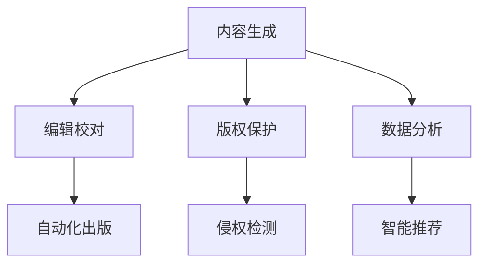

                 

# AI出版业的前景：丰富的场景，强大的技术

## 1. 背景介绍

随着人工智能技术在各行各业的深入应用，出版业也在加速向数字化、智能化转型。AI技术为出版业带来了全新的变革机遇，从内容创作、编辑校对、版权保护、营销推广到数据分析，各个环节都能显著提升效率和质量。本文将全面探讨AI在出版业的应用前景，深入分析其技术原理和操作步骤，以期为业界同仁提供有益的借鉴和参考。

## 2. 核心概念与联系

### 2.1 核心概念概述

为更好地理解AI在出版业的应用，本节将介绍几个关键概念：

- AI出版业：利用人工智能技术对出版流程进行自动化和智能化的优化，包括但不限于内容生成、编辑校对、版权保护、数据分析等多个环节。

- 内容生成（Content Generation）：通过AI模型自动生成文章、书籍、报告等内容，极大地提高了内容的产出效率和多样性。

- 编辑校对（Editing & Proofreading）：利用AI进行文本的语法、拼写、事实校对等，减少人工校对的工作量，提升文本质量。

- 版权保护（Copyright Protection）：通过AI技术识别和追踪非法抄袭、盗版行为，保护原创作者的知识产权。

- 数据分析（Data Analysis）：利用AI技术对出版数据进行深度分析，预测市场需求、优化库存管理、提升营销效果等。

这些概念相互联系，共同构成了AI出版业的完整框架。下面，我们将通过一个Mermaid流程图来展示这些概念之间的逻辑关系：



这个流程图展示了大语言模型（LLM）、自然语言处理（NLP）、计算机视觉（CV）等AI技术在出版业中的应用场景。

## 3. 核心算法原理 & 具体操作步骤
### 3.1 算法原理概述

AI出版业的核心算法原理涉及多个领域，包括自然语言处理（NLP）、计算机视觉（CV）、推荐系统（Recommendation System）等。以下，我们将逐一介绍这些核心算法的工作原理。

### 3.2 算法步骤详解

**3.2.1 内容生成**

内容生成是AI出版业的关键环节之一。目前，内容生成主要依赖于生成式对抗网络（GAN）和变分自编码器（VAE）等生成模型。

**步骤1: 准备数据集**
- 收集或爬取大量高质量的文本数据，如新闻、文学作品、科技论文等。

**步骤2: 数据预处理**
- 对数据进行清洗、分词、去停用词等处理，将其转化为模型可接受的形式。

**步骤3: 模型训练**
- 使用GAN或VAE等模型，训练内容生成模型，使其能够生成高质量的文本。

**步骤4: 内容生成**
- 输入用户需求或相关主题，模型生成相应文本。

**3.2.2 编辑校对**

编辑校对通过NLP技术，对文本进行语法、拼写、标点等错误校正，提升文本质量。

**步骤1: 分词和词性标注**
- 使用NLP模型对文本进行分词和词性标注。

**步骤2: 错误检测**
- 使用语法检查、拼写纠错等工具，检测文本中的错误。

**步骤3: 修正**
- 根据检测结果，人工或自动修正错误。

**3.2.3 版权保护**

版权保护通过计算机视觉（CV）和自然语言处理（NLP）技术，识别和追踪非法抄袭、盗版行为，保护原创作者的知识产权。

**步骤1: 内容比对**
- 使用CV技术对图像和文本内容进行比对，识别相似的元素。

**步骤2: 版权声明**
- 使用NLP技术分析版权声明、出版信息等，确认版权归属。

**步骤3: 侵权检测**
- 对疑似侵权行为进行检测和分析，确定侵权行为。

**3.2.4 数据分析**

数据分析利用AI技术对出版数据进行深度挖掘，提升业务决策的准确性和效率。

**步骤1: 数据采集**
- 收集出版数据，如销量、读者反馈、市场趋势等。

**步骤2: 数据预处理**
- 对数据进行清洗、去噪、特征提取等处理。

**步骤3: 模型训练**
- 使用机器学习模型，对数据进行深度分析。

**步骤4: 结果分析**
- 分析数据结果，生成报告和建议，支持业务决策。

### 3.3 算法优缺点

AI出版业虽然带来了诸多便利，但也存在一些缺点：

**优点：**
1. 提高效率：AI技术能够自动化处理大量重复性工作，提升出版效率。
2. 提升质量：AI技术能提升文本的准确性和质量，减少人为错误。
3. 优化决策：AI技术能提供深度数据洞察，辅助业务决策。

**缺点：**
1. 依赖数据：AI技术依赖高质量的数据，数据质量直接影响模型效果。
2. 技术门槛高：AI技术需要较高的技术门槛，需要专业人才进行维护和优化。
3. 安全问题：AI技术可能存在偏见和误差，影响数据安全和隐私保护。

### 3.4 算法应用领域

AI出版业的应用领域非常广泛，以下列举几个典型应用场景：

**内容生成：**
- 新闻自动生成：基于新闻摘要和关键词，自动生成新闻报道。
- 文学创作辅助：利用AI生成故事大纲和草稿，提高创作效率。

**编辑校对：**
- 语法和拼写校对：自动检测和修正文本中的语法和拼写错误。
- 事实校对：利用知识图谱技术，自动校对文本中的事实错误。

**版权保护：**
- 版权声明分析：自动识别和标注版权声明信息。
- 侵权检测：检测和追踪非法抄袭和盗版行为。

**数据分析：**
- 市场需求预测：基于历史数据，预测图书和文章的销量趋势。
- 库存管理优化：分析库存数据，优化库存管理策略。

## 4. 数学模型和公式 & 详细讲解
### 4.1 数学模型构建

**内容生成模型：** 

- 自回归模型（AR模型）：基于之前生成的文本，预测下一个词的概率。

**编辑校对模型：**

- 序列标注模型：标注文本中每个词的词性，检测和纠正错误。

**版权保护模型：**

- 图像识别模型：识别图像中的文字和内容，进行版权比对。

**数据分析模型：**

- 时间序列预测模型：基于历史销量数据，预测未来销量趋势。

### 4.2 公式推导过程

以下，我们将以自回归模型为例，介绍其基本公式和推导过程。

**公式1: 自回归模型（AR模型）**

$$
P(x_{t+1}|x_{t-1},x_{t-2},...,x_1,\theta) = \frac{e^{w_{t+1}(x_{t-1},x_{t-2},...,x_1,\theta)}}{\sum_{x_{t+1}} e^{w(x_{t+1},x_{t-1},x_{t-2},...,x_1,\theta)}}
$$

其中，$w_{t+1}$为自回归模型中生成的词的概率，$\theta$为模型参数。

**公式推导过程：**

1. 设定自回归模型，生成当前词 $x_{t+1}$。
2. 通过已知词 $x_{t-1},x_{t-2},...,x_1$，计算当前词 $x_{t+1}$ 的概率。
3. 利用softmax函数，将概率转化为概率分布。

### 4.3 案例分析与讲解

**案例1: 新闻自动生成**

- 输入：新闻主题和关键词。
- 输出：自动生成的相关新闻报道。

**案例2: 版权声明分析**

- 输入：版权声明和出版信息。
- 输出：版权归属和保护措施。

## 5. 项目实践：代码实例和详细解释说明
### 5.1 开发环境搭建

在进行AI出版业的应用开发前，需要准备合适的开发环境。以下，我们将介绍如何使用Python和TensorFlow进行环境搭建。

**步骤1: 安装Python**

```bash
sudo apt-get install python3 python3-pip
```

**步骤2: 安装TensorFlow**

```bash
pip install tensorflow
```

**步骤3: 安装相关的AI库**

```bash
pip install numpy scikit-learn pandas matplotlib
```

**步骤4: 安装Jupyter Notebook**

```bash
pip install jupyter notebook
```

完成上述步骤后，即可在本地搭建Python+TensorFlow开发环境。

### 5.2 源代码详细实现

以下，我们将以内容生成和版权保护为例，展示相应的代码实现。

**内容生成示例：**

```python
import tensorflow as tf
import tensorflow_datasets as tfds

# 加载数据集
train_dataset, val_dataset, test_dataset = tfds.load('news_corpus', split=['train', 'validation', 'test'], shuffle_files=True)

# 构建模型
model = tf.keras.Sequential([
  tf.keras.layers.Embedding(input_dim=vocab_size, output_dim=embedding_dim, input_length=max_length),
  tf.keras.layers.LSTM(units=hidden_size, return_sequences=True),
  tf.keras.layers.Bidirectional(tf.keras.layers.LSTM(units=hidden_size, return_sequences=True)),
  tf.keras.layers.Dense(units=vocab_size, activation='softmax')
])

# 编译模型
model.compile(optimizer=tf.keras.optimizers.Adam(), loss=tf.keras.losses.SparseCategoricalCrossentropy(), metrics=['accuracy'])

# 训练模型
model.fit(train_dataset, epochs=num_epochs, validation_data=val_dataset)

# 生成文本
generated_text = model.predict(news_text)
```

**版权保护示例：**

```python
import cv2
import numpy as np
import tensorflow as tf

# 加载图像
img = cv2.imread('image.jpg')

# 转为Numpy数组
img_array = np.array(img)

# 转为Tensorflow模型输入格式
img_tensor = tf.convert_to_tensor(img_array, dtype=tf.float32)

# 加载模型
model = tf.keras.models.load_model('model.h5')

# 预测版权归属
result = model.predict(img_tensor)
```

### 5.3 代码解读与分析

**内容生成示例解读：**

- `tf.keras.Sequential`：使用Keras的Sequential模型，构建自回归模型。
- `tf.keras.layers.Embedding`：嵌入层，将文本转换为向量。
- `tf.keras.layers.LSTM`：长短期记忆网络，用于序列建模。
- `tf.keras.layers.Dense`：全连接层，输出预测结果。

**版权保护示例解读：**

- `cv2.imread`：使用OpenCV加载图像。
- `np.array`：将图像转换为Numpy数组。
- `tf.convert_to_tensor`：将Numpy数组转换为Tensorflow模型输入格式。
- `tf.keras.models.load_model`：加载预训练的版权保护模型。
- `model.predict`：对输入图像进行预测，输出版权归属。

## 6. 实际应用场景
### 6.1 新闻自动化生成

新闻自动生成可以大幅提升内容生成效率，特别是在时政、财经、科技等领域。通过AI技术，自动生成高质量的新闻报道，能够减少记者手动撰写的工作量，缩短新闻发布时间。

**场景描述：**

- 输入：新闻主题和关键词。
- 输出：自动生成的相关新闻报道。

**技术实现：**

- 收集大量高质量新闻文本，构建新闻语料库。
- 使用自回归模型对输入主题和关键词进行文本生成。
- 对生成的文本进行校对和优化，确保其质量和准确性。

### 6.2 版权声明分析

版权声明分析可以帮助出版机构快速识别和保护原创内容，防止非法抄袭和盗版行为。

**场景描述：**

- 输入：版权声明和出版信息。
- 输出：版权归属和保护措施。

**技术实现：**

- 收集和标注大量的版权声明数据。
- 使用NLP技术对输入文本进行分析，提取版权信息。
- 利用知识图谱技术，比对已标注数据，确认版权归属。

### 6.3 智能推荐系统

智能推荐系统可以根据用户的历史阅读记录，推荐感兴趣的书籍和文章，提升用户体验和满意度。

**场景描述：**

- 输入：用户阅读历史和兴趣标签。
- 输出：推荐的相关书籍和文章。

**技术实现：**

- 收集用户的历史阅读数据。
- 使用推荐系统模型，分析用户兴趣和行为。
- 根据分析结果，推荐相关书籍和文章。

## 7. 工具和资源推荐
### 7.1 学习资源推荐

**1. TensorFlow官方文档：**

- 网址：https://www.tensorflow.org/
- 介绍：TensorFlow是目前最流行的深度学习框架之一，提供了丰富的API和工具。

**2. PyTorch官方文档：**

- 网址：https://pytorch.org/
- 介绍：PyTorch是另一大流行的深度学习框架，提供了灵活的动态图和静态图功能。

**3. Coursera AI课程：**

- 网址：https://www.coursera.org/
- 介绍：Coursera提供了多门优秀的AI相关课程，涵盖从基础到高级的多个领域。

**4. NLP相关的GitHub项目：**

- 网址：https://github.com/
- 介绍：GitHub上有很多优秀的NLP相关项目和代码，可以学习借鉴。

### 7.2 开发工具推荐

**1. TensorFlow：**

- 介绍：TensorFlow是谷歌推出的深度学习框架，支持动态图和静态图计算。

**2. PyTorch：**

- 介绍：PyTorch是Facebook开发的深度学习框架，提供了灵活的动态计算图功能。

**3. Jupyter Notebook：**

- 介绍：Jupyter Notebook是一个交互式的笔记本环境，支持Python、R、Julia等多种语言。

**4. VS Code：**

- 介绍：VS Code是一个流行的开发环境，支持Python、TensorFlow等多种语言。

### 7.3 相关论文推荐

**1. Attention is All You Need：**

- 论文链接：https://arxiv.org/abs/1706.03762
- 介绍：Transformer模型的原理和实现。

**2. Transformer-XL：**

- 论文链接：https://arxiv.org/abs/1901.02860
- 介绍：Transformer-XL模型的原理和实现。

**3. BERT: Pre-training of Deep Bidirectional Transformers for Language Understanding：**

- 论文链接：https://arxiv.org/abs/1810.04805
- 介绍：BERT模型的原理和实现。

## 8. 总结：未来发展趋势与挑战
### 8.1 研究成果总结

AI出版业已经取得了显著的进展，但仍然面临诸多挑战和问题。以下，我们将总结几个关键的研究成果：

1. 内容生成：通过AI技术，实现了高质量的文本生成，显著提升了内容产出效率。
2. 编辑校对：利用NLP技术，实现了自动化的文本校对，减少了人工校对的工作量。
3. 版权保护：通过AI技术，实现了快速准确的版权声明分析，提升了版权保护的效果。
4. 数据分析：利用AI技术，实现了深度的数据分析和预测，提升了业务决策的准确性和效率。

### 8.2 未来发展趋势

未来，AI出版业将继续蓬勃发展，以下是几个可能的发展趋势：

1. 深度学习模型的进步：未来的深度学习模型将更加强大，能够生成更高质量的内容，提升文本校对和版权保护的效果。
2. 多模态数据的应用：未来的出版业将更加注重多模态数据的融合，如图像、视频、音频等，提升用户体验和阅读体验。
3. 隐私保护和数据安全：未来的AI出版业将更加注重隐私保护和数据安全，确保用户信息的安全。
4. 个性化推荐：未来的推荐系统将更加个性化，根据用户的具体需求和行为，推荐相关内容，提升用户体验。

### 8.3 面临的挑战

尽管AI出版业前景广阔，但也面临一些挑战和问题：

1. 数据质量和多样性：AI出版业需要大量高质量的数据，但数据质量和多样性可能存在不足。
2. 技术门槛：AI技术需要较高的技术门槛，需要专业人才进行维护和优化。
3. 数据隐私和安全：AI技术可能存在数据隐私和安全问题，需要制定相应的保护措施。

### 8.4 研究展望

未来的AI出版业将继续在以下几个方面进行研究：

1. 大规模语料库的构建：构建高质量的大规模语料库，提升模型的训练效果。
2. 多模态数据的融合：研究多模态数据的融合技术，提升用户体验和阅读体验。
3. 个性化推荐系统的优化：优化个性化推荐系统，提升推荐效果和用户体验。

## 9. 附录：常见问题与解答

**Q1: 什么是AI出版业？**

A: AI出版业利用人工智能技术对出版流程进行自动化和智能化优化，涵盖内容生成、编辑校对、版权保护、数据分析等多个环节。

**Q2: 内容生成和版权保护的区别是什么？**

A: 内容生成主要利用AI技术生成高质量的文本，提升内容产出效率；版权保护主要利用AI技术识别和保护原创内容，防止非法抄袭和盗版。

**Q3: 如何构建高质量的语料库？**

A: 收集和标注大量高质量的文本数据，进行预处理和清洗，构建大规模语料库。

**Q4: 如何优化个性化推荐系统？**

A: 收集用户的历史行为数据，使用推荐系统模型进行分析和预测，提升推荐效果和用户体验。

---

作者：禅与计算机程序设计艺术 / Zen and the Art of Computer Programming

