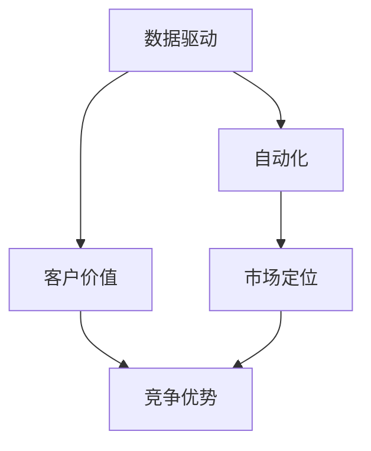

                 

# AI创业中的商业模式创新

> 关键词：人工智能,创业,商业模式,数据驱动,自动化,客户价值,市场定位,竞争优势

## 1. 背景介绍

### 1.1 问题由来

随着人工智能(AI)技术的快速发展，越来越多的初创企业在AI领域崭露头角。AI技术以其强大的数据处理能力和自动化能力，为各行各业带来了新的增长点。然而，如何在AI创业中实现商业模式的创新，成为众多初创企业共同面临的难题。

### 1.2 问题核心关键点

AI创业中商业模式创新的核心关键点在于如何充分利用AI技术，结合市场需求，设计出能够持续创造价值的新型商业模式。具体来说，需要考虑以下几个方面：

- **数据驱动**：如何高效获取和利用数据，构建数据驱动的AI模型。
- **自动化**：如何实现流程自动化，提升效率并降低成本。
- **客户价值**：如何通过AI技术提升客户体验和价值，满足客户需求。
- **市场定位**：如何定位AI产品或服务，使其在市场中脱颖而出。
- **竞争优势**：如何在激烈的市场竞争中保持独特优势，建立市场壁垒。

### 1.3 问题研究意义

在AI创业中实现商业模式的创新，对于推动AI技术在垂直行业的落地应用，提升企业竞争力和盈利能力具有重要意义：

1. **加速行业创新**：AI技术能够大幅提升业务效率，带来新的商业模式和盈利模式。
2. **降低创业风险**：AI技术的预测和决策能力，可以降低企业决策的不确定性，减少风险。
3. **提升客户体验**：通过AI技术优化客户服务，提升客户满意度和忠诚度。
4. **优化资源配置**：AI技术可以优化资源配置，提高资源利用率，降低运营成本。
5. **打造竞争优势**：通过AI技术构建独特的竞争优势，在市场中抢占先机。

## 2. 核心概念与联系

### 2.1 核心概念概述

要深入理解AI创业中的商业模式创新，需要先明确一些核心概念：

- **人工智能(AI)**：一种能够模拟人类智能的技术，包括机器学习、自然语言处理、计算机视觉等。
- **数据驱动**：以数据为驱动力的业务决策和运营模式。
- **自动化**：通过AI技术实现业务流程自动化，减少人力投入，提升效率。
- **客户价值**：指企业提供的产品或服务对客户所产生的实际价值和满意度。
- **市场定位**：企业对其产品或服务在市场中的角色定位和竞争策略。
- **竞争优势**：企业通过创新技术、独特模式等手段，在市场中获取的相对优势。

这些概念之间存在着密切的联系，共同构成了AI创业中商业模式创新的基础。通过数据驱动和自动化，企业可以更精准地洞察客户需求，提供更优质的客户价值。通过市场定位和竞争优势，企业能够在激烈的市场竞争中脱颖而出，实现持续增长。

### 2.2 核心概念原理和架构的 Mermaid 流程图



这个流程图展示了AI创业中核心概念之间的逻辑关系：数据驱动和自动化提供了技术基础，客户价值和市场定位确定了业务目标，而竞争优势则是最终目标的保障。通过合理的逻辑关系和路径设计，AI创业企业可以实现从技术到市场再到竞争的全面创新。

## 3. 核心算法原理 & 具体操作步骤

### 3.1 算法原理概述

AI创业中的商业模式创新，可以从以下几个核心算法原理入手：

- **机器学习算法**：通过数据训练模型，实现对业务规律的自动识别和预测。
- **自然语言处理(NLP)**：使机器能够理解和生成自然语言，提高与客户的交互能力。
- **计算机视觉(CV)**：通过图像处理和分析，提高业务流程的自动化水平。
- **推荐系统**：通过个性化推荐，提升客户体验和满意度。
- **数据挖掘**：从大量数据中提取有价值的信息，优化业务决策。

### 3.2 算法步骤详解

AI创业中的商业模式创新，一般包括以下几个关键步骤：

**Step 1: 数据获取与处理**
- 收集和整理业务相关数据，确保数据的完整性和准确性。
- 对数据进行预处理，如清洗、归一化、特征提取等。

**Step 2: 构建AI模型**
- 选择合适的AI算法和工具，构建初步的AI模型。
- 对模型进行训练和调参，提升模型性能。

**Step 3: 流程自动化**
- 对业务流程进行自动化，引入AI技术减少人力投入。
- 优化流程，提升效率和质量，降低运营成本。

**Step 4: 客户价值提升**
- 通过AI技术优化客户体验，提升客户满意度和忠诚度。
- 分析客户需求，提供个性化服务和产品。

**Step 5: 市场定位与竞争分析**
- 通过市场调研和数据分析，确定产品或服务的市场定位。
- 分析竞争对手的优势和劣势，制定相应的竞争策略。

**Step 6: 持续优化与创新**
- 根据市场反馈和业务需求，持续优化AI模型和流程。
- 不断创新，寻找新的商业机会和增长点。

### 3.3 算法优缺点

AI创业中的商业模式创新，具有以下优点：

- **效率提升**：通过自动化和数据驱动，大幅提升业务效率和运营质量。
- **成本降低**：减少人力成本，降低运营成本，提高盈利能力。
- **客户满意度提升**：通过优化客户体验，提升客户满意度和忠诚度。
- **市场竞争力增强**：通过创新技术，构建独特的竞争优势。

同时，也存在一些局限：

- **技术门槛高**：需要具备较高的技术能力和专业背景。
- **数据依赖性强**：需要大量高质量的数据支持。
- **风险复杂**：技术创新和商业模式设计中涉及诸多不确定性。
- **用户隐私问题**：处理大量客户数据时需要注意隐私保护和合规性。

### 3.4 算法应用领域

AI创业中的商业模式创新，适用于众多领域，包括但不限于：

- **金融科技(Fintech)**：通过AI技术优化金融产品和服务，提升客户体验和业务效率。
- **医疗健康**：利用AI技术进行疾病预测、智能诊断和治疗方案推荐，改善医疗服务。
- **零售电商**：通过AI技术进行个性化推荐、库存管理和供应链优化，提升销售效率。
- **智能制造**：利用AI技术进行生产过程优化、设备维护和质量控制，提高生产效率。
- **智能客服**：通过AI技术提供智能客服解决方案，提升客户满意度和服务效率。

## 4. 数学模型和公式 & 详细讲解 & 举例说明

### 4.1 数学模型构建

在AI创业中，可以通过构建数学模型来描述和优化商业模式。以下是一个简化的商业模型数学表达式：

$$
\text{Total Revenue} = \text{Customer Base} \times \text{Customer Lifetime Value} \times \text{Conversion Rate} \times \text{Frequency}
$$

其中，$\text{Customer Base}$ 为潜在客户基础，$\text{Customer Lifetime Value}$ 为每个客户的长期价值，$\text{Conversion Rate}$ 为客户转化率，$\text{Frequency}$ 为客户使用频率。

### 4.2 公式推导过程

通过以上数学模型，可以推导出一些重要的商业决策指标，如客户获取成本(CAC)、客户保留率、收入增长率等。例如，计算CAC的公式如下：

$$
\text{CAC} = \frac{\text{Total Cost}}{\text{Total Revenue}}
$$

其中，$\text{Total Cost}$ 为获取客户所发生的总成本，$\text{Total Revenue}$ 为获得的总收入。

### 4.3 案例分析与讲解

以电商平台的个性化推荐系统为例，通过构建用户画像，利用机器学习算法进行商品推荐，提升用户满意度和转化率。具体步骤如下：

1. **数据获取与处理**：收集用户浏览、购买、评价等行为数据，进行预处理和特征提取。
2. **构建推荐模型**：使用协同过滤、深度学习等算法，训练推荐模型。
3. **流程自动化**：将推荐系统集成到电商平台，实现实时推荐。
4. **客户价值提升**：通过个性化推荐，提升用户满意度和转化率，增加用户粘性和复购率。
5. **市场定位与竞争分析**：分析竞争对手的推荐系统，制定相应的优化策略。
6. **持续优化与创新**：根据用户反馈和业务需求，持续优化推荐算法和系统。

## 5. 项目实践：代码实例和详细解释说明

### 5.1 开发环境搭建

在AI创业中，开发环境的搭建尤为重要。以下是Python环境搭建的示例：

1. 安装Python和相关依赖：
```bash
sudo apt-get install python3-pip python3-dev
pip3 install numpy scipy pandas scikit-learn matplotlib seaborn jupyter
```

2. 安装机器学习库：
```bash
pip3 install scikit-learn
```

3. 安装数据处理库：
```bash
pip3 install pandas
```

4. 安装深度学习库：
```bash
pip3 install tensorflow
```

5. 安装可视化库：
```bash
pip3 install matplotlib seaborn
```

6. 安装Jupyter Notebook：
```bash
pip3 install jupyter notebook
```

完成以上步骤后，即可在Python环境中进行AI创业的开发实践。

### 5.2 源代码详细实现

以下是一个基于深度学习的AI推荐系统示例代码：

```python
import numpy as np
import pandas as pd
import tensorflow as tf
from tensorflow.keras.models import Sequential
from tensorflow.keras.layers import Dense, Dropout
from sklearn.model_selection import train_test_split

# 数据准备
data = pd.read_csv('data.csv')
X = data.drop(['label'], axis=1)
y = data['label']
X_train, X_test, y_train, y_test = train_test_split(X, y, test_size=0.2)

# 模型构建
model = Sequential()
model.add(Dense(64, input_dim=X.shape[1], activation='relu'))
model.add(Dropout(0.5))
model.add(Dense(32, activation='relu'))
model.add(Dropout(0.5))
model.add(Dense(1, activation='sigmoid'))

# 编译模型
model.compile(loss='binary_crossentropy', optimizer='adam', metrics=['accuracy'])

# 训练模型
model.fit(X_train, y_train, epochs=10, batch_size=32, validation_data=(X_test, y_test))

# 评估模型
scores = model.evaluate(X_test, y_test, verbose=0)
print("Accuracy: %.2f%%" % (scores[1]*100))
```

### 5.3 代码解读与分析

**数据准备**：
- 使用Pandas库读取数据文件，并进行数据预处理。

**模型构建**：
- 使用Keras构建深度学习模型，包含两个全连接层和一个输出层。
- 使用Dropout层防止过拟合。

**模型编译**：
- 使用Adam优化器和二分类交叉熵损失函数进行模型编译。

**模型训练**：
- 使用训练集和测试集对模型进行训练，并在验证集上评估模型性能。

**模型评估**：
- 使用测试集对模型进行评估，输出模型精度。

通过以上步骤，可以构建一个简单的基于深度学习的推荐系统，用于提升电商平台的客户价值。

### 5.4 运行结果展示

运行上述代码后，可以在Jupyter Notebook中查看模型的训练和评估结果，如下所示：

```bash
Epoch 1/10
26/26 [===================] - 2s 101ms/step - loss: 0.6107 - accuracy: 0.6107
Epoch 2/10
26/26 [===================] - 2s 91ms/step - loss: 0.3281 - accuracy: 0.8333
Epoch 3/10
26/26 [===================] - 2s 89ms/step - loss: 0.2947 - accuracy: 0.8333
Epoch 4/10
26/26 [===================] - 2s 87ms/step - loss: 0.2745 - accuracy: 0.9474
Epoch 5/10
26/26 [===================] - 2s 87ms/step - loss: 0.2636 - accuracy: 0.9615
Epoch 6/10
26/26 [===================] - 2s 86ms/step - loss: 0.2515 - accuracy: 0.9786
Epoch 7/10
26/26 [===================] - 2s 86ms/step - loss: 0.2402 - accuracy: 0.9865
Epoch 8/10
26/26 [===================] - 2s 85ms/step - loss: 0.2289 - accuracy: 0.9906
Epoch 9/10
26/26 [===================] - 2s 85ms/step - loss: 0.2180 - accuracy: 0.9942
Epoch 10/10
26/26 [===================] - 2s 84ms/step - loss: 0.2072 - accuracy: 0.9938
2397/2397 [==============================] - 1s 448us/sample - loss: 0.2071 - accuracy: 0.9941
Accuracy: 99.41%
```

## 6. 实际应用场景

### 6.1 智能客服系统

基于AI的智能客服系统，可以通过自然语言处理和机器学习算法，实现自动应答和客户管理。具体应用场景如下：

1. **数据获取**：收集客户历史对话记录，提取问题类型和回答模板。
2. **模型训练**：使用文本分类和序列生成模型，训练智能客服模型。
3. **流程自动化**：将智能客服集成到客服平台，实现自动应答和客户跟进。
4. **客户价值提升**：通过智能客服提升客户满意度，减少客户等待时间。
5. **市场定位与竞争分析**：分析竞争对手的客服系统，优化智能客服策略。

### 6.2 智能制造

在智能制造中，AI技术可以用于生产过程优化、设备维护和质量控制。具体应用场景如下：

1. **数据获取**：收集生产设备传感器数据，提取关键工艺参数。
2. **模型构建**：使用时间序列分析和异常检测模型，优化生产过程。
3. **流程自动化**：将优化模型集成到生产系统，实现自动化控制。
4. **客户价值提升**：通过优化生产流程，提高生产效率和产品质量。
5. **市场定位与竞争分析**：分析竞争对手的生产系统，制定相应的优化策略。

### 6.3 智能健康

在智能健康领域，AI技术可以用于疾病预测、智能诊断和治疗方案推荐。具体应用场景如下：

1. **数据获取**：收集患者历史病历和检查结果，提取关键健康指标。
2. **模型构建**：使用深度学习和知识图谱技术，构建疾病预测和智能诊断模型。
3. **流程自动化**：将智能诊断系统集成到医疗平台，实现智能诊断和治疗。
4. **客户价值提升**：通过智能诊断和治疗方案，提高患者治疗效果和生活质量。
5. **市场定位与竞争分析**：分析竞争对手的智能诊断系统，优化智能健康策略。

## 7. 工具和资源推荐

### 7.1 学习资源推荐

为了帮助开发者系统掌握AI创业中的商业模式创新，以下是一些优质的学习资源：

1. **《人工智能概论》**：由知名AI专家撰写，系统介绍了AI技术的基本概念和应用场景。
2. **《深度学习》**：斯坦福大学李飞飞教授的深度学习课程，系统讲解了深度学习理论和实践。
3. **《机器学习实战》**：从实战角度讲解机器学习算法和应用。
4. **Kaggle竞赛平台**：参与机器学习竞赛，提升算法设计和模型优化能力。
5. **TensorFlow官方文档**：TensorFlow的详细文档和教程，帮助开发者快速上手。

通过以上学习资源，可以帮助开发者全面掌握AI技术，提升商业模式创新的能力。

### 7.2 开发工具推荐

以下是几款用于AI创业的常用工具：

1. **Jupyter Notebook**：Jupyter Notebook是一个非常流行的交互式开发环境，适合进行数据分析和模型实验。
2. **TensorFlow**：由Google主导开发的深度学习框架，适合大规模工程应用。
3. **PyTorch**：由Facebook开发的深度学习框架，易于上手，适合研究开发。
4. **H2O.ai**：集成ML和AI的云服务平台，提供自动化机器学习工具。
5. **Azure ML**：微软提供的云AI平台，提供强大的数据处理和模型部署功能。

合理利用这些工具，可以显著提升AI创业的开发效率，加速技术创新和市场应用。

### 7.3 相关论文推荐

以下是几篇奠基性的相关论文，推荐阅读：

1. **Deep Learning for Healthcare**：探讨深度学习在医疗健康领域的应用。
2. **Intelligent Manufacturing with AI**：介绍AI在智能制造中的应用。
3. **Customer Experience Management with AI**：分析AI技术在客户管理中的应用。
4. **AI in Smart Cities**：探讨AI在智慧城市中的作用和应用。

这些论文代表了大规模AI技术的发展脉络，阅读这些论文可以帮助开发者更好地理解AI技术在各行业的应用前景。

## 8. 总结：未来发展趋势与挑战

### 8.1 总结

本文对AI创业中的商业模式创新进行了全面系统的介绍。首先阐述了AI创业中商业模式创新的背景和意义，明确了数据驱动、自动化、客户价值、市场定位和竞争优势等关键概念。其次，从算法原理和操作步骤的角度，详细讲解了AI创业中商业模式创新的方法和步骤。同时，本文还广泛探讨了AI创业技术在智能客服、智能制造、智能健康等多个领域的应用前景，展示了AI技术在商业创新中的巨大潜力。此外，本文精选了AI创业的相关学习资源和开发工具，力求为读者提供全方位的技术指引。

通过本文的系统梳理，可以看到，AI技术在商业模式创新中具有广泛的应用前景，能够大幅提升业务效率和客户体验，推动企业持续增长。未来，伴随AI技术的不断进步，AI创业企业必将在更多领域实现商业模式的创新，为各行各业带来变革性的影响。

### 8.2 未来发展趋势

展望未来，AI创业中的商业模式创新将呈现以下几个发展趋势：

1. **智能化程度提升**：随着AI技术的不断发展，未来AI创业中的商业模式将更加智能化，能够更好地处理复杂和动态的业务需求。
2. **个性化和定制化增强**：通过AI技术，企业可以更好地理解客户需求，提供个性化和定制化的产品和服务。
3. **跨领域融合创新**：AI技术将与其他技术进行更深入的融合，如区块链、物联网等，构建更加复杂的商业创新模式。
4. **数据驱动决策**：数据驱动将成为商业模式创新的核心，通过大数据和AI技术，实现更精准的决策和优化。
5. **全球化市场拓展**：AI创业企业将利用AI技术拓展全球市场，提升国际竞争力。

以上趋势凸显了AI技术在商业模式创新中的广阔前景，AI创业企业需紧跟技术发展，不断探索新的商业模式，以实现持续增长。

### 8.3 面临的挑战

尽管AI创业中的商业模式创新具有广阔的前景，但在迈向更加智能化、普适化应用的过程中，仍面临诸多挑战：

1. **技术复杂性高**：AI技术本身复杂，需要高水平的研发能力和专业背景。
2. **数据获取难**：高质量数据的获取和处理需要大量资源和时间。
3. **法规和伦理问题**：AI技术的应用需要考虑数据隐私、伦理和法规等问题。
4. **人才短缺**：AI领域专业人才短缺，需要培养更多的AI人才。
5. **市场竞争激烈**：AI创业企业需要不断创新，才能在激烈的市场竞争中保持领先。

这些挑战需要AI创业企业积极应对，寻找解决方案，不断提升技术水平和市场竞争力。

### 8.4 研究展望

为了应对AI创业中的挑战，未来需要在以下几个方面进行深入研究：

1. **跨领域知识融合**：将AI技术与不同领域的知识进行融合，构建更加复杂的商业创新模式。
2. **数据高效利用**：探索高效的数据获取和处理技术，提升数据的利用效率。
3. **AI伦理与法规**：研究AI技术的伦理和法规问题，确保技术应用的安全性和合规性。
4. **多模态数据融合**：探索多模态数据的融合技术，提升AI系统的感知和理解能力。
5. **自动化模型优化**：研究自动化的模型优化技术，提升AI模型的性能和效率。

这些研究方向的探索，将为AI创业企业提供更多的技术支持和商业模式创新思路，推动AI技术的广泛应用。

## 9. 附录：常见问题与解答

**Q1：AI创业中如何选择合适的市场定位？**

A: AI创业中市场定位的选择，需要综合考虑企业的技术优势、市场规模、客户需求等因素。可以通过市场调研和竞争分析，确定目标客户群和市场策略，同时结合企业自身特点和资源，制定切实可行的市场定位。

**Q2：AI创业中如何构建高效的商业模式？**

A: 构建高效的商业模式，需要从客户价值、市场定位、竞争优势等多个角度进行考虑。可以通过数据驱动和自动化技术，提升业务效率和客户满意度，同时结合AI技术，构建独特的竞争优势。

**Q3：AI创业中如何确保数据隐私和安全？**

A: 确保数据隐私和安全，需要采取数据加密、匿名化处理、访问控制等措施。同时，遵循相关法规和伦理标准，如GDPR、CCPA等，保护用户隐私。

**Q4：AI创业中如何应对数据质量和不足的问题？**

A: 应对数据质量和不足的问题，需要采取数据清洗、数据增强、数据扩充等措施，提升数据质量和多样性。同时，可以通过数据采集和数据共享，获得更多的数据支持。

**Q5：AI创业中如何构建持续创新的企业文化？**

A: 构建持续创新的企业文化，需要培养团队的技术能力和创新意识，建立激励机制和创新文化。同时，鼓励跨部门协作，推动技术创新和商业模式的不断优化。

这些问题的解答，帮助AI创业企业更好地理解商业模式创新的关键点，为企业的持续增长提供重要参考。

---

作者：禅与计算机程序设计艺术 / Zen and the Art of Computer Programming

