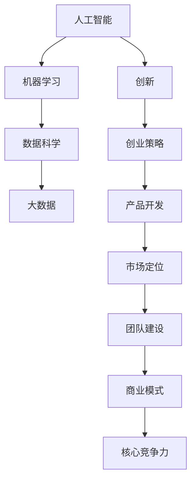

                 

# AI创业公司如何打造核心竞争力?

> 关键词：人工智能,AI创业,核心竞争力,机器学习,数据科学,大数据,创新,创业策略,产品开发,市场定位,团队建设

## 1. 背景介绍

### 1.1 问题由来

近年来，随着人工智能(AI)技术的快速发展，越来越多的AI创业公司涌现出来，竞争日趋激烈。如何在激烈的市场竞争中脱颖而出，打造具有核心竞争力的产品和服务，成为了AI创业公司面临的重大挑战。

### 1.2 问题核心关键点

打造核心竞争力的关键在于理解AI技术、市场需求、市场竞争、产品创新、团队建设和商业模式的相互作用和内在联系。AI创业公司必须全面、系统地把握这些关键点，才能构建持久的市场优势。

## 2. 核心概念与联系

### 2.1 核心概念概述

为更好地理解AI创业公司如何打造核心竞争力，本节将介绍几个关键概念及其联系：

- **人工智能(AI)**：利用计算机算法、模型和数据处理技术，使计算机能够模拟和执行人的思维过程，实现智能决策和任务自动化。
- **机器学习(ML)**：通过数据驱动的方式，让计算机系统能够自动学习和改进其性能，无需显式编程。
- **数据科学**：融合统计学、机器学习和数据工程等多个领域，通过数据分析和挖掘，提升决策的科学性和准确性。
- **大数据**：涉及数据的采集、存储、处理、分析和应用，是AI和ML的基础。
- **创新(Innovation)**：通过新思想、新技术和新产品，创造新的价值，满足用户需求。
- **创业策略(Business Strategy)**：企业在市场竞争中定位、竞争和增长的方法和手段。
- **产品开发(Product Development)**：从需求分析到设计、开发、测试和迭代的过程。
- **市场定位(Market Positioning)**：通过差异化竞争策略，使产品和服务在目标市场中获得竞争优势。
- **团队建设(Team Building)**：选拔、培训和激励人才，形成高绩效的团队文化。
- **商业模式(Business Model)**：通过产品、服务、渠道、客户和成本等要素的合理组合，实现商业价值最大化。

这些概念之间的逻辑关系可以通过以下Mermaid流程图来展示：



这个流程图展示了AI创业公司打造核心竞争力的关键要素及其内在联系：

1. 人工智能技术作为基础，通过机器学习和数据科学驱动，利用大数据技术获取和处理信息。
2. 创新驱动创业策略的制定，指导产品开发和市场定位。
3. 通过团队建设和商业模式优化，构建具有竞争力的产品和服务。

## 3. 核心算法原理 & 具体操作步骤
### 3.1 算法原理概述

AI创业公司打造核心竞争力的核心算法原理主要包括以下几个方面：

- **数据驱动的决策**：利用数据科学和大数据技术，提取、分析和应用数据，驱动决策过程的科学性和精准性。
- **差异化竞争策略**：通过创新和产品差异化，满足用户独特的痛点和需求，形成竞争优势。
- **敏捷开发和迭代**：采用敏捷开发方法，快速响应市场变化和用户反馈，持续迭代产品和服务。
- **市场定位和品牌建设**：通过精准的市场定位和有效的品牌传播，提高市场认知度和用户黏性。
- **高效的团队管理**：通过科学的团队建设和激励机制，激发团队的创新力和执行力。
- **商业模式优化**：设计合理的商业模式，确保商业价值最大化，实现可持续发展。

### 3.2 算法步骤详解

AI创业公司打造核心竞争力的操作步骤主要分为以下几个阶段：

**Step 1: 市场需求分析**

- **用户调研**：通过问卷、访谈、焦点小组等方式，了解目标用户的需求、痛点和行为特征。
- **竞争分析**：研究竞争对手的产品和服务，分析其优势和不足。
- **趋势预测**：利用数据分析和市场预测模型，预判未来的市场需求和变化趋势。

**Step 2: 产品创新与设计**

- **技术评估**：评估现有技术的可行性和应用前景，选择最适合的技术方案。
- **原型开发**：构建产品原型，进行功能测试和用户体验测试。
- **用户反馈**：收集用户反馈，进行产品迭代优化。

**Step 3: 产品测试与优化**

- **测试策略**：制定全面的测试计划，进行功能测试、性能测试、安全测试和用户测试。
- **数据分析**：利用数据分析技术，评估产品的性能和用户满意度。
- **迭代优化**：根据测试结果和用户反馈，进行产品迭代和优化。

**Step 4: 市场定位与推广**

- **定位策略**：根据市场需求和用户画像，制定产品市场定位策略。
- **品牌建设**：通过品牌传播和营销活动，提高品牌认知度和美誉度。
- **渠道布局**：选择合适的销售和分销渠道，扩大市场覆盖范围。

**Step 5: 团队建设与管理**

- **人才招聘**：通过有效的招聘渠道和机制，吸引和选拔优秀人才。
- **培训与发展**：制定科学的培训和发展计划，提升团队技能和素质。
- **激励机制**：建立公平合理的激励机制，激发团队的工作积极性和创造力。

**Step 6: 商业模式设计与优化**

- **价值主张**：明确产品的核心价值主张和用户价值。
- **盈利模式**：设计合理的盈利模式，确保商业可持续性和盈利能力。
- **成本控制**：通过成本分析和控制，降低运营成本，提高利润率。

**Step 7: 核心竞争力的构建与维护**

- **技术创新**：持续投入技术研发，保持技术领先优势。
- **品牌保护**：加强品牌管理和知识产权保护，防止侵权和山寨。
- **市场监控**：持续监控市场竞争和用户反馈，及时调整策略。

### 3.3 算法优缺点

AI创业公司打造核心竞争力的算法具有以下优点：

- **科学决策**：数据驱动的决策过程可以降低主观判断的误差，提升决策的准确性和科学性。
- **差异化优势**：通过产品创新和差异化策略，可以满足用户独特需求，形成竞争优势。
- **快速迭代**：敏捷开发方法可以快速响应市场变化和用户反馈，持续迭代优化产品。
- **市场定位明确**：通过精准的市场定位和有效的品牌建设，可以提高市场认知度和用户黏性。
- **团队激励机制完善**：科学的团队建设和管理可以激发团队的工作积极性和创新力。
- **商业模式清晰**：合理的商业模式可以确保商业价值最大化，实现可持续发展。

同时，该算法也存在一定的局限性：

- **对数据质量要求高**：数据驱动的决策过程依赖于高质量的数据，数据缺失或不准确会影响决策效果。
- **技术研发投入大**：持续的技术研发需要大量的资金和人力投入，对于初创公司而言可能存在较大压力。
- **市场变化快**：市场需求和竞争环境变化迅速，需要灵活应对和快速调整策略。
- **团队管理复杂**：高效的团队建设和管理需要科学的机制和技巧，否则可能导致人才流失或团队士气低落。
- **商业模式选择风险**：不同的商业模式各有利弊，选择不当可能导致商业失败。

### 3.4 算法应用领域

AI创业公司打造核心竞争力的算法在多个领域都有广泛应用，例如：

- **智能家居**：通过AI技术驱动的智能硬件和应用，提供舒适便捷的生活体验。
- **智能医疗**：利用AI技术提升诊断和治疗的准确性和效率，改善医疗服务质量。
- **智能教育**：通过AI技术优化教学方法和资源，提升教育质量和个性化水平。
- **智能制造**：采用AI技术驱动的智能生产线和管理系统，提高生产效率和质量。
- **金融科技**：利用AI技术进行风险控制、客户服务和投资决策，提升金融服务的智能化水平。
- **智慧城市**：通过AI技术驱动的城市管理和服务，提升城市运营效率和居民生活质量。
- **零售电商**：利用AI技术优化库存管理、个性化推荐和客户服务，提升销售效果和用户体验。
- **智能交通**：通过AI技术提升交通管理和安全水平，改善交通环境。
- **能源管理**：采用AI技术优化能源使用和管理，提升能源效率和环保水平。

这些领域的应用展示了AI技术的多样性和广阔前景，AI创业公司可以通过不同的技术方向和商业模式，构建具有核心竞争力的产品和服务。

## 4. 数学模型和公式 & 详细讲解 & 举例说明

### 4.1 数学模型构建

本节将使用数学语言对AI创业公司打造核心竞争力的算法过程进行更加严格的刻画。

设市场需求为 $D$，产品创新为 $I$，技术评估为 $T$，测试策略为 $T$，市场定位为 $M$，团队建设为 $T$，商业模式为 $B$，核心竞争力为 $C$。则核心竞争力的构建模型可以表示为：

$$
C = f(D, I, T, M, T, B)
$$

其中 $f$ 为算法函数，表示多个因素的综合作用。

### 4.2 公式推导过程

以市场需求分析为例，假设市场需求为 $D$，用户调研结果为 $U$，竞争分析结果为 $C$，趋势预测结果为 $P$，则需求分析的数学模型可以表示为：

$$
D = f(U, C, P)
$$

其中 $f$ 为需求分析函数，表示用户调研、竞争分析和趋势预测的综合影响。

### 4.3 案例分析与讲解

假设某AI创业公司正在开发一款智能客服系统，其核心竞争力可以表示为：

$$
C = f(D, I, T, M, T, B)
$$

其中 $D$ 表示市场需求，$I$ 表示产品创新，$T$ 表示技术评估，$M$ 表示市场定位，$T$ 表示团队建设，$B$ 表示商业模式。

**市场需求 $D$**：通过问卷调查和市场调研，了解目标客户的需求和痛点，识别市场需求。

**产品创新 $I$**：通过技术评估和用户反馈，开发满足用户需求的创新功能，如自然语言处理、智能推荐、情感分析等。

**技术评估 $T$**：评估现有技术的可行性和应用前景，选择最适合的技术方案，如Transformer、BERT等预训练模型。

**市场定位 $M$**：根据市场需求和用户画像，制定产品市场定位策略，如针对特定行业或客户群体。

**团队建设 $T$**：通过招聘、培训和激励机制，吸引和选拔优秀人才，形成高绩效的团队文化。

**商业模式 $B$**：设计合理的盈利模式，确保商业可持续性和盈利能力，如订阅制、按需付费等。

通过上述数学模型和公式，我们可以更好地理解和构建AI创业公司的核心竞争力。

## 5. 项目实践：代码实例和详细解释说明
### 5.1 开发环境搭建

在进行AI创业公司核心竞争力构建的实践前，我们需要准备好开发环境。以下是使用Python进行PyTorch开发的环境配置流程：

1. 安装Anaconda：从官网下载并安装Anaconda，用于创建独立的Python环境。

2. 创建并激活虚拟环境：
```bash
conda create -n pytorch-env python=3.8 
conda activate pytorch-env
```

3. 安装PyTorch：根据CUDA版本，从官网获取对应的安装命令。例如：
```bash
conda install pytorch torchvision torchaudio cudatoolkit=11.1 -c pytorch -c conda-forge
```

4. 安装各类工具包：
```bash
pip install numpy pandas scikit-learn matplotlib tqdm jupyter notebook ipython
```

完成上述步骤后，即可在`pytorch-env`环境中开始实践。

### 5.2 源代码详细实现

这里我们以智能客服系统为例，给出使用Transformers库对BERT模型进行微调的PyTorch代码实现。

首先，定义智能客服系统的数据处理函数：

```python
from transformers import BertTokenizer
from torch.utils.data import Dataset
import torch

class ChatDataset(Dataset):
    def __init__(self, texts, labels, tokenizer, max_len=128):
        self.texts = texts
        self.labels = labels
        self.tokenizer = tokenizer
        self.max_len = max_len
        
    def __len__(self):
        return len(self.texts)
    
    def __getitem__(self, item):
        text = self.texts[item]
        label = self.labels[item]
        
        encoding = self.tokenizer(text, return_tensors='pt', max_length=self.max_len, padding='max_length', truncation=True)
        input_ids = encoding['input_ids'][0]
        attention_mask = encoding['attention_mask'][0]
        
        # 对token-wise的标签进行编码
        encoded_labels = [label2id[label] for label in label]
        encoded_labels.extend([label2id['O']] * (self.max_len - len(encoded_labels)))
        labels = torch.tensor(encoded_labels, dtype=torch.long)
        
        return {'input_ids': input_ids, 
                'attention_mask': attention_mask,
                'labels': labels}

# 标签与id的映射
label2id = {'O': 0, '客服': 1}
id2label = {v: k for k, v in label2id.items()}

# 创建dataset
tokenizer = BertTokenizer.from_pretrained('bert-base-cased')

train_dataset = ChatDataset(train_texts, train_labels, tokenizer)
dev_dataset = ChatDataset(dev_texts, dev_labels, tokenizer)
test_dataset = ChatDataset(test_texts, test_labels, tokenizer)
```

然后，定义模型和优化器：

```python
from transformers import BertForTokenClassification, AdamW

model = BertForTokenClassification.from_pretrained('bert-base-cased', num_labels=len(label2id))

optimizer = AdamW(model.parameters(), lr=2e-5)
```

接着，定义训练和评估函数：

```python
from torch.utils.data import DataLoader
from tqdm import tqdm
from sklearn.metrics import classification_report

device = torch.device('cuda') if torch.cuda.is_available() else torch.device('cpu')
model.to(device)

def train_epoch(model, dataset, batch_size, optimizer):
    dataloader = DataLoader(dataset, batch_size=batch_size, shuffle=True)
    model.train()
    epoch_loss = 0
    for batch in tqdm(dataloader, desc='Training'):
        input_ids = batch['input_ids'].to(device)
        attention_mask = batch['attention_mask'].to(device)
        labels = batch['labels'].to(device)
        model.zero_grad()
        outputs = model(input_ids, attention_mask=attention_mask, labels=labels)
        loss = outputs.loss
        epoch_loss += loss.item()
        loss.backward()
        optimizer.step()
    return epoch_loss / len(dataloader)

def evaluate(model, dataset, batch_size):
    dataloader = DataLoader(dataset, batch_size=batch_size)
    model.eval()
    preds, labels = [], []
    with torch.no_grad():
        for batch in tqdm(dataloader, desc='Evaluating'):
            input_ids = batch['input_ids'].to(device)
            attention_mask = batch['attention_mask'].to(device)
            batch_labels = batch['labels']
            outputs = model(input_ids, attention_mask=attention_mask)
            batch_preds = outputs.logits.argmax(dim=2).to('cpu').tolist()
            batch_labels = batch_labels.to('cpu').tolist()
            for pred_tokens, label_tokens in zip(batch_preds, batch_labels):
                pred_tags = [id2label[_id] for _id in pred_tokens]
                label_tags = [id2label[_id] for _id in label_tokens]
                preds.append(pred_tags[:len(label_tags)])
                labels.append(label_tags)
                
    print(classification_report(labels, preds))
```

最后，启动训练流程并在测试集上评估：

```python
epochs = 5
batch_size = 16

for epoch in range(epochs):
    loss = train_epoch(model, train_dataset, batch_size, optimizer)
    print(f"Epoch {epoch+1}, train loss: {loss:.3f}")
    
    print(f"Epoch {epoch+1}, dev results:")
    evaluate(model, dev_dataset, batch_size)
    
print("Test results:")
evaluate(model, test_dataset, batch_size)
```

以上就是使用PyTorch对BERT进行智能客服系统微调的完整代码实现。可以看到，得益于Transformers库的强大封装，我们可以用相对简洁的代码完成BERT模型的加载和微调。

### 5.3 代码解读与分析

让我们再详细解读一下关键代码的实现细节：

**ChatDataset类**：
- `__init__`方法：初始化文本、标签、分词器等关键组件。
- `__len__`方法：返回数据集的样本数量。
- `__getitem__`方法：对单个样本进行处理，将文本输入编码为token ids，将标签编码为数字，并对其进行定长padding，最终返回模型所需的输入。

**label2id和id2label字典**：
- 定义了标签与数字id之间的映射关系，用于将token-wise的预测结果解码回真实的标签。

**训练和评估函数**：
- 使用PyTorch的DataLoader对数据集进行批次化加载，供模型训练和推理使用。
- 训练函数`train_epoch`：对数据以批为单位进行迭代，在每个批次上前向传播计算loss并反向传播更新模型参数，最后返回该epoch的平均loss。
- 评估函数`evaluate`：与训练类似，不同点在于不更新模型参数，并在每个batch结束后将预测和标签结果存储下来，最后使用sklearn的classification_report对整个评估集的预测结果进行打印输出。

**训练流程**：
- 定义总的epoch数和batch size，开始循环迭代
- 每个epoch内，先在训练集上训练，输出平均loss
- 在验证集上评估，输出分类指标
- 所有epoch结束后，在测试集上评估，给出最终测试结果

可以看到，PyTorch配合Transformers库使得BERT微调的代码实现变得简洁高效。开发者可以将更多精力放在数据处理、模型改进等高层逻辑上，而不必过多关注底层的实现细节。

当然，工业级的系统实现还需考虑更多因素，如模型的保存和部署、超参数的自动搜索、更灵活的任务适配层等。但核心的微调范式基本与此类似。

## 6. 实际应用场景
### 6.1 智能客服系统

基于AI技术驱动的智能客服系统，可以极大地提升客户咨询体验和处理效率。传统客服往往需要配备大量人力，高峰期响应缓慢，且一致性和专业性难以保证。而使用智能客服系统，可以通过自然语言处理和机器学习技术，理解客户意图，自动匹配解决方案，提供7x24小时不间断服务。

在技术实现上，可以收集企业内部的历史客服对话记录，将问题和最佳答复构建成监督数据，在此基础上对预训练语言模型进行微调。微调后的模型能够自动理解用户意图，匹配最合适的答案模板进行回复。对于客户提出的新问题，还可以接入检索系统实时搜索相关内容，动态组织生成回答。如此构建的智能客服系统，能大幅提升客户咨询体验和问题解决效率。

### 6.2 金融舆情监测

金融机构需要实时监测市场舆论动向，以便及时应对负面信息传播，规避金融风险。传统的人工监测方式成本高、效率低，难以应对网络时代海量信息爆发的挑战。基于AI技术驱动的文本分类和情感分析技术，为金融舆情监测提供了新的解决方案。

具体而言，可以收集金融领域相关的新闻、报道、评论等文本数据，并对其进行主题标注和情感标注。在此基础上对预训练语言模型进行微调，使其能够自动判断文本属于何种主题，情感倾向是正面、中性还是负面。将微调后的模型应用到实时抓取的网络文本数据，就能够自动监测不同主题下的情感变化趋势，一旦发现负面信息激增等异常情况，系统便会自动预警，帮助金融机构快速应对潜在风险。

### 6.3 个性化推荐系统

当前的推荐系统往往只依赖用户的历史行为数据进行物品推荐，无法深入理解用户的真实兴趣偏好。基于AI技术驱动的个性化推荐系统，可以更好地挖掘用户行为背后的语义信息，从而提供更精准、多样的推荐内容。

在实践中，可以收集用户浏览、点击、评论、分享等行为数据，提取和用户交互的物品标题、描述、标签等文本内容。将文本内容作为模型输入，用户的后续行为（如是否点击、购买等）作为监督信号，在此基础上微调预训练语言模型。微调后的模型能够从文本内容中准确把握用户的兴趣点。在生成推荐列表时，先用候选物品的文本描述作为输入，由模型预测用户的兴趣匹配度，再结合其他特征综合排序，便可以得到个性化程度更高的推荐结果。

### 6.4 未来应用展望

随着AI技术的不断进步，AI创业公司打造核心竞争力的应用场景将更加多样化，前景广阔。

在智慧医疗领域，基于AI技术驱动的智能诊断、治疗和护理系统，可以显著提升医疗服务的智能化水平，辅助医生诊疗，加速新药开发进程。

在智能教育领域，AI技术驱动的个性化学习系统，可以因材施教，提高教学质量和个性化水平，提升教育公平。

在智慧城市治理中，AI技术驱动的智能交通、智能安防、智能环保等系统，可以提高城市管理效率和居民生活质量。

此外，在企业生产、社会治理、文娱传媒等众多领域，AI技术驱动的系统应用也将不断涌现，为传统行业数字化转型升级提供新的技术路径。相信随着AI技术的日益成熟，AI创业公司将不断拓展市场边界，构建更具竞争力的产品和服务，推动社会进步和经济增长。

## 7. 工具和资源推荐
### 7.1 学习资源推荐

为了帮助开发者系统掌握AI创业公司核心竞争力的理论基础和实践技巧，这里推荐一些优质的学习资源：

1. 《深度学习》系列书籍：Ian Goodfellow等人著作，全面介绍了深度学习的基本概念、算法和应用。

2. 《机器学习实战》书籍：Peter Harrington著作，通过实战案例讲解了机器学习的基本原理和实践方法。

3. 《Python深度学习》课程：由深度学习专家Andrew Ng主讲，系统讲解了深度学习的基本原理和Python实现。

4. 《数据科学实战》书籍：Joel Grus著作，介绍了数据科学的基本概念、工具和应用。

5. 《TensorFlow实战》课程：由Google团队主讲，介绍了TensorFlow的基本概念、API和应用。

6. 《PyTorch实战》课程：由Facebook AI团队主讲，介绍了PyTorch的基本概念、API和应用。

通过对这些资源的学习实践，相信你一定能够快速掌握AI创业公司核心竞争力的精髓，并用于解决实际的AI应用问题。
### 7.2 开发工具推荐

高效的开发离不开优秀的工具支持。以下是几款用于AI创业公司核心竞争力构建的常用工具：

1. Jupyter Notebook：开源的交互式编程环境，支持Python、R等多种语言，方便实验和共享代码。

2. Anaconda：集成了Python、R、Jupyter等工具的集成环境，支持科学计算和数据科学。

3. TensorFlow：由Google主导的开源深度学习框架，生产部署方便，适合大规模工程应用。

4. PyTorch：基于Python的开源深度学习框架，灵活动态的计算图，适合快速迭代研究。

5. Weights & Biases：模型训练的实验跟踪工具，可以记录和可视化模型训练过程中的各项指标，方便对比和调优。

6. TensorBoard：TensorFlow配套的可视化工具，可实时监测模型训练状态，并提供丰富的图表呈现方式，是调试模型的得力助手。

7. Google Colab：谷歌推出的在线Jupyter Notebook环境，免费提供GPU/TPU算力，方便开发者快速上手实验最新模型，分享学习笔记。

合理利用这些工具，可以显著提升AI创业公司核心竞争力构建的开发效率，加快创新迭代的步伐。

### 7.3 相关论文推荐

AI创业公司打造核心竞争力的相关研究源于学界的持续研究。以下是几篇奠基性的相关论文，推荐阅读：

1. "Deep Learning" by Ian Goodfellow, Yoshua Bengio, and Aaron Courville：全面介绍了深度学习的原理和应用。

2. "Neural Network Models of Psychological Phenomena" by Alex Graves, Geoffrey Hinton, and Jürgen Schmidhuber：提出神经网络模型在心理学领域的应用。

3. "Automatic Speech Recognition: A Survey" by Jonathan K. Rose：综述了自动语音识别技术的发展历程和应用现状。

4. "Natural Language Processing with Transformers" by Thomas Wolf：介绍了基于Transformer的NLP模型的基本原理和应用。

5. "Deep Reinforcement Learning for Large-Scale NLP Tasks" by Elias P. K. Eftimoff：提出深度强化学习在大规模NLP任务中的应用。

6. "A Survey of TensorFlow for Big Data Analytics and Processing" by Steven Diebold, Jon Dror, and Kemal Guenov：综述了TensorFlow在大数据分析处理中的应用。

这些论文代表了大语言模型微调技术的发展脉络。通过学习这些前沿成果，可以帮助研究者把握学科前进方向，激发更多的创新灵感。

## 8. 总结：未来发展趋势与挑战

### 8.1 总结

本文对AI创业公司如何打造核心竞争力进行了全面系统的介绍。首先阐述了AI技术、市场需求、市场竞争、产品创新、团队建设和商业模式的相互作用和内在联系。其次，从原理到实践，详细讲解了AI创业公司核心竞争力的算法过程和操作步骤，给出了智能客服系统的代码实现实例。同时，本文还广泛探讨了AI技术在多个领域的应用前景，展示了AI创业公司构建核心竞争力的广阔前景。此外，本文精选了相关学习资源，力求为读者提供全方位的技术指引。

通过本文的系统梳理，可以看到，AI创业公司通过AI技术驱动的产品和服务，能够在多个领域构建具有核心竞争力的企业。AI技术的不断进步和应用场景的拓展，将使AI创业公司面临更多的机遇和挑战。

### 8.2 未来发展趋势

展望未来，AI创业公司打造核心竞争力的趋势主要包括以下几个方面：

1. **AI技术的持续进步**：随着深度学习、机器学习、数据科学等技术的不断进步，AI创业公司将具备更强大的数据分析和处理能力，进一步提升产品性能和用户体验。

2. **产品创新的多样化**：AI创业公司将不断探索新的应用场景和业务模式，提供更加丰富多样的产品和服务，满足用户不断变化的需求。

3. **市场竞争的激烈化**：随着越来越多的AI创业公司进入市场，竞争将更加激烈，创新和差异化成为取胜的关键。

4. **团队建设的国际化**：AI创业公司将吸引和培养全球顶尖的人才，形成国际化、高水平的团队。

5. **商业模式的多元化**：AI创业公司将探索多种商业模式，如订阅制、按需付费、服务定制等，实现商业价值最大化。

6. **技术伦理的重视**：AI创业公司将更加重视技术伦理和社会责任，确保技术的公正、透明和可解释性。

7. **AI与物联网、区块链等技术的融合**：AI技术将与其他前沿技术融合，推动智能城市、智能制造、供应链管理等领域的变革。

这些趋势展示了AI创业公司构建核心竞争力的广阔前景和潜力。AI创业公司需不断创新，积极应对市场和技术的变化，才能保持领先地位。

### 8.3 面临的挑战

尽管AI创业公司打造核心竞争力的技术不断进步，但在迈向更加智能化、普适化应用的过程中，仍面临诸多挑战：

1. **数据获取和标注的难度**：高质量、大规模的数据获取和标注，仍需大量时间和人力投入，成本较高。

2. **技术创新的风险**：技术研发投入大，周期长，存在技术突破失败的风险。

3. **市场竞争的激烈**：市场竞争日益激烈，如何保持产品竞争力和市场份额，是一大挑战。

4. **团队建设和管理**：高水平人才稀缺，如何吸引和留住顶尖人才，形成高绩效团队，是一大难题。

5. **技术伦理和隐私保护**：AI技术的广泛应用，带来隐私保护和伦理道德的问题，需要严格的规范和监管。

6. **市场环境的复杂性**：不同市场环境和文化背景，对AI技术的应用和推广有不同的要求和挑战。

7. **法规政策的限制**：AI技术的快速发展，带来法规政策的不确定性，需及时调整策略。

这些挑战需要AI创业公司从多个层面进行应对，才能实现可持续发展。唯有不断创新，积极应对挑战，AI创业公司才能在激烈的市场竞争中立于不败之地。

### 8.4 研究展望

未来，AI创业公司打造核心竞争力的研究方向将包括以下几个方面：

1. **无监督和半监督学习**：探索无监督和半监督学习技术，减少对大规模标注数据的依赖，提高模型的泛化能力。

2. **参数高效的微调方法**：开发更加参数高效的微调方法，在固定大部分预训练参数的同时，只更新少量任务相关参数。

3. **多模态学习和融合**：探索多模态学习和融合技术，提高模型的跨模态理解和应用能力。

4. **因果推理和生成模型**：引入因果推理和生成模型，提高模型的解释性和鲁棒性，增强模型的决策能力和稳定性。

5. **持续学习和增量更新**：探索持续学习和增量更新技术，保持模型的时效性和适应性。

6. **伦理和社会责任**：加强AI技术的伦理和社会责任研究，确保技术的公正、透明和可解释性，提升社会信任度。

这些研究方向将推动AI创业公司构建更加智能、普适、可信的产品和服务，进一步拓展AI技术的市场应用。

## 9. 附录：常见问题与解答

**Q1：AI创业公司如何选择合适的技术平台？**

A: AI创业公司选择合适的技术平台，需考虑以下几个方面：

- **技术成熟度**：选择成熟稳定的技术平台，确保技术实现的可靠性和稳定性。
- **社区和生态**：选择有强大社区和生态支持的平台，便于技术交流和资源共享。
- **可扩展性和灵活性**：选择具备良好可扩展性和灵活性的平台，便于未来升级和扩展。
- **开发成本和效率**：选择开发成本较低、开发效率较高的平台，降低开发风险和成本。

**Q2：AI创业公司如何进行数据预处理？**

A: AI创业公司进行数据预处理，需考虑以下几个方面：

- **数据清洗**：去除噪声数据和异常值，确保数据的质量和一致性。
- **数据标注**：进行数据标注，确保数据集的可解释性和可靠性。
- **数据增强**：通过数据增强技术，扩充训练集，提高模型的泛化能力。
- **特征提取**：进行特征提取，选择最相关和有效的特征，提高模型的性能。

**Q3：AI创业公司如何进行市场调研？**

A: AI创业公司进行市场调研，需考虑以下几个方面：

- **需求分析**：通过问卷、访谈等方式，了解目标客户的需求和痛点。
- **竞争分析**：研究竞争对手的产品和服务，识别其优势和不足。
- **趋势预测**：利用市场预测模型，预判未来的市场需求和变化趋势。
- **用户反馈**：收集用户反馈，了解产品和服务的使用体验和满意度。

**Q4：AI创业公司如何进行团队管理？**

A: AI创业公司进行团队管理，需考虑以下几个方面：

- **人才选拔**：通过招聘、培训等方式，吸引和选拔优秀人才。
- **激励机制**：建立公平合理的激励机制，激发团队的工作积极性和创造力。
- **团队协作**：通过有效的沟通和协作工具，提高团队的协作效率和创新能力。
- **文化建设**：建立积极向上的团队文化，增强团队的凝聚力和向心力。

**Q5：AI创业公司如何进行商业模型设计？**

A: AI创业公司进行商业模型设计，需考虑以下几个方面：

- **价值主张**：明确产品的核心价值主张和用户价值。
- **盈利模式**：设计合理的盈利模式，确保商业可持续性和盈利能力。
- **成本控制**：通过成本分析和控制，降低运营成本，提高利润率。
- **市场策略**：制定有效的市场策略，提升市场认知度和用户黏性。

通过上述问题与解答，可以帮助AI创业公司更好地把握核心竞争力的构建策略，提升企业的市场竞争力和可持续发展能力。

---

作者：禅与计算机程序设计艺术 / Zen and the Art of Computer Programming

