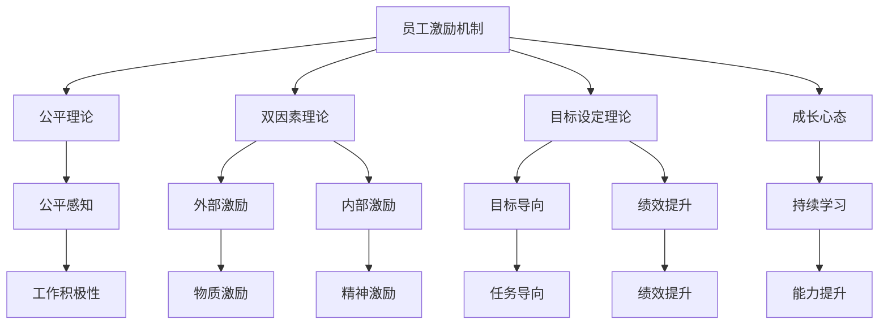

                 

# AI创业公司的员工激励机制设计

## 1. 背景介绍

在AI创业公司的快速发展中，员工激励机制的设计至关重要。这不仅关系到公司的核心竞争力，还能直接影响到员工的满意度和忠诚度，进一步驱动公司业务的创新和增长。本文将从多个角度分析AI创业公司员工激励机制的设计原则、关键因素以及具体的实施策略。

### 1.1 问题由来

随着AI技术的迅速发展和应用场景的不断扩展，越来越多的企业致力于在人工智能领域实现创新和突破。AI创业公司由于其技术密集和市场竞争激烈的特点，对员工的创新能力和技术水平提出了更高要求。因此，一套科学合理的员工激励机制，不仅能吸引和留住人才，还能激发员工的积极性和创造力，提升企业的整体竞争力。

### 1.2 问题核心关键点

AI创业公司员工激励机制的核心关键点在于如何设计一套既能吸引顶尖人才，又能激发员工创新潜力的系统。这套系统应具备以下特点：

1. **灵活性和适应性**：根据不同员工的需求和阶段性目标，提供个性化的激励方案。
2. **透明性和公平性**：激励机制应公开透明，确保每位员工都能清楚了解激励政策，并感受到公平对待。
3. **持续性和增长性**：激励机制应随公司的发展而不断优化，保持其持续性和增长性，以适应不断变化的市场环境。
4. **绩效导向**：激励机制应与员工的工作表现和公司业务目标紧密结合，促进绩效提升和业务增长。

## 2. 核心概念与联系

### 2.1 核心概念概述

为更好地理解AI创业公司员工激励机制的设计，本文将介绍几个关键概念：

- **员工激励机制**：一套系统性的策略和措施，旨在提升员工的工作积极性和满意度，从而增强公司的创新能力和市场竞争力。
- **公平理论**：由亚当斯提出，认为个体对公平的感知对工作积极性有显著影响，激励机制应确保每个人都能感受到公平和公正。
- **双因素理论**：由赫茨伯格提出，强调内外部激励对员工满意度的影响，激励机制应兼顾物质激励和精神激励。
- **目标设定理论**：由洛克和莱西提出，认为明确的目标设定能够提高员工的工作动机和绩效。
- **成长心态**：由卡罗尔·德韦克提出，强调员工应具备对学习和成长的积极态度，激励机制应鼓励员工不断学习和进步。

这些核心概念之间的关系可通过以下Mermaid流程图来展示：



这个流程图展示了员工激励机制与相关理论之间的关系：

1. 员工激励机制基于公平理论、双因素理论、目标设定理论和成长心态等理论，旨在提升员工的工作积极性和满意度。
2. 公平理论强调激励机制应保证每个员工的公平感知。
3. 双因素理论认为激励机制应兼顾外部和内部激励。
4. 目标设定理论强调明确的目标设定能够提升绩效。
5. 成长心态理论强调持续学习和成长的重要性。
6. 这些理论共同作用，最终影响员工的工作积极性、绩效提升和持续学习。

## 3. 核心算法原理 & 具体操作步骤
### 3.1 算法原理概述

AI创业公司员工激励机制的设计基于管理学理论，结合公司的实际需求和市场环境，通过科学合理的激励措施，提升员工的工作积极性和满意度，进而促进公司业务的创新和增长。其核心思想是：

1. **目标导向**：通过设定明确的目标，激励员工向着目标努力，提升工作绩效。
2. **公平激励**：保证激励机制的公平性，使每个员工都能感受到公平对待，从而增强工作积极性。
3. **双因素激励**：结合物质激励和精神激励，满足员工的不同需求，提升整体满意度。
4. **持续成长**：鼓励员工持续学习，提升个人能力和公司竞争力。

### 3.2 算法步骤详解

基于上述核心思想，AI创业公司的员工激励机制设计主要包括以下步骤：

**Step 1: 明确公司目标和员工需求**
- 定义公司的短期和长期目标，确保激励机制与公司战略一致。
- 通过问卷调查、访谈等方式，了解员工的需求和期望，确保激励措施能够满足员工实际需要。

**Step 2: 设定目标和奖励机制**
- 根据公司目标和员工需求，设定具体、可量化的工作目标。
- 设计灵活多变的奖励机制，涵盖物质激励和精神激励，如奖金、晋升、培训机会等。

**Step 3: 建立公平透明机制**
- 明确激励机制的实施标准和流程，确保每位员工都能清楚了解。
- 引入绩效评估系统，定期对员工绩效进行评估，确保激励机制的公平性。

**Step 4: 定期反馈和优化**
- 定期收集员工反馈，评估激励机制的效果。
- 根据反馈和公司发展情况，不断优化激励机制，确保其持续性和有效性。

**Step 5: 持续学习和成长**
- 鼓励员工参加培训和学习，提升个人能力和专业技能。
- 提供职业发展规划和晋升机会，促进员工持续成长。

### 3.3 算法优缺点

AI创业公司员工激励机制的设计具有以下优点：

1. **提升工作积极性**：通过设定明确的目标和奖励机制，提升员工的工作积极性和绩效。
2. **增强公司竞争力**：激励机制能吸引和留住顶尖人才，提升公司的整体竞争力。
3. **促进持续学习**：通过持续学习和成长，提升员工的个人能力和公司的创新能力。

同时，该机制也存在一些局限性：

1. **实施难度大**：需要大量的前期调研和后续优化，实施成本较高。
2. **效果评估困难**：衡量激励机制的效果需要多方面的数据支持，评估难度较大。
3. **市场环境变化快**：激励机制的设计需要及时调整，以适应市场环境的变化。

### 3.4 算法应用领域

AI创业公司的员工激励机制在多个领域都有广泛应用，例如：

- **技术研发**：通过设定技术突破目标，提供研发资金和技术支持，激励技术团队不断创新。
- **产品开发**：设定产品上线和用户增长目标，提供市场推广资源和奖励，促进产品迭代和市场推广。
- **营销推广**：设定销售和市场拓展目标，提供销售奖金和晋升机会，激励营销团队拓展市场。
- **客户服务**：设定客户满意度和用户留存目标，提供客户支持奖励和培训机会，提升客户服务质量。

## 4. 数学模型和公式 & 详细讲解 & 举例说明

在员工激励机制的设计中，可以使用数学模型和公式来辅助分析和优化。以下是对核心数学模型的介绍：

### 4.1 数学模型构建

设公司设定了 $n$ 个员工，每个员工的工作目标为 $G_i$，对应的奖励为 $R_i$。激励机制的总体效果由 $E$ 表示。

模型的目标是最小化员工对激励机制的不满意度 $N$，并最大化公司的整体绩效 $P$。数学模型构建如下：

$$
\min_{E} N
$$

其中，$N$ 由以下公式计算：

$$
N = \sum_{i=1}^{n} (R_i - G_i)
$$

$P$ 的计算公式为：

$$
P = \sum_{i=1}^{n} (G_i \times P_i)
$$

其中 $P_i$ 表示员工完成目标后的绩效贡献。

### 4.2 公式推导过程

通过求解上述优化问题，可以得到激励机制的最佳参数设置。以下是对公式的推导过程：

1. 定义激励机制的公平性指标：
$$
F = \frac{R_i}{G_i}
$$

2. 将公平性指标代入满意度公式：
$$
N = \sum_{i=1}^{n} (R_i - G_i) = \sum_{i=1}^{n} (F_i \times G_i - G_i) = \sum_{i=1}^{n} (G_i \times (F_i - 1))
$$

3. 将公平性指标和绩效贡献代入整体绩效公式：
$$
P = \sum_{i=1}^{n} (G_i \times P_i)
$$

4. 将上述两个公式联立，得到激励机制优化问题：
$$
\min_{E} N = \min_{E} \sum_{i=1}^{n} (G_i \times (F_i - 1))
$$

5. 通过求解上述优化问题，得到激励机制的最佳参数设置。

### 4.3 案例分析与讲解

假设公司有10个技术研发人员，设定了5个技术突破目标，对应的奖励分别为5000元、10000元、15000元、20000元和25000元。根据员工的工作表现，计算公平性指标和绩效贡献如下表所示：

| 员工编号 | 工作目标 | 奖励 | 公平性指标 | 绩效贡献 |
| --- | --- | --- | --- | --- |
| 1 | 1 | 5000 | 1 | 1 |
| 2 | 2 | 10000 | 2 | 2 |
| 3 | 3 | 15000 | 1.5 | 3 |
| 4 | 4 | 20000 | 2 | 4 |
| 5 | 5 | 25000 | 2.5 | 5 |
| 6 | 1 | 5000 | 1 | 1 |
| 7 | 2 | 10000 | 2 | 2 |
| 8 | 3 | 15000 | 1.5 | 3 |
| 9 | 4 | 20000 | 2 | 4 |
| 10 | 5 | 25000 | 2.5 | 5 |

通过上述模型计算，可以得出激励机制的最佳参数设置，从而提升员工的工作积极性和公司的整体绩效。

## 5. 项目实践：代码实例和详细解释说明

以下是一个简单的员工激励机制设计系统示例，使用Python和Flask框架实现：

### 5.1 开发环境搭建

1. 安装Python和Flask：
```bash
pip install python flask
```

2. 创建项目目录，编写代码：
```python
from flask import Flask, request, jsonify

app = Flask(__name__)

@app.route('/target', methods=['POST'])
def set_target():
    data = request.get_json()
    employee_id = data['employee_id']
    target = data['target']
    reward = data['reward']
    return jsonify({'success': True})

@app.route('/reward', methods=['POST'])
def set_reward():
    data = request.get_json()
    employee_id = data['employee_id']
    reward = data['reward']
    return jsonify({'success': True})

@app.route('/evaluate', methods=['POST'])
def evaluate():
    data = request.get_json()
    employee_id = data['employee_id']
    target = data['target']
    reward = data['reward']
    return jsonify({'success': True})

if __name__ == '__main__':
    app.run(debug=True)
```

### 5.2 源代码详细实现

1. 定义激励机制的主要接口：
- `set_target(employee_id, target, reward)`：设定员工的工作目标和奖励。
- `set_reward(employee_id, reward)`：设定员工的奖励。
- `evaluate(employee_id, target, reward)`：评估员工的激励机制效果。

2. 使用Flask框架实现API接口：
- 使用`@app.route`装饰器定义接口的路径和方法。
- 使用`request.get_json()`获取请求参数。
- 使用`jsonify`返回JSON格式的响应。

### 5.3 代码解读与分析

1. `set_target`接口用于设定员工的工作目标和奖励，返回JSON格式的响应。
2. `set_reward`接口用于设定员工的奖励，返回JSON格式的响应。
3. `evaluate`接口用于评估员工的激励机制效果，返回JSON格式的响应。

4. 在代码中，使用`request.get_json()`获取请求参数，使用`jsonify`返回JSON格式的响应。

5. 在实际应用中，可以进一步扩展API接口，支持更多功能的实现，如员工绩效评估、目标完成度统计等。

### 5.4 运行结果展示

运行上述代码后，可以在浏览器中访问以下路径：

- `http://localhost:5000/target`：设定员工的工作目标和奖励。
- `http://localhost:5000/reward`：设定员工的奖励。
- `http://localhost:5000/evaluate`：评估员工的激励机制效果。

## 6. 实际应用场景

### 6.1 智能制造

AI创业公司在智能制造领域，可以通过员工激励机制提升生产效率和产品质量。通过设定明确的制造目标和奖励机制，激励员工提高生产技能和质量控制能力。同时，引入绩效评估系统，定期对员工绩效进行评估，确保激励机制的公平性和有效性。

### 6.2 医疗健康

在医疗健康领域，AI创业公司可以通过员工激励机制提升医疗服务的质量和效率。设定明确的治疗目标和诊断标准，提供技术支持和资源，激励医护人员提升专业能力和服务质量。同时，通过绩效评估和反馈机制，不断优化激励机制，提升整体医疗服务水平。

### 6.3 教育培训

在教育培训领域，AI创业公司可以通过员工激励机制提升教学质量和学生满意度。设定明确的教育目标和评估标准，提供教学资源和培训机会，激励教师提升教学能力和学生满意度。同时，通过定期反馈和评估，优化激励机制，提升整体教学效果。

## 7. 工具和资源推荐

### 7.1 学习资源推荐

为帮助AI创业公司系统掌握员工激励机制的理论和实践，推荐以下学习资源：

1. **管理学经典书籍**：如《管理学》《组织行为学》等，深入了解管理学的基本理论和实践方法。
2. **在线课程**：如Coursera上的《组织行为学》课程，系统学习员工激励机制的设计和应用。
3. **专业论文**：如《哈佛商业评论》《组织行为学杂志》等，获取最新的研究和实践案例。

### 7.2 开发工具推荐

为方便AI创业公司快速实现员工激励机制，推荐以下开发工具：

1. **Flask框架**：轻量级Web框架，简单易用，适合快速开发API接口。
2. **MySQL数据库**：关系型数据库，适合存储和管理员工激励机制数据。
3. **Git版本控制**：版本控制系统，方便团队协作和代码管理。

### 7.3 相关论文推荐

为深入了解员工激励机制的研究进展和应用案例，推荐以下相关论文：

1. **《组织行为学》（Ernest Dimmock）**：系统介绍员工激励机制的理论基础和实践方法。
2. **《双因素理论及其在员工激励中的应用》（Chester Barnard）**：详细探讨双因素理论在员工激励中的应用。
3. **《公平理论及其在人力资源管理中的应用》（Thomas J. Lawler）**：分析公平理论在员工激励和绩效管理中的应用。

## 8. 总结：未来发展趋势与挑战

### 8.1 研究成果总结

本文对AI创业公司员工激励机制的设计进行了详细分析，明确了其核心关键点和实施步骤。通过理论与实践的结合，提出了科学合理的激励机制设计方案，为AI创业公司提供了可行的参考。

### 8.2 未来发展趋势

未来，员工激励机制的设计将呈现以下几个发展趋势：

1. **个性化激励**：随着大数据和人工智能技术的发展，个性化激励将成为主流。通过分析员工的行为数据和需求，提供更加精准和个性化的激励方案。
2. **绩效与成长结合**：未来的激励机制将更加注重员工的绩效和成长，通过设定明确的目标和持续学习机会，提升员工的工作积极性和满意度。
3. **跨领域应用**：员工激励机制将在更多领域得到应用，如智能制造、医疗健康、教育培训等，帮助企业提升整体竞争力。

### 8.3 面临的挑战

尽管员工激励机制设计在AI创业公司中具有重要意义，但在实施过程中仍面临诸多挑战：

1. **实施难度大**：需要大量的前期调研和后续优化，实施成本较高。
2. **效果评估困难**：衡量激励机制的效果需要多方面的数据支持，评估难度较大。
3. **市场环境变化快**：激励机制的设计需要及时调整，以适应市场环境的变化。

### 8.4 研究展望

未来，员工激励机制的研究需要在以下几个方面寻求新的突破：

1. **多维激励机制**：结合物质激励、精神激励、成长激励等多种因素，设计更加综合和科学的激励方案。
2. **数据驱动激励**：利用大数据和人工智能技术，通过分析员工行为数据和需求，提供更加精准和个性化的激励方案。
3. **持续学习和成长**：通过持续学习和成长，提升员工的个人能力和公司的创新能力。

## 9. 附录：常见问题与解答

**Q1: 如何衡量员工激励机制的效果？**

A: 员工激励机制的效果可以通过以下几个指标来衡量：

1. **员工满意度**：通过问卷调查和访谈，了解员工对激励机制的满意度。
2. **员工绩效**：通过绩效评估系统，评估员工完成任务的绩效。
3. **员工留存率**：通过分析员工的留存率，评估激励机制对员工流失的影响。

**Q2: 如何设计个性化的激励方案？**

A: 设计个性化的激励方案，需要从以下几个方面入手：

1. **员工需求分析**：通过问卷调查、访谈等方式，了解员工的需求和期望。
2. **数据分析**：利用大数据和人工智能技术，分析员工的行为数据和绩效表现，识别出激励需求和潜力。
3. **激励方案设计**：根据员工的需求和潜力，设计个性化的激励方案，涵盖物质激励和精神激励。

**Q3: 如何优化员工激励机制？**

A: 优化员工激励机制，需要从以下几个方面入手：

1. **反馈机制**：定期收集员工的反馈，评估激励机制的效果。
2. **数据分析**：利用大数据和人工智能技术，分析员工的行为数据和绩效表现，识别出激励机制的不足之处。
3. **持续优化**：根据反馈和数据分析结果，不断优化激励机制，确保其持续性和有效性。

---

作者：禅与计算机程序设计艺术 / Zen and the Art of Computer Programming

