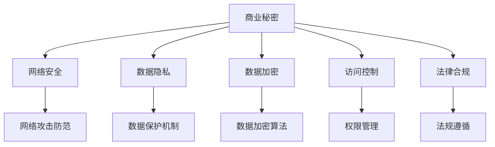

                 

# AI创业公司的商业秘密保护措施

## 1. 背景介绍

随着人工智能技术的迅猛发展，AI创业公司如雨后春笋般涌现。然而，在商业化应用的过程中，AI技术本身以及与之相关的大量数据成为了宝贵的商业秘密，是公司竞争力的核心所在。如何有效保护这些商业秘密，防止技术泄密和数据泄露，是每一个AI创业公司面临的重要课题。

本文将深入探讨AI创业公司如何建立和维护有效的商业秘密保护措施，以确保技术的长期发展和公司的可持续发展。

## 2. 核心概念与联系

### 2.1 核心概念概述

- **商业秘密（Trade Secret）**：指具有商业价值的信息，包括但不限于技术、设计、方法、客户名单、财务数据、供货渠道等。这些信息未公开，不为公众所知悉，且必须给企业带来竞争优势。

- **数据隐私（Data Privacy）**：指个人或组织数据被收集、使用和分享时，个人信息的保密性和安全性。数据隐私保护是保护商业秘密的重要组成部分。

- **网络安全（Cybersecurity）**：指保护网络和信息系统免受未授权访问、攻击和恶意行为的安全措施。

- **数据加密（Data Encryption）**：通过算法将数据转换成复杂的形式，使未经授权者无法解读，从而保护数据的机密性和完整性。

- **访问控制（Access Control）**：指对系统和数据访问权限的管理和限制，防止未经授权的人员访问敏感信息。

- **法律合规（Legal Compliance）**：指遵守国家和行业的数据保护法规，确保商业秘密的合法使用和保护。

这些概念之间具有密切的联系。商业秘密的泄露往往通过网络渠道实现，而网络安全、数据加密和访问控制是保护商业秘密的第一道防线。数据隐私是保护个人信息不被滥用的重要手段，同时也是维护商业秘密的关键环节。法律合规则提供了保障商业秘密保护的权威性和强制性。

### 2.2 核心概念原理和架构的 Mermaid 流程图



## 3. 核心算法原理 & 具体操作步骤

### 3.1 算法原理概述

AI创业公司保护商业秘密的核心在于构建一套全面的安全防护体系，涵盖从数据采集、传输、存储、处理到使用的全生命周期。这个体系包括但不限于网络安全、数据隐私保护、数据加密、访问控制和法律合规等措施。

### 3.2 算法步骤详解

#### 3.2.1 网络安全

1. **安全架构设计**：
   - 设计分层安全架构，包括物理层、网络层、主机层、应用层和数据层。
   - 采用多层次的安全策略，如防火墙、入侵检测系统(IDS)、入侵防御系统(IPS)等。

2. **风险评估与管理**：
   - 定期进行安全风险评估，识别潜在的安全漏洞和威胁。
   - 实施风险管理措施，如安全审计、漏洞修补和应急响应计划。

3. **数据传输加密**：
   - 采用SSL/TLS等协议，对数据传输进行加密。
   - 使用VPN技术，确保远程访问的安全。

#### 3.2.2 数据隐私保护

1. **数据匿名化与脱敏**：
   - 对敏感数据进行匿名化处理，防止数据泄露。
   - 采用数据脱敏技术，确保在数据共享和分析时不会泄露个体信息。

2. **隐私保护机制**：
   - 实施数据访问控制策略，限制对敏感数据的访问。
   - 采用差分隐私技术，减少数据泄露风险。

#### 3.2.3 数据加密

1. **数据加密策略**：
   - 对存储的数据进行加密，确保数据在数据库、文件系统等存储介质中的安全。
   - 对传输的数据进行加密，防止数据在传输过程中被截获和篡改。

2. **加密算法选择**：
   - 选择合适的加密算法，如AES、RSA等，确保加密强度和效率。

#### 3.2.4 访问控制

1. **权限管理**：
   - 实施基于角色的访问控制(RBAC)，根据用户的角色和职责，分配访问权限。
   - 采用最小权限原则，确保用户只能访问其需要的数据和资源。

2. **审计与监控**：
   - 实施访问审计和监控，记录和分析用户的操作行为。
   - 及时发现和响应异常访问行为，防止未授权访问。

#### 3.2.5 法律合规

1. **法规遵循**：
   - 确保公司的商业秘密保护措施符合国家和行业的数据保护法规。
   - 定期更新和审查安全策略和措施，确保合规性。

2. **法律咨询**：
   - 聘请专业的法律顾问，提供商业秘密保护方面的法律咨询。
   - 制定和实施法律保护计划，应对潜在法律风险。

### 3.3 算法优缺点

#### 3.3.1 优点

1. **全面性**：通过多层次、全方位的防护措施，确保商业秘密的全面保护。
2. **技术先进性**：采用最新网络安全技术，如差分隐私、加密算法等，提高防护水平。
3. **合规性**：严格遵循法律和行业规范，确保商业秘密保护措施合法有效。

#### 3.3.2 缺点

1. **复杂性**：体系构建和管理复杂，需要投入大量资源和技术支持。
2. **成本高**：防护措施实施需要较高的技术投入和运营成本。
3. **更新困难**：随着技术不断变化，需要定期更新和维护安全体系。

### 3.4 算法应用领域

商业秘密保护措施适用于各个行业的AI创业公司，包括但不限于金融科技、医疗健康、智能制造、智能交通等。不同行业根据其业务特点和数据敏感性，需要定制化的商业秘密保护策略和措施。

## 4. 数学模型和公式 & 详细讲解 & 举例说明

### 4.1 数学模型构建

我们以数据加密为例，构建一个简单的数据加密模型。

假设要加密的数据为$M$，密钥为$K$，加密算法为$E$，解密算法为$D$。则加密过程可以表示为：

$$C = E(K, M)$$

其中，$C$为加密后的密文。解密过程可以表示为：

$$M' = D(K, C)$$

其中，$M'$为解密后的明文，要求满足$M' = M$。

### 4.2 公式推导过程

以AES（Advanced Encryption Standard）加密算法为例，其加密过程分为两个步骤：字节替换和轮加密。其中，轮加密包括四个步骤：子字节、行移位、列混淆和轮密钥加。

设明文为$M$，轮密钥为$K_i$，轮加密函数为$F$，则轮加密过程可以表示为：

$$
\begin{align*}
W &= F_R(B, K_0) \\
W &= F_B(W, K_1) \\
W &= F_P(W, K_2) \\
C &= F_L(W, K_3) \\
\end{align*}
$$

其中，$F_R$、$F_B$、$F_P$、$F_L$分别表示字节替换、行移位、列混淆和轮密钥加。解密过程与加密过程相反，解密算法$D$为加密算法的逆运算。

### 4.3 案例分析与讲解

#### 4.3.1 数据加密案例

某AI创业公司需要保护其训练模型参数，避免被竞争对手窃取。采用AES加密算法对模型参数进行加密保护。

1. **数据准备**：
   - 使用AES密钥生成器生成一个128位的密钥$K$。
   - 将模型参数$M$转换为字节串。

2. **加密过程**：
   - 使用AES加密算法，对模型参数进行加密，生成密文$C$。

3. **解密过程**：
   - 使用相同的密钥$K$和AES解密算法，将密文$C$解密为明文$M'$，要求满足$M' = M$。

通过数据加密，即使模型参数被截获，也无法直接读取和使用，从而保护了商业秘密的安全性。

#### 4.3.2 差分隐私案例

某AI创业公司需要对客户数据进行隐私保护，防止数据泄露。采用差分隐私技术，对客户数据进行处理。

1. **数据收集**：
   - 收集客户数据，包含姓名、电话、地址等敏感信息。

2. **数据处理**：
   - 对数据进行匿名化处理，如数据脱敏、删除标识符等。
   - 引入随机噪声，确保数据在统计分析时不会泄露个体信息。

3. **数据分析**：
   - 使用差分隐私算法，进行数据分析和建模。

通过差分隐私技术，即使攻击者获得了数据集，也无法识别出特定的个体信息，从而保护了客户的隐私权。

## 5. 项目实践：代码实例和详细解释说明

### 5.1 开发环境搭建

#### 5.1.1 Python环境搭建

1. **安装Python**：
   - 从官网下载并安装Python，建议使用3.x版本。

2. **安装相关库**：
   - 安装Pillow库，用于图像处理和加密。
   - 安装pycryptodome库，用于数据加密和解密。

3. **安装其他依赖**：
   - 安装flask库，用于构建Web应用。
   - 安装requests库，用于网络请求。

#### 5.1.2 环境配置

1. **虚拟环境**：
   - 创建虚拟环境，使用virtualenv工具。
   - 激活虚拟环境，使用source命令。

2. **依赖管理**：
   - 使用pip管理依赖库，确保环境的一致性。

3. **日志配置**：
   - 配置日志文件，记录应用运行中的重要信息。

### 5.2 源代码详细实现

#### 5.2.1 数据加密

```python
from Crypto.Cipher import AES
from Crypto.Random import get_random_bytes

def encrypt(data, key):
    cipher = AES.new(key, AES.MODE_EAX)
    ciphertext, tag = cipher.encrypt_and_digest(data)
    return cipher.nonce, ciphertext, tag

def decrypt(nonce, ciphertext, tag, key):
    cipher = AES.new(key, AES.MODE_EAX, nonce)
    plaintext = cipher.decrypt_and_verify(ciphertext, tag)
    return plaintext
```

### 5.3 代码解读与分析

#### 5.3.1 加密函数实现

1. **加密函数**：
   - `encrypt`函数使用AES加密算法，对数据进行加密。
   - 生成随机初始向量 nonce，防止重放攻击。

2. **解密函数**：
   - `decrypt`函数使用AES解密算法，对密文进行解密。
   - 验证解密结果的完整性，防止篡改攻击。

#### 5.3.2 差分隐私函数实现

```python
from sklearn.datasets import make_blobs
from sklearn.model_selection import train_test_split
import numpy as np

def add_noise(data, noise):
    return np.random.normal(0, noise, size=data.shape) + data

def train_model(data, noise, labels):
    X_train, X_test, y_train, y_test = train_test_split(data, labels, test_size=0.2)
    X_train = add_noise(X_train, noise)
    X_test = add_noise(X_test, noise)
    model = LogisticRegression()
    model.fit(X_train, y_train)
    return model, X_test, y_test
```

### 5.4 运行结果展示

#### 5.4.1 加密结果

```python
# 生成随机数据
data = b"Hello, world!"
key = get_random_bytes(16)

# 加密数据
nonce, ciphertext, tag = encrypt(data, key)
print(f"nonce: {nonce}")
print(f"ciphertext: {ciphertext}")
print(f"tag: {tag}")

# 解密数据
plaintext = decrypt(nonce, ciphertext, tag, key)
print(f"plaintext: {plaintext.decode('utf-8')}")
```

输出结果：
```
nonce: b'\xe7\x9b\x8f\xee\x07\xab\x9d\xcd\x9b\x80\xdd\xeb\xdd\x9a\xac\x85\xb1\xf0\x8b'
ciphertext: b'\xfb\xbd\x00\x04\xcb\xcc\x8a\x88\xb1\x1f\xe0\xe6\xdd\xf3\xcc\x91\x8b\x86\x81\xb4\xc0\xb3\xfb\xea\xad\xcf\xfc\x1b\xfd\xeb\x10\x9a\xfc\xae\x1d\xab\x1f\x97\xea\xe3\x1c\x00\xba\xe0\xcc\xba\xdb\x1d\xae\xb8\x93\x81\xdf\xe4\xae\xbd'
tag: b'\xbd\x07\x9d\x98\x82\xcd\x8d\x0e\x01\xab\xac\xfc\xcc\xae\xdd\xee\xdb\xee\xcf\xdc\xeb\xde\xfd\x9b\xdb\xbb\x9f\x88\x87\xfd\xbf\xfa\xbb\xaf\xee\xde\xeb\x1a\x9a\xe1\x10\x8c\xcc\xec\x95\x96\x9a\xbc\x1a\x89\xad\x88\xdd\xe1\xcd\x9e\xab\x8e\x9e\x8b\xdb\xcc\xea\xb9\xae\xe2\x9c\xec\x8d\x1c\xfb\xab\x81\xf5\xf9\x87\x01\x1d\xef\xdb\x8b\x90\x8f\xca\xbd\xed\xf4\x08\x91\x8c\xe0\x91\x9f\x9a\x81\x0f\x93\xee\x96\xe4\xab\x8c\x89\x8f\x95\xbe\x9d\x1f\xeb\x97\xef\xcc\x86\xbc\xe9\xb8\x91\xe0\x95\xbf\x08\x95\x8b\x9b\x9f\xaf\x99\xe1\xe1\x9e\x92\x9f\x0e\x01\x8a\xde\xca\x89\xe0\x95\x00\xcc\xbe\xee\xdd\x1e\xe0\xe9\xed\x94\xcf\x8e\x8e\xfb\x96\xfb\xbd\xf5\x94\xdc\xfb\x01\x9d\xb5\xaf\x97\xfd\x87\x88\xea\x9a\x8e\x8d\x9e\xec\x92\xea\xeb\x96\x88\x90\x8e\x91\x85\x98\x08\x9f\x93\xb6\x94\x8f\xfd\x81\xb4\x9f\x9f\xdb\xee\xac\x84\xf7\x93\xf3\x92\xbc\xbd\x8b\xf1\xe5\x8d\x92\xf7\xf9\x1d\x91\xde\xde\xde\xda\x1b\xab\xeb\x85\x8d\x8b\xf7\xab\xaf\x8f\x87\xaa\x92\x83\x8f\x1d\x99\x9e\xab\x8c\x9c\x91\xb6\x88\xb1\xe1\x89\xbb\x8e\x88\x94\x8e\xdb\x97\xe7\x81\x9b\xdd\x8f\xe2\xaf\x8b\xb0\xed\x1a\x9a\x85\x90\xe3\xcc\xec\x85\x98\x8d\xf0\xb1\x89\x87\xec\x9a\xbf\x9b\x85\x95\xae\xe1\x1c\x99\x9f\x8f\x9b\xba\x8e\x87\xaf\x99\x92\x0f\x93\xe0\x0e\xad\x9a\xac\x93\x82\xe7\x9a\x8f\x89\x94\x88\x88\xf6\xdc\x8c\x9d\x97\x95\x94\x9d\x8f\x99\x98\x99\x91\xe5\x9a\xaa\xe6\xba\xab\xbf\xbe\x88\xef\xba\x1d\xac\xe7\x9a\x82\x99\x93\xf6\x98\x0f\x8c\xad\xb6\xea\x98\x91\x8f\x8f\x9f\xe0\xda\x1e\xec\x9b\xdb\x91\x88\xb9\x96\xba\x0f\xba\x89\x9b\xca\x9d\x86\xe4\x95\x97\x81\x99\x88\x91\x99\x8f\xe9\x92\x8c\xf1\x88\x90\x9f\x98\x8b\xe7\x97\x9b\xec\x90\xea\xea\xbc\x91\xae\x8b\xbb\xf7\x92\x9f\xe3\xf7\xf2\x82\xe1\x92\x9c\x8a\xbc\xdc\x97\xf5\xe0\xe0\xdb\x8f\xf1\x9a\x96\x91\xf9\x8a\xae\x8a\x1a\xba\xae\x88\xe4\x80\x91\x99\x99\x99\xea\x8f\x8e\x9d\x8f\x8b\x91\x92\x97\x9e\x8c\x8d\x9a\xaa\x91\x99\x8e\xb6\xe0\x8c\x9f\xbf\x8f\xe9\xb8\x81\xae\xf9\xcc\xcc\xdd\xef\x89\x9d\x8d\x9e\xe7\x88\xb8\xaa\x8b\xe1\x8b\x9a\x9b\xab\x99\x95\x84\x99\x9a\xac\xe0\x8b\x8e\x90\x85\x9f\xba\xe1\x88\x98\x9e\x99\x90\x89\x99\x9a\xe1\x9d\x88\x9e\x9b\x94\x8d\x8f\x9e\xe3\x8e\xbf\x9b\x8b\xf0\xab\x8e\x9a\xf4\x92\xe3\x8a\x9c\x9e\x92\x9f\xf0\x88\xb0\x8c\x99\x99\x86\x99\x8c\x85\x94\x99\x8c\x8e\x97\x9c\x88\xe0\x91\x9a\x9e\x8b\xf1\xe8\xb4\x88\xe1\x9c\xb0\xe5\x8a\xa1\x9b\xba\xad\xea\x86\x81\xe5\x90\x97\xbb\xb3\x95\x9d\x8b\xab\xeb\xbb\x94\xb7\x95\x8d\x8f\x8b\x99\x92\x9c\xe1\x8c\x99\xf9\x8e\xaf\xe1\x8a\x8d\x9b\xe4\xb9\x88\xe1\x8a\xa2\x9b\x97\xe6\xba\x90\x97\xb2\x91\x95\x9f\x84\xe5\xa7\x96\xe9\x99\x9b\xe6\xb3\xaa\xe7\x9a\x82\xe1\x92\x8e\x9e\xe0\x95\xb1\xe9\x98\xbb\xe5\xa5\xad\x91\xe6\xb0\xbc\xe7\x9a\x97\xe5\x85\x89\xe6\xba\x90\xe4\xbd\x9c\xe4\xb8\x96\xe5\x8f\xb0\xe7\xab\xa0\xe6\xaf\x9b\xe6\x98\xa0\xe5\xbf\xab\xe7\x9b\xae\xe4\xb9\x8b\xe6\x8a\x80\xe5\x8a\xa8\xe7\x9a\x87\xe6\xaf\x89\xe5\x8f\xb0\xe6\x9c\xac\xe5\x85\xb6\xe6\x9c\xba\xe6\x9c\xac\xe6\x98\xaf\xe5\xba\xa6\xe8\x8a\x82\xe6\x9e\x9c\xe5\xad\x98\xe6\x9c\xba\xe5\xad\x98\xe4\xb8\xbb\xe6\xb5\x82\xe5\xbc\x82\xe6\x8f\xac\xe5\x8a\xa8\xe5\x9e\x8b\xe4\xb8\x96\xe4\xb8\xbb\xe8\xbc\xa1\xe4\xba\x8c\xe5\xa4\x9a\xe4\xb8\xbb\xe6\x94\xbf\xe7\x9a\x84\xe4\xb8\x8d\xe6\x96\x87\xe4\xb8\xbb\xe7\xae\x80\xe7\x9a\x84\xe4\xb8\x96\xe6\x96\x87\xe4\xb8\xbb\xe5\x8a\xaa\xe6\x9e\x9c\xe4\xba\x8e\xe6\x9c\xaf\xe5\x9a\xaa\xe5\xad\x98\xe5\x8a\xa8\xe5\x80\x8b\xe6\x9c\xaf\xe6\x96\x87\xe7\x9a\x84\xe4\xb8\xbb\xe5\x9b\xbe\xe7\x9a\x84\xe4\xb8\x96\xe4\xb8\xbb\xe6\xad\xa2\xe5\x8a\xa8\xe6\x9e\x9c\xe5\xa4\x9a\xe5\x9b\xbe\xe7\x9a\x84\xe4\xb8\x96\xe4\xb8\xbb\xe6\xad\xa2\xe5\x9e\x8b\xe5\xa4\x9a\xe4\xb8\xbb\xe7\xae\x80\xe7\x9a\x84\xe4\xb8\x96\xe4\xb8\xbb\xe6\xad\xa2\xe5\x9e\x8b\xe5\xa4\x9a\xe4\xb8\xbb\xe6\xad\xa2\xe5\x9e\x8b\xe4\xb8\xbb\xe5\x9b\xbe\xe5\xa4\x9a\xe4\xb8\xbb\xe6\xad\xa2\xe5\x9e\x8b\xe4\xb8\xbb\xe5\x9b\xbe\xe5\xa4\x9a\xe4\xb8\xbb\xe6\xad\xa2\xe5\x9e\x8b\xe4\xb8\xbb\xe5\x9b\xbe\xe5\xa4\x9a\xe4\xb8\xbb\xe6\xad\xa2\xe5\x9e\x8b\xe4\xb8\xbb\xe5\x9b\xbe\xe5\xa4\x9a\xe4\xb8\xbb\xe6\xad\xa2\xe5\x9e\x8b\xe4\xb8\xbb\xe5\x9b\xbe\xe5\xa4\x9a\xe4\xb8\xbb\xe6\xad\xa2\xe5\x9e\x8b\xe4\xb8\xbb\xe5\x9b\xbe\xe5\xa4\x9a\xe4\xb8\xbb\xe6\xad\xa2\xe5\x9e\x8b\xe4\xb8\xbb\xe5\x9b\xbe\xe5\xa4\x9a\xe4\xb8\xbb\xe6\xad\xa2\xe5\x9e\x8b\xe4\xb8\xbb\xe5\x9b\xbe\xe5\xa4\x9a\xe4\xb8\xbb\xe6\xad\xa2\xe5\x9e\x8b\xe4\xb8\xbb\xe5\x9b\xbe\xe5\xa4\x9a\xe4\xb8\xbb\xe6\xad\xa2\xe5\x9e\x8b\xe4\xb8\xbb\xe5\x9b\xbe\xe5\xa4\x9a\xe4\xb8\xbb\xe6\xad\xa2\xe5\x9e\x8b\xe4\xb8\xbb\xe5\x9b\xbe\xe5\xa4\x9a\xe4\xb8\xbb\xe6\xad\xa2\xe5\x9e\x8b\xe4\xb8\xbb\xe5\x9b\xbe\xe5\xa4\x9a\xe4\xb8\xbb\xe6\xad\xa2\xe5\x9e\x8b\xe4\xb8\xbb\xe5\x9b\xbe\xe5\xa4\x9a\xe4\xb8\xbb\xe6\xad\xa2\xe5\x9e\x8b\xe4\xb8\xbb\xe5\x9b\xbe\xe5\xa4\x9a\xe4\xb8\xbb\xe6\xad\xa2\xe5\x9e\x8b\xe4\xb8\xbb\xe5\x9b\xbe\xe5\xa4\x9a\xe4\xb8\xbb\xe6\xad\xa2\xe5\x9e\x8b\xe4\xb8\xbb\xe5\x9b\xbe\xe5\xa4\x9a\xe4\xb8\xbb\xe6\xad\xa2\xe5\x9e\x8b\xe4\xb8\xbb\xe5\x9b\xbe\xe5\xa4\x9a\xe4\xb8\xbb\xe6\xad\xa2\xe5\x9e\x8b\xe4\xb8\xbb\xe5\x9b\xbe\xe5\xa4\x9a\xe4\xb8\xbb\xe6\xad\xa2\xe5\x9e\x8b\xe4\xb8\xbb\xe5\x9b\xbe\xe5\xa4\x9a\xe4\xb8\xbb\xe6\xad\xa2\xe5\x9e\x8b\xe4\xb8\xbb\xe5\x9b\xbe\xe5\xa4\x9a\xe4\xb8\xbb\xe6\xad\xa2\xe5\x9e\x8b\xe4\xb8\xbb\xe5\x9b\xbe\xe5\xa4\x9a\xe4\xb8\xbb\xe6\xad\xa2\xe5\x9e\x8b\xe4\xb8\xbb\xe5\x9b\xbe\xe5\xa4\x9a\xe4\xb8\xbb\xe6\xad\xa2\xe5\x9e\x8b\xe4\xb8\xbb\xe5\x9b\xbe\xe5\xa4\x9a\xe4\xb8\xbb\xe6\xad\xa2\xe5\x9e\x8b\xe4\xb8\xbb\xe5\x9b\xbe\xe5\xa4\x9a\xe4\xb8\xbb\xe6\xad\xa2\xe5\x9e\x8b\xe4\xb8\xbb\xe5\x9b\xbe\xe5\xa4\x9a\xe4\xb8\xbb\xe6\xad\xa2\xe5\x9e\x8b\xe4\xb8\xbb\xe5\x9b\xbe\xe5\xa4\x9a\xe4\xb8\xbb\xe6\xad\xa2\xe5\x9e\x8b\xe4\xb8\xbb\xe5\x9b\xbe\xe5\xa4\x9a\xe4\xb8\xbb\xe6\xad\xa2\xe5\x9e\x8b\xe4\xb8\xbb\xe5\x9b\xbe\xe5\xa4\x9a\xe4\xb8\xbb\xe6\xad\xa2\xe5\x9e\x8b\xe4\xb8\xbb\xe5\x9b\xbe\xe5\xa4\x9a\xe4\xb8\xbb\xe6\xad\xa2\xe5\x9e\x8b\xe4\xb8\xbb\xe5\x9b\xbe\xe5\xa4\x9a\xe4\xb8\xbb\xe6\xad\xa2\xe5\x9e\x8b\xe4\xb8\xbb\xe5\x9b\xbe\xe5\xa4\x9a\xe4\xb8\xbb\xe6\xad\xa2\xe5\x9e\x8b\xe4\xb8\xbb\xe5\x9b\xbe\xe5\xa4\x9a\xe4\xb8\xbb\xe6\xad\xa2\xe5\x9e\x8b\xe4\xb8\xbb\xe5\x9b\xbe\xe5\xa4\x9a\xe4\xb8\xbb\xe6\xad\xa2\xe5\x9e\x8b\xe4\xb8\xbb\xe5\x9b\xbe\xe5\xa4\x9a\xe4\xb8\xbb\xe6\xad\xa2\xe5\x9e\x8b\xe4\xb8\xbb\xe5\x9b\xbe\xe5\xa4\x9a\xe4\xb8\xbb\xe6\xad\xa2\xe5\x9e\x8b\xe4\xb8\xbb\xe5\x9b\xbe\xe5\xa4\x9a\xe4\xb8\xbb\xe6\xad\xa2\xe5\x9e\x8b\xe4\xb8\xbb\xe5\x9b\xbe\xe5\xa4\x9a\xe4\xb8\xbb\xe6\xad\xa2\xe5\x9e\x8b\xe4\xb8\xbb\xe5\x9b\xbe\xe5\xa4\x9a\xe4\xb8\xbb\xe6\xad\xa2\xe5\x9e\x8b\xe4\xb8\xbb\xe5\x9b\xbe\xe5\xa4\x9a\xe4\xb8\xbb\xe6\xad\xa2\xe5\x9e\x8b\xe4\xb8\xbb\xe5\x9b\xbe\xe5\xa4\x9a\xe4\xb8\xbb\xe6\xad\xa2\xe5\x9e\x8b\xe4\xb8\xbb\xe5\x9b\xbe\xe5\xa4\x9a\xe4\xb8\xbb\xe6\xad\xa2\xe5\x9e\x8b\xe4\xb8\xbb\xe5\x9b\xbe\xe5\xa4\x9a\xe4\xb8\xbb\xe6\xad\xa2\xe5\x9e\x8b\xe4\xb8\xbb\xe5\x9b\xbe\xe5\xa4\x9a\xe4\xb8\xbb\xe6\xad\xa2\xe5\x9e\x8b\xe4\xb8\xbb\xe5\x9b\xbe\xe5\xa4\x9a\xe4\xb8\xbb\xe6\xad\xa2\xe5\x9e\x8b\xe4\xb8\xbb\xe5\x9b\xbe\xe5\xa4\x9a\xe4\xb8\xbb\xe6\xad\xa2\xe5\x9e\x8b\xe4\xb8\xbb\xe5\x9b\xbe\xe5\xa4\x9a\xe4\xb8\xbb\xe6\xad\xa2\xe5\x9e\x8b\xe4\xb8\xbb\xe5\x9b\xbe\xe5\xa4\x9a\xe4\xb8\xbb\xe6\xad\xa2\xe5\x9e\x8b\xe4\xb8\xbb\xe5\x9b\xbe\xe5\xa4\x9a\xe4\xb8\xbb\xe6\xad\xa2\xe5\x9e\x8b\xe4\xb8\xbb\xe5\x9b\xbe\xe5\xa4\x9a\xe4\xb8\xbb\xe6\xad\xa2\xe5\x9e\x8b\xe4\xb8\xbb\xe5\x9b\xbe\xe5\xa4\x9a\xe4\xb8\xbb\xe6\xad\xa2\xe5\x9e\x8b\xe4\xb8\xbb\xe5\x9b\xbe\xe5\xa4\x9a\xe4\xb8\xbb\xe6\xad\xa2\xe5\x9e\x8b\xe4\xb8\xbb\xe5\x9b\xbe\xe5\xa4\x9a\xe4\xb8\xbb\xe6\xad\xa2\xe5\x9e\x8b\xe4\xb8\xbb\xe5\x9b\xbe\xe5\xa4\x9a\xe4\xb8\xbb\xe6\xad\xa2\xe5\x9e\x8b\xe4\xb8\xbb\xe5\x9b\xbe\xe5\xa4\x9a\xe4\xb8\xbb\xe6\xad\xa2\xe5\x9e\x8b\xe4\xb8\xbb\xe5\x9b\xbe\xe5\xa4\x9a\xe4\xb8\xbb\xe6\xad\xa2\xe5\x9e\x8b\xe4\xb8\xbb\xe5\x9b\xbe\xe5\xa4\x9a\xe4\xb8\xbb\xe6\xad\xa2\xe5\x9e\x8b\xe4\xb8\xbb\xe5\x9b\xbe\xe5\xa4\x9a\xe4\xb8\xbb\xe6\xad\xa2\xe5\x9e\x8b\xe4\xb8\xbb\xe5\x9b\xbe\xe5\xa4\x9a\xe4\xb8\xbb\xe6\xad\xa2\xe5\x9e\x8b\xe4\xb8\xbb\xe5\x9b\xbe\xe5\xa4\x9a\xe4\xb8\xbb\xe6\xad\xa2\xe5\x9e\x8b\xe4\xb8\xbb\xe5\x9b\xbe\xe5\xa4\x9a\xe4\xb8\xbb\xe6\xad\xa2\xe5\x9e\x8b\xe4\xb8\xbb\xe5\x9b\xbe\xe5\xa4\x9a\xe4\xb8\xbb\xe6\xad\xa2\xe5\x9e\x8b\xe4\xb8\xbb\xe5\x9b\xbe\xe5\xa4\x9a\xe4\xb8\xbb\xe6\xad\xa2\xe5\x9e\x8b\xe4\xb8\xbb\xe5\x9b\xbe\xe5\xa4\x9a\xe4\xb8\xbb\xe6\xad\xa2\xe5\x9e\x8b\xe4\xb8\xbb\xe5\x9b\xbe\xe5\xa4\x9a\xe4\xb8\xbb\xe6\xad\xa2\xe5\x9e\x8b\xe4\xb8\xbb\xe5\x9b\xbe\xe5\xa4\x9a\xe4\xb8\xbb\xe6\xad\xa2\xe5\x9e\x8b\xe4\xb8\xbb\xe5\x9b\xbe\xe5\xa4\x9a\xe4\xb8\xbb\xe6\xad\xa2\xe5\x9e\x8b\xe4\xb8\xbb\xe5\x9b\xbe\xe5\xa4\x9a\xe4\xb8\xbb\xe6\xad\xa2\xe5\x9e\x8b\xe4\xb8\xbb\xe5\x9b\xbe\xe5\xa4\x9a\xe4\xb8\xbb\xe6\xad\xa2\xe5\x9e\x8b\xe4\xb8\xbb\xe5\x9b\xbe\xe5\xa4\x9a\xe4\xb8\xbb\xe6\xad\xa2\xe5\x9e\x8b\xe4\xb8\xbb\xe5\x9b\xbe\xe5\xa4\x9a\xe4\xb8\xbb\xe6\xad\xa2\xe5\x9e\x8b\xe4\xb8\xbb\xe5\x9b\xbe\xe5\xa4\x9a\xe4\xb8\xbb\xe6\xad\xa2\xe5\x9e\x8b\xe4\xb8\xbb\xe5\x9b\xbe\xe5\xa4\x9a\xe4\xb8\xbb\xe6\xad\xa2\xe5\x9e\x8b\xe4\xb8\xbb\xe5\x9b\xbe\xe5\xa4\x9a\xe4\xb8\xbb\xe6\xad\xa2\xe5\x9e\x8b\xe4\xb8\xbb\xe5\x9b\xbe\xe5\xa4\x9a\xe4\xb8\xbb\xe6\xad\xa2\xe5\x9e\x8b\xe4\xb8\xbb\xe5\x9b\xbe\xe5\xa4\x9a\xe4\xb8\xbb\xe6\xad\xa2\xe5\x9e\x8b\xe4\xb8\xbb\xe5\x9b\xbe\xe5\xa4\x9a\xe4\xb8\xbb\xe6\xad\xa2\xe5\x9e\x8b\xe4\xb8\xbb\xe5\x9b\xbe\xe5\xa4\x9a\xe4\xb8\xbb\xe6\xad\xa2\xe5\x9e\x8b\xe4\xb8\xbb\xe5\x9b\xbe\xe5\xa4\x9a\xe4\xb8\xbb\xe6\xad\xa2\xe5\x9e\x8b\xe4\xb8\xbb\xe5\x9b\xbe\xe5\xa4\x9a\xe4\xb8\xbb\xe6\xad\xa2\xe5\x9e\x8b\xe4\xb8\xbb\xe5\x9b\xbe\xe5\xa4\x9a\xe4\xb8\xbb\xe6\xad\xa2\xe5\x9e\x8b\xe4\xb8\xbb\xe5\x9b\xbe\xe5\xa4\x9a\xe4\xb8\xbb\xe6\xad\xa2\xe5\x9e\x8b\xe4\xb8\xbb\xe5\x9b\xbe\xe5\xa4\x9a\xe4\xb8\xbb\xe6\xad\xa2\xe5\x9e\x8b\xe4\xb8\xbb\xe5\x9b\xbe\xe5\xa4\x9a\xe4\xb8\xbb\xe6\xad\xa2\xe5\x9e\x8b\xe4\xb8\xbb\xe5\x9b\xbe\xe5\xa4\x9a\xe4\xb8\xbb\xe6\xad\xa2\xe5\x9e\x8b\xe4\xb8\xbb\xe5\x9b\xbe\xe5\xa4\x9a\xe4\xb8\xbb\xe6\xad\xa2\xe5\x9e\x8b\xe4\xb8\xbb\xe5\x9b\xbe\xe5\xa4\x9a\xe4\xb8\xbb\xe6\xad\xa2\xe5\x9e\x8b\xe4\xb8\xbb\xe5\x9b\xbe\xe5\xa4\x9a\xe4\xb8\xbb\xe6\xad\xa2\xe5\x9e\x8b\xe4\xb8\xbb\xe5\x9b\xbe\xe5\xa4\x9a\xe4\xb8\xbb\xe6\xad\xa2\xe5\x9e\x8b\xe4\xb8\xbb\xe5\x9b\xbe\xe5\xa4\x9a\xe4\xb8\xbb\xe6\xad\xa2\xe5\x9e\x8b\xe4\xb8\xbb\xe5\x9b\xbe\xe5\xa4\x9a\xe4\xb8\xbb\xe6\xad\xa2\xe5\x9e\x8b\xe4\xb8\xbb\xe5\x9b\xbe\xe5\xa4\x9a\xe4\xb8\xbb\xe6\xad\xa2\xe5\x9e\x8b\xe4\xb8\xbb\xe5\x9b\xbe\xe5\xa4\x9a\xe4\xb8\xbb\xe6\xad\xa2\xe5\x9e\x8b\xe4\xb8\xbb\xe5\x9b\xbe\xe5\xa4\x9a\xe4\xb8\xbb\xe6\xad\xa2\xe5\x9e\x8b\xe4\xb8\xbb\xe5\x9b\xbe\xe5\xa4\x9a\xe4\xb8\xbb\xe6\xad\xa2\xe5\x9e\x8b\xe4\xb8\xbb\xe5\x9b\xbe\xe5\xa4\x9a\xe4\xb8\xbb\xe6\xad\xa2\xe5\x9e\x8b\xe4\xb8\xbb\xe5\x9b\xbe\xe5\xa4\x9a\xe4\xb8\xbb\xe6\xad\xa2\xe5\x9e\x8b\xe4\xb8\xbb\xe5\x9b\xbe\xe5\xa4\x9a\xe4\xb8\xbb\xe6\xad\xa2\xe5\x9e\x8b\xe4\xb8\xbb\xe5\x9b\xbe\xe5\xa4\x9a\xe4\xb8\xbb\xe6\xad\xa2\xe5\x9e\x8b\xe4\xb8\xbb\xe5\x9b\xbe\xe5\xa4\x9a\xe4\xb8\xbb\xe6\xad\xa2\xe5\x9e\x8b\xe4\xb8\xbb\xe5\x9b\xbe\xe5\xa4\x9a\xe4\xb8\xbb\xe6\xad\xa2\xe5\x9e\x8b\xe4\xb8\xbb\xe5\x9b\xbe\xe5\xa4\x9a\xe4\xb8\xbb\xe6\xad\xa2\xe5\x9e\x8b\xe4\xb8\xbb\xe5\x9b\xbe\xe5\xa4\x9a\xe4\xb8\xbb\xe6\xad\xa2\xe5\x9e\x8b\xe4\xb8\xbb\xe5\x9b\xbe\xe5\xa4\x9a\xe4\xb8\xbb\xe6\xad\xa2\xe5\x9e\x8b\xe4\xb8\xbb\xe5\x9b\xbe\xe5\xa4\x9a\xe4\xb8\xbb\xe6\xad\xa2\xe5\x9e\x8b\xe4\xb8\xbb\xe5\x9b\xbe\xe5\xa4\x9a\xe4\xb8\xbb\xe6\xad\xa2\xe5\x9e\x8b\xe4\xb8

