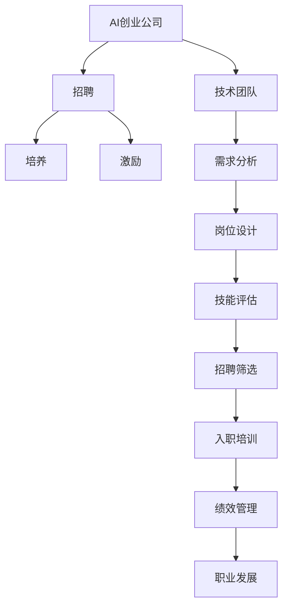

                 

# AI创业公司的技术团队建设：招聘、培养与激励

> 关键词：AI创业公司,技术团队建设,招聘,培养,激励,技术架构,组织结构,人员管理

## 1. 背景介绍

### 1.1 问题由来
随着人工智能(AI)技术的迅猛发展，越来越多的初创公司在AI领域寻求突破。AI技术的成功应用需要跨学科的团队合作，涵盖算法工程师、数据科学家、软件工程师、产品经理等多方面人才。因此，如何高效招聘、培养与激励技术团队，成为AI创业公司面临的重要挑战。

### 1.2 问题核心关键点
AI创业公司的技术团队建设涉及三个关键环节：招聘、培养与激励。每个环节都有其独特的难点：
1. **招聘**：如何在人才市场中甄别出最合适的人才？如何确保招聘流程的高效性？
2. **培养**：如何帮助新员工快速融入团队并提升技能？如何制定有效的培养计划？
3. **激励**：如何设计科学的激励机制，让团队成员保持高度的工作热情和创造力？

### 1.3 问题研究意义
构建高效的技术团队对于AI创业公司的成功至关重要。一个高水平的技术团队能够：
- 推动公司产品的创新和迭代，快速响应市场变化。
- 提高公司技术实力的竞争力，吸引更多的投资和合作。
- 提升团队成员的工作满意度和留存率，降低招聘和培训成本。

本文将系统性地介绍AI创业公司技术团队建设的各个环节，提出针对性的建议和方法，帮助创业公司打造一支高效、创新、具有持续竞争力的技术团队。

## 2. 核心概念与联系

### 2.1 核心概念概述

为更好地理解AI创业公司技术团队的建设过程，本节将介绍几个关键概念：

- **AI创业公司**：专注于人工智能技术创新和应用的公司，可能涉足多个AI子领域，如计算机视觉、自然语言处理、机器人技术等。
- **技术团队**：由各类AI专业人士组成，包括算法工程师、数据科学家、软件工程师、产品经理等，共同负责AI产品的研发和部署。
- **招聘**：从人才市场中筛选符合公司需求的人才，以填补团队空缺。
- **培养**：通过培训、项目实践等方式提升团队成员的技能和知识。
- **激励**：通过薪酬福利、职业发展、工作环境等因素激发团队成员的积极性和创造力。

这些概念之间的逻辑关系可以通过以下Mermaid流程图来展示：



这个流程图展示了这个过程中各个环节的关键逻辑：

1. AI创业公司基于市场需求，设计技术团队的需求。
2. 根据需求，设计技术岗位，进行技能评估。
3. 通过招聘筛选，选择合适的候选人，进行入职培训。
4. 在培养和激励环节，提升团队成员的技能，激发他们的工作热情。

## 3. 核心算法原理 & 具体操作步骤

### 3.1 算法原理概述

AI创业公司技术团队的建设过程，本质上是一个优化问题。目标是构建一个高效、多样、具有高度协同性的技术团队，以推动公司产品的成功和持续创新。这一过程可以分为招聘、培养和激励三个阶段，每个阶段都需要科学的方法和策略。

### 3.2 算法步骤详解

#### 3.2.1 招聘阶段

招聘阶段的核心目标是找到最合适的候选人，满足公司技术需求。具体步骤如下：

**Step 1: 需求分析**
- 明确技术团队的需求，包括技术栈、工作职责、技能要求等。
- 通过调研市场需求，了解当前人才市场的供应情况。

**Step 2: 岗位设计**
- 基于需求分析结果，设计技术岗位，如算法工程师、数据科学家、软件工程师等。
- 确定每个岗位的职责和技能要求，形成详细的岗位描述。

**Step 3: 技能评估**
- 根据岗位要求，制定技能评估标准，如编程能力、项目经验、论文发表等。
- 通过在线测试、面试、项目评估等方式，评估候选人的实际能力。

**Step 4: 招聘筛选**
- 筛选符合技能评估标准的候选人，邀请进行面试。
- 面试应涵盖技术面试、行为面试、团队面试等多种形式，全面评估候选人的综合素质。

**Step 5: 入职培训**
- 为新员工设计系统的入职培训计划，包括技术培训、公司文化介绍、工具使用等。
- 指定导师或资深工程师，帮助新员工快速融入团队。

#### 3.2.2 培养阶段

培养阶段的核心目标是提升团队成员的技能和知识，确保他们能够胜任当前岗位和未来的挑战。具体步骤如下：

**Step 1: 培训计划制定**
- 根据团队成员的技能水平和岗位需求，制定个性化的培训计划。
- 安排内部培训、外部培训、在线课程等多种培训形式。

**Step 2: 项目实践**
- 安排团队成员参与实际项目，通过实战提升技能。
- 设立跨部门合作项目，促进技术团队与其他部门的协作。

**Step 3: 持续反馈**
- 定期进行绩效评估，提供针对性的反馈和改进建议。
- 鼓励团队成员参加行业会议、学术交流，获取最新技术动态。

#### 3.2.3 激励阶段

激励阶段的核心目标是激发团队成员的工作热情和创造力，保持团队的凝聚力和生产力。具体步骤如下：

**Step 1: 薪酬福利设计**
- 根据市场行情，制定合理的薪酬福利方案，吸引和留住优秀人才。
- 提供健康保险、年终奖金、股票期权等福利，增加员工的归属感。

**Step 2: 职业发展**
- 设立明确的职业发展路径，包括晋升机制、培训计划、项目经验等。
- 鼓励团队成员参加行业认证，提升自身竞争力。

**Step 3: 工作环境**
- 打造开放、包容、创新的工作环境，鼓励团队成员自由交流和合作。
- 设立技术分享会、读书会等活动，提升团队的凝聚力和创造力。

### 3.3 算法优缺点

AI创业公司技术团队的建设方法具有以下优点：
1. 科学性：基于系统的需求分析、技能评估和培训计划，确保招聘和培养过程的高效性和针对性。
2. 多样性：通过合理的设计和激励，提升团队的多样性和包容性，促进创新。
3. 灵活性：根据市场需求和技术进展，灵活调整招聘和培养策略，保持团队活力。

同时，该方法也存在一定的局限性：
1. 成本高：高标准的技能评估和持续培训需要大量资源投入。
2. 周期长：从招聘到培养再到激励，整个过程耗时较长，可能影响项目进度。
3. 复杂性：需要综合考虑技术需求、市场动态、员工心理等多方面因素，实施难度较大。

尽管存在这些局限性，但就目前而言，基于系统的技术团队建设方法仍是大规模招聘和培养的有效范式。未来相关研究的重点在于如何进一步降低招聘和培养成本，提高过程的灵活性和效率。

### 3.4 算法应用领域

基于系统的技术团队建设方法，已经在许多成功的AI创业公司得到应用，包括：

1. **OpenAI**：在招聘算法工程师、数据科学家等技术人才时，注重人才的多样性和创新能力，通过定制化的培训计划和激励机制，培养出一批高素质的技术团队。
2. **DeepMind**：通过严格的岗位设计和技能评估，确保招聘到最合适的候选者，并通过内部培训和职业发展计划，持续提升团队的技术水平和创新能力。
3. **NVIDIA**：利用AI技术优化招聘流程，通过数据分析和机器学习，提高招聘效率和准确性。同时，注重团队的多样性和包容性，激发创新活力。
4. **Meta**：通过系统的技术团队建设方法，打造了一支高度协同的AI技术团队，推动公司在AI领域的持续创新和应用。

这些成功案例展示了基于系统的技术团队建设方法在实际应用中的有效性。相信随着技术的不断发展，这一方法将得到更广泛的应用和推广。

## 4. 数学模型和公式 & 详细讲解 & 举例说明

### 4.1 数学模型构建

本节将使用数学语言对AI创业公司技术团队的建设过程进行更加严格的刻画。

假设技术团队需求为 $D$，岗位设计为 $P$，技能评估结果为 $S$，招聘筛选结果为 $I$，入职培训计划为 $T$，绩效管理为 $K$，职业发展路径为 $L$，薪酬福利方案为 $W$。则技术团队建设的数学模型可以表示为：

$$
\begin{aligned}
& \text{Minimize} && \sum_{i=1}^{N} \text{Cost}_i \\
& \text{Subject to} && 
\begin{cases}
P \cap S = \emptyset \\
I \subseteq S \\
T \cap I \neq \emptyset \\
K \subseteq T \\
L \subseteq K \\
W \subseteq L 
\end{cases}
\end{aligned}
$$

其中，$\text{Cost}_i$ 表示第 $i$ 个招聘、培养或激励环节的成本，$N$ 表示环节总数。

### 4.2 公式推导过程

以下我们以招聘和培养过程的数学模型为例，推导相应的优化目标和约束条件。

假设招聘环节的成本函数为 $C_{\text{rec}}$，培养环节的成本函数为 $C_{\text{train}}$。则招聘和培养环节的总成本可以表示为：

$$
C_{\text{total}} = C_{\text{rec}} + C_{\text{train}}
$$

为了最小化总成本，需要找到合适的招聘和培养方案。假设技术团队需求为 $D$，岗位设计为 $P$，技能评估结果为 $S$，招聘筛选结果为 $I$，入职培训计划为 $T$，则招聘和培养过程的优化目标可以表示为：

$$
\text{Minimize} \quad C_{\text{total}} = C_{\text{rec}}(I \subseteq S) + C_{\text{train}}(T \cap I \neq \emptyset)
$$

其中，$I \subseteq S$ 表示招聘的候选人必须通过技能评估；$T \cap I \neq \emptyset$ 表示入职培训计划必须覆盖招聘的候选人。

### 4.3 案例分析与讲解

考虑一家AI创业公司，技术团队需求为算法工程师和数据科学家。岗位设计包括高级算法工程师和数据科学家。技能评估结果包括编程能力、项目经验、论文发表等。招聘筛选结果为符合技能评估标准的候选人。入职培训计划包括技术培训、公司文化介绍、工具使用等。绩效管理包括月度绩效评估、年度绩效评估等。职业发展路径包括晋升机制、培训计划、项目经验等。薪酬福利方案包括健康保险、年终奖金、股票期权等。

为了最小化总成本，公司可以采取以下策略：

1. **技能评估**：基于岗位需求，制定详细的技能评估标准，筛选出符合条件的候选人。
2. **入职培训**：设计系统的入职培训计划，确保新员工快速融入团队。
3. **绩效管理**：定期进行绩效评估，提供针对性的反馈和改进建议。
4. **职业发展**：设立明确的职业发展路径，激励员工持续学习和成长。
5. **薪酬福利**：制定合理的薪酬福利方案，吸引和留住优秀人才。

通过合理的数学模型和策略，公司可以有效地构建高效、多样、具有高度协同性的技术团队。

## 5. 项目实践：代码实例和详细解释说明

### 5.1 开发环境搭建

在进行技术团队建设实践前，我们需要准备好开发环境。以下是使用Python进行PyTorch开发的环境配置流程：

1. 安装Anaconda：从官网下载并安装Anaconda，用于创建独立的Python环境。

2. 创建并激活虚拟环境：
```bash
conda create -n pytorch-env python=3.8 
conda activate pytorch-env
```

3. 安装PyTorch：根据CUDA版本，从官网获取对应的安装命令。例如：
```bash
conda install pytorch torchvision torchaudio cudatoolkit=11.1 -c pytorch -c conda-forge
```

4. 安装各类工具包：
```bash
pip install numpy pandas scikit-learn matplotlib tqdm jupyter notebook ipython
```

完成上述步骤后，即可在`pytorch-env`环境中开始技术团队建设实践。

### 5.2 源代码详细实现

这里我们以招聘和培养过程的代码实现为例。

首先，定义招聘和培养的类：

```python
class Recruitment:
    def __init__(self, skills, costs):
        self.skills = skills
        self.costs = costs
        
    def evaluate_candidates(self, candidates):
        valid_candidates = []
        for candidate in candidates:
            if all(candidate.skill in self.skills for skill in self.skills):
                valid_candidates.append(candidate)
        return valid_candidates

class Training:
    def __init__(self, skills, costs):
        self.skills = skills
        self.costs = costs
        
    def select_trainees(self, candidates):
        selected_trainees = []
        for candidate in candidates:
            if any(skill in candidate.skill for skill in self.skills):
                selected_trainees.append(candidate)
        return selected_trainees

    def train(self, trainees):
        trained_trainees = []
        for trainee in trainees:
            if any(trainee.skill in self.skills for skill in self.skills):
                trained_trainees.append(trainee)
        return trained_trainees
```

然后，定义候选人数据和培训计划数据：

```python
# 候选人数据
class Candidate:
    def __init__(self, name, skills):
        self.name = name
        self.skills = skills

# 培训计划数据
class TrainingPlan:
    def __init__(self, skills, costs):
        self.skills = skills
        self.costs = costs

# 招聘和培养数据
candidates = [
    Candidate('Alice', ['Python', 'TensorFlow', 'NLP']),
    Candidate('Bob', ['Java', 'Machine Learning', 'Data Analysis']),
    Candidate('Charlie', ['C++', 'Computer Vision', 'Optimization'])
]

skills = ['Python', 'TensorFlow', 'NLP', 'Java', 'Machine Learning', 'Data Analysis', 'C++', 'Computer Vision', 'Optimization']

# 招聘和培养成本
costs = {
    Recruitment: {'Python': 1000, 'TensorFlow': 2000, 'NLP': 1500},
    Training: {'Python': 1500, 'TensorFlow': 2000, 'NLP': 1800, 'Java': 2000, 'Machine Learning': 2500, 'Data Analysis': 1800, 'C++': 1500, 'Computer Vision': 2500, 'Optimization': 2000}
}

# 技能评估和入职培训
recruitment = Recruitment(skills, costs)
trainers = Training(skills, costs)

# 筛选符合条件的候选人
valid_candidates = recruitment.evaluate_candidates(candidates)

# 选择候选人员参加入职培训
selected_trainees = trainers.select_trainees(valid_candidates)

# 进行入职培训
trained_trainees = trainers.train(selected_trainees)
```

### 5.3 代码解读与分析

让我们再详细解读一下关键代码的实现细节：

**Recruitment类**：
- `__init__`方法：初始化技能和成本。
- `evaluate_candidates`方法：根据技能评估结果筛选出符合条件的候选人。

**Training类**：
- `__init__`方法：初始化技能和成本。
- `select_trainees`方法：根据培训计划选择符合条件的候选人员。
- `train`方法：对候选人进行入职培训。

**Candidate类**：
- `__init__`方法：初始化候选人的姓名和技能。

**TrainingPlan类**：
- `__init__`方法：初始化技能和成本。

**招聘和培养数据**：
- 定义候选人数据和技能评估结果。
- 定义招聘和培养的成本。
- 使用`Recruitment`和`Training`类进行招聘和培养过程。

可以看到，通过这些类和方法，我们可以系统地实现招聘和培养过程。在实际应用中，还需要进一步优化和扩展这些代码，如增加绩效管理和职业发展的功能，实现更全面的技术团队建设。

## 6. 实际应用场景

### 6.1 智能医疗公司

智能医疗公司需要构建一支多学科的AI技术团队，包括算法工程师、数据科学家、软件工程师等。招聘和培养过程需要充分考虑不同专业背景的人才需求，设计合理的岗位和培训计划。例如，对于医学影像分析项目，需要招聘具备医学知识和图像处理能力的算法工程师，进行专项培训，确保团队能够高效开发出高质量的医疗影像识别系统。

### 6.2 金融科技公司

金融科技公司需要技术团队具备金融知识和机器学习技能，以开发智能投顾、风险管理等系统。招聘和培养过程中需要引入金融背景的人才，提供系统的培训计划，确保团队能够深入理解金融市场的复杂性，开发出实用的金融AI产品。

### 6.3 智慧城市公司

智慧城市公司需要技术团队具备城市管理、物联网、计算机视觉等领域的知识，以开发智能交通、智能安防等应用。招聘和培养过程中需要引入多学科背景的人才，进行交叉培训，确保团队能够跨领域协作，开发出具有创新性的智慧城市解决方案。

### 6.4 未来应用展望

随着AI技术的不断进步，AI创业公司技术团队的建设将面临更多的机遇和挑战。未来，这一领域的发展趋势可能包括以下几个方向：

1. **人工智能与边缘计算的融合**：AI技术将在边缘计算设备上得到应用，技术团队需要具备边缘计算和物联网的知识，开发高效能的AI应用。
2. **跨领域协作的加强**：AI技术将跨界应用到更多领域，技术团队需要具备跨学科的协作能力，推动AI技术的广泛应用。
3. **数据驱动的团队建设**：基于数据分析和机器学习，优化招聘和培养策略，提高团队建设效率。
4. **多样性和包容性的提升**：通过多样性和包容性的招聘和培养，构建更具创新力和协作性的技术团队。

这些趋势将推动AI创业公司技术团队建设进入新的阶段，提升团队的竞争力和创新能力。

## 7. 工具和资源推荐

### 7.1 学习资源推荐

为了帮助开发者系统掌握AI创业公司技术团队的建设过程，这里推荐一些优质的学习资源：

1. **《AI团队建设：从招聘到激励》系列博文**：由AI创业公司HR专家撰写，深入浅出地介绍了AI团队建设的各个环节，包括招聘、培养与激励。

2. **《数据科学与人工智能团队建设》课程**：Coursera上的数据科学课程，涵盖了数据科学团队建设的最佳实践。

3. **《AI团队协作与文化建设》书籍**：总结了AI团队协作与文化建设的经验和方法，帮助团队更好地协同工作。

4. **LinkedIn Learning**：提供丰富的AI团队建设视频课程，涵盖招聘、培养、激励等多个环节。

5. **GitHub**：查找和学习开源项目中的团队建设最佳实践，了解如何高效管理技术团队。

通过这些资源的学习实践，相信你一定能够快速掌握AI创业公司技术团队的建设过程，并用于解决实际的团队建设问题。

### 7.2 开发工具推荐

高效的开发离不开优秀的工具支持。以下是几款用于AI创业公司技术团队建设的常用工具：

1. **GitHub**：版本控制系统，支持代码托管、协作开发、问题跟踪等。
2. **Slack**：团队沟通工具，支持即时消息、文件共享、任务分配等。
3. **Trello**：项目管理工具，支持任务跟踪、进度管理、团队协作等。
4. **Asana**：团队协作工具，支持任务分配、进度跟踪、团队协作等。
5. **Zoom**：视频会议工具，支持团队远程协作和沟通。

合理利用这些工具，可以显著提升技术团队的协作效率和工作质量。

### 7.3 相关论文推荐

AI创业公司技术团队的建设涉及多学科知识，以下是几篇相关的前沿论文，推荐阅读：

1. **《AI创业公司团队建设与管理》**：总结了AI创业公司团队建设的实践经验和教训。

2. **《团队多样性对创新与绩效的影响》**：研究了团队多样性对创新和绩效的影响，提供了团队多样性管理的建议。

3. **《人工智能团队的协作与文化建设》**：介绍了AI团队协作与文化建设的方法和案例。

4. **《数据科学与人工智能团队建设的最佳实践》**：总结了数据科学和人工智能团队建设的最佳实践。

这些论文代表了大规模招聘和培养技术团队的最新进展，有助于提升团队的建设水平和绩效。

## 8. 总结：未来发展趋势与挑战

### 8.1 总结

本文对AI创业公司技术团队的建设过程进行了系统性的介绍。首先，详细阐述了招聘、培养与激励三个关键环节，明确了每个环节的难点和重要性。其次，从原理到实践，介绍了技术团队建设的数学模型和具体步骤，提供了代码实例和详细解释。同时，本文还探讨了技术团队建设在多个行业领域的应用，展示了微调方法的广泛前景。最后，精选了学习资源、开发工具和相关论文，力求为读者提供全方位的技术指引。

通过本文的系统梳理，可以看到，AI创业公司技术团队的建设是一个复杂但高效的系统工程，需要科学的方法和策略。未来，随着技术的不断进步和应用场景的拓展，技术团队建设必将迎来更多的机遇和挑战。

### 8.2 未来发展趋势

展望未来，AI创业公司技术团队的建设将呈现以下几个发展趋势：

1. **数据驱动的团队建设**：通过数据分析和机器学习，优化招聘和培养策略，提高团队建设效率。
2. **多样性和包容性的提升**：通过多样性和包容性的招聘和培养，构建更具创新力和协作性的技术团队。
3. **跨领域协作的加强**：AI技术将跨界应用到更多领域，技术团队需要具备跨学科的协作能力，推动AI技术的广泛应用。
4. **人工智能与边缘计算的融合**：AI技术将在边缘计算设备上得到应用，技术团队需要具备边缘计算和物联网的知识，开发高效能的AI应用。
5. **团队协作与文化建设的加强**：通过团队协作与文化建设，提升团队的凝聚力和创新能力。

以上趋势凸显了AI创业公司技术团队建设的广阔前景。这些方向的探索发展，必将进一步提升技术团队的建设水平和绩效。

### 8.3 面临的挑战

尽管AI创业公司技术团队的建设已经取得了显著进展，但在迈向更加智能化、普适化应用的过程中，仍面临诸多挑战：

1. **人才缺口**：AI领域的高级人才供不应求，如何吸引和留住优秀人才是一个难题。
2. **跨学科协作**：不同学科背景的人才需要高效的沟通和协作，协调好各方需求和进度是一个挑战。
3. **持续学习和培训**：AI技术发展迅速，团队需要持续学习新知识，保持技术竞争力。
4. **工作压力和激励**：AI项目通常时间紧任务重，如何平衡工作压力和激励机制是一个挑战。
5. **团队文化和价值观**：建立健康的工作文化和共同的价值观，提高团队的凝聚力和归属感是一个长期挑战。

面对这些挑战，AI创业公司需要不断优化招聘、培养和激励策略，确保团队高效运作和持续发展。

### 8.4 研究展望

面对AI创业公司技术团队建设面临的挑战，未来的研究需要在以下几个方面寻求新的突破：

1. **多样性和包容性的招聘和培养**：通过多样性和包容性的招聘和培养，构建更具创新力和协作性的技术团队。
2. **数据驱动的团队建设优化**：利用数据分析和机器学习，优化招聘和培养策略，提高团队建设效率。
3. **跨领域协作机制的建立**：建立跨学科的协作机制，促进不同领域人才的协同工作。
4. **人工智能与边缘计算的融合**：推动AI技术在边缘计算设备上的应用，提升AI应用的效率和性能。
5. **团队协作与文化建设**：通过团队协作与文化建设，提升团队的凝聚力和创新能力。

这些研究方向的探索，必将引领AI创业公司技术团队建设迈向更高的台阶，为公司的长期发展和成功奠定坚实的基础。总之，AI创业公司技术团队的建设需要从招聘、培养和激励三个方面全面入手，不断优化和创新，才能在竞争激烈的市场中脱颖而出。

## 9. 附录：常见问题与解答

**Q1：AI创业公司如何选择技术团队成员？**

A: AI创业公司在选择技术团队成员时，应重点关注以下方面：
1. **技术能力**：评估候选人的技术水平和项目经验，确保其能够胜任岗位需求。
2. **文化契合度**：考察候选人的团队合作能力和工作态度，确保其与公司文化契合。
3. **创新能力**：评估候选人的创新思维和解决问题的能力，确保其具备持续创新的潜力。
4. **行业经验**：引入具有行业背景的人才，提升团队的专业能力和市场敏感度。

**Q2：如何设计系统的培训计划？**

A: 设计系统的培训计划应考虑以下要素：
1. **培训内容**：根据岗位需求和技能评估结果，确定培训内容，包括技术培训、项目实践、软技能提升等。
2. **培训形式**：采用内部培训、外部培训、在线课程等多种形式，提供多样化的学习途径。
3. **持续反馈**：定期进行绩效评估，提供针对性的反馈和改进建议，帮助员工持续提升。
4. **激励机制**：设立培训奖、项目奖等激励机制，鼓励员工积极参与培训和学习。

**Q3：如何设计科学的激励机制？**

A: 设计科学的激励机制应考虑以下要素：
1. **薪酬福利**：提供合理的薪酬福利，吸引和留住优秀人才。
2. **职业发展**：设立明确的职业发展路径，包括晋升机制、培训计划、项目经验等，激励员工持续成长。
3. **工作环境**：打造开放、包容、创新的工作环境，增强员工的归属感和满意度。
4. **团队文化**：建立健康的工作文化和共同的价值观，提升团队的凝聚力和归属感。

这些机制需要综合考虑，才能最大化地激发员工的工作热情和创造力。

---

作者：禅与计算机程序设计艺术 / Zen and the Art of Computer Programming

