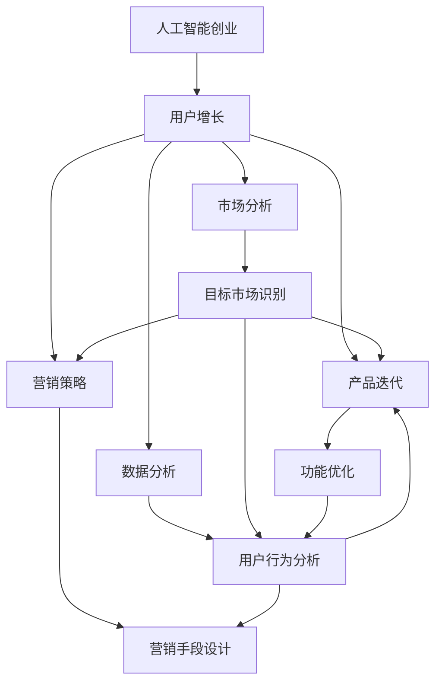

                 

# AI创业公司的用户增长策略

> 关键词：人工智能创业,用户增长,市场分析,产品迭代,数据分析,营销策略

## 1. 背景介绍

### 1.1 问题由来
随着人工智能技术的飞速发展，越来越多的AI创业公司崭露头角，从传统金融、医疗、教育等垂直领域，拓展到消费娱乐、智能家居、智能驾驶等新兴市场。尽管AI技术本身具备强大的创新潜力，但如何将技术优势转化为市场影响力，实现用户的快速增长和商业价值的最大化，却是AI创业公司普遍面临的挑战。

### 1.2 问题核心关键点
AI创业公司的用户增长问题，归根结底是如何在一个竞争激烈的市场中，通过有效的市场分析和产品优化，吸引并保持用户。这其中涉及用户研究、市场分析、产品迭代、数据驱动决策等多个环节。本文将围绕这些关键点，系统阐述AI创业公司用户增长的核心策略和方法。

### 1.3 问题研究意义
研究AI创业公司的用户增长策略，对于AI创业公司明确市场定位、设计用户增长路径、提升运营效率、推动业务发展具有重要意义：

1. 明确市场定位：通过深入的市场分析，帮助AI创业公司精准识别目标用户群体，制定有效的用户增长策略。
2. 设计用户增长路径：结合产品特性和市场需求，设计有针对性的用户增长路径，快速获取并拓展市场份额。
3. 提升运营效率：通过数据驱动的决策方式，优化用户增长过程中的每一个环节，实现资源的最大化利用。
4. 推动业务发展：确保用户增长的可持续性，为AI创业公司的长期发展奠定坚实基础。

## 2. 核心概念与联系

### 2.1 核心概念概述

为更好地理解AI创业公司用户增长的策略，本节将介绍几个密切相关的核心概念：

- **人工智能创业(AI Startups)**：以人工智能技术为核心的初创公司，致力于解决特定行业或领域的问题，提供创新的解决方案。
- **用户增长(User Growth)**：通过市场推广、产品优化、数据驱动等手段，吸引并维持用户的过程，最终实现业务增长。
- **市场分析(Market Analysis)**：对目标市场进行详细的调查研究，包括市场规模、用户需求、竞争格局等，以指导产品和策略的设计。
- **产品迭代(Product Iteration)**：根据用户反馈和市场变化，持续优化和更新产品功能和服务，提升用户体验和满意度。
- **数据分析(Data Analytics)**：通过收集和分析用户数据，识别用户行为模式、需求变化等，辅助产品优化和市场决策。
- **营销策略(Marketing Strategy)**：结合产品特性和市场环境，制定有效的营销手段，提升产品曝光度和用户转化率。

这些核心概念之间的逻辑关系可以通过以下Mermaid流程图来展示：



这个流程图展示了大语言模型的核心概念及其之间的关系：

1. 人工智能创业公司通过市场分析识别目标用户，设计产品功能和营销策略。
2. 产品迭代和数据分析不断优化产品，提升用户体验。
3. 营销策略辅助产品推广，提高用户转化率。
4. 用户增长的效果通过数据分析反馈，指导产品迭代和市场调整。

## 3. 核心算法原理 & 具体操作步骤
### 3.1 算法原理概述

AI创业公司的用户增长，本质上是一个通过市场分析、产品优化和数据驱动决策，不断吸引并保持用户的过程。其核心思想是：

1. **市场分析**：对目标市场进行深入调查，识别用户需求和市场机会。
2. **产品迭代**：根据用户反馈和市场需求，快速迭代优化产品功能和服务。
3. **数据分析**：通过收集和分析用户数据，识别用户行为模式和需求变化，辅助决策。
4. **营销策略**：结合产品特性和市场环境，制定有效的营销手段，提升产品曝光度和用户转化率。

### 3.2 算法步骤详解

基于上述核心思想，AI创业公司的用户增长策略可以概括为以下几个关键步骤：

**Step 1: 市场分析**
- 收集市场调研报告、竞品分析报告、用户问卷等数据。
- 通过问卷调查、访谈等方式，获取目标用户的真实需求和痛点。
- 分析市场规模、用户增长趋势、竞争格局等，确定目标市场。

**Step 2: 产品定位**
- 根据市场分析结果，定义产品的核心功能和价值主张。
- 设计产品原型，进行A/B测试，获取用户反馈。
- 根据反馈优化产品功能和服务，形成初步MVP（最小可行产品）。

**Step 3: 数据分析**
- 在产品发布前，设置必要的追踪机制，收集用户行为数据。
- 利用数据挖掘和机器学习技术，分析用户行为模式和需求变化。
- 利用A/B测试和用户反馈，不断迭代产品优化。

**Step 4: 营销推广**
- 根据数据分析结果，确定目标用户群体的特征和偏好。
- 设计针对不同用户群体的营销策略，包括内容营销、社交媒体营销、电子邮件营销等。
- 利用程序化广告、搜索引擎优化(SEO)等技术，提高产品曝光度。

**Step 5: 用户留存**
- 分析用户流失原因，设计用户留存策略，如个性化推荐、积分激励、会员制度等。
- 定期进行用户满意度调查，及时发现并解决问题。
- 根据用户行为数据，优化产品功能和用户体验。

**Step 6: 扩大市场份额**
- 在初步市场验证基础上，设计更全面的市场推广计划。
- 利用合作伙伴关系和渠道优势，扩大产品覆盖面。
- 持续优化产品功能和用户界面，提升用户体验和满意度。

### 3.3 算法优缺点

AI创业公司的用户增长策略具有以下优点：
1. 数据驱动：通过数据分析和用户反馈，实现精准的市场定位和产品优化。
2. 快速迭代：根据市场变化和用户反馈，快速调整和优化产品，提升用户体验。
3. 资源优化：通过数据分析，识别高价值用户群体，实现资源的最优配置。
4. 竞争优势：通过深入的市场分析和针对性的营销策略，快速获取并保持市场份额。

同时，该策略也存在以下局限性：
1. 资源投入高：数据分析和产品优化需要持续的资源投入，对于资源有限的中小公司可能难以负担。
2. 时间成本高：产品迭代和市场推广需要时间，难以迅速响应市场需求。
3. 用户需求多变：市场和用户需求不断变化，产品需要不断优化，增加复杂度。
4. 技术门槛高：需要一定的数据分析和机器学习技术背景，对于缺乏技术团队的公司可能难以实施。

尽管存在这些局限性，但就目前而言，数据驱动的用户增长策略仍是AI创业公司最主流的选择。未来相关研究的重点在于如何进一步降低用户增长策略对资源的依赖，提高策略的灵活性和效率。

### 3.4 算法应用领域

基于数据驱动的用户增长策略，已经在AI创业公司得到了广泛的应用，覆盖了几乎所有常见场景，例如：

- **金融科技(Fintech)**：利用数据分析和用户反馈，设计符合用户需求的理财、投资、贷款等产品。
- **智能健康(HealthTech)**：通过用户健康数据，提供个性化的健康管理、疾病预防等服务。
- **教育科技(EduTech)**：根据学生学习数据，设计智能推荐、个性化学习等服务，提升教育效果。
- **智能家居(Smart Home)**：利用用户行为数据，提供智能家居控制、安全防范等服务。
- **智慧城市(Smart City)**：通过数据分析和用户反馈，优化城市管理和公共服务，提升居民生活质量。

除了上述这些经典应用外，AI创业公司的用户增长策略也在更多场景中得到创新性地应用，如智能推荐、营销自动化、客户关系管理等，为各行业数字化转型升级提供新的技术路径。

## 4. 数学模型和公式 & 详细讲解  
### 4.1 数学模型构建

为了更好地理解AI创业公司用户增长的数学模型，本节将构建一个基于用户增长模型的简单数学模型，并给出相关的公式推导和案例分析。

假设AI创业公司的目标用户数为 $U_0$，每月新增用户数为 $G$，流失用户数为 $L$，总用户数为 $U_t$。则每月用户增长模型可以表示为：

$$
U_t = U_0 + Gt - Lt
$$

其中 $t$ 表示时间（月），$G$ 和 $L$ 分别为每月新增和流失用户数，$U_0$ 为初始用户数。

## 4.2 公式推导过程

**Step 1: 用户增长模型构建**
$$
U_t = U_0 + Gt - Lt
$$

**Step 2: 用户增长率计算**
$$
\text{User Growth Rate} = \frac{G - L}{U_0}
$$

**Step 3: 用户留存率计算**
$$
\text{User Retention Rate} = \frac{U_t - L}{U_0}
$$

**Step 4: 用户转化率计算**
$$
\text{User Conversion Rate} = \frac{G}{\text{Total Reach}}
$$

其中，Total Reach表示通过营销手段接触到的潜在用户总数。

**Step 5: 用户终身价值计算**
$$
\text{Lifetime Value} = \text{Average Lifetime Spending} \times \text{User Retention Rate} / \text{User Acquisition Cost}
$$

其中，Average Lifetime Spending表示用户在整个生命周期内的平均消费金额，User Acquisition Cost表示获取一个用户的成本。

### 4.3 案例分析与讲解

假设某AI创业公司初始用户数为10万，每月新增用户1万，流失用户0.5万，总用户数增长率为5%。假设每月营销费用为100万，获取一个用户的成本为1000元。假设用户生命周期为12个月，平均每月消费1000元。

**Step 1: 用户增长率计算**
$$
\text{User Growth Rate} = \frac{1 - 0.5}{10} = 0.05
$$

**Step 2: 用户留存率计算**
$$
\text{User Retention Rate} = \frac{U_t - 0.5}{10} = \frac{U_0 + Gt - Lt - 0.5}{10} = 0.95
$$

**Step 3: 用户转化率计算**
$$
\text{User Conversion Rate} = \frac{1}{1000}
$$

**Step 4: 用户终身价值计算**
$$
\text{Lifetime Value} = 1000 \times 12 \times 0.95 / 1000 = 11.4
$$

通过以上计算，可以看出该AI创业公司在目标市场中的用户增长率、用户留存率和用户转化率，以及其营销策略的投入产出比和用户终身价值。

## 5. 项目实践：代码实例和详细解释说明
### 5.1 开发环境搭建

在进行用户增长策略的实践前，我们需要准备好开发环境。以下是使用Python进行数据分析和用户增长的环境配置流程：

1. 安装Anaconda：从官网下载并安装Anaconda，用于创建独立的Python环境。

2. 创建并激活虚拟环境：
```bash
conda create -n user_growth_env python=3.8 
conda activate user_growth_env
```

3. 安装必要的库：
```bash
conda install pandas numpy matplotlib seaborn sklearn scikit-learn plotly
```

4. 安装数据分析工具：
```bash
pip install hdbscan

```

完成上述步骤后，即可在`user_growth_env`环境中开始用户增长的实践。

### 5.2 源代码详细实现

下面我们以一个简单的用户增长分析为例，给出使用Python进行用户增长数据分析的代码实现。

首先，定义用户增长数据：

```python
import pandas as pd

# 假设每月新增用户数和流失用户数
monthly_growth = 1000
monthly_churn = 500

# 假设初始用户数
initial_users = 100000

# 假设用户增长率为5%
user_growth_rate = 0.05

# 假设用户留存率为95%
user_retention_rate = 0.95

# 假设每月营销费用为100万，获取一个用户的成本为1000元
marketing_cost = 1000000
user_acquisition_cost = 1000

# 假设用户生命周期为12个月，平均每月消费1000元
lifetime_span = 12
average_spending = 1000

# 定义用户增长模型
def user_growth(t):
    return initial_users + monthly_growth * t - monthly_churn * t

# 计算不同时间点的用户数
time_points = range(1, 12)
user_counts = [user_growth(t) for t in time_points]

# 计算不同时间点的用户增长率和用户留存率
user_growth_rates = [(user_growth(t) - monthly_churn) / initial_users for t in time_points]
user_retention_rates = [(user_growth(t) - monthly_churn) / initial_users for t in time_points]

# 计算不同时间点的用户转化率和用户终身价值
user_conversion_rates = [monthly_growth / user_growth(t) for t in time_points]
lifetime_values = [average_spending * lifetime_span * user_retention_rate / user_acquisition_cost for t in time_points]

# 创建DataFrame
data = {
    'Time': time_points,
    'User Growth Rate': user_growth_rates,
    'User Retention Rate': user_retention_rates,
    'User Conversion Rate': user_conversion_rates,
    'Lifetime Value': lifetime_values
}
df = pd.DataFrame(data)

# 输出DataFrame
print(df)
```

通过以上代码，可以计算出不同时间点的用户增长率、用户留存率、用户转化率和用户终身价值。

### 5.3 代码解读与分析

让我们再详细解读一下关键代码的实现细节：

**用户增长模型**：
```python
def user_growth(t):
    return initial_users + monthly_growth * t - monthly_churn * t
```

**用户增长率计算**：
```python
user_growth_rates = [(user_growth(t) - monthly_churn) / initial_users for t in time_points]
```

**用户留存率计算**：
```python
user_retention_rates = [(user_growth(t) - monthly_churn) / initial_users for t in time_points]
```

**用户转化率计算**：
```python
user_conversion_rates = [monthly_growth / user_growth(t) for t in time_points]
```

**用户终身价值计算**：
```python
lifetime_values = [average_spending * lifetime_span * user_retention_rate / user_acquisition_cost for t in time_points]
```

通过这些计算，可以全面了解该AI创业公司的用户增长情况，并为后续的市场推广和产品优化提供数据支持。

## 6. 实际应用场景
### 6.1 智能健康平台

智能健康平台可以利用用户健康数据，提供个性化的健康管理、疾病预防等服务。通过用户增长策略，智能健康平台可以持续吸引并保持用户，提升健康服务的质量和覆盖面。

在技术实现上，可以设计多种健康服务产品，如健康监测、疾病预警、在线咨询等。通过用户反馈和行为数据分析，不断优化和更新产品功能，满足用户需求。同时，利用社交媒体、健康科普文章等渠道，进行健康知识的传播和健康服务的推广。

### 6.2 教育科技公司

教育科技公司可以利用用户学习数据，设计智能推荐、个性化学习等服务，提升教育效果。通过用户增长策略，教育科技公司可以持续扩大用户群体，提升教育服务的质量和覆盖面。

在技术实现上，可以设计多种教育服务产品，如在线课程、作业批改、学习社群等。通过用户反馈和行为数据分析，不断优化和更新产品功能，满足用户需求。同时，利用社交媒体、家长沟通渠道等，进行教育服务的推广和用户增长。

### 6.3 智能家居公司

智能家居公司可以利用用户行为数据，提供智能家居控制、安全防范等服务。通过用户增长策略，智能家居公司可以持续吸引并保持用户，提升家居服务的质量和覆盖面。

在技术实现上，可以设计多种家居服务产品，如智能灯光、安防监控、家电控制等。通过用户反馈和行为数据分析，不断优化和更新产品功能，满足用户需求。同时，利用社交媒体、家居装修渠道等，进行家居服务的推广和用户增长。

### 6.4 未来应用展望

随着AI技术的不断发展，基于用户增长的策略将不断演进，呈现以下几个趋势：

1. **多渠道营销**：结合不同渠道的特点，设计更高效的营销策略。例如，通过社交媒体、内容营销、搜索引擎优化等手段，最大化用户曝光和转化。
2. **个性化推荐**：利用用户行为数据，设计个性化的产品推荐和内容推送，提升用户体验和满意度。例如，通过推荐系统，为用户推荐感兴趣的产品和服务。
3. **数据驱动决策**：通过数据分析和机器学习技术，优化用户增长策略，提升决策效率和效果。例如，通过A/B测试，不断迭代优化产品功能和推广策略。
4. **自动化运营**：利用AI技术，实现自动化的用户增长运营，降低人工成本和运营误差。例如，通过聊天机器人自动客服，提升用户满意度。
5. **跨平台整合**：将不同平台的用户数据整合，进行统一的分析和应用。例如，将社交媒体、电子邮件、应用程序等平台的用户数据进行整合，进行全局用户增长管理。

## 7. 工具和资源推荐
### 7.1 学习资源推荐

为了帮助开发者系统掌握用户增长的理论基础和实践技巧，这里推荐一些优质的学习资源：

1. **《增长黑客》**：刘皮影著，系统介绍了增长黑客的核心方法和实战案例。
2. **《数据驱动增长》**：杨不悔著，详细讲解了数据驱动增长策略的理论基础和应用技巧。
3. **《流量花园》**：魏文辉著，深入浅出地介绍了流量获取、用户留存、渠道拓展等增长策略。
4. **《增长之道》**：崔鸿著，系统讲解了增长黑客的核心工具和技术，如A/B测试、用户细分、数据挖掘等。

通过对这些资源的学习实践，相信你一定能够快速掌握用户增长的精髓，并用于解决实际的增长问题。

### 7.2 开发工具推荐

高效的开发离不开优秀的工具支持。以下是几款用于用户增长开发的常用工具：

1. **Google Analytics**：Google提供的网站分析工具，可以追踪和分析用户行为，优化用户增长策略。
2. **Mixpanel**：专为移动应用设计的用户分析工具，可以帮助开发者追踪用户行为，设计个性化推荐和服务。
3. **Hotjar**：用户行为分析工具，可以帮助开发者了解用户真实需求和痛点，优化产品功能。
4. **Google Ads**：Google提供的广告投放平台，可以帮助开发者进行精准营销，获取更多潜在用户。
5. **A/B测试工具**：如Optimizely、VWO等，可以帮助开发者进行A/B测试，优化产品功能和服务。

合理利用这些工具，可以显著提升用户增长的开发效率，加快创新迭代的步伐。

### 7.3 相关论文推荐

用户增长的研究源于学界的持续研究。以下是几篇奠基性的相关论文，推荐阅读：

1. **《A/B Testing in a Nutshell》**：James Best著，详细介绍了A/B测试的核心原理和应用方法。
2. **《Growth Hacking》**：Sebastian Krause著，介绍了增长黑客的核心方法和策略。
3. **《Customer Growth Funnels》**：Mudit Gupta著，详细讲解了增长漏斗的理论基础和应用技巧。
4. **《Growth Analytics》**：Jordan Goldmann著，介绍了增长分析的核心工具和方法。

这些论文代表了大用户增长策略的发展脉络。通过学习这些前沿成果，可以帮助研究者把握学科前进方向，激发更多的创新灵感。

## 8. 总结：未来发展趋势与挑战
### 8.1 总结

本文对AI创业公司用户增长的策略进行了全面系统的介绍。首先阐述了用户增长的背景和核心关键点，明确了用户增长的重要性及其对AI创业公司的意义。其次，从原理到实践，详细讲解了用户增长的数学模型和关键步骤，给出了用户增长任务开发的完整代码实例。同时，本文还广泛探讨了用户增长策略在多个行业领域的应用前景，展示了用户增长范式的巨大潜力。此外，本文精选了用户增长技术的各类学习资源，力求为读者提供全方位的技术指引。

通过本文的系统梳理，可以看到，基于用户增长的策略在AI创业公司中得到了广泛的应用，极大地推动了产品的迭代优化和市场推广。未来，伴随AI技术的不断发展，用户增长的策略将不断演进，为AI创业公司的长期发展提供更强大的动力。

### 8.2 未来发展趋势

展望未来，用户增长策略将呈现以下几个发展趋势：

1. **技术融合**：用户增长策略将与其他AI技术进行更深入的融合，如自然语言处理、计算机视觉、增强现实等，多路径协同发力，共同推动用户增长。
2. **数据驱动**：通过更精细化的数据分析和机器学习，实现更精准的用户定位和营销策略。
3. **实时化**：利用实时数据分析和推荐系统，提升用户增长的实时性和精准性。
4. **个性化**：通过更深入的用户行为分析，实现更个性化的产品推荐和服务。
5. **智能化**：引入智能化的用户增长工具，如自动客服、智能推荐等，提升用户增长效率。

这些趋势凸显了用户增长策略的广阔前景。这些方向的探索发展，必将进一步提升AI创业公司的用户增长效果，为公司的长期发展提供更强大的动力。

### 8.3 面临的挑战

尽管用户增长策略已经取得了瞩目成就，但在迈向更加智能化、普适化应用的过程中，它仍面临着诸多挑战：

1. **数据隐私**：用户数据的隐私和安全问题，一直是用户增长的重要障碍。如何合理收集和使用用户数据，保护用户隐私，将是未来的一大挑战。
2. **资源投入**：用户增长策略需要持续的资源投入，对于资源有限的中小公司可能难以负担。如何优化资源配置，降低成本，将是重要的研究课题。
3. **用户需求变化**：市场和用户需求不断变化，产品需要不断优化，增加复杂度。如何应对多变的市场环境，持续优化产品，将是重要的挑战。
4. **技术门槛**：需要一定的数据分析和机器学习技术背景，对于缺乏技术团队的公司可能难以实施。如何降低技术门槛，实现普适化的用户增长策略，将是重要的研究方向。

尽管存在这些挑战，但用户增长策略的发展趋势表明，它将继续为AI创业公司提供强大的支持，推动公司的长期发展。相信随着学界和产业界的共同努力，这些挑战终将一一被克服，用户增长策略必将在构建人机协同的智能时代中扮演越来越重要的角色。

### 8.4 研究展望

面对用户增长策略所面临的种种挑战，未来的研究需要在以下几个方面寻求新的突破：

1. **用户需求挖掘**：通过更深入的用户行为分析和反馈机制，挖掘更多有价值的用户需求，提供更贴合用户期望的产品和服务。
2. **资源优化**：通过更高效的资源配置和项目管理，降低用户增长的资源投入和成本。
3. **技术创新**：引入更先进的机器学习技术和算法，提升用户增长策略的灵活性和效率。
4. **市场拓展**：通过更有效的市场分析和策略设计，拓展更多垂直领域的用户增长机会。
5. **用户体验优化**：通过更全面和细致的用户体验设计，提升用户满意度和忠诚度。

这些研究方向的探索，必将引领用户增长策略迈向更高的台阶，为AI创业公司的长期发展提供更强大的动力。面向未来，用户增长策略还需要与其他AI技术进行更深入的融合，如自然语言处理、计算机视觉、增强现实等，多路径协同发力，共同推动用户增长。

## 9. 附录：常见问题与解答

**Q1：用户增长的关键因素有哪些？**

A: 用户增长的关键因素包括市场分析、产品定位、数据分析、营销策略等。其中，市场分析帮助明确目标用户群体和市场需求，产品定位指导产品设计和功能优化，数据分析和用户反馈帮助不断优化产品和服务，营销策略帮助提升产品曝光度和用户转化率。

**Q2：如何设计有效的用户增长策略？**

A: 设计有效的用户增长策略，需要从市场分析、产品定位、数据分析、营销策略等多个环节进行综合考虑。首先，通过市场调研和竞品分析，明确目标用户群体和市场需求。然后，根据市场需求，设计符合用户需求的产品和功能。接着，通过数据分析和用户反馈，不断优化产品和服务。最后，制定有效的营销策略，提升产品曝光度和用户转化率。

**Q3：如何应对用户增长中的资源瓶颈？**

A: 应对用户增长中的资源瓶颈，可以从以下几个方面进行优化：
1. 数据共享和整合，避免重复收集和分析。
2. 引入高效的自动化工具，如自动化测试、自动化部署等。
3. 优化产品功能，减少不必要的功能和接口，降低开发成本。
4. 引入云计算资源，降低本地部署和运维成本。
5. 引入开源工具和框架，降低开发和部署成本。

这些措施可以帮助企业有效应对用户增长中的资源瓶颈，提升资源利用效率。

**Q4：如何提升用户增长中的数据隐私保护？**

A: 提升用户增长中的数据隐私保护，可以从以下几个方面进行：
1. 明确数据使用目的，避免过度收集和不必要的数据收集。
2. 采用数据匿名化和加密技术，保护用户隐私。
3. 遵循法律法规和行业标准，如GDPR、CCPA等，确保数据使用的合法合规。
4. 建立数据使用反馈机制，及时发现和处理数据滥用行为。
5. 加强数据使用的透明度和用户知情权，建立用户信任。

这些措施可以帮助企业有效提升数据隐私保护，确保用户增长中的数据安全和用户权益。

**Q5：如何衡量用户增长的效果？**

A: 衡量用户增长的效果，可以从以下几个方面进行：
1. 用户增长率：新用户数量的增长情况。
2. 用户留存率：用户在不同阶段的留存情况，如日留存率、周留存率、月留存率等。
3. 用户转化率：用户从曝光到实际使用的转化率。
4. 用户活跃度：用户在不同时间段内的活跃情况，如日活跃用户数、周活跃用户数等。
5. 用户终身价值：用户在整个生命周期内的消费和贡献情况。

通过这些指标，可以全面评估用户增长的效果，指导后续的市场推广和产品优化。

---

作者：禅与计算机程序设计艺术 / Zen and the Art of Computer Programming

